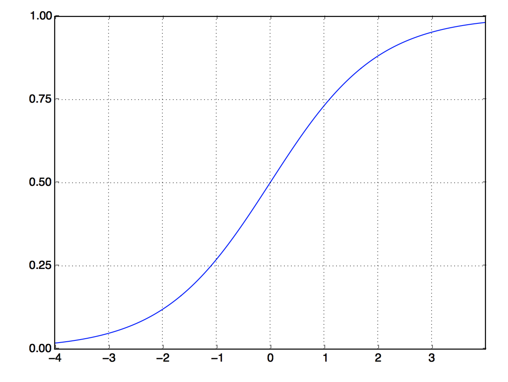

```{r setup, include=FALSE}
  knitr::opts_chunk$set(echo = TRUE, eval = FALSE)
```

## The IMDB dataset

In this example, we'll work with the IMDB dataset: a set of 50,000 highly polarized reviews from the Internet Movie Database. They're split into 25,000 reviews for training and 25,000 reviews for testing, each set consisting of 50% negative and 50% positive reviews.

Why use separate training and test sets? Because you should never test a machine-learning model on the same data that you used to train it! Just because a model performs well on its training data doesn't mean it will perform well on data it has never seen; and what you care about is your model's performance on new data (because you already know the labels of your training data -- obviously 
you don't need your model to predict those). For instance, it's possible that your model could end up merely _memorizing_ a mapping between your training samples and their targets, which would be useless for the task of predicting targets for data the model has never seen before. We'll go over this point in much more detail in the next chapter.

Just like the MNIST dataset, the IMDB dataset comes packaged with Keras. It has already been preprocessed: the reviews (sequences of words) have been turned into sequences of integers, where each integer stands for a specific word in a dictionary.

The following code will load the dataset (when you run it the first time, about 80 MB of data will be downloaded to your machine).

```{r}
library(keras)
imdb <- dataset_imdb(num_words = 10000)
train_data <- imdb$train$x
train_labels <- imdb$train$y
test_data <- imdb$test$x
test_labels <- imdb$test$y
```

The argument `num_words = 10000` means you'll only keep the top 10,000 most frequently occurring words in the training data. Rare words will be discarded. This allows you to work with vector data of manageable size.

The variables `train_data` and `test_data` are lists of reviews; each review is a list of word indices (encoding a sequence of words). `train_labels` and `test_labels` are lists of 0s and 1s, where 0 stands for _negative_ and 1 stands for _positive_:

```{r}
str(train_data[[1]])
```
```
int [1:218] 1 14 22 16 43 530 973 1622 1385 65 ...
```

```{r}
train_labels[[1]]
```
```
[1] 1
```

Because you're restricting yourself to the top 10,000 most frequent words, no word index will exceed 10,000:


```{r}
max(sapply(train_data, max))
```
```
[1] 9999
```

For kicks, here's how you can quickly decode one of these reviews back to English words:

```{r}
# Named list mapping words to an integer index.
word_index <- dataset_imdb_word_index()  
reverse_word_index <- names(word_index)
names(reverse_word_index) <- word_index

# Decodes the review. Note that the indices are offset by 3 because 0, 1, and 
# 2 are reserved indices for "padding," "start of sequence," and "unknown."
decoded_review <- sapply(train_data[[1]], function(index) {
  word <- if (index >= 3) reverse_word_index[[as.character(index - 3)]]
  if (!is.null(word)) word else "?"
})
cat(decoded_review)
```
```
? this film was just brilliant casting location scenery story direction
everyone's really suited the part they played and you could just imagine
being there robert ? is an amazing actor and now the same being director
? father came from the same scottish island as myself so i loved the fact
there was a real connection with this film the witty remarks throughout
the film were great it was just brilliant so much that i bought the film
as soon as it was released for ? and would recommend it to everyone to 
watch and the fly fishing was amazing really cried at the end it was so
sad and you know what they say if you cry at a film it must have been 
good and this definitely was also ? to the two little boy's that played'
the ? of norman and paul they were just brilliant children are often left
out of the ? list i think because the stars that play them all grown up
are such a big profile for the whole film but these children are amazing
and should be praised for what they have done don't you think the whole
story was so lovely because it was true and was someone's life after all
that was shared with us all
```

## Preparing the data

You can't feed lists of integers into a neural network. You have to turn your lists into tensors. There are two ways to do that:

* Pad your lists so that they all have the same length, turn them into an integer tensor of shape `(samples, word_indices)`, and then use as the first layer in your network a layer capable of handling such integer tensors (the "embedding" layer, which we'll cover in detail later in the book).
* One-hot encode your lists to turn them into vectors of 0s and 1s. This would mean, for instance, turning the sequence `[3, 5]` into a 10,000-dimensional vector that would be all 0s except for indices 3 and 5, which would be 1s. Then you could use as the first layer in your network a dense layer, capable of handling floating-point vector data.

Let's go with the latter solution to vectorize the data, which you'll do manually for maximum clarity.

```{r}
vectorize_sequences <- function(sequences, dimension = 10000) {
  # Creates an all-zero matrix of shape (length(sequences), dimension)
  results <- matrix(0, nrow = length(sequences), ncol = dimension) 
  for (i in 1:length(sequences))
    # Sets specific indices of results[i] to 1s
    results[i, sequences[[i]]] <- 1 
  results
}

x_train <- vectorize_sequences(train_data)
x_test <- vectorize_sequences(test_data)
```

Here's what the samples look like now:

```{r}
str(x_train[1,])
```
```
 num [1:10000] 1 1 0 1 1 1 1 1 1 0 ...
```

You should also convert your labels from integer to numeric, which is straightforward:

```{r}
y_train <- as.numeric(train_labels)
y_test <- as.numeric(test_labels)
```

Now the data is ready to be fed into a neural network.

## Building your network

The input data is vectors, and the labels are scalars (1s and 0s): this is the easiest setup you'll ever encounter. A type of network that performs well on such a problem is a simple stack of fully connected ("dense") layers with `relu` activations: `layer_dense(units = 16, activation = "relu")`.

The argument being passed to each dense layer (16) is the number of hidden units of the layer. A _hidden unit_ is a dimension in the representation space of the layer. You may remember from chapter 2 that each such dense layer with a `relu` activation implements the following chain of tensor operations:

*output = relu(dot(W, input) + b)*

Having 16 hidden units means the weight matrix `W` will have shape `(input_dimension, 16)`: the dot product with `W` will project the input data onto a 16-dimensional representation space (and then you'll add the bias vector `b` and apply the `relu` operation). You can intuitively understand the dimensionality of your representation space as "how much freedom you're allowing the network to have when learning internal representations." Having more hidden units (a higher-dimensional representation space) allows your network to learn more-complex representations, but it makes the network more computationally expensive and may lead to learning unwanted patterns (patterns that 
will improve performance on the training data but not on the test data).

There are two key architecture decisions to be made about such stack of dense layers:

* How many layers to use
* How many hidden units to choose for each layer

In chapter 4, you'll learn formal principles to guide you in making these choices. For the time being, you'll have to trust me with the following architecture choice:

* Two intermediate layers with 16 hidden units each
* A third layer that will output the scalar prediction regarding the sentiment of the current review

The intermediate layers will use `relu` as their activation function, and the final layer will use a sigmoid activation so as to output a probability (a score between 0 and 1, indicating how likely the sample is to have the target "1": how likely the review is to be positive). A `relu` (rectified linear unit) is a function meant to zero out negative values.

{width=60%}


A sigmoid "squashes" arbitrary values into the `[0, 1]` interval, outputting something that can be interpreted as a probability.

{width=60%}

Here's what the network looks like.

{width=60%}

Here's the Keras implementation, similar to the MNIST example you saw previously.

```{r}
library(keras)

model <- keras_model_sequential() %>% 
  layer_dense(units = 16, activation = "relu", input_shape = c(10000)) %>% 
  layer_dense(units = 16, activation = "relu") %>% 
  layer_dense(units = 1, activation = "sigmoid")
```

### Activation Functions

Note that without an activation function like `relu` (also called a _non-linearity_), the dense layer would consist of two linear operations -- a dot product and an addition:

*output = dot(W, input) + b*

So the layer could only learn _linear transformations_ (affine transformations) of the input data: the _hypothesis space_ of the layer  would be the set of all possible linear transformations of the input data into a 16-dimensional space. Such a hypothesis space is too restricted and wouldn't benefit from multiple layers of representations, because a deep stack of linear layers would still implement a linear operation: adding more layers wouldn't extend the hypothesis space.

In order to get access to a much richer hypothesis space that would benefit from deep representations, you need a non-linearity, or  activation function. `relu` is the most popular activation function in deep learning, but there are many other candidates, which all come  with similarly strange names: `prelu`, `elu`, and so on.

### Loss Function and Optimizer

Finally, you need to choose a loss function and an optimizer. Because you're facing a binary classification problem and the output of your network is a probability (you end your network with a single-unit layer with a sigmoid activation), it's best to use the `binary_crossentropy` loss. It isn't the only viable choice: you could use, for instance, `mean_squared_error`. But crossentropy is usually the best choice when you're dealing with models that output probabilities. _Crossentropy_ is a quantity from the field of Information Theory that measures the distance between probability distributions or, in this case, between the ground-truth distribution and your predictions.

Here's the step where you configure the model with the `rmsprop` optimizer and the `binary_crossentropy` loss function. Note that you'll also monitor accuracy during training.

```{r}
model %>% compile(
  optimizer = "rmsprop",
  loss = "binary_crossentropy",
  metrics = c("accuracy")
)
```

You're passing your optimizer, loss function, and metrics as strings, which is possible because `rmsprop`, `binary_crossentropy`, and `accuracy` are packaged as part of Keras. Sometimes you may want to configure the parameters of your optimizer or pass a custom loss function or metric function. The former can be done by passing an optimizer instance as the `optimizer` argument:

```{r}
model %>% compile(
  optimizer = optimizer_rmsprop(lr=0.001),
  loss = "binary_crossentropy",
  metrics = c("accuracy")
) 
```

Custom loss and metrics functions can be provided by passing function objects as the `loss` and/or `metrics` arguments

```{r}
model %>% compile(
  optimizer = optimizer_rmsprop(lr = 0.001),
  loss = loss_binary_crossentropy,
  metrics = metric_binary_accuracy
) 
```

### Validating your approach

In order to monitor during training the accuracy of the model on data it has never seen before, you'll create a validation set by setting apart 10,000 samples from the original training data.

```{r}
val_indices <- 1:10000

x_val <- x_train[val_indices,]
partial_x_train <- x_train[-val_indices,]

y_val <- y_train[val_indices]
partial_y_train <- y_train[-val_indices]
```

You'll now train the model for 20 epochs (20 iterations over all samples in the `x_train` and `y_train` tensors), in mini-batches of 512 samples. At the same time, you'll monitor loss and accuracy on the 10,000 samples that you set apart. You do so by passing the validation data as the `validation_data` argument.

```{r}
model %>% compile(
  optimizer = "rmsprop",
  loss = "binary_crossentropy",
  metrics = c("accuracy")
)

history <- model %>% fit(
  partial_x_train,
  partial_y_train,
  epochs = 20,
  batch_size = 512,
  validation_data = list(x_val, y_val)
)
```


On CPU, this will take less than 2 seconds per epoch -- training is over in 20 seconds. At the end of every epoch, there is a slight pause as the model computes its loss and accuracy on the 10,000 samples of the validation data.

Note that the call to `fit()` returns a `history` object. The `history` object has a `plot()` method that enables us to visualize the training and validation metrics by epoch:

```{r}
plot(history)
```
{width=100%}

The accuracy is plotted on the top panel and the loss on the bottom panel. Note that your own results may vary slightly due to a different random initialization of your network.

As you can see, the training loss decreases with every epoch, and the training accuracy increases with every epoch. That's what you would expect when running a gradient-descent optimization -- the quantity you're trying to minimize should be less with every iteration. But that isn't the case for the validation loss and accuracy: they seem to peak at the fourth epoch. This is an example of what we warned against earlier: a model that performs better on the training data isn't necessarily a model that will do better on data it has never seen before. In precise terms, what you're seeing is _overfitting_: after the second epoch, you're overoptimizing on the training data, and you end up learning representations that are specific to the training data and don't generalize to data outside of the training set.

In this case, to prevent overfitting, you could stop training after three epochs. In general, you can use a range of techniques to mitigate overfitting,which we'll cover in chapter 4.

Let's train a new network from scratch for four epochs and then evaluate it on the test data.

```{r}
model <- keras_model_sequential() %>% 
  layer_dense(units = 16, activation = "relu", input_shape = c(10000)) %>% 
  layer_dense(units = 16, activation = "relu") %>% 
  layer_dense(units = 1, activation = "sigmoid")

model %>% compile(
  optimizer = "rmsprop",
  loss = "binary_crossentropy",
  metrics = c("accuracy")
)

model %>% fit(x_train, y_train, epochs = 4, batch_size = 512)
results <- model %>% evaluate(x_test, y_test)
```

```{r}
results
```
```
$loss
[1] 0.2900235

$acc
[1] 0.88512
```

This fairly naive approach achieves an accuracy of 88%. With state-of-the-art approaches, you should be able to get close to 95%.

## Generating predictions

After having trained a network, you'll want to use it in a practical setting. You can generate the likelihood of reviews being positive by using the `predict` method:


```{r}
model %>% predict(x_test[1:10,])
```
```
 [1,] 0.92306918
 [2,] 0.84061098
 [3,] 0.99952853
 [4,] 0.67913240
 [5,] 0.73874789
 [6,] 0.23108074
 [7,] 0.01230567
 [8,] 0.04898361
 [9,] 0.99017477
[10,] 0.72034937
```

As you can see, the network is confident for some samples (0.99 or more, or 0.01 or less) but less confident for others (0.7, 0.2). 

## Further experiments

The following experiments will help convince you that the architecture choices you've made are all fairly reasonable, although there's still room for improvement.

* You used two hidden layers. Try using one or three hidden layers, and see how doing so affects validation and test accuracy.
* Try using layers with more hidden units or fewer hidden units: 32 units, 64 units, and so on.
* Try using the `mse` loss function instead of `binary_crossentropy`.
* Try using the `tanh` activation (an activation that was popular in the early days of neural networks) instead of `relu`.

## Wrapping up

Here's what you should take away from this example:

* You usually need to do quite a bit of preprocessing on your raw data in order to be able to feed it -- as tensors -- into a neural network. Sequences of words can be encoded as binary vectors, but there are other encoding options, too.
* Stacks of dense layers with `relu` activations can solve a wide range of problems (including sentiment classification), and you'll likely use them frequently.
* In a binary classification problem (two output classes), your network should end with a dense layer with one unit and a `sigmoid` activation: the output of your network should be a scalar between 0 and 1, encoding a probability.
* With such a scalar sigmoid output on a binary classification problem, the loss function you should use is `binary_crossentropy`.
* The `rmsprop` optimizer is generally a good enough choice, whatever your problem. That's one less thing for you to worry about.
* As they get better on their training data, neural networks eventually start overfitting and end up obtaining increasingly worse results on data they've
never seen before. Be sure to always monitor performance on data that is outside of the training set.


