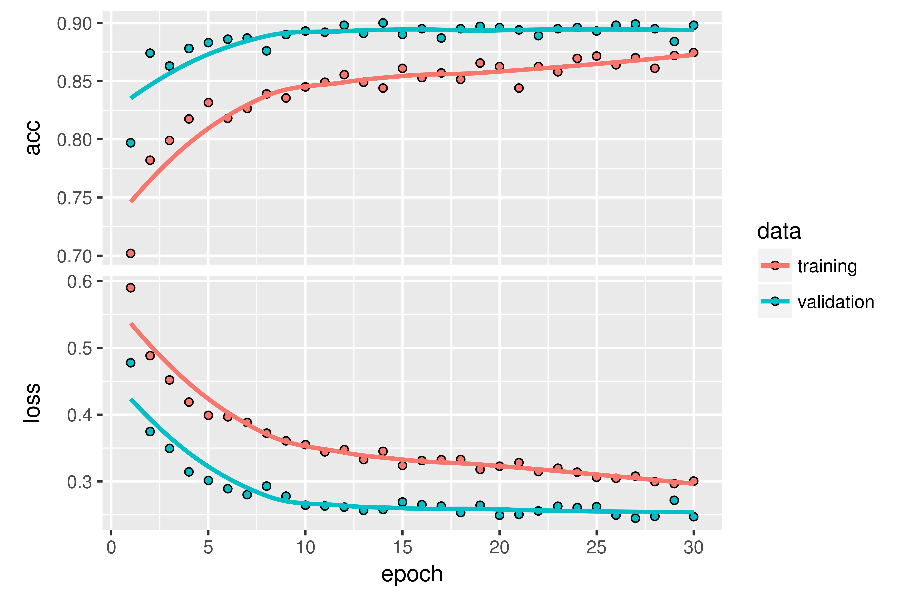
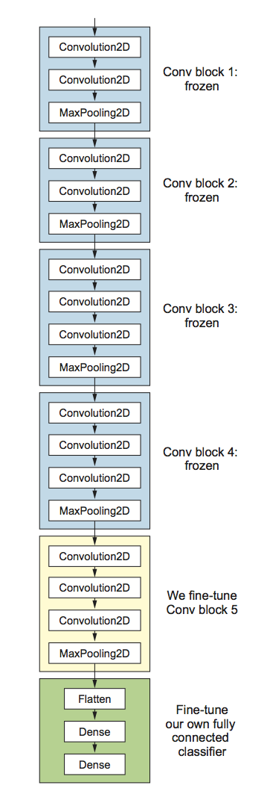

```{r setup, include=FALSE}
  knitr::opts_chunk$set(echo = TRUE, eval = FALSE)
```


## Training a convnet with a small dataset

Having to train an image-classification model using very little data is a common situation, which you'll likely encounter in practice if you ever do computer vision in a professional context. A "few" samples can mean anywhere from a few hundred to a few tens of thousands of images. As a practical example, we'll focus on classifying images as dogs or cats, in a dataset containing 4,000 pictures of cats and dogs (2,000 cats, 2,000 dogs). We'll use 2,000 pictures for training -- 1,000 for validation, and 1,000 for testing.

In Chapter 5 of the [Deep Learning with R](https://www.manning.com/books/deep-learning-with-r) book we review three techniques for tackling this problem. The first of these is training a small model from scratch on what little data you have (which achieves an accuracy of 82%). Subsequently we use _feature extraction with a pretrained network_ (resulting in an accuracy of 90%) and _fine-tuning a pretrained network_ (with a final accuracy of 97%). In this post we'll cover only the second and third techniques.

### The relevance of deep learning for small-data problems

You'll sometimes hear that deep learning only works when lots of data is available. This is valid in part: one fundamental characteristic of deep learning is that it can find interesting features in the training data on its own, without any need for manual feature engineering, and this can only be achieved when lots of training examples are available. This is especially true for problems where the input samples are very high-dimensional, like images.

But what constitutes lots of samples is relative -- relative to the size and depth of the network you're trying to train, for starters. It isn't possible to train a convnet to solve a complex problem with just a few tens of samples, but a few hundred can potentially suffice if the model is small and well regularized and the task is simple. Because convnets learn local, translation-invariant features, they're highly data efficient on perceptual problems. Training a convnet from scratch on a very small image dataset will still yield reasonable results despite a relative lack of data, without the need for any custom feature engineering. You'll see this in action in this section.

What's more, deep-learning models are by nature highly repurposable: you can take, say, an image-classification or speech-to-text model trained on a large-scale dataset and reuse it on a significantly different problem with only minor changes. Specifically, in the case of computer vision, many pretrained models (usually trained on the ImageNet dataset) are now publicly available for download and can be used to bootstrap powerful vision models out of very little data. That's what you'll do in the next section. Let's start by getting your hands on the data.

## Downloading the data

The Dogs vs. Cats dataset that you'll use isn't packaged with Keras. It was made available by Kaggle as part of a computer-vision competition in late 2013, back when convnets weren't mainstream. You can download the original dataset from https://www.kaggle.com/c/dogs-vs-cats/data (you'll need to create a Kaggle account if you don't already have one -- don't worry, the process is painless).

The pictures are medium-resolution color JPEGs. Here are some examples:

{width=80%}


Unsurprisingly, the dogs-versus-cats Kaggle competition in 2013 was won by entrants who used convnets. The best entries achieved up to 95% accuracy. Below you'll end up with a 97% accuracy, even though you'll train your models on less than 10% of the data that was available to the competitors.

This dataset contains 25,000 images of dogs and cats (12,500 from each class) and is 543 MB (compressed). After downloading and uncompressing it, you'll create a new dataset containing three subsets: a training set with 1,000 samples of each class, a validation set with 500 samples of each class, and a test set with 500 samples of each class.

Following is the code to do this:

```{r}
original_dataset_dir <- "~/Downloads/kaggle_original_data"

base_dir <- "~/Downloads/cats_and_dogs_small"
dir.create(base_dir)

train_dir <- file.path(base_dir, "train")
dir.create(train_dir)
validation_dir <- file.path(base_dir, "validation")
dir.create(validation_dir)
test_dir <- file.path(base_dir, "test")
dir.create(test_dir)

train_cats_dir <- file.path(train_dir, "cats")
dir.create(train_cats_dir)

train_dogs_dir <- file.path(train_dir, "dogs")
dir.create(train_dogs_dir)

validation_cats_dir <- file.path(validation_dir, "cats")
dir.create(validation_cats_dir)

validation_dogs_dir <- file.path(validation_dir, "dogs")
dir.create(validation_dogs_dir)

test_cats_dir <- file.path(test_dir, "cats")
dir.create(test_cats_dir)

test_dogs_dir <- file.path(test_dir, "dogs")
dir.create(test_dogs_dir)

fnames <- paste0("cat.", 1:1000, ".jpg")
file.copy(file.path(original_dataset_dir, fnames), 
          file.path(train_cats_dir)) 

fnames <- paste0("cat.", 1001:1500, ".jpg")
file.copy(file.path(original_dataset_dir, fnames), 
          file.path(validation_cats_dir))

fnames <- paste0("cat.", 1501:2000, ".jpg")
file.copy(file.path(original_dataset_dir, fnames),
          file.path(test_cats_dir))

fnames <- paste0("dog.", 1:1000, ".jpg")
file.copy(file.path(original_dataset_dir, fnames),
          file.path(train_dogs_dir))

fnames <- paste0("dog.", 1001:1500, ".jpg")
file.copy(file.path(original_dataset_dir, fnames),
          file.path(validation_dogs_dir)) 

fnames <- paste0("dog.", 1501:2000, ".jpg")
file.copy(file.path(original_dataset_dir, fnames),
          file.path(test_dogs_dir))
```


## Using a pretrained convnet

A common and highly effective approach to deep learning on small image datasets is to use a pretrained network. A _pretrained network_ is a saved network that was previously trained on a large dataset, typically on a large-scale image-classification task. If this original dataset is large enough and general enough, then the spatial hierarchy of features learned by the pretrained network can effectively act as a generic model of the visual world, and hence its features can prove useful for many different computer-vision problems, even though these new problems may involve completely different classes than those of the original task. For instance, you might train a network on ImageNet (where classes are mostly animals and everyday objects) and then repurpose this trained network for something as remote as identifying furniture items in images. Such portability of learned features across different problems is a key advantage of deep learning compared to many older, shallow-learning approaches, and it makes deep learning very effective for small-data problems.

In this case, let's consider a large convnet trained on the ImageNet dataset (1.4 million labeled images and 1,000 different classes). ImageNet contains many animal classes, including different species of cats and dogs, and you can thus expect to perform well on the dogs-versus-cats classification problem.

You'll use the [VGG16 architecture](https://arxiv.org/abs/1409.1556), developed by Karen Simonyan and Andrew Zisserman in 2014; it's a simple and widely used convnet architecture for ImageNet. Although it's an older model, far from the current state of the art and somewhat heavier than many other recent models, I chose it because its architecture is similar to what you're already familiar with and is easy to understand without introducing any new concepts. This may be your first encounter with one of these cutesy model names -- VGG, ResNet, Inception, Inception-ResNet, Xception, and so on; you'll get used to them, because they will come up frequently if you keep doing deep learning for computer vision.

There are two ways to use a pretrained network: _feature extraction_ and _fine-tuning_. We'll cover both of them. Let's start with feature extraction.

### Feature extraction

Feature extraction consists of using the representations learned by a previous network to extract interesting features from new samples. These features are then run through a new classifier, which is trained from scratch.

As you saw previously, convnets used for image classification comprise two parts: they start with a series of pooling and convolution layers, and they end with a densely connected classifier. The first part is called the _convolutional base_ of the model. In the case of convnets, feature extraction consists of taking the convolutional base of a previously trained network, running the new data through it, and training a new classifier on top of the output.

{width=80%}

Why only reuse the convolutional base? Could you reuse the densely connected classifier as well? In general, doing so should be avoided. The reason is that the representations learned by the convolutional base are likely to be more generic and therefore more reusable: the feature maps of a convnet are presence maps of generic concepts over a picture, which is likely to be useful regardless of the computer-vision problem at hand. But the representations learned by the classifier will necessarily be specific to the set of classes on which the model was trained -- they will only contain information about the presence probability of this or that class in the entire picture. Additionally, representations found in densely connected layers no longer contain any information about _where_ objects are located in the input image: these layers get rid of the notion of space, whereas the object location is still described by convolutional  feature maps. For problems where object location matters, densely connected features are largely useless.

Note that the level of generality (and therefore reusability) of the representations extracted by specific convolution layers depends on the depth of the layer in the model. Layers that come earlier in the model extract local, highly generic feature maps (such as visual edges, colors, and textures), whereas layers that are higher up extract more-abstract concepts (such as "cat ear" or "dog eye"). So if your new dataset differs a lot from the dataset on which the original model was trained, you may be better off using only the first few layers of the model to do feature extraction, rather than using the entire convolutional base.

In this case, because the ImageNet class set contains multiple dog and cat classes, it's likely to be beneficial to reuse the information contained in the densely connected layers of the original model. But we'll choose not to, in order to cover the more general case where the class set of the new problem doesn't overlap the class set of the original model. 

Let's put this in practice by using the convolutional base of the VGG16 network, trained on ImageNet, to extract interesting features from cat and dog images, and then train a dogs-versus-cats classifier on top of these features.

The VGG16 model, among others, comes prepackaged with Keras. Here's the list of image-classification models (all pretrained on the ImageNet dataset) that are available as part of Keras:

* Xception
* Inception V3
* ResNet50
* VGG16
* VGG19
* MobileNet

Let's instantiate the VGG16 model.

```{r}
library(keras)

conv_base <- application_vgg16(
  weights = "imagenet",
  include_top = FALSE,
  input_shape = c(150, 150, 3)
)
```

You pass three arguments to the function:

* `weights` specifies the weight checkpoint from which to initialize the model.
* `include_top` refers to including (or not) the densely connected classifier on top of the network. By default, this densely connected classifier corresponds to the 1,000 classes from ImageNet. Because you intend to use your own densely connected classifier (with only two classes: `cat` and `dog`), you don't need to include it.
* `input_shape` is the shape of the image tensors that you'll feed to the network. This argument is purely optional: if you don't pass it, the network will be able to process inputs of any size.

Here's the detail of the architecture of the VGG16 convolutional base. It's similar to the simple convnets you're already familiar with:

```{r}
summary(conv_base)
```
```
Layer (type)                     Output Shape          Param #  
================================================================
input_1 (InputLayer)             (None, 150, 150, 3)   0       
________________________________________________________________
block1_conv1 (Convolution2D)     (None, 150, 150, 64)  1792     
________________________________________________________________
block1_conv2 (Convolution2D)     (None, 150, 150, 64)  36928    
________________________________________________________________
block1_pool (MaxPooling2D)       (None, 75, 75, 64)    0        
________________________________________________________________
block2_conv1 (Convolution2D)     (None, 75, 75, 128)   73856    
________________________________________________________________
block2_conv2 (Convolution2D)     (None, 75, 75, 128)   147584   
________________________________________________________________
block2_pool (MaxPooling2D)       (None, 37, 37, 128)   0        
________________________________________________________________
block3_conv1 (Convolution2D)     (None, 37, 37, 256)   295168   
________________________________________________________________
block3_conv2 (Convolution2D)     (None, 37, 37, 256)   590080   
________________________________________________________________
block3_conv3 (Convolution2D)     (None, 37, 37, 256)   590080   
________________________________________________________________
block3_pool (MaxPooling2D)       (None, 18, 18, 256)   0        
________________________________________________________________
block4_conv1 (Convolution2D)     (None, 18, 18, 512)   1180160  
________________________________________________________________
block4_conv2 (Convolution2D)     (None, 18, 18, 512)   2359808  
________________________________________________________________
block4_conv3 (Convolution2D)     (None, 18, 18, 512)   2359808  
________________________________________________________________
block4_pool (MaxPooling2D)       (None, 9, 9, 512)     0        
________________________________________________________________
block5_conv1 (Convolution2D)     (None, 9, 9, 512)     2359808  
________________________________________________________________
block5_conv2 (Convolution2D)     (None, 9, 9, 512)     2359808  
________________________________________________________________
block5_conv3 (Convolution2D)     (None, 9, 9, 512)     2359808  
________________________________________________________________
block5_pool (MaxPooling2D)       (None, 4, 4, 512)     0        
================================================================
Total params: 14,714,688
Trainable params: 14,714,688
Non-trainable params: 0
```

The final feature map has shape `(4, 4, 512)`. That's the feature on top of which you'll stick a densely connected classifier.

At this point, there are two ways you could proceed: 

* Running the convolutional base over your dataset, recording its output to an array on disk, and then using this data as input to a standalone, densely connected classifier similar to those you saw in part 1 of this book. This solution is fast and cheap to run, because it only requires running the convolutional base once for every input image, and the convolutional base is by far the most expensive part of the pipeline. But for the same reason, this technique won't allow you to use data augmentation.

* Extending the model you have (`conv_base`) by adding dense layers on top, and running the whole thing end to end on the input data. This will allow you to use data augmentation, because every input image goes through the convolutional base every time it's seen by the model. But for the same reason, this technique is far more expensive than the first.

In this post we'll cover the second technique in detail (in the book we cover both). Note that this technique is so expensive that you should only attempt it if you have access to a GPU -- it's absolutely intractable on a CPU. 

### Feature extraction with data augmentation

Because models behave just like layers, you can add a model (like `conv_base`) to a sequential model just like you would add a layer.

```{r}
model <- keras_model_sequential() %>% 
  conv_base %>% 
  layer_flatten() %>% 
  layer_dense(units = 256, activation = "relu") %>% 
  layer_dense(units = 1, activation = "sigmoid")
```

This is what the model looks like now:

```{r}
summary(model)
```
```
Layer (type)                     Output Shape          Param #  
================================================================
vgg16 (Model)                    (None, 4, 4, 512)     14714688                                     
________________________________________________________________
flatten_1 (Flatten)              (None, 8192)          0        
________________________________________________________________
dense_1 (Dense)                  (None, 256)           2097408  
________________________________________________________________
dense_2 (Dense)                  (None, 1)             257      
================================================================
Total params: 16,812,353
Trainable params: 16,812,353
Non-trainable params: 0
```

As you can see, the convolutional base of VGG16 has 14,714,688 parameters, which is very large. The classifier you're adding on top has 2 million parameters.

Before you compile and train the model, it's very important to freeze the convolutional base. _Freezing_ a layer or set of layers means preventing their weights from being updated during training. If you don't do this, then the representations that were previously learned by the convolutional base will be modified during training. Because the dense layers on top are randomly initialized, very large weight updates would be propagated through the network, effectively destroying the representations previously learned.

In Keras, you freeze a network using the `freeze_weights()` function:

```{r}
length(model$trainable_weights)
```
```
[1] 30
```

```{r}
freeze_weights(conv_base)
length(model$trainable_weights)
```
```
[1] 4
```

With this setup, only the weights from the two dense layers that you added will be trained. That's a total of four weight tensors: two per layer (the main weight matrix and the bias vector). Note that in order for these changes to take effect, you must first compile the model. If you ever modify weight trainability after compilation, you should then recompile the model, or these changes will be ignored.

#### Using data augmentation

Overfitting is caused by having too few samples to learn from, rendering you unable to train a model that can generalize to new data. Given infinite data, your model would be exposed to every possible aspect of the data distribution at hand: you would never overfit. Data augmentation takes the approach of generating more training data from existing training samples, by _augmenting_ the samples via a number of random transformations that yield believable-looking images. The goal is that at training time, your model will never see the exact same picture twice. This helps expose the model to more aspects of the data and generalize better.

In Keras, this can be done by configuring a number of random transformations to be performed on the images read by an `image_data_generator()`. For example:


```{r}
train_datagen = image_data_generator(
  rescale = 1/255,
  rotation_range = 40,
  width_shift_range = 0.2,
  height_shift_range = 0.2,
  shear_range = 0.2,
  zoom_range = 0.2,
  horizontal_flip = TRUE,
  fill_mode = "nearest"
)
```

These are just a few of the options available (for more, see the Keras documentation). Let's quickly go over this code:

* `rotation_range` is a value in degrees (0–180), a range within which to randomly rotate pictures.
* `width_shift` and `height_shift` are ranges (as a fraction of total width or height) within which to randomly translate pictures vertically or horizontally.
* `shear_range` is for randomly applying shearing transformations.
* `zoom_range` is for randomly zooming inside pictures.
* `horizontal_flip` is for randomly flipping half the images horizontally -- relevant when there are no assumptions of horizontal asymmetry (for example, real-world pictures).
* `fill_mode` is the strategy used for filling in newly created pixels, which can appear after a rotation or a width/height shift.

Now we can train our model using the image data generator:

```{r}
# Note that the validation data shouldn't be augmented!
test_datagen <- image_data_generator(rescale = 1/255)  

train_generator <- flow_images_from_directory(
  train_dir,                  # Target directory  
  train_datagen,              # Data generator
  target_size = c(150, 150),  # Resizes all images to 150 × 150
  batch_size = 20,
  class_mode = "binary"       # binary_crossentropy loss for binary labels
)

validation_generator <- flow_images_from_directory(
  validation_dir,
  test_datagen,
  target_size = c(150, 150),
  batch_size = 20,
  class_mode = "binary"
)

model %>% compile(
  loss = "binary_crossentropy",
  optimizer = optimizer_rmsprop(lr = 2e-5),
  metrics = c("accuracy")
)

history <- model %>% fit_generator(
  train_generator,
  steps_per_epoch = 100,
  epochs = 30,
  validation_data = validation_generator,
  validation_steps = 50
)
```

Let's plot the results. As you can see, you reach a validation accuracy of about 90%. 



### Fine-tuning

Another widely used technique for model reuse, complementary to feature extraction, is _fine-tuning_ 
Fine-tuning consists of unfreezing a few of the top layers of a frozen model base used for feature extraction, and jointly training both the newly added part of the model (in this case, the fully connected classifier) and these top layers. This is called _fine-tuning_ because it slightly adjusts the more abstract 
representations of the model being reused, in order to make them more relevant for the problem at hand.

{width=60%}


I stated earlier that it's necessary to freeze the convolution base of VGG16 in order to be able to train a randomly initialized classifier on top. For the same reason, it's only possible to fine-tune the top layers of the convolutional base once the classifier on top has already been trained. If the classifier isn't already trained, then the error signal propagating through the network during training will be too large, and the representations previously learned by the layers being fine-tuned will be destroyed. Thus the steps for fine-tuning a network are as follows:

* Add your custom network on top of an already-trained base network.
* Freeze the base network.
* Train the part you added.
* Unfreeze some layers in the base network.
* Jointly train both these layers and the part you added.

You already completed the first three steps when doing feature extraction. Let's proceed with step 4: you'll unfreeze your `conv_base` and then freeze individual layers inside it.

As a reminder, this is what your convolutional base looks like:

```{r}
summary(conv_base)
```

```
Layer (type)                     Output Shape          Param #  
================================================================
input_1 (InputLayer)             (None, 150, 150, 3)   0        
________________________________________________________________
block1_conv1 (Convolution2D)     (None, 150, 150, 64)  1792     
________________________________________________________________
block1_conv2 (Convolution2D)     (None, 150, 150, 64)  36928    
________________________________________________________________
block1_pool (MaxPooling2D)       (None, 75, 75, 64)    0        
________________________________________________________________
block2_conv1 (Convolution2D)     (None, 75, 75, 128)   73856    
________________________________________________________________
block2_conv2 (Convolution2D)     (None, 75, 75, 128)   147584   
________________________________________________________________
block2_pool (MaxPooling2D)       (None, 37, 37, 128)   0        
________________________________________________________________
block3_conv1 (Convolution2D)     (None, 37, 37, 256)   295168   
________________________________________________________________
block3_conv2 (Convolution2D)     (None, 37, 37, 256)   590080   
________________________________________________________________
block3_conv3 (Convolution2D)     (None, 37, 37, 256)   590080   
________________________________________________________________
block3_pool (MaxPooling2D)       (None, 18, 18, 256)   0        
________________________________________________________________
block4_conv1 (Convolution2D)     (None, 18, 18, 512)   1180160  
________________________________________________________________
block4_conv2 (Convolution2D)     (None, 18, 18, 512)   2359808  
________________________________________________________________
block4_conv3 (Convolution2D)     (None, 18, 18, 512)   2359808  
________________________________________________________________
block4_pool (MaxPooling2D)       (None, 9, 9, 512)     0        
________________________________________________________________
block5_conv1 (Convolution2D)     (None, 9, 9, 512)     2359808  
________________________________________________________________
block5_conv2 (Convolution2D)     (None, 9, 9, 512)     2359808  
________________________________________________________________
block5_conv3 (Convolution2D)     (None, 9, 9, 512)     2359808  
________________________________________________________________
block5_pool (MaxPooling2D)       (None, 4, 4, 512)     0        
================================================================
Total params: 14714688
```

You'll fine-tune all of the layers from `block3_conv1` and on. Why not fine-tune the entire convolutional base? You could. But you need to consider the following:

* Earlier layers in the convolutional base encode more-generic, reusable features, whereas layers higher up encode more-specialized features. It's more useful to fine-tune the more specialized features, because these are the ones that need to be repurposed on your new problem. There would be fast-decreasing returns in fine-tuning lower layers.
* The more parameters you're training, the more you're at risk of overfitting. The convolutional base has 15 million parameters, so it would be risky to attempt to train it on your small dataset.

Thus, in this situation, it's a good strategy to fine-tune only some of the layers in the convolutional base. Let's set this up, starting from where you left off in the previous example.

```{r}
unfreeze_weights(conv_base, from = "block3_conv1")
```

Now you can begin fine-tuning the network. You'll do this with the RMSProp optimizer, using a very low learning rate. The reason for using a low learning rate is that you want to limit the magnitude of the modifications you make to the representations of the three layers you're fine-tuning. Updates that are too large may harm these representations.

````{r}
model %>% compile(
  loss = "binary_crossentropy",
  optimizer = optimizer_rmsprop(lr = 1e-5),
  metrics = c("accuracy")
)

history <- model %>% fit_generator(
  train_generator,
  steps_per_epoch = 100,
  epochs = 100,
  validation_data = validation_generator,
  validation_steps = 50
)
```

Let's plot our results:


You're seeing a nice 6% absolute improvement in accuracy, from about 90% to above 96%.

Note that the loss curve doesn't show any real improvement (in fact, it's deteriorating). You may wonder, how could accuracy stay stable or improve if the loss isn't decreasing? The answer is simple: what you display is an average of pointwise loss values; but what matters for accuracy is the distribution of the loss values, not their average, because accuracy is the result of a binary thresholding of the class probability predicted by the model. The model may still be improving even if this isn't reflected in the average loss.

You can now finally evaluate this model on the test data:

```{r}
test_generator <- flow_images_from_directory(
  test_dir,
  test_datagen,
  target_size = c(150, 150),
  batch_size = 20,
  class_mode = "binary"
)
```


```{r}
model %>% evaluate_generator(test_generator, steps = 50)
```
```
$loss
[1] 0.2158171

$acc
[1] 0.965
```

Here you get a test accuracy of 96.5%. In the original Kaggle competition around this dataset, this would have been one of the top results. But using modern deep-learning techniques, you managed to reach this result using only a small fraction of the training data available (about 10%). There is a huge difference between being able to train on 20,000 samples compared to 2,000 samples!

## Take-aways: using convnets with small datasets

Here's what you should take away from the exercises in the past two sections:

* Convnets are the best type of machine-learning models for computer-vision tasks. It's possible to train one from scratch even on a very small dataset, with decent results.
* On a small dataset, overfitting will be the main issue. Data augmentation is a powerful way to fight overfitting when you're working with image data.
* It's easy to reuse an existing convnet on a new dataset via feature extraction. This is a valuable technique for working with small image datasets.
* As a complement to feature extraction, you can use fine-tuning, which adapts to a new problem some of the representations previously learned by an existing model. This pushes performance a bit further.

Now you have a solid set of tools for dealing with image-classification problems -- in particular with small datasets.

