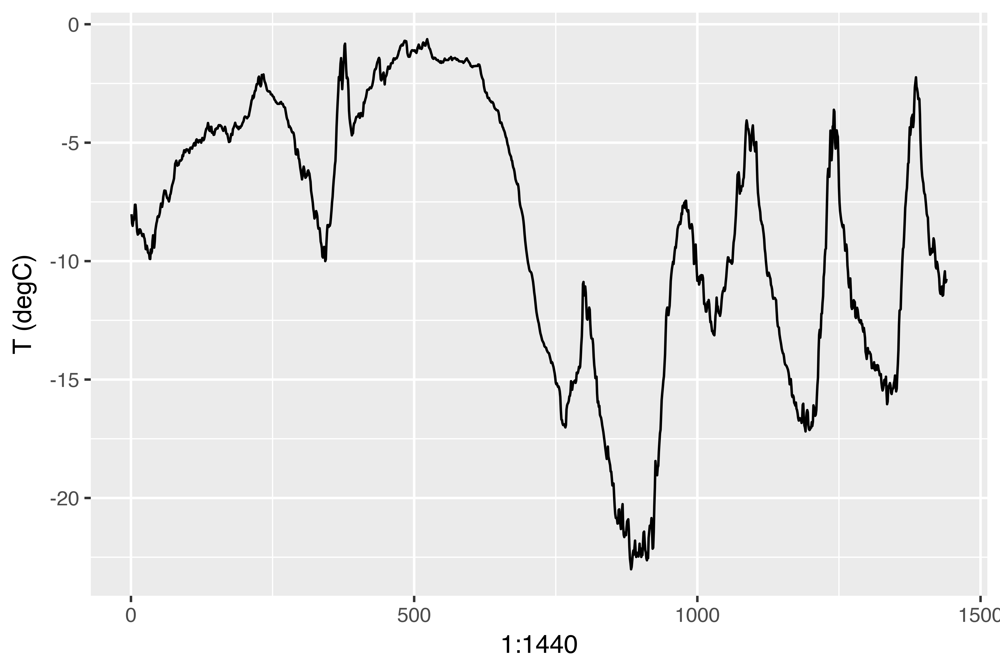
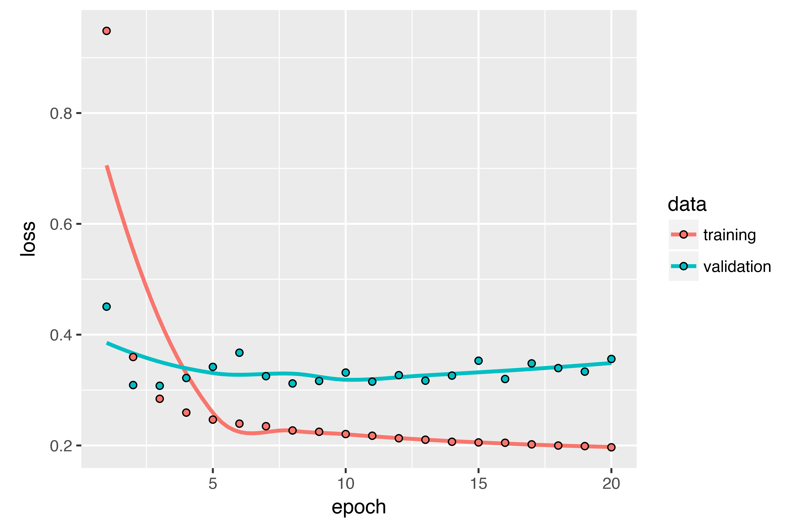
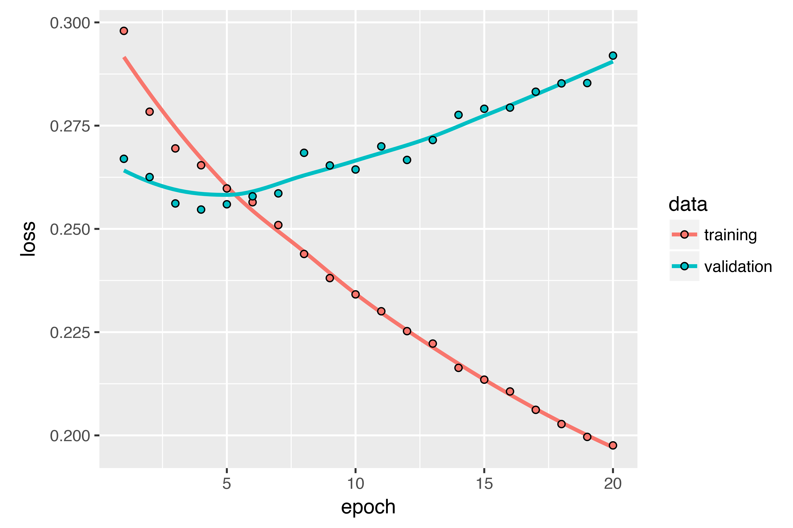

```{r setup, include=FALSE}
  knitr::opts_chunk$set(eval = FALSE, echo = TRUE)
```

## Overview

In this post, we'll review three advanced techniques for improving the performance and generalization power of recurrent neural networks. By the end of the section, you'll know most of what there is to know about using recurrent networks with Keras. We'll demonstrate all three concepts on a temperature-forecasting problem, where you have access to a time series of data points coming from sensors installed on the roof of a building, such as temperature, air pressure, and humidity, which you use to predict what the temperature will be 24 hours after the last data point. This is a fairly challenging problem that exemplifies many common difficulties encountered when working with time series.

We'll cover the following techniques:

* _Recurrent dropout_ — This is a specific, built-in way to use dropout to fight overfitting in recurrent layers.
* _Stacking recurrent layers_ — This increases the representational power of the network (at the cost of higher computational loads).
* _Bidirectional recurrent layers_ — These present the same information to a recurrent network in different ways, increasing accuracy and mitigating forgetting issues.

## A temperature-forecasting problem

Until now, the only sequence data we've covered has been text data, such as the IMDB dataset and the Reuters dataset. But sequence data is found in many more problems than just language processing. In all the examples in this section, you'll play with a [weather timeseries dataset](https://www.bgc-jena.mpg.de/wetter/) recorded at the Weather Station at the Max Planck Institute for Biogeochemistry in Jena, Germany.

In this dataset, 14 different quantities (such air temperature, atmospheric pressure, humidity, wind direction, and so on) were recorded every 10 minutes, over several years. The original data goes back to 2003, but this example is limited to data from 2009–2016. This dataset is perfect for learning to work with numerical time series. You'll use it to build a model that takes as input some data from the recent past (a few days' worth of data points) and predicts the air temperature 24 hours in the future.

Download and uncompress the data as follows:

```{r}
dir.create("~/Downloads/jena_climate", recursive = TRUE)
download.file(
  "https://s3.amazonaws.com/keras-datasets/jena_climate_2009_2016.csv.zip",
  "~/Downloads/jena_climate/jena_climate_2009_2016.csv.zip"
)
unzip(
  "~/Downloads/jena_climate/jena_climate_2009_2016.csv.zip",
  exdir = "~/Downloads/jena_climate"
)
```

Let's look at the data.

```{r}
library(tibble)
library(readr)

data_dir <- "~/Downloads/jena_climate"
fname <- file.path(data_dir, "jena_climate_2009_2016.csv")
data <- read_csv(fname)

glimpse(data)
```
```
Observations: 420,551
Variables: 15
$ `Date Time`       <chr> "01.01.2009 00:10:00", "01.01.2009 00:20:00", "...
$ `p (mbar)`        <dbl> 996.52, 996.57, 996.53, 996.51, 996.51, 996.50,...
$ `T (degC)`        <dbl> -8.02, -8.41, -8.51, -8.31, -8.27, -8.05, -7.62...
$ `Tpot (K)`        <dbl> 265.40, 265.01, 264.91, 265.12, 265.15, 265.38,...
$ `Tdew (degC)`     <dbl> -8.90, -9.28, -9.31, -9.07, -9.04, -8.78, -8.30...
$ `rh (%)`          <dbl> 93.3, 93.4, 93.9, 94.2, 94.1, 94.4, 94.8, 94.4,...
$ `VPmax (mbar)`    <dbl> 3.33, 3.23, 3.21, 3.26, 3.27, 3.33, 3.44, 3.44,...
$ `VPact (mbar)`    <dbl> 3.11, 3.02, 3.01, 3.07, 3.08, 3.14, 3.26, 3.25,...
$ `VPdef (mbar)`    <dbl> 0.22, 0.21, 0.20, 0.19, 0.19, 0.19, 0.18, 0.19,...
$ `sh (g/kg)`       <dbl> 1.94, 1.89, 1.88, 1.92, 1.92, 1.96, 2.04, 2.03,...
$ `H2OC (mmol/mol)` <dbl> 3.12, 3.03, 3.02, 3.08, 3.09, 3.15, 3.27, 3.26,...
$ `rho (g/m**3)`    <dbl> 1307.75, 1309.80, 1310.24, 1309.19, 1309.00, 13...
$ `wv (m/s)`        <dbl> 1.03, 0.72, 0.19, 0.34, 0.32, 0.21, 0.18, 0.19,...
$ `max. wv (m/s)`   <dbl> 1.75, 1.50, 0.63, 0.50, 0.63, 0.63, 0.63, 0.50,...
$ `wd (deg)`        <dbl> 152.3, 136.1, 171.6, 198.0, 214.3, 192.7, 166.5...
```

Here is the plot of temperature (in degrees Celsius) over time. On this plot, you can clearly see the yearly periodicity of temperature.

```{r}
library(ggplot2)
ggplot(data, aes(x = 1:nrow(data), y = `T (degC)`)) + geom_line()
```

{width=100%}


Here is a more narrow plot of the first 10 days of temperature data (see figure 6.15). Because the data is recorded every 10 minutes, you get 144 data points 
per day.

```{r}
ggplot(data[1:1440,], aes(x = 1:1440, y = `T (degC)`)) + geom_line()
```

{width=100%}


On this plot, you can see daily periodicity, especially evident for the last 4 days. Also note that this 10-day period must be coming from a fairly cold winter month.

If you were trying to predict average temperature for the next month given a few months of past data, the problem would be easy, due to the reliable year-scale periodicity of the data. But looking at the data over a scale of days, the temperature looks a lot more chaotic. Is this time series predictable at a daily scale? Let's find out.

## Preparing the data

The exact formulation of the problem will be as follows: given data going as far back as `lookback` timesteps (a timestep is 10 minutes) and sampled every `steps` timesteps, can you predict the temperature in `delay` timesteps? You'll use the following parameter values:

* `lookback = 1440` — Observations will go back 10 days.
* `steps = 6` — Observations will be sampled at one data point per hour.
* `delay = 144` — Targets will be 24 hours in the future.

To get started, you need to do two things:

* Preprocess the data to a format a neural network can ingest. This is easy: the data is already numerical, so you don't need to do any vectorization. But each time series in the data is on a different scale (for example, temperature is typically between -20 and +30, but atmospheric pressure, measured in mbar, is around 1,000). You'll normalize each time series independently so that they all take small values on a similar scale.
* Write a generator function that takes the current array of float data and yields batches of data from the recent past, along with a target temperature in the future. Because the samples in the dataset are highly redundant (sample _N_ and sample _N_ + 1 will have most of their timesteps in common), it would be wasteful to explicitly allocate every sample. Instead, you'll generate the samples on the fly using the original data.

```{css, echo=FALSE, eval=TRUE}
.note {
  border: solid 1px rgba(0, 0, 0, 0.3); 
  padding: 16px 25px; 
  margin-bottom: 20px;
  background-color: rgb(253,253,253);
}
```

<div id="understanding-generators" class="note">

**NOTE: Understanding generator functions**  
<br/>
A generator function is a special type of function that you call repeatedly to obtain a sequence of values from. Often generators need to maintain internal state, so they are typically constructed by calling another yet another function which returns the generator function (the environment of the function which returns the generator is then used to track state).

For example, the `sequence_generator()` function below returns a generator function that yields an infinite sequence of numbers:

```{r}
sequence_generator <- function(start) {
  value <- start - 1
  function() {
    value <<- value + 1
    value
  }
}

gen <- sequence_generator(10)
gen()
```
```
[1] 10
```
```{r}
gen()
```
```
[1] 11
```

The current state of the generator is the `value` variable that is defined outside of the function. Note that superassignment (`<<-`) is used to update this state from within the function.

Generator functions can signal completion by returning the value `NULL`. However, generator functions passed to Keras training methods (e.g. `fit_generator()`) should always return values infinitely (the number of calls to the generator function is controlled by the `epochs` and `steps_per_epoch` parameters).
</div>

First, you'll convert the R data frame which we read earlier into a matrix of floating point values (we'll discard the first column which included a text timestamp):

```{r}
data <- data.matrix(data[,-1])
```

You'll then preprocess the data by subtracting the mean of each time series and dividing by the standard deviation. You're going to use the first 200,000 timesteps as training data, so compute the mean and standard deviation for normalization only on this fraction of the data.

```{r}
train_data <- data[1:200000,]
mean <- apply(train_data, 2, mean)
std <- apply(train_data, 2, sd)
data <- scale(data, center = mean, scale = std)
```

The code for the data generator you'll use is below. It yields a list `(samples, targets)`, where `samples` is one batch of input data and `targets` is the corresponding array of target temperatures. It takes the following arguments:

* `data` — The original array of floating-point data, which you normalized in listing 6.32.
* `lookback` — How many timesteps back the input data should go.
* `delay` — How many timesteps in the future the target should be.
* `min_index` and `max_index` — Indices in the `data` array that delimit which timesteps to draw from. This is useful for keeping a segment of the data for validation and another for testing.
* `shuffle` — Whether to shuffle the samples or draw them in chronological order.
* `batch_size` — The number of samples per batch.
* `step` — The period, in timesteps, at which you sample data. You'll set it 6 in order to draw one data point every hour.

```{r}
generator <- function(data, lookback, delay, min_index, max_index,
                      shuffle = FALSE, batch_size = 128, step = 6) {
  if (is.null(max_index))
    max_index <- nrow(data) - delay - 1
  i <- min_index + lookback
  function() {
    if (shuffle) {
      rows <- sample(c((min_index+lookback):max_index), size = batch_size)
    } else {
      if (i + batch_size >= max_index)
        i <<- min_index + lookback
      rows <- c(i:min(i+batch_size-1, max_index))
      i <<- i + length(rows)
    }
    
    samples <- array(0, dim = c(length(rows), 
                                lookback / step,
                                dim(data)[[-1]]))
    targets <- array(0, dim = c(length(rows)))
                     
    for (j in 1:length(rows)) {
      indices <- seq(rows[[j]] - lookback, rows[[j]]-1, 
                     length.out = dim(samples)[[2]])
      samples[j,,] <- data[indices,]
      targets[[j]] <- data[rows[[j]] + delay,2]
    }            
    
    list(samples, targets)
  }
}
```

The `i` variable contains the state that tracks next window of data to return, so it is updated using superassignment (e.g. `i <<- i + length(rows)`).

Now, let's use the abstract `generator` function to instantiate three generators: one for training, one for validation, and one for testing. Each will look at different temporal segments of the original data: the training generator looks at the first 200,000 timesteps, the validation generator looks at the following 100,000, and the test generator looks at the remainder.

```{r}
lookback <- 1440
step <- 6
delay <- 144
batch_size <- 128

train_gen <- generator(
  data,
  lookback = lookback,
  delay = delay,
  min_index = 1,
  max_index = 200000,
  shuffle = TRUE,
  step = step, 
  batch_size = batch_size
)

val_gen = generator(
  data,
  lookback = lookback,
  delay = delay,
  min_index = 200001,
  max_index = 300000,
  step = step,
  batch_size = batch_size
)

test_gen <- generator(
  data,
  lookback = lookback,
  delay = delay,
  min_index = 300001,
  max_index = NULL,
  step = step,
  batch_size = batch_size
)

# How many steps to draw from val_gen in order to see the entire validation set
val_steps <- (300000 - 200001 - lookback) / batch_size

# How many steps to draw from test_gen in order to see the entire test set
test_steps <- (nrow(data) - 300001 - lookback) / batch_size
```


## A common-sense, non-machine-learning baseline

Before you start using black-box deep-learning models to solve the temperature-prediction problem, let's try a simple, common-sense approach. It will serve as a sanity check, and it will establish a baseline that you'll have to beat in order to demonstrate the usefulness of more-advanced machine-learning models. Such common-sense baselines can be useful when you're approaching a new problem for which there is no known solution (yet). A classic example is that of unbalanced classification tasks, where some classes are much more common than others. If your dataset contains 90% instances of class A and 10% instances of class B, then a common-sense approach to the classification task is to always predict "A" when presented with a new sample. Such a classifier is 90% accurate overall, and any learning-based approach should therefore beat this 90% score in order to demonstrate usefulness. Sometimes, such elementary baselines can prove surprisingly hard to beat.

In this case, the temperature time series can safely be assumed to be continuous (the temperatures tomorrow are likely to be close to the temperatures today) as well as periodical with a daily period. Thus a common-sense approach is to always predict that the temperature 24 hours from now will be equal to the temperature right now. Let's evaluate this approach, using the mean absolute error (MAE) metric: 

```{r}
mean(abs(preds - targets))
```

Here's the evaluation loop.

```{r}
library(keras)
evaluate_naive_method <- function() {
  batch_maes <- c()
  for (step in 1:val_steps) {
    c(samples, targets) %<-% val_gen()
    preds <- samples[,dim(samples)[[2]],2]
    mae <- mean(abs(preds - targets))
    batch_maes <- c(batch_maes, mae)
  }
  print(mean(batch_maes))
}

evaluate_naive_method()
```

This yields an MAE of 0.29. Because the temperature data has been normalized to be centered on 0 and have a standard deviation of 1, this number isn't immediately interpretable. It translates to an average absolute error of 0.29 x `temperature_std` degrees Celsius: 2.57˚C. 

```{r}
celsius_mae <- 0.29 * std[[2]]
```

That's a fairly large average absolute error. Now the game is to use your knowledge of deep learning to do better. 

## A basic machine-learning approach

In the same way that it's useful to establish a common-sense baseline before trying machine-learning approaches, it's useful to try simple, cheap machine-learning models (such as small, densely connected networks) before looking into complicated and computationally expensive models such as RNNs. This is the best way to make sure any further complexity you throw at the problem is legitimate and delivers real benefits.

The following listing shows a fully connected model that starts by flattening the data and then runs it through two dense layers. Note the lack of activation function on the last dense layer, which is typical for a regression problem. You use MAE as the loss. Because you evaluate on the exact same data and with the exact same metric you did with the common-sense approach, the results will be directly comparable.

```{r}
library(keras)

model <- keras_model_sequential() %>% 
  layer_flatten(input_shape = c(lookback / step, dim(data)[-1])) %>% 
  layer_dense(units = 32, activation = "relu") %>% 
  layer_dense(units = 1)

model %>% compile(
  optimizer = optimizer_rmsprop(),
  loss = "mae"
)

history <- model %>% fit_generator(
  train_gen,
  steps_per_epoch = 500,
  epochs = 20,
  validation_data = val_gen,
  validation_steps = val_steps
)
```

Let's display the loss curves for validation and training.

{width=100%}


Some of the validation losses are close to the no-learning baseline, but not reliably. This goes to show the merit of having this baseline in the first place: it turns out to be not easy to outperform. Your common sense contains a lot of valuable information that a machine-learning model doesn't have access to.

You may wonder, if a simple, well-performing model exists to go from the data to the targets (the common-sense baseline), why doesn't the model you're training find it and improve on it? Because this simple solution isn't what your training setup is looking for. The space of models in which you're searching for a solution -- that is, your hypothesis space -- is the space of all possible two-layer networks with the configuration you defined. These networks are already fairly complicated. When you're looking for a solution with a space of complicated models, the simple, well-performing baseline may be unlearnable, even if it's technically part of the hypothesis space. That is a pretty significant limitation of machine learning in general: unless the learning algorithm is hardcoded to look for a specific kind of simple model, parameter learning can sometimes fail to find a simple solution to a simple problem.

## A first recurrent baseline

The first fully connected approach didn't do well, but that doesn't mean machine learning isn't applicable to this problem. The previous approach first flattened the time series, which removed the notion of time from the input data. Let's instead look at the data as what it is: a sequence, where causality and order matter. You'll try a recurrent-sequence processing model -- it should be the perfect fit for such sequence data, precisely because it exploits the temporal ordering of data points, unlike the first approach.

Instead of the LSTM layer introduced in the previous section, you'll use the [GRU layer](https://arxiv.org/abs/1412.3555), developed by Chung et al. in 2014. Gated recurrent unit (GRU) layers work using the same principle as LSTM, but they're somewhat streamlined and thus cheaper to run (although they may not have as much representational power as LSTM). This trade-off between computational expensiveness and representational power is seen everywhere in machine learning.

```{r}
model <- keras_model_sequential() %>% 
  layer_gru(units = 32, input_shape = list(NULL, dim(data)[[-1]])) %>% 
  layer_dense(units = 1)

model %>% compile(
  optimizer = optimizer_rmsprop(),
  loss = "mae"
)

history <- model %>% fit_generator(
  train_gen,
  steps_per_epoch = 500,
  epochs = 20,
  validation_data = val_gen,
  validation_steps = val_steps
)
```

The results are plotted below. Much better! You can significantly beat the common-sense baseline, demonstrating the value of machine learning as well as the superiority of recurrent networks compared to sequence-flattening dense networks on this type of task.

{width=100%}

The new validation MAE of ~0.265 (before you start significantly overfitting) translates to a mean absolute error of 2.35˚C after denormalization. That's a solid gain on the initial error of 2.57˚C, but you probably still have a bit of a margin for improvement.

## Using recurrent dropout to fight overfitting

It's evident from the training and validation curves that the model is overfitting: the training and validation losses start to diverge considerably after a few epochs. You're already familiar with a classic technique for fighting this phenomenon: dropout, which randomly zeros out input units of a layer in order to break happenstance correlations in the training data that the layer is exposed to. But how to correctly apply dropout in recurrent networks isn't a trivial question. It has long been known that applying dropout before a recurrent layer hinders learning rather than helping with regularization. In 2015, Yarin Gal, as part of his [PhD thesis](http://mlg.eng.cam.ac.uk/yarin/blog_2248.html) on Bayesian deep learning, determined the proper way to use dropout with a recurrent network: the same dropout mask (the same pattern of dropped units) should be applied at every timestep, instead of a dropout mask that varies randomly from timestep to timestep. What's more, in order to regularize the representations formed by the recurrent gates of layers such as `layer_gru` and `layer_lstm`, a temporally constant dropout mask should be applied to the inner recurrent activations of the layer (a _recurrent_ dropout mask). Using the same dropout mask at every timestep allows the network to properly propagate its learning error through time; a temporally random dropout mask would disrupt this error signal and be harmful to the learning process.

Yarin Gal did his research using Keras and helped build this mechanism directly into Keras recurrent layers. Every recurrent layer in Keras has two dropout-related arguments: `dropout`, a float specifying the dropout rate for input units of the layer, and `recurrent_dropout`, specifying the dropout rate of the recurrent units. Let's add dropout and recurrent dropout to the `layer_gru` and see how doing so impacts overfitting. Because networks being regularized with dropout always take longer to fully converge, you'll train the network for twice as many epochs.

```{r}
model <- keras_model_sequential() %>% 
  layer_gru(units = 32, dropout = 0.2, recurrent_dropout = 0.2,
            input_shape = list(NULL, dim(data)[[-1]])) %>% 
  layer_dense(units = 1)

model %>% compile(
  optimizer = optimizer_rmsprop(),
  loss = "mae"
)

history <- model %>% fit_generator(
  train_gen,
  steps_per_epoch = 500,
  epochs = 40,
  validation_data = val_gen,
  validation_steps = val_steps
)
```

The plot below shows the results. Success! You're no longer overfitting during the first 20 epochs. But although you have more stable evaluation scores, your best scores aren't much lower than they were previously.

{width=100%}

## Stacking recurrent layers

Because you're no longer overfitting but seem to have hit a performance bottleneck, you should consider increasing the capacity of the network. Recall the description of the universal machine-learning workflow: it's generally a good idea to increase the capacity of your network until overfitting becomes the primary obstacle (assuming you're already taking basic steps to mitigate overfitting, such as using dropout). As long as you aren't overfitting too badly, you're likely under capacity.

Increasing network capacity is typically done by increasing the number of units in the layers or adding more layers. Recurrent layer stacking is a classic way to build more-powerful recurrent networks: for instance, what currently powers the Google Translate algorithm is a stack of seven large LSTM layers -- that's huge.

To stack recurrent layers on top of each other in Keras, all intermediate layers should return their full sequence of outputs (a 3D tensor) rather than their output at the last timestep. This is done by specifying `return_sequences = TRUE`.

```{r}
model <- keras_model_sequential() %>% 
  layer_gru(units = 32, 
            dropout = 0.1, 
            recurrent_dropout = 0.5,
            return_sequences = TRUE,
            input_shape = list(NULL, dim(data)[[-1]])) %>% 
  layer_gru(units = 64, activation = "relu",
            dropout = 0.1,
            recurrent_dropout = 0.5) %>% 
  layer_dense(units = 1)

model %>% compile(
  optimizer = optimizer_rmsprop(),
  loss = "mae"
)

history <- model %>% fit_generator(
  train_gen,
  steps_per_epoch = 500,
  epochs = 40,
  validation_data = val_gen,
  validation_steps = val_steps
)
```

The figure below shows the results. You can see that the added layer does improve the results a bit, though not significantly. You can draw two conclusions:

* Because you're still not overfitting too badly, you could safely increase the size of your layers in a quest for validation-loss improvement. This has a non-negligible computational cost, though. 
* Adding a layer didn't help by a significant factor, so you may be seeing diminishing returns from increasing network capacity at this point.

{width=100%}

## Using bidirectional RNNs

The last technique introduced in this section is called _bidirectional RNNs_. A bidirectional RNN is a common RNN variant that can offer greater performance than a regular RNN on certain tasks. It's frequently used in natural-language processing -- you could call it the Swiss Army knife of deep learning for natural-language processing.

RNNs are notably order dependent, or time dependent: they process the timesteps of their input sequences in order, and shuffling or reversing the timesteps can completely change the representations the RNN extracts from the sequence. This is precisely the reason they perform well on problems where order is meaningful, such as the temperature-forecasting problem. A bidirectional RNN exploits the order sensitivity of RNNs: it consists of using two regular RNNs, such as the `layer_gru` and `layer_lstm` you're already familiar with, each of which processes the input sequence in one direction (chronologically and antichronologically), and then merging their representations. By processing a sequence both ways, a bidirectional RNN can catch patterns that may be overlooked by a unidirectional RNN.

Remarkably, the fact that the RNN layers in this section have processed sequences in chronological order (older timesteps first) may have been an arbitrary decision. At least, it's a decision we made no attempt to question so far. Could the RNNs have performed well enough if they processed input sequences in antichronological order, for instance (newer timesteps first)? Let's try this in practice and see what happens. All you need to do is write a variant of the data generator where the input sequences are reverted along the time dimension (replace the last line with `list(samples[,ncol(samples):1,], targets)`). Training the same one-GRU-layer network that you used in the first experiment in this section, you get the results shown below.

{width=100%}

The reversed-order GRU underperforms even the common-sense baseline, indicating that in this case, chronological processing is important to the success of your approach. This makes perfect sense: the underlying GRU layer will typically be better at remembering the recent past than the distant past, and naturally the more recent weather data points are more predictive than older data points for the problem (that's what makes the common-sense baseline fairly strong). Thus the chronological version of the layer is bound to outperform the reversed-order version. Importantly, this isn't true for many other problems, including natural language: intuitively, the importance of a word in understanding a sentence isn't usually dependent on its position in the sentence. Let's try the same trick on the LSTM IMDB example from section 6.2.

```{r}
library(keras)

# Number of words to consider as features
max_features <- 10000  

# Cuts off texts after this number of words
maxlen <- 500

imdb <- dataset_imdb(num_words = max_features)
c(c(x_train, y_train), c(x_test, y_test)) %<-% imdb

# Reverses sequences
x_train <- lapply(x_train, rev)
x_test <- lapply(x_test, rev) 

# Pads sequences
x_train <- pad_sequences(x_train, maxlen = maxlen)  <4>
x_test <- pad_sequences(x_test, maxlen = maxlen)

model <- keras_model_sequential() %>% 
  layer_embedding(input_dim = max_features, output_dim = 128) %>% 
  layer_lstm(units = 32) %>% 
  layer_dense(units = 1, activation = "sigmoid")

model %>% compile(
  optimizer = "rmsprop",
  loss = "binary_crossentropy",
  metrics = c("acc")
)
  
history <- model %>% fit(
  x_train, y_train,
  epochs = 10,
  batch_size = 128,
  validation_split = 0.2
)
```


You get performance nearly identical to that of the chronological-order LSTM. Remarkably, on such a text dataset, reversed-order processing works just as well as chronological processing, confirming the 
hypothesis that, although word order _does_ matter in understanding language, _which_ order you use isn't crucial. Importantly, an RNN trained on reversed sequences will learn different representations than one trained on the original sequences, much as you would have different mental models if time flowed backward in the real world -- if you lived a life where you died on your first day and were born on your last day. In machine learning, representations that are _different_ yet _useful_ are always worth exploiting, and the more they differ, the better: they offer a new angle from which to look at your data, capturing aspects of the data that were missed by other approaches, and thus they can help boost performance on a task. This is the intuition behind _ensembling_, a concept we'll explore in chapter 7.

A bidirectional RNN exploits this idea to improve on the performance of chronological-order RNNs. It looks at its input sequence both ways, obtaining potentially richer representations and capturing patterns that may have been missed by the chronological-order version alone.


To instantiate a bidirectional RNN in Keras, you use the `bidirectional()` function, which takes a recurrent layer instance as an argument. The `bidirectional()` function creates a second, separate instance of this recurrent layer and uses one instance for processing the input sequences in chronological order and the other instance for processing the input sequences in reversed order. Let's try it on the IMDB sentiment-analysis task.

```{r}
model <- keras_model_sequential() %>% 
  layer_embedding(input_dim = max_features, output_dim = 32) %>% 
  bidirectional(
    layer_lstm(units = 32)
  ) %>% 
  layer_dense(units = 1, activation = "sigmoid")

model %>% compile(
  optimizer = "rmsprop",
  loss = "binary_crossentropy",
  metrics = c("acc")
)

history <- model %>% fit(
  x_train, y_train,
  epochs = 10,
  batch_size = 128,
  validation_split = 0.2
)
```


It performs slightly better than the regular LSTM you tried in the previous section, achieving over 89% validation accuracy. It also seems to overfit more quickly, which is unsurprising because a bidirectional layer has twice as many parameters as a chronological LSTM. With some regularization, the bidirectional approach would likely be a strong performer on this task.

Now let's try the same approach on the temperature prediction task.

```{r}
model <- keras_model_sequential() %>% 
  bidirectional(
    layer_gru(units = 32), input_shape = list(NULL, dim(data)[[-1]])
  ) %>% 
  layer_dense(units = 1)

model %>% compile(
  optimizer = optimizer_rmsprop(),
  loss = "mae"
)

history <- model %>% fit_generator(
  train_gen,
  steps_per_epoch = 500,
  epochs = 40,
  validation_data = val_gen,
  validation_steps = val_steps
)
```

This performs about as well as the regular `layer_gru`. It's easy to understand why: all the predictive capacity must come from the chronological half of the network, because the antichronological half is known to be severely underperforming on this task (again, because the recent past matters much more than the distant past in this case).

## Going even further

There are many other things you could try, in order to improve performance on the temperature-forecasting problem:

* Adjust the number of units in each recurrent layer in the stacked setup. The current choices are largely arbitrary and thus probably suboptimal.
* Adjust the learning rate used by the `RMSprop` optimizer.
* Try using `layer_lstm` instead of `layer_gru`.
* Try using a bigger densely connected regressor on top of the recurrent layers: that is, a bigger dense layer or even a stack of dense layers.
* Don't forget to eventually run the best-performing models (in terms of validation MAE) on the test set! Otherwise, you'll develop architectures that are overfitting to the validation set.   

As always, deep learning is more an art than a science. We can provide guidelines that suggest what is likely to work or not work on a given problem, but, ultimately, every problem is unique; you'll have to evaluate different strategies empirically. There is currently no theory that will tell you in advance precisely what you should do to optimally solve a problem. You must iterate.

## Wrapping up

Here's what you should take away from this section:

* As you first learned in chapter 4, when approaching a new problem, it's good to first establish common-sense baselines for your metric of choice. If you don't have a baseline to beat, you can't tell whether you're making real progress.
* Try simple models before expensive ones, to justify the additional expense. Sometimes a simple model will turn out to be your best option.
* When you have data where temporal ordering matters, recurrent networks are a great fit and easily outperform models that first flatten the temporal data.
* To use dropout with recurrent networks, you should use a time-constant dropout mask and recurrent dropout mask. These are built into Keras recurrent layers, so all you have to do is use the `dropout` and `recurrent_dropout` arguments of recurrent layers.
* Stacked RNNs provide more representational power than a single RNN layer. They're also much more expensive and thus not always worth it. Although they offer clear gains on complex problems (such as machine translation), they may not always be relevant to smaller, simpler problems.
* Bidirectional RNNs, which look at a sequence both ways, are useful on natural-language processing problems. But they aren't strong performers on sequence data where the recent past is much more informative than the beginning of the sequence.


<div id="markets" class="note">
**NOTE: Markets and machine learning**  
<br/>
Some readers are bound to want to take the techniques we've introduced here and try them on the problem of forecasting the future price of securities on the stock market (or currency exchange rates, and so on). Markets have _very different statistical characteristics_ than natural phenomena such as weather patterns. Trying to use machine learning to beat markets, when you only have access to publicly available data, is a difficult endeavor, and you're likely to waste your time and resources with nothing to show for it. 

Always remember that when it comes to markets, past performance is _not_ a good predictor of future returns -- looking in the rear-view mirror is a bad way to drive. Machine learning, on the other hand, is applicable to datasets where the past _is_ a good predictor of the future.
</div>


