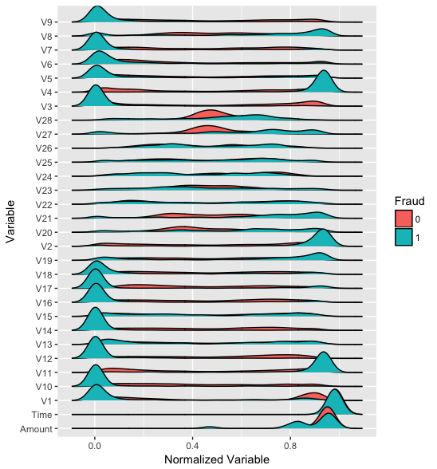

```{r setup, include=FALSE}
  knitr::opts_chunk$set(eval = FALSE, echo = TRUE)
```

## Overview

In this post we will train an autoencoder to detect credit card fraud. We will also demonstrate how to train Keras models in the cloud using [CloudML](https://tensorflow.rstudio.com/tools/cloudml/). 

The basis of our model will be the Kaggle [Credit Card Fraud Detection](https://www.kaggle.com/mlg-ulb/creditcardfraud) dataset, which was collected during a research collaboration of Worldline and the [Machine Learning Group](http://mlg.ulb.ac.be) of ULB (Université Libre de Bruxelles) on big data mining and fraud detection. 

The dataset contains credit card transactions by European cardholders made over a two day period in September 2013. There are 492 frauds out of 284,807 transactions. The dataset is highly unbalanced, the positive class (frauds) account for only 0.172% of all transactions. 

## Reading the data

After downloading the data from [Kaggle](https://www.kaggle.com/dalpozz/creditcardfraud), you can read it in to R with `read_csv()`:

```{r}
library(readr)
df <- read_csv("data-raw/creditcard.csv", col_types = list(Time = col_number()))
```

The input variables consist of only numerical values which are the result of a PCA transformation. In order to preserve confidentiality, no more information about the original features was provided. The features V1, ..., V28 were obtained with PCA. There are however 2 features (*Time* and *Amount*) that were not transformed.
*Time* is the seconds elapsed between each transaction and the first transaction in the dataset. *Amount* is the transaction amount and could be used for cost-sensitive learning. The *Class* variable takes value 1 in case of fraud and 0 otherwise.


## Autoencoders

Since only 0.172% of the observations are frauds, we have a highly unbalanced classification problem. With this kind of problem, traditional classification approaches usually don't work very well because we have only a very small sample of the rarer class. 

An [autoencoder](https://en.wikipedia.org/wiki/Autoencoder) is a neural network that is used to learn a representation (encoding) for a set of data, typically for the purpose of dimensionality reduction. For this problem we will train an autoencoder to encode non-fraud observations from our training set. Since frauds are supposed to have a different distribution then normal transactions, we expect that our autoencoder will have higher reconstruction errors on frauds then on normal transactions. This means that we can use the reconstruction error as a quantity that indicates if a transaction is fraudulent or not.

If you want to learn more about autoencoders, a good starting point is this [video from Larochelle](https://www.youtube.com/watch?v=FzS3tMl4Nsc) on YouTube and [Chapter 14](http://www.deeplearningbook.org/contents/autoencoders.html) from the [Deep Learning](http://www.deeplearningbook.org/) book by Goodfellow et al.

## Visualization

For an autoencoder to work well we have a strong initial assumption: that the distribution of variables for normal transactions is different from the distribution for fraudulent ones. Let's make some plots to verify this. Variables were transformed to a `[0,1]` interval for plotting.

```{r fig.height=20}
library(tidyr)
library(dplyr)
library(ggplot2)
library(ggridges)
df %>%
  gather(variable, value, -Class) %>%
  ggplot(aes(y = as.factor(variable), 
             fill = as.factor(Class), 
             x = percent_rank(value))) +
  geom_density_ridges()
```



We can see that distributions of variables for fraudulent transactions are very different then from normal ones, except for the *Time* variable, which seems to have the exact same distribution.

## Preprocessing

Before the modeling steps we need to do some preprocessing. We will split the dataset into train and test sets and then we will [Min-max normalize](https://www.quora.com/What-is-the-meaning-of-min-max-normalization) our data (this is done because neural networks work much better with small input values). We will also remove the *Time* variable as it has the exact same distribution for normal and fraudulent transactions.

Based on the *Time* variable we will use the first 200,000 observations for training and the rest for testing. This is good practice because when using the model we want to predict future frauds based on transactions that happened before.

```{r}
df_train <- df %>% filter(row_number(Time) <= 200000) %>% select(-Time)
df_test <- df %>% filter(row_number(Time) > 200000) %>% select(-Time)
```

Now let's work on normalization of inputs. We created 2 functions to help us. The first one gets descriptive statistics about the dataset that are used for scaling. Then we have a function to perform the min-max scaling. It's important to note that we applied the same normalization constants for training and test sets.

```{r}
library(purrr)

#' Gets descriptive statistics for every variable in the dataset.
get_desc <- function(x) {
  map(x, ~list(
    min = min(.x),
    max = max(.x),
    mean = mean(.x),
    sd = sd(.x)
  ))
} 

#' Given a dataset and normalization constants it will create a min-max normalized
#' version of the dataset.
normalization_minmax <- function(x, desc) {
  map2_dfc(x, desc, ~(.x - .y$min)/(.y$max - .y$min))
}
```

Now let's create normalized versions of our datasets. We also transformed our data frames to matrices since this is the format expected by Keras.

```{r}
desc <- df_train %>% 
  select(-Class) %>% 
  get_desc()

x_train <- df_train %>%
  select(-Class) %>%
  normalization_minmax(desc) %>%
  as.matrix()

x_test <- df_test %>%
  select(-Class) %>%
  normalization_minmax(desc) %>%
  as.matrix()

y_train <- df_train$Class
y_test <- df_test$Class
```

# Model definition

We will now define our model in Keras, a symmetric autoencoder with 4 dense layers. 

```{r, eval = FALSE}
library(keras)
model <- keras_model_sequential()
model %>%
  layer_dense(units = 15, activation = "tanh", input_shape = ncol(x_train)) %>%
  layer_dense(units = 10, activation = "tanh") %>%
  layer_dense(units = 15, activation = "tanh") %>%
  layer_dense(units = ncol(x_train))

summary(model)
```
```
___________________________________________________________________________________
Layer (type)                         Output Shape                     Param #      
===================================================================================
dense_1 (Dense)                      (None, 15)                       450          
___________________________________________________________________________________
dense_2 (Dense)                      (None, 10)                       160          
___________________________________________________________________________________
dense_3 (Dense)                      (None, 15)                       165          
___________________________________________________________________________________
dense_4 (Dense)                      (None, 29)                       464          
===================================================================================
Total params: 1,239
Trainable params: 1,239
Non-trainable params: 0
___________________________________________________________________________________
```

We will then compile our model, using the mean squared error loss and the Adam optimizer for training.

```{r, eval = FALSE}
model %>% compile(
  loss = "mean_squared_error", 
  optimizer = "adam"
)
```

## Training the model

We can now train our model using the `fit()` function. Training the model is reasonably fast (~ 14s per epoch on my laptop). We will only feed to our model the observations of normal (non-fraudulent) transactions.

We will use `callback_model_checkpoint()` in order to save our model after each epoch. By passing the argument `save_best_only = TRUE` we will keep on disk only the epoch with smallest loss value on the test set.
We will also use `callback_early_stopping()` to stop training if the validation loss stops decreasing for 5 epochs.

```{r, eval = FALSE}
checkpoint <- callback_model_checkpoint(
  filepath = "model.hdf5", 
  save_best_only = TRUE, 
  period = 1,
  verbose = 1
)

early_stopping <- callback_early_stopping(patience = 5)

model %>% fit(
  x = x_train[y_train == 0,], 
  y = x_train[y_train == 0,], 
  epochs = 100, 
  batch_size = 32,
  validation_data = list(x_test[y_test == 0,], x_test[y_test == 0,]), 
  callbacks = list(checkpoint, early_stopping)
)
```

```
Train on 199615 samples, validate on 84700 samples
Epoch 1/100
199615/199615 [==============================] - 17s 83us/step - loss: 0.0036 - val_loss: 6.8522e-04d from inf to 0.00069, saving model to model.hdf5
Epoch 2/100
199615/199615 [==============================] - 17s 86us/step - loss: 4.7817e-04 - val_loss: 4.7266e-04d from 0.00069 to 0.00047, saving model to model.hdf5
Epoch 3/100
199615/199615 [==============================] - 19s 94us/step - loss: 3.7753e-04 - val_loss: 4.2430e-04d from 0.00047 to 0.00042, saving model to model.hdf5
Epoch 4/100
199615/199615 [==============================] - 19s 94us/step - loss: 3.3937e-04 - val_loss: 4.0299e-04d from 0.00042 to 0.00040, saving model to model.hdf5
Epoch 5/100
199615/199615 [==============================] - 19s 94us/step - loss: 3.2259e-04 - val_loss: 4.0852e-04 improve
Epoch 6/100
199615/199615 [==============================] - 18s 91us/step - loss: 3.1668e-04 - val_loss: 4.0746e-04 improve
...
```

After training we can get the final loss for the test set by using the `evaluate()` fucntion.

```{r}
loss <- evaluate(model, x = x_test[y_test == 0,], y = x_test[y_test == 0,])
loss
```

```
        loss 
0.0003534254 
```

## Tuning with CloudML

We may be able to get better results by tuning our model hyperparameters. We can tune, for example, the normalization function, the learning rate, the activation functions and the size of hidden layers. CloudML uses Bayesian optimization to tune hyperparameters of models as described in [this blog post](https://cloud.google.com/blog/big-data/2017/08/hyperparameter-tuning-in-cloud-machine-learning-engine-using-bayesian-optimization). 

We can use the [cloudml package](https://tensorflow.rstudio.com/tools/cloudml/) to tune our model, but first we need to prepare our project by creating a [training flag](https://tensorflow.rstudio.com/tools/training_flags.html) for each hyperparameter and a `tuning.yml` file that will tell CloudML what parameters we want to tune and how. 

The full script used for training on CloudML can be found at <https://github.com/dfalbel/fraud-autoencoder-example>. The most important modifications to the code were adding the training flags:

```{r, eval = FALSE}
FLAGS <- flags(
  flag_string("normalization", "minmax", "One of minmax, zscore"),
  flag_string("activation", "relu", "One of relu, selu, tanh, sigmoid"),
  flag_numeric("learning_rate", 0.001, "Optimizer Learning Rate"),
  flag_integer("hidden_size", 15, "The hidden layer size")
)
```

We then used the `FLAGS` variable inside the script to drive the hyperparameters of the model, for example:

```{r, eval=FALSE}
model %>% compile(
  optimizer = optimizer_adam(lr = FLAGS$learning_rate), 
  loss = 'mean_squared_error',
)
```

We also created a `tuning.yml` file describing how hyperparameters should be varied during training, as well as what metric we wanted to optimize (in this case it was the validation loss: `val_loss`).

**tuning.yml**

```markup
trainingInput:
  scaleTier: CUSTOM
  masterType: standard_gpu
  hyperparameters:
    goal: MINIMIZE
    hyperparameterMetricTag: val_loss
    maxTrials: 10
    maxParallelTrials: 5
    params:
      - parameterName: normalization
        type: CATEGORICAL
        categoricalValues: [zscore, minmax]
      - parameterName: activation
        type: CATEGORICAL
        categoricalValues: [relu, selu, tanh, sigmoid]
      - parameterName: learning_rate
        type: DOUBLE
        minValue: 0.000001
        maxValue: 0.1
        scaleType: UNIT_LOG_SCALE
      - parameterName: hidden_size
        type: INTEGER
        minValue: 5
        maxValue: 50
        scaleType: UNIT_LINEAR_SCALE
```

We describe the type of machine we want to use (in this case a `standard_gpu` instance), the metric we want to minimize while tuning, and the the maximum number of trials (i.e. number of combinations of hyperparameters we want to test). We then specify how we want to vary each hyperparameter during tuning.

You can learn more about the tuning.yml file [at the Tensorflow for R  documentation](https://tensorflow.rstudio.com/tools/cloudml/articles/tuning.html) and at [Google's official documentation on CloudML](https://cloud.google.com/ml-engine/reference/rest/v1/projects.jobs#HyperparameterSpec).

Now we are ready to send the job to Google CloudML. We can do this by running:

```{r, eval = FALSE}
library(cloudml)
cloudml_train("train.R", config = "tuning.yml")
```

The cloudml package takes care of uploading the dataset and installing any R package dependencies required to run the script on CloudML. If you are using RStudio v1.1 or higher, it will also allow you to monitor your job in a background terminal. You can also monitor your job using the [Google Cloud Console](https://console.cloud.google.com).

After the job is finished we can collect the job results with:

```{r, eval = FALSE}
job_collect()
```

This will copy the files from the job with the best `val_loss` performance on CloudML to your local system and open a report summarizing the training run.

{style="border: 1px solid rgba(0,0,0,0.1);"}  

Since we used a callback to save model checkpoints during training, the model file was also copied from Google CloudML. Files created during training are copied to the "runs" subdirectory of the working directory from which `cloudml_train()` is called. You can determine this directory for the most recent run with:

```{r}
latest_run()$run_dir
```
```
[1] runs/cloudml_2018_01_23_221244595-03
```

You can also list all previous runs and their validation losses with:

```{r}
ls_runs(order = metric_val_loss, decreasing = FALSE)
```
```
                    run_dir metric_loss metric_val_loss
1 runs/2017-12-09T21-01-11Z      0.2577          0.1482
2 runs/2017-12-09T21-00-11Z      0.2655          0.1505
3 runs/2017-12-09T19-59-44Z      0.2597          0.1402
4 runs/2017-12-09T19-56-48Z      0.2610          0.1459

Use View(ls_runs()) to view all columns
```

In our case the job downloaded from CloudML was saved to `runs/cloudml_2018_01_23_221244595-03/`, so the saved model file is available at `runs/cloudml_2018_01_23_221244595-03/model.hdf5`. We can now use our tuned model to make predictions.

## Making predictions

Now that we trained and tuned our model we are ready to generate predictions with our autoencoder. We are interested in the MSE for each observation and we expect that observations of fraudulent transactions will have higher MSE's.

First, let's load our model.

```{r}
model <- load_model_hdf5("runs/cloudml_2018_01_23_221244595-03/model.hdf5", 
                         compile = FALSE)
```

Now let's calculate the MSE for the training and test set observations.

```{r}
pred_train <- predict(model, x_train)
mse_train <- apply((x_train - pred_train)^2, 1, sum)

pred_test <- predict(model, x_test)
mse_test <- apply((x_test - pred_test)^2, 1, sum)
```

A good measure of model performance in highly unbalanced datasets is the Area Under the ROC Curve (AUC). AUC has a nice interpretation for this problem, it's the probability that a fraudulent transaction will have higher MSE then a normal one. We can calculate this using the [Metrics](https://CRAN.R-project.org/package=Metrics ) package, which implements a wide variety of common machine learning model performance metrics.

```{r}
library(Metrics)
auc(y_train, mse_train)
auc(y_test, mse_test)
```

```
[1] 0.9546814
[1] 0.9403554
```

To use the model in practice for making predictions we need to find a threshold $k$ for the MSE, then if if $MSE > k$ we consider that transaction a fraud (otherwise we consider it normal). To define this value it's useful to look at precision and recall while varying the threshold $k$.

```{r}
possible_k <- seq(0, 0.5, length.out = 100)
precision <- sapply(possible_k, function(k) {
  predicted_class <- as.numeric(mse_test > k)
  sum(predicted_class == 1 & y_test == 1)/sum(predicted_class)
})

qplot(possible_k, precision, geom = "line") 
  + labs(x = "Threshold", y = "Precision")
```


```{r}
recall <- sapply(possible_k, function(k) {
  predicted_class <- as.numeric(mse_test > k)
  sum(predicted_class == 1 & y_test == 1)/sum(y_test)
})
qplot(possible_k, recall, geom = "line") 
  + labs(x = "Threshold", y = "Recall")
```


A good starting point would be to choose the threshold with maximum precision but we could also base our decision on how much money we might lose from fraudulent transactions.
 
Suppose each manual verification of fraud costs us \$1 but if we don't verify a transaction and it's a fraud we will lose this transaction amount. Let's find for each threshold value how much money we would lose.

```{r}
cost_per_verification <- 1

lost_money <- sapply(possible_k, function(k) {
  predicted_class <- as.numeric(mse_test > k)
  sum(cost_per_verification * predicted_class + (predicted_class == 0) * y_test * df_test$Amount) 
})

qplot(possible_k, lost_money, geom = "line") + labs(x = "Threshold", y = "Lost Money")
```


We can find the best threshold in this case with:

```{r}
possible_k[which.min(lost_money)]
```

```
[1] 0.005050505
```

If we needed to manually verify all frauds, it would cost us ~\$13,000. Using our model we can reduce this to ~\$2,500.


