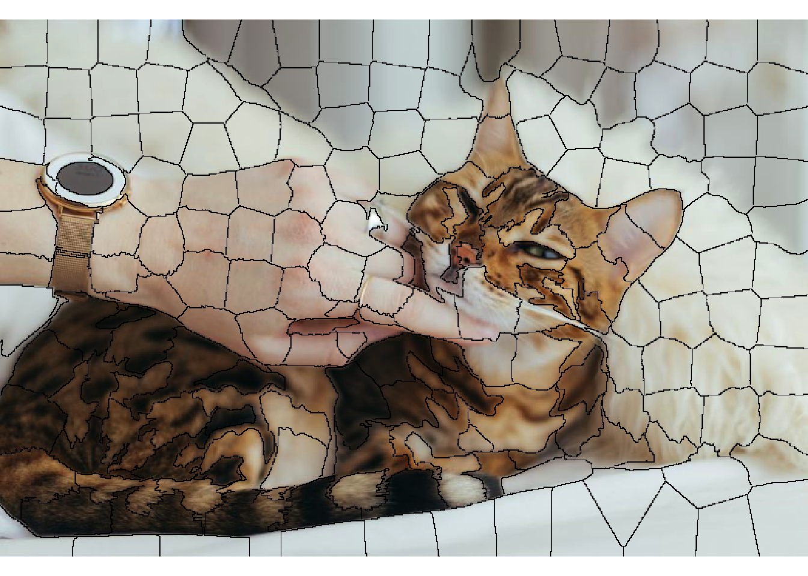
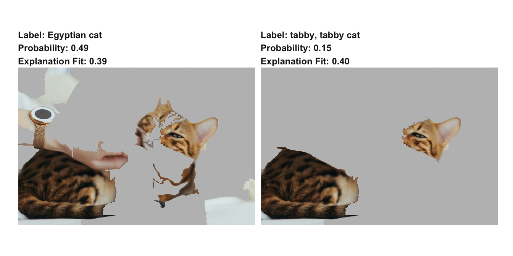

```{r setup, include=FALSE}
  knitr::opts_chunk$set(echo = TRUE, eval = FALSE)
```

## Introduction

I'm happy to report a new major release of `lime` has landed on CRAN. `lime` is 
an R port of the Python library of the same name by Marco Ribeiro that allows
the user to pry open black box machine learning models and explain their 
outcomes on a per-observation basis. It works by modelling the outcome of the
black box in the local neighborhood around the observation to explain and using
this local model to explain why (not how) the black box did what it did. For
more information about the theory of `lime` I will direct you to the article 
[introducing the methodology](https://arxiv.org/abs/1602.04938).

## New features

The meat of this release centers around two new features that are somewhat 
linked: Native support for keras models and support for explaining image models.

### keras and images

J.J. Allaire was kind enough to namedrop `lime` during his keynote introduction
of the `tensorflow` and `keras` packages and I felt compelled to support them 
natively. As keras is by far the most popular way to interface with tensorflow
it is first in line for build-in support. The addition of keras means that 
`lime` now directly supports models from the following packages:

- [caret](https://github.com/topepo/caret)
- [mlr](https://github.com/mlr-org/mlr)
- [xgboost](https://github.com/dmlc/xgboost)
- [h2o](https://github.com/h2oai/h2o-3)
- [keras](https://github.com/rstudio/keras)

If you're working on something too obscure or cutting edge to not be able to use
these packages it is still possible to make your model `lime` compliant by 
providing `predict_model()` and `model_type()` methods for it.

keras models are used just like any other model, by passing it into the `lime()`
function along with the training data in order to create an explainer object. 
Because we're soon going to talk about image models, we'll be using one of the
pre-trained ImageNet models that is available from keras itself:

```{r, message = FALSE}
library(keras)
library(lime)
library(magick)

model <- application_vgg16(
  weights = "imagenet",
  include_top = TRUE
)
model
```
```
Model
______________________________________________________________________________________________
Layer (type)                              Output Shape                         Param #        
==============================================================================================
input_1 (InputLayer)                      (None, 224, 224, 3)                  0              
______________________________________________________________________________________________
block1_conv1 (Conv2D)                     (None, 224, 224, 64)                 1792           
______________________________________________________________________________________________
block1_conv2 (Conv2D)                     (None, 224, 224, 64)                 36928          
______________________________________________________________________________________________
block1_pool (MaxPooling2D)                (None, 112, 112, 64)                 0              
______________________________________________________________________________________________
block2_conv1 (Conv2D)                     (None, 112, 112, 128)                73856          
______________________________________________________________________________________________
block2_conv2 (Conv2D)                     (None, 112, 112, 128)                147584         
______________________________________________________________________________________________
block2_pool (MaxPooling2D)                (None, 56, 56, 128)                  0              
______________________________________________________________________________________________
block3_conv1 (Conv2D)                     (None, 56, 56, 256)                  295168         
______________________________________________________________________________________________
block3_conv2 (Conv2D)                     (None, 56, 56, 256)                  590080         
______________________________________________________________________________________________
block3_conv3 (Conv2D)                     (None, 56, 56, 256)                  590080         
______________________________________________________________________________________________
block3_pool (MaxPooling2D)                (None, 28, 28, 256)                  0              
______________________________________________________________________________________________
block4_conv1 (Conv2D)                     (None, 28, 28, 512)                  1180160        
______________________________________________________________________________________________
block4_conv2 (Conv2D)                     (None, 28, 28, 512)                  2359808        
______________________________________________________________________________________________
block4_conv3 (Conv2D)                     (None, 28, 28, 512)                  2359808        
______________________________________________________________________________________________
block4_pool (MaxPooling2D)                (None, 14, 14, 512)                  0              
______________________________________________________________________________________________
block5_conv1 (Conv2D)                     (None, 14, 14, 512)                  2359808        
______________________________________________________________________________________________
block5_conv2 (Conv2D)                     (None, 14, 14, 512)                  2359808        
______________________________________________________________________________________________
block5_conv3 (Conv2D)                     (None, 14, 14, 512)                  2359808        
______________________________________________________________________________________________
block5_pool (MaxPooling2D)                (None, 7, 7, 512)                    0              
______________________________________________________________________________________________
flatten (Flatten)                         (None, 25088)                        0              
______________________________________________________________________________________________
fc1 (Dense)                               (None, 4096)                         102764544      
______________________________________________________________________________________________
fc2 (Dense)                               (None, 4096)                         16781312       
______________________________________________________________________________________________
predictions (Dense)                       (None, 1000)                         4097000        
==============================================================================================
Total params: 138,357,544
Trainable params: 138,357,544
Non-trainable params: 0
______________________________________________________________________________________________

```

The vgg16 model is an image classification model that has been build as part of
the ImageNet competition where the goal is to classify pictures into 1000 
categories with the highest accuracy. As we can see it is fairly complicated.

In order to create an explainer we will need to pass in the training data as 
well. For image data the training data is really only used to tell lime that we
are dealing with an image model, so any image will suffice. The format for the
training data is simply the path to the images, and because the internet runs on
kitten pictures we'll use one of these:

```{r, fig.cap='Photo by Paul on Unsplash'}
img <- image_read('https://www.data-imaginist.com/assets/images/kitten.jpg')
img_path <- file.path(tempdir(), 'kitten.jpg')
image_write(img, img_path)
plot(as.raster(img))
```


As with text models the explainer will need to know how to prepare the input 
data for the model. For keras models this means formatting the image data as
tensors. Thankfully keras comes with a lot of tools for reshaping image data:

```{r}
image_prep <- function(x) {
  arrays <- lapply(x, function(path) {
    img <- image_load(path, target_size = c(224,224))
    x <- image_to_array(img)
    x <- array_reshape(x, c(1, dim(x)))
    x <- imagenet_preprocess_input(x)
  })
  do.call(abind::abind, c(arrays, list(along = 1)))
}
explainer <- lime(img_path, model, image_prep)
```

We now have an explainer model for understanding how the vgg16 neural network
makes its predictions. Before we go along, lets see what the model think of our
kitten:

```{r}
res <- predict(model, image_prep(img_path))
imagenet_decode_predictions(res)
```
```
[[1]]
  class_name class_description      score
1  n02124075      Egyptian_cat 0.48913878
2  n02123045             tabby 0.15177219
3  n02123159         tiger_cat 0.10270492
4  n02127052              lynx 0.02638111
5  n03793489             mouse 0.00852214
```

So, it is pretty sure about the whole cat thing. The reason we need to use
`imagenet_decode_predictions()` is that the output of a keras model is always
just a nameless tensor:

```{r}
dim(res)
```
```
[1]    1 1000
```

```{r}
dimnames(res)
```
```
NULL
```

We are used to classifiers knowing the class labels, but this is not the case 
for keras. Motivated by this, `lime` now have a way to define/overwrite the 
class labels of a model, using the `as_classifier()` function. Let's redo our 
explainer:

```{r}
model_labels <- readRDS(system.file('extdata', 'imagenet_labels.rds', package = 'lime'))
explainer <- lime(img_path, as_classifier(model, model_labels), image_prep)
```

> There is also an `as_regressor()` function which tells `lime`, without a doubt, 
that the model is a regression model. Most models can be introspected to see
which type of model they are, but neural networks doesn't really care. `lime` 
guesses the model type from the activation used in the last layer (linear 
activation == regression), but if that heuristic fails then 
`as_regressor()`/`as_classifier()` can be used.

We are now ready to poke into the model and find out what makes it think our 
image is of an Egyptian cat. But... first I'll have to talk about yet another
concept: superpixels (I promise I'll get to the explanation part in a bit).

In order to create meaningful permutations of our image (remember, this is the
central idea in `lime`), we have to define how to do so. The permutations needs
to be substantial enough to have an impact on the image, but not so much that 
the model completely fails to recognise the content in every case - further, 
they should lead to an interpretable result. The concept of superpixels lends
itself well to these constraints. In short, a superpixel is a patch of an area
with high homogeneity, and superpixel segmentation is a clustering of image 
pixels into a number of superpixels. By segmenting the image to explain into 
superpixels we can turn area of contextual similarity on and off during the
permutations and find out if that area is important. It is still necessary to
experiment a bit as the optimal number of superpixels depend on the content of 
the image. Remember, we need them to be large enough to have an impact but not 
so large that the class probability becomes effectively binary. `lime` comes
with a function to assess the superpixel segmentation before beginning the 
explanation and it is recommended to play with it a bit — with time you'll 
likely get a feel for the right values:

```{r}
# default
plot_superpixels(img_path)
```


```{r}
# Changing some settings
plot_superpixels(img_path, n_superpixels = 200, weight = 40)
```



The default is set to a pretty low number of superpixels — if the subject of 
interest is relatively small it may be necessary to increase the number of 
superpixels so that the full subject does not end up in one, or a few 
superpixels. The `weight` parameter will allow you to make the segments more
compact by weighting spatial distance higher than colour distance. For this 
example we'll stick with the defaults.

Be aware that explaining image 
models is much heavier than tabular or text data. In effect it will create 1000 
new images per explanation (default permutation size for images) and run these 
through the model. As image classification models are often quite heavy, this 
will result in computation time measured in minutes. The permutation is batched 
(default to 10 permutations per batch), so you should not be afraid of running 
out of RAM or hard-drive space.

```{r kitten_explain}
explanation <- explain(img_path, explainer, n_labels = 2, n_features = 20)
```

The output of an image explanation is a data frame of the same format as that 
from tabular and text data. Each feature will be a superpixel and the pixel 
range of the superpixel will be used as its description. Usually the explanation
will only make sense in the context of the image itself, so the new version of
`lime` also comes with a `plot_image_explanation()` function to do just that. 
Let's see what our explanation have to tell us:

```{r, fig.asp=0.5}
plot_image_explanation(explanation)
```


We can see that the model, for both the major predicted classes, focuses on the
cat, which is nice since they are both different cat breeds. The plot function
got a few different functions to help you tweak the visual, and it filters low
scoring superpixels away by default. An alternative view that puts more focus
on the relevant superpixels, but removes the context can be seen by using 
`display = 'block'`:

```{r, fig.asp=0.5}
plot_image_explanation(explanation, display = 'block', threshold = 0.01)
```


While not as common with image explanations it is also possible to look at the
areas of an image that contradicts the class:

```{r}
plot_image_explanation(explanation, threshold = 0, show_negative = TRUE, fill_alpha = 0.6)
```


As each explanation takes longer time to create and needs to be tweaked on a
per-image basis, image explanations are not something that you'll create in 
large batches as you might do with tabular and text data. Still, a few 
explanations might allow you to understand your model better and be used for 
communicating the workings of your model. Further, as the time-limiting factor
in image explanations are the image classifier and not lime itself, it is bound
to improve as image classifiers becomes more performant.

### Grab back

Apart from keras and image support, a slew of other features and improvements
have been added. Here's a quick overview:

- All explanation plots now include the fit of the ridge regression used to make
  the explanation. This makes it easy to assess how good the assumptions about
  local linearity are kept.
- When explaining tabular data the default distance measure is now `'gower'` 
  from the `gower` package. `gower` makes it possible to measure distances 
  between heterogeneous data without converting all features to numeric and 
  experimenting with different exponential kernels.
- When explaining tabular data numerical features will no longer be sampled from
  a normal distribution during permutations, but from a kernel density defined
  by the training data. This should ensure that the permutations are more 
  representative of the expected input.

## Wrapping up

This release represents an important milestone for `lime` in R. With the 
addition of image explanations the `lime` package is now on par or above its
Python relative, feature-wise. Further development will focus on improving the
performance of the model, e.g. by adding parallelisation or improving the local
model definition, as well as exploring alternative explanation types such as 
[anchor](https://homes.cs.washington.edu/%7Emarcotcr/aaai18.pdf).

Happy Explaining!
