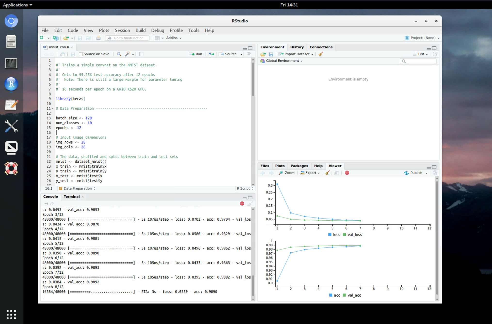

```{r setup, include=FALSE}
  knitr::opts_chunk$set(echo = TRUE, eval = FALSE)
```

We are very pleased to announce the availability of an [RStudio TensorFlow template](https://tensorflow.rstudio.com/tools/cloud_desktop_gpu.html) for the [Paperspace](https://www.paperspace.com/) cloud desktop service.

If you don't have local access to a modern NVIDIA GPU, your best bet is typically to run GPU intensive training jobs in the cloud. Paperspace is a cloud service that provides access to a fully preconfigured Ubuntu 16.04 desktop environment equipped with a GPU. With the addition of the [RStudio TensorFlow template](https://tensorflow.rstudio.com/tools/cloud_desktop_gpu.html) you can now provision a ready to use RStudio TensorFlow w/ GPU workstation in just a few clicks. Preconfigured software includes:

- RStudio Desktop and RStudio Server 

- NVIDIA GPU libraries (CUDA 8.0 and cuDNN 6.0)

- TensorFlow v1.4 w/ GPU

- The R [keras](https://tensorflow.rstudio.com/keras/), [tfestimators](https://tensorflow.rstudio.com/tfestimators/), and [tensorflow](https://tensorflow.rstudio.com/tensorflow/) packages.

- The [tidyverse](https://www.tidyverse.org) suite of packages (ggplot2, dplyr, tidyr, readr, etc.)

## Getting Started

To get started, first [signup for a Paperspace account](https://www.paperspace.com/account/signup) (you can use the `RSTUDIO` promo code when you sign up to receive a $5 account credit).

Then, create a new Paperspace instance using the [RStudio template](https://tensorflow.rstudio.com/tools/cloud_desktop_gpu.html):

<div class="l-body-outset">
{width=100%}
</div>

Then, choose one of the Paperspace GPU instances (as opposed to the CPU instances). For example, here we select the P4000 machine type which includes an NVIDIA Quadro P4000 GPU:

<div class="l-body-outset">
{width=100%}
</div>

See the [Cloud Desktop GPUs with Paperspace](https://tensorflow.rstudio.com/tools/cloud_desktop_gpu.html) article on the TensorFlow for R website for full details on getting started.


## Training a Convolutional MNIST Model

The performance gains for training convoluational and recurrent models on GPUs can be substantial. Let's try training the [Keras MNIST CNN example](https://tensorflow.rstudio.com/keras/articles/examples/mnist_cnn.html) on our new Paperspace instance:

<div class="l-body-outset">
{width=100%}
</div>

Training the model for 12 epochs takes about 1 minute (~ 5 seconds per epoch). On the other hand, training the same model on CPU on a high end Macbook Pro takes 15 minutes! (~ 75 seconds per epoch). Using a Paperspace GPU yields a *15x performance gain* in model training.

This model was trained on an [NVIDIA Quadro P4000](http://www.nvidia.com/object/quadro-graphics-with-pascal.html), which costs $0.40 per hour. Paperspace instances can be configured to automatically shut down after a period of inactivity to prevent accruing cloud charges when you aren't actually using the machine. 

If you are training convolutional or recurrent models and don't currently have access to a local NVIDIA GPU, using [RStudio on Paperspace](https://tensorflow.rstudio.com/tools/cloud_desktop_gpu.html) is a great way to accelerate training performance. You can use the `RSTUDIO` promo code when you sign up for Paperspace to receive a $5 account credit.


