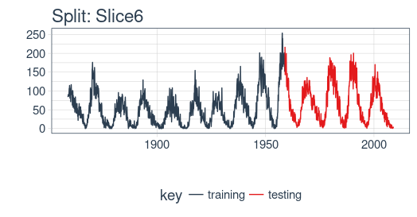
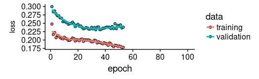
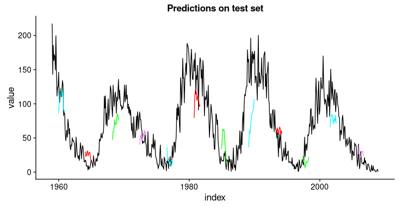

```{r setup, include=FALSE}
library(knitr)
opts_chunk$set(echo = TRUE, eval = FALSE)
```

## Forecasting sunspots with deep learning

In this post we will examine making time series predictions using the [sunspots](https://stat.ethz.ch/R-manual/R-devel/library/datasets/html/sunspot.month.html) dataset that ships with base R. Sunspots are dark spots on the sun, associated with lower temperature. Here's an image from NASA showing the solar phenomenon.


{.external width=100%}


We're using the monthly version of the dataset, `sunspots.month` (there is a yearly version, too).
It contains 265 years worth of data (from 1749 through 2013) on the number of sunspots per month. 

```{r, layout="l-body-outset", eval=TRUE, echo=FALSE}
include_graphics("images/sunspots_full.png")
```


Forecasting this dataset is challenging because of high short term variability as well as long-term irregularities evident in the cycles. For example, maximum amplitudes reached by the low frequency cycle differ a lot, as does the number of high frequency cycle steps needed to reach that maximum low frequency cycle height.

Our post will focus on two dominant aspects: how to apply deep learning to time series forecasting, and how to properly apply cross validation in this domain. 
For the latter, we will use the [rsample](https://cran.r-project.org/package=rsample) package that allows to do resampling on time series data.
As to the former, our goal is not to reach utmost performance but to show the general course of action when using recurrent neural networks to model this kind of data.


## Recurrent neural networks

When our data has a sequential structure, it is recurrent neural networks (RNNs) we use to model it.

As of today, among RNNs, the best established architectures are the GRU (Gated Recurrent Unit) and the LSTM (Long Short Term Memory). For today, let's not zoom in on what makes them special, but on what they have in common with the most stripped-down RNN: the basic recurrence structure.

In contrast to the prototype of a neural network, often called Multilayer Perceptron (MLP), the RNN has a state that is carried on over time. This is nicely seen in this diagram from [Goodfellow et al.](http://www.deeplearningbook.org), a.k.a. the "bible of deep learning":


{.external}


At each time, the state is a combination of the current input and the previous hidden state. This is reminiscent of autoregressive models, but with neural networks, there has to be some point where we halt the dependence.

That's because in order to determine the weights, we keep calculating how our loss changes as the input changes.
Now if the input we have to consider, at an arbitrary timestep, ranges back indefinitely - then we will not be able to calculate all those gradients.
In practice, then, our hidden state will, at every iteration, be carried forward through a fixed number of steps.

We'll come back to that as soon as we've loaded and pre-processed the data.


## Setup, pre-processing, and exploration

### Libraries

Here, first, are the libraries needed for this tutorial. 

```{r}
# Core Tidyverse
library(tidyverse)
library(glue)
library(forcats)

# Time Series
library(timetk)
library(tidyquant)
library(tibbletime)

# Visualization
library(cowplot)

# Preprocessing
library(recipes)

# Sampling / Accuracy
library(rsample)
library(yardstick) 

# Modeling
library(keras)
library(tfruns)
```


If you have not previously run Keras in R, you will need to install Keras using the `install_keras()` function.

``` {r, eval = F}
# Install Keras if you have not installed before
install_keras()
```


### Data 

`sunspot.month` is a `ts` class (not tidy), so we'll convert to a tidy data set using the `tk_tbl()` function from `timetk`. We use this instead of `as.tibble()` from `tibble` to automatically preserve the time series index as a `zoo` `yearmon` index. Last, we'll convert the `zoo` index to date using `lubridate::as_date()` (loaded with `tidyquant`) and then change to a `tbl_time` object to make time series operations easier.

```{r}
sun_spots <- datasets::sunspot.month %>%
    tk_tbl() %>%
    mutate(index = as_date(index)) %>%
    as_tbl_time(index = index)

sun_spots
```

```
# A time tibble: 3,177 x 2
# Index: index
   index      value
   <date>     <dbl>
 1 1749-01-01  58  
 2 1749-02-01  62.6
 3 1749-03-01  70  
 4 1749-04-01  55.7
 5 1749-05-01  85  
 6 1749-06-01  83.5
 7 1749-07-01  94.8
 8 1749-08-01  66.3
 9 1749-09-01  75.9
10 1749-10-01  75.5
# ... with 3,167 more rows
```


### Exploratory data analysis

The time series is long (265 years!). We can visualize the time series both in full, and zoomed in on the first 10 years to get a feel for the series. 

#### Visualizing sunspot data with cowplot

We'll make two `ggplot`s and combine them using `cowplot::plot_grid()`. Note that for the zoomed in plot, we make use of `tibbletime::time_filter()`, which is an easy way to perform time-based filtering. 

```{r, fig.height=7}
p1 <- sun_spots %>%
    ggplot(aes(index, value)) +
    geom_point(color = palette_light()[[1]], alpha = 0.5) +
    theme_tq() +
    labs(
        title = "From 1749 to 2013 (Full Data Set)"
    )

p2 <- sun_spots %>%
    filter_time("start" ~ "1800") %>%
    ggplot(aes(index, value)) +
    geom_line(color = palette_light()[[1]], alpha = 0.5) +
    geom_point(color = palette_light()[[1]]) +
    geom_smooth(method = "loess", span = 0.2, se = FALSE) +
    theme_tq() +
    labs(
        title = "1749 to 1759 (Zoomed In To Show Changes over the Year)",
        caption = "datasets::sunspot.month"
    )

p_title <- ggdraw() + 
  draw_label("Sunspots", size = 18, fontface = "bold", 
             colour = palette_light()[[1]])

plot_grid(p_title, p1, p2, ncol = 1, rel_heights = c(0.1, 1, 1))
```

```{r, layout="l-body-outset", eval=TRUE, echo=FALSE}
include_graphics("images/cowplot.png")
```


### Backtesting: time series cross validation

When doing cross validation on sequential data, the time dependencies on preceding samples must be preserved. We can create a cross validation sampling plan by offsetting the window used to select sequential sub-samples. In essence, we're creatively dealing with the fact that there's no future test data available by creating multiple synthetic "futures" -  a process often, esp. in finance, called "backtesting".

As mentioned in the introduction, the [rsample](https://cran.r-project.org/package=rsample) package includes facitlities for backtesting on time series. The vignette, ["Time Series Analysis Example"](https://tidymodels.github.io/rsample/articles/Applications/Time_Series.html), describes a procedure that uses the `rolling_origin()` function to create samples designed for time series cross validation. We'll use this approach.

#### Developing a backtesting strategy

The sampling plan we create uses 100 years (`initial` = 12 x 100 samples) for the training set and 50 years (`assess` = 12 x 50) for the testing (validation) set. We select a `skip` span of about 22 years (`skip` = 12 x 22 - 1) to approximately evenly distribute the samples into 6 sets that span the entire 265 years of sunspots history. Last, we select `cumulative = FALSE` to allow the origin to shift which ensures that models on more recent data are not given an unfair advantage (more observations) over those operating on less recent data. The tibble return contains the `rolling_origin_resamples`.

```{r}
periods_train <- 12 * 100
periods_test  <- 12 * 50
skip_span     <- 12 * 22 - 1

rolling_origin_resamples <- rolling_origin(
  sun_spots,
  initial    = periods_train,
  assess     = periods_test,
  cumulative = FALSE,
  skip       = skip_span
)

rolling_origin_resamples
```

```
# Rolling origin forecast resampling 
# A tibble: 6 x 2
  splits       id    
  <list>       <chr> 
1 <S3: rsplit> Slice1
2 <S3: rsplit> Slice2
3 <S3: rsplit> Slice3
4 <S3: rsplit> Slice4
5 <S3: rsplit> Slice5
6 <S3: rsplit> Slice6
```

#### Visualizing the backtesting strategy

We can visualize the resamples with two custom functions. The first, `plot_split()`, plots one of the resampling splits using `ggplot2`. Note that an `expand_y_axis` argument is added to expand the date range to the full `sun_spots` dataset date range. This will become useful when we visualize all plots together. 

```{r}
# Plotting function for a single split
plot_split <- function(split, expand_y_axis = TRUE, 
                       alpha = 1, size = 1, base_size = 14) {
    
    # Manipulate data
    train_tbl <- training(split) %>%
        add_column(key = "training") 
    
    test_tbl  <- testing(split) %>%
        add_column(key = "testing") 
    
    data_manipulated <- bind_rows(train_tbl, test_tbl) %>%
        as_tbl_time(index = index) %>%
        mutate(key = fct_relevel(key, "training", "testing"))
        
    # Collect attributes
    train_time_summary <- train_tbl %>%
        tk_index() %>%
        tk_get_timeseries_summary()
    
    test_time_summary <- test_tbl %>%
        tk_index() %>%
        tk_get_timeseries_summary()
    
    # Visualize
    g <- data_manipulated %>%
        ggplot(aes(x = index, y = value, color = key)) +
        geom_line(size = size, alpha = alpha) +
        theme_tq(base_size = base_size) +
        scale_color_tq() +
        labs(
          title    = glue("Split: {split$id}"),
          subtitle = glue("{train_time_summary$start} to ", 
                          "{test_time_summary$end}"),
            y = "", x = ""
        ) +
        theme(legend.position = "none") 
    
    if (expand_y_axis) {
        
        sun_spots_time_summary <- sun_spots %>% 
            tk_index() %>% 
            tk_get_timeseries_summary()
        
        g <- g +
            scale_x_date(limits = c(sun_spots_time_summary$start, 
                                    sun_spots_time_summary$end))
    }
    
    g
}
```

The `plot_split()` function takes one split (in this case Slice01), and returns a visual of the sampling strategy. We expand the axis to the range for the full dataset using `expand_y_axis = TRUE`. 

```{r, fig.height=3.5}
rolling_origin_resamples$splits[[1]] %>%
    plot_split(expand_y_axis = TRUE) +
    theme(legend.position = "bottom")
```


```{r, layout="l-body", eval=TRUE, echo=FALSE}
include_graphics("images/slice1.png")
```


The second function, `plot_sampling_plan()`, scales the `plot_split()` function to all of the samples using `purrr` and `cowplot`.

```{r}
# Plotting function that scales to all splits 
plot_sampling_plan <- function(sampling_tbl, expand_y_axis = TRUE, 
                               ncol = 3, alpha = 1, size = 1, base_size = 14, 
                               title = "Sampling Plan") {
    
    # Map plot_split() to sampling_tbl
    sampling_tbl_with_plots <- sampling_tbl %>%
        mutate(gg_plots = map(splits, plot_split, 
                              expand_y_axis = expand_y_axis,
                              alpha = alpha, base_size = base_size))
    
    # Make plots with cowplot
    plot_list <- sampling_tbl_with_plots$gg_plots 
    
    p_temp <- plot_list[[1]] + theme(legend.position = "bottom")
    legend <- get_legend(p_temp)
    
    p_body  <- plot_grid(plotlist = plot_list, ncol = ncol)
    
    p_title <- ggdraw() + 
        draw_label(title, size = 14, fontface = "bold", 
                   colour = palette_light()[[1]])
    
    g <- plot_grid(p_title, p_body, legend, ncol = 1, 
                   rel_heights = c(0.05, 1, 0.05))
    
    g
    
}
```


We can now visualize the entire backtesting strategy with `plot_sampling_plan()`. We can see how the sampling plan shifts the sampling window with each progressive slice of the train/test splits. 

```{r, fig.height=8}
rolling_origin_resamples %>%
    plot_sampling_plan(expand_y_axis = T, ncol = 3, alpha = 1, size = 1, base_size = 10, 
                       title = "Backtesting Strategy: Rolling Origin Sampling Plan")
```

<br/>

```{r, layout="l-body-outset", eval=TRUE, echo=FALSE}
include_graphics("images/all_splits.png")
```


And, we can set `expand_y_axis = FALSE` to zoom in on the samples. 

```{r, fig.height=8}
rolling_origin_resamples %>%
    plot_sampling_plan(expand_y_axis = F, ncol = 3, alpha = 1, size = 1, base_size = 10, 
                       title = "Backtesting Strategy: Zoomed In")
```

<br/>

```{r, layout="l-body-outset", eval=TRUE, echo=FALSE}
include_graphics("images/all_splits_zoomed.png")
```

We'll use this backtesting strategy (6 samples from one time series each with 50/10 split in years and a ~20 year offset) when testing the veracity of the LSTM model on the sunspots dataset. 


## The LSTM model

To begin, we'll develop an LSTM model on a single sample from the backtesting strategy, namely, the most recent slice. We'll then apply the model to all samples to investigate modeling performance. 

```{r}
example_split    <- rolling_origin_resamples$splits[[6]]
example_split_id <- rolling_origin_resamples$id[[6]]
```

We can reuse the `plot_split()` function to visualize the split. Set `expand_y_axis = FALSE` to zoom in on the subsample. 

```{r, fig.height=3.5}
plot_split(example_split, expand_y_axis = FALSE, size = 0.5) +
    theme(legend.position = "bottom") +
    ggtitle(glue("Split: {example_split_id}"))
```



### Data setup

To aid hyperparameter tuning, besides the training set we also need a validation set.
For example, we will use a callback, `callback_early_stopping`, that stops training when no significant performance is seen on the validation set (what's considered significant is up to you).

We will dedicate 2 thirds of the analysis set to training, and 1 third to validation.

```{r}
df_trn <- analysis(example_split)[1:800, , drop = FALSE]
df_val <- analysis(example_split)[801:1200, , drop = FALSE]
df_tst <- assessment(example_split)
```


First, let's combine the training and testing data sets into a single data set with a column `key` that specifies where they came from (either "training" or "testing)". Note that the `tbl_time` object will need to have the index respecified during the `bind_rows()` step, but [this issue](https://github.com/tidyverse/dplyr/issues/3259) should be corrected in `dplyr` soon. 

```{r}
df <- bind_rows(
  df_trn %>% add_column(key = "training"),
  df_val %>% add_column(key = "validation"),
  df_tst %>% add_column(key = "testing")
) %>%
  as_tbl_time(index = index)

df
```

```
# A time tibble: 1,800 x 3
# Index: index
   index      value key     
   <date>     <dbl> <chr>   
 1 1849-06-01  81.1 training
 2 1849-07-01  78   training
 3 1849-08-01  67.7 training
 4 1849-09-01  93.7 training
 5 1849-10-01  71.5 training
 6 1849-11-01  99   training
 7 1849-12-01  97   training
 8 1850-01-01  78   training
 9 1850-02-01  89.4 training
10 1850-03-01  82.6 training
# ... with 1,790 more rows
```

### Preprocessing with recipes

The LSTM algorithm will usually work better if the input data has been centered and scaled. We can conveniently accomplish this using the `recipes` package. In addition to `step_center` and `step_scale`, we're using `step_sqrt` to reduce variance and remov outliers. The actual transformations are executed when we `bake` the data according to the recipe: 

```{r}
rec_obj <- recipe(value ~ ., df) %>%
    step_sqrt(value) %>%
    step_center(value) %>%
    step_scale(value) %>%
    prep()

df_processed_tbl <- bake(rec_obj, df)

df_processed_tbl
```

```
# A tibble: 1,800 x 3
   index      value key     
   <date>     <dbl> <fct>   
 1 1849-06-01 0.714 training
 2 1849-07-01 0.660 training
 3 1849-08-01 0.473 training
 4 1849-09-01 0.922 training
 5 1849-10-01 0.544 training
 6 1849-11-01 1.01  training
 7 1849-12-01 0.974 training
 8 1850-01-01 0.660 training
 9 1850-02-01 0.852 training
10 1850-03-01 0.739 training
# ... with 1,790 more rows
```

Next, let's capture the original center and scale so we can invert the steps after modeling. The square root step can then simply be undone by squaring the back-transformed data. 

```{r}
center_history <- rec_obj$steps[[2]]$means["value"]
scale_history  <- rec_obj$steps[[3]]$sds["value"]

c("center" = center_history, "scale" = scale_history)
```

```
center.value  scale.value 
    6.694468     3.238935 
```

### Reshaping the data

Keras LSTM expects the input as well as the target data to be in a specific shape.
The input has to be a 3-d array of size `num_samples, num_timesteps, num_features`.

Here, `num_samples` is the number of observations in the set. This will get fed to the model in portions of `batch_size`. The second dimension, `num_timesteps`, is the length of the hidden state we were talking about above. Finally, the third dimension is the number of predictors we're using. For univariate time series, this is 1.

How long should we choose the hidden state to be? This generally depends on the dataset and our goal.
If we did one-step-ahead forecasts - thus, forecasting the following month only - our main concern would be choosing a state length that allows to learn any patterns present in the data. 

Now say we wanted to forecast 12 months instead, as does [SILSO](http://sidc.be/silso/home), the _World Data Center for the production, preservation and dissemination of the international sunspot number_.
The way we can do this, with Keras, is by wiring the LSTM hidden states to sets of consecutive outputs of the same length. Thus, if we want to produce predictions for 12 months, our LSTM should have a hidden state length of 12.

These 12 time steps will then get wired to 12 linear predictor units using a `time_distributed()` wrapper.
That wrapper's task is to apply the same calculation (i.e., the same weight matrix) to every state input it receives.

Now, what's the target array's format supposed to be? As we're forecasting several timesteps here, the target data again needs to be 3-dimensional. Dimension 1 again is the batch dimension, dimension 2 again corresponds to the number of timesteps (the forecasted ones), and dimension 3 is the size of the wrapped layer.
In our case, the wrapped layer is a `layer_dense()` of a single unit, as we want exactly one prediction per point in time.

So, let's reshape the data. The main action here is creating the sliding windows of 12 steps of input, followed by 12 steps of output each. This is easiest to understand with a shorter and simpler example. Say our input were the numbers from 1 to 10, and our chosen sequence length (state size) were 4. Tthis is how we would want our training input to look:

```
1,2,3,4
2,3,4,5
3,4,5,6
```

And our target data, correspondingly:

```
5,6,7,8
6,7,8,9
7,8,9,10
```

We'll define a short function that does this reshaping on a given dataset.
Then finally, we add the third axis that is formally needed (even though that axis is of size 1 in our case).


```{r}
# these variables are being defined just because of the order in which
# we present things in this post (first the data, then the model)
# they will be superseded by FLAGS$n_timesteps, FLAGS$batch_size and n_predictions
# in the following snippet
n_timesteps <- 12
n_predictions <- n_timesteps
batch_size <- 10

# functions used
build_matrix <- function(tseries, overall_timesteps) {
  t(sapply(1:(length(tseries) - overall_timesteps + 1), function(x) 
    tseries[x:(x + overall_timesteps - 1)]))
}

reshape_X_3d <- function(X) {
  dim(X) <- c(dim(X)[1], dim(X)[2], 1)
  X
}

# extract values from data frame
train_vals <- df_processed_tbl %>%
  filter(key == "training") %>%
  select(value) %>%
  pull()
valid_vals <- df_processed_tbl %>%
  filter(key == "validation") %>%
  select(value) %>%
  pull()
test_vals <- df_processed_tbl %>%
  filter(key == "testing") %>%
  select(value) %>%
  pull()


# build the windowed matrices
train_matrix <-
  build_matrix(train_vals, n_timesteps + n_predictions)
valid_matrix <-
  build_matrix(valid_vals, n_timesteps + n_predictions)
test_matrix <- build_matrix(test_vals, n_timesteps + n_predictions)

# separate matrices into training and testing parts
# also, discard last batch if there are fewer than batch_size samples
# (a purely technical requirement)
X_train <- train_matrix[, 1:n_timesteps]
y_train <- train_matrix[, (n_timesteps + 1):(n_timesteps * 2)]
X_train <- X_train[1:(nrow(X_train) %/% batch_size * batch_size), ]
y_train <- y_train[1:(nrow(y_train) %/% batch_size * batch_size), ]

X_valid <- valid_matrix[, 1:n_timesteps]
y_valid <- valid_matrix[, (n_timesteps + 1):(n_timesteps * 2)]
X_valid <- X_valid[1:(nrow(X_valid) %/% batch_size * batch_size), ]
y_valid <- y_valid[1:(nrow(y_valid) %/% batch_size * batch_size), ]

X_test <- test_matrix[, 1:n_timesteps]
y_test <- test_matrix[, (n_timesteps + 1):(n_timesteps * 2)]
X_test <- X_test[1:(nrow(X_test) %/% batch_size * batch_size), ]
y_test <- y_test[1:(nrow(y_test) %/% batch_size * batch_size), ]
# add on the required third axis
X_train <- reshape_X_3d(X_train)
X_valid <- reshape_X_3d(X_valid)
X_test <- reshape_X_3d(X_test)

y_train <- reshape_X_3d(y_train)
y_valid <- reshape_X_3d(y_valid)
y_test <- reshape_X_3d(y_test)
```


### Building the LSTM model

Now that we have our data in the required form, let's finally build the model. 
As always in deep learning, an important, and often time-consuming, part of the job is tuning hyperparameters. To keep this post self-contained, and considering this is primarily a tutorial on how to use LSTM in R, let's assume the following settings were found after extensive experimentation (in reality experimentation _did_ take place, but not to a degree that performance couldn't possibly be improved).

Instead of hard coding the hyperparameters, we'll use [tfruns](https://tensorflow.rstudio.com/tools/tfruns/articles/tuning.html) to set up an environment where we could easily perform grid search.

We'll quickly comment on what these parameters do but mainly leave those topics to further posts.


```{r}
FLAGS <- flags(
  # There is a so-called "stateful LSTM" in Keras. While LSTM is stateful
  # per se, this adds a further tweak where the hidden states get 
  # initialized with values from the item at same position in the previous
  # batch. This is helpful just under specific circumstances, or if you want
  # to create an "infinite stream" of states, in which case you'd use 1 as 
  # the batch size. Below, we show how the code would have to be changed to
  # use this, but it won't be further discussed here.
  flag_boolean("stateful", FALSE),
  # Should we use several layers of LSTM?
  # Again, just included for completeness, it did not yield any superior 
  # performance on this task.
  # This will actually stack exactly one additional layer of LSTM units.
  flag_boolean("stack_layers", FALSE),
  # number of samples fed to the model in one go
  flag_integer("batch_size", 10),
  # size of the hidden state, equals size of predictions
  flag_integer("n_timesteps", 12),
  # how many epochs to train for
  flag_integer("n_epochs", 100),
  # fraction of the units to drop for the linear transformation of the inputs
  flag_numeric("dropout", 0.2),
  # fraction of the units to drop for the linear transformation of the 
  # recurrent state
  flag_numeric("recurrent_dropout", 0.2),
  # loss function. Found to work better for this specific case than mean
  # squared error
  flag_string("loss", "logcosh"),
  # optimizer = stochastic gradient descent. Seemed to work better than adam 
  # or rmsprop here (as indicated by limited testing)
  flag_string("optimizer_type", "sgd"),
  # size of the LSTM layer
  flag_integer("n_units", 128),
  # learning rate
  flag_numeric("lr", 0.003),
  # momentum, an additional parameter to the SGD optimizer
  flag_numeric("momentum", 0.9),
  # parameter to the early stopping callback
  flag_integer("patience", 10)
)

# the number of predictions we'll make equals the length of the hidden state
n_predictions <- FLAGS$n_timesteps
# how many features = predictors we have
n_features <- 1
# just in case we wanted to try different optimizers, we could add here
optimizer <- switch(FLAGS$optimizer_type,
                    sgd = optimizer_sgd(lr = FLAGS$lr, 
                                        momentum = FLAGS$momentum)
                    )

# callbacks to be passed to the fit() function
# We just use one here: we may stop before n_epochs if the loss on the
# validation set does not decrease (by a configurable amount, over a 
# configurable time)
callbacks <- list(
  callback_early_stopping(patience = FLAGS$patience)
)
```


After all these preparations, the code for constructing and training the model is rather short!
Let's first quickly view the "long version", that would allow you to test stacking several LSTMs or use a stateful LSTM, then go through the final short version (that does neither) and comment on it.

This, just for reference, is the complete code.


```{r}
model <- keras_model_sequential()

model %>%
  layer_lstm(
    units = FLAGS$n_units,
    batch_input_shape = c(FLAGS$batch_size, FLAGS$n_timesteps, n_features),
    dropout = FLAGS$dropout,
    recurrent_dropout = FLAGS$recurrent_dropout,
    return_sequences = TRUE,
    stateful = FLAGS$stateful
  )

if (FLAGS$stack_layers) {
  model %>%
    layer_lstm(
      units = FLAGS$n_units,
      dropout = FLAGS$dropout,
      recurrent_dropout = FLAGS$recurrent_dropout,
      return_sequences = TRUE,
      stateful = FLAGS$stateful
    )
}
model %>% time_distributed(layer_dense(units = 1))

model %>%
  compile(
    loss = FLAGS$loss,
    optimizer = optimizer,
    metrics = list("mean_squared_error")
  )

if (!FLAGS$stateful) {
  model %>% fit(
    x          = X_train,
    y          = y_train,
    validation_data = list(X_valid, y_valid),
    batch_size = FLAGS$batch_size,
    epochs     = FLAGS$n_epochs,
    callbacks = callbacks
  )
  
} else {
  for (i in 1:FLAGS$n_epochs) {
    model %>% fit(
      x          = X_train,
      y          = y_train,
      validation_data = list(X_valid, y_valid),
      callbacks = callbacks,
      batch_size = FLAGS$batch_size,
      epochs     = 1,
      shuffle    = FALSE
    )
    model %>% reset_states()
  }
}

if (FLAGS$stateful)
  model %>% reset_states()

```


Now let's step through the simpler, yet better (or equally) performing configuration below.

```{r}
# create the model
model <- keras_model_sequential()

# add layers
# we have just two, the LSTM and the time_distributed 
model %>%
  layer_lstm(
    units = FLAGS$n_units, 
    # the first layer in a model needs to know the shape of the input data
    batch_input_shape  = c(FLAGS$batch_size, FLAGS$n_timesteps, n_features),
    dropout = FLAGS$dropout,
    recurrent_dropout = FLAGS$recurrent_dropout,
    # by default, an LSTM just returns the final state
    return_sequences = TRUE
  ) %>% time_distributed(layer_dense(units = 1))

model %>%
  compile(
    loss = FLAGS$loss,
    optimizer = optimizer,
    # in addition to the loss, Keras will inform us about current 
    # MSE while training
    metrics = list("mean_squared_error")
  )

history <- model %>% fit(
  x          = X_train,
  y          = y_train,
  validation_data = list(X_valid, y_valid),
  batch_size = FLAGS$batch_size,
  epochs     = FLAGS$n_epochs,
  callbacks = callbacks
)

```

As we see, training was stopped after ~55 epochs as validation loss did not decrease any more.
We also see that performance on the validation set is way worse than performance on the training set - normally indicating overfitting.

This topic too, we'll leave to a separate discussion another time, but interestingly regularization using higher values of `dropout` and `recurrent_dropout` (combined with increasing model capacity) did not yield better generalization performance. This is probably related to the characteristics of this specific time series we mentioned in the introduction.

```{r}
plot(history, metrics = "loss")
```





Now let's see how well the model was able to capture the characteristics of the training set.


```{r}
pred_train <- model %>%
  predict(X_train, batch_size = FLAGS$batch_size) %>%
  .[, , 1]

# Retransform values to original scale
pred_train <- (pred_train * scale_history + center_history) ^2
compare_train <- df %>% filter(key == "training")

# build a dataframe that has both actual and predicted values
for (i in 1:nrow(pred_train)) {
  varname <- paste0("pred_train", i)
  compare_train <-
    mutate(compare_train,!!varname := c(
      rep(NA, FLAGS$n_timesteps + i - 1),
      pred_train[i,],
      rep(NA, nrow(compare_train) - FLAGS$n_timesteps * 2 - i + 1)
    ))
}
```


We compute the average RSME over all sequences of predictions.

```{r}
coln <- colnames(compare_train)[4:ncol(compare_train)]
cols <- map(coln, quo(sym(.)))
rsme_train <-
  map_dbl(cols, function(col)
    rmse(
      compare_train,
      truth = value,
      estimate = !!col,
      na.rm = TRUE
    )) %>% mean()

rsme_train
```

```
21.01495
```

How do these predictions really look? As a visualization of all predicted sequences would look pretty crowded, we arbitrarily pick start points at regular intervals.

```{r}
ggplot(compare_train, aes(x = index, y = value)) + geom_line() +
  geom_line(aes(y = pred_train1), color = "cyan") +
  geom_line(aes(y = pred_train50), color = "red") +
  geom_line(aes(y = pred_train100), color = "green") +
  geom_line(aes(y = pred_train150), color = "violet") +
  geom_line(aes(y = pred_train200), color = "cyan") +
  geom_line(aes(y = pred_train250), color = "red") +
  geom_line(aes(y = pred_train300), color = "red") +
  geom_line(aes(y = pred_train350), color = "green") +
  geom_line(aes(y = pred_train400), color = "cyan") +
  geom_line(aes(y = pred_train450), color = "red") +
  geom_line(aes(y = pred_train500), color = "green") +
  geom_line(aes(y = pred_train550), color = "violet") +
  geom_line(aes(y = pred_train600), color = "cyan") +
  geom_line(aes(y = pred_train650), color = "red") +
  geom_line(aes(y = pred_train700), color = "red") +
  geom_line(aes(y = pred_train750), color = "green") +
  ggtitle("Predictions on the training set")
```

```{r, layout="l-body-outset", eval=TRUE, echo=FALSE}
include_graphics("images/pred_train.png")
```


This looks pretty good. From the validation loss, we don't quite expect the same from the test set, though.

Let's see. 

```{r}
pred_test <- model %>%
  predict(X_test, batch_size = FLAGS$batch_size) %>%
  .[, , 1]

# Retransform values to original scale
pred_test <- (pred_test * scale_history + center_history) ^2
pred_test[1:10, 1:5] %>% print()
compare_test <- df %>% filter(key == "testing")

# build a dataframe that has both actual and predicted values
for (i in 1:nrow(pred_test)) {
  varname <- paste0("pred_test", i)
  compare_test <-
    mutate(compare_test,!!varname := c(
      rep(NA, FLAGS$n_timesteps + i - 1),
      pred_test[i,],
      rep(NA, nrow(compare_test) - FLAGS$n_timesteps * 2 - i + 1)
    ))
}

compare_test %>% write_csv(str_replace(model_path, ".hdf5", ".test.csv"))
compare_test[FLAGS$n_timesteps:(FLAGS$n_timesteps + 10), c(2, 4:8)] %>% print()

coln <- colnames(compare_test)[4:ncol(compare_test)]
cols <- map(coln, quo(sym(.)))
rsme_test <-
  map_dbl(cols, function(col)
    rmse(
      compare_test,
      truth = value,
      estimate = !!col,
      na.rm = TRUE
    )) %>% mean()

rsme_test
```

```
31.31616
```

```{r}
ggplot(compare_test, aes(x = index, y = value)) + geom_line() +
  geom_line(aes(y = pred_test1), color = "cyan") +
  geom_line(aes(y = pred_test50), color = "red") +
  geom_line(aes(y = pred_test100), color = "green") +
  geom_line(aes(y = pred_test150), color = "violet") +
  geom_line(aes(y = pred_test200), color = "cyan") +
  geom_line(aes(y = pred_test250), color = "red") +
  geom_line(aes(y = pred_test300), color = "green") +
  geom_line(aes(y = pred_test350), color = "cyan") +
  geom_line(aes(y = pred_test400), color = "red") +
  geom_line(aes(y = pred_test450), color = "green") +  
  geom_line(aes(y = pred_test500), color = "cyan") +
  geom_line(aes(y = pred_test550), color = "violet") +
  ggtitle("Predictions on test set")
```

```{r, layout="l-body-outset", eval=TRUE, echo=FALSE}

```


That's not as good as on the training set, but not bad either, given this time series is quite challenging.

Having defined and run our model on a manually chosen example split, let's now revert to our overall re-sampling frame.


### Backtesting the model on all splits

To obtain predictions on all splits, we move the above code into a function and apply it to all splits.
First, here's the function. It returns a list of two dataframes, one for the training and test sets each, that contain the model's predictions together with the actual values.


```{r}
obtain_predictions <- function(split) {
  df_trn <- analysis(split)[1:800, , drop = FALSE]
  df_val <- analysis(split)[801:1200, , drop = FALSE]
  df_tst <- assessment(split)
  
  df <- bind_rows(
    df_trn %>% add_column(key = "training"),
    df_val %>% add_column(key = "validation"),
    df_tst %>% add_column(key = "testing")
  ) %>%
    as_tbl_time(index = index)
  
  rec_obj <- recipe(value ~ ., df) %>%
    step_sqrt(value) %>%
    step_center(value) %>%
    step_scale(value) %>%
    prep()
  
  df_processed_tbl <- bake(rec_obj, df)
  
  center_history <- rec_obj$steps[[2]]$means["value"]
  scale_history  <- rec_obj$steps[[3]]$sds["value"]
  
  FLAGS <- flags(
    flag_boolean("stateful", FALSE),
    flag_boolean("stack_layers", FALSE),
    flag_integer("batch_size", 10),
    flag_integer("n_timesteps", 12),
    flag_integer("n_epochs", 100),
    flag_numeric("dropout", 0.2),
    flag_numeric("recurrent_dropout", 0.2),
    flag_string("loss", "logcosh"),
    flag_string("optimizer_type", "sgd"),
    flag_integer("n_units", 128),
    flag_numeric("lr", 0.003),
    flag_numeric("momentum", 0.9),
    flag_integer("patience", 10)
  )
  
  n_predictions <- FLAGS$n_timesteps
  n_features <- 1
  
  optimizer <- switch(FLAGS$optimizer_type,
                      sgd = optimizer_sgd(lr = FLAGS$lr, momentum = FLAGS$momentum))
  callbacks <- list(
    callback_early_stopping(patience = FLAGS$patience)
  )
  
  train_vals <- df_processed_tbl %>%
    filter(key == "training") %>%
    select(value) %>%
    pull()
  valid_vals <- df_processed_tbl %>%
    filter(key == "validation") %>%
    select(value) %>%
    pull()
  test_vals <- df_processed_tbl %>%
    filter(key == "testing") %>%
    select(value) %>%
    pull()
  
  train_matrix <-
    build_matrix(train_vals, FLAGS$n_timesteps + n_predictions)
  valid_matrix <-
    build_matrix(valid_vals, FLAGS$n_timesteps + n_predictions)
  test_matrix <-
    build_matrix(test_vals, FLAGS$n_timesteps + n_predictions)
  
  X_train <- train_matrix[, 1:FLAGS$n_timesteps]
  y_train <-
    train_matrix[, (FLAGS$n_timesteps + 1):(FLAGS$n_timesteps * 2)]
  X_train <-
    X_train[1:(nrow(X_train) %/% FLAGS$batch_size * FLAGS$batch_size),]
  y_train <-
    y_train[1:(nrow(y_train) %/% FLAGS$batch_size * FLAGS$batch_size),]
  
  X_valid <- valid_matrix[, 1:FLAGS$n_timesteps]
  y_valid <-
    valid_matrix[, (FLAGS$n_timesteps + 1):(FLAGS$n_timesteps * 2)]
  X_valid <-
    X_valid[1:(nrow(X_valid) %/% FLAGS$batch_size * FLAGS$batch_size),]
  y_valid <-
    y_valid[1:(nrow(y_valid) %/% FLAGS$batch_size * FLAGS$batch_size),]
  
  X_test <- test_matrix[, 1:FLAGS$n_timesteps]
  y_test <-
    test_matrix[, (FLAGS$n_timesteps + 1):(FLAGS$n_timesteps * 2)]
  X_test <-
    X_test[1:(nrow(X_test) %/% FLAGS$batch_size * FLAGS$batch_size),]
  y_test <-
    y_test[1:(nrow(y_test) %/% FLAGS$batch_size * FLAGS$batch_size),]
  
  X_train <- reshape_X_3d(X_train)
  X_valid <- reshape_X_3d(X_valid)
  X_test <- reshape_X_3d(X_test)
  
  y_train <- reshape_X_3d(y_train)
  y_valid <- reshape_X_3d(y_valid)
  y_test <- reshape_X_3d(y_test)
  
  model <- keras_model_sequential()
  
  model %>%
    layer_lstm(
      units            = FLAGS$n_units,
      batch_input_shape  = c(FLAGS$batch_size, FLAGS$n_timesteps, n_features),
      dropout = FLAGS$dropout,
      recurrent_dropout = FLAGS$recurrent_dropout,
      return_sequences = TRUE
    )     %>% time_distributed(layer_dense(units = 1))
  
  model %>%
    compile(
      loss = FLAGS$loss,
      optimizer = optimizer,
      metrics = list("mean_squared_error")
    )
  
  model %>% fit(
    x          = X_train,
    y          = y_train,
    validation_data = list(X_valid, y_valid),
    batch_size = FLAGS$batch_size,
    epochs     = FLAGS$n_epochs,
    callbacks = callbacks
  )
  
  
  pred_train <- model %>%
    predict(X_train, batch_size = FLAGS$batch_size) %>%
    .[, , 1]
  
  # Retransform values
  pred_train <- (pred_train * scale_history + center_history) ^ 2
  compare_train <- df %>% filter(key == "training")
  
  for (i in 1:nrow(pred_train)) {
    varname <- paste0("pred_train", i)
    compare_train <-
      mutate(compare_train, !!varname := c(
        rep(NA, FLAGS$n_timesteps + i - 1),
        pred_train[i, ],
        rep(NA, nrow(compare_train) - FLAGS$n_timesteps * 2 - i + 1)
      ))
  }
  
  pred_test <- model %>%
    predict(X_test, batch_size = FLAGS$batch_size) %>%
    .[, , 1]
  
  # Retransform values
  pred_test <- (pred_test * scale_history + center_history) ^ 2
  compare_test <- df %>% filter(key == "testing")
  
  for (i in 1:nrow(pred_test)) {
    varname <- paste0("pred_test", i)
    compare_test <-
      mutate(compare_test, !!varname := c(
        rep(NA, FLAGS$n_timesteps + i - 1),
        pred_test[i, ],
        rep(NA, nrow(compare_test) - FLAGS$n_timesteps * 2 - i + 1)
      ))
  }
  list(train = compare_train, test = compare_test)
  
}

```


Mapping the function over all splits yields a list of predictions.

```{r, eval = F}
all_split_preds <- rolling_origin_resamples %>%
     mutate(predict = map(splits, obtain_predictions))
```


Calculate RMSE on all splits:

```{r}
calc_rmse <- function(df) {
  coln <- colnames(df)[4:ncol(df)]
  cols <- map(coln, quo(sym(.)))
  map_dbl(cols, function(col)
    rmse(
      df,
      truth = value,
      estimate = !!col,
      na.rm = TRUE
    )) %>% mean()
}

all_split_preds <- all_split_preds %>% unnest(predict)
all_split_preds_train <- all_split_preds[seq(1, 11, by = 2), ]
all_split_preds_test <- all_split_preds[seq(2, 12, by = 2), ]

all_split_rmses_train <- all_split_preds_train %>%
  mutate(rmse = map_dbl(predict, calc_rmse)) %>%
  select(id, rmse)

all_split_rmses_test <- all_split_preds_test %>%
  mutate(rmse = map_dbl(predict, calc_rmse)) %>%
  select(id, rmse)
```


How does it look? Here's RMSE on the training set for the 6 splits.

```{r}
all_split_rmses_train
```

```
# A tibble: 6 x 2
  id      rmse
  <chr>  <dbl>
1 Slice1  22.2
2 Slice2  20.9
3 Slice3  18.8
4 Slice4  23.5
5 Slice5  22.1
6 Slice6  21.1
```

```{r}
all_split_rmses_test
```

```
# A tibble: 6 x 2
  id      rmse
  <chr>  <dbl>
1 Slice1  21.6
2 Slice2  20.6
3 Slice3  21.3
4 Slice4  31.4
5 Slice5  35.2
6 Slice6  31.4
```

Looking at these numbers, we see something interesting: Generalization performance is much better for the first three slices of the time series than for the latter ones. This confirms our impression, stated above, that there seems to be some hidden development going on, rendering forecasting more difficult.

And here are visualizations of the predictions on the respective training and test sets.

First, the training sets:

```{r}
plot_train <- function(slice, name) {
  ggplot(slice, aes(x = index, y = value)) + geom_line() +
    geom_line(aes(y = pred_train1), color = "cyan") +
    geom_line(aes(y = pred_train50), color = "red") +
    geom_line(aes(y = pred_train100), color = "green") +
    geom_line(aes(y = pred_train150), color = "violet") +
    geom_line(aes(y = pred_train200), color = "cyan") +
    geom_line(aes(y = pred_train250), color = "red") +
    geom_line(aes(y = pred_train300), color = "red") +
    geom_line(aes(y = pred_train350), color = "green") +
    geom_line(aes(y = pred_train400), color = "cyan") +
    geom_line(aes(y = pred_train450), color = "red") +
    geom_line(aes(y = pred_train500), color = "green") +
    geom_line(aes(y = pred_train550), color = "violet") +
    geom_line(aes(y = pred_train600), color = "cyan") +
    geom_line(aes(y = pred_train650), color = "red") +
    geom_line(aes(y = pred_train700), color = "red") +
    geom_line(aes(y = pred_train750), color = "green") +
    ggtitle(name)
}

train_plots <- map2(all_split_preds_train$predict, all_split_preds_train$id, plot_train)
p_body_train  <- plot_grid(plotlist = train_plots, ncol = 3)
p_title_train <- ggdraw() + 
  draw_label("Backtested Predictions: Training Sets", size = 18, fontface = "bold")

plot_grid(p_title_train, p_body_train, ncol = 1, rel_heights = c(0.05, 1, 0.05))
```

<br/>


```{r, layout="l-body-outset", eval=TRUE, echo=FALSE}
include_graphics("images/backtested_train.png")
```

And the test sets:

```{r}
plot_test <- function(slice, name) {
  ggplot(slice, aes(x = index, y = value)) + geom_line() +
    geom_line(aes(y = pred_test1), color = "cyan") +
    geom_line(aes(y = pred_test50), color = "red") +
    geom_line(aes(y = pred_test100), color = "green") +
    geom_line(aes(y = pred_test150), color = "violet") +
    geom_line(aes(y = pred_test200), color = "cyan") +
    geom_line(aes(y = pred_test250), color = "red") +
    geom_line(aes(y = pred_test300), color = "green") +
    geom_line(aes(y = pred_test350), color = "cyan") +
    geom_line(aes(y = pred_test400), color = "red") +
    geom_line(aes(y = pred_test450), color = "green") +  
    geom_line(aes(y = pred_test500), color = "cyan") +
    geom_line(aes(y = pred_test550), color = "violet") +
    ggtitle(name)
}

test_plots <- map2(all_split_preds_test$predict, all_split_preds_test$id, plot_test)

p_body_test  <- plot_grid(plotlist = test_plots, ncol = 3)
p_title_test <- ggdraw() + 
  draw_label("Backtested Predictions: Test Sets", size = 18, fontface = "bold")

plot_grid(p_title_test, p_body_test, ncol = 1, rel_heights = c(0.05, 1, 0.05))

```

<br/>

```{r, layout="l-body-outset", eval=TRUE, echo=FALSE}
include_graphics("images/backtested_test.png")
```


This has been a long post, and necessarily will have left a lot of questions open, first and foremost: How do we obtain good settings for the hyperparameters (learning rate, number of epochs, dropout)?
How do we choose the length of the hidden state? Or even, can we have an intuition how well LSTM will perform on a given dataset (with its specific characteristics)?
We will tackle questions like the above in upcoming posts.

