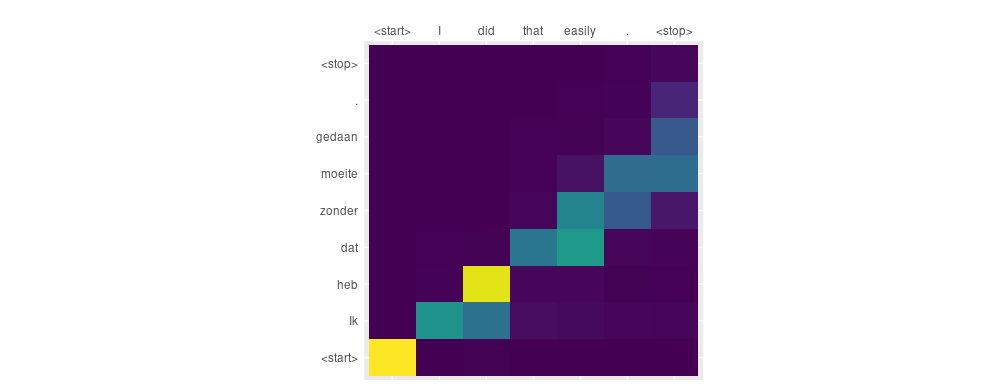

```{r setup, include=FALSE}
knitr::opts_chunk$set(echo = TRUE, eval = FALSE)
```

These days it is not difficult to find sample code that demonstrates sequence to sequence translation using Keras. However, within the past few years it has been established that depending on the task, incorporating an attention mechanism significantly improves performance. 
First and foremost, this was the case for neural machine translation (see [@BahdanauCB14] and [@LuongPM15] for prominent work). 
But other areas performing sequence to sequence translation were profiting from incorporating an attention mechanism, too: E.g., [@XuBKCCSZB15] applied attention to image captioning, and [@VinyalsKKPSH14], to parsing.

Ideally, using Keras, we'd just have an attention layer managing this for us. Unfortunately, as can be seen googling for code snippets and blog posts, implementing attention in pure Keras is not that straightforward.

Consequently, until a short time ago, the best thing to do seemed to be translating the [TensorFlow Neural Machine Translation Tutorial](https://github.com/tensorflow/nmt) to R TensorFlow. Then, [TensorFlow eager execution](https://www.tensorflow.org/guide/eager) happened, and turned out a game changer for a number of things that used to be difficult (not the least of which is debugging). With eager execution, tensor operations are executed immediately, as opposed to of building a graph to be evaluated later. This means we can immediately inspect the values in our tensors - and it also means we can imperatively code loops to perform interleavings of sorts that earlier were more challenging to accomplish.

Under these circumstances, it is not surprising that the [interactive notebook on neural machine translation](https://colab.research.google.com/github/tensorflow/tensorflow/blob/master/tensorflow/contrib/eager/python/examples/nmt_with_attention/nmt_with_attention.ipynb), published on Colaboratory, got a lot of attention for its straightforward implementation and highly intellegible explanations.
Our goal here is to do the same thing from R. We will not end up with Keras code exactly the way we used to write it, but a hybrid of Keras layers and imperative code enabled by TensorFlow eager execution.

## Prerequisites

The code in this post depends on the development versions of several of the TensorFlow R packages. You can install these packages as follows:

```r
devtools::install_github(c(
  "rstudio/reticulate"
  "rstudio/tensorflow",
  "rstudio/keras",
  "rstudio/tfdatasets"
))
```

You should also be sure that you are running the very latest version of TensorFlow (v1.9), which you can install like so:

```r
library(tensorflow)
install_tensorflow()
```

There are additional requirements for using TensorFlow eager execution. First, we need to call `tfe_enable_eager_execution()` right at the beginning of the program. Second, we need to use the implementation of Keras included in TensorFlow, rather than the base Keras implementation. This is because at a later point, we are going to access `model$variables` which at this point does not exist in base Keras.

We'll also use the [tfdatasets](https://tensorflow.rstudio.com/tools/tfdatasets/articles/introduction.html) package for our input pipeline. So we end up with the following libraries needed for this example:


```{r}
library(keras)
use_implementation("tensorflow")

library(tensorflow)
tfe_enable_eager_execution()

library(tfdatasets)

library(purrr)
library(stringr)
library(reshape2)
library(viridis)
library(ggplot2)
library(tibble)
```


## Preparing the data

As our focus is on implementing the attention mechanism, we're going to do a quick pass through pre-preprocessing.
All operations are contained in short functions that are independently testable (which also makes it easy should you want to experiment with different preprocessing actions).

The site <https://www.manythings.org/anki/> is a great source for multilingual datasets. For variation, we'll choose a different dataset from the colab notebook, and try to translate English to Dutch. I'm going to assume you have the unzipped file `nld.txt` in a subdirectory called `data` in your current directory. 
The file contains 28224 sentence pairs, of which we are going to use the first 10000. Under this restriction, sentences range from one-word exclamations

```
Run!	Ren!
Wow!	Da's niet gek!
Fire!	Vuur!
```

over short phrases 

```
Are you crazy?	Ben je gek?
Do cats dream?	Dromen katten?
Feed the bird!	Geef de vogel voer!
```

to simple sentences such as

```
My brother will kill me.	Mijn broer zal me vermoorden.
No one knows the future.	Niemand kent de toekomst.
Please ask someone else.	Vraag alsjeblieft iemand anders.
```


```{r}
filepath <- file.path("data", "nld.txt")

lines <- readLines(filepath, n = 10000)
sentences <- str_split(lines, "\t")
```


Basic preprocessing includes adding space before punctuation, replacing special characters, reducing multiple spaces to one, and adding `<start>` and `<stop>` tokens at the beginnings resp. ends of the sentences.

```{r}
space_before_punct <- function(sentence) {
  str_replace_all(sentence, "([?.!])", " \\1")
}

replace_special_chars <- function(sentence) {
  str_replace_all(sentence, "[^a-zA-Z?.!,¿]+", " ")
}

add_tokens <- function(sentence) {
  paste0("<start> ", sentence, " <stop>")
}
add_tokens <- Vectorize(add_tokens, USE.NAMES = FALSE)

preprocess_sentence <- compose(add_tokens,
                               str_squish,
                               replace_special_chars,
                               space_before_punct)

word_pairs <- map(sentences, preprocess_sentence)
```


As usual with text data, we need to create lookup indices to get from words to integers and vice versa: one index each for the source and target languages.

```{r}
create_index <- function(sentences) {
  unique_words <- sentences %>% unlist() %>% paste(collapse = " ") %>%
    str_split(pattern = " ") %>% .[[1]] %>% unique() %>% sort()
  index <- data.frame(
    word = unique_words,
    index = 1:length(unique_words),
    stringsAsFactors = FALSE
  ) %>%
    add_row(word = "<pad>",
                    index = 0,
                    .before = 1)
  index
}

word2index <- function(word, index_df) {
  index_df[index_df$word == word, "index"]
}
index2word <- function(index, index_df) {
  index_df[index_df$index == index, "word"]
}

src_index <- create_index(map(word_pairs, ~ .[[1]]))
target_index <- create_index(map(word_pairs, ~ .[[2]]))
```


Conversion of text to integers uses the above indices as well as Keras' convenient `pad_sequences` function, which leaves us with matrices of integers, padded up to maximum sentence length found in the source and target corpora, respectively.


```{r}
sentence2digits <- function(sentence, index_df) {
  map((sentence %>% str_split(pattern = " "))[[1]], function(word)
    word2index(word, index_df))
}

sentlist2diglist <- function(sentence_list, index_df) {
  map(sentence_list, function(sentence)
    sentence2digits(sentence, index_df))
}

src_diglist <-
  sentlist2diglist(map(word_pairs, ~ .[[1]]), src_index)
src_maxlen <- map(src_diglist, length) %>% unlist() %>% max()
src_matrix <-
  pad_sequences(src_diglist, maxlen = src_maxlen,  padding = "post")

target_diglist <-
  sentlist2diglist(map(word_pairs, ~ .[[2]]), target_index)
target_maxlen <- map(target_diglist, length) %>% unlist() %>% max()
target_matrix <-
  pad_sequences(target_diglist, maxlen = target_maxlen, padding = "post")
```


All that remains to be done is the train-test split.

```{r}
train_indices <-
  sample(nrow(src_matrix), size = nrow(src_matrix) * 0.8)

validation_indices <- setdiff(1:nrow(src_matrix), train_indices)

x_train <- src_matrix[train_indices, ]
y_train <- target_matrix[train_indices, ]

x_valid <- src_matrix[validation_indices, ]
y_valid <- target_matrix[validation_indices, ]

buffer_size <- nrow(x_train)

# just for convenience, so we may get a glimpse at translation 
# performance during training
train_sentences <- sentences[train_indices]
validation_sentences <- sentences[validation_indices]
validation_sample <- sample(validation_sentences, 5)
```


## Creating datasets to iterate over

This section does not contain much code, but it shows an important technique: the use of datasets.
Remember the olden times when we used to pass in hand-crafted generators to Keras models? With [tfdatasets](https://tensorflow.rstudio.com/tools/tfdatasets/articles/introduction.html), we can scalably feed data directly to the Keras `fit` function, having various preparatory actions being performed directly in native code. In our case, we will not be using `fit`, instead iterate directly over the tensors contained in the dataset. 

```{r}
train_dataset <- 
  tensor_slices_dataset(keras_array(list(x_train, y_train)))  %>%
  dataset_shuffle(buffer_size = buffer_size) %>%
  dataset_batch(batch_size, drop_remainder = TRUE)

validation_dataset <-
  tensor_slices_dataset(keras_array(list(x_valid, y_valid))) %>%
  dataset_shuffle(buffer_size = buffer_size) %>%
  dataset_batch(batch_size, drop_remainder = TRUE)
```

Now we are ready to roll! In fact, before talking about that training loop we need to dive into the implementation of the core logic: the custom layers responsible for performing the attention operation.


## Attention encoder

We will create two custom layers, only the second of which is going to incorporate attention logic.

However, it's worth introducing the encoder in detail too, because technically this is not a custom layer but a custom model, as described [here](https://github.com/rstudio/keras/blob/master/vignettes/custom_models.Rmd).

Custom models allow you to create member layers and then, specify custom functionality defining the operations to be performed on these layers.

Let's look at the complete code for the encoder.

```{r}
attention_encoder <-
  
  function(gru_units,
           embedding_dim,
           src_vocab_size,
           name = NULL) {
    
    keras_model_custom(name = name, function(model) {
      
      model$embedding <-
        layer_embedding(
          input_dim = src_vocab_size,
          output_dim = embedding_dim
        )
      
      model$gru <-
        layer_gru(
          units = gru_units,
          return_sequences = TRUE,
          return_state = TRUE
        )
      
      function(inputs, mask = NULL) {
        
        x <- inputs[[1]]
        hidden <- inputs[[2]]
        
        x <- model$embedding(x)
        c(output, state) %<-% model$gru(x, initial_state = hidden)
    
        list(output, state)
      }
    })
  }
```

The encoder has two layers, an embedding and a GRU layer. The ensuing anonymous function specifies what should happen when the layer is called. 
One thing that might look unexpected is the argument passed to that function: It is a list of tensors, where the first element are the inputs, and the second is the hidden state at the point the layer is called (in traditional Keras RNN usage, we are accustomed to seeing state manipulations being done transparently for us.)
As the input to the call flows through the operations, let's keep track of the shapes involved:

- `x`, the input, is of size `(batch_size, max_length_input)`, where `max_length_input` is the number of digits constituting a source sentence. (Remember we've padded them to be of uniform length.) In familiar RNN parlance, we could also speak of `timesteps` here (we soon will).

- After the embedding step, the tensors will have an additional axis, as each timestep (token) will have been embedded as an `embedding_dim`-dimensional vector. So our shapes are now `(batch_size, max_length_input, embedding_dim)`.

- Note how when calling the GRU, we're passing in the hidden state we received as `initial_state`. We get back a list: the GRU output and last hidden state.

At this point, it helps to look up RNN output shapes in the [documentation](https://tensorflow.rstudio.com/keras/reference/layer_simple_rnn.html).

We have specified our GRU to return sequences as well as the state. Our asking for the state means we'll get back a list of tensors: the output, and the last state(s) - a single last state in this case as we're using GRU. That state itself will be of shape `(batch_size, gru_units)`.
Our asking for sequences means the output will be of shape `(batch_size, max_length_input, gru_units)`. So that's that. We bundle output and last state in a list and pass it to the calling code.

Before we show the decoder, we need to say a few things about attention.


## Attention in a nutshell


As T. Luong nicely puts it in his [thesis](https://github.com/lmthang/thesis/blob/master/thesis.pdf), the idea of the attention mechanism is 

> to provide a 'random access memory' of source hidden states which one can constantly refer to as translation progresses.

This means that at every timestep, the decoder receives not just the previous decoder hidden state, but also the complete output from the encoder. It then "makes up its mind" as to what part of the encoded input matters at the current point in time.
Although various attention mechanisms exist, the basic procedure often goes like this.

<aside>
In our description, we're closely following [@LuongPM15], in accordance with the colaboratory notebook on NMT.
</aside>

First, we create a _score_ that relates the decoder hidden state at a given timestep to the encoder hidden states at every timestep.

The score function can take different shapes; the following is commonly referred to as _Bahdanau style_ (additive) attention.

Note that when referring to this as _Bahdanau style attention_, we - like others - do not imply exact agreement with the formulae in [@BahdanauCB14]. It is about the general way encoder and decoder hidden states are combined - additively or multiplicatively.

$$score(\mathbf{h}_t,\bar{\mathbf{h}_s}) = \mathbf{v}_a^T tanh(\mathbf{W_1}\mathbf{h}_t + \mathbf{W_2}\bar{\mathbf{h}_s})$$

From these scores, we want to find the encoder states that matter most to the current decoder timestep.
Basically, we just normalize the scores doing a softmax, which leaves us with a set of _attention weights_ (also called _alignment vectors_):

$$\alpha_{ts} = \frac{exp(score(\mathbf{h}_t,\bar{\mathbf{h}_s}))}{\sum_{s'=1}^{S}{score(\mathbf{h}_t,\bar{\mathbf{h}_{s'}})}}$$


From these _attention weights_, we create the _context vector_. This is basically an average of the source hidden states, weighted by the _attention weights_:

$$\mathbf{c}_t= \sum_s{\alpha_{ts} \bar{\mathbf{h}_s}}$$


Now we need to relate this to the state the decoder is in. We calculate the _attention vector_ from a concatenation of context vector and current decoder hidden state:

$$\mathbf{a}_t = tanh(\mathbf{W_c} [ \mathbf{c}_t ; \mathbf{h}_t])$$

In sum, we see how at each timestep, the attention mechanism combines information from the sequence of encoder states, and the current decoder hidden state. We'll soon see a third source of information entering the calculation, which will be dependent on whether we're in the training or the prediction phase.


## Attention decoder

Now let's look at how the attention decoder implements the above logic. We will be following the colab notebook in presenting a slight simplification of the score function, which will not prevent the decoder from successfully translating our example sentences. 

```{r}

attention_decoder <-
  function(object,
           gru_units,
           embedding_dim,
           target_vocab_size,
           name = NULL) {
    
    keras_model_custom(name = name, function(model) {
      
      model$gru <-
        layer_gru(
          units = gru_units,
          return_sequences = TRUE,
          return_state = TRUE
        )
      
      model$embedding <-
        layer_embedding(input_dim = target_vocab_size, 
                        output_dim = embedding_dim)
      
      gru_units <- gru_units
      model$fc <- layer_dense(units = target_vocab_size)
      model$W1 <- layer_dense(units = gru_units)
      model$W2 <- layer_dense(units = gru_units)
      model$V <- layer_dense(units = 1L)
 
      function(inputs, mask = NULL) {
        
        x <- inputs[[1]]
        hidden <- inputs[[2]]
        encoder_output <- inputs[[3]]
        
        hidden_with_time_axis <- k_expand_dims(hidden, 2)
        
        score <- model$V(k_tanh(model$W1(encoder_output) + 
                                model$W2(hidden_with_time_axis)))
        
        attention_weights <- k_softmax(score, axis = 2)
        
        context_vector <- attention_weights * encoder_output
        context_vector <- k_sum(context_vector, axis = 2)
    
        x <- model$embedding(x)
       
        x <- k_concatenate(list(k_expand_dims(context_vector, 2), x), axis = 3)
        
        c(output, state) %<-% model$gru(x)
   
        output <- k_reshape(output, c(-1, gru_units))
    
        x <- model$fc(output)
 
        list(x, state, attention_weights)
        
      }
      
    })
  }

```


Firstly, we notice that in addition to the usual embedding and GRU layers we'd expect in a decoder, there are a few additional dense layers. We'll comment on those as we go.

This time, the first argument to what is effectively the `call` function consists  of three parts: input, hidden state, and the output from the encoder.

First we need to calculate the score, which basically means addition of two matrix multiplications.
For that addition, the shapes have to match. Now `encoder_output` is of shape `(batch_size, max_length_input, gru_units)`, while `hidden` has shape `(batch_size, gru_units)`. We thus add an axis "in the middle", obtaining `hidden_with_time_axis`, of shape `(batch_size, 1, gru_units)`.

After applying the `tanh` and the fully connected layer to the result of the addition, `score` will be of shape `(batch_size, max_length_input, 1)`. The next step calculates the softmax, to get the _attention weights_.
Now softmax by default is applied on the last axis - but here we're applying it on the second axis, since it is with respect to the input timesteps we want to normalize the scores.

After normalization, the shape is still `(batch_size, max_length_input, 1)`.

Next up we compute the context vector, as a weighted average of encoder hidden states. Its shape is `(batch_size, gru_units)`. Note that like with the softmax operation above, we sum over the second axis, which corresponds to the number of timesteps in the input received from the encoder.

We still have to take care of the third source of information: the input. Having been passed through the embedding layer, its shape is `(batch_size, 1, embedding_dim)`. Here, the second axis is of dimension 1 as we're forecasting a single token at a time.

Now, let's concatenate the context vector and the embedded input, to arrive at the _attention vector_.
If you compare the code with the formula above, you'll see that here we're skipping the `tanh` and the additional fully connected layer, and just leave it at the concatenation.
After concatenation, the shape now is `(batch_size, 1, embedding_dim + gru_units)`.

The ensuing GRU operation, as usual, gives us back output and shape tensors. The output tensor is flattened to shape `(batch_size, gru_units)` and passed through the final densely connected layer, after which the output has shape `(batch_size, target_vocab_size)`. With that, we're going to be able to forecast the next token for every input in the batch.

Remains to return everything we're interested in: the output (to be used for forecasting), the last GRU hidden state (to be passed back in to the decoder), and the _attention weights_ for this batch (for plotting). And that's that! 

         
## Creating the "model"
 
 We're almost ready to train the model. The model? We don't have a model yet. The next steps will feel a bit unusual if you're accustomed to the traditional Keras _create model -> compile model -> fit model _ workflow.
 Let's have a look.
 
First, we need a few bookkeeping variables.
 
 
```{r}
batch_size <- 32
embedding_dim <- 64
gru_units <- 256

src_vocab_size <- nrow(src_index)
target_vocab_size <- nrow(target_index)
```
 
 
Now, we create the encoder and decoder objects - it's tempting to call them layers, but technically both are custom Keras models.

```{r}
encoder <- attention_encoder(
  gru_units = gru_units,
  embedding_dim = embedding_dim,
  src_vocab_size = src_vocab_size
)

decoder <- attention_decoder(
  gru_units = gru_units,
  embedding_dim = embedding_dim,
  target_vocab_size = target_vocab_size
)
```


So as we're going along, assembling a model "from pieces", we still need a loss function, and an optimizer.

```{r}
optimizer <- tf$train$AdamOptimizer()

cx_loss <- function(y_true, y_pred) {
  mask <- ifelse(y_true == 0L, 0, 1)
  loss <-
    tf$nn$sparse_softmax_cross_entropy_with_logits(labels = y_true,
                                                   logits = y_pred) * mask
  tf$reduce_mean(loss)
}

```

Now we're ready to train.

## Training phase

In the training phase, we're using _teacher forcing_, which is the established name for feeding the model the (correct) target at time $t$ as input for the next calculation step at time $t + 1$.
This is in contrast to the inference phase, when the decoder output is fed back as input to the next time step.

The training phase consists of three loops: firstly, we're looping over epochs, secondly, over the dataset, and thirdly, over the target sequence we're predicting.

For each batch, we're encoding the source sequence, getting back the output sequence as well as the last hidden state. The hidden state we then use to initialize the decoder.
Now, we enter the target sequence prediction loop. For each timestep to be predicted, we call the decoder with the input (which due to teacher forcing is the ground truth from the previous step), its previous hidden state, and the complete encoder output. At each step, the decoder returns predictions, its hidden state and the attention weights.


```{r}
n_epochs <- 50

encoder_init_hidden <- k_zeros(c(batch_size, gru_units))

for (epoch in seq_len(n_epochs)) {
  
  total_loss <- 0
  iteration <- 0
    
  iter <- make_iterator_one_shot(train_dataset)
    
  until_out_of_range({
    
    batch <- iterator_get_next(iter)
    loss <- 0
    x <- batch[[1]]
    y <- batch[[2]]
    iteration <- iteration + 1
      
    with(tf$GradientTape() %as% tape, {
      c(enc_output, enc_hidden) %<-% encoder(list(x, encoder_init_hidden))
 
      dec_hidden <- enc_hidden
      dec_input <-
        k_expand_dims(rep(list(
          word2index("<start>", target_index)
        ), batch_size))
        

      for (t in seq_len(target_maxlen - 1)) {
        c(preds, dec_hidden, weights) %<-%
          decoder(list(dec_input, dec_hidden, enc_output))
        loss <- loss + cx_loss(y[, t], preds)
     
        dec_input <- k_expand_dims(y[, t])
      }
      
    })
      
    total_loss <-
      total_loss + loss / k_cast_to_floatx(dim(y)[2])
      
      paste0(
        "Batch loss (epoch/batch): ",
        epoch,
        "/",
        iter,
        ": ",
        (loss / k_cast_to_floatx(dim(y)[2])) %>% 
          as.double() %>% round(4),
        "\n"
      )
      
    variables <- c(encoder$variables, decoder$variables)
    gradients <- tape$gradient(loss, variables)
      
    optimizer$apply_gradients(
      purrr::transpose(list(gradients, variables)),
      global_step = tf$train$get_or_create_global_step()
    )
      
  })
    
    paste0(
      "Total loss (epoch): ",
      epoch,
      ": ",
      (total_loss / k_cast_to_floatx(buffer_size)) %>% 
        as.double() %>% round(4),
      "\n"
    )
}
```


How does backpropagation work with this new flow? With eager execution, a `GradientTape` records operations performed on the forward pass. This recording is then "played back" to perform backpropagation.
Concretely put, during the forward pass, we have the tape recording the model's actions, and we keep incrementally updating the loss.
Then, outside the tape's context, we ask the tape for the gradients of the accumulated loss with respect to the model's variables. Once we know the gradients, we can have the optimizer apply them to those variables.
This `variables` slot, by the way, does not (as of this writing) exist in the base implementation of Keras, which is why we have to resort to the TensorFlow implementation.


## Inference

As soon as we have a trained model, we can get translating! Actually, we don't have to wait. We can integrate a few sample translations directly into the training loop, and watch the network progressing (hopefully!).
The [complete code for this post](https://github.com/rstudio/keras/tree/master/vignettes/examples/nmt_attention.R) will do it like this, however here we're arranging the steps in a more didactical order.

The inference loop differs from the training procedure mainly it that it does not use teacher forcing.
Instead, we feed back the current prediction as input to the next decoding timestep.
The actual predicted word is chosen from the exponentiated raw scores returned by the decoder using a multinomial distribution.
We also include a function to plot a heatmap that shows where in the source attention is being directed as the translation is produced.

```{r}
evaluate <-
  function(sentence) {
    attention_matrix <-
      matrix(0, nrow = target_maxlen, ncol = src_maxlen)
    
    sentence <- preprocess_sentence(sentence)
    input <- sentence2digits(sentence, src_index)
    input <-
      pad_sequences(list(input), maxlen = src_maxlen,  padding = "post")
    input <- k_constant(input)
    
    result <- ""
    
    hidden <- k_zeros(c(1, gru_units))
    c(enc_output, enc_hidden) %<-% encoder(list(input, hidden))
    
    dec_hidden <- enc_hidden
    dec_input <-
      k_expand_dims(list(word2index("<start>", target_index)))
    
    for (t in seq_len(target_maxlen - 1)) {
      c(preds, dec_hidden, attention_weights) %<-%
        decoder(list(dec_input, dec_hidden, enc_output))
      attention_weights <- k_reshape(attention_weights, c(-1))
      attention_matrix[t, ] <- attention_weights %>% as.double()
      
      pred_idx <-
        tf$multinomial(k_exp(preds), num_samples = 1)[1, 1] %>% as.double()
      pred_word <- index2word(pred_idx, target_index)
      
      if (pred_word == '<stop>') {
        result <-
          paste0(result, pred_word)
        return (list(result, sentence, attention_matrix))
      } else {
        result <-
          paste0(result, pred_word, " ")
        dec_input <- k_expand_dims(list(pred_idx))
      }
    }
    list(str_trim(result), sentence, attention_matrix)
  }

plot_attention <-
  function(attention_matrix,
           words_sentence,
           words_result) {
    melted <- melt(attention_matrix)
    ggplot(data = melted, aes(
      x = factor(Var2),
      y = factor(Var1),
      fill = value
    )) +
      geom_tile() + scale_fill_viridis() + guides(fill = FALSE) +
      theme(axis.ticks = element_blank()) +
      xlab("") +
      ylab("") +
      scale_x_discrete(labels = words_sentence, position = "top") +
      scale_y_discrete(labels = words_result) + 
      theme(aspect.ratio = 1)
  }


translate <- function(sentence) {
  c(result, sentence, attention_matrix) %<-% evaluate(sentence)
  print(paste0("Input: ",  sentence))
  print(paste0("Predicted translation: ", result))
  attention_matrix <-
    attention_matrix[1:length(str_split(result, " ")[[1]]),
                     1:length(str_split(sentence, " ")[[1]])]
  plot_attention(attention_matrix,
                 str_split(sentence, " ")[[1]],
                 str_split(result, " ")[[1]])
}
```


## Learning to translate


Using the [sample code](https://github.com/rstudio/keras/tree/master/vignettes/examples/nmt_attention.R), you can see yourself how learning progresses. This is how it worked in our case.
(We are always looking at the same sentences - sampled from the training and test sets, respectively - so we can more easily see the evolution.)

On completion of the very first epoch, our network starts every Dutch sentence with _Ik_. No doubt, there must be many sentences starting in the first person in our corpus!

(Note: these five sentences are all from the training set.)

```
Input: <start> I did that easily . <stop>
Predicted translation: <start> Ik . <stop>

Input: <start> Look in the mirror . <stop>
Predicted translation: <start> Ik . <stop>

Input: <start> Tom wanted revenge . <stop>
Predicted translation: <start> Ik . <stop>

Input: <start> It s very kind of you . <stop>
Predicted translation: <start> Ik . <stop>

Input: <start> I refuse to answer . <stop>
Predicted translation: <start> Ik . <stop>
```

One epoch later it seems to have picked up common phrases, although their use does not look related to the input. 
And definitely, it has problems to recognize when it's over...

```
Input: <start> I did that easily . <stop>
Predicted translation: <start> Ik ben een een een een een een een een een een

Input: <start> Look in the mirror . <stop>
Predicted translation: <start> Tom is een een een een een een een een een een

Input: <start> Tom wanted revenge . <stop>
Predicted translation: <start> Tom is een een een een een een een een een een

Input: <start> It s very kind of you . <stop>
Predicted translation: <start> Ik ben een een een een een een een een een een

Input: <start> I refuse to answer . <stop>
Predicted translation: <start> Ik ben een een een een een een een een een een
```

Jumping ahead to epoch 7, the translations still are completely wrong, but somehow start capturing overall sentence structure (like the imperative in sentence 2).

```
Input: <start> I did that easily . <stop>
Predicted translation: <start> Ik heb je niet . <stop>

Input: <start> Look in the mirror . <stop>
Predicted translation: <start> Ga naar de buurt . <stop>

Input: <start> Tom wanted revenge . <stop>
Predicted translation: <start> Tom heeft Tom . <stop>

Input: <start> It s very kind of you . <stop>
Predicted translation: <start> Het is een auto . <stop>

Input: <start> I refuse to answer . <stop>
Predicted translation: <start> Ik heb de buurt . <stop>
```

Fast forward to epoch 17. Samples from the training set are starting to look better:

```
Input: <start> I did that easily . <stop>
Predicted translation: <start> Ik heb dat hij gedaan . <stop>

Input: <start> Look in the mirror . <stop>
Predicted translation: <start> Kijk in de spiegel . <stop>

Input: <start> Tom wanted revenge . <stop>
Predicted translation: <start> Tom wilde dood . <stop>

Input: <start> It s very kind of you . <stop>
Predicted translation: <start> Het is erg goed voor je . <stop>

Input: <start> I refuse to answer . <stop>
Predicted translation: <start> Ik speel te antwoorden . <stop>
```


Whereas samples from the test set still look pretty random. Although interestingly, not random in the sense of not having syntactic or semantic structure! _Breng de televisie op_ is a perfectly reasonable sentence, if not the most lucky translation of _Think happy thoughts_.

```
Input: <start> It s entirely my fault . <stop>
Predicted translation: <start> Het is het mijn woord . <stop>

Input: <start> You re trustworthy . <stop>
Predicted translation: <start> Je bent net . <stop>

Input: <start> I want to live in Italy . <stop>
Predicted translation: <start> Ik wil in een leugen . <stop>

Input: <start> He has seven sons . <stop>
Predicted translation: <start> Hij heeft Frans uit . <stop>

Input: <start> Think happy thoughts . <stop>
Predicted translation: <start> Breng de televisie op . <stop>
```

Where are we at after 30 epochs? By now, the training samples have been pretty much memorized (the third sentence is suffering from political correctness though, matching _Tom wanted revenge_ to _Tom wilde vrienden_):

```
Input: <start> I did that easily . <stop>
Predicted translation: <start> Ik heb dat zonder moeite gedaan . <stop>

Input: <start> Look in the mirror . <stop>
Predicted translation: <start> Kijk in de spiegel . <stop>

Input: <start> Tom wanted revenge . <stop>
Predicted translation: <start> Tom wilde vrienden . <stop>

Input: <start> It s very kind of you . <stop>
Predicted translation: <start> Het is erg aardig van je . <stop>

Input: <start> I refuse to answer . <stop>
Predicted translation: <start> Ik weiger te antwoorden . <stop>
```

How about the test sentences? They've started to look much better. One sentence (_Ik wil in Itali leven_) has even been translated entirely correctly. And we see something like the concept of numerals appearing (_seven_ translated by _acht_)...

```
Input: <start> It s entirely my fault . <stop>
Predicted translation: <start> Het is bijna mijn beurt . <stop>

Input: <start> You re trustworthy . <stop>
Predicted translation: <start> Je bent zo zijn . <stop>

Input: <start> I want to live in Italy . <stop>
Predicted translation: <start> Ik wil in Itali leven . <stop>

Input: <start> He has seven sons . <stop>
Predicted translation: <start> Hij heeft acht geleden . <stop>

Input: <start> Think happy thoughts . <stop>
Predicted translation: <start> Zorg alstublieft goed uit . <stop>
```

As you see it can be quite interesting watching the network's "language capability" evolve.
Now, how about subjecting our network to a little MRI scan? Since we're collecting the attention weights, we can visualize what part of the source text the decoder is _attending to_ at every timestep.


## What is the decoder looking at?

First, let's take an example where word orders in both languages are the same.

```
Input: <start> It s very kind of you . <stop>
Predicted translation: <start> Het is erg aardig van je . <stop>
```

```{r, layout="l-body-outset", eval=TRUE, echo=FALSE}
knitr::include_graphics("images/train-4.png")
```

We see that overall, given a sample where respective sentences align very well, the decoder pretty much looks where it is supposed to. 
Let's pick something a little more complicated.

```
Input: <start> I did that easily . <stop>"
Predicted translation: <start> Ik heb dat zonder moeite gedaan . <stop>
```

The translation is correct, but word order in both languages isn't the same here: _did_ corresponds to the analytic perfect _heb ... gedaan_. Will we be able to see that in the attention plot?

```{r, layout="l-body-outset", eval=TRUE, echo=FALSE}

```

The answer is no. It would be interesting to check again after training for a couple more epochs.

Finally, let's investigate this translation from the test set (which is entirely correct):

```
Input: <start> I want to live in Italy . <stop>
Predicted translation: <start> Ik wil in Itali leven . <stop>
```

```{r, layout="l-body-outset", eval=TRUE, echo=FALSE}
knitr::include_graphics("images/validation-3.png")
```


These two sentences don't align well. We see that Dutch _in_ correctly picks English _in_ (skipping over _to live_), then _Itali_ attends to _Italy_. Finally _leven_ is produced without us witnessing the decoder looking back to _live_. Here again, it would be interesting to watch what happens a few epochs later!


## Next up

There are many ways to go from here. For one, we didn't do any hyperparameter optimization.
(See e.g. [@LuongPM15] for an extensive experiment on architectures and hyperparameters for NMT.)
Second, provided you have access to the required hardware, you might be curious how good an algorithm like this can get when trained on a real big dataset, using a real big network.
Third, alternative attention mechanisms have been suggested (see e.g. [T. Luong's thesis](https://github.com/lmthang/thesis/blob/master/thesis.pdf) which we followed rather closely in the description of attention above).

Last not least, no one said attention need be useful only in the context of machine translation. Out there, a plenty of sequence prediction (time series) problems are waiting to be explored with respect to its potential usefulness...

