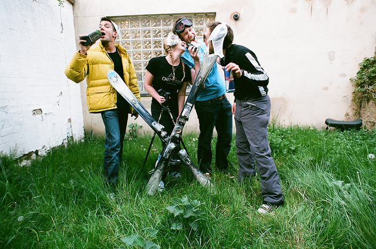
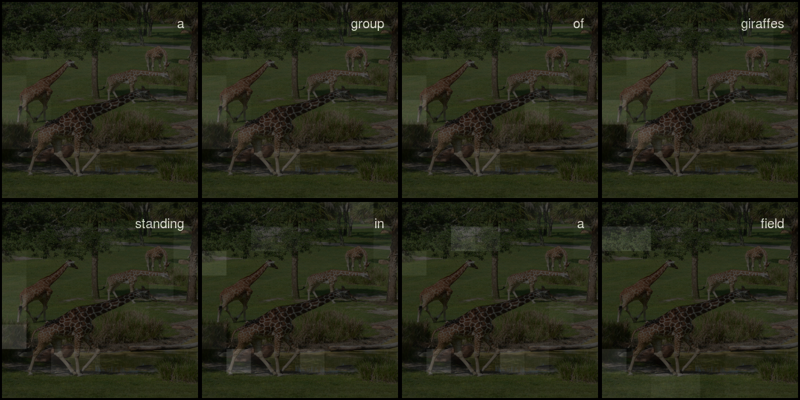

```{r setup, include=FALSE}
knitr::opts_chunk$set(echo = TRUE, eval = FALSE)
```

In image captioning, an algorithm is given an image and tasked with producing a sensible caption. It is a challenging task for several reasons, not the least being that it involves a notion of _saliency_ or _relevance_. This is why recent deep learning approaches mostly include some "attention" mechanism (sometimes even more than one) to help focusing on relevant image features. 

In this post, we demonstrate a formulation of image captioning as an encoder-decoder problem, enhanced by spatial attention over image grid cells. The idea comes from a recent paper on *Neural Image Caption Generation with Visual Attention* [@XuBKCCSZB15], and employs the same kind of attention algorithm as detailed in our post on [machine translation](https://blogs.rstudio.com/tensorflow/posts/2018-07-30-attention-layer/).

We're porting Python code from a recent [Google Colaboratory notebook ](https://colab.research.google.com/github/tensorflow/tensorflow/blob/master/tensorflow/contrib/eager/python/examples/generative_examples/image_captioning_with_attention.ipynb?linkId=54343050&pli=1#scrollTo=io7ws3ReRPGv),  using Keras with TensorFlow eager execution to simplify our lives.


## Prerequisites

The code shown here will work with the current CRAN versions of `tensorflow`, `keras`, and `tfdatasets`.
Check that you're using at least version 1.9 of TensorFlow. If that isn't the case, as of this writing, this 

```{r}
library(tensorflow)
install_tensorflow()
```

will get you version 1.10.

When loading libraries, please make sure you're executing the first 4 lines in this exact order.
We need to make sure we're using the TensorFlow implementation of Keras (`tf.keras` in Python land), and we have to enable eager execution before using TensorFlow in any way.

No need to copy-paste any code snippets - you'll find the complete code (in order necessary for execution) here:  [eager-image-captioning.R](https://github.com/rstudio/keras/blob/master/vignettes/examples/eager-image-captioning.R).


```{r}
library(keras)
use_implementation("tensorflow")

library(tensorflow)
tfe_enable_eager_execution(device_policy = "silent")

np <- import("numpy")

library(tfdatasets)
library(purrr)
library(stringr)
library(glue)
library(rjson)
library(rlang)
library(dplyr)
library(magick)
```


## The dataset

[MS-COCO](http://cocodataset.org) ("Common Objects in Context") is one of, perhaps _the_, reference dataset in image captioning (object detection and segmentation, too). 
We'll be using the [training images](http://images.cocodataset.org/zips/train2014.zip) and [annotations](http://images.cocodataset.org/annotations/annotations_trainval2014.zip) from 2014 - be warned, depending on your location, the download can take a _long_ time.

After unpacking, let's define where the images and captions are.

```{r}
annotation_file <- "train2014/annotations/captions_train2014.json"
image_path <- "train2014/train2014"
```


The annotations are in JSON format, and there are 414113 of them! Luckily for us we didn't have to download that many images - every image comes with 5 different captions, for better generalizability.


```{r}
annotations <- fromJSON(file = annotation_file)
annot_captions <- annotations[[4]]

num_captions <- length(annot_captions)
```


We store both annotations and image paths in lists, for later loading.

```{r}
all_captions <- vector(mode = "list", length = num_captions)
all_img_names <- vector(mode = "list", length = num_captions)

for (i in seq_len(num_captions)) {
  caption <- paste0("<start> ",
                    annot_captions[[i]][["caption"]],
                    " <end>"
                    )
  image_id <- annot_captions[[i]][["image_id"]]
  full_coco_image_path <- sprintf(
    "%s/COCO_train2014_%012d.jpg",
    image_path,
    image_id
  )
  all_img_names[[i]] <- full_coco_image_path
  all_captions[[i]] <- caption
}
```


Depending on your computing environment, you will for sure want to restrict the number of examples used.
This post will use 30000 captioned images, chosen randomly, and set aside 20% for validation.

Below, we take random samples, split into training and validation parts. The companion code will also store the indices on disk, so you can pick up on verification and analysis later.


```{r}
num_examples <- 30000

random_sample <- sample(1:num_captions, size = num_examples)
train_indices <- sample(random_sample, size = length(random_sample) * 0.8)
validation_indices <- setdiff(random_sample, train_indices)

sample_captions <- all_captions[random_sample]
sample_images <- all_img_names[random_sample]
train_captions <- all_captions[train_indices]
train_images <- all_img_names[train_indices]
validation_captions <- all_captions[validation_indices]
validation_images <- all_img_names[validation_indices]
```


## Interlude

Before really diving into the technical stuff, let's take a moment to reflect on this task.
In typical image-related deep learning walk-throughs, we're used to seeing well-defined problems - even if in some cases, the solution may be hard. Take, for example, the stereotypical _dog vs. cat_ problem. Some dogs may look like cats and some cats may look like dogs, but that's about it: All in all, in the usual world we live in, it should be a more or less binary question.

If, on the other hand, we ask people to describe what they see in a scene, it's to be expected from the outset that we'll get different answers. Still, how much consensus there is will very much depend on the concrete dataset we're using.

Let's take a look at some picks from the very first 20 training items sampled randomly above. 


{.external width=50%}


Now this image does not leave much room for decision what to focus on, and received a very factual caption indeed: "There is a plate with one slice of bacon a half of orange and bread". If the dataset were all like this, we'd think a machine learning algorithm should do pretty well here.

Picking another one from the first 20:

{.external width=50%}

What would be salient information to you here? The caption provided goes "A smiling little boy has a checkered shirt".
Is the look of the shirt as important as that? You might as well focus on the scenery, - or even something on a completely different level: The age of the photo, or it being an analog one.


Let's take a final example.

{.external width=70%}

What would you say about this scene? The official label we sampled here is "A group of people posing in a funny way for the camera". Well ...

Please don't forget that for each image, the dataset includes five different captions (although our n = 30000 samples probably won't).
So this is not saying the dataset is biased - not at all. Instead, we want to point out the ambiguities and difficulties inherent in the task. Actually, given those difficulties, it's all the more amazing that the task we're tackling here - having a network automatically generate image captions - should be possible at all!

Now let's see how we can do this. 

## Extract image features

For the encoding part of our encoder-decoder network, we will make use of _InceptionV3_ to extract image features. In principle, which features to extract is up to experimentation, - here we just use the last layer before the fully connected top:

```{r}
image_model <- application_inception_v3(
  include_top = FALSE,
  weights = "imagenet"
)
```


For an image size of 299x299, the output will be of size `(batch_size, 8, 8, 2048)`, that is, we are making use of 2048 feature maps.

_InceptionV3_ being a "big model", where every pass through the model takes time, we want to precompute features in advance and store them on disk. 
We'll use [tfdatasets](https://tensorflow.rstudio.com/tools/tfdatasets/articles/introduction.html) to stream images to the model. This means all our preprocessing has to employ tensorflow functions: That's why we're not using the more familiar `image_load` from keras below.

Our custom `load_image` will read in, resize and preprocess the images as required for use with _InceptionV3_:

```{r}
load_image <- function(image_path) {
  img <-
    tf$read_file(image_path) %>%
    tf$image$decode_jpeg(channels = 3) %>%
    tf$image$resize_images(c(299L, 299L)) %>%
    tf$keras$applications$inception_v3$preprocess_input()
  list(img, image_path)
}
```


Now we're ready to save the extracted features to disk. The `(batch_size, 8, 8, 2048)`-sized features will be flattened to `(batch_size, 64, 2048)`. The latter shape is what our encoder, soon to be discussed, will receive as input.

```{r}
preencode <- unique(sample_images) %>% unlist() %>% sort()
num_unique <- length(preencode)

# adapt this according to your system's capacities  
batch_size_4save <- 1
image_dataset <-
  tensor_slices_dataset(preencode) %>%
  dataset_map(load_image) %>%
  dataset_batch(batch_size_4save)
  
save_iter <- make_iterator_one_shot(image_dataset)
  
until_out_of_range({
  
  save_count <- save_count + batch_size_4save
  batch_4save <- save_iter$get_next()
  img <- batch_4save[[1]]
  path <- batch_4save[[2]]
  batch_features <- image_model(img)
  batch_features <- tf$reshape(
    batch_features,
    list(dim(batch_features)[1], -1L, dim(batch_features)[4]
  )
                               )
  for (i in 1:dim(batch_features)[1]) {
    np$save(path[i]$numpy()$decode("utf-8"),
            batch_features[i, , ]$numpy())
  }
    
})
```


Before we get to the encoder and decoder models though, we need to take care of the captions.

## Processing the captions

We're using keras `text_tokenizer` and the text processing functions `texts_to_sequences` and `pad_sequences` to transform ascii text into a matrix.

```{r}
# we will use the 5000 most frequent words only
top_k <- 5000
tokenizer <- text_tokenizer(
  num_words = top_k,
  oov_token = "<unk>",
  filters = '!"#$%&()*+.,-/:;=?@[\\]^_`{|}~ ')
tokenizer$fit_on_texts(sample_captions)

train_captions_tokenized <-
  tokenizer %>% texts_to_sequences(train_captions)
validation_captions_tokenized <-
  tokenizer %>% texts_to_sequences(validation_captions)

# pad_sequences will use 0 to pad all captions to the same length
tokenizer$word_index["<pad>"] <- 0

# create a lookup dataframe that allows us to go in both directions
word_index_df <- data.frame(
  word = tokenizer$word_index %>% names(),
  index = tokenizer$word_index %>% unlist(use.names = FALSE),
  stringsAsFactors = FALSE
)
word_index_df <- word_index_df %>% arrange(index)

decode_caption <- function(text) {
  paste(map(text, function(number)
    word_index_df %>%
      filter(index == number) %>%
      select(word) %>%
      pull()),
    collapse = " ")
}

# pad all sequences to the same length (the maximum length, in our case)
# could experiment with shorter padding (truncating the very longest captions)
caption_lengths <- map(
  all_captions[1:num_examples],
  function(c) str_split(c," ")[[1]] %>% length()
  ) %>% unlist()
max_length <- fivenum(caption_lengths)[5]

train_captions_padded <-  pad_sequences(
  train_captions_tokenized,
  maxlen = max_length,
  padding = "post",
  truncating = "post"
)

validation_captions_padded <- pad_sequences(
  validation_captions_tokenized,
  maxlen = max_length,
  padding = "post",
  truncating = "post"
)
```


## Loading the data for training

Now that we've taken care of pre-extracting the features and preprocessing the captions, we need a way to stream them to our captioning model. For that, we're using `tensor_slices_dataset` from [tfdatasets](https://tensorflow.rstudio.com/tools/tfdatasets/articles/introduction.html), passing in the list of paths to the images and the preprocessed captions. Loading the images is then performed as a TensorFlow graph operation (using [tf$pyfunc](https://www.tensorflow.org/api_docs/python/tf/py_func)).

The original Colab code also shuffles the data on every iteration. Depending on your hardware, this may take a long time, and given the size of the dataset it is not strictly necessary to get reasonable results. (The results reported below were obtained without shuffling.)

```{r}
batch_size <- 10
buffer_size <- num_examples

map_func <- function(img_name, cap) {
  p <- paste0(img_name$decode("utf-8"), ".npy")
  img_tensor <- np$load(p)
  img_tensor <- tf$cast(img_tensor, tf$float32)
  list(img_tensor, cap)
}

train_dataset <-
  tensor_slices_dataset(list(train_images, train_captions_padded)) %>%
  dataset_map(
    function(item1, item2) tf$py_func(map_func, list(item1, item2), list(tf$float32, tf$int32))
  ) %>%
  # optionally shuffle the dataset
  # dataset_shuffle(buffer_size) %>%
  dataset_batch(batch_size)
```


## Captioning model


The model is basically the same as that discussed in the [machine translation post](https://blogs.rstudio.com/tensorflow/posts/2018-07-30-attention-layer/). Please refer to that article for an explanation of the concepts, as well as a detailed walk-through of the tensor shapes involved at every step. Here, we provide the tensor shapes as comments in the code snippets, for quick overview/comparison.

However, if you develop your own models, with eager execution you can simply insert debugging/logging statements at arbitrary places in the code - even in model definitions. So you can have a function

```{r}
maybecat <- function(context, x) {
  if (debugshapes) {
    name <- enexpr(x)
    dims <- paste0(dim(x), collapse = " ")
    cat(context, ": shape of ", name, ": ", dims, "\n", sep = "")
  }
}

```

And if you now set

```{r}
debugshapes <- FALSE
```


you can trace - not only tensor shapes, but actual tensor values through your models, as shown below for the encoder. (We don't display any debugging statements after that, but the [sample code](https://github.com/rstudio/keras/blob/master/vignettes/examples/eager-image-captioning.R) has many more.)

### Encoder

Now it's time to define some some sizing-related hyperparameters and housekeeping variables:

```{r}
# for encoder output
embedding_dim <- 256
# decoder (LSTM) capacity
gru_units <- 512
# for decoder output
vocab_size <- top_k
# number of feature maps gotten from Inception V3
features_shape <- 2048
# shape of attention features (flattened from 8x8)
attention_features_shape <- 64
```

The encoder in this case is just a fully connected layer, taking in the features extracted from Inception V3 (in flattened form, as they were written to disk), and embedding them in 256-dimensional space.

```{r}
cnn_encoder <- function(embedding_dim, name = NULL) {
    
  keras_model_custom(name = name, function(self) {
      
    self$fc <- layer_dense(units = embedding_dim, activation = "relu")
      
    function(x, mask = NULL) {
      # input shape: (batch_size, 64, features_shape)
      maybecat("encoder input", x)
      # shape after fc: (batch_size, 64, embedding_dim)
      x <- self$fc(x)
      maybecat("encoder output", x)
      x
    }
  })
}
```


### Attention module

Unlike in the machine translation post, here the attention module is separated out into its own custom model.
The logic is the same though:

```{r}
attention_module <- function(gru_units, name = NULL) {
  
  keras_model_custom(name = name, function(self) {
    
    self$W1 = layer_dense(units = gru_units)
    self$W2 = layer_dense(units = gru_units)
    self$V = layer_dense(units = 1)
      
    function(inputs, mask = NULL) {
      features <- inputs[[1]]
      hidden <- inputs[[2]]
      # features(CNN_encoder output) shape == (batch_size, 64, embedding_dim)
      # hidden shape == (batch_size, gru_units)
      # hidden_with_time_axis shape == (batch_size, 1, gru_units)
      hidden_with_time_axis <- k_expand_dims(hidden, axis = 2)
        
      # score shape == (batch_size, 64, 1)
      score <- self$V(k_tanh(self$W1(features) + self$W2(hidden_with_time_axis)))
      # attention_weights shape == (batch_size, 64, 1)
      attention_weights <- k_softmax(score, axis = 2)
      # context_vector shape after sum == (batch_size, embedding_dim)
      context_vector <- k_sum(attention_weights * features, axis = 2)
        
      list(context_vector, attention_weights)
    }
  })
}

```

### Decoder

The decoder at each time step calls the attention module with the features it got from the encoder and its last hidden state, and receives back an attention vector. The attention vector gets concatenated with the current input and further processed by a GRU and two fully connected layers, the last of which gives us the (unnormalized) probabilities for the next word in the caption.

The _current input_ at each time step here is the previous word: the correct one during training (_teacher forcing_), the last generated one during inference.

```{r}
rnn_decoder <- function(embedding_dim, gru_units, vocab_size, name = NULL) {
    
  keras_model_custom(name = name, function(self) {
      
    self$gru_units <- gru_units
    self$embedding <- layer_embedding(input_dim = vocab_size, 
                                      output_dim = embedding_dim)
    self$gru <- if (tf$test$is_gpu_available()) {
      layer_cudnn_gru(
        units = gru_units,
        return_sequences = TRUE,
        return_state = TRUE,
        recurrent_initializer = 'glorot_uniform'
      )
    } else {
      layer_gru(
        units = gru_units,
        return_sequences = TRUE,
        return_state = TRUE,
        recurrent_initializer = 'glorot_uniform'
      )
    }
      
    self$fc1 <- layer_dense(units = self$gru_units)
    self$fc2 <- layer_dense(units = vocab_size)
      
    self$attention <- attention_module(self$gru_units)
      
    function(inputs, mask = NULL) {
      x <- inputs[[1]]
      features <- inputs[[2]]
      hidden <- inputs[[3]]
        
      c(context_vector, attention_weights) %<-% 
        self$attention(list(features, hidden))
        
      # x shape after passing through embedding == (batch_size, 1, embedding_dim)
      x <- self$embedding(x)
        
      # x shape after concatenation == (batch_size, 1, 2 * embedding_dim)
      x <- k_concatenate(list(k_expand_dims(context_vector, 2), x))
        
      # passing the concatenated vector to the GRU
      c(output, state) %<-% self$gru(x)
        
      # shape == (batch_size, 1, gru_units)
      x <- self$fc1(output)
        
      # x shape == (batch_size, gru_units)
      x <- k_reshape(x, c(-1, dim(x)[[3]]))
        
      # output shape == (batch_size, vocab_size)
      x <- self$fc2(x)
        
      list(x, state, attention_weights)
        
    }
  })
}
```

### Loss function, and instantiating it all

Now that we've defined our model (built of three custom models), we still need to actually instantiate it (being precise: the two classes we will access from outside, that is, the encoder and the decoder). 

We also need to instantiate an optimizer (Adam will do), and define our loss function (categorical crossentropy).
Note that `tf$nn$sparse_softmax_cross_entropy_with_logits` expects raw logits instead of softmax activations, and that we're using the _sparse_ variant because our labels are not one-hot-encoded.


```{r}
encoder <- cnn_encoder(embedding_dim)
decoder <- rnn_decoder(embedding_dim, gru_units, vocab_size)

optimizer = tf$train$AdamOptimizer()

cx_loss <- function(y_true, y_pred) {
  mask <- 1 - k_cast(y_true == 0L, dtype = "float32")
  loss <- tf$nn$sparse_softmax_cross_entropy_with_logits(
    labels = y_true,
    logits = y_pred
  ) * mask
  tf$reduce_mean(loss)
}
```


## Training


Training the captioning model is a time-consuming process, and you will for sure want to save the model's weights!
How does this work with eager execution?

We create a `tf$train$Checkpoint` object, passing it the objects to be saved: In our case, the encoder, the decoder, and the optimizer. Later, at the end of each epoch, we will ask it to write the respective weights to disk.

```{r}
restore_checkpoint <- FALSE

checkpoint_dir <- "./checkpoints_captions"
checkpoint_prefix <- file.path(checkpoint_dir, "ckpt")
checkpoint <- tf$train$Checkpoint(
  optimizer = optimizer,
  encoder = encoder,
  decoder = decoder
)
```

As we're just starting to train the model, `restore_checkpoint` is set to false. Later, restoring the weights will be as easy as

```{r}

if (restore_checkpoint) {
  checkpoint$restore(tf$train$latest_checkpoint(checkpoint_dir))
}
```

The training loop is structured just like in the machine translation case: We loop over epochs, batches, and the training targets, feeding in the correct previous word at every timestep.
Again, `tf$GradientTape` takes care of recording the forward pass and calculating the gradients, and the optimizer applies the gradients to the model's weights.
As each epoch ends, we also save the weights.


```{r}
num_epochs <- 20

if (!restore_checkpoint) {
  for (epoch in seq_len(num_epochs)) {
    
    total_loss <- 0
    progress <- 0
    train_iter <- make_iterator_one_shot(train_dataset)
    
    until_out_of_range({
      
      batch <- iterator_get_next(train_iter)
      loss <- 0
      img_tensor <- batch[[1]]
      target_caption <- batch[[2]]
      
      dec_hidden <- k_zeros(c(batch_size, gru_units))
      
      dec_input <- k_expand_dims(
        rep(list(word_index_df[word_index_df$word == "<start>", "index"]), 
            batch_size)
      )
      
      with(tf$GradientTape() %as% tape, {
        
        features <- encoder(img_tensor)
        
        for (t in seq_len(dim(target_caption)[2] - 1)) {
          c(preds, dec_hidden, weights) %<-%
            decoder(list(dec_input, features, dec_hidden))
          loss <- loss + cx_loss(target_caption[, t], preds)
          dec_input <- k_expand_dims(target_caption[, t])
        }
        
      })
      
      total_loss <-
        total_loss + loss / k_cast_to_floatx(dim(target_caption)[2])
      
      variables <- c(encoder$variables, decoder$variables)
      gradients <- tape$gradient(loss, variables)
      
      optimizer$apply_gradients(purrr::transpose(list(gradients, variables)),
                                global_step = tf$train$get_or_create_global_step()
      )
    })
    cat(paste0(
      "\n\nTotal loss (epoch): ",
      epoch,
      ": ",
      (total_loss / k_cast_to_floatx(buffer_size)) %>% as.double() %>% round(4),
      "\n"
    ))
    
    checkpoint$save(file_prefix = checkpoint_prefix)
  }
}
```

## Peeking at results

Just like in the translation case, it's interesting to look at model performance during training. The companion code has that functionality integrated, so you can watch model progress for yourself. 

The basic function here is `get_caption`: It gets passed the path to an image, loads it, obtains its features from Inception V3, and then asks the encoder-decoder model to generate a caption. If at any point the model produces the `end` symbol, we stop early. Otherwise, we continue until we hit the predefined maximum length.


```{r}
get_caption <-
  function(image) {
    attention_matrix <-
      matrix(0, nrow = max_length, ncol = attention_features_shape)
    temp_input <- k_expand_dims(load_image(image)[[1]], 1)
    img_tensor_val <- image_model(temp_input)
    img_tensor_val <- k_reshape(
      img_tensor_val,
      list(dim(img_tensor_val)[1], -1, dim(img_tensor_val)[4])
    )
    features <- encoder(img_tensor_val)
    
    dec_hidden <- k_zeros(c(1, gru_units))
    dec_input <-
      k_expand_dims(
        list(word_index_df[word_index_df$word == "<start>", "index"])
      )
    
    result <- ""
    
    for (t in seq_len(max_length - 1)) {
      
      c(preds, dec_hidden, attention_weights) %<-%
        decoder(list(dec_input, features, dec_hidden))
      attention_weights <- k_reshape(attention_weights, c(-1))
      attention_matrix[t,] <- attention_weights %>% as.double()
      
      pred_idx <- tf$multinomial(exp(preds), num_samples = 1)[1, 1] 
                    %>% as.double()
      pred_word <-
        word_index_df[word_index_df$index == pred_idx, "word"]
      
      if (pred_word == "<end>") {
        result <-
          paste(result, pred_word)
        attention_matrix <-
          attention_matrix[1:length(str_split(result, " ")[[1]]), , 
                           drop = FALSE]
        return (list(result, attention_matrix))
      } else {
        result <-
          paste(result, pred_word)
        dec_input <- k_expand_dims(list(pred_idx))
      }
    }
    
    list(str_trim(result), attention_matrix)
  }
```


With that functionality, now let's actually do that: peek at results while the network is learning!

We've picked 3 examples each from the training and validation sets. Here they are.

First, our picks from the training set:

::: l-body-outset
{width=100%}  
:::


Let's see the target captions:

- _a herd of giraffe standing on top of a grass covered field_
- _a view of cards driving down a street_
- _the skateboarding flips his board off of the sidewalk_

Interestingly, here we also have a demonstration of how labeled datasets (like anything human) may contain errors. (The samples were not picked for that; instead, they were chosen - without too much screening - for being rather unequivocal in their visual content.)

Now for the validation candidates.

::: l-body-outset
{width=100%}  
:::

and their official captions:

- _a left handed pitcher throwing the base ball_
- _a woman taking a bite of a slice of pizza in a restaraunt_
- _a woman hitting swinging a tennis racket at a tennis ball on a tennis court_

(Again, any spelling peculiarities have not been introduced by us.)


#### Epoch 1

Now, what does our network produce after the first epoch? Remember that this means, having seen each one of the 24000 training images once.

First then, here are the captions for the train images:

> a group of sheep standing in the grass

> a group of cars driving down a street

> a man is standing on a street

Not only is the syntax correct in every case, the content isn't that bad either!

How about the validation set?

> a baseball player is playing baseball uniform is holding a baseball bat

> a man is holding a table with a table with a table with a table with a table with a table with a table with a table with a table with a table with a table with a table with a table with a table

> a tennis player is holding a tennis court

This certainly tells that the network has been able to generalize over - let's not call them concepts, but mappings between visual and textual entities, say It's true that it will have seen some of these images before, because images come with several captions. You could be more strict setting up your training and validation sets - but here, we don't really care about objective performance scores and so, it does not really matter.

Let' skip directly to epoch 20, our last training epoch, and check for further improvements.

#### Epoch 20


This is what we get for the training images:

> a group of many tall giraffe standing next to a sheep

> a view of cards and white gloves on a street

> a skateboarding flips his board

And this, for the validation images.

> a baseball catcher and umpire hit a baseball game

> a man is eating a sandwich

> a female tennis player is in the court

I think we might agree that this still leaves room for improvement - but then, we only trained for 20 epochs and on a very small portion of the dataset.

In the above code snippets, you may have noticed the decoder returning an `attention_matrix` - but we weren't commenting on it.
Now finally, just as in the translation example, have a look what we can make of that.


## Where does the network look?

We can visualize where the network is "looking" as it generates each word by overlaying the original image and the attention matrix. This example is taken from the 4th epoch.

Here white-ish squares indicate areas receiving stronger focus. Compared to text-to-text translation though, the mapping is inherently less straightforward - where does one "look" when producing words like "and", "the", or "in"?

::: l-body-outset
{width=100%}
:::


## Conclusion

It probably goes without saying that much better results are to be expected when training on (much!) more data and for much more time. 

Apart from that, there are other options, though. The concept implemented here uses _spatial_ attention over a uniform grid, that is, the attention mechanism guides the decoder _where_ on the grid to look next when generating a caption.

However, this is not the only way, and this is not how it works with humans. A much more plausible approach is a mix of top-down and bottom-up attention. E.g., [@AndersonHBTJGZ17] use object detection techniques to bottom-up isolate interesting objects, and an LSTM stack wherein the first LSTM computes top-down attention guided by the output word generated by the second one.

Another interesting approach involving attention is using a multimodal attentive translator [@LiuSWWY17], where the image features are encoded and presented in a sequence, such that we end up with sequence models both on the encoding and the decoding sides. 

Another alternative is to add a learned _topic_ to the information input [@Zhu2018], which again is a top-down feature found in human cognition.

If you find one of these, or yet another, approach more convincing, an eager execution implementation, in the style of the above, will likely be a sound way of implementing it.


