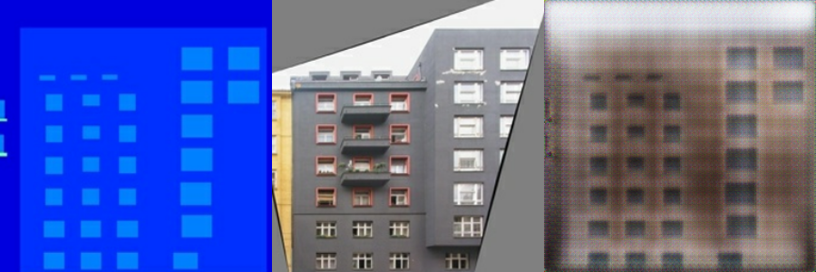

```{r setup, include=FALSE}
knitr::opts_chunk$set(echo = TRUE, eval = FALSE)
```


What do we need to train a neural network? A common answer is: a model, a cost function, and an optimization algorithm.
(I know: I'm leaving out the most important thing here - the data.) 

As computer programs work with numbers, the cost function has to be pretty specific: We can't just say _predict next month's demand for lawn mowers please, and do your best_, we have to say something like this: Minimize the squared deviation of the estimate from the target value. 

In some cases it may be straightforward to map a task to a measure of error, in others, it may not. Consider the task of generating non-existing objects of a certain type (like a face, a scene, or a video clip). How do we quantify success?
The trick with _generative adversarial networks_ (GANs) is to let the network learn the cost function.

As shown in [Generating images with Keras and TensorFlow eager execution](https://blogs.rstudio.com/tensorflow/posts/2018-08-26-eager-dcgan/), in a simple GAN the setup is this: One agent, the _generator_, keeps on producing fake objects. The other, the _discriminator_, is tasked to tell apart the real objects from the fake ones. For the generator, loss is augmented when its fraud gets discovered, meaning that the generator's cost function depends on what the discriminator does. For the discriminator, loss grows when it fails to correctly tell apart generated objects from authentic ones.

In a GAN of the type just described, creation starts from white noise. However in the real world, what is required may be a form of transformation, not creation. Take, for example, colorization of black-and-white images, or conversion of aerials to maps. For applications like those, we _condition_ on additional input: Hence the name, _conditional adversarial networks_.

Put concretely, this means the generator is passed not (or not only) white noise, but data of a certain input structure, such as edges or shapes. It then has to generate realistic-looking pictures of real objects having those shapes.
The discriminator, too, may receive the shapes or edges as input, in addition to the fake and real objects it is tasked to tell apart.

Here are a few examples of conditioning, taken from the paper we'll be implementing (see below):

{.external width=100%}

In this post, we port to R a [Google Colaboratory Notebook](https://colab.research.google.com/github/tensorflow/tensorflow/blob/master/tensorflow/contrib/eager/python/examples/pix2pix/pix2pix_eager.ipynb) using Keras with eager execution. We're implementing the basic architecture from _pix2pix_, as described by Isola et al. in their 2016 paper[@IsolaZZE16]. It's an interesting paper to read as it validates the approach on a bunch of different datasets, and shares outcomes of using different loss families, too:

{.external width=100%}


## Prerequisites

The code shown here will work with the current CRAN versions of `tensorflow`, `keras`, and `tfdatasets`. Also, be sure to check that you're using at least version 1.9 of TensorFlow. If that isn't the case, as of this writing, this

```{r}
library(tensorflow)
install_tensorflow()
```


will get you version 1.10.

When loading libraries, please make sure you're executing the first 4 lines in the exact order shown. We need to make sure we're using the TensorFlow implementation of Keras (`tf.keras` in Python land), and we have to enable eager execution before using TensorFlow in any way.

No need to copy-paste any code snippets - you'll find the complete code (in order necessary for execution) here: [eager-pix2pix.R](https://github.com/rstudio/keras/blob/master/vignettes/examples/eager-pix2pix.R).

```{r}
library(keras)
use_implementation("tensorflow")
library(tensorflow)
tfe_enable_eager_execution(device_policy = "silent")

library(tfdatasets)
library(purrr)
```


## Dataset

For this post, we're working with one of the datasets used in the paper, a [preprocessed](https://people.eecs.berkeley.edu/~tinghuiz/projects/pix2pix/datasets/) version of the [CMP Facade Dataset](http://cmp.felk.cvut.cz/~tylecr1/facade/).

Images contain the ground truth - that we'd wish for the generator to generate, and for the discriminator to correctly detect as authentic - and the input we're conditioning on (a coarse segmention into object classes) next to each other in the same file.

{.external width=100%}


## Preprocessing

Obviously, our preprocessing will have to split the input images into parts. That's the first thing that happens in the function below.

After that, action depends on whether we're in the training or testing phases. If we're training, we perform random jittering, via upsizing the image to `286x286` and then cropping to the original size of `256x256`. In about 50% of the cases, we also flipping the image left-to-right.

In both cases, training and testing, we normalize the image to the range between -1 and 1.

Note the use of the `tf$image` module for image -related operations. This is required as the images will be streamed via `tfdatasets`, which works on TensorFlow graphs.


```{r}
img_width <- 256L
img_height <- 256L

load_image <- function(image_file, is_train) {

  image <- tf$read_file(image_file)
  image <- tf$image$decode_jpeg(image)
  
  w <- as.integer(k_shape(image)[2])
  w2 <- as.integer(w / 2L)
  real_image <- image[ , 1L:w2, ]
  input_image <- image[ , (w2 + 1L):w, ]
  
  input_image <- k_cast(input_image, tf$float32)
  real_image <- k_cast(real_image, tf$float32)

  if (is_train) {
    input_image <-
      tf$image$resize_images(input_image,
                             c(286L, 286L),
                             align_corners = TRUE,
                             method = 2)
    real_image <- tf$image$resize_images(real_image,
                                         c(286L, 286L),
                                         align_corners = TRUE,
                                         method = 2)
    
    stacked_image <-
      k_stack(list(input_image, real_image), axis = 1)
    cropped_image <-
      tf$random_crop(stacked_image, size = c(2L, img_height, img_width, 3L))
    c(input_image, real_image) %<-% 
      list(cropped_image[1, , , ], cropped_image[2, , , ])
    
    if (runif(1) > 0.5) {
      input_image <- tf$image$flip_left_right(input_image)
      real_image <- tf$image$flip_left_right(real_image)
    }
    
  } else {
    input_image <-
      tf$image$resize_images(
        input_image,
        size = c(img_height, img_width),
        align_corners = TRUE,
        method = 2
      )
    real_image <-
      tf$image$resize_images(
        real_image,
        size = c(img_height, img_width),
        align_corners = TRUE,
        method = 2
      )
  }
  
  input_image <- (input_image / 127.5) - 1
  real_image <- (real_image / 127.5) - 1
  
  list(input_image, real_image)
}
```


## Streaming the data


The images will be streamed via `tfdatasets`, using a batch size of 1.
Note how the `load_image` function we defined above is wrapped in `tf$py_func` to enable accessing tensor values in the usual eager way (which by default, as of this writing, is not possible with the TensorFlow datasets API).


```{r}
# change to where you unpacked the data
# there will be train, val and test subdirectories below
data_dir <- "facades"

buffer_size <- 400
batch_size <- 1
batches_per_epoch <- buffer_size / batch_size

train_dataset <-
  tf$data$Dataset$list_files(file.path(data_dir, "train/*.jpg")) %>%
  dataset_shuffle(buffer_size) %>%
  dataset_map(function(image) {
    tf$py_func(load_image, list(image, TRUE), list(tf$float32, tf$float32))
  }) %>%
  dataset_batch(batch_size)

test_dataset <-
  tf$data$Dataset$list_files(file.path(data_dir, "test/*.jpg")) %>%
  dataset_map(function(image) {
    tf$py_func(load_image, list(image, TRUE), list(tf$float32, tf$float32))
  }) %>%
  dataset_batch(batch_size)
```


## Defining the actors

### Generator

First, here's the generator. Let's start with a birds-eye view.

The generator receives as input a coarse segmentation, of size 256x256, and should produce a nice color image of a facade.
It first successively downsamples the input, up to a minimal size of 1x1. Then after maximal condensation, it starts upsampling again, until it has reached the required output resolution of 256x256. 

During downsampling, as spatial resolution decreases, the number of filters increases. During upsampling, it goes the opposite way.


```{r}
generator <- function(name = "generator") {
  
  keras_model_custom(name = name, function(self) {
    
    self$down1 <- downsample(64, 4, apply_batchnorm = FALSE)
    self$down2 <- downsample(128, 4)
    self$down3 <- downsample(256, 4)
    self$down4 <- downsample(512, 4)
    self$down5 <- downsample(512, 4)
    self$down6 <- downsample(512, 4)
    self$down7 <- downsample(512, 4)
    self$down8 <- downsample(512, 4)
    
    self$up1 <- upsample(512, 4, apply_dropout = TRUE)
    self$up2 <- upsample(512, 4, apply_dropout = TRUE)
    self$up3 <- upsample(512, 4, apply_dropout = TRUE)
    self$up4 <- upsample(512, 4)
    self$up5 <- upsample(256, 4)
    self$up6 <- upsample(128, 4)
    self$up7 <- upsample(64, 4)
    
    self$last <- layer_conv_2d_transpose(
      filters = 3,
      kernel_size = 4,
      strides = 2,
      padding = "same",
      kernel_initializer = initializer_random_normal(0, 0.2),
      activation = "tanh"
    )
    
    function(x, mask = NULL, training = TRUE) {           # x shape == (bs, 256, 256, 3)
     
      x1 <- x %>% self$down1(training = training)         # (bs, 128, 128, 64)
      x2 <- self$down2(x1, training = training)           # (bs, 64, 64, 128)
      x3 <- self$down3(x2, training = training)           # (bs, 32, 32, 256)
      x4 <- self$down4(x3, training = training)           # (bs, 16, 16, 512)
      x5 <- self$down5(x4, training = training)           # (bs, 8, 8, 512)
      x6 <- self$down6(x5, training = training)           # (bs, 4, 4, 512)
      x7 <- self$down7(x6, training = training)           # (bs, 2, 2, 512)
      x8 <- self$down8(x7, training = training)           # (bs, 1, 1, 512)

      x9 <- self$up1(list(x8, x7), training = training)   # (bs, 2, 2, 1024)
      x10 <- self$up2(list(x9, x6), training = training)  # (bs, 4, 4, 1024)
      x11 <- self$up3(list(x10, x5), training = training) # (bs, 8, 8, 1024)
      x12 <- self$up4(list(x11, x4), training = training) # (bs, 16, 16, 1024)
      x13 <- self$up5(list(x12, x3), training = training) # (bs, 32, 32, 512)
      x14 <- self$up6(list(x13, x2), training = training) # (bs, 64, 64, 256)
      x15 <-self$up7(list(x14, x1), training = training)  # (bs, 128, 128, 128)
      x16 <- self$last(x15)                               # (bs, 256, 256, 3)
      x16
    }
  })
}

```


How can spatial information be preserved if we downsample all the way down to a single pixel? The generator follows the general principle of a _U-Net_ [@RonnebergerFB15], where skip connections exist from layers earlier in the downsampling process to layers later on the way up.

![Figure from [@RonnebergerFB15]](images/unet.png){.external width=100%}

Let's take the line

```{r}
x15 <-self$up7(list(x14, x1), training = training)
```

from the `call` method. 

Here, the inputs to `self$up` are `x14`, which went through all of the down- and upsampling, and `x1`, the output from the very first downsampling step. The former has resolution 64x64, the latter, 128x128. How do they get combined?

That's taken care of by `upsample`, technically a custom model of its own. 
As an aside, we remark how custom models let you pack your code into nice, reusable modules.


```{r}
upsample <- function(filters,
                     size,
                     apply_dropout = FALSE,
                     name = "upsample") {
  
  keras_model_custom(name = NULL, function(self) {
    
    self$apply_dropout <- apply_dropout
    self$up_conv <- layer_conv_2d_transpose(
      filters = filters,
      kernel_size = size,
      strides = 2,
      padding = "same",
      kernel_initializer = initializer_random_normal(),
      use_bias = FALSE
    )
    self$batchnorm <- layer_batch_normalization()
    if (self$apply_dropout) {
      self$dropout <- layer_dropout(rate = 0.5)
    }
    
    function(xs, mask = NULL, training = TRUE) {
      
      c(x1, x2) %<-% xs
      x <- self$up_conv(x1) %>% self$batchnorm(training = training)
      if (self$apply_dropout) {
        x %>% self$dropout(training = training)
      }
      x %>% layer_activation("relu")
      concat <- k_concatenate(list(x, x2))
      concat
    }
  })
}
```

`x14` is upsampled to double its size, and `x1` is appended as is.
The axis of concatenation here is axis 4, the feature map / channels axis. `x1` comes with 64 channels, `x14` comes out of `layer_conv_2d_transpose` with 64 channels, too (because ` self$up7` has been defined that way). So we end up with an image of resolution 128x128 and 128 feature maps for the output of step `x15`.

Downsampling, too, is factored out to its own model. Here too, the number of filters is configurable.

```{r}
downsample <- function(filters,
                       size,
                       apply_batchnorm = TRUE,
                       name = "downsample") {
  
  keras_model_custom(name = name, function(self) {
    
    self$apply_batchnorm <- apply_batchnorm
    self$conv1 <- layer_conv_2d(
      filters = filters,
      kernel_size = size,
      strides = 2,
      padding = 'same',
      kernel_initializer = initializer_random_normal(0, 0.2),
      use_bias = FALSE
    )
    if (self$apply_batchnorm) {
      self$batchnorm <- layer_batch_normalization()
    }
    
    function(x, mask = NULL, training = TRUE) {
      
      x <- self$conv1(x)
      if (self$apply_batchnorm) {
        x %>% self$batchnorm(training = training)
      }
      x %>% layer_activation_leaky_relu()
    }
  })
}
```


Now for the discriminator.

### Discriminator

Again, let's start with a birds-eye view.
The discriminator receives as input both the coarse segmentation and the ground truth. Both are concatenated and processed together. Just like the generator, the discriminator is thus conditioned on the segmentation.

What does the discriminator return? The output of `self$last` has one channel, but a spatial resolution of 30x30: We're outputting a probability for each of 30x30 image _patches_ (which is why the authors are calling this a _PatchGAN_).

The discriminator thus working on small image patches means it only cares about local structure, and consequently, enforces correctness in the high frequencies only. Correctness in the low frequencies is taken care of by an additional L1 component in the discriminator loss that operates over the whole image (as we'll see below).


```{r}
discriminator <- function(name = "discriminator") {
  
  keras_model_custom(name = name, function(self) {
    
    self$down1 <- disc_downsample(64, 4, FALSE)
    self$down2 <- disc_downsample(128, 4)
    self$down3 <- disc_downsample(256, 4)
    self$zero_pad1 <- layer_zero_padding_2d()
    self$conv <- layer_conv_2d(
      filters = 512,
      kernel_size = 4,
      strides = 1,
      kernel_initializer = initializer_random_normal(),
      use_bias = FALSE
    )
    self$batchnorm <- layer_batch_normalization()
    self$zero_pad2 <- layer_zero_padding_2d()
    self$last <- layer_conv_2d(
      filters = 1,
      kernel_size = 4,
      strides = 1,
      kernel_initializer = initializer_random_normal()
    )
    
    function(x, y, mask = NULL, training = TRUE) {
      
      x <- k_concatenate(list(x, y)) %>%            # (bs, 256, 256, channels*2)
        self$down1(training = training) %>%         # (bs, 128, 128, 64)
        self$down2(training = training) %>%         # (bs, 64, 64, 128)
        self$down3(training = training) %>%         # (bs, 32, 32, 256)
        self$zero_pad1() %>%                        # (bs, 34, 34, 256)
        self$conv() %>%                             # (bs, 31, 31, 512)
        self$batchnorm(training = training) %>%
        layer_activation_leaky_relu() %>%
        self$zero_pad2() %>%                        # (bs, 33, 33, 512)
        self$last()                                 # (bs, 30, 30, 1)
      x
    }
  })
}

```


And here's the factored-out downsampling functionality, again providing the means to configure the number of filters.

```{r}
disc_downsample <- function(filters,
                            size,
                            apply_batchnorm = TRUE,
                            name = "disc_downsample") {
  
  keras_model_custom(name = name, function(self) {
    
    self$apply_batchnorm <- apply_batchnorm
    self$conv1 <- layer_conv_2d(
      filters = filters,
      kernel_size = size,
      strides = 2,
      padding = 'same',
      kernel_initializer = initializer_random_normal(0, 0.2),
      use_bias = FALSE
    )
    if (self$apply_batchnorm) {
      self$batchnorm <- layer_batch_normalization()
    }
    
    function(x, mask = NULL, training = TRUE) {
      x <- self$conv1(x)
      if (self$apply_batchnorm) {
        x %>% self$batchnorm(training = training)
      }
      x %>% layer_activation_leaky_relu()
    }
  })
}
```

### Losses and optimizer

As we said in the introduction, the idea of a GAN is to have the network learn the cost function.
More concretely, the thing it should learn is the balance between two losses, the generator loss and the discriminator loss.
Each of them individually, of course, has to be provided with a loss function, so there are still decisions to be made.

For the generator, two things factor into the loss: First, does the discriminator debunk my creations as fake?
Second, how big is the absolute deviation of the generated image from the target?
The latter factor does not have to be present in a conditional GAN, but was included by the authors to further encourage proximity to the target, and empirically found to deliver better results.

```{r}
lambda <- 100 # value chosen by the authors of the paper
generator_loss <- function(disc_judgment, generated_output, target) {
    gan_loss <- tf$losses$sigmoid_cross_entropy(
      tf$ones_like(disc_judgment),
      disc_judgment
    )
    l1_loss <- tf$reduce_mean(tf$abs(target - generated_output))
    gan_loss + (lambda * l1_loss)
  }
```

The discriminator loss looks as in a standard (un-conditional) GAN. Its first component is determined by how accurately it classifies real images as real, while the second depends on its competence in judging fake images as fake.

```{r}
discriminator_loss <- function(real_output, generated_output) {
  real_loss <- tf$losses$sigmoid_cross_entropy(
    multi_class_labels = tf$ones_like(real_output),
    logits = real_output
  )
  generated_loss <- tf$losses$sigmoid_cross_entropy(
    multi_class_labels = tf$zeros_like(generated_output),
    logits = generated_output
  )
  real_loss + generated_loss
}
```


For optimization, we rely on Adam for both the generator and the discriminator.

```{r}
discriminator_optimizer <- tf$train$AdamOptimizer(2e-4, beta1 = 0.5)
generator_optimizer <- tf$train$AdamOptimizer(2e-4, beta1 = 0.5)
```


## The game 

We're ready to have the generator and the discriminator play the game!
Below, we use [defun](https://www.tensorflow.org/api_docs/python/tf/contrib/eager/defun) to compile the respective R functions into TensorFlow graphs, to speed up computations.


```{r}
generator <- generator()
discriminator <- discriminator()

generator$call = tf$contrib$eager$defun(generator$call)
discriminator$call = tf$contrib$eager$defun(discriminator$call)

```

We also create a `tf$train$Checkpoint` object that will allow us to save and restore training weights.

```{r}
checkpoint_dir <- "./checkpoints_pix2pix"
checkpoint_prefix <- file.path(checkpoint_dir, "ckpt")
checkpoint <- tf$train$Checkpoint(
    generator_optimizer = generator_optimizer,
    discriminator_optimizer = discriminator_optimizer,
    generator = generator,
    discriminator = discriminator
)
```

Training is a loop over epochs with an inner loop over batches yielded by the dataset.
As usual with eager execution, `tf$GradientTape` takes care of recording the forward pass and determining the gradients, while the optimizer - there are two of them in this setup - adjusts the networks' weights.

Every tenth epoch, we save the weights, and tell the generator to have a go at the first example of the test set, so we can monitor network progress. See `generate_images` in the companion code for this functionality.


```{r}
train <- function(dataset, num_epochs) {
  
  for (epoch in 1:num_epochs) {
    total_loss_gen <- 0
    total_loss_disc <- 0
    iter <- make_iterator_one_shot(train_dataset)
    
    until_out_of_range({
      batch <- iterator_get_next(iter)
      input_image <- batch[[1]]
      target <- batch[[2]]
      
      with(tf$GradientTape() %as% gen_tape, {
        with(tf$GradientTape() %as% disc_tape, {
          
          gen_output <- generator(input_image, training = TRUE)
          disc_real_output <-
            discriminator(input_image, target, training = TRUE)
          disc_generated_output <-
            discriminator(input_image, gen_output, training = TRUE)
          gen_loss <-
            generator_loss(disc_generated_output, gen_output, target)
          disc_loss <-
            discriminator_loss(disc_real_output, disc_generated_output)
          total_loss_gen <- total_loss_gen + gen_loss
          total_loss_disc <- total_loss_disc + disc_loss
        })
      })
      
      generator_gradients <- gen_tape$gradient(gen_loss,
                                               generator$variables)
      discriminator_gradients <- disc_tape$gradient(disc_loss,
                                                    discriminator$variables)
      
      generator_optimizer$apply_gradients(transpose(list(
        generator_gradients,
        generator$variables
      )))
      discriminator_optimizer$apply_gradients(transpose(
        list(discriminator_gradients,
             discriminator$variables)
      ))
      
    })
    
    cat("Epoch ", epoch, "\n")
    cat("Generator loss: ",
        total_loss_gen$numpy() / batches_per_epoch,
        "\n")
    cat("Discriminator loss: ",
        total_loss_disc$numpy() / batches_per_epoch,
        "\n\n")
    
    if (epoch %% 10 == 0) {
      test_iter <- make_iterator_one_shot(test_dataset)
      batch <- iterator_get_next(test_iter)
      input <- batch[[1]]
      target <- batch[[2]]
      generate_images(generator, input, target, paste0("epoch_", i))
    }
    
    if (epoch %% 10 == 0) {
      checkpoint$save(file_prefix = checkpoint_prefix)
    }
  }
}

if (!restore) {
  train(train_dataset, 200)
} 
```


## The results

What has the network learned? 

Here's a pretty typical result from the test set. It doesn't look so bad.

{width=100%}

Here's another one. Interestingly, the colors used in the fake image match the previous one's pretty well, even though we used an additional L1 loss to penalize deviations from the original. 


{width=100%}

This pick from the test set again shows similar hues, and it might already convey an impression one gets when going through the complete test set: The network has not just learned some balance between creatively turning a coarse mask into a detailed image on the one hand, and reproducing a concrete example on the other hand. It also has internalized the main architectural style present in the dataset.


{width=100%}


For an extreme example, take this. The mask leaves an enormous lot of freedom, while the target image is a pretty untypical (perhaps the most untypical) pick from the test set. The outcome is a structure that could represent a building, or part of a building, of specific texture and color shades.

{width=100%}


## Conclusion


When we say the network has internalized the dominant style of the training set, is this a bad thing? (We're used to thinking in terms of overfitting on the training set.)

With GANs though, one could say it all depends on the purpose. If it doesn't fit our purpose, one thing we could try is training on several datasets at the same time.

Again depending on what we want to achieve, another weakness could be the lack of stochasticity in the model, as stated by the authors of the paper themselves. This will be hard to avoid when working with paired datasets as the ones used in _pix2pix_. An interesting alternative is CycleGAN[@ZhuPIE17] that lets you transfer style between complete datasets without using paired instances:


{.external width=100%}


Finally closing on a more technical note, you may have noticed the prominent checkerboard effects in the above fake examples. This phenomenon (and ways to address it) is superbly explained in a 2016 article on [distill.pub](https://distill.pub/) [@odena2016deconvolution]. 
In our case, it will mostly be due to the use of `layer_conv_2d_transpose` for upsampling. 

As per the authors [@odena2016deconvolution], a better alternative is upsizing followed by padding and (standard) convolution.
If you're interested, it should be straightforward to modify the example code to use `tf$image$resize_images` (using `ResizeMethod.NEAREST_NEIGHBOR` as recommended by the authors), `tf$pad` and `layer_conv2d`.


