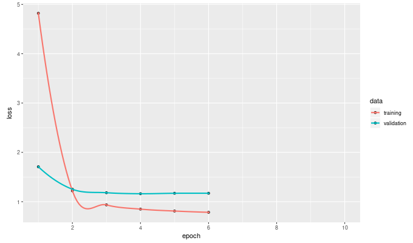
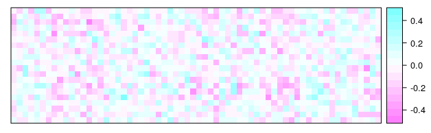

```{r setup, include=FALSE}
knitr::opts_chunk$set(echo = TRUE, eval = FALSE)
```


What's your first association when you read the word _embeddings_? For most of us, the answer will probably be _word embeddings_, or _word vectors_. A quick search for recent papers on [arxiv](www.arxiv.org) shows what else can be embedded: equations[@2018arXiv180309123K], vehicle sensor data[@2018arXiv180604795H], graphs[@2018arXiv180202896A], code[@abs-1803-09473], spatial data[@abs-1805-02855], biological entities[@2018arXiv180200864Z]  ... - and what not.

What is so attractive about this concept? Embeddings incorporate the concept of _distributed representations_, an encoding of information not at specialized locations (dedicated neurons, say), but as a pattern of activations spread out over a network.
No better source to cite than Geoffrey Hinton, who played an important role in the development of the concept[@Rumelhart]:

> _Distributed representation_ means a many to many relationship between two types of representation (such as concepts and neurons).
  Each concept is represented by many neurons. Each neuron participates in the representation of many concepts.^[From: http://www.cs.toronto.edu/~bonner/courses/2014s/csc321/lectures/lec5.pdf]
  
The advantages are manifold. Perhaps the most famous effect of using embeddings is that we can learn and make use of semantic similarity.

Let's take a task like sentiment analysis. Initially, what we feed the network are sequences of words, essentially encoded as factors. In this setup, all words are equidistant: _Orange_ is as different from _kiwi_ as it is from _thunderstorm_. An ensuing embedding layer then maps these representations to dense vectors of floating point numbers, which can be checked for mutual similarity via various similarity measures such as _cosine distance_. 

We hope that when we feed these "meaningful" vectors to the next layer(s), better classification will result.
In addition, we may be interested in exploring that semantic space for its own sake, or use it in multi-modal transfer learning [@FromeCSBDRM13].

In this post, we'd like to do two things: First, we'd like to take a look "under the hood" at how an embedding layer can be implemented in a neural network. Second, we want to demonstrate an application of embeddings in the context of product recommendation, following the example of [lesson5-movielens.ipynb](https://github.com/fastai/fastai/blob/master/courses/dl1/lesson5-movielens.ipynb) which is part of fast.ai's [Deep Learning for Coders](http://course.fast.ai/) class.

Just like the notebook that inspired us, we'll predict movie ratings. We will use the 2016 [ml-latest-small](http://files.grouplens.org/datasets/movielens/ml-latest-small.zip) dataset from [MovieLens](https://grouplens.org/datasets/movielens/) that contains  ~100000 ratings of ~9900 movies, rated by ~700 users.


## Do-it-yourself embeddings


You may have heard people say all an embedding layer did was just a lookup. Imagine you had a dataset that, in addition to continuous variables like temperature or barometric pressure, contained a categorical column _characterization_ consisting of tags like "foggy" or "cloudy". Say _characterization_ had 7 possible values, encoded as a factor with levels 1-7.

Were we going to feed this variable to a non-embedding layer, `layer_dense` say, we'd have to take care that those numbers do not get taken for integers, thus falsely implying an interval (or at least ordered) scale. But when we use an embedding as the first layer in a Keras model, we feed in integers all the time! For example, in text classification, a sentence might get encoded as a vector padded with zeroes, like this:

```
2  77   4   5 122   55  1  3   0   0  
```


The thing that makes this work is that the embedding layer actually _does_ perform a lookup. Below, you'll find a very simple ^[It really _is_ simple; it only works with input length = 1.] [custom layer](https://tensorflow.rstudio.com/keras/articles/custom_layers.html) that does essentially the same thing as Keras' `layer_embedding`:


- It has a weight matrix `self$embeddings` that maps from an input space (movies, say) to the output space of latent factors (embeddings).
- When we call the layer, as in 

` x <- k_gather(self$embeddings, x)`

it looks up the passed-in row number in the weight matrix, thus retrieving an item's distributed representation from the matrix.


```{r}
SimpleEmbedding <- R6::R6Class(
  "SimpleEmbedding",
  
  inherit = KerasLayer,
  
  public = list(
    output_dim = NULL,
    emb_input_dim = NULL,
    embeddings = NULL,
    
    initialize = function(emb_input_dim, output_dim) {
      self$emb_input_dim <- emb_input_dim
      self$output_dim <- output_dim
    },
    
    build = function(input_shape) {
      self$embeddings <- self$add_weight(
        name = 'embeddings',
        shape = list(self$emb_input_dim, self$output_dim),
        initializer = initializer_random_uniform(),
        trainable = TRUE
      )
    },
    
    call = function(x, mask = NULL) {
      x <- k_cast(x, "int32")
      k_gather(self$embeddings, x)
    },
    
    compute_output_shape = function(input_shape) {
      list(self$output_dim)
    }
  )
)

```


As usual with custom layers, we still need a wrapper that takes care of instantiation.

```{r}
layer_simple_embedding <-
  function(object,
           emb_input_dim,
           output_dim,
           name = NULL,
           trainable = TRUE) {
    create_layer(
      SimpleEmbedding,
      object,
      list(
        emb_input_dim = as.integer(emb_input_dim),
        output_dim = as.integer(output_dim),
        name = name,
        trainable = trainable
      )
    )
  }
```


Does this work? We would hope it works about as well as Keras' `layer_embedding` when used for a simple task.
We thus need a test case. So now, let's first address our second topic for this post: Using embeddings for collaborative filtering.

We'll first approach this using `layer_embedding`, exploring different models, and finally come back to see if we can substitute our custom layer.


## Embeddings for collaborative filtering

In collaborative filtering, we try to generate recommendations based not on elaborate knowledge about our users and not on detailed profiles of our products, but on how users and products go together. Is product $\mathbf{p}$ a fit for user $\mathbf{u}$? If so, we'll recommend it.

Often, this is done via matrix factorization. See, for example, [this nice article](https://datajobs.com/data-science-repo/Recommender-Systems-%5BNetflix%5D.pdf) by the winners of the [2009 Netflix prize](https://www.netflixprize.com/), introducing the why and how of matrix factorization techniques as used in collaborative filtering.

Here's the general principle. While other techniques like [non-negative matrix factorization](https://en.wikipedia.org/wiki/Non-negative_matrix_factorization) may be more popular, this diagram of __singular value decomposition__ (SVD) found on [Facebook Research](https://research.fb.com/fast-randomized-svd/) is particularly instructive.

{.external width=100%}

The diagram takes its example from the context of text analysis, assuming a co-occurrence matrix of hashtags and users ($\mathbf{A}$).
As stated above, we'll instead work with a dataset of movie ratings.

Were we doing matrix factorization, we would need to somehow address the fact that not every user has rated every movie. As we'll be using embeddings instead, we won't have that problem. For the sake of argumentation, though, let's assume for a moment the ratings were a matrix, not a dataframe in tidy format.

In that case, $\mathbf{A}$ would store the ratings, with each row containing the ratings one user gave to all movies. 

This matrix then gets decomposed into three matrices:

- $\mathbf{\Sigma}$ stores the importance of the latent factors governing the relationship between users and movies.
- $\mathbf{U}$ contains information on how users score on these latent factors. It's a representation (_embedding_) of users by the ratings they gave to the movies.
- $\mathbf{V}$ stores how movies score on these same latent factors. It's a representation (_embedding_) of movies by how they got rated by said users.

As soon as we have a representation of movies \mathbf{m} as well as users \mathbf{u} in the same latent space, we can determine their mutual fit by a simple dot product $\mathbf{m^ t}\mathbf{u}$. Assuming the user and movie vectors have been normalized to length 1, this is equivalent to calculating the _cosine similarity_

$$cos(\theta) = \frac{\mathbf{x^ t}\mathbf{y}}{\mathbf{||x||}\space\mathbf{||y||}}$$

### What does all this have to do with embeddings?

Well, the same overall principles apply when we work with user resp. movie embeddings, instead of vectors obtained from matrix factorization. We'll have one `layer_embedding` for users, one `layer_embedding` for movies, and a `layer_lambda` that calculates the dot product.

Here's a minimal [custom model](https://tensorflow.rstudio.com/keras/articles/custom_models.html) that does exactly this:


```{r}
simple_dot <- function(embedding_dim,
                       n_users,
                       n_movies,
                       name = "simple_dot") {
  
  keras_model_custom(name = name, function(self) {
    self$user_embedding <-
      layer_embedding(
        input_dim = n_users + 1,
        output_dim = embedding_dim,
        embeddings_initializer = initializer_random_uniform(minval = 0, maxval = 0.05),
        name = "user_embedding"
      )
    self$movie_embedding <-
      layer_embedding(
        input_dim = n_movies + 1,
        output_dim = embedding_dim,
        embeddings_initializer = initializer_random_uniform(minval = 0, maxval = 0.05),
        name = "movie_embedding"
      )
    self$dot <-
      layer_lambda(
        f = function(x) {
          k_batch_dot(x[[1]], x[[2]], axes = 2)
        }
      )
    
    function(x, mask = NULL) {
      users <- x[, 1]
      movies <- x[, 2]
      user_embedding <- self$user_embedding(users)
      movie_embedding <- self$movie_embedding(movies)
      self$dot(list(user_embedding, movie_embedding))
    }
  })
}
```


We're still missing the data though! Let's load it. 
Besides the ratings themselves, we'll also get the titles from _movies.csv_.

```{r}
data_dir <- "ml-latest-small"
movies <- read_csv(file.path(data_dir, "movies.csv"))
ratings <- read_csv(file.path(data_dir, "ratings.csv"))
```

While user ids have no gaps in this sample, that's different for movie ids. We therefore convert them to consecutive numbers, so we can later specify an adequate size for the lookup matrix.

```{r}
dense_movies <- ratings %>% select(movieId) %>% distinct() %>% rowid_to_column()
ratings <- ratings %>% inner_join(dense_movies) %>% rename(movieIdDense = rowid)
ratings <- ratings %>% inner_join(movies) %>% select(userId, movieIdDense, rating, title, genres)
```

Let's take a note, then, of how many users resp. movies we have.

```{r}
n_movies <- ratings %>% select(movieIdDense) %>% distinct() %>% nrow()
n_users <- ratings %>% select(userId) %>% distinct() %>% nrow()
```


We'll split off 20% of the data for validation.
After training, probably all users will have been seen by the network, while very likely, not all movies will have occurred in the training sample.

```{r}
train_indices <- sample(1:nrow(ratings), 0.8 * nrow(ratings))
train_ratings <- ratings[train_indices,]
valid_ratings <- ratings[-train_indices,]

x_train <- train_ratings %>% select(c(userId, movieIdDense)) %>% as.matrix()
y_train <- train_ratings %>% select(rating) %>% as.matrix()
x_valid <- valid_ratings %>% select(c(userId, movieIdDense)) %>% as.matrix()
y_valid <- valid_ratings %>% select(rating) %>% as.matrix()
```

### Training a simple dot product model

We're ready to start the training process. Feel free to experiment with different embedding dimensionalities.

```{r}
embedding_dim <- 64

model <- simple_dot(embedding_dim, n_users, n_movies)

model %>% compile(
  loss = "mse",
  optimizer = "adam"
)

history <- model %>% fit(
  x_train,
  y_train,
  epochs = 10,
  batch_size = 32,
  validation_data = list(x_valid, y_valid),
  callbacks = list(callback_early_stopping(patience = 2))
)

```


How well does this work? Final RMSE (the square root of the MSE loss we were using) on the validation set is around 1.08 , while popular benchmarks (e.g., of the [LibRec recommender system](https://www.librec.net/release/v1.3/example.html)) lie around 0.91. Also, we're overfitting early. It looks like we need a slightly more sophisticated system.

{width=100%}


### Accounting for user and movie biases

A problem with our method is that we attribute the rating as a whole to use-movie interaction.
However, some users are more critical intrinsically, while others tend to be more lenient. Analogously, films differ by average rating.
We hope to get better predictions when factoring in these biases.

Conceptually, we then calculate a prediction like this:

$$pred =  avg + bias_m + bias_u + \mathbf{m^ t}\mathbf{u}$$


The corresponding Keras model gets just slightly more complex. In addition to the user and movie embeddings we've already been working with, the below model embeds the _average_ user and the _average_ movie in 1-d space. We then add both biases to the dot product encoding user-movie interaction.
A sigmoid activation normalizes to a value between 0 and 1, which then gets mapped back to the original space.

Note how in this model, we also use dropout on the user and movie embeddings (again, the best dropout rate is open to experimentation).


```{r}
max_rating <- ratings %>% summarise(max_rating = max(rating)) %>% pull()
min_rating <- ratings %>% summarise(min_rating = min(rating)) %>% pull()

dot_with_bias <- function(embedding_dim,
                          n_users,
                          n_movies,
                          max_rating,
                          min_rating,
                          name = "dot_with_bias"
                          ) {
  keras_model_custom(name = name, function(self) {
    
    self$user_embedding <-
      layer_embedding(input_dim = n_users + 1,
                      output_dim = embedding_dim,
                      name = "user_embedding")
    self$movie_embedding <-
      layer_embedding(input_dim = n_movies + 1,
                      output_dim = embedding_dim,
                      name = "movie_embedding")
    self$user_bias <-
      layer_embedding(input_dim = n_users + 1,
                      output_dim = 1,
                      name = "user_bias")
    self$movie_bias <-
      layer_embedding(input_dim = n_movies + 1,
                      output_dim = 1,
                      name = "movie_bias")
    self$user_dropout <- layer_dropout(rate = 0.3)
    self$movie_dropout <- layer_dropout(rate = 0.6)
    self$dot <-
      layer_lambda(
        f = function(x)
          k_batch_dot(x[[1]], x[[2]], axes = 2),
        name = "dot"
      )
    self$dot_bias <-
      layer_lambda(
        f = function(x)
          k_sigmoid(x[[1]] + x[[2]] + x[[3]]),
        name = "dot_bias"
      )
    self$pred <- layer_lambda(
      f = function(x)
        x * (self$max_rating - self$min_rating) + self$min_rating,
      name = "pred"
    )
    self$max_rating <- max_rating
    self$min_rating <- min_rating
    
    function(x, mask = NULL) {
      
      users <- x[, 1]
      movies <- x[, 2]
      user_embedding <-
        self$user_embedding(users) %>% self$user_dropout()
      movie_embedding <-
        self$movie_embedding(movies) %>% self$movie_dropout()
      dot <- self$dot(list(user_embedding, movie_embedding))
      dot_bias <-
        self$dot_bias(list(dot, self$user_bias(users), self$movie_bias(movies)))
      self$pred(dot_bias)
    }
  })
}
```

How well does this model perform?

```{r}
model <- dot_with_bias(embedding_dim,
                       n_users,
                       n_movies,
                       max_rating,
                       min_rating)

model %>% compile(
  loss = "mse",
  optimizer = "adam"
)

history <- model %>% fit(
  x_train,
  y_train,
  epochs = 10,
  batch_size = 32,
  validation_data = list(x_valid, y_valid),
  callbacks = list(callback_early_stopping(patience = 2))
)
```


Not only does it overfit later, it actually reaches a way better RMSE of 0.88 on the validation set!


{width=100%}


Spending some time on hyperparameter optimization could very well lead to even better results.
As this post focuses on the conceptual side though, we want to see what else we can do with those embeddings.

### Embeddings: a closer look

We can easily extract the embedding matrices from the respective layers. Let's do this for movies now.

```{r}
movie_embeddings <- (model %>% get_layer("movie_embedding") %>% get_weights())[[1]]
```

How are they distributed? Here's a heatmap of the first 20 movies. (Note how we increment the row indices by 1, because the very first row in the embedding matrix belongs to a movie id _0_ which does not exist in our dataset.)
We see that the embeddings look rather uniformly distributed between -0.5 and 0.5.

```{r}
levelplot(
  t(movie_embeddings[2:21, 1:64]),
  xlab = "",
  ylab = "",
  scale = (list(draw = FALSE)))
```


{width=100%}

Naturally, we might be interested in dimensionality reduction, and see how specific movies score on the dominant factors.
A possible way to achieve this is PCA:

```{r}
movie_pca <- movie_embeddings %>% prcomp(center = FALSE)
components <- movie_pca$x %>% as.data.frame() %>% rowid_to_column()

plot(movie_pca)
```

{width=100%}

Let's just look at the first principal component as the second one already explains much less variance.

Here are the 10 movies (out of all that were rated at least 20 times) that scored lowest on the first factor:

```{r}
ratings_with_pc12 <-
  ratings %>% inner_join(components %>% select(rowid, PC1, PC2),
                         by = c("movieIdDense" = "rowid"))

ratings_grouped <-
  ratings_with_pc12 %>%
  group_by(title) %>%
  summarize(
    PC1 = max(PC1),
    PC2 = max(PC2),
    rating = mean(rating),
    genres = max(genres),
    num_ratings = n()
  )

ratings_grouped %>% filter(num_ratings > 20) %>% arrange(PC1) %>% print(n = 10)
```

```
# A tibble: 1,247 x 6
   title                                   PC1      PC2 rating genres                   num_ratings
   <chr>                                 <dbl>    <dbl>  <dbl> <chr>                          <int>
 1 Starman (1984)                       -1.15  -0.400     3.45 Adventure|Drama|Romance…          22
 2 Bulworth (1998)                      -0.820  0.218     3.29 Comedy|Drama|Romance              31
 3 Cable Guy, The (1996)                -0.801 -0.00333   2.55 Comedy|Thriller                   59
 4 Species (1995)                       -0.772 -0.126     2.81 Horror|Sci-Fi                     55
 5 Save the Last Dance (2001)           -0.765  0.0302    3.36 Drama|Romance                     21
 6 Spanish Prisoner, The (1997)         -0.760  0.435     3.91 Crime|Drama|Mystery|Thr…          23
 7 Sgt. Bilko (1996)                    -0.757  0.249     2.76 Comedy                            29
 8 Naked Gun 2 1/2: The Smell of Fear,… -0.749  0.140     3.44 Comedy                            27
 9 Swordfish (2001)                     -0.694  0.328     2.92 Action|Crime|Drama                33
10 Addams Family Values (1993)          -0.693  0.251     3.15 Children|Comedy|Fantasy           73
# ... with 1,237 more rows
```


And here, inversely, are those that scored highest:

```{r}
ratings_grouped %>% filter(num_ratings > 20) %>% arrange(desc(PC1)) %>% print(n = 10)
```

```
 A tibble: 1,247 x 6
   title                                PC1        PC2 rating genres                    num_ratings
   <chr>                              <dbl>      <dbl>  <dbl> <chr>                           <int>
 1 Graduate, The (1967)                1.41  0.0432      4.12 Comedy|Drama|Romance               89
 2 Vertigo (1958)                      1.38 -0.0000246   4.22 Drama|Mystery|Romance|Th…          69
 3 Breakfast at Tiffany's (1961)       1.28  0.278       3.59 Drama|Romance                      44
 4 Treasure of the Sierra Madre, The…  1.28 -0.496       4.3  Action|Adventure|Drama|W…          30
 5 Boot, Das (Boat, The) (1981)        1.26  0.238       4.17 Action|Drama|War                   51
 6 Flintstones, The (1994)             1.18  0.762       2.21 Children|Comedy|Fantasy            39
 7 Rock, The (1996)                    1.17 -0.269       3.74 Action|Adventure|Thriller         135
 8 In the Heat of the Night (1967)     1.15 -0.110       3.91 Drama|Mystery                      22
 9 Quiz Show (1994)                    1.14 -0.166       3.75 Drama                              90
10 Striptease (1996)                   1.14 -0.681       2.46 Comedy|Crime                       39
# ... with 1,237 more rows
```

We'll leave it to the knowledgeable reader to name these factors, as we still have one thing left to do: test our custom embedding layer on the same data, with one of the recommender models we developed. We'll choose the first, simple dot product model for this.

## Putting the custom embedding layer to test

Here's the simple dot product model again, this time using our custom embedding layer.

```{r}
simple_dot2 <- function(embedding_dim,
                       n_users,
                       n_movies,
                       name = "simple_dot2") {
  
  keras_model_custom(name = name, function(self) {
    self$embedding_dim <- embedding_dim
    
    self$user_embedding <-
      layer_simple_embedding(
        emb_input_dim = list(n_users + 1),
        output_dim = embedding_dim,
        name = "user_embedding"
      )
    self$movie_embedding <-
      layer_simple_embedding(
        emb_input_dim = list(n_movies + 1),
        output_dim = embedding_dim,
        name = "movie_embedding"
      )
    self$dot <-
      layer_lambda(
        output_shape = self$embedding_dim,
        f = function(x) {
          k_batch_dot(x[[1]], x[[2]], axes = 2)
        }
      )
    
    function(x, mask = NULL) {
      users <- x[, 1]
      movies <- x[, 2]
      user_embedding <- self$user_embedding(users)
      movie_embedding <- self$movie_embedding(movies)
      self$dot(list(user_embedding, movie_embedding))
    }
  })
}

model <- simple_dot2(embedding_dim, n_users, n_movies)

model %>% compile(
  loss = "mse",
  optimizer = "adam"
)

history <- model %>% fit(
  x_train,
  y_train,
  epochs = 10,
  batch_size = 32,
  validation_data = list(x_valid, y_valid),
  callbacks = list(callback_early_stopping(patience = 2))
)
```


We end up with a RMSE of 1.13 on the validation set, which is not far from the 1.08 we obtained when using `layer_embedding`. At least, this should tell us that we successfully reproduced the approach.

## Conclusion

Our goals in this post were twofold: Shed some light on how an embedding layer can be implemented, and show how embeddings calculated by  a neural network can be used as a substitute for component matrices obtained from matrix decomposition. Of course, this is not the only thing that's fascinating about embeddings!

For example, a very practical question is how much actual predictions can be improved by using embeddings instead of one-hot vectors; another is how learned embeddings might differ depending on what task they were trained on.
Last not least - how do latent factors learned via embeddings differ from those learned by an autoencoder?

In that spirit, there is no lack of topics for exploration and poking around ...

