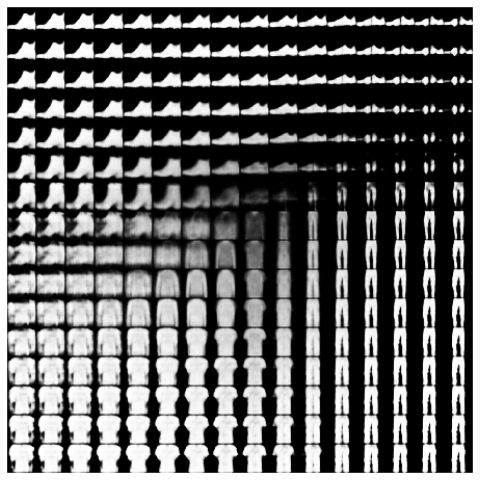

```{r setup, include=FALSE}
knitr::opts_chunk$set(echo = TRUE, eval = FALSE)
```


Recently, we showed how to [generate images](https://blogs.rstudio.com/tensorflow/posts/2018-08-26-eager-dcgan/) using generative adversarial networks (GANs). GANs may yield amazing results, but the contract there basically is: what you see is what you get.
Sometimes this may be all we want. In other cases, we may be more interested in actually modelling a domain. We don't just want to generate realistic-looking samples - we want our samples to be located at specific coordinates in domain space.

For example, imagine our domain to be the space of facial expressions. Then our latent space might be conceived as two-dimensional: In accordance with underlying emotional states, expressions vary on a positive-negative scale. At the same time, they vary in intensity. Now if we trained a VAE on a set of facial expressions adequately covering the ranges, and it did in fact "discover" our hypothesized dimensions, we could then use it to generate previously-nonexisting incarnations of points (faces, that is) in latent space.

Variational autoencoders are similar to probabilistic graphical models in that they assume a latent space that is responsible for the observations, but unobservable. They are similar to plain autoencoders in that they compress, and then decompress again, the input domain. In contrast to plain autoencoders though, the crucial point here is to devise a loss function that allows to obtain informative representations in latent space.


## In a nutshell

In standard VAEs [@KingmaW13], the objective is to maximize the evidence lower bound (ELBO):

$$ELBO\ = \ E[log\ p(x|z)]\ -\ KL(q(z)||p(z))$$

In plain words and expressed in terms of how we use it in practice, the first component is the _reconstruction loss_ we also see in plain (non-variational) autoencoders. The second is the Kullback-Leibler divergence between a prior imposed on the latent space (typically, a standard normal distribution) and the representation of latent space as learned from the data.

<aside>
For a well-written and intuitive introduction to VAEs, including the why and how of their optimization, see this [Tutorial on variational autoencoders](https://arxiv.org/abs/1606.05908) [@2016arXiv160605908D].
</aside>

A major criticism regarding the traditional VAE loss is that it results in uninformative latent space. Alternatives include $\beta$-VAE[@2018arXiv180403599B], Info-VAE [@ZhaoSE17b], and more. The MMD-VAE[@ZhaoSE17b] implemented below is a subtype of Info-VAE that instead of making each representation in latent space as similar as possible to the prior, coerces the respective _distributions_ to be as close as possible. Here MMD stands for _maximum mean discrepancy_, a similarity measure for distributions based on matching their respective moments. We explain this in more detail below.

<aside>
The main author of the paper[@ZhaoSE17b] has a [tutorial](http://szhao.me/2017/06/10/a-tutorial-on-mmd-variational-autoencoders.html) on his website explaining the reasons behind this choice of cost function in a very accessible way.
</aside>


## Our objective today

In this post, we are first going to implement a standard VAE that strives to maximize the ELBO. Then, we compare its performance to that of an Info-VAE using the MMD loss. 

Our focus will be on inspecting the latent spaces and see if, and how, they differ as a consequence of the optimization criteria used. 

The domain we're going to model will be glamorous (fashion!), but for the sake of manageability, confined to size 28 x 28: We'll compress and reconstruct images from the [Fashion MNIST](https://github.com/zalandoresearch/fashion-mnist) dataset that has been developed as a drop-in to MNIST.

## A standard variational autoencoder

Seeing we haven't used TensorFlow eager execution for some weeks, we'll do the model in an eager way.
If you're new to eager execution, don't worry: As every new technique, it needs some getting accustomed to, but you'll quickly find that many tasks are made easier if you use it. A simple yet complete, template-like example is available as part of the [Keras documentation](https://tensorflow.rstudio.com/keras/articles/eager_guide.html).

<aside>
For interesting applications using eager execution in combination with Keras, ranging from machine translation to neural style transfer, see the recent posts in the [Eager category](https://blogs.rstudio.com/tensorflow/#Eager) on this blog.
</aside>


#### Setup and data preparation

As usual, we start by making sure we're using the TensorFlow implementation of Keras and enabling eager execution. Besides `tensorflow` and `keras`, we also load `tfdatasets` for use in data streaming.

By the way: No need to copy-paste any of the below code snippets. The two approaches are available among our Keras examples, namely, as [eager_vae.R](https://github.com/rstudio/keras/blob/master/vignettes/examples/eager_vae.R) and [mmd_vae.R](https://github.com/rstudio/keras/blob/master/vignettes/examples/mmd_vae.R).

<aside>
You might find it interesting to compare non-eager Keras code implementing a variational autoencoder: see [variational_autoencoder_deconv.R](https://github.com/rstudio/keras/blob/master/vignettes/examples/variational_autoencoder_deconv.R).
</aside>

```{r}
# the following 5 lines have to be executed in this order
library(keras)
use_implementation("tensorflow")
library(tensorflow)
tfe_enable_eager_execution(device_policy = "silent")

library(tfdatasets)

library(dplyr)
library(ggplot2)
library(glue)
```


The data comes conveniently with `keras`, all we need to do is the usual normalization and reshaping.

```{r}
fashion <- dataset_fashion_mnist()

c(train_images, train_labels) %<-% fashion$train
c(test_images, test_labels) %<-% fashion$test

train_x <- train_images %>%
  `/`(255) %>%
  k_reshape(c(60000, 28, 28, 1))

test_x <- test_images %>% `/`(255) %>%
  k_reshape(c(10000, 28, 28, 1))
```

What do we need the test set for, given we are going to train an unsupervised (a better term being: _semi-supervised_) model? We'll use it to see how (previously unknown) data points cluster together in latent space.

Now prepare for streaming the data to `keras`:

```{r}
buffer_size <- 60000
batch_size <- 100
batches_per_epoch <- buffer_size / batch_size

train_dataset <- tensor_slices_dataset(train_x) %>%
  dataset_shuffle(buffer_size) %>%
  dataset_batch(batch_size)

test_dataset <- tensor_slices_dataset(test_x) %>%
  dataset_batch(10000)
```


Next up is defining the model.

#### Encoder-decoder model

_The model_ really is two models: the encoder and the decoder. As we'll see shortly, in the standard version of the VAE there is a third component in between, performing the so-called _reparameterization trick_.

The encoder is a [custom model](https://tensorflow.rstudio.com/keras/articles/custom_models.html), comprised of two convolutional layers and a dense layer. It returns the output of the dense layer split into two parts, one storing the mean of the latent variables, the other their variance.


```{r}
latent_dim <- 2

encoder_model <- function(name = NULL) {
  
  keras_model_custom(name = name, function(self) {
    self$conv1 <-
      layer_conv_2d(
        filters = 32,
        kernel_size = 3,
        strides = 2,
        activation = "relu"
      )
    self$conv2 <-
      layer_conv_2d(
        filters = 64,
        kernel_size = 3,
        strides = 2,
        activation = "relu"
      )
    self$flatten <- layer_flatten()
    self$dense <- layer_dense(units = 2 * latent_dim)
    
    function (x, mask = NULL) {
      x %>%
        self$conv1() %>%
        self$conv2() %>%
        self$flatten() %>%
        self$dense() %>%
        tf$split(num_or_size_splits = 2L, axis = 1L) 
    }
  })
}
```

We choose the latent space to be of dimension 2 - just because that makes visualization easy.
With more complex data, you will probably benefit from choosing a higher dimensionality here.

So the encoder compresses real data into estimates of mean and variance of the latent space.
We then "indirectly" sample from this distribution (the so-called _reparameterization trick_):

```{r}
reparameterize <- function(mean, logvar) {
  eps <- k_random_normal(shape = mean$shape, dtype = tf$float64)
  eps * k_exp(logvar * 0.5) + mean
}
```


The sampled values will serve as input to the decoder, who will attempt to map them back to the original space.
The decoder is basically a sequence of transposed convolutions, upsampling until we reach a resolution of 28x28.


```{r}
decoder_model <- function(name = NULL) {
  
  keras_model_custom(name = name, function(self) {
    
    self$dense <- layer_dense(units = 7 * 7 * 32, activation = "relu")
    self$reshape <- layer_reshape(target_shape = c(7, 7, 32))
    self$deconv1 <-
      layer_conv_2d_transpose(
        filters = 64,
        kernel_size = 3,
        strides = 2,
        padding = "same",
        activation = "relu"
      )
    self$deconv2 <-
      layer_conv_2d_transpose(
        filters = 32,
        kernel_size = 3,
        strides = 2,
        padding = "same",
        activation = "relu"
      )
    self$deconv3 <-
      layer_conv_2d_transpose(
        filters = 1,
        kernel_size = 3,
        strides = 1,
        padding = "same"
      )
    
    function (x, mask = NULL) {
      x %>%
        self$dense() %>%
        self$reshape() %>%
        self$deconv1() %>%
        self$deconv2() %>%
        self$deconv3()
    }
  })
}
```


Note how the final deconvolution does not have the sigmoid activation you might have expected. This is because we will be using `tf$nn$sigmoid_cross_entropy_with_logits` when calculating the loss.


Speaking of losses, let's inspect them now.

#### Loss calculations

One way to implement the VAE loss is combining reconstruction loss (cross entropy, in the present case) and Kullback-Leibler divergence. In Keras, the latter is available directly as `loss_kullback_leibler_divergence`.

Here, we follow a recent [Google Colaboratory notebook]() in batch-estimating the complete ELBO instead (instead of just estimating reconstruction loss and computing the KL-divergence analytically):

$$ELBO \ batch \ estimate = log\ p(x_{batch}|z_{sampled})+log\ p(z)−log\ q(z_{sampled}|x_{batch})$$


Calculation of the normal loglikelihood is packaged into a function so we can reuse it during the training loop.

<aside>
Note that we're calculating with the log of the variance, instead of the variance, for reasons of numerical stability.
</aside>

```{r}
normal_loglik <- function(sample, mean, logvar, reduce_axis = 2) {
  loglik <- k_constant(0.5, dtype = tf$float64) *
    (k_log(2 * k_constant(pi, dtype = tf$float64)) +
    logvar +
    k_exp(-logvar) * (sample - mean) ^ 2)
  - k_sum(loglik, axis = reduce_axis)
}
```


Peeking ahead some, during training we will compute the above as follows.

First, 

```{r}
crossentropy_loss <- tf$nn$sigmoid_cross_entropy_with_logits(
  logits = preds,
  labels = x
)
logpx_z <- - k_sum(crossentropy_loss)
```

yields $log \ p(x|z)$, the loglikelihood of the reconstructed samples given values sampled from latent space (a.k.a. reconstruction loss).

Then,

```{r}
logpz <- normal_loglik(
  z,
  k_constant(0, dtype = tf$float64),
  k_constant(0, dtype = tf$float64)
)
```

gives $log \ p(z)$, the prior loglikelihood of $z$. The prior is assumed to be standard normal, as is most often the case with VAEs.

Finally,

```{r}
logqz_x <- normal_loglik(z, mean, logvar)
```


vields $log \ q(z|x)$, the loglikelihood of the samples $z$ given mean and variance computed from the observed samples $x$.

From these three components, we will compute the final loss as

```{r}
loss <- -k_mean(logpx_z + logpz - logqz_x)
```


After this peaking ahead, let's quickly finish the setup so we get ready for training.

#### Final setup

Besides the loss, we need an optimizer that will strive to diminish it.

```{r}
optimizer <- tf$train$AdamOptimizer(1e-4)
```

We instantiate our models ...

```{r}
encoder <- encoder_model()
decoder <- decoder_model()
```

and set up checkpointing, so we can later restore trained weights.

```{r}
checkpoint_dir <- "./checkpoints_cvae"
checkpoint_prefix <- file.path(checkpoint_dir, "ckpt")
checkpoint <- tf$train$Checkpoint(
  optimizer = optimizer,
  encoder = encoder,
  decoder = decoder
)
```

From the training loop, we will, in certain intervals, also call three functions not reproduced here (but available in the [code example](https://github.com/rstudio/keras/blob/master/vignettes/examples/eager_vae.R)): `generate_random_clothes`, used to generate clothes from random samples from the latent space; `show_latent_space`, that displays the complete test set in latent (2-dimensional, thus easily visualizable) space; and `show_grid`, that generates clothes according to input values systematically spaced out in a grid.

Let's start training! Actually, before we do that, let's have a look at what these functions display _before_ any training: Instead of clothes, we see random pixels. Latent space has no structure. And different types of clothes do not cluster together in latent space.

{width=100%}

#### Training loop

We're training for 50 epochs here. For each epoch, we loop over the training set in batches. For each batch, we follow the usual eager execution flow: Inside the context of a `GradientTape`, apply the model and calculate the current loss; then outside this context calculate the gradients and let the optimizer perform backprop.

What's special here is that we have two models that both need their gradients calculated and weights adjusted. This can be taken care of by a single gradient tape, provided we create it `persistent`.

After each epoch, we save current weights and every ten epochs, we also save plots for later inspection.

```{r}
num_epochs <- 50

for (epoch in seq_len(num_epochs)) {
  iter <- make_iterator_one_shot(train_dataset)
  
  total_loss <- 0
  logpx_z_total <- 0
  logpz_total <- 0
  logqz_x_total <- 0
  
  until_out_of_range({
    x <-  iterator_get_next(iter)
    
    with(tf$GradientTape(persistent = TRUE) %as% tape, {
      
      c(mean, logvar) %<-% encoder(x)
      z <- reparameterize(mean, logvar)
      preds <- decoder(z)
      
      crossentropy_loss <-
        tf$nn$sigmoid_cross_entropy_with_logits(logits = preds, labels = x)
      logpx_z <-
        - k_sum(crossentropy_loss)
      logpz <-
        normal_loglik(z,
                      k_constant(0, dtype = tf$float64),
                      k_constant(0, dtype = tf$float64)
        )
      logqz_x <- normal_loglik(z, mean, logvar)
      loss <- -k_mean(logpx_z + logpz - logqz_x)
      
    })

    total_loss <- total_loss + loss
    logpx_z_total <- tf$reduce_mean(logpx_z) + logpx_z_total
    logpz_total <- tf$reduce_mean(logpz) + logpz_total
    logqz_x_total <- tf$reduce_mean(logqz_x) + logqz_x_total
    
    encoder_gradients <- tape$gradient(loss, encoder$variables)
    decoder_gradients <- tape$gradient(loss, decoder$variables)
    
    optimizer$apply_gradients(
      purrr::transpose(list(encoder_gradients, encoder$variables)),
      global_step = tf$train$get_or_create_global_step()
    )
    optimizer$apply_gradients(
      purrr::transpose(list(decoder_gradients, decoder$variables)),
      global_step = tf$train$get_or_create_global_step()
    )
    
  })
  
  checkpoint$save(file_prefix = checkpoint_prefix)
  
  cat(
    glue(
      "Losses (epoch): {epoch}:",
      "  {(as.numeric(logpx_z_total)/batches_per_epoch) %>% round(2)} logpx_z_total,",
      "  {(as.numeric(logpz_total)/batches_per_epoch) %>% round(2)} logpz_total,",
      "  {(as.numeric(logqz_x_total)/batches_per_epoch) %>% round(2)} logqz_x_total,",
      "  {(as.numeric(total_loss)/batches_per_epoch) %>% round(2)} total"
    ),
    "\n"
  )
  
  if (epoch %% 10 == 0) {
    generate_random_clothes(epoch)
    show_latent_space(epoch)
    show_grid(epoch)
  }
}

```

#### Results

How well did that work? Let's see the kinds of clothes generated after 50 epochs.

{width=66%}


Also, how disentangled (or not) are the different classes in latent space?

{width=66%}

And now watch different clothes morph into one another.

{width=66%}

How good are these representations? This is hard to say when there is nothing to compare with.

So let's dive into MMD-VAE and see how it does on the same dataset.

## MMD-VAE

MMD-VAE promises to generate more informative latent features, so we would hope to see different behavior especially in the clustering and morphing plots.

Data setup is the same, and there are only very slight differences in the model. Please check out the complete code for this example, [mmd_vae.R](https://github.com/rstudio/keras/blob/master/vignettes/examples/mmd_vae.R), as here we'll just highlight the differences.

#### Differences in the model(s)

There are three differences as regards model architecture.

One, the encoder does not have to return the variance, so there is no need for `tf$split`. The encoder's `call` method now just is

```{r}
function (x, mask = NULL) {
  x %>%
    self$conv1() %>%
    self$conv2() %>%
    self$flatten() %>%
    self$dense() 
}
```

Between the encoder and the decoder, we don't need the sampling step anymore, so there is no _reparameterization_. 
And since we won't use `tf$nn$sigmoid_cross_entropy_with_logits` to compute the loss, we let the decoder apply the sigmoid in the last deconvolution layer:

```{r}
self$deconv3 <- layer_conv_2d_transpose(
  filters = 1,
  kernel_size = 3,
  strides = 1,
  padding = "same",
  activation = "sigmoid"
)
```


#### Loss calculations

Now, as expected, the big novelty is in the loss function.

The loss, _maximum mean discrepancy_ (MMD), is based on the idea that two distributions are identical if and only if all moments are identical. 
Concretely, MMD is estimated using a _kernel_, such as the Gaussian kernel

$$k(z,z')=\frac{e^{||z-z'||}}{2\sigma^2}$$

to assess similarity between distributions.

The idea then is that if two distributions are identical, the average similarity between samples from each distribution should be identical to the average similarity between mixed samples from both distributions:

$$MMD(p(z)||q(z))=E_{p(z),p(z')}[k(z,z')]+E_{q(z),q(z')}[k(z,z')]−2E_{p(z),q(z')}[k(z,z')]$$
The following code is a direct port of the author's [original TensorFlow code](https://github.com/ShengjiaZhao/MMD-Variational-Autoencoder):

```{r}
compute_kernel <- function(x, y) {
  x_size <- k_shape(x)[1]
  y_size <- k_shape(y)[1]
  dim <- k_shape(x)[2]
  tiled_x <- k_tile(
    k_reshape(x, k_stack(list(x_size, 1, dim))),
    k_stack(list(1, y_size, 1))
  )
  tiled_y <- k_tile(
    k_reshape(y, k_stack(list(1, y_size, dim))),
    k_stack(list(x_size, 1, 1))
  )
  k_exp(-k_mean(k_square(tiled_x - tiled_y), axis = 3) /
          k_cast(dim, tf$float64))
}

compute_mmd <- function(x, y, sigma_sqr = 1) {
  x_kernel <- compute_kernel(x, x)
  y_kernel <- compute_kernel(y, y)
  xy_kernel <- compute_kernel(x, y)
  k_mean(x_kernel) + k_mean(y_kernel) - 2 * k_mean(xy_kernel)
}
```


#### Training loop

The training loop differs from the standard VAE example only in the loss calculations.
Here are the respective lines:

```{r}
 with(tf$GradientTape(persistent = TRUE) %as% tape, {
      
      mean <- encoder(x)
      preds <- decoder(mean)
      
      true_samples <- k_random_normal(
        shape = c(batch_size, latent_dim),
        dtype = tf$float64
      )
      loss_mmd <- compute_mmd(true_samples, mean)
      loss_nll <- k_mean(k_square(x - preds))
      loss <- loss_nll + loss_mmd
      
    })
```

So we simply compute MMD loss as well as reconstruction loss, and add them up. No sampling is involved in this version.
Of course, we are curious to see how well that worked!

#### Results

Again, let's look at some generated clothes first. It seems like edges are much sharper here.

{width=66%}

The clusters too look more nicely spread out in the two dimensions. And, they are centered at (0,0), as we would have hoped for.

{width=66%}


Finally, let's see clothes morph into one another. Here, the smooth, continuous evolutions are impressive!
Also, nearly all space is filled with meaningful objects, which hasn't been the case above.


{width=66%}


## MNIST

For curiosity's sake, we generated the same kinds of plots after training on original MNIST. 
Here, there are hardly any differences visible in generated random digits after 50 epochs of training.

{width=100%}

Also the differences in clustering are not _that_ big.

{width=100%}


But here too, the morphing looks much more organic with MMD-VAE.

{width=100%}

## Conclusion

To us, this demonstrates impressively what big a difference the cost function can make when working with VAEs.
Another component open to experimentation may be the prior used for the latent space - see [this talk](https://www.ics.uci.edu/~enalisni/nalisnick_openAI_talk.pdf) for an overview of alternative priors and the "Variational Mixture of Posteriors " paper [@TomczakW17] for a popular recent approach.

For both cost functions and priors, we expect effective differences to become way bigger still when we leave the controlled environment of (Fashion) MNIST and work with real-world datasets.


