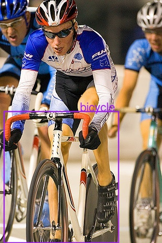
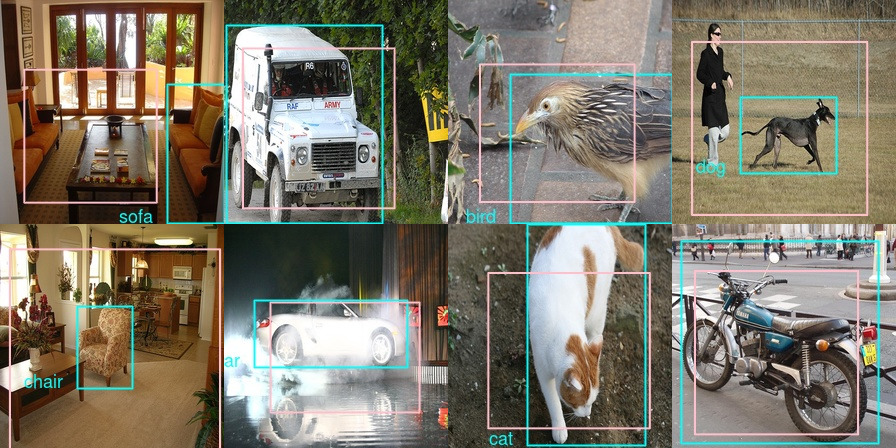
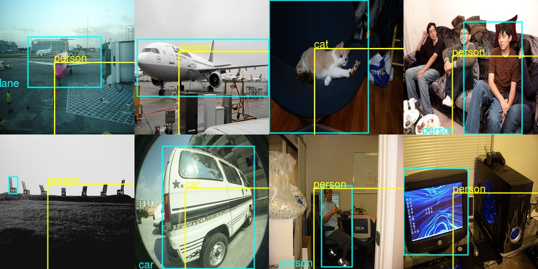

```{r setup, include=FALSE}
knitr::opts_chunk$set(echo = TRUE, eval = FALSE)
```


We've all become used to deep learning's success in image classification. _Greater Swiss Mountain dog_ or _Bernese mountain dog_? _Red panda_ or _giant panda_? No problem.
However, in real life it's not enough to name the single most salient object on a picture. Like it or not, one of the most compelling examples is autonomous driving: We don't want the algorithm to recognize just that car in front of us, but also the pedestrian about to cross the street. And, just detecting the pedestrian is not sufficient. The exact _location_ of objects matters.

The term _object detection_ is commonly used to refer to the task of naming and localizing multiple objects in an image frame. Object detection is difficult; we'll build up to it in a loose series of posts, focusing on concepts instead of aiming for ultimate performance. Today, we'll start with a few straightforward building blocks: Classification, both single and multiple; localization; and combining both classification and localization of a single object.

<aside>
The structure and approaches of these posts will follow the excellent [fast.ai notebook on object detection](https://github.com/fastai/fastai/blob/master/courses/dl2/pascal-multi.ipynb).
</aside>


## Dataset

We'll be using images and annotations from the _Pascal VOC dataset_ which can be downloaded from [this mirror](https://pjreddie.com/projects/pascal-voc-dataset-mirror/).
Specifically, we'll use data from the 2007 challenge and the same JSON annotation file as used in the _fast.ai_ course.

Quick download/organization instructions, shamelessly taken from a [helpful post on the fast.ai wiki](https://forums.fast.ai/t/quick-google-colab-setup-for-part-2-week-1-along-with-pascal-voc-dataset/13650), are as follows:

```
# mkdir data && cd data
# curl -OL http://pjreddie.com/media/files/VOCtrainval_06-Nov-2007.tar
# curl -OL https://storage.googleapis.com/coco-dataset/external/PASCAL_VOC.zip
# tar -xf VOCtrainval_06-Nov-2007.tar
# unzip PASCAL_VOC.zip
# mv PASCAL_VOC/*.json .
# rmdir PASCAL_VOC
# tar -xvf VOCtrainval_06-Nov-2007.tar
```
In words, we take the images and the annotation file from different places:

- [http://pjreddie.com/media/files/VOCtrainval_06-Nov-2007.tar](http://pjreddie.com/media/files/VOCtrainval_06-Nov-2007.tar) provides us with the images, and after unzipping all we care about is the `JPEGImages` folder.
- From [https://storage.googleapis.com/coco-dataset/external/PASCAL_VOC.zip](https://storage.googleapis.com/coco-dataset/external/PASCAL_VOC.zip) all we will be needing is the annotation file, `pascal_train2007.json`.

Whether you're executing the listed commands or arranging files manually, you should eventually end up with directories/files analogous to these:

```{r}
img_dir <- "data/VOCdevkit/VOC2007/JPEGImages"
annot_file <- "data/pascal_train2007.json"
```

Now we need to extract some information from that _json_ file.

## Preprocessing

Let's quickly make sure we have all required libraries loaded.

```{r}
library(keras)
library(rjson)
library(magick)
library(purrr)
library(tibble)
library(tidyr)
library(dplyr)
library(ggplot2)
library(stringr)
```

Annotations contain information about three types of things we're interested in.

```{r}
annotations <- fromJSON(file = annot_file)
str(annotations, max.level = 1)
```


```
List of 4
 $ images     :List of 2501
 $ type       : chr "instances"
 $ annotations:List of 7844
 $ categories :List of 20
```

First, characteristics of the image itself (height and width) and where it's stored. Not surprisingly, here it's one entry per image.

```{r}
imageinfo <- annotations$images %>% {
  tibble(
    id = map_dbl(., "id"),
    file_name = map_chr(., "file_name"),
    image_height = map_dbl(., "height"),
    image_width = map_dbl(., "width")
  )
}
```


Then, object class ids and bounding box coordinates. There may be multiple of these per image.
In Pascal VOC, there are 20 object classes, from ubiquitous vehicles (`car`, `aeroplane`) over indispensable animals (`cat`, `sheep`) to more rare (in popular datasets) types like `potted plant` or `tv monitor`.

```{r}
classes <- c(
  "aeroplane",
  "bicycle",
  "bird",
  "boat",
  "bottle",
  "bus",
  "car",
  "cat",
  "chair",
  "cow",
  "diningtable",
  "dog",
  "horse",
  "motorbike",
  "person",
  "pottedplant",
  "sheep",
  "sofa",
  "train",
  "tvmonitor"
)

boxinfo <- annotations$annotations %>% {
  tibble(
    image_id = map_dbl(., "image_id"),
    category_id = map_dbl(., "category_id"),
    bbox = map(., "bbox")
  )
}
```

The bounding boxes are now stored in a list column and need to be unpacked.

```{r}
boxinfo <- boxinfo %>% 
  mutate(bbox = unlist(map(.$bbox, function(x) paste(x, collapse = " "))))
boxinfo <- boxinfo %>% 
  separate(bbox, into = c("x_left", "y_top", "bbox_width", "bbox_height"))
boxinfo <- boxinfo %>% mutate_all(as.numeric)
```

For the bounding boxes, the annotation file provides `x_left` and `y_top` coordinates, as well as width and height.
We will mostly be working with corner coordinates, so we create the missing `x_right` and `y_bottom`.

As usual in image processing, the `y` axis starts from the top.

```{r}
boxinfo <- boxinfo %>% 
  mutate(y_bottom = y_top + bbox_height - 1, x_right = x_left + bbox_width - 1)
```


Finally, we still need to match class ids to class names.

```{r}
catinfo <- annotations$categories %>%  {
  tibble(id = map_dbl(., "id"), name = map_chr(., "name"))
}
```

So, putting it all together:

```{r}
imageinfo <- imageinfo %>%
  inner_join(boxinfo, by = c("id" = "image_id")) %>%
  inner_join(catinfo, by = c("category_id" = "id"))
```

Note that here still, we have several entries per image, each annotated object occupying its own row.

There's one step that will bitterly hurt our localization performance if we later forget it, so let's do it now already: We need to scale all bounding box coordinates according to the actual image size we'll use when we pass it to our network.

```{r}
target_height <- 224
target_width <- 224

imageinfo <- imageinfo %>% mutate(
  x_left_scaled = (x_left / image_width * target_width) %>% round(),
  x_right_scaled = (x_right / image_width * target_width) %>% round(),
  y_top_scaled = (y_top / image_height * target_height) %>% round(),
  y_bottom_scaled = (y_bottom / image_height * target_height) %>% round(),
  bbox_width_scaled =  (bbox_width / image_width * target_width) %>% round(),
  bbox_height_scaled = (bbox_height / image_height * target_height) %>% round()
)
```

Let's take a glance at our data. Picking one of the early entries and displaying the original image together with the object annotation yields

```{r}
img_data <- imageinfo[4,]
img <- image_read(file.path(img_dir, img_data$file_name))
img <- image_draw(img)
rect(
  img_data$x_left,
  img_data$y_bottom,
  img_data$x_right,
  img_data$y_top,
  border = "white",
  lwd = 2
)
text(
  img_data$x_left,
  img_data$y_top,
  img_data$name,
  offset = 1,
  pos = 2,
  cex = 1.5,
  col = "white"
)
dev.off()
```

{width=80%}

Now as indicated above, in this post we'll mostly address handling a single object in an image. This means we have to decide, per image, which object to single out.

A reasonable strategy seems to be choosing the object with the largest ground truth bounding box.

```{r}
imageinfo <- imageinfo %>% mutate(area = bbox_width_scaled * bbox_height_scaled)

imageinfo_maxbb <- imageinfo %>%
  group_by(id) %>%
  filter(which.max(area) == row_number())
```

After this operation, we only have 2501 images to work with - not many at all! For classification, we could simply use data augmentation as provided by Keras, but to work with localization we'd have to spin our own augmentation algorithm.
We'll leave this to a later occasion and for now, focus on the basics.

Finally after train-test split

```{r}
train_indices <- sample(1:n_samples, 0.8 * n_samples)
train_data <- imageinfo_maxbb[train_indices,]
validation_data <- imageinfo_maxbb[-train_indices,]
```

our training set consists of 2000 images with one annotation each. We're ready to start training, and we'll start gently, with single-object classification.


## Single-object classification

In all cases, we will use XCeption as a basic feature extractor. Having been trained on ImageNet, we don't expect much fine tuning to be necessary to adapt to Pascal VOC, so we leave XCeption's weights untouched

```{r}
feature_extractor <-
  application_xception(
    include_top = FALSE,
    input_shape = c(224, 224, 3),
    pooling = "avg"
)

feature_extractor %>% freeze_weights()
```

and put just a few custom layers on top.

```{r}
model <- keras_model_sequential() %>%
  feature_extractor %>%
  layer_batch_normalization() %>%
  layer_dropout(rate = 0.25) %>%
  layer_dense(units = 512, activation = "relu") %>%
  layer_batch_normalization() %>%
  layer_dropout(rate = 0.5) %>%
  layer_dense(units = 20, activation = "softmax")

model %>% compile(
  optimizer = "adam",
  loss = "sparse_categorical_crossentropy",
  metrics = list("accuracy")
)
```


How should we pass our data to Keras? We could simple use Keras' `image_data_generator`, but given we will need custom generators soon, we'll build a simple one ourselves.
This one delivers images as well as the corresponding targets in a stream. Note how the targets are not one-hot-encoded, but integers - using `sparse_categorical_crossentropy` as a loss function enables this convenience.

<aside>
See the [Deep learning with R](https://tensorflow.rstudio.com/learn/resources.html) book for an introduction to writing data generators like this one.
</aside>

```{r}
batch_size <- 10

load_and_preprocess_image <- function(image_name, target_height, target_width) {
  img_array <- image_load(
    file.path(img_dir, image_name),
    target_size = c(target_height, target_width)
    ) %>%
    image_to_array() %>%
    xception_preprocess_input() 
  dim(img_array) <- c(1, dim(img_array))
  img_array
}

classification_generator <-
  function(data,
           target_height,
           target_width,
           shuffle,
           batch_size) {
    i <- 1
    function() {
      if (shuffle) {
        indices <- sample(1:nrow(data), size = batch_size)
      } else {
        if (i + batch_size >= nrow(data))
          i <<- 1
        indices <- c(i:min(i + batch_size - 1, nrow(data)))
        i <<- i + length(indices)
      }
      x <-
        array(0, dim = c(length(indices), target_height, target_width, 3))
      y <- array(0, dim = c(length(indices), 1))
      
      for (j in 1:length(indices)) {
        x[j, , , ] <-
          load_and_preprocess_image(data[[indices[j], "file_name"]],
                                    target_height, target_width)
        y[j, ] <-
          data[[indices[j], "category_id"]] - 1
      }
      x <- x / 255
      list(x, y)
    }
  }

train_gen <- classification_generator(
  train_data,
  target_height = target_height,
  target_width = target_width,
  shuffle = TRUE,
  batch_size = batch_size
)

valid_gen <- classification_generator(
  validation_data,
  target_height = target_height,
  target_width = target_width,
  shuffle = FALSE,
  batch_size = batch_size
)
```


Now how does training go? 

```{r}
model %>% fit_generator(
  train_gen,
  epochs = 20,
  steps_per_epoch = nrow(train_data) / batch_size,
  validation_data = valid_gen,
  validation_steps = nrow(validation_data) / batch_size,
  callbacks = list(
    callback_model_checkpoint(
      file.path("class_only", "weights.{epoch:02d}-{val_loss:.2f}.hdf5")
    ),
    callback_early_stopping(patience = 2)
  )
)
```

For us, after 8 epochs, accuracies on the train resp. validation sets were at 0.68 and 0.74, respectively. Not too bad given given we're trying to differentiate between 20 classes here.


Now let's quickly think what we'd change if we were to classify multiple objects in one image. Changes mostly concern preprocessing steps.

## Multiple object classification

This time, we multi-hot-encode our data. For every image (as represented by its filename), here we have a vector of length 20 where 0 indicates absence, 1 means presence of the respective object class: 

```{r}
image_cats <- imageinfo %>% 
  select(category_id) %>%
  mutate(category_id = category_id - 1) %>%
  pull() %>%
  to_categorical(num_classes = 20)

image_cats <- data.frame(image_cats) %>%
  add_column(file_name = imageinfo$file_name, .before = TRUE)

image_cats <- image_cats %>% 
  group_by(file_name) %>% 
  summarise_all(.funs = funs(max))

n_samples <- nrow(image_cats)
train_indices <- sample(1:n_samples, 0.8 * n_samples)
train_data <- image_cats[train_indices,]
validation_data <- image_cats[-train_indices,]
```

Correspondingly, we modify the generator to return a target of dimensions `batch_size` * 20, instead of `batch_size` * 1.

```{r}
classification_generator <- 
  function(data,
           target_height,
           target_width,
           shuffle,
           batch_size) {
    i <- 1
    function() {
      if (shuffle) {
        indices <- sample(1:nrow(data), size = batch_size)
      } else {
        if (i + batch_size >= nrow(data))
          i <<- 1
        indices <- c(i:min(i + batch_size - 1, nrow(data)))
        i <<- i + length(indices)
      }
      x <-
        array(0, dim = c(length(indices), target_height, target_width, 3))
      y <- array(0, dim = c(length(indices), 20))
      
      for (j in 1:length(indices)) {
        x[j, , , ] <-
          load_and_preprocess_image(data[[indices[j], "file_name"]], 
                                    target_height, target_width)
        y[j, ] <-
          data[indices[j], 2:21] %>% as.matrix()
      }
      x <- x / 255
      list(x, y)
    }
  }

train_gen <- classification_generator(
  train_data,
  target_height = target_height,
  target_width = target_width,
  shuffle = TRUE,
  batch_size = batch_size
)

valid_gen <- classification_generator(
  validation_data,
  target_height = target_height,
  target_width = target_width,
  shuffle = FALSE,
  batch_size = batch_size
)
```

Now, the most interesting change is to the model - even though it's a change to two lines only.
Were we to use `categorical_crossentropy` now (the non-sparse variant of the above), combined with a `softmax` activation, we would effectively tell the model to pick just one, namely, the most probable object.

<aside>
See the [introduction to loss functions and activations](https://blogs.rstudio.com/tensorflow/posts/2018-10-11-activations-intro/) on this blog for a demonstration.
</aside>

Instead, we want to decide: For each object class, is it present in the image or not? Thus, instead of `softmax` we use `sigmoid`, paired with `binary_crossentropy`, to obtain an independent verdict on every class.

```{r}
feature_extractor <-
  application_xception(
    include_top = FALSE,
    input_shape = c(224, 224, 3),
    pooling = "avg"
  )

feature_extractor %>% freeze_weights()

model <- keras_model_sequential() %>%
  feature_extractor %>%
  layer_batch_normalization() %>%
  layer_dropout(rate = 0.25) %>%
  layer_dense(units = 512, activation = "relu") %>%
  layer_batch_normalization() %>%
  layer_dropout(rate = 0.5) %>%
  layer_dense(units = 20, activation = "sigmoid")

model %>% compile(optimizer = "adam",
                  loss = "binary_crossentropy",
                  metrics = list("accuracy"))
```


And finally, again, we fit the model:

```{r}
model %>% fit_generator(
  train_gen,
  epochs = 20,
  steps_per_epoch = nrow(train_data) / batch_size,
  validation_data = valid_gen,
  validation_steps = nrow(validation_data) / batch_size,
  callbacks = list(
    callback_model_checkpoint(
      file.path("multiclass", "weights.{epoch:02d}-{val_loss:.2f}.hdf5")
    ),
    callback_early_stopping(patience = 2)
  )
)
```


This time, (binary) accuracy surpasses 0.95 after one epoch already, on both the train and validation sets. Not surprisingly, accuracy is significantly higher here than when we had to single out one of 20 classes (and that, with other confounding objects present in most cases!).

Now, chances are that if you've done any deep learning before, you've done image classification in some form, perhaps even in the multiple-object variant. To build up in the direction of object detection, it is time we add a new ingredient: localization.

## Single-object localization

From here on, we're back to dealing with a single object per image. So the question now is, how do we learn bounding boxes?
If you've never heard of this, the answer will sound unbelievably simple (naive even): We formulate this as a regression problem and aim to predict the actual coordinates. To set realistic expectations - we surely shouldn't expect ultimate precision here. But in a way it's amazing it does even work at all.

What does this mean, formulate as a regression problem? Concretely, it means we'll have a `dense` output layer with 4 units, each corresponding to a corner coordinate.

So let's start with the model this time. Again, we use Xception, but there's an important difference here: Whereas before, we said `pooling = "avg"` to obtain an output tensor of dimensions `batch_size` * number of filters, here we don't do any averaging or flattening out of the spatial grid. This is because it's exactly the spatial information we're interested in!

For Xception, the output resolution will be 7x7. So a priori, we shouldn't expect high precision on objects much smaller than about 32x32 pixels (assuming the standard input size of 224x224).

```{r}
feature_extractor <- application_xception(
  include_top = FALSE,
  input_shape = c(224, 224, 3)
)

feature_extractor %>% freeze_weights()
```


Now we append our custom regression module.

```{r}
model <- keras_model_sequential() %>%
  feature_extractor %>%
  layer_flatten() %>%
  layer_batch_normalization() %>%
  layer_dropout(rate = 0.25) %>%
  layer_dense(units = 512, activation = "relu") %>%
  layer_batch_normalization() %>%
  layer_dropout(rate = 0.5) %>%
  layer_dense(units = 4)
```


We will train with one of the loss functions common in regression tasks, mean absolute error. But in tasks like object detection or segmentation, we're also interested in a more tangible quantity: How much do estimate and ground truth overlap?

Overlap is usually measured as _Intersection over Union_, or _Jaccard distance_. Intersection over Union is exactly what it says, a ratio between space shared by the objects and space occupied when we take them together.

To assess the model's progress, we can easily code this as a custom metric:

```{r}
metric_iou <- function(y_true, y_pred) {
  
  # order is [x_left, y_top, x_right, y_bottom]
  intersection_xmin <- k_maximum(y_true[ ,1], y_pred[ ,1])
  intersection_ymin <- k_maximum(y_true[ ,2], y_pred[ ,2])
  intersection_xmax <- k_minimum(y_true[ ,3], y_pred[ ,3])
  intersection_ymax <- k_minimum(y_true[ ,4], y_pred[ ,4])
  
  area_intersection <- (intersection_xmax - intersection_xmin) * 
                       (intersection_ymax - intersection_ymin)
  area_y <- (y_true[ ,3] - y_true[ ,1]) * (y_true[ ,4] - y_true[ ,2])
  area_yhat <- (y_pred[ ,3] - y_pred[ ,1]) * (y_pred[ ,4] - y_pred[ ,2])
  area_union <- area_y + area_yhat - area_intersection
  
  iou <- area_intersection/area_union
  k_mean(iou)
  
}
```

Model compilation then goes like

```{r}
model %>% compile(
  optimizer = "adam",
  loss = "mae",
  metrics = list(custom_metric("iou", metric_iou))
)
```


Now modify the generator to return bounding box coordinates as targets...

```{r}
localization_generator <-
  function(data,
           target_height,
           target_width,
           shuffle,
           batch_size) {
    i <- 1
    function() {
      if (shuffle) {
        indices <- sample(1:nrow(data), size = batch_size)
      } else {
        if (i + batch_size >= nrow(data))
          i <<- 1
        indices <- c(i:min(i + batch_size - 1, nrow(data)))
        i <<- i + length(indices)
      }
      x <-
        array(0, dim = c(length(indices), target_height, target_width, 3))
      y <- array(0, dim = c(length(indices), 4))
      
      for (j in 1:length(indices)) {
        x[j, , , ] <-
          load_and_preprocess_image(data[[indices[j], "file_name"]], 
                                    target_height, target_width)
        y[j, ] <-
          data[indices[j], c("x_left_scaled",
                             "y_top_scaled",
                             "x_right_scaled",
                             "y_bottom_scaled")] %>% as.matrix()
      }
      x <- x / 255
      list(x, y)
    }
  }

train_gen <- localization_generator(
  train_data,
  target_height = target_height,
  target_width = target_width,
  shuffle = TRUE,
  batch_size = batch_size
)

valid_gen <- localization_generator(
  validation_data,
  target_height = target_height,
  target_width = target_width,
  shuffle = FALSE,
  batch_size = batch_size
)
```

... and we're ready to go!

```{r}
model %>% fit_generator(
  train_gen,
  epochs = 20,
  steps_per_epoch = nrow(train_data) / batch_size,
  validation_data = valid_gen,
  validation_steps = nrow(validation_data) / batch_size,
  callbacks = list(
    callback_model_checkpoint(
      file.path("loc_only", "weights.{epoch:02d}-{val_loss:.2f}.hdf5")
    ),
    callback_early_stopping(patience = 2)
  )
)
```


After 8 epochs, IOU on both training and test sets is around 0.35. This number doesn't look too good. To learn more about how training went, we need to see some predictions. Here's a convenience function that displays an image, the ground truth box of the most salient object (as defined above), and if given, class and bounding box predictions.

```{r}
plot_image_with_boxes <- function(file_name,
                                  object_class,
                                  box,
                                  scaled = FALSE,
                                  class_pred = NULL,
                                  box_pred = NULL) {
  img <- image_read(file.path(img_dir, file_name))
  if(scaled) img <- image_resize(img, geometry = "224x224!")
  img <- image_draw(img)
  x_left <- box[1]
  y_bottom <- box[2]
  x_right <- box[3]
  y_top <- box[4]
  rect(
    x_left,
    y_bottom,
    x_right,
    y_top,
    border = "cyan",
    lwd = 2.5
  )
  text(
    x_left,
    y_top,
    object_class,
    offset = 1,
    pos = 2,
    cex = 1.5,
    col = "cyan"
  )
  if (!is.null(box_pred))
    rect(box_pred[1],
         box_pred[2],
         box_pred[3],
         box_pred[4],
         border = "yellow",
         lwd = 2.5)
  if (!is.null(class_pred))
    text(
      box_pred[1],
      box_pred[2],
      class_pred,
      offset = 0,
      pos = 4,
      cex = 1.5,
      col = "yellow")
  dev.off()
  img %>% image_write(paste0("preds_", file_name))
  plot(img)
}
```

First, let's see predictions on sample images from the training set.


```{r}
train_1_8 <- train_data[1:8, c("file_name",
                               "name",
                               "x_left_scaled",
                               "y_top_scaled",
                               "x_right_scaled",
                               "y_bottom_scaled")]

for (i in 1:8) {
  preds <-
    model %>% predict(
      load_and_preprocess_image(train_1_8[i, "file_name"], 
                                target_height, target_width),
      batch_size = 1
  )
  plot_image_with_boxes(train_1_8$file_name[i],
                        train_1_8$name[i],
                        train_1_8[i, 3:6] %>% as.matrix(),
                        scaled = TRUE,
                        box_pred = preds)
}
```


{width=100%}

As you'd guess from looking, the cyan-colored boxes are the ground truth ones. Now looking at the predictions explains a lot about the mediocre IOU values! Let's take the very first sample image - we wanted the model to focus on the sofa, but it picked the table, which is also a category in the dataset (although in the form of _dining_ _table_). Similar with the image on the right of the first row - we wanted to it to pick just the dog but it included the person, too (by far the most frequently seen category in the dataset).
So we actually made the task a lot more difficult than had we stayed with e.g., ImageNet where normally a single object is salient.

Now check predictions on the validation set.

{width=100%}


Again, we get a similar impression: The model _did_ learn something, but the task is ill defined. Look at the third image in row 2: Isn't it pretty consequent the model picks _all_ people instead of singling out some special guy?

If single-object localization is that straightforward, how technically involved can it be to output a class label at the same time?
As long as we stay with a single object, the answer indeed is: not much.

<aside>
As a caveat, please note we're talking about mapping concepts to technical approaches here.
Obtaining ultimate performance is a different thing.
</aside>

Let's finish up today with a constrained combination of classification and localization: detection of a single object.

## Single-object detection

Combining regression and classification into one means we'll want to have two outputs in our model.
We'll thus use the functional API this time. 
Otherwise, there isn't much new here: We start with an XCeption output of spatial resolution 7x7, append some custom processing and return two outputs, one for bounding box regression and one for classification.

```{r}
feature_extractor <- application_xception(
  include_top = FALSE,
  input_shape = c(224, 224, 3)
)

input <- feature_extractor$input
common <- feature_extractor$output %>%
  layer_flatten(name = "flatten") %>%
  layer_activation_relu() %>%
  layer_dropout(rate = 0.25) %>%
  layer_dense(units = 512, activation = "relu") %>%
  layer_batch_normalization() %>%
  layer_dropout(rate = 0.5)

regression_output <-
  layer_dense(common, units = 4, name = "regression_output")
class_output <- layer_dense(
  common,
  units = 20,
  activation = "softmax",
  name = "class_output"
)

model <- keras_model(
  inputs = input,
  outputs = list(regression_output, class_output)
)
```

When defining the losses (mean absolute error and categorical crossentropy, just as in the respective single tasks of regression and classification), we could weight them so they end up on approximately a common scale. In fact that didn't make much of a difference so we show the respective code in commented form.

```{r}
model %>% freeze_weights(to = "flatten")

model %>% compile(
  optimizer = "adam",
  loss = list("mae", "sparse_categorical_crossentropy"),
  #loss_weights = list(
  #  regression_output = 0.05,
  #  class_output = 0.95),
  metrics = list(
    regression_output = custom_metric("iou", metric_iou),
    class_output = "accuracy"
  )
)
```

Just like model outputs and losses are both lists, the data generator has to return the ground truth samples in a list.
Fitting the model then goes as usual.

```{r}
loc_class_generator <-
  function(data,
           target_height,
           target_width,
           shuffle,
           batch_size) {
    i <- 1
    function() {
      if (shuffle) {
        indices <- sample(1:nrow(data), size = batch_size)
      } else {
        if (i + batch_size >= nrow(data))
          i <<- 1
        indices <- c(i:min(i + batch_size - 1, nrow(data)))
        i <<- i + length(indices)
      }
      x <-
        array(0, dim = c(length(indices), target_height, target_width, 3))
      y1 <- array(0, dim = c(length(indices), 4))
      y2 <- array(0, dim = c(length(indices), 1))
      
      for (j in 1:length(indices)) {
        x[j, , , ] <-
          load_and_preprocess_image(data[[indices[j], "file_name"]], 
                                    target_height, target_width)
        y1[j, ] <-
          data[indices[j], c("x_left", "y_top", "x_right", "y_bottom")] 
            %>% as.matrix()
        y2[j, ] <-
          data[[indices[j], "category_id"]] - 1
      }
      x <- x / 255
      list(x, list(y1, y2))
    }
  }

train_gen <- loc_class_generator(
  train_data,
  target_height = target_height,
  target_width = target_width,
  shuffle = TRUE,
  batch_size = batch_size
)

valid_gen <- loc_class_generator(
  validation_data,
  target_height = target_height,
  target_width = target_width,
  shuffle = FALSE,
  batch_size = batch_size
)

model %>% fit_generator(
  train_gen,
  epochs = 20,
  steps_per_epoch = nrow(train_data) / batch_size,
  validation_data = valid_gen,
  validation_steps = nrow(validation_data) / batch_size,
  callbacks = list(
    callback_model_checkpoint(
      file.path("loc_class", "weights.{epoch:02d}-{val_loss:.2f}.hdf5")
    ),
    callback_early_stopping(patience = 2)
  )
)
```


What about model predictions? A priori we might expect the bounding boxes to look better than in the regression-only model, as a significant part of the model is shared between classification and localization. Intuitively, I should be able to more precisely indicate the boundaries of _something_ if I have an idea what that _something_ is.

Unfortunately, that didn't quite happen. The model has become _very_ biased to detecting a _person_ everywhere, which might be advantageous (thinking safety) in an autonomous driving application but isn't quite what we'd hoped for here.

{width=100%}

{width=100%}

Just to double-check this really has to do with class imbalance, here are the actual frequencies:

```{r}
imageinfo %>% group_by(name)
  %>% summarise(cnt = n()) 
  %>% arrange(desc(cnt))
```

```
# A tibble: 20 x 2
   name          cnt
   <chr>       <int>
 1 person       2705
 2 car           826
 3 chair         726
 4 bottle        338
 5 pottedplant   305
 6 bird          294
 7 dog           271
 8 sofa          218
 9 boat          208
10 horse         207
11 bicycle       202
12 motorbike     193
13 cat           191
14 sheep         191
15 tvmonitor     191
16 cow           185
17 train         158
18 aeroplane     156
19 diningtable   148
20 bus           131
```

To get better performance, we'd need to find a successful way to deal with this. However, handling class imbalance in deep learning is a topic of its own, and here we want to build up in the direction of objection detection. So we'll make a cut here and in an upcoming post, think about how we can classify and localize multiple objects in an image.

## Conclusion

We have seen that single-object classification and localization are conceptually straightforward. The big question now is, are these approaches extensible to multiple objects? Or will new ideas have to come in? We'll follow up on this giving a short overview of approaches and then, singling in on one of those and implementing it.