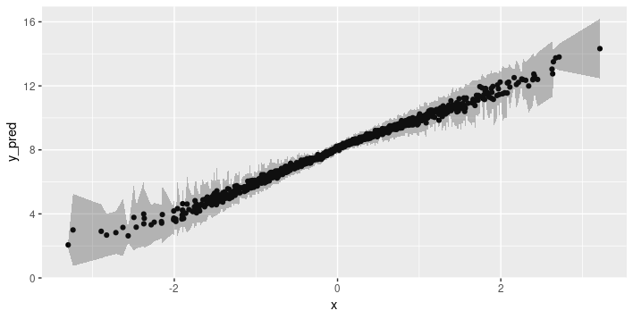
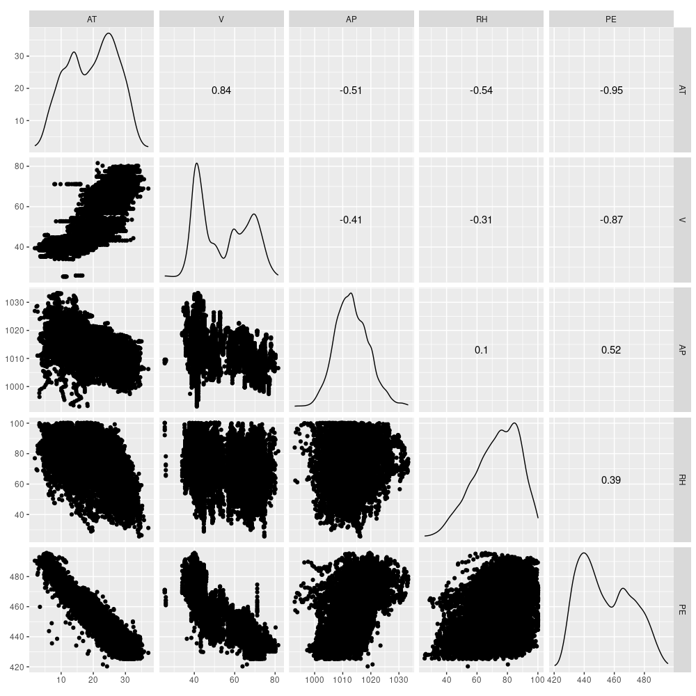

```{r setup, include=FALSE}
knitr::opts_chunk$set(echo = TRUE, eval = FALSE)
```


If there were a set of survival rules for data scientists, among them would have to be this: _Always report uncertainty estimates with your predictions_. However, here we are, working with neural networks, and unlike `lm`, a Keras model does not conveniently output something like a _standard error_ for the weights.
We might try to think of rolling your own uncertainty measure - for example, averaging predictions from networks trained from different random weight initializations, for different numbers of epochs, or on different subsets of the data. But we might still be worried that our method is quite a bit, well ... _ad hoc_.

In this post, we'll see a both practical as well as theoretically grounded approach to obtaining uncertainty estimates from neural networks. First, however, let's quickly talk about why uncertainty is that important - over and above its potential to save a data scientist's job.

## Why uncertainty?

In a society where automated algorithms are - and will be - entrusted with more and more life-critical tasks, one answer immediately jumps to mind: If the algorithm correctly quantifies its uncertainty, we may have human experts inspect the more uncertain predictions and potentially revise them.

This will only work if the network's self-indicated uncertainty really is indicative of a higher probability of misclassification. Leibig et al.[@Leibig084210] used a predecessor of the method described below to assess neural network uncertainty in detecting _diabetic retinopathy_. They found that indeed, the distributions of uncertainty were different depending on whether the answer was correct or not:


![Figure from Leibig et al. 2017 [@Leibig084210]. Green: uncertainty estimates for wrong predictions. Blue: uncertainty estimates for correct predictions.](images/retinopathy.png){.external width=100%}

In addition to quantifying uncertainty, it can make sense to _qualify_ it. In the Bayesian deep learning literature, a distinction is commonly made between _epistemic uncertainty_ and _aleatoric uncertainty_ [@NIPS2017_7141].
Epistemic uncertainty refers to imperfections in the model -  in the limit of infinite data, this kind of uncertainty should be reducible to 0. Aleatoric uncertainty is due to data sampling and measurement processes and does not depend on the size of the dataset.

Say we train a model for object detection. With more data, the model should become more sure about what makes a unicycle different from a mountainbike. However, let's assume all that's visible of the mountainbike is the front wheel, the fork and the head tube. Then it doesn't look so different from a unicycle any more!

What would be the consequences if we could distinguish both types of uncertainty? If epistemic uncertainty is high, we can try to get more training data. The remaining aleatoric uncertainty should then keep us cautioned to factor in safety margins in our application.

Probably no further justifications are required of why we might want to assess model uncertainty - but how can we do this?

## Uncertainty estimates through Bayesian deep learning

In a Bayesian world, in principle, uncertainty is for free as we don't just get point estimates (the maximum aposteriori) but the full posterior distribution. Strictly speaking, in Bayesian deep learning, priors should be put over the weights, and the posterior be determined according to Bayes' rule. 
To the deep learning practitioner, this sounds pretty arduous - and how do you do it using Keras?

In 2016 though, Gal and Ghahramani [@GalG16] showed that when viewing a neural network as an approximation to a Gaussian process, uncertainty estimates can be obtained in a theoretically grounded yet very practical way: by training a network with dropout and then, using dropout at test time too. At test time, dropout lets us extract Monte Carlo samples from the posterior, which can then be used to approximate the true posterior distribution.

<aside>
Yarin Gal has a nice writeup of the why and how on his [blog](http://mlg.eng.cam.ac.uk/yarin/blog_3d801aa532c1ce.html).
</aside>

This is already good news, but it leaves one question open: How do we choose an appropriate dropout rate? The answer is: let the network learn it.

## Learning dropout and uncertainty

In several 2017 papers [@2017arXiv170507832G],[@NIPS2017_7141], Gal and his coworkers demonstrated how a network can be trained to dynamically adapt the dropout rate so it is adequate for the amount and characteristics of the data given.

Besides the predictive mean of the target variable, it can additionally be made to learn the variance.
This means we can calculate both types of uncertainty, epistemic and aleatoric, independently, which is useful in the light of their different implications. We then add them up to obtain the overall predictive uncertainty.

Let's make this concrete and see how we can implement and test the intended behavior on simulated data.
In the implementation, there are three things warranting our special attention:

- The wrapper class used to add learnable-dropout behavior to a Keras layer;
- The loss function designed to minimize aleatoric uncertainty; and
- The ways we can obtain both uncertainties at test time.

Let's start with the wrapper.

### A wrapper for learning dropout

In this example, we'll restrict ourselves to learning dropout for _dense_ layers. Technically, we'll add a weight and a loss to every dense layer we want to use dropout with. This means we'll create a [custom wrapper](https://github.com/rstudio/keras/blob/master/vignettes/custom_wrappers.Rmd) class that has access to the underlying layer and can modify it.

The logic implemented in the wrapper is derived mathematically in the _Concrete Dropout_ paper [@2017arXiv170507832G]. The below code is a port to R of the Python Keras version found in the [paper's companion github repo ](https://github.com/yaringal/ConcreteDropout).

So first, here is the wrapper class - we'll see how to use it in just a second:

```{r}
library(keras)

# R6 wrapper class, a subclass of KerasWrapper
ConcreteDropout <- R6::R6Class("ConcreteDropout",
  
  inherit = KerasWrapper,
  
  public = list(
    weight_regularizer = NULL,
    dropout_regularizer = NULL,
    init_min = NULL,
    init_max = NULL,
    is_mc_dropout = NULL,
    supports_masking = TRUE,
    p_logit = NULL,
    p = NULL,
    
    initialize = function(weight_regularizer,
                          dropout_regularizer,
                          init_min,
                          init_max,
                          is_mc_dropout) {
      self$weight_regularizer <- weight_regularizer
      self$dropout_regularizer <- dropout_regularizer
      self$is_mc_dropout <- is_mc_dropout
      self$init_min <- k_log(init_min) - k_log(1 - init_min)
      self$init_max <- k_log(init_max) - k_log(1 - init_max)
    },
    
    build = function(input_shape) {
      super$build(input_shape)
      
      self$p_logit <- super$add_weight(
        name = "p_logit",
        shape = shape(1),
        initializer = initializer_random_uniform(self$init_min, self$init_max),
        trainable = TRUE
      )

      self$p <- k_sigmoid(self$p_logit)

      input_dim <- input_shape[[2]]

      weight <- private$py_wrapper$layer$kernel
      
      kernel_regularizer <- self$weight_regularizer * 
                            k_sum(k_square(weight)) / 
                            (1 - self$p)
      
      dropout_regularizer <- self$p * k_log(self$p)
      dropout_regularizer <- dropout_regularizer +  
                             (1 - self$p) * k_log(1 - self$p)
      dropout_regularizer <- dropout_regularizer * 
                             self$dropout_regularizer * 
                             k_cast(input_dim, k_floatx())

      regularizer <- k_sum(kernel_regularizer + dropout_regularizer)
      super$add_loss(regularizer)
    },
    
    concrete_dropout = function(x) {
      eps <- k_cast_to_floatx(k_epsilon())
      temp <- 0.1
      
      unif_noise <- k_random_uniform(shape = k_shape(x))
      
      drop_prob <- k_log(self$p + eps) - 
                   k_log(1 - self$p + eps) + 
                   k_log(unif_noise + eps) - 
                   k_log(1 - unif_noise + eps)
      drop_prob <- k_sigmoid(drop_prob / temp)
      
      random_tensor <- 1 - drop_prob
      
      retain_prob <- 1 - self$p
      x <- x * random_tensor
      x <- x / retain_prob
      x
    },

    call = function(x, mask = NULL, training = NULL) {
      if (self$is_mc_dropout) {
        super$call(self$concrete_dropout(x))
      } else {
        k_in_train_phase(
          function()
            super$call(self$concrete_dropout(x)),
          super$call(x),
          training = training
        )
      }
    }
  )
)

# function for instantiating custom wrapper
layer_concrete_dropout <- function(object, 
                                   layer,
                                   weight_regularizer = 1e-6,
                                   dropout_regularizer = 1e-5,
                                   init_min = 0.1,
                                   init_max = 0.1,
                                   is_mc_dropout = TRUE,
                                   name = NULL,
                                   trainable = TRUE) {
  create_wrapper(ConcreteDropout, object, list(
    layer = layer,
    weight_regularizer = weight_regularizer,
    dropout_regularizer = dropout_regularizer,
    init_min = init_min,
    init_max = init_max,
    is_mc_dropout = is_mc_dropout,
    name = name,
    trainable = trainable
  ))
}
```

The wrapper instantiator has default arguments, but two of them should be adapted to the data: `weight_regularizer` and `dropout_regularizer`. Following the authors' recommendations, they should be set as follows.

First, choose a value for hyperparameter $l$. In this view of a neural network as an approximation to a Gaussian process, $l$ is the _prior length-scale_, our a priori assumption about the frequency characteristics of the data. Here, we follow Gal's demo in setting `l := 1e-4`. Then the initial values for `weight_regularizer` and `dropout_regularizer` are derived from the length-scale and the sample size.

```{r}
# sample size (training data)
n_train <- 1000
# sample size (validation data)
n_val <- 1000
# prior length-scale
l <- 1e-4
# initial value for weight regularizer 
wd <- l^2/n_train
# initial value for dropout regularizer
dd <- 2/n_train
```

Now let's see how to use the wrapper in a model.

### Dropout model


In our demonstration, we'll have a model with three hidden dense layers, each of which will have its dropout rate calculated by a dedicated wrapper.


```{r}
# we use one-dimensional input data here, but this isn't a necessity
input_dim <- 1
# this too could be > 1 if we wanted
output_dim <- 1
hidden_dim <- 1024

input <- layer_input(shape = input_dim)

output <- input %>% layer_concrete_dropout(
  layer = layer_dense(units = hidden_dim, activation = "relu"),
  weight_regularizer = wd,
  dropout_regularizer = dd
  ) %>% layer_concrete_dropout(
  layer = layer_dense(units = hidden_dim, activation = "relu"),
  weight_regularizer = wd,
  dropout_regularizer = dd
  ) %>% layer_concrete_dropout(
  layer = layer_dense(units = hidden_dim, activation = "relu"),
  weight_regularizer = wd,
  dropout_regularizer = dd
)
```


Now, model output is interesting: We have the model yielding not just the _predictive (conditional) mean_, but also the _predictive variance_ ($\tau^{-1}$ in Gaussian process parlance):

```{r}
mean <- output %>% layer_concrete_dropout(
  layer = layer_dense(units = output_dim),
  weight_regularizer = wd,
  dropout_regularizer = dd
)

log_var <- output %>% layer_concrete_dropout(
  layer_dense(units = output_dim),
  weight_regularizer = wd,
  dropout_regularizer = dd
)

output <- layer_concatenate(list(mean, log_var))

model <- keras_model(input, output)
```


The significant thing here is that we learn _different variances for different data points_. We thus hope to be able to account for _heteroscedasticity_ (different degrees of variability) in the data.


### Heteroscedastic loss

Accordingly, instead of mean squared error we use a cost function that does not treat all estimates alike[@NIPS2017_7141]:

$$\frac{1}{N} \sum_i{\frac{1}{2 \hat{\sigma}^2_i} \ (\mathbf{y}_i - \mathbf{\hat{y}}_i)^2 + \frac{1}{2} log \ \hat{\sigma}^2_i}$$

In addition to the obligatory target vs. prediction check, this cost function contains two regularization terms: 

- First, $\frac{1}{2 \hat{\sigma}^2_i}$ downweights the high-uncertainty predictions in the loss function. Put plainly: The model is encouraged to indicate high uncertainty when its predictions are false.
- Second, $\frac{1}{2} log \ \hat{\sigma}^2_i$ makes sure the network does not simply indicate high uncertainty everywhere.

This logic maps directly to the code (except that as usual, we're calculating with the log of the variance, for reasons of numerical stability):


```{r}
heteroscedastic_loss <- function(y_true, y_pred) {
    mean <- y_pred[, 1:output_dim]
    log_var <- y_pred[, (output_dim + 1):(output_dim * 2)]
    precision <- k_exp(-log_var)
    k_sum(precision * (y_true - mean) ^ 2 + log_var, axis = 2)
  }
```


### Training on simulated data

Now we generate some test data and train the model.

```{r}
gen_data_1d <- function(n) {
  sigma <- 1
  X <- matrix(rnorm(n))
  w <- 2
  b <- 8
  Y <- matrix(X %*% w + b + sigma * rnorm(n))
  list(X, Y)
}

c(X, Y) %<-% gen_data_1d(n_train + n_val)

c(X_train, Y_train) %<-% list(X[1:n_train], Y[1:n_train])
c(X_val, Y_val) %<-% list(X[(n_train + 1):(n_train + n_val)], 
                          Y[(n_train + 1):(n_train + n_val)])

model %>% compile(
  optimizer = "adam",
  loss = heteroscedastic_loss,
  metrics = c(custom_metric("heteroscedastic_loss", heteroscedastic_loss))
)

history <- model %>% fit(
  X_train,
  Y_train,
  epochs = 30,
  batch_size = 10
)

```


With training finished, we turn to the validation set to obtain estimates on unseen data - including those uncertainty measures this is all about!

### Obtain uncertainty estimates via Monte Carlo sampling

As often in a Bayesian setup, we construct the posterior (and thus, the posterior predictive) via Monte Carlo sampling.
Unlike in traditional use of dropout, there is no change in behavior between training and test phases: Dropout stays "on".

So now we get an ensemble of model predictions on the validation set:

```{r}
num_MC_samples <- 20

MC_samples <- array(0, dim = c(num_MC_samples, n_val, 2 * output_dim))
for (k in 1:num_MC_samples) {
  MC_samples[k, , ] <- (model %>% predict(X_val))
}
```


Remember, our model predicts the mean as well as the variance. We'll use the former for calculating epistemic uncertainty, while aleatoric uncertainty is obtained from the latter.

First, we determine the predictive mean as an average of the MC samples' _mean_ output:

```{r}
# the means are in the first output column
means <- MC_samples[, , 1:output_dim]  
# average over the MC samples
predictive_mean <- apply(means, 2, mean) 

```

To calculate epistemic uncertainty, we again  use the _mean_ output, but this time we're interested in the variance of the MC samples:

```{r}
epistemic_uncertainty <- apply(means, 2, var) 
```


Then aleatoric uncertainty is the average over the MC samples of the _variance_ output.^[exponentiated because we've really been working with the log of the variance].

```{r}
logvar <- MC_samples[, , (output_dim + 1):(output_dim * 2)]
aleatoric_uncertainty <- exp(colMeans(logvar))
```


Note how this procedure gives us uncertainty estimates individually for every prediction. How do they look?

```{r}
df <- data.frame(
  x = X_val,
  y_pred = predictive_mean,
  e_u_lower = predictive_mean - sqrt(epistemic_uncertainty),
  e_u_upper = predictive_mean + sqrt(epistemic_uncertainty),
  a_u_lower = predictive_mean - sqrt(aleatoric_uncertainty),
  a_u_upper = predictive_mean + sqrt(aleatoric_uncertainty),
  u_overall_lower = predictive_mean - 
                    sqrt(epistemic_uncertainty) - 
                    sqrt(aleatoric_uncertainty),
  u_overall_upper = predictive_mean + 
                    sqrt(epistemic_uncertainty) + 
                    sqrt(aleatoric_uncertainty)
)
```

Here, first, is epistemic uncertainty, with shaded bands indicating one standard deviation above resp. below the predicted mean:

```{r}
ggplot(df, aes(x, y_pred)) + 
  geom_point() + 
  geom_ribbon(aes(ymin = e_u_lower, ymax = e_u_upper), alpha = 0.3)
```

{width=100%}

This is interesting. The training data (as well as the validation data) were generated from a standard normal distribution, so the model has encountered many more examples close to the mean than outside two, or even three, standard deviations. So it correctly tells us that in those more exotic regions, it feels pretty unsure about its predictions. 

This is exactly the behavior we want: Risk in automatically applying machine learning methods arises due to unanticipated differences between the training and test (_real world_) distributions. If the model were to tell us "ehm, not really seen anything like that before, don't really know what to do" that'd be an enormously valuable outcome.

So while epistemic uncertainty has the algorithm reflecting on its model of the world - potentially admitting its shortcomings - aleatoric uncertainty, by definition, is irreducible. Of course, that doesn't make it any less valuable - we'd know we _always_ have to factor in a safety margin. So how does it look here?

{width=100%}

Indeed, the extent of uncertainty does not depend on the amount of data seen at training time.

Finally, we add up both types to obtain the overall uncertainty when making predictions.

{width=100%}

Now let's try this method on a real-world dataset.

## Combined cycle power plant electrical energy output estimation

This dataset is available from the [UCI Machine Learning Repository](http://archive.ics.uci.edu/ml/datasets/Combined+Cycle+Power+Plant). We explicitly chose a regression task with continuous variables exclusively, to make for a smooth transition from the simulated data.

In the dataset providers' [own words](http://archive.ics.uci.edu/ml/datasets/Combined+Cycle+Power+Plant)

> The dataset contains 9568 data points collected from a Combined Cycle Power Plant over 6 years (2006-2011), when the power plant was set to work with full load. Features consist of hourly average ambient variables Temperature (T), Ambient Pressure (AP), Relative Humidity (RH) and Exhaust Vacuum (V) to predict the net hourly electrical energy output (EP) of the plant.

> A combined cycle power plant (CCPP) is composed of gas turbines (GT), steam turbines (ST) and heat recovery steam generators. In a CCPP, the electricity is generated by gas and steam turbines, which are combined in one cycle, and is transferred from one turbine to another. While the Vacuum is collected from and has effect on the Steam Turbine, the other three of the ambient variables effect the GT performance.

We thus have four predictors and one target variable. We'll train five models: four single-variable regressions and one making use of all four predictors. It probably goes without saying that our goal here is to inspect uncertainty information, not to fine-tune the model.

### Setup

Let's quickly inspect those five variables. Here `PE` is energy output, the target variable.

```{r}
library(readxl)
library(dplyr)
library(GGally)

df <- read_xlsx("CCPP/Folds5x2_pp.xlsx")
ggscatmat(df)
```

{width=100%}

We scale and divide up the data 

```{r}
df_scaled <- scale(df)

X <- df_scaled[, 1:4]
train_samples <- sample(1:nrow(df_scaled), 0.8 * nrow(X))
X_train <- X[train_samples,]
X_val <- X[-train_samples,]

y <- df_scaled[, 5] %>% as.matrix()
y_train <- y[train_samples,]
y_val <- y[-train_samples,]

```

and get ready for training a few models.

```{r}
n <- nrow(X_train)
n_epochs <- 100
batch_size <- 100
output_dim <- 1
num_MC_samples <- 20
l <- 1e-4
wd <- l^2/n
dd <- 2/n

get_model <- function(input_dim, hidden_dim) {
  
  input <- layer_input(shape = input_dim)
  output <-
    input %>% layer_concrete_dropout(
      layer = layer_dense(units = hidden_dim, activation = "relu"),
      weight_regularizer = wd,
      dropout_regularizer = dd
    ) %>% layer_concrete_dropout(
      layer = layer_dense(units = hidden_dim, activation = "relu"),
      weight_regularizer = wd,
      dropout_regularizer = dd
    ) %>% layer_concrete_dropout(
      layer = layer_dense(units = hidden_dim, activation = "relu"),
      weight_regularizer = wd,
      dropout_regularizer = dd
    )
  
  mean <-
    output %>% layer_concrete_dropout(
      layer = layer_dense(units = output_dim),
      weight_regularizer = wd,
      dropout_regularizer = dd
    )
  
  log_var <-
    output %>% layer_concrete_dropout(
      layer_dense(units = output_dim),
      weight_regularizer = wd,
      dropout_regularizer = dd
    )
  
  output <- layer_concatenate(list(mean, log_var))
  
  model <- keras_model(input, output)
  
  heteroscedastic_loss <- function(y_true, y_pred) {
    mean <- y_pred[, 1:output_dim]
    log_var <- y_pred[, (output_dim + 1):(output_dim * 2)]
    precision <- k_exp(-log_var)
    k_sum(precision * (y_true - mean) ^ 2 + log_var, axis = 2)
  }
  
  model %>% compile(optimizer = "adam",
                    loss = heteroscedastic_loss,
                    metrics = c("mse"))
  model
}
```

We'll train each of the five models with a `hidden_dim` of 64.
We then obtain 20 Monte Carlo sample from the posterior predictive distribution and calculate the uncertainties as before.

Here we show the code for the first predictor, "AT". It is similar for all other cases.

```{r}
model <- get_model(1, 64)
hist <- model %>% fit(
  X_train[ ,1],
  y_train,
  validation_data = list(X_val[ , 1], y_val),
  epochs = n_epochs,
  batch_size = batch_size
)

MC_samples <- array(0, dim = c(num_MC_samples, nrow(X_val), 2 * output_dim))
for (k in 1:num_MC_samples) {
  MC_samples[k, ,] <- (model %>% predict(X_val[ ,1]))
}

means <- MC_samples[, , 1:output_dim]  
predictive_mean <- apply(means, 2, mean) 
epistemic_uncertainty <- apply(means, 2, var) 
logvar <- MC_samples[, , (output_dim + 1):(output_dim * 2)]
aleatoric_uncertainty <- exp(colMeans(logvar))

preds <- data.frame(
  x1 = X_val[, 1],
  y_true = y_val,
  y_pred = predictive_mean,
  e_u_lower = predictive_mean - sqrt(epistemic_uncertainty),
  e_u_upper = predictive_mean + sqrt(epistemic_uncertainty),
  a_u_lower = predictive_mean - sqrt(aleatoric_uncertainty),
  a_u_upper = predictive_mean + sqrt(aleatoric_uncertainty),
  u_overall_lower = predictive_mean - 
                    sqrt(epistemic_uncertainty) - 
                    sqrt(aleatoric_uncertainty),
  u_overall_upper = predictive_mean + 
                    sqrt(epistemic_uncertainty) + 
                    sqrt(aleatoric_uncertainty)
)

```


### Result

Now let's see the uncertainty estimates for all five models!

First, the single-predictor setup. Ground truth values are displayed in cyan, posterior predictive estimates are black, and the grey bands extend up resp. down by the square root of the calculated uncertainties.

We're starting with _ambient temperature_, a low-variance predictor.
We are surprised how confident the model is that it's gotten the process logic correct, but high aleatoric uncertainty makes up for this (more or less).

{width=100%}

Now looking at the other predictors, where variance is much higher in the ground truth, it _does_ get a bit difficult to feel comfortable with the model's confidence. Aleatoric uncertainty is high, but not high enough to capture the true variability in the data. And we certaintly would hope for higher epistemic uncertainty, especially in places where the model introduces arbitrary-looking deviations from linearity.


{width=100%}


{width=100%}


{width=100%}

Now let's see uncertainty output when we use all four predictors. We see that now, the Monte Carlo estimates vary a lot more, and accordingly, epistemic uncertainty is a lot higher. Aleatoric uncertainty, on the other hand, got a lot lower. Overall, predictive uncertainty captures the range of ground truth values pretty well.

{width=100%}


## Conclusion

We've introduced a method to obtain theoretically grounded uncertainty estimates from neural networks.
We find the approach intuitively attractive for several reasons: For one, the separation of different types of uncertainty is convincing and practically relevant. Second, uncertainty depends on the amount of data seen in the respective ranges. This is especially relevant when thinking of differences between training and test-time distributions.
Third, the idea of having the network "become aware of its own uncertainty" is seductive.

In practice though, there are open questions as to how to apply the method. From our real-world test above, we immediately ask: Why is the model so confident ^[talking epistemic uncertainty] when the ground truth data has high variance? And, thinking experimentally: How would that vary with different data sizes (rows), dimensionality (columns), and hyperparameter settings (including neural network hyperparameters like capacity, number of epochs trained, and activation functions, but also the Gaussian process prior length-scale $\tau$)?

For practical use, more experimentation with different datasets and hyperparameter settings is certainly warranted.
Another direction to follow up is application to tasks in image recognition, such as semantic segmentation.
Here we'd be interested in not just quantifying, but also localizing uncertainty, to see which visual aspects of a scene (occlusion, illumination, uncommon shapes) make objects hard to identify.

<aside>
This would require a slightly different wrapper class but again, an R implementation could follow the [Python example in Yarin Gal's repository](https://github.com/yaringal/ConcreteDropout/blob/master/spatial-concrete-dropout-keras.ipynb).
</aside>

