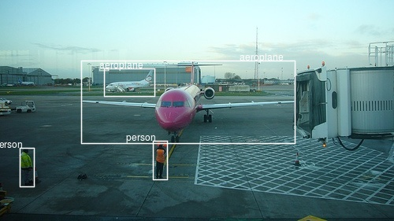

```{r setup, include=FALSE}
knitr::opts_chunk$set(echo = TRUE, eval = FALSE)
```

```{r, echo=FALSE}
library(tensorflow)
library(keras)
library(rjson)
library(magick)
library(purrr)
library(tibble)
library(tidyr)
library(dplyr)
library(ggplot2)
library(stringr)

use_session_with_seed(7777, disable_gpu = FALSE, disable_parallel_cpu = FALSE)
```

A few weeks ago, we provided an introduction to the task of [naming and locating objects in images](https://blogs.rstudio.com/tensorflow/posts/2018-11-05-naming-locating-objects/).
Crucially, we confined ourselves to detecting a single object in an image. Reading that article, you might have thought "can't we just extend this approach to several objects"? The short answer is, not in a straightforward way. We'll see a longer answer shortly.

In this post, we want to detail one viable approach, explaining (and coding) the steps involved. We won't, however, end up with a production-ready model. So if you read on, you won't have a model you can export and put on your smartphone, for use in the wild. You should, however, have learned a bit about how this - object detection - is even possible. After all, it might look like magic!

The code below is heavily based on [fast.ai's implementation of SSD](https://github.com/fastai/fastai/blob/master/courses/dl2/pascal-multi.ipynb). While this is not the first time we're "porting" _fast.ai models, in this case we found differences in execution models between PyTorch and TensorFlow to be especially striking, and we will briefly touch on this in our discussion. 


## So why is object detection hard?

So like we saw, we can classify and detect a single object as follows. We make use of a powerful feature extractor, such as _Resnet 50_, add a few conv layers for specialization, and then, concatenate two outputs: One that indicates the class, and one that has four coordinates specifying a bounding box.

Now, to detect several objects, can't we just have several class outputs, and several bounding boxes?
Unfortunately we can't. Assume there are two cute cats in the image, and we have just two bounding box detectors.
How does each of them know which object to detect? What happens in practice is that both of them try to designate both cats, so we end up with two bounding boxes in the middle - where there's no cat. It's a bit like averaging a bimodal distribution.

What can be done? Overall, there are three approaches to object detection, differing in performance in both common senses of the word: execution time and precision. 

Probably the first option you'd think of (if you haven't been exposed to the topic before) is running the algorithm over the image piece by piece. This is called the _sliding windows_ approach, and even though in a naive implementation, it would require excessive time, it can be run effectively if making use of fully convolutional models (cf. _Overfeat_ [@SermanetEZMFL13]).

Currently the best precision is gained from _region proposal_ approaches (R-CNN[@GirshickDDM13], Fast R-CNN[@Girshick15], Faster R-CNN[@RenHG015]). These operate in two steps. A first step points out _regions of interest_ in an image. Then, a convnet classfies and localizes the objects in each region.
In the first step, originally non-deep-learning algorithms were used. With Faster R-CNN though, a convnet takes care of region proposal as well, such that the method now is "fully deep learning".

Last but not least, there is the class of _single shot detectors_, like YOLO[@RedmonDGF15][@RedmonF16][@abs-1804-02767]and SSD[@LiuAESR15]. Just as _Overfeat_, these perform a single pass only, but they add an additional feature that boosts precision: _anchor boxes_.


![Use of anchor boxes in SSD. Figure from [@LiuAESR15]](images/anchors.png){.external width=100%}

Anchor boxes are prototypical object shapes, arranged systematically over the image. In the simplest case, these can just be rectangles (squares) spread out systematically in a grid. A simple grid already solves the basic problem we started with, above: How does each detector know which object to detect? In a single-shot approach like SSD, each detector is mapped to - _responsible for_ - a specific anchor box. We'll see how this works below.

What if we have several objects in a grid cell? We can assign more than one anchor box to each cell. Anchor boxes are created with different aspect ratios, to provide a good match to entities of different proportions, such as people or trees on the one hand, and bicycles or balconies on the other. You can see these different anchor boxes in the above figure, in illustrations _b_ and _c_.

Now, what if an object spans several grid cells, or even the whole image? It won't have sufficient overlap with any of the boxes to allow for successful detection. For that reason, SSD puts detectors at several stages in the model - a set of detectors after each successive step of downscaling. We see 8x8 and 4x4 grids in the figure above.

In this post, we show how to code a _very basic_ single-shot approach, inspired by SSD but not going to full lengths. We'll have a basic 16x16 grid of uniform anchors, all applied at the same resolution. In the end, we indicate how to extend this to different aspect ratios and resolutions, focusing on the model architecture.

## A basic single-shot detector


We're using the same dataset as in [Naming and locating objects in images](https://blogs.rstudio.com/tensorflow/posts/2018-11-05-naming-locating-objects/) - Pascal VOC, the 2007 edition - and we start out with the same preprocessing steps, up and until we have an object `imageinfo` that contains, in every row, information about a single object in an image.[^We won't need `imageinfo_maxbb` in this post.]

### Further preprocessing 

To be able to detect multiple objects, we need to aggregate all information on a single image into a single row.


```{r}
imageinfo4ssd <- imageinfo %>%
  select(category_id,
         file_name,
         name,
         x_left,
         y_top,
         x_right,
         y_bottom,
         ends_with("scaled"))

imageinfo4ssd <- imageinfo4ssd %>%
  group_by(file_name) %>%
  summarise(
    categories = toString(category_id),
    name = toString(name),
    xl = toString(x_left_scaled),
    yt = toString(y_top_scaled),
    xr = toString(x_right_scaled),
    yb = toString(y_bottom_scaled),
    xl_orig = toString(x_left),
    yt_orig = toString(y_top),
    xr_orig = toString(x_right),
    yb_orig = toString(y_bottom),
    cnt = n()
  )
```

Okay! Let's check we got this right.

```{r}
example <- imageinfo4ssd[5, ]
img <- image_read(file.path(img_dir, example$file_name))
name <- (example$name %>% str_split(pattern = ", "))[[1]]
x_left <- (example$xl_orig %>% str_split(pattern = ", "))[[1]]
x_right <- (example$xr_orig %>% str_split(pattern = ", "))[[1]]
y_top <- (example$yt_orig %>% str_split(pattern = ", "))[[1]]
y_bottom <- (example$yb_orig %>% str_split(pattern = ", "))[[1]]

img <- image_draw(img)
for (i in 1:example$cnt) {
  rect(x_left[i],
       y_bottom[i],
       x_right[i],
       y_top[i],
       border = "white",
       lwd = 2)
  text(
    x = as.integer(x_right[i]),
    y = as.integer(y_top[i]),
    labels = name[i],
    offset = 1,
    pos = 2,
    cex = 1,
    col = "white"
  )
}
dev.off()
print(img)

```




Now we construct the anchor boxes. 

### Anchors

Like we said above, here we will have one anchor box per cell. Thus, grid cells and anchor boxes, in our case, are the same thing, and we'll call them by both names, interchangingly, depending on the context.
Just keep in mind that in more complex models, these will most probably be different entities.

Our grid will be of size 4x4. We will need the cells' coordinates, and we'll start with a `center x` - `center y` - `height` - `width` representation.

Here, first, are the center coordinates.

```{r}
cells_per_row <- 4
gridsize <- 1/cells_per_row
anchor_offset <- 1 / (cells_per_row * 2) 

anchor_xs <- seq(anchor_offset, 1 - anchor_offset, length.out = 4) %>%
  rep(each = cells_per_row)
anchor_ys <- seq(anchor_offset, 1 - anchor_offset, length.out = 4) %>%
  rep(cells_per_row)
```

We can plot them.

```{r}
ggplot(data.frame(x = anchor_xs, y = anchor_ys), aes(x, y)) +
  geom_point() +
  coord_cartesian(xlim = c(0,1), ylim = c(0,1)) +
  theme(aspect.ratio = 1)
```


The center coordinates are supplemented by height and width:

```{r}
anchor_centers <- cbind(anchor_xs, anchor_ys)
anchor_height_width <- matrix(1 / cells_per_row, nrow = 16, ncol = 2)
```

Combining centers, heights and widths gives us the first representation.

```{r}
anchors <- cbind(anchor_centers, anchor_height_width)
anchors
```

```
       [,1]  [,2] [,3] [,4]
 [1,] 0.125 0.125 0.25 0.25
 [2,] 0.125 0.375 0.25 0.25
 [3,] 0.125 0.625 0.25 0.25
 [4,] 0.125 0.875 0.25 0.25
 [5,] 0.375 0.125 0.25 0.25
 [6,] 0.375 0.375 0.25 0.25
 [7,] 0.375 0.625 0.25 0.25
 [8,] 0.375 0.875 0.25 0.25
 [9,] 0.625 0.125 0.25 0.25
[10,] 0.625 0.375 0.25 0.25
[11,] 0.625 0.625 0.25 0.25
[12,] 0.625 0.875 0.25 0.25
[13,] 0.875 0.125 0.25 0.25
[14,] 0.875 0.375 0.25 0.25
[15,] 0.875 0.625 0.25 0.25
[16,] 0.875 0.875 0.25 0.25
```


In subsequent manipulations, we will sometimes we need a different representation: the corners (top-left, top-right, bottom-right, bottom-left) of the grid cells.


```{r}
hw2corners <- function(centers, height_width) {
  cbind(centers - height_width / 2, centers + height_width / 2) %>% unname()
}

# cells are indicated by (xl, yt, xr, yb)
# successive rows first go down in the image, then to the right
anchor_corners <- hw2corners(anchor_centers, anchor_height_width)
anchor_corners
```

```
      [,1] [,2] [,3] [,4]
 [1,] 0.00 0.00 0.25 0.25
 [2,] 0.00 0.25 0.25 0.50
 [3,] 0.00 0.50 0.25 0.75
 [4,] 0.00 0.75 0.25 1.00
 [5,] 0.25 0.00 0.50 0.25
 [6,] 0.25 0.25 0.50 0.50
 [7,] 0.25 0.50 0.50 0.75
 [8,] 0.25 0.75 0.50 1.00
 [9,] 0.50 0.00 0.75 0.25
[10,] 0.50 0.25 0.75 0.50
[11,] 0.50 0.50 0.75 0.75
[12,] 0.50 0.75 0.75 1.00
[13,] 0.75 0.00 1.00 0.25
[14,] 0.75 0.25 1.00 0.50
[15,] 0.75 0.50 1.00 0.75
[16,] 0.75 0.75 1.00 1.00
```

Let's take our sample image again and plot it, this time including the grid cells.
Note that we display the scaled image now - the way the network is going to see it.

```{r}
example <- imageinfo4ssd[5, ]
name <- (example$name %>% str_split(pattern = ", "))[[1]]
x_left <- (example$xl %>% str_split(pattern = ", "))[[1]]
x_right <- (example$xr %>% str_split(pattern = ", "))[[1]]
y_top <- (example$yt %>% str_split(pattern = ", "))[[1]]
y_bottom <- (example$yb %>% str_split(pattern = ", "))[[1]]


img <- image_read(file.path(img_dir, example$file_name))
img <- image_resize(img, geometry = "224x224!")
img <- image_draw(img)

for (i in 1:example$cnt) {
  rect(x_left[i],
       y_bottom[i],
       x_right[i],
       y_top[i],
       border = "white",
       lwd = 2)
  text(
    x = as.integer(x_right[i]),
    y = as.integer(y_top[i]),
    labels = name[i],
    offset = 0,
    pos = 2,
    cex = 1,
    col = "white"
  )
}
for (i in 1:nrow(anchor_corners)) {
  rect(
    anchor_corners[i, 1] * 224,
    anchor_corners[i, 4] * 224,
    anchor_corners[i, 3] * 224,
    anchor_corners[i, 2] * 224,
    border = "cyan",
    lwd = 1,
    lty = 3
  )
}

dev.off()
print(img)
```


Now it's time to address the possibly greatest mystery when you're new to object detection: How do you actually construct the ground truth input to the network?

That is the so-called "matching problem".

### Matching problem

To train the network, we need to assign the ground truth boxes to the grid cells/anchor boxes. We do this based on overlap between _bounding boxes_ on the one hand, and _anchor boxes_ on the other. 
Overlap is computed using Intersection over Union (IoU, = Jaccard Index), as usual.

Assume we've already computed the Jaccard index for all ground truth box - grid cell combinations. We then use the following algorithm:

1. For each ground truth object, find the grid cell it maximally overlaps with.

2. For each grid cell, find the object it overlaps with most.

3. In both cases, identify the _entity_ of greatest overlap as well as the _amount_ of overlap.

4. When criterium (1) applies, it overrides criterium (2).

4. When criterium (1) applies, set the amount overlap to a constant, high value: 1.99.

5. Return the combined result, that is, for each grid cell, the object and amount of best (as per the above criteria) overlap.

Here's the implementation.

```{r}
# overlaps shape is: number of ground truth objects * number of grid cells
map_to_ground_truth <- function(overlaps) {
  
  # for each ground truth object, find maximally overlapping cell (crit. 1)
  # measure of overlap, shape: number of ground truth objects
  prior_overlap <- apply(overlaps, 1, max)
  # which cell is this, for each object
  prior_idx <- apply(overlaps, 1, which.max)
  
  # for each grid cell, what object does it overlap with most (crit. 2)
  # measure of overlap, shape: number of grid cells
  gt_overlap <-  apply(overlaps, 2, max)
  # which object is this, for each cell
  gt_idx <- apply(overlaps, 2, which.max)
  
  # set all definitely overlapping cells to respective object (crit. 1)
  gt_overlap[prior_idx] <- 1.99
  
  # now still set all others to best match by crit. 2
  # actually it's other way round, we start from (2) and overwrite with (1)
  for (i in 1:length(prior_idx)) {
    # iterate over all cells "absolutely assigned"
    p <- prior_idx[i] # get respective grid cell
    gt_idx[p] <- i # assign this cell the object number
  }
  
  # return: for each grid cell, object it overlaps with most + measure of overlap
  list(gt_overlap, gt_idx)
  
}
```

Now here's the IoU calculation we need for that. We can't just use the `IoU` function from the previous post because this time, we want to compute overlaps with all grid cells simultaneously.
It's easiest to do this using tensors, so we temporarily convert the R matrices to tensors:

```{r}
# compute IOU
jaccard <- function(bbox, anchor_corners) {
  bbox <- k_constant(bbox)
  anchor_corners <- k_constant(anchor_corners)
  intersection <- intersect(bbox, anchor_corners)
  union <-
    k_expand_dims(box_area(bbox), axis = 2)  + k_expand_dims(box_area(anchor_corners), axis = 1) - intersection
    res <- intersection / union
  res %>% k_eval()
}

# compute intersection for IOU
intersect <- function(box1, box2) {
  box1_a <- box1[, 3:4] %>% k_expand_dims(axis = 2)
  box2_a <- box2[, 3:4] %>% k_expand_dims(axis = 1)
  max_xy <- k_minimum(box1_a, box2_a)
  
  box1_b <- box1[, 1:2] %>% k_expand_dims(axis = 2)
  box2_b <- box2[, 1:2] %>% k_expand_dims(axis = 1)
  min_xy <- k_maximum(box1_b, box2_b)
  
  intersection <- k_clip(max_xy - min_xy, min = 0, max = Inf)
  intersection[, , 1] * intersection[, , 2]
  
}

box_area <- function(box) {
  (box[, 3] - box[, 1]) * (box[, 4] - box[, 2]) 
}

```


By now you might be wondering - when does all this happen? Interestingly, the example we're following, [fast.ai's object detection notebook](https://github.com/fastai/fastai/blob/master/courses/dl2/pascal-multi.ipynb), does all this as part of the loss calculation! 
In TensorFlow, this is possible in principle (requiring some juggling of `tf$cond`, `tf$while_loop` etc., as well as a bit of creativity finding replacements for non-differentiable operations). But, simple facts - like the Keras loss function expecting the same shapes for `y_true` and `y_pred` - made it impossible to follow the _fast.ai_ approach. Instead, all matching will take place in the data generator.


### Data generator

The generator has the familiar structure, known from the aforementioned previous post.
Here's the complete code first,- we'll talk through the details later.

```{r}
batch_size <- 16
image_size <- target_width # same as height

threshold <- 0.4

class_background <- 21

ssd_generator <-
  function(data,
           target_height,
           target_width,
           shuffle,
           batch_size) {
    i <- 1
    function() {
      if (shuffle) {
        indices <- sample(1:nrow(data), size = batch_size)
      } else {
        if (i + batch_size >= nrow(data))
          i <<- 1
        indices <- c(i:min(i + batch_size - 1, nrow(data)))
        i <<- i + length(indices)
      }
      
      x <-
        array(0, dim = c(length(indices), target_height, target_width, 3))
      y1 <- array(0, dim = c(length(indices), 16))
      y2 <- array(0, dim = c(length(indices), 16, 4))
      
      for (j in 1:length(indices)) {
        x[j, , , ] <-
          load_and_preprocess_image(data[[indices[j], "file_name"]], target_height, target_width)
        
        class_string <- data[indices[j], ]$categories
        xl_string <- data[indices[j], ]$xl
        yt_string <- data[indices[j], ]$yt
        xr_string <- data[indices[j], ]$xr
        yb_string <- data[indices[j], ]$yb
        
        classes <-  str_split(class_string, pattern = ", ")[[1]]
        xl <-
          str_split(xl_string, pattern = ", ")[[1]] %>% as.double() %>% `/`(image_size)
        yt <-
          str_split(yt_string, pattern = ", ")[[1]] %>% as.double() %>% `/`(image_size)
        xr <-
          str_split(xr_string, pattern = ", ")[[1]] %>% as.double() %>% `/`(image_size)
        yb <-
          str_split(yb_string, pattern = ", ")[[1]] %>% as.double() %>% `/`(image_size)
    
        # rows are objects, columns are coordinates (xl, yt, xr, yb)
        # anchor_corners are 16 rows with corresponding coordinates
        bbox <- cbind(xl, yt, xr, yb)
        overlaps <- jaccard(bbox, anchor_corners)
        
        c(gt_overlap, gt_idx) %<-% map_to_ground_truth(overlaps)
        gt_class <- classes[gt_idx]
        
        pos <- gt_overlap > threshold
        gt_class[gt_overlap < threshold] <- 21
                
        # columns correspond to objects
        boxes <- rbind(xl, yt, xr, yb)
        # columns correspond to object boxes according to gt_idx
        gt_bbox <- boxes[, gt_idx]
        # set those with non-sufficient overlap to 0
        gt_bbox[, !pos] <- 0
        gt_bbox <- gt_bbox %>% t()
        
        y1[j, ] <- as.integer(gt_class) - 1
        y2[j, , ] <- gt_bbox
        
      }

      x <- x %>% imagenet_preprocess_input()
      y1 <- y1 %>% to_categorical(num_classes = class_background)
      list(x, list(y1, y2))
    }
  }

```

Before the generator can trigger any calculations, it needs to first split apart the multiple classes and bounding box coordinates that come in one row of the dataset. 

To make this more concrete, we show what happens for the "2 people and 2 airplanes" image we just displayed.

We copy out code chunk-by-chunk from the generator so results can actually be displayed for inspection.

```{r}
data <- imageinfo4ssd
indices <- 1:8

j <- 5 # this is our image

class_string <- data[indices[j], ]$categories
xl_string <- data[indices[j], ]$xl
yt_string <- data[indices[j], ]$yt
xr_string <- data[indices[j], ]$xr
yb_string <- data[indices[j], ]$yb
        
classes <-  str_split(class_string, pattern = ", ")[[1]]
xl <- str_split(xl_string, pattern = ", ")[[1]] %>% as.double() %>% `/`(image_size)
yt <- str_split(yt_string, pattern = ", ")[[1]] %>% as.double() %>% `/`(image_size)
xr <- str_split(xr_string, pattern = ", ")[[1]] %>% as.double() %>% `/`(image_size)
yb <- str_split(yb_string, pattern = ", ")[[1]] %>% as.double() %>% `/`(image_size)
```

So here are that image's `classes`:

```{r}
classes
```

```
[1] "1"  "1"  "15" "15"
```

And its left bounding box coordinates:

```{r}
xl
```

```
[1] 0.20535714 0.26339286 0.38839286 0.04910714
```

Now we can `cbind` those vectors together to obtain a object (`bbox`) where rows are objects, and coordinates are in the columns: 

```{r}
# rows are objects, columns are coordinates (xl, yt, xr, yb)
bbox <- cbind(xl, yt, xr, yb)
bbox
```

```             xl        yt         xr        yb
[1,] 0.20535714 0.2723214 0.75000000 0.6473214
[2,] 0.26339286 0.3080357 0.39285714 0.4330357
[3,] 0.38839286 0.6383929 0.42410714 0.8125000
[4,] 0.04910714 0.6696429 0.08482143 0.8437500
```

So we're ready to compute these boxes' overlap with all of the 16 grid cells. Recall that `anchor_corners` stores the grid cells in an analogous way, the cells being in the rows and the coordinates in the columns.

```{r}
# anchor_corners are 16 rows with corresponding coordinates
overlaps <- jaccard(bbox, anchor_corners)
```


Now that we have the overlaps, we can call the matching logic:

```{r}
c(gt_overlap, gt_idx) %<-% map_to_ground_truth(overlaps)
gt_overlap
```

```
 [1] 0.00000000 0.03961473 0.04358353 1.99000000 0.00000000 1.99000000 1.99000000 0.03357313 0.00000000
[10] 0.27127662 0.16019417 0.00000000 0.00000000 0.00000000 0.00000000 0.00000000
```

Looking for the value `1.99` in the above - the value indicating maximal, by the above criteria, overlap of an object with a grid cell - we see that box 4 (counting in column-major order here like R does) got matched (to a person, as we'll see soon), box 6 did (to an airplane), and box 7 did (to a person). How about the other airplane? It got lost in the matching.

This is not a problem of the matching algorithm though - it would disappear if we had more than one anchor box per grid cell.

Looking for the objects just mentioned in the class index, `gt_idx`, we see that indeed box 4 got matched to object 4 (a person), box 6 got matched to object 2 (an airplane), and box 7 got matched to object 3 (the other person):

```{r}
gt_idx
```

```
[1] 1 1 4 4 1 2 3 3 1 1 1 1 1 1 1 1
```

By the way, don't worry about the abundance of `1`s here. These are remnants from using `which.max` to determine maximal overlap, and will disappear soon.

Instead of thinking in object numbers, we should think in object classes (the respective numerical codes, that is).

```{r}
gt_class <- classes[gt_idx]
gt_class
```

```
 [1] "1"  "1"  "15" "15" "1"  "1"  "15" "15" "1"  "1"  "1"  "1"  "1"  "1"  "1"  "1"
```

So far, we take into account even the very slightest overlap - of 0.1 percent, say.
Of course, this makes no sense. We set all cells with an overlap < 0.4 to the background class:

```{r}
pos <- gt_overlap > threshold
gt_class[gt_overlap < threshold] <- 21

gt_class
```

```
[1] "21" "21" "21" "15" "21" "1"  "15" "21" "21" "21" "21" "21" "21" "21" "21" "21"
```

Now, to construct the targets for learning, we need to put the mapping we found into a data structure.

The following gives us a 16x4 matrix of cells and the boxes they are responsible for:

```{r}
orig_boxes <- rbind(xl, yt, xr, yb)
# columns correspond to object boxes according to gt_idx
gt_bbox <- orig_boxes[, gt_idx]
# set those with non-sufficient overlap to 0
gt_bbox[, !pos] <- 0
gt_bbox <- gt_bbox %>% t()

gt_bbox
```

```
              xl        yt         xr        yb
 [1,] 0.00000000 0.0000000 0.00000000 0.0000000
 [2,] 0.00000000 0.0000000 0.00000000 0.0000000
 [3,] 0.00000000 0.0000000 0.00000000 0.0000000
 [4,] 0.04910714 0.6696429 0.08482143 0.8437500
 [5,] 0.00000000 0.0000000 0.00000000 0.0000000
 [6,] 0.26339286 0.3080357 0.39285714 0.4330357
 [7,] 0.38839286 0.6383929 0.42410714 0.8125000
 [8,] 0.00000000 0.0000000 0.00000000 0.0000000
 [9,] 0.00000000 0.0000000 0.00000000 0.0000000
[10,] 0.00000000 0.0000000 0.00000000 0.0000000
[11,] 0.00000000 0.0000000 0.00000000 0.0000000
[12,] 0.00000000 0.0000000 0.00000000 0.0000000
[13,] 0.00000000 0.0000000 0.00000000 0.0000000
[14,] 0.00000000 0.0000000 0.00000000 0.0000000
[15,] 0.00000000 0.0000000 0.00000000 0.0000000
[16,] 0.00000000 0.0000000 0.00000000 0.0000000
```

Together, `gt_bbox` and `gt_class` make up the network's learning targets.


```{r, eval=FALSE}
y1[j, ] <- as.integer(gt_class) - 1
y2[j, , ] <- gt_bbox
```

To summarize, our target is a list of two outputs:

- the bounding box ground truth of dimensionaility _number of grid cells_ times _number of box coordinates (4)_, and 
- the class ground truth of size _number of grid cells_ times _number of classes_.

We can verify this by asking the generator for a batch of inputs and targets:

```{r}
train_gen <- ssd_generator(
  imageinfo4ssd,
  target_height = target_height,
  target_width = target_width,
  shuffle = TRUE,
  batch_size = batch_size
)

batch <- train_gen()
c(x, c(y1, y2)) %<-% batch
dim(y1)
```

```
[1] 16 16 21
```

```{r}
dim(y2)
```

```
[1] 16 16  4
```

Finally, we're ready for the model.

### The model

We start from Resnet 50 as a feature extractor. This gives us tensors of size 7x7x2048.

```{r}
feature_extractor <- application_resnet50(
  include_top = FALSE,
  input_shape = c(224, 224, 3)
)
```

Then, we append a few conv layers. Three of those layers are "just" there for capacity; the last one though has a additional task: By virtue of `strides = 2`, it downsamples its input to from 7x7 to 4x4 in the height/width dimensions.

This resolution of 4x4 gives us exactly the grid we need!


```{r}
input <- feature_extractor$input

common <- feature_extractor$output %>%
  layer_conv_2d(
    filters = 256,
    kernel_size = 3,
    padding = "same",
    activation = "relu",
    name = "head_conv1_1"
  ) %>%
  layer_batch_normalization() %>%
  layer_conv_2d(
    filters = 256,
    kernel_size = 3,
    padding = "same",
    activation = "relu",
    name = "head_conv1_2"
  ) %>%
  layer_batch_normalization() %>%
  layer_conv_2d(
    filters = 256,
    kernel_size = 3,
    padding = "same",
    activation = "relu",
    name = "head_conv1_3"
  ) %>%
  layer_batch_normalization() %>%
  layer_conv_2d(
    filters = 256,
    kernel_size = 3,
    strides = 2,
    padding = "same",
    activation = "relu",
    name = "head_conv2"
  ) %>%
  layer_batch_normalization() 
```


Now we can do as we did in that other post, attach one output for the bounding boxes and one for the classes.

Note how we don't aggregate over the spatial grid though. Instead, we reshape it so the 4x4 grid cells appear sequentially. 

Here first is the class output. We have 21 classes (the 20 classes from PASCAL, plus background), and we need to classify each cell. We thus end up with an output of size 16x21.

```{r}
class_output <-
  layer_conv_2d(
    common,
    filters = 21,
    kernel_size = 3,
    padding = "same",
    name = "class_conv"
  ) %>%
  layer_reshape(target_shape = c(16, 21), name = "class_output")
```

For the bounding box output, we apply a `tanh` activation so that values lie between -1 and 1. This is because they are used to compute offsets to the grid cell centers.

These computations happen in the `layer_lambda`. We start from the actual anchor box centers, and move them around by a scaled-down version of the activations.
We then convert these to anchor corners - same as we did above with the ground truth anchors, just operating on tensors, this time.


```{r}
bbox_output <-
  layer_conv_2d(
    common,
    filters = 4,
    kernel_size = 3,
    padding = "same",
    name = "bbox_conv"
  ) %>%
  layer_reshape(target_shape = c(16, 4), name = "bbox_flatten") %>%
  layer_activation("tanh") %>%
  layer_lambda(
    f = function(x) {
      activation_centers <-
        (x[, , 1:2] / 2 * gridsize) + k_constant(anchors[, 1:2])
      activation_height_width <-
        (x[, , 3:4] / 2 + 1) * k_constant(anchors[, 3:4])
      activation_corners <-
        k_concatenate(
          list(
            activation_centers - activation_height_width / 2,
            activation_centers + activation_height_width / 2
          )
        )
     activation_corners
    },
    name = "bbox_output"
  )
```


Now that we have all layers, let's quickly finish up the model definition:


```{r}
model <- keras_model(
  inputs = input,
  outputs = list(class_output, bbox_output)
)
```

The last ingredient missing, then, is the loss function.

### Loss 

To the model's two outputs - a classification output and a regression output - correspond two losses, just as in the basic classification + localization model. Only this time, we have 16 grid cells to take care of.

Class loss uses `tf$nn$sigmoid_cross_entropy_with_logits` to compute the binary crossentropy between targets and unnormalized network activation, summing over grid cells and dividing by the number of classes.

```{r}
# shapes are batch_size * 16 * 21
class_loss <- function(y_true, y_pred) {

  class_loss  <-
    tf$nn$sigmoid_cross_entropy_with_logits(labels = y_true, logits = y_pred)

  class_loss <-
    tf$reduce_sum(class_loss) / tf$cast(n_classes + 1, "float32")
  
  class_loss
}

```

Localization loss is calculated for all boxes where in fact there _is_ an object present in the ground truth. All other activations get masked out.

The loss itself then is just mean absolute error, scaled by a multiplier designed to bring both loss components to similar magnitudes. In practice, it makes sense to experiment a bit here.

```{r}
# shapes are batch_size * 16 * 4
bbox_loss <- function(y_true, y_pred) {

  # calculate localization loss for all boxes where ground truth was assigned some overlap
  # calculate mask
  pos <- y_true[, , 1] + y_true[, , 3] > 0
  pos <-
    pos %>% k_cast(tf$float32) %>% k_reshape(shape = c(batch_size, 16, 1))
  pos <-
    tf$tile(pos, multiples = k_constant(c(1L, 1L, 4L), dtype = tf$int32))
    
  diff <- y_pred - y_true
  # mask out irrelevant activations
  diff <- diff %>% tf$multiply(pos)
  
  loc_loss <- diff %>% tf$abs() %>% tf$reduce_mean()
  loc_loss * 100
}

```

