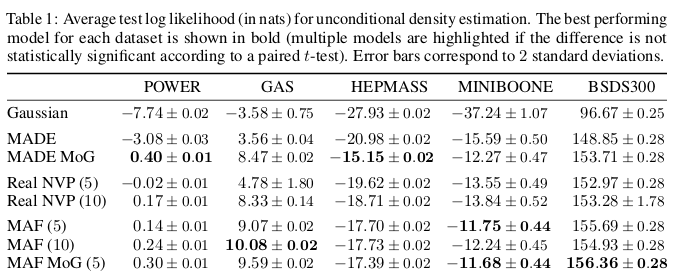

```{r setup, include=FALSE}
knitr::opts_chunk$set(echo = TRUE, eval = FALSE)
```

In the [first part of this mini-series on autoregressive flow models](https://blogs.rstudio.com/tensorflow/posts/2019-04-05-bijectors-flows/), we looked at _bijectors_ in TensorFlow Probability (TFP), and saw how to use them for sampling and density estimation. We singled out the _affine bijector_ to demonstrate the mechanics of flow construction: We start from a distribution that is easy to sample from, and that allows for straightforward calculation of its density. Then, we attach some number of invertible transformations, optimizing for data-likelihood under the final transformed distribution. The efficiency of that (log)likelihood calculation is where normalizing flows excel: Loglikelihood under the (unknown) target distribution is obtained as a sum of the density under the base distribution of the inverse-transformed data plus the absolute log determinant of the inverse Jacobian.

Now, an affine flow will seldom be powerful enough to model nonlinear, complex transformations. In constrast, autoregressive models have shown substantive success in density estimation as well as sample generation. Combined with more involved architectures, feature engineering, and extensive compute, the concept of autoregressivity has powered -- and is powering -- state-of-the-art architectures in areas such as image, speech and video modeling. 

This post will be concerned with the building blocks of autoregressive flows in TFP. While we won't exactly be building state-of-the-art models, we'll try to understand and play with some major ingredients, hopefully enabling the reader to do her own experiments on her own data.

This post has three parts: First, we'll look at autoregressivity and its implementation in TFP. Then, we try to (approximately) reproduce one of the experiments in the "MAF paper" (_Masked Autoregressive Flows for Distribution Estimation_ [@2017arXiv170507057P]) -- essentially a proof of concept. Finally, for the third time on this blog, we come back to the task of analysing audio data, with mixed results.

## Autoregressivity and masking

In distribution estimation, autoregressivity enters the scene via the chain rule of probability that decomposes a joint density into a product of conditional densities:

$$
p(\mathbf{x}) = \prod_{i}p(\mathbf{x}_i|\mathbf{x}_{1:i−1})
$$

In practice, this means that autoregressive models have to impose an order on the variables - an order which might or might not "make sense". Approaches here include choosing orderings at random and/or using different orderings for each layer.
While in recurrent neural networks, autoregressivity is conserved due to the recurrence relation inherent in state updating, it is not clear a priori how autoregressivity is to be achieved in a densely connected architecture. A computationally efficient solution was proposed in _MADE: Masked Autoencoder for Distribution Estimation_[@GermainGML15]: Starting from a densely connected layer, mask out all connections that should not be allowed, i.e., all connections from input feature $i$ to said layer's activations $1 ... i-1$. Or expressed differently, activation $i$ may be connected to input features $1 ... i-1$ only. Then when adding more layers, care must be taken to ensure that all required connections are masked so that at the end, output $i$ will only ever have seen inputs $1 ... i-1$.

Thus masked autoregressive flows are a fusion of two major approaches - autoregressive models (which need not be flows) and flows (which need not be autoregressive). In TFP these are provided by `MaskedAutoregressiveFlow` ^[`tfb_masked_autoregressive_flow`, in R], to be used as a bijector in a `TransformedDistribution`. ^[For a comparison of _Masked Autoregressive Flow_ to its siblings _Real NVP_ (also available as a TFP bijector) and _Inverse Autogressive Flow_ (to be obtained as an inverse of MAF in TFP), see Eric Jang's excellent [tutorial](https://blog.evjang.com/2018/01/nf2.html).]

While the documentation shows how to use this bijector, the step from theoretical understanding to coding a "black box" may seem wide. If you're anything like the author, here you might feel the urge to "look under the hood" and verify that things really are the way you're assuming. So let's give in to curiosity and allow ourselves a little escapade into the source code.

Peeking ahead, this is how we'll construct a masked autoregressive flow in TFP (again using the still new-ish R bindings provided by [tfprobability](http://github.io/tfprobability)):

```{r}
library(tfprobability)

maf <- tfb_masked_autoregressive_flow(
    shift_and_log_scale_fn = tfb_masked_autoregressive_default_template(
      hidden_layers = list(num_hidden, num_hidden),
      activation = tf$nn$tanh)
)
```


Pulling apart the relevant entities here, `tfb_masked_autoregressive_flow` is a bijector, with the usual methods `tfb_forward()`, `tfb_inverse()`, `tfb_forward_log_det_jacobian()` and `tfb_inverse_log_det_jacobian()`.
The default `shift_and_log_scale_fn`, `tfb_masked_autoregressive_default_template`, constructs a little neural network of its own, with a configurable number of hidden units per layer, a configurable activation function and optionally, other configurable parameters to be passed to the underlying `dense` layers. It's these dense layers that have to respect the autoregressive property. Can we take a look at how this is done? Yes we can, provided we're not afraid of a little Python.

`masked_autoregressive_default_template` (now leaving out the `tfb_` as we've entered Python-land) uses `masked_dense` to do what you'd suppose a thus-named function might be doing: construct a dense layer that has part of the weight matrix masked out. How? We'll see after a few Python setup statements.

```{python}
import numpy as np
import tensorflow as tf
import tensorflow_probability as tfp
tfd = tfp.distributions
tfb = tfp.bijectors
tf.enable_eager_execution()
```


The following code snippets are taken from `masked_dense` (in its [current form on master](https://github.com/tensorflow/probability/blob/master/tensorflow_probability/python/bijectors/masked_autoregressive.py)), and when possible, simplified for better readability, accommodating just the specifics of the chosen example - a toy matrix of shape 2x3:

```{python}
# construct some toy input data (this line obviously not from the original code)
inputs = tf.constant(np.arange(1.,7), shape = (2, 3))

# (partly) determine shape of mask from shape of input
input_depth = tf.compat.dimension_value(inputs.shape.with_rank_at_least(1)[-1])
num_blocks = input_depth
num_blocks # 3
```

Our toy layer should have 4 units:

```{python}
units = 4
```

The mask is initialized to all zeros. Considering it will be used to elementwise multiply the weight matrix, we're a bit surprised at its shape (shouldn't it be the other way round?). No worries; all will turn out correct in the end. 

```{python}
mask = np.zeros([units, input_depth], dtype=tf.float32.as_numpy_dtype())
mask
```

```
array([[0., 0., 0.],
       [0., 0., 0.],
       [0., 0., 0.],
       [0., 0., 0.]], dtype=float32)
```
       
Now to "whitelist" the allowed connections, we have to fill in ones whenever information flow _is_ allowed by the autoregressive property:

```{python}
def _gen_slices(num_blocks, n_in, n_out):
  slices = []
  col = 0
  d_in = n_in // num_blocks
  d_out = n_out // num_blocks
  row = d_out 
  for _ in range(num_blocks):
    row_slice = slice(row, None)
    col_slice = slice(col, col + d_in)
    slices.append([row_slice, col_slice])
    col += d_in
    row += d_out
  return slices

slices = _gen_slices(num_blocks, input_depth, units)
for [row_slice, col_slice] in slices:
  mask[row_slice, col_slice] = 1

mask
```

```
array([[0., 0., 0.],
       [1., 0., 0.],
       [1., 1., 0.],
       [1., 1., 1.]], dtype=float32)
```

Again, does this look mirror-inverted? A transpose fixes shape and logic both:

```{python}
mask = mask.t
mask
```

```
array([[0., 1., 1., 1.],
       [0., 0., 1., 1.],
       [0., 0., 0., 1.]], dtype=float32)
```

Now that we have the mask, we can create the layer (interestingly, as of this writing not (yet?) a `tf.keras` layer):

```{python}
layer = tf.compat.v1.layers.Dense(
        units,
        kernel_initializer=masked_initializer, # 1
        kernel_constraint=lambda x: mask * x   # 2
        )

```

Here we see masking going on in two ways. For one, the weight initializer is masked:

```{python}
kernel_initializer = tf.compat.v1.glorot_normal_initializer()

def masked_initializer(shape, dtype=None, partition_info=None):
 return mask * kernel_initializer(shape, dtype, partition_info)
```

And secondly, a kernel constraint makes sure that after optimization, the relative units are zeroed out again:

```{python}
kernel_constraint=lambda x: mask * x 
```

Just for fun, let's apply the layer to our toy input:

```{python}
layer.apply(inputs)
```

```
<tf.Tensor: id=30, shape=(2, 4), dtype=float64, numpy=
array([[ 0.        , -0.7489589 , -0.43329933,  1.42710014],
       [ 0.        , -2.9958356 , -1.71647246,  1.09258015]])>
```

Zeroes where expected. And double-checking on the weight matrix...

```{python}
layer.kernel
```

```
<tf.Variable 'dense/kernel:0' shape=(3, 4) dtype=float64, numpy=
array([[ 0.        , -0.7489589 , -0.42214942, -0.6473454 ],
       [-0.        ,  0.        , -0.00557496, -0.46692933],
       [-0.        , -0.        , -0.        ,  1.00276807]])>
```

Good. Now hopefully after this little deep dive, things have become a bit more concrete. Of course in a bigger model, the autoregressive property has to be conserved between layers as well.

On to the second topic, application of MAF to a real-world dataset.

## Masked Autoregressive Flow 

The MAF paper[@2017arXiv170507057P] applied masked autoregressive flows (as well as single-layer-_MADE_[@GermainGML15] and Real NVP [@DinhSB16]) to a number of datasets, including MNIST, CIFAR-10 and several datasets from the [UCI Machine Learning Repository](http://archive.ics.uci.edu/ml/index.html).

We pick one of the UCI datasets: [Gas sensors for home activity monitoring](http://archive.ics.uci.edu/ml/datasets/gas+sensors+for+home+activity+monitoring). On this dataset, the MAF authors obtained the best results using a MAF with 10 flows, so this is what we will try.

```{r eval=TRUE, echo=FALSE, fig.cap="Figure from Masked Autoregressive Flow for Density Estimation[@2017arXiv170507057P]"}

```


Collecting information from the paper, we know that

- data was included from the file _ethylene_CO.txt_ only;
- discrete columns were eliminated, as well as all columns with correlations > .98; and
- the remaining 8 columns ^[not specified individually in the paper] were standardised (z-transformed).

Regarding the neural network architecture, we gather that

- each of the 10 MAF layers was followed by a batchnorm;
- as to feature order, the first MAF layer used the variable order that came with the dataset; then every consecutive layer reversed it;
- specifically for this dataset and as opposed to all other UCI datasets, _tanh_ was used for activation instead of _relu_;
- the Adam optimizer was used, with a learning rate of 1e-4;
- there were two hidden layers for each MAF, with 100 units each;
- training went on until no improvement occurred for 30 consecutive epochs on the validation set; and 
- the base distribution was a multivariate Gaussian.

This is all useful information for our attempt to estimate this dataset, but the essential bit is this. In case you knew the dataset already, you might have been wondering how the authors would deal with the dimensionality of the data: It is a time series, and the MADE architecture explored above introduces autoregressivity between features, not time steps. So how is the additional temporal autoregressivity to be handled? The answer is: The time dimension is essentially removed. In the authors' words, 

> [...] it is a time series but was treated as if each example were an i.i.d. sample from the marginal distribution. 

This undoubtedly is useful information for our present modeling attempt, but it also tells us something else: We might have to look beyond MADE layers for actual time series modeling.

Now though let's look at this example of using MAF for multivariate modeling, with no time or spatial dimension to be taken into account.

Following the hints the authors gave us, this is what we do.

```{r}
# load libraries -------------------------------------------------------------
library(tensorflow)
library(tfprobability)

tfe_enable_eager_execution(device_policy = "silent")

library(tfdatasets)
library(dplyr)
library(readr)
library(purrr)
library(caret)

# read data ------------------------------------------------------------------
df <- read_table2("ethylene_CO.txt",
                  skip = 1,
                  col_names = FALSE)
glimpse(df)
```

```
Observations: 4,208,261
Variables: 19
$ X1  <dbl> 0.00, 0.01, 0.01, 0.03, 0.04, 0.05, 0.06, 0.07, 0.07, 0.09,...
$ X2  <dbl> 0, 0, 0, 0, 0, 0, 0, 0, 0, 0, 0, 0, 0, 0, 0, 0, 0, 0, 0, 0,...
$ X3  <dbl> 0, 0, 0, 0, 0, 0, 0, 0, 0, 0, 0, 0, 0, 0, 0, 0, 0, 0, 0, 0,...
$ X4  <dbl> -50.85, -49.40, -40.04, -47.14, -33.58, -48.59, -48.27, -47.14,... 
$ X5  <dbl> -1.95, -5.53, -16.09, -10.57, -20.79, -11.54, -9.11, -4.56,...
$ X6  <dbl> -41.82, -42.78, -27.59, -32.28, -33.25, -36.16, -31.31, -16.57,... 
$ X7  <dbl> 1.30, 0.49, 0.00, 4.40, 6.03, 6.03, 5.37, 4.40, 23.98, 2.77,...
$ X8  <dbl> -4.07, 3.58, -7.16, -11.22, 3.42, 0.33, -7.97, -2.28, -2.12,...
$ X9  <dbl> -28.73, -34.55, -42.14, -37.94, -34.22, -29.05, -30.34, -24.35,...
$ X10 <dbl> -13.49, -9.59, -12.52, -7.16, -14.46, -16.74, -8.62, -13.17,...
$ X11 <dbl> -3.25, 5.37, -5.86, -1.14, 8.31, -1.14, 7.00, -6.34, -0.81,...
$ X12 <dbl> 55139.95, 54395.77, 53960.02, 53047.71, 52700.28, 51910.52,...
$ X13 <dbl> 50669.50, 50046.91, 49299.30, 48907.00, 48330.96, 47609.00,...
$ X14 <dbl> 9626.26, 9433.20, 9324.40, 9170.64, 9073.64, 8982.88, 8860.51,...
$ X15 <dbl> 9762.62, 9591.21, 9449.81, 9305.58, 9163.47, 9021.08, 8966.48,...
$ X16 <dbl> 24544.02, 24137.13, 23628.90, 23101.66, 22689.54, 22159.12,...
$ X17 <dbl> 21420.68, 20930.33, 20504.94, 20101.42, 19694.07, 19332.57,...
$ X18 <dbl> 7650.61, 7498.79, 7369.67, 7285.13, 7156.74, 7067.61, 6976.13,...
$ X19 <dbl> 6928.42, 6800.66, 6697.47, 6578.52, 6468.32, 6385.31, 6300.97,...
```

```{r}
# we don't know if we'll end up with the same columns as the authors did,
# but we try (at least we do end up with 8 columns)
df <- df[,-(1:3)]
hc <- findCorrelation(cor(df), cutoff = 0.985)
df2 <- df[,-c(hc)]

# scale
df2 <- scale(df2)
df2
```

```
# A tibble: 4,208,261 x 8
      X4     X5     X8    X9    X13    X16    X17   X18
   <dbl>  <dbl>  <dbl> <dbl>  <dbl>  <dbl>  <dbl> <dbl>
 1 -50.8  -1.95  -4.07 -28.7 50670. 24544. 21421. 7651.
 2 -49.4  -5.53   3.58 -34.6 50047. 24137. 20930. 7499.
 3 -40.0 -16.1   -7.16 -42.1 49299. 23629. 20505. 7370.
 4 -47.1 -10.6  -11.2  -37.9 48907  23102. 20101. 7285.
 5 -33.6 -20.8    3.42 -34.2 48331. 22690. 19694. 7157.
 6 -48.6 -11.5    0.33 -29.0 47609  22159. 19333. 7068.
 7 -48.3  -9.11  -7.97 -30.3 47047. 21932. 19028. 6976.
 8 -47.1  -4.56  -2.28 -24.4 46758. 21504. 18780. 6900.
 9 -42.3  -2.77  -2.12 -27.6 46197. 21125. 18439. 6827.
10 -44.6   3.58  -0.65 -35.5 45652. 20836. 18209. 6790.
# … with 4,208,251 more rows
```

Now set up the data generation process:

```{r}
# train-test split
n_rows <- nrow(df2) # 4208261
train_ids <- sample(1:n_rows, 0.5 * n_rows)
x_train <- df2[train_ids, ]
x_test <- df2[-train_ids, ]

# create datasets
batch_size <- 100
train_dataset <- tf$cast(x_train, tf$float32) %>%
  tensor_slices_dataset %>%
  dataset_batch(batch_size)

test_dataset <- tf$cast(x_test, tf$float32) %>%
  tensor_slices_dataset %>%
  dataset_batch(nrow(x_test))
```

To construct the flow, the first thing needed is the base distribution.

```{r}
base_dist <- tfd_multivariate_normal_diag(loc = rep(0, ncol(df2)))
```

Now for the flow, by default constructed with batchnorm and permutation of feature order. 

```{r}
num_hidden <- 100
dim <- ncol(df2)

use_batchnorm <- TRUE
use_permute <- TRUE
num_mafs <-10
num_layers <- 3 * num_mafs

bijectors <- vector(mode = "list", length = num_layers)

for (i in seq(1, num_layers, by = 3)) {
  maf <- tfb_masked_autoregressive_flow(
    shift_and_log_scale_fn = tfb_masked_autoregressive_default_template(
      hidden_layers = list(num_hidden, num_hidden),
      activation = tf$nn$tanh))
  bijectors[[i]] <- maf
  if (use_batchnorm)
    bijectors[[i + 1]] <- tfb_batch_normalization()
  if (use_permute)
    bijectors[[i + 2]] <- tfb_permute((ncol(df2) - 1):0)
}

if (use_permute) bijectors <- bijectors[-num_layers]

flow <- bijectors %>%
  discard(is.null) %>%
  # tfb_chain expects arguments in reverse order of application
  rev() %>%
  tfb_chain()

target_dist <- tfd_transformed_distribution(
  distribution = base_dist,
  bijector = flow
)
```

And configuring the optimizer:

```{r}
optimizer <- tf$train$AdamOptimizer(1e-4)
```

Under that isotropic Gaussian we chose as a base distribution, how likely are the data?

```{r}
base_loglik <- base_dist %>% 
  tfd_log_prob(x_train) %>% 
  tf$reduce_mean()
base_loglik %>% as.numeric()        # -11.33871

base_loglik_test <- base_dist %>% 
  tfd_log_prob(x_test) %>% 
  tf$reduce_mean()
base_loglik_test %>% as.numeric()   # -11.36431

```


And, just as a quick sanity check: What is the loglikelihood of the data under the transformed distribution _before any training_?

```{r}
target_loglik_pre <-
  target_dist %>% tfd_log_prob(x_train) %>% tf$reduce_mean()
target_loglik_pre %>% as.numeric()        # -11.22097

target_loglik_pre_test <-
  target_dist %>% tfd_log_prob(x_test) %>% tf$reduce_mean()
target_loglik_pre_test %>% as.numeric()   # -11.36431
```

The values match - good. Here now is the training loop. Being impatient, we already keep checking the loglikelihood on the (complete) test set to see if we're making any progress.

```{r}
n_epochs <- 10

for (i in 1:n_epochs) {
  
  agg_loglik <- 0
  num_batches <- 0
  iter <- make_iterator_one_shot(train_dataset)
  
  until_out_of_range({
    batch <- iterator_get_next(iter)
    loss <-
      function()
        - tf$reduce_mean(target_dist %>% tfd_log_prob(batch))
    optimizer$minimize(loss)
    
    loglik <- tf$reduce_mean(target_dist %>% tfd_log_prob(batch))
    agg_loglik <- agg_loglik + loglik
    num_batches <- num_batches + 1
    
    test_iter <- make_iterator_one_shot(test_dataset)
    test_batch <- iterator_get_next(test_iter)
    loglik_test_current <- target_dist %>% tfd_log_prob(test_batch) %>% tf$reduce_mean()
    
    if (num_batches %% 100 == 1)
      cat(
        "Epoch ",
        i,
        ": ",
        "Batch ",
        num_batches,
        ": ",
        (agg_loglik %>% as.numeric()) / num_batches,
        " --- test: ",
        loglik_test_current %>% as.numeric(),
        "\n"
      )
  })
}
```

With both training and test sets amounting to over 2 million records each, we did not have the patience to run this model _until no improvement occurred for 30 consecutive epochs on the validation set_ (like the authors did). However, the picture we get from one complete epoch's run is pretty clear: The setup seems to work pretty okay.

```
Epoch  1 :  Batch      1:  -8.212026  --- test:  -10.09264 
Epoch  1 :  Batch   1001:   2.222953  --- test:   1.894102 
Epoch  1 :  Batch   2001:   2.810996  --- test:   2.147804 
Epoch  1 :  Batch   3001:   3.136733  --- test:   3.673271 
Epoch  1 :  Batch   4001:   3.335549  --- test:   4.298822 
Epoch  1 :  Batch   5001:   3.474280  --- test:   4.502975 
Epoch  1 :  Batch   6001:   3.606634  --- test:   4.612468 
Epoch  1 :  Batch   7001:   3.695355  --- test:   4.146113 
Epoch  1 :  Batch   8001:   3.767195  --- test:   3.770533 
Epoch  1 :  Batch   9001:   3.837641  --- test:   4.819314 
Epoch  1 :  Batch  10001:   3.908756  --- test:   4.909763 
Epoch  1 :  Batch  11001:   3.972645  --- test:   3.234356 
Epoch  1 :  Batch  12001:   4.020613  --- test:   5.064850 
Epoch  1 :  Batch  13001:   4.067531  --- test:   4.916662 
Epoch  1 :  Batch  14001:   4.108388  --- test:   4.857317 
Epoch  1 :  Batch  15001:   4.147848  --- test:   5.146242 
Epoch  1 :  Batch  16001:   4.177426  --- test:   4.929565 
Epoch  1 :  Batch  17001:   4.209732  --- test:   4.840716 
Epoch  1 :  Batch  18001:   4.239204  --- test:   5.222693 
Epoch  1 :  Batch  19001:   4.264639  --- test:   5.279918 
Epoch  1 :  Batch  20001:   4.291542  --- test:   5.29119 
Epoch  1 :  Batch  21001:   4.314462  --- test:   4.872157 
Epoch  2 :  Batch      1:   5.212013  --- test:   4.969406 
```

With these training results, we regard the proof of concept as basically successful. However, from our experiments we also have to say that the choice of hyperparameters seems to matter a _lot_. For example, use of the `relu` activation function instead of `tanh` resulted in the network basically learning nothing. (As per the authors, `relu` worked fine on other datasets that had been z-transformed in just the same way.)

_Batch normalization_ here was obligatory - and this might go for flows in general. The permutation bijectors, on the other hand, did not make much of a difference on this dataset. Overall the impression is that for flows, we might either need a "bag of tricks" (like is commonly said about GANs), or more involved architectures (see "Outlook" below).

Finally, we wind up with  an experiment, coming back to our favorite audio data, already featured in two posts: [Simple Audio Classification with Keras](https://blogs.rstudio.com/tensorflow/posts/2018-06-06-simple-audio-classification-keras/) and [Audio classification with Keras: Looking closer at the non-deep learning parts](https://blogs.rstudio.com/tensorflow/posts/2019-02-07-audio-background/).

## Analysing audio data with MAF

The [dataset in question](https://storage.cloud.google.com/download.tensorflow.org/data/speech_commands_v0.01.tar.gz) consists of recordings of 30 words, pronounced by a number of different speakers. In those previous posts, a convnet was trained to map spectrograms to those 30 classes. Now instead we want to try something different: Train an MAF on one of the classes - the word "zero", say - and see if we can use the trained network to mark "non-zero" words as less likely: perform _anomaly detection_, in a way. Spoiler alert: The results were not too encouraging, and if you are interested in a task like this, you might want to consider a different architecture (again, see "Outlook" below).

Nonetheless, we quickly relate what was done, as this task is a nice example of handling data where features vary over more than one axis.

Preprocessing starts as in the aforementioned previous posts. Here though, we explicitly use eager execution, and may sometimes hard-code known values to keep the code snippets short.

```{r}
library(tensorflow)
library(tfprobability)

tfe_enable_eager_execution(device_policy = "silent")

library(tfdatasets)
library(dplyr)
library(readr)
library(purrr)
library(caret)
library(stringr)

# make decode_wav() run with the current release 1.13.1 as well as with the current master branch
decode_wav <- function() if (reticulate::py_has_attr(tf, "audio")) tf$audio$decode_wav
  else tf$contrib$framework$python$ops$audio_ops$decode_wav
# same for stft()
stft <- function() if (reticulate::py_has_attr(tf, "signal")) tf$signal$stft else tf$spectral$stft

files <- fs::dir_ls(path = "audio/data_1/speech_commands_v0.01/", # replace by yours
                    recursive = TRUE,
                    glob = "*.wav")

files <- files[!str_detect(files, "background_noise")]

df <- tibble(
  fname = files,
  class = fname %>%
    str_extract("v0.01/.*/") %>%
    str_replace_all("v0.01/", "") %>%
    str_replace_all("/", "")
)
```

We train the MAF on pronunciations of the word "zero".

```{r}
for (c in unique(df$class)) {
  assign(paste0("df_", c), df %>% filter(class == c) %>% select(fname))
}

df_ <- df_zero # 2 * 1178 rows
idx_train <- sample(1:nrow(df_), 0.5 * nrow(df_))
df_train <- df_[idx_train, ]
df_test <- df_[-idx_train, ]
```

Following the approach detailed in [Audio classification with Keras: Looking closer at the non-deep learning parts](https://blogs.rstudio.com/tensorflow/posts/2019-02-07-audio-background/), we'd like to train the network on spectrograms instead of the raw time domain data. 
Using the same settings for `frame_length` and `frame_step` of the Short Term Fourier Transform as in that post, we'd arrive at data shaped `number of frames x number of FFT coefficients`. To make this work with the `masked_dense()` employed in `tfb_masked_autoregressive_flow()`, the data would then have to be flattened, yielding an impressive 25186 features in the joint distribution.

With the architecture defined as above in the GAS example, this lead to the network not making much progress. Neither did leaving the data in time domain form, with 16000 features in the joint distribution. Thus, we decided to work with the FFT coefficients computed over the complete window instead, resulting in 257 joint features.^[We quickly experimented with a higher number of FFT coefficients, but the approach did not seem that promising.]

```{r}
batch_size <- 100

sampling_rate <- 16000L
data_generator <- function(df,
                           batch_size) {
  
  ds <- tensor_slices_dataset(df) 
  
  ds <- ds %>%
    dataset_map(function(obs) {
      wav <-
        decode_wav()(tf$read_file(tf$reshape(obs$fname, list())))
      samples <- wav$audio[ ,1]
      
      # some wave files have fewer than 16000 samples
      padding <- list(list(0L, sampling_rate - tf$shape(samples)[1]))
      padded <- tf$pad(samples, padding)
      
      stft_out <- stft()(padded, 16000L, 1L, 512L)
      magnitude_spectrograms <- tf$abs(stft_out) %>% tf$squeeze()
    })
  
  ds %>% dataset_batch(batch_size)
  
}

ds_train <- data_generator(df_train, batch_size)
batch <- ds_train %>% 
  make_iterator_one_shot() %>%
  iterator_get_next()

dim(batch) # 100 x 257

```

Training then proceeded as on the GAS dataset.

```{r}
# define MAF
base_dist <-
  tfd_multivariate_normal_diag(loc = rep(0, dim(batch)[2]))

num_hidden <- 512 
use_batchnorm <- TRUE
use_permute <- TRUE
num_mafs <- 10 
num_layers <- 3 * num_mafs

# store bijectors in a list
bijectors <- vector(mode = "list", length = num_layers)

# fill list, optionally adding batchnorm and permute bijectors
for (i in seq(1, num_layers, by = 3)) {
  maf <- tfb_masked_autoregressive_flow(
    shift_and_log_scale_fn = tfb_masked_autoregressive_default_template(
      hidden_layers = list(num_hidden, num_hidden),
      activation = tf$nn$tanh,
      ))
  bijectors[[i]] <- maf
  if (use_batchnorm)
    bijectors[[i + 1]] <- tfb_batch_normalization()
  if (use_permute)
    bijectors[[i + 2]] <- tfb_permute((dim(batch)[2] - 1):0)
}

if (use_permute) bijectors <- bijectors[-num_layers]
flow <- bijectors %>%
  # possibly clean out empty elements (if no batchnorm or no permute)
  discard(is.null) %>%
  rev() %>%
  tfb_chain()

target_dist <- tfd_transformed_distribution(distribution = base_dist,
                                            bijector = flow)

optimizer <- tf$train$AdamOptimizer(1e-3)

# train MAF
n_epochs <- 100
for (i in 1:n_epochs) {
  agg_loglik <- 0
  num_batches <- 0
  iter <- make_iterator_one_shot(ds_train)
  until_out_of_range({
    batch <- iterator_get_next(iter)
    loss <-
      function()
        - tf$reduce_mean(target_dist %>% tfd_log_prob(batch))
    optimizer$minimize(loss)
    
    loglik <- tf$reduce_mean(target_dist %>% tfd_log_prob(batch))
    agg_loglik <- agg_loglik + loglik
    num_batches <- num_batches + 1
    
    loglik_test_current <- 
      target_dist %>% tfd_log_prob(ds_test) %>% tf$reduce_mean()

    if (num_batches %% 20 == 1)
      cat(
        "Epoch ",
        i,
        ": ",
        "Batch ",
        num_batches,
        ": ",
        ((agg_loglik %>% as.numeric()) / num_batches) %>% round(1),
        " --- test: ",
        loglik_test_current %>% as.numeric() %>% round(1),
        "\n"
      )
  })
}
```

During training, we also monitored loglikelihoods on three different classes, _cat_, _bird_ and _wow_^[to avoid clutter we don't show the respective code]. Here are the loglikelihoods from the first 10 epochs. "Batch" refers to the current training batch (first batch in the epoch), all other values refer to complete datasets (the complete test set and the three sets selected for comparison).

```
epoch   |   batch  |   test   |   "cat"  |   "bird"  |   "wow"  |
--------|----------|----------|----------|-----------|----------|
1       |   1443.5 |   1455.2 |   1398.8 |    1434.2 |   1546.0 |
2       |   1935.0 |   2027.0 |   1941.2 |    1952.3 |   2008.1 | 
3       |   2004.9 |   2073.1 |   2003.5 |    2000.2 |   2072.1 |
4       |   2063.5 |   2131.7 |   2056.0 |    2061.0 |   2116.4 |        
5       |   2120.5 |   2172.6 |   2096.2 |    2085.6 |   2150.1 |
6       |   2151.3 |   2206.4 |   2127.5 |    2110.2 |   2180.6 | 
7       |   2174.4 |   2224.8 |   2142.9 |    2163.2 |   2195.8 |
8       |   2203.2 |   2250.8 |   2172.0 |    2061.0 |   2221.8 |        
9       |   2224.6 |   2270.2 |   2186.6 |    2193.7 |   2241.8 |
10      |   2236.4 |   2274.3 |   2191.4 |    2199.7 |   2243.8 |        
```

While this does not look too bad, a complete comparison against all twenty-nine non-target classes had "zero" outperformed by seven other classes, with the remaining twenty-two lower in loglikelihood. We don't have a model for anomaly detection, as yet.


## Outlook

As already alluded to several times, for data with temporal and/or spatial orderings more evolved architectures may prove useful. The very successful _PixelCNN_ family is based on masked convolutions, with more recent developments bringing further refinements (e.g. _Gated PixelCNN_ [@OordKVEGK16], _PixelCNN++_ [@SalimansKCK17]. __Attention__, too, may be masked and thus rendered autoregressive, as employed in the hybrid _PixelSNAIL_ [@abs-1712-09763] and the - not surprisingly given its name - transformer-based _ImageTransformer_ [@abs-1802-05751].

To conclude, - while this post was interested in the intersection of flows and autoregressivity - and last not least the use therein of TFP bijectors - an upcoming one might dive deeper into autoregressive models specifically... and who knows, perhaps come back to the audio data for a fourth time.