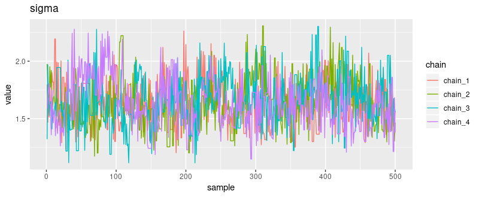
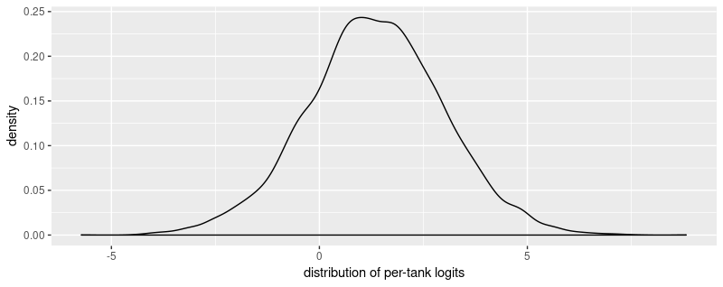
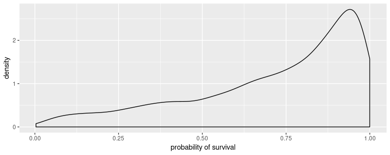

```{r setup, include=FALSE}
knitr::opts_chunk$set(echo = TRUE, eval = FALSE)
```
Before we jump into the technicalities: This post is, of course, dedicated to McElreath who wrote one of most intriguing books on Bayesian (or should we just say - scientific?) modeling we're aware of. If you haven't read [Statistical Rethinking](https://www.amazon.com/Statistical-Rethinking-Bayesian-Examples-Chapman/dp/1482253445), and are interested in modeling, you might definitely want to check it out. In this post, we're not going to try to re-tell the story: Our clear focus will, instead, be a demonstration of how to do MCMC with [tfprobability](https://rstudio.github.io/tfprobability/).^[For a supplementary introduction to Bayesian modeling focusing on complete coverage, yet starting from the very beginning, you might want to consult Ben Lambert's [Student's Guide to Bayesian Statistics](https://www.amazon.com/Students-Guide-Bayesian-Statistics/dp/1473916364/).]

Concretely, this post has two parts. The first is a quick overview of how to use [tfd_joint_sequential_distribution](https://rstudio.github.io/tfprobability/reference/tfd_joint_distribution_sequential.html) to construct a model, and then sample from it using Hamiltonian Monte Carlo. This part can be consulted for quick code look-up, or as a frugal template of the whole process.
The second part then walks through a multi-level model in more detail, showing how to extract, post-process and visualize sampling as well as diagnostic outputs.

## Reedfrogs

The data comes with the `rethinking` package.

```{r}
library(rethinking)

data(reedfrogs)
d <- reedfrogs
str(d)
```

```
'data.frame':	48 obs. of  5 variables:
 $ density : int  10 10 10 10 10 10 10 10 10 10 ...
 $ pred    : Factor w/ 2 levels "no","pred": 1 1 1 1 1 1 1 1 2 2 ...
 $ size    : Factor w/ 2 levels "big","small": 1 1 1 1 2 2 2 2 1 1 ...
 $ surv    : int  9 10 7 10 9 9 10 9 4 9 ...
 $ propsurv: num  0.9 1 0.7 1 0.9 0.9 1 0.9 0.4 0.9 ...
 ```
 
The task is modeling survivor counts among tadpoles, where tadpoles are held in tanks of different sizes (equivalently, different numbers of inhabitants). Each row in the dataset describes one tank, with its initial count of inhabitants (`density`) and number of survivors (`surv`).
In the technical overview part, we build a simple unpooled model that describes every tank in isolation. Then, in the detailed walk-through, we'll see how to construct a _varying intercepts_ model that allows for information sharing between tanks.
 
## Constructing models with `tfd_joint_distribution_sequential`

`tfd_joint_distribution_sequential` represents a model as a list of conditional distributions.
This is easiest to see on a real example, so we'll jump right in, creating an unpooled model of the tadpole data. 

This is the how the model specification would look in _Stan_:

```
model{
    vector[48] p;
    a ~ normal( 0 , 1.5 );
    for ( i in 1:48 ) {
        p[i] = a[tank[i]];
        p[i] = inv_logit(p[i]);
    }
    S ~ binomial( N , p );
}
```

And here is `tfd_joint_distribution_sequential`:

```{r}
library(tensorflow)

# make sure you have at least version 0.7 of TensorFlow Probability 
# as of this writing, it is required of install the master branch:
# install_tensorflow(version = "nightly")
library(tfprobability)

m1 <- tfd_joint_distribution_sequential(
  list(
    # normal prior of per-tank logits
    tfd_multivariate_normal_diag(
      loc = rep(0, n_tadpoles),
      scale_identity_multiplier = 1.5),
    # binomial distribution of survival counts
    function(l)
      tfd_independent(
        tfd_binomial(total_count = n_start, logits = l),
        reinterpreted_batch_ndims = 1
      )
  )
)
```

The model consists of two distributions: Prior means and variances for the 48 tadpole tanks are specified by  `tfd_multivariate_normal_diag`; then `tfd_binomial` generates survival counts for each tank.
Note how the first distribution is unconditional, while the second depends on the first. Note too how the second has to be wrapped in `tfd_independent` to avoid wrong broadcasting. (This is an aspect of `tfd_joint_distribution_sequential` usage that deserves to be documented more systematically, which is surely going to happen.^[As of today, lots of useful information is available in [Modeling with JointDistribution](https://github.com/tensorflow/probability/blob/master/tensorflow_probability/examples/jupyter_notebooks/Modeling_with_JointDistribution.ipynb) and [Multilevel Modeling Primer](https://github.com/tensorflow/probability/blob/master/tensorflow_probability/examples/jupyter_notebooks/Multilevel_Modeling_Primer.ipynb), but some experimentation may needed to adapt the -- numerous! -- examples to your needs.] Just think that this functionality was added to TFP `master` only three weeks ago!)

As an aside, the model specification here ends up shorter than in _Stan_ as `tfd_binomial` optionally takes logits as parameters.

As with every TFP distribution, you can do a quick functionality check by sampling from the model:^[__Updated footnote, as of May 13th__: When this post was written, we were still experimenting with the use of `tf.function` from R, so it seemed safest to code the complete example in graph mode. The next post on MCMC will use eager execution, and show how to achieve good performance by placing the actual sampling procedure on the graph.]

```{r}
# sample a batch of 2 values 
# we get samples for every distribution in the model
s <- m1 %>% tfd_sample(2)
```

```
[[1]]
Tensor("MultivariateNormalDiag/sample/affine_linear_operator/forward/add:0",
shape=(2, 48), dtype=float32)

[[2]]
Tensor("IndependentJointDistributionSequential/sample/Beta/sample/Reshape:0",
shape=(2, 48), dtype=float32)
```

and computing log probabilities:

```{r}
# we should get only the overall log probability of the model
m1 %>% tfd_log_prob(s)
```

```
t[[1]]
Tensor("MultivariateNormalDiag/sample/affine_linear_operator/forward/add:0",
shape=(2, 48), dtype=float32)

[[2]]
Tensor("IndependentJointDistributionSequential/sample/Beta/sample/Reshape:0",
shape=(2, 48), dtype=float32)
```

Now, let's see how we can sample from this model using Hamiltonian Monte Carlo.

## Running Hamiltonian Monte Carlo in TFP

We define a Hamiltonian Monte Carlo kernel with dynamic step size adaptation based on a desired acceptance probability.

```{r}
# number of steps to run burnin
n_burnin <- 500

# optimization target is the likelihood of the logits given the data
logprob <- function(l)
  m1 %>% tfd_log_prob(list(l, n_surviving))

hmc <- mcmc_hamiltonian_monte_carlo(
  target_log_prob_fn = logprob,
  num_leapfrog_steps = 3,
  step_size = 0.1,
) %>%
  mcmc_simple_step_size_adaptation(
    target_accept_prob = 0.8,
    num_adaptation_steps = n_burnin
  )
```

We then run the sampler, passing in an initial state. If we want to run $n$ chains, that state has to be of length $n$, for every parameter in the model (here we have just one).

The sampling function, [mcmc_sample_chain](https://rstudio.github.io/tfprobability/reference/mcmc_sample_chain.html), may optionally be passed a `trace_fn` that tells TFP which kinds of meta information to save. Here we save acceptance ratios and step sizes.

```{r}
# number of steps after burnin
n_steps <- 500
# number of chains
n_chain <- 4

# get starting values for the parameters
# their shape implicitly determines the number of chains we will run
# see current_state parameter passed to mcmc_sample_chain below
c(initial_logits, .) %<-% (m1 %>% tfd_sample(n_chain))

# tell TFP to keep track of acceptance ratio and step size
trace_fn <- function(state, pkr) {
  list(pkr$inner_results$is_accepted,
       pkr$inner_results$accepted_results$step_size)
}

res <- hmc %>% mcmc_sample_chain(
  num_results = n_steps,
  num_burnin_steps = n_burnin,
  current_state = initial_logits,
  trace_fn = trace_fn
)
```

When sampling is finished, we can access the samples as `res$all_states`:

```{r}
mcmc_trace <- res$all_states
mcmc_trace
```

```
Tensor("mcmc_sample_chain/trace_scan/TensorArrayStack/TensorArrayGatherV3:0",
shape=(500, 4, 48), dtype=float32)
```

This is the shape of the samples for `l`, the 48 per-tank logits: 500 samples times 4 chains times 48 parameters.

From these samples, we can compute effective sample size and $rhat$ (alias `mcmc_potential_scale_reduction`):

```{r}
# Tensor("Mean:0", shape=(48,), dtype=float32)
ess <- mcmc_effective_sample_size(mcmc_trace) %>% tf$reduce_mean(axis = 0L)

# Tensor("potential_scale_reduction/potential_scale_reduction_single_state/sub_1:0", shape=(48,), dtype=float32)
rhat <- mcmc_potential_scale_reduction(mcmc_trace)
```

Whereas diagnostic information is available in `res$trace`:

```{r}
# Tensor("mcmc_sample_chain/trace_scan/TensorArrayStack_1/TensorArrayGatherV3:0",
# shape=(500, 4), dtype=bool)
is_accepted <- res$trace[[1]] 

# Tensor("mcmc_sample_chain/trace_scan/TensorArrayStack_2/TensorArrayGatherV3:0",
# shape=(500,), dtype=float32)
step_size <- res$trace[[2]] 
```

After this quick outline, let's move on to the topic promised in the title: multi-level modeling, or partial pooling. This time, we'll also take a closer look at sampling results and diagnostic outputs.

## Multi-level tadpoles ^[yep, it's a quote]


The multi-level model -- or _varying intercepts model_, in this case: we'll get to _varying slopes_ in a later post -- adds a _hyperprior_ to the model. Instead of deciding on a mean and variance of the normal prior the logits are drawn from, we let the model learn means and variances for individual tanks.
These per-tank means, while being priors for the binomial logits, are assumed to be normally distributed, and are themselves regularized by a normal prior for the mean and an exponential prior for the variance.

For the Stan-savvy, here is the Stan formulation of this model.

```{r}
model{
    vector[48] p;
    sigma ~ exponential( 1 );
    a_bar ~ normal( 0 , 1.5 );
    a ~ normal( a_bar , sigma );
    for ( i in 1:48 ) {
        p[i] = a[tank[i]];
        p[i] = inv_logit(p[i]);
    }
    S ~ binomial( N , p );
}
```


And here it is with TFP:

```{r}
m2 <- tfd_joint_distribution_sequential(
  list(
    # a_bar, the prior for the mean of the normal distribution of per-tank logits
    tfd_normal(loc = 0, scale = 1.5),
    # sigma, the prior for the variance of the normal distribution of per-tank logits
    tfd_exponential(rate = 1),
    # normal distribution of per-tank logits
    # parameters sigma and a_bar refer to the outputs of the above two distributions
    function(sigma, a_bar) 
      tfd_sample_distribution(
        tfd_normal(loc = a_bar, scale = sigma),
        sample_shape = list(n_tadpoles)
      ), 
    # binomial distribution of survival counts
    # parameter l refers to the output of the normal distribution immediately above
    function(l)
      tfd_independent(
        tfd_binomial(total_count = n_start, logits = l),
        reinterpreted_batch_ndims = 1
      )
  )
)
```

Technically, dependencies in `tfd_joint_distribution_sequential` are defined via spatial proximity in the list: In the learned prior for the logits

```{r}
function(sigma, a_bar) 
      tfd_sample_distribution(
        tfd_normal(loc = a_bar, scale = sigma),
        sample_shape = list(n_tadpoles)
      )
```

`sigma` refers to the distribution immediately above, and `a_bar` to the one above that.

Analogously, in the distribution of survival counts

```{r}
function(l)
      tfd_independent(
        tfd_binomial(total_count = n_start, logits = l),
        reinterpreted_batch_ndims = 1
      )
```

`l` refers to the distribution immediately preceding its own definition.

Again, let's sample from this model to see if shapes are correct.

```{r}
s <- m2 %>% tfd_sample(2)
s 
```

They are.

```
[[1]]
Tensor("Normal/sample_1/Reshape:0", shape=(2,), dtype=float32)

[[2]]
Tensor("Exponential/sample_1/Reshape:0", shape=(2,), dtype=float32)

[[3]]
Tensor("SampleJointDistributionSequential/sample_1/Normal/sample/Reshape:0",
shape=(2, 48), dtype=float32)

[[4]]
Tensor("IndependentJointDistributionSequential/sample_1/Beta/sample/Reshape:0",
shape=(2, 48), dtype=float32)
```

And to make sure we get one overall `log_prob` per batch:

```{r}
m2 %>% tfd_log_prob(s)
```

```
Tensor("JointDistributionSequential/log_prob/add_3:0", shape=(2,), dtype=float32)
```

Training this model works like before, except that now the initial state comprises three parameters, _a_bar_, _sigma_ and _l_:

```{r}
c(initial_a, initial_s, initial_logits, .) %<-% (m2 %>% tfd_sample(n_chain))
```

Here is the sampling routine:

```{r}
# the joint log probability now is based on three parameters
logprob <- function(a, s, l)
  m2 %>% tfd_log_prob(list(a, s, l, n_surviving))

hmc <- mcmc_hamiltonian_monte_carlo(
  target_log_prob_fn = logprob,
  num_leapfrog_steps = 3,
  # one step size for each parameter
  step_size = list(0.1, 0.1, 0.1),
) %>%
  mcmc_simple_step_size_adaptation(target_accept_prob = 0.8,
                                   num_adaptation_steps = n_burnin)

run_mcmc <- function(kernel) {
  kernel %>% mcmc_sample_chain(
    num_results = n_steps,
    num_burnin_steps = n_burnin,
    current_state = list(initial_a, tf$ones_like(initial_s), initial_logits),
    trace_fn = trace_fn
  )
}

res <- hmc %>% run_mcmc()
 
mcmc_trace <- res$all_states
```

This time, `mcmc_trace` is a list of three: We have 

```
[[1]]
Tensor("mcmc_sample_chain/trace_scan/TensorArrayStack/TensorArrayGatherV3:0",
shape=(500, 4), dtype=float32)

[[2]]
Tensor("mcmc_sample_chain/trace_scan/TensorArrayStack_1/TensorArrayGatherV3:0",
shape=(500, 4), dtype=float32)

[[3]]
Tensor("mcmc_sample_chain/trace_scan/TensorArrayStack_2/TensorArrayGatherV3:0",
shape=(500, 4, 48), dtype=float32)
```

Now let's create graph nodes for the results and information we're interested in.

```{r}
# as above, this is the raw result
mcmc_trace_ <- res$all_states

# we perform some reshaping operations directly in tensorflow
all_samples_ <-
  tf$concat(
    list(
      mcmc_trace_[[1]] %>% tf$expand_dims(axis = -1L),
      mcmc_trace_[[2]]  %>% tf$expand_dims(axis = -1L),
      mcmc_trace_[[3]]
    ),
    axis = -1L
  ) %>%
  tf$reshape(list(2000L, 50L))

# diagnostics, also as above
is_accepted_ <- res$trace[[1]]
step_size_ <- res$trace[[2]]

# effective sample size
# again we use tensorflow to get conveniently shaped outputs
ess_ <- mcmc_effective_sample_size(mcmc_trace) 
ess_ <- tf$concat(
  list(
    ess_[[1]] %>% tf$expand_dims(axis = -1L),
    ess_[[2]]  %>% tf$expand_dims(axis = -1L),
    ess_[[3]]
  ),
  axis = -1L
) 

# rhat, conveniently post-processed
rhat_ <- mcmc_potential_scale_reduction(mcmc_trace)
rhat_ <- tf$concat(
  list(
    rhat_[[1]] %>% tf$expand_dims(axis = -1L),
    rhat_[[2]]  %>% tf$expand_dims(axis = -1L),
    rhat_[[3]]
  ),
  axis = -1L
) 

```

And we're ready to actually run the chains.

```{r}
# so far, no sampling has been done!
# the actual sampling happens when we create a Session 
# and run the above-defined nodes
sess <- tf$Session()
eval <- function(...) sess$run(list(...))

c(mcmc_trace, all_samples, is_accepted, step_size, ess, rhat) %<-%
  eval(mcmc_trace_, all_samples_, is_accepted_, step_size_, ess_, rhat_)
```

This time, let's actually inspect those results. 

## Multi-level tadpoles: Results

First, how do the chains behave? 

### Trace plots

Extract the samples for `a_bar` and `sigma`, as well as one of the learned priors for the logits:

```{r}
a_bar <- mcmc_trace[[1]] %>% as.matrix()
sigma <- mcmc_trace[[2]] %>% as.matrix()
a_1 <- mcmc_trace[[3]][ , , 1] %>% as.matrix()
```

Here's a trace plot for `a_bar`:

```{r}
prep_tibble <- function(samples) {
  as_tibble(samples, .name_repair = ~ c("chain_1", "chain_2", "chain_3", "chain_4")) %>% 
    add_column(sample = 1:500) %>%
    gather(key = "chain", value = "value", -sample)
}

plot_trace <- function(samples, param_name) {
  prep_tibble(samples) %>% 
    ggplot(aes(x = sample, y = value, color = chain)) +
    geom_line() + 
    ggtitle(param_name)
}

plot_trace(a_bar, "a_bar")
```

```{r, eval=TRUE, echo=FALSE, layout="l-body-outset"}
knitr::include_graphics("images/traceplot_a_bar.png")
```

And here for `sigma` and `a_1`:

```{r, eval=TRUE, echo=FALSE, layout="l-body-outset"}

```

```{r, eval=TRUE, echo=FALSE, layout="l-body-outset"}
knitr::include_graphics("images/traceplot_a_1.png")
```


How about the posterior distributions of the parameters, first and foremost, the varying intercepts `a_1` ... `a_48`?

### Posterior distributions

```{r}
plot_posterior <- function(samples) {
  prep_tibble(samples) %>% 
    ggplot(aes(x = value, color = chain)) +
    geom_density() +
    theme_classic() +
    theme(legend.position = "none",
          axis.title = element_blank(),
          axis.text = element_blank(),
          axis.ticks = element_blank())
    
}

plot_posteriors <- function(sample_array, num_params) {
  plots <- purrr::map(1:num_params, ~ plot_posterior(sample_array[ , , .x] %>% as.matrix()))
  do.call(grid.arrange, plots)
}

plot_posteriors(mcmc_trace[[3]], dim(mcmc_trace[[3]])[3])
```

```{r, eval=TRUE, echo=FALSE, layout="l-body-outset"}
knitr::include_graphics("images/posteriors.png")
```

Now let's see the corresponding posterior means and highest posterior density intervals.
(The below code includes the hyperpriors in `summary` as we'll want to display a complete _precis_-like output soon.)

### Posterior means and HPDIs

```{r}
all_samples <- all_samples %>%
  as_tibble(.name_repair = ~ c("a_bar", "sigma", paste0("a_", 1:48))) 

means <- all_samples %>% 
  summarise_all(list (~ mean)) %>% 
  gather(key = "key", value = "mean")

sds <- all_samples %>% 
  summarise_all(list (~ sd)) %>% 
  gather(key = "key", value = "sd")

hpdis <-
  all_samples %>%
  summarise_all(list(~ list(hdi(.) %>% t() %>% as_tibble()))) %>% 
  unnest() 

hpdis_lower <- hpdis %>% select(-contains("upper")) %>%
  rename(lower0 = lower) %>%
  gather(key = "key", value = "lower") %>% 
  arrange(as.integer(str_sub(key, 6))) %>%
  mutate(key = c("a_bar", "sigma", paste0("a_", 1:48)))

hpdis_upper <- hpdis %>% select(-contains("lower")) %>%
  rename(upper0 = upper) %>%
  gather(key = "key", value = "upper") %>% 
  arrange(as.integer(str_sub(key, 6))) %>%
  mutate(key = c("a_bar", "sigma", paste0("a_", 1:48)))

summary <- means %>% 
  inner_join(sds, by = "key") %>% 
  inner_join(hpdis_lower, by = "key") %>%
  inner_join(hpdis_upper, by = "key")


summary %>% 
  filter(!key %in% c("a_bar", "sigma")) %>%
  mutate(key_fct = factor(key, levels = unique(key))) %>%
  ggplot(aes(x = key_fct, y = mean, ymin = lower, ymax = upper)) +
   geom_pointrange() + 
   coord_flip() +  
   xlab("") + ylab("post. mean and HPDI") +
   theme_minimal() 
```

```{r, eval=TRUE, echo=FALSE, layout="l-page"}
knitr::include_graphics("images/forest_plot.png")
```

Now for an equivalent to _precis_. We already computed means, standard deviations and the HPDI interval.
Let's add _n_eff_, the effective number of samples, and _rhat_, the Gelman-Rubin statistic.

### Comprehensive summary (a.k.a. "precis")

```{r}
is_accepted <- is_accepted %>% as.integer() %>% mean()
step_size <- purrr::map(step_size, mean)

ess <- apply(ess, 2, mean)

summary_with_diag <- summary %>% add_column(ess = ess, rhat = rhat)
summary_with_diag
```

```
# A tibble: 50 x 7
   key    mean    sd  lower upper   ess  rhat
   <chr> <dbl> <dbl>  <dbl> <dbl> <dbl> <dbl>
 1 a_bar  1.35 0.266  0.792  1.87 405.   1.00
 2 sigma  1.64 0.218  1.23   2.05  83.6  1.00
 3 a_1    2.14 0.887  0.451  3.92  33.5  1.04
 4 a_2    3.16 1.13   1.09   5.48  23.7  1.03
 5 a_3    1.01 0.698 -0.333  2.31  65.2  1.02
 6 a_4    3.02 1.04   1.06   5.05  31.1  1.03
 7 a_5    2.11 0.843  0.625  3.88  49.0  1.05
 8 a_6    2.06 0.904  0.496  3.87  39.8  1.03
 9 a_7    3.20 1.27   1.11   6.12  14.2  1.02
10 a_8    2.21 0.894  0.623  4.18  44.7  1.04
# ... with 40 more rows
```

For the varying intercepts, effective sample sizes are pretty low, indicating we might want to investigate possible reasons.

Let's also display posterior survival probabilities, analogously to figure 13.2 in the book. 

### Posterior survival probabilities

```{r}
sim_tanks <- rnorm(8000, a_bar, sigma)
tibble(x = sim_tanks) %>% ggplot(aes(x = x)) + geom_density() + xlab("distribution of per-tank logits")
```

```{r, eval=TRUE, echo=FALSE, layout="l-body-outset"}

```


```{r}
# our usual sigmoid by another name (undo the logit)
logistic <- function(x) 1/(1 + exp(-x))
probs <- map_dbl(sim_tanks, logistic)
tibble(x = probs) %>% ggplot(aes(x = x)) + geom_density() + xlab("probability of survival")
```

```{r, eval=TRUE, echo=FALSE, layout="l-body-outset"}

```

Finally, we want to make sure we see the shrinkage behavior displayed in figure 13.1 in the book.

### Shrinkage

```{r}
summary %>% 
  filter(!key %in% c("a_bar", "sigma")) %>%
  select(key, mean) %>%
  mutate(est_survival = logistic(mean)) %>%
  add_column(act_survival = d$propsurv) %>%
  select(-mean) %>%
  gather(key = "type", value = "value", -key) %>%
  ggplot(aes(x = key, y = value, color = type)) +
  geom_point() +
  geom_hline(yintercept = mean(d$propsurv), size = 0.5, color = "cyan" ) +
  xlab("") +
  ylab("") +
  theme_minimal() +
  theme(axis.text.x = element_blank())

```

```{r, eval=TRUE, echo=FALSE, layout="l-body-outset"}
knitr::include_graphics("images/shrinkage.png")
```

We see results similar in spirit to McElreath's: estimates are shrunken to the mean (the cyan-colored line). Also, shrinkage seems to be more active in smaller tanks, which are the lower-numbered ones on the left of the plot.
 
## Outlook

In this post, we saw how to construct a _varying intercepts_ model with `tfprobability`, as well as how to extract sampling results and relevant diagnostics. In an upcoming post, we'll move on to _varying slopes_.
With non-negligible probability, our example will build on one of Mc Elreath's again...
Thanks for reading!
