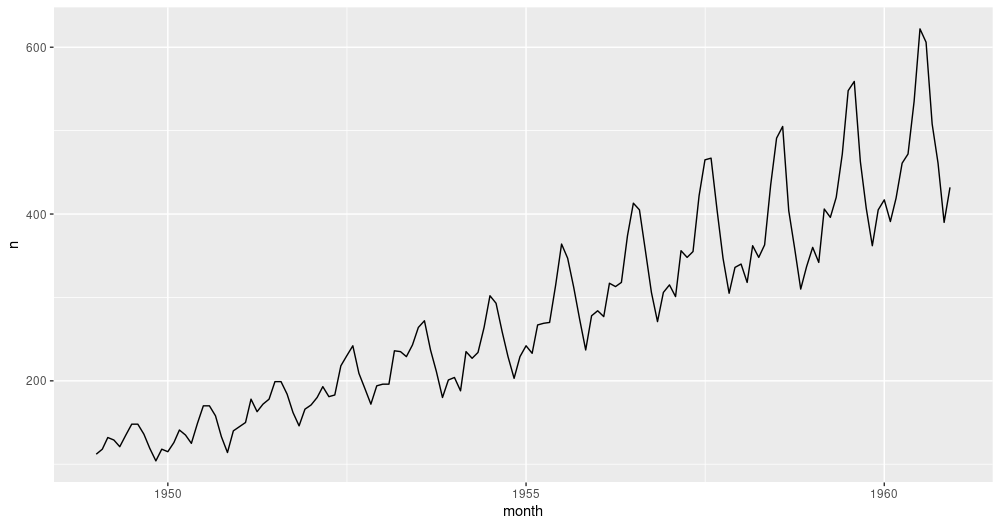

```{r setup, include=FALSE}
knitr::opts_chunk$set(echo = TRUE, eval = FALSE)
```

Welcome to the world of _state space models_. ^[For an excellent yet concise introduction to state space models, see chapter 18 of Murphy (2012) [@Murphy-2012].] In this world, there is a _latent process_, hidden from our eyes; and there are _observations_ we make about the things it produces. The process evolves due to some hidden logic (_transition model_); and the way it produces the observations follows some hidden logic (_observation model_). There is noise in process evolution, and there is noise in observation. If the transition and observation models both are linear, and the process as well as observation noise are Gaussian, we have a _linear-Gaussian state space model_ (SSM). The task is to infer the latent state from the observations. The most famous technique is the _Kálmán filter_.

In practical applications, two characteristics of linear-Gaussian SSMs are especially attractive. 

For one, they let us estimate dynamically changing parameters. In regression, the parameters can be viewed as a hidden state; we may thus have a slope and an intercept that vary over time. When parameters can vary, we speak of _dynamic linear models_ (DLMs). This is the term we'll use throughout this post when referring to this class of models.

Second, linear-Gaussian SSMs are useful in time-series forecasting because Gaussian processes can be _added_. A time series can thus be framed as, e.g. the sum of a linear trend and a process that varies seasonally.

Using [tfprobability](https://rstudio.github.io/tfprobability/), the R wrapper to TensorFlow Probability, we illustrate both aspects here. Our first example will be on _dynamic linear regression_. In a detailed walkthrough, we show on how to fit such a model, how to obtain filtered, as well as smoothed, estimates of the coefficients, and how to obtain forecasts. 
Our second example then illustrates process additivity. This example will build on the first, and may also serve as a quick recap of the overall procedure.

Let's jump in. 


## Dynamic linear regression example: Capital Asset Pricing Model (CAPM)

Our code builds on the recently released versions of TensorFlow and TensorFlow Probability: 1.14 and 0.7, respectively. 

```{r}
devtools::install_github("rstudio/tfprobability")

# also installs TensorFlow Probability v. 0.7
tensorflow::install_tensorflow(version = "1.14")

library(tensorflow)
library(tfprobability)

library(tidyverse)
library(zeallot)
```


Note how there's one thing we used to do lately that we're _not_ doing here: We're not enabling eager execution. We say why in a minute.

Our example is taken from Petris et al.(2009)[@Petris-2009], chapter 3.2.7. ^[A draft version is available online at http://people.bordeaux.inria.fr/pierre.delmoral/dynamics-linear-models.petris_et_al.pdf. However, the draft does not yet fully elaborate on this example.]
Besides introducing the [dlm](https://cran.r-project.org/web/packages/dlm/index.html) package, this book provides a nice introduction to the ideas behind DLMs in general.

To illustrate dynamic linear regression, the authors feature a dataset, originally from Berndt(1991)[@Berndt-1991] that has monthly returns, collected from January 1978 to December 1987, for four different stocks, the 30-day Treasury Bill -- standing in for a _risk-free_ asset --, and the value-weighted average returns for all stocks listed at the New York and American Stock Exchanges, representing the overall _market returns_. 

Let's take a look.

```{r}
# As the data does not seem to be available at the address given in Petris et al. any more,
# we put it on the blog for download
file <- download.file(
  "https://github.com/rstudio/tensorflow-blog/tree/master/docs/posts/2019-06-25-dynamic-linear-models-tfprobability/data/capm.txt",
  "capm.txt")
df <- read_table(
  filename,
  col_types = list(
    col_date(format = "%Y.%m"),
    col_double(),
    col_double(),
    col_double(),
    col_double(),
    col_double(),
    col_double()
  )
) %>%
  rename(month = X1)

df %>% glimpse()
```

```
Observations: 120
Variables: 7
$ month  <date> 1978-01-01, 1978-02-01, 1978-03-01, 1978-04-01, 1978-05-01, 19…
$ MOBIL  <dbl> -0.046, -0.017, 0.049, 0.077, -0.011, -0.043, 0.028, 0.056, 0.0…
$ IBM    <dbl> -0.029, -0.043, -0.063, 0.130, -0.018, -0.004, 0.092, 0.049, -0…
$ WEYER  <dbl> -0.116, -0.135, 0.084, 0.144, -0.031, 0.005, 0.164, 0.039, -0.0…
$ CITCRP <dbl> -0.115, -0.019, 0.059, 0.127, 0.005, 0.007, 0.032, 0.088, 0.011…
$ MARKET <dbl> -0.045, 0.010, 0.050, 0.063, 0.067, 0.007, 0.071, 0.079, 0.002,…
$ RKFREE <dbl> 0.00487, 0.00494, 0.00526, 0.00491, 0.00513, 0.00527, 0.00528, …
```

```{r}
df %>% gather(key = "symbol", value = "return", -month) %>%
  ggplot(aes(x = month, y = return, color = symbol)) +
  geom_line() +
  facet_grid(rows = vars(symbol), scales = "free")
```


```{r, eval=TRUE, echo=FALSE, layout="l-body-outset", fig.cap = "Monthly returns for selected stocks; data from Berndt (1991)."}
knitr::include_graphics("images/capm_overview.png")
```


The [Capital Asset Pricing Model](https://en.wikipedia.org/wiki/Capital_asset_pricing_model) then assumes a linear relationship between the excess returns of an asset under study and the excess returns of the market. For both, _excess returns_ are obtained by subtracting the returns of the chosen _risk-free_ asset; then, the scaling coefficient between them reveals the asset to either be an "aggressive" investment (slope > 1: changes in the market are amplified), or a conservative one (slope < 1: changes are damped).

Assuming this relationship does not change over time, we can easily use `lm` to illustrate this. Following Petris et al. in zooming in on IBM as the asset under study, we have

```{r}
# excess returns of the asset under study
ibm <- df$IBM - df$RKFREE
# market excess returns
x <- df$MARKET - df$RKFREE

fit <- lm(ibm ~ x)
summary(fit)
```


```
Call:
lm(formula = ibm ~ x)

Residuals:
     Min       1Q   Median       3Q      Max 
-0.11850 -0.03327 -0.00263  0.03332  0.15042 

Coefficients:
              Estimate Std. Error t value Pr(>|t|)    
(Intercept) -0.0004896  0.0046400  -0.106    0.916    
x            0.4568208  0.0675477   6.763 5.49e-10 ***
---
Signif. codes:  0 ‘***’ 0.001 ‘**’ 0.01 ‘*’ 0.05 ‘.’ 0.1 ‘ ’ 1

Residual standard error: 0.05055 on 118 degrees of freedom
Multiple R-squared:  0.2793,	Adjusted R-squared:  0.2732 
F-statistic: 45.74 on 1 and 118 DF,  p-value: 5.489e-10
```


So IBM is found to be a conservative investment, the slope being ~ 0.5. But is this relationship stable over time?

Let's turn to `tfprobability` to investigate.

We want to use this example to demonstrate two essential applications of DLMs: obtaining smoothing and/or filtering estimates of the coefficients, as well as forecasting future values. So unlike Petris et al., we divide the dataset into a training and a testing part:^[Forecasting functionality is not provided by `dlm` for dynamic linear models, see `?dlmForecast`].


```{r}
# zoom in on ibm
ts <- ibm %>% matrix()
# forecast 12 months
n_forecast_steps <- 12
ts_train <- ts[1:(length(ts) - n_forecast_steps), 1, drop = FALSE]

# make sure we work with float32 here
ts_train <- tf$cast(ts_train, tf$float32)
ts <- tf$cast(ts, tf$float32)
```


We now construct the model. [sts_dynamic_linear_regression()](https://rstudio.github.io/tfprobability/reference/sts_dynamic_linear_regression.html) does what we want: 

```{r}
# define the model on the complete series
linreg <- ts %>%
  sts_dynamic_linear_regression(
    design_matrix = cbind(rep(1, length(x)), x) %>% tf$cast(tf$float32)
  )
```


We pass it the column of excess market returns, plus a column of ones, following Petris et al.. Alternatively, we could center the single predictor -- this would work just as well. 

How are we going to train this model? Method-wise, we have a choice between variational inference (VI) and Hamiltonian Monte Carlo (HMC). We will see both. The second question is: Are we going to use graph mode or eager mode? As of today, for both VI and HMC, it is safest -- and fastest -- to run in graph mode, so this is the only technique we show. In a few weeks, or months, we should be able to prune a lot of `sess$run()`s from the code!

Normally in posts, when presenting code we optimize for easy experimentation (meaning: line-by-line executability), not modularity. This time though, with an important number of evaluation statements involved, it's easiest to pack not just the fitting, but the smoothing and forecasting as well into a function (which you could still step through if you wanted). For VI, we'll have a `fit _with_vi` function that does it all. So when we now start explaining what it does, don't type in the code just yet -- it'll all reappear nicely packed into that function, for you to copy and execute as a whole.

#### Fitting a time series with variational inference

Fitting with VI pretty much looks like training traditionally used to look in graph-mode TensorFlow. You define a loss -- here it's done using [sts_build_factored_variational_loss()](https://rstudio.github.io/tfprobability/reference/sts_build_factored_variational_loss.html) --, an optimizer, and an operation for the optimizer to reduce that loss:

```{r}
optimizer <- tf$compat$v1$train$AdamOptimizer(0.1)

# only train on the training set!    
loss_and_dists <- ts_train %>% sts_build_factored_variational_loss(model = model)
variational_loss <- loss_and_dists[[1]]

train_op <- optimizer$minimize(variational_loss)
```

Note how the loss is defined on the training set only, not the complete series.

Now to actually train the model, we create a session and run that operation:

```{r}
 with (tf$Session() %as% sess,  {
      
      sess$run(tf$compat$v1$global_variables_initializer())
   
      for (step in 1:n_iterations) {
        res <- sess$run(train_op)
        loss <- sess$run(variational_loss)
        if (step %% 10 == 0)
          cat("Loss: ", as.numeric(loss), "\n")
      }
 })
```


Given we have that session, let's make use of it and compute all the estimates we desire.
Again, -- the following snippets will end up in the `fit_with_vi` function, so don't run them in isolation just yet.

#### Obtaining forecasts

The first thing we want for the model to give us are forecasts. In order to create them, it needs _samples from the posterior_. Luckily we already have the posterior distributions, returned from `sts_build_factored_variational_loss`, so let's sample from them and pass them to [sts_forecast](https://rstudio.github.io/tfprobability/reference/sts_forecast.html):

```{r}
variational_distributions <- loss_and_dists[[2]]
posterior_samples <-
  Map(
    function(d) d %>% tfd_sample(n_param_samples),
    variational_distributions %>% reticulate::py_to_r() %>% unname()
  )
forecast_dists <- ts_train %>% sts_forecast(model, posterior_samples, n_forecast_steps)
``` 

`sts_forecast()` returns distributions, so we call `tfd_mean()` to get the posterior predictions and `tfd_stddev()` for the corresponding standard deviations:

```{r}
fc_means <- forecast_dists %>% tfd_mean()
fc_sds <- forecast_dists %>% tfd_stddev()
``` 

By the way -- as we have the full posterior distributions, we are by no means restricted to summary statistics! We could easily use `tfd_sample()` to obtain individual forecasts.

#### Smoothing and filtering (Kálmán filter)

Now, the second (and last, for this example) thing we will want are the smoothed and filtered regression coefficients. The famous [Kálmán Filter](https://en.wikipedia.org/wiki/Kalman_filter) is a Bayesian-in-spirit method where at each time step, predictions are corrected by how much they differ from an incoming observation. _Filtering_ estimates are based on observations we've seen so far; _smoothing estimates_ are computed "in hindsight", making use of the complete time series.

We first create a state space model from our time series definition:

```{r}
# only do this on the training set
# returns an instance of tfd_linear_gaussian_state_space_model()
ssm <- model$make_state_space_model(length(ts_train), param_vals = posterior_samples)
```

`tfd_linear_gaussian_state_space_model()`, technically a distribution, provides the Kálmán filter functionalities of smoothing and filtering.

To obtain the smoothed estimates:

```{r}
c(smoothed_means, smoothed_covs) %<-% ssm$posterior_marginals(ts_train)
``` 

And the filtered ones:

```{r}
c(., filtered_means, filtered_covs, ., ., ., .) %<-% ssm$forward_filter(ts_train)
```

Finally, we need to evaluate all those.

```{r}
c(posterior_samples, fc_means, fc_sds, smoothed_means, smoothed_covs, filtered_means, filtered_covs) %<-%
  sess$run(list(posterior_samples, fc_means, fc_sds, smoothed_means, smoothed_covs, filtered_means, filtered_covs))
   
```

#### Putting it all together (the VI edition)

So here's the complete function, `fit_with_vi`, ready for us to call.

```{r}
fit_vi <-
  function(ts,
           ts_train,
           model,
           n_iterations,
           n_param_samples,
           n_forecast_steps,
           n_forecast_samples) {
    
    optimizer <- tf$compat$v1$train$AdamOptimizer(0.1)
    
    loss_and_dists <-
      ts_train %>% sts_build_factored_variational_loss(model = model)
    variational_loss <- loss_and_dists[[1]]
    train_op <- optimizer$minimize(variational_loss)
    
    with (tf$Session() %as% sess,  {
      
      sess$run(tf$compat$v1$global_variables_initializer())
      for (step in 1:n_iterations) {
        sess$run(train_op)
        loss <- sess$run(variational_loss)
        if (step %% 1 == 0)
          cat("Loss: ", as.numeric(loss), "\n")
      }
      variational_distributions <- loss_and_dists[[2]]
      posterior_samples <-
        Map(
          function(d)
            d %>% tfd_sample(n_param_samples),
          variational_distributions %>% reticulate::py_to_r() %>% unname()
        )
      forecast_dists <-
        ts_train %>% sts_forecast(model, posterior_samples, n_forecast_steps)
      fc_means <- forecast_dists %>% tfd_mean()
      fc_sds <- forecast_dists %>% tfd_stddev()
      
      ssm <- model$make_state_space_model(length(ts_train), param_vals = posterior_samples)
      c(smoothed_means, smoothed_covs) %<-% ssm$posterior_marginals(ts_train)
      c(., filtered_means, filtered_covs, ., ., ., .) %<-% ssm$forward_filter(ts_train)
   
      c(posterior_samples, fc_means, fc_sds, smoothed_means, smoothed_covs, filtered_means, filtered_covs) %<-%
        sess$run(list(posterior_samples, fc_means, fc_sds, smoothed_means, smoothed_covs, filtered_means, filtered_covs))
      
    })
    
    list(
      variational_distributions,
      posterior_samples,
      fc_means[, 1],
      fc_sds[, 1],
      smoothed_means,
      smoothed_covs,
      filtered_means,
      filtered_covs
    )
  }
```


And this is how we call it. 

```{r}
# number of VI steps
n_iterations <- 300
# sample size for posterior samples
n_param_samples <- 50
# sample size to draw from the forecast distribution
n_forecast_samples <- 50

# here's the model again
model <- ts %>%
  sts_dynamic_linear_regression(design_matrix = cbind(rep(1, length(x)), x) %>% tf$cast(tf$float32))

# call fit_vi defined above
c(
  param_distributions,
  param_samples,
  fc_means,
  fc_sds,
  smoothed_means,
  smoothed_covs,
  filtered_means,
  filtered_covs
) %<-% fit_vi(
  ts,
  ts_train,
  model,
  n_iterations,
  n_param_samples,
  n_forecast_steps,
  n_forecast_samples
)

```

Curious about the results? We'll see them in a second, but before let's just quickly glance at the alternative training method: HMC.

#### Putting it all together (the HMC edition)

`tfprobability` provides [sts_fit_with_hmc](https://rstudio.github.io/tfprobability/reference/sts_fit_with_hmc.html) to fit a DLM using Hamiltonian Monte Carlo. Recent posts (e.g., [Hierarchical partial pooling, continued: Varying slopes models with TensorFlow Probability](https://blogs.rstudio.com/tensorflow/posts/2019-05-24-varying-slopes/)) showed how to set up HMC to fit hierarchical models; here a single function does it all.

Here is `fit_with_hmc`, wrapping `sts_fit_with_hmc` as well as the (unchanged) techniques for obtaining forecasts and smoothed/filtered parameters:

```{r}
num_results <- 200
num_warmup_steps <- 100

fit_hmc <- function(ts,
                    ts_train,
                    model,
                    num_results,
                    num_warmup_steps,
                    n_forecast,
                    n_forecast_samples) {
  
  states_and_results <-
    ts_train %>% sts_fit_with_hmc(
      model,
      num_results = num_results,
      num_warmup_steps = num_warmup_steps,
      num_variational_steps = num_results + num_warmup_steps
    )
  
  posterior_samples <- states_and_results[[1]]
  forecast_dists <-
    ts_train %>% sts_forecast(model, posterior_samples, n_forecast_steps)
  fc_means <- forecast_dists %>% tfd_mean()
  fc_sds <- forecast_dists %>% tfd_stddev()
  
  ssm <-
    model$make_state_space_model(length(ts_train), param_vals = posterior_samples)
  c(smoothed_means, smoothed_covs) %<-% ssm$posterior_marginals(ts_train)
  c(., filtered_means, filtered_covs, ., ., ., .) %<-% ssm$forward_filter(ts_train)
  
  with (tf$Session() %as% sess,  {
    sess$run(tf$compat$v1$global_variables_initializer())
    c(
      posterior_samples,
      fc_means,
      fc_sds,
      smoothed_means,
      smoothed_covs,
      filtered_means,
      filtered_covs
    ) %<-%
      sess$run(
        list(
          posterior_samples,
          fc_means,
          fc_sds,
          smoothed_means,
          smoothed_covs,
          filtered_means,
          filtered_covs
        )
      )
  })
  
  list(
    posterior_samples,
    fc_means[, 1],
    fc_sds[, 1],
    smoothed_means,
    smoothed_covs,
    filtered_means,
    filtered_covs
  )
}

c(
  param_samples,
  fc_means,
  fc_sds,
  smoothed_means,
  smoothed_covs,
  filtered_means,
  filtered_covs
) %<-% fit_hmc(ts,
               ts_train,
               model,
               num_results,
               num_warmup_steps,
               n_forecast,
               n_forecast_samples)
```


Now finally, let's take a look at the forecasts and filtering resp. smoothing estimates.

#### Forecasts

Putting all we need into one dataframe, we have

```{r}
smoothed_means_intercept <- smoothed_means[, , 1] %>% colMeans()
smoothed_means_slope <- smoothed_means[, , 2] %>% colMeans()

smoothed_sds_intercept <- smoothed_covs[, , 1, 1] %>% colMeans() %>% sqrt()
smoothed_sds_slope <- smoothed_covs[, , 2, 2] %>% colMeans() %>% sqrt()

filtered_means_intercept <- filtered_means[, , 1] %>% colMeans()
filtered_means_slope <- filtered_means[, , 2] %>% colMeans()

filtered_sds_intercept <- filtered_covs[, , 1, 1] %>% colMeans() %>% sqrt()
filtered_sds_slope <- filtered_covs[, , 2, 2] %>% colMeans() %>% sqrt()

forecast_df <- df %>%
  select(month, IBM) %>%
  add_column(pred_mean = c(rep(NA, length(ts_train)), fc_means)) %>%
  add_column(pred_sd = c(rep(NA, length(ts_train)), fc_sds)) %>%
  add_column(smoothed_means_intercept = c(smoothed_means_intercept, rep(NA, n_forecast_steps))) %>%
  add_column(smoothed_means_slope = c(smoothed_means_slope, rep(NA, n_forecast_steps))) %>%
  add_column(smoothed_sds_intercept = c(smoothed_sds_intercept, rep(NA, n_forecast_steps))) %>%
  add_column(smoothed_sds_slope = c(smoothed_sds_slope, rep(NA, n_forecast_steps))) %>%
  add_column(filtered_means_intercept = c(filtered_means_intercept, rep(NA, n_forecast_steps))) %>%
  add_column(filtered_means_slope = c(filtered_means_slope, rep(NA, n_forecast_steps))) %>%
  add_column(filtered_sds_intercept = c(filtered_sds_intercept, rep(NA, n_forecast_steps))) %>%
  add_column(filtered_sds_slope = c(filtered_sds_slope, rep(NA, n_forecast_steps)))

```

So here first are the forecasts. We're using the estimates returned from VI, but we could just as well have used those from HMC -- they're nearly indistinguishable. The same goes for the filtering and smoothing estimates displayed below.

```{r}
ggplot(forecast_df, aes(x = month, y = IBM)) +
  geom_line(color = "grey") +
  geom_line(aes(y = pred_mean), color = "cyan") +
  geom_ribbon(
    aes(ymin = pred_mean - 2 * pred_sd, ymax = pred_mean + 2 * pred_sd),
    alpha = 0.2,
    fill = "cyan"
  ) +
  theme(axis.title = element_blank())
```

```{r, eval=TRUE, echo=FALSE, layout="l-body-outset", fig.cap = "12-point-ahead forecasts for IBM; posterior means +/- 2 standard deviations."}
knitr::include_graphics("images/capm_forecast.png")
```


#### Smoothing estimates

Here are the smoothing estimates. The intercept (shown in orange) remains pretty stable over time, but we do see a trend in the slope (displayed in green). ^[We do not think it instructive to display the results obtained by Petris et al. here, as this post does not aim to evaluate or compare implementations.]

```{r}
ggplot(forecast_df, aes(x = month, y = smoothed_means_intercept)) +
  geom_line(color = "orange") +
  geom_line(aes(y = smoothed_means_slope),
            color = "green") +
  geom_ribbon(
    aes(
      ymin = smoothed_means_intercept - 2 * smoothed_sds_intercept,
      ymax = smoothed_means_intercept + 2 * smoothed_sds_intercept
    ),
    alpha = 0.3,
    fill = "orange"
  ) +
  geom_ribbon(
    aes(
      ymin = smoothed_means_slope - 2 * smoothed_sds_slope,
      ymax = smoothed_means_slope + 2 * smoothed_sds_slope
    ),
    alpha = 0.1,
    fill = "green"
  ) +
  coord_cartesian(xlim = c(forecast_df$month[1], forecast_df$month[length(ts) - n_forecast_steps]))  +
  theme(axis.title = element_blank())

```


```{r, eval=TRUE, echo=FALSE, layout="l-body-outset", fig.cap = "Smoothing estimates from the Kálmán filter. Green: coefficient for dependence on excess market returns (slope), orange: vector of ones (intercept)."}
knitr::include_graphics("images/capm_smoothed.png")
```


#### Filtering estimates

For comparison, here are the filtering estimates. Note that the y-axis extends further up and down, so we can capture uncertainty better: ^[It is still clipped up and below though. We've been trying to find a compromise between local visibility of the filtered means on the one hand, and global visibility of uncertainty in the estimates on the other.]

```{r}
ggplot(forecast_df, aes(x = month, y = filtered_means_intercept)) +
  geom_line(color = "orange") +
  geom_line(aes(y = filtered_means_slope),
            color = "green") +
  geom_ribbon(
    aes(
      ymin = filtered_means_intercept - 2 * filtered_sds_intercept,
      ymax = filtered_means_intercept + 2 * filtered_sds_intercept
    ),
    alpha = 0.3,
    fill = "orange"
  ) +
  geom_ribbon(
    aes(
      ymin = filtered_means_slope - 2 * filtered_sds_slope,
      ymax = filtered_means_slope + 2 * filtered_sds_slope
    ),
    alpha = 0.1,
    fill = "green"
  ) +
  coord_cartesian(ylim = c(-2, 2),
                  xlim = c(forecast_df$month[1], forecast_df$month[length(ts) - n_forecast_steps])) +
  theme(axis.title = element_blank())
```

```{r, eval=TRUE, echo=FALSE, layout="l-body-outset", fig.cap = "Filtering estimates from the Kálmán filter. Green: coefficient for dependence on excess market returns (slope), orange: vector of ones (intercept)."}
knitr::include_graphics("images/capm_filtered.png")
```


So far, we've seen a full example of time-series fitting, forecasting, and smoothing/filtering, in an exciting setting one doesn't encounter too often: dynamic linear regression. What we haven't seen as yet is the additivity feature of DLMs, and how it allows us to _decompose_ a time series into its (theorized) constituents.
Let's do this next, in our second example, anti-climactically making use of the _iris of time series_, _AirPassengers_. Any guesses what components the model might presuppose?


```{r, eval=TRUE, echo=FALSE, layout="l-body-outset", fig.cap = "AirPassengers."}

```


## Composition example: AirPassengers


Libraries loaded, we prepare the data for `tfprobability`:

```{r}
library(tensorflow)
library(tfprobability)

library(tidyverse)
library(zeallot)
library(lubridate)

month <- seq(ymd("1949/1/1"), ymd("1960/12/31"), by = "month")
df <- data.frame(month) %>% add_column(n = matrix(AirPassengers))

# train-test split
ts <- df$n %>% matrix()
n_forecast_steps <- 12
ts_train <- ts[1:(length(ts) - n_forecast_steps), 1, drop = FALSE]

# cast to float32
ts_train <- tf$cast(ts_train, tf$float32)
ts <- tf$cast(ts, tf$float32)
```


The model is a _sum_ -- cf. [sts_sum](https://rstudio.github.io/tfprobability/reference/sts_sum.html) -- of a linear trend and a seasonal component:

```{r}
linear_trend <- ts %>% sts_local_linear_trend()
monthly <- ts %>% sts_seasonal(num_seasons = 12)
model <- ts %>% sts_sum(components = list(monthly, linear_trend))
```

Again, we could use VI as well as MCMC to train the model. Here's the VI way ^[For MCMC, you can straightforwardly adapt the above example.]:

```{r}
n_iterations <- 100
n_param_samples <- 50
n_forecast_samples <- 50

optimizer <- tf$compat$v1$train$AdamOptimizer(0.1)

fit_vi <-
  function(ts,
           ts_train,
           model,
           n_iterations,
           n_param_samples,
           n_forecast_steps,
           n_forecast_samples) {
    loss_and_dists <-
      ts_train %>% sts_build_factored_variational_loss(model = model)
    variational_loss <- loss_and_dists[[1]]
    train_op <- optimizer$minimize(variational_loss)
    
    with (tf$Session() %as% sess,  {
      sess$run(tf$compat$v1$global_variables_initializer())
      for (step in 1:n_iterations) {
        res <- sess$run(train_op)
        loss <- sess$run(variational_loss)
        if (step %% 1 == 0)
          cat("Loss: ", as.numeric(loss), "\n")
      }
      variational_distributions <- loss_and_dists[[2]]
      posterior_samples <-
        Map(
          function(d)
            d %>% tfd_sample(n_param_samples),
          variational_distributions %>% reticulate::py_to_r() %>% unname()
        )
      forecast_dists <-
        ts_train %>% sts_forecast(model, posterior_samples, n_forecast_steps)
      fc_means <- forecast_dists %>% tfd_mean()
      fc_sds <- forecast_dists %>% tfd_stddev()
      
      c(posterior_samples,
        fc_means,
        fc_sds) %<-%
        sess$run(list(posterior_samples,
                      fc_means,
                      fc_sds))
    })
    
    list(variational_distributions,
         posterior_samples,
         fc_means[, 1],
         fc_sds[, 1])
  }

c(param_distributions,
  param_samples,
  fc_means,
  fc_sds) %<-% fit_vi(
    ts,
    ts_train,
    model,
    n_iterations,
    n_param_samples,
    n_forecast_steps,
    n_forecast_samples
  )

```

For brevity, we haven't computed smoothed and/or filtered estimates for the overall model. In this example, this being a _sum_ model, we want to show something else instead: the way it decomposes into components.

But first, the forecasts:

```{r}
forecast_df <- df %>%
  add_column(pred_mean = c(rep(NA, length(ts_train)), fc_means)) %>%
  add_column(pred_sd = c(rep(NA, length(ts_train)), fc_sds))


ggplot(forecast_df, aes(x = month, y = n)) +
  geom_line(color = "grey") +
  geom_line(aes(y = pred_mean), color = "cyan") +
  geom_ribbon(
    aes(ymin = pred_mean - 2 * pred_sd, ymax = pred_mean + 2 * pred_sd),
    alpha = 0.2,
    fill = "cyan"
  ) +
  theme(axis.title = element_blank())
```

```{r, eval=TRUE, echo=FALSE, layout="l-body-outset", fig.cap = "AirPassengers, 12-months-ahead forecast."}
knitr::include_graphics("images/airp_forecast.png")
```

A call to [sts_decompose_by_component](https://rstudio.github.io/tfprobability/reference/sts_decompose_by_component.html) yields the (centered) components, a linear trend and a seasonal factor:

```{r}
component_dists <-
  ts_train %>% sts_decompose_by_component(model = model, parameter_samples = param_samples)

seasonal_effect_means <- component_dists[[1]] %>% tfd_mean()
seasonal_effect_sds <- component_dists[[1]] %>% tfd_stddev()
linear_effect_means <- component_dists[[2]] %>% tfd_mean()
linear_effect_sds <- component_dists[[2]] %>% tfd_stddev()

with(tf$Session() %as% sess, {
  c(
    seasonal_effect_means,
    seasonal_effect_sds,
    linear_effect_means,
    linear_effect_sds
  ) %<-% sess$run(
    list(
      seasonal_effect_means,
      seasonal_effect_sds,
      linear_effect_means,
      linear_effect_sds
    )
  )
})

components_df <- forecast_df %>%
  add_column(seasonal_effect_means = c(seasonal_effect_means, rep(NA, n_forecast_steps))) %>%
  add_column(seasonal_effect_sds = c(seasonal_effect_sds, rep(NA, n_forecast_steps))) %>%
  add_column(linear_effect_means = c(linear_effect_means, rep(NA, n_forecast_steps))) %>%
  add_column(linear_effect_sds = c(linear_effect_sds, rep(NA, n_forecast_steps)))

ggplot(components_df, aes(x = month, y = n)) +
  geom_line(aes(y = seasonal_effect_means), color = "orange") +
  geom_ribbon(
    aes(
      ymin = seasonal_effect_means - 2 * seasonal_effect_sds,
      ymax = seasonal_effect_means + 2 * seasonal_effect_sds
    ),
    alpha = 0.2,
    fill = "orange"
  ) +
  theme(axis.title = element_blank()) +
  geom_line(aes(y = linear_effect_means), color = "green") +
  geom_ribbon(
    aes(
      ymin = linear_effect_means - 2 * linear_effect_sds,
      ymax = linear_effect_means + 2 * linear_effect_sds
    ),
    alpha = 0.2,
    fill = "green"
  ) +
  theme(axis.title = element_blank())

```

```{r, eval=TRUE, echo=FALSE, layout="l-body-outset", fig.cap = "AirPassengers, decomposition into a linear trend and a seasonal component (both centered)."}
knitr::include_graphics("images/airp_components.png")
```


## Wrapping up

We've seen how with DLMs, there is a bunch of interesting stuff you can do -- apart from obtaining forecasts, which probably will be the ultimate goal in most applications -- : You can inspect the smoothed and the filtered estimates from the Kálmán filter, and you can decompose a model into its posterior components. A particularly attractive model is _dynamic linear regression_, featured in our first example, which allows us to obtain regression coefficients that vary over time.

This post showed how to accomplish this with `tfprobability`. As of today, TensorFlow (and thus, TensorFlow Probability) is in a state of substantial internal changes, with eager to become the default execution mode very soon. Concurrently, the awesome TensorFlow Probability development team are adding new and exciting features every day. Consequently, this post is snapshot capturing how to best accomplish those goals _now_: If you're reading this a few months from now, chances are that what's work in progress now will have become a mature method by then, and there may be faster ways to attain the same goals. At the rate TFP is evolving, we're excited for the things to come!
