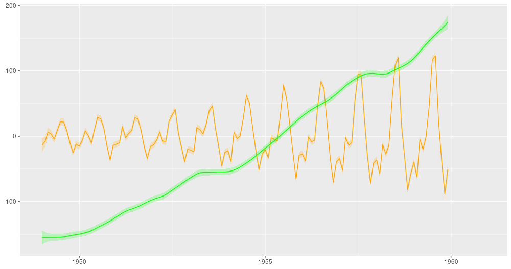

```{r setup, include=FALSE}
knitr::opts_chunk$set(echo = TRUE, eval = FALSE)
```


About a week ago, `tfprobability` 0.8 was accepted on CRAN. While we've been using this package quite frequently already on this blog, in this post we'd like to (re-)introduce it on a high level, especially addressing new users.

## tfprobability, what is it?

`tfprobability` is an R wrapper for [TensorFlow Probability](https://www.tensorflow.org/probability/), a Python library built on top of the [TensorFlow](https://www.tensorflow.org/) framework. So now the question is, what is TensorFlow Probability?

If -- let's call it "probabilistic programming" -- is not something you do every day, an enumeration of features, or even a hierarchical listing of modules as given on the [TensorFlow Probability website](https://www.tensorflow.org/probability/overview) might leave you a bit helpless, informative though it may be.

Let's start from use cases instead. We'll look at three high-level example scenarios, before rounding up with a quick tour of more basic building blocks provided by TFP. (Short note aside: We'll use _TFP_ as an acronym for the Python library as well as the R package, unless we're referring to the R wrapper specifically, in which case we'll say `tfprobability`).


## Use case 1: Extending deep learning

We start with the type of use case that might be the most interesting to the majority of our readers: extending deep learning.

### Distribution layers

In deep learning, usually output layers are deterministic. True, in classification we are used to talking about "class probabilities". Take the multi-class case: We may find ourselves quoting the network as saying, "with 80% probability this is a Bernese mountain dog" -- but we can only do this because the last layer's output has been squished, by a softmax activation, to values between $0$ and $1$. Nonetheless, the actual output is a tensor (a number).

TFP, however, augments TensorFlow by means of _distribution layers_: a hybrid species that can be used just like a normal TensorFlow/Keras layer but that, internally, contains the defining characteristics of some probability distribution. 

Concretely, for multi-class classification, we could use a categorical layer ([layer_one_hot_categorical](https://rstudio.github.io/tfprobability/reference/layer_one_hot_categorical.html)), replacing something like

```{r}
layer_dense(
  num_classes, 
  activation = "softmax"
)
```

by

```{r}
layer_one_hot_categorical(event_size = num_classes)
```


The model, thus modified, now outputs a distribution, not a tensor. However, it can still be trained passing "normal" target tensors. This is what was meant by _use like a normal layer_, above: TFP will take the distribution, obtain a tensor from it ^[By default, just sampling from the distribution -- but this is something the user can influence if desired, making use of the `convert_to_tensor_fn` argument.], and compare that to the target. The other side of the layer's personality is seen when generating predictions: Calling the model on fresh data will result in a bunch of distributions, one for every data point. You then call [tfd_mean](https://rstudio.github.io/tfprobability/reference/tfd_mean.html) to elicit actual predictions:

```{r}
pred_dists <- model(x_test)
pred_means <- pred_dists %>% tfd_mean()
```

You may be wondering, what good is this? One way or the other, we'll decide on picking the class with the highest probability, right?

Right, but there are a number of interesting things you can do with these layers.
We'll quickly introduce three well-known ones here, but wouldn't be surprised if we saw a lot more emerging in the near future.

### Variational autoencoders, the elegant way

Variational autoencoders are a prime example of something that got way easier to code when TF-2 style custom models and custom training appeared (TF-2 _style_, not TF-2, as these techniques actually became available more than a year before TF 2 was finally released). ^[See [Representation learning with MMD-VAE](https://blogs.rstudio.com/tensorflow/posts/2018-10-22-mmd-vae/) for an example.]

Evolutionarily, the next step was to use TFP distributions ^[Done so, for example, in [Getting started with TensorFlow Probability from R](https://blogs.rstudio.com/tensorflow/posts/2019-01-08-getting-started-with-tf-probability/).], but back in the time some fiddling was required, as distributions could not yet alias as layers.

Due to those hybrids though, we now can do something like this ^[For a complete running example, see the [tfprobability README](https://rstudio.github.io/tfprobability/).]:

```{r}
# encoder
encoder_model <- keras_model_sequential() %>%
  [...] %>%
  layer_multivariate_normal_tri_l(event_size = encoded_size) %>%
  layer_kl_divergence_add_loss([...])

# decoder
decoder_model <- keras_model_sequential() %>%
  [...] %>%
 layer_independent_bernoulli([...])

# complete VAE
vae_model <- keras_model(inputs = encoder_model$inputs,
                         outputs = decoder_model(encoder_model$outputs[1]))

# loss function
vae_loss <- function (x, rv_x) - (rv_x %>% tfd_log_prob(x))
```

Both the encoder and the decoder are "just" sequential models, joined through the functional API(`keras_model`). The loss is just the negative log-probability of the data given the model. So where is the other part of the (negative) ELBO, the KL divergence? It is implicit in the encoder's output layer, [layer_kl_divergence_add_loss](https://rstudio.github.io/tfprobability/reference/layer_kl_divergence_add_loss.html). 

Our two other examples involve quantifying uncertainty.

### Learning the spread in the data

If a model's last layer wraps a distribution parameterized by location and scale, like the normal distribution, we can train the network to learn not just the mean, but also the spread in the data:

```{r}
model <- keras_model_sequential() %>%
  layer_dense(units = 8, activation = "relu") %>%
  layer_dense(units = 2, activation = "linear") %>%
  layer_distribution_lambda(function(x)
    tfd_normal(# use unit 1 of previous layer
               loc = x[, 1, drop = FALSE],
               # use unit 2 of previous layer
               scale = 1e-3 + tf$math$softplus(x[, 2, drop = FALSE])
               )
  )
```

In essence, this means the network's predictions will reflect any existing heteroscedasticity in the data. Here is an example. Given simulated training data of shape

```{r, eval=TRUE, echo=FALSE, layout="l-body", fig.cap = "Simulated data (from https://blogs.rstudio.com/tensorflow/posts/2019-06-05-uncertainty-estimates-tfprobability/)"}
knitr::include_graphics("images/simdata.png")
```

the network's predictions show the same spread:

```{r, eval=TRUE, echo=FALSE, layout="l-body", fig.cap = "Aleatoric uncertainty on simulated data (from https://blogs.rstudio.com/tensorflow/posts/2019-06-05-uncertainty-estimates-tfprobability/) "}
knitr::include_graphics("images/g_aleatoric_relu_8.png")
```


Please see [Adding uncertainty estimates to Keras models with tfprobability](https://blogs.rstudio.com/tensorflow/posts/2019-06-05-uncertainty-estimates-tfprobability/) for a detailed explanation. 

Using a normal distribution layer as the output, we can capture irreducible variability in the data, also known as _aleatoric uncertainty_. A different type of probabilistic layer allows to model what is called _epistemic uncertainty_.

### Putting distributions over network weights

Using _variational layers_, we can make neural networks probabilistic.  A simple example could look like so:

```{r}
model <- keras_model_sequential() %>%
  layer_dense_variational(
    units = 1,
    make_posterior_fn = posterior_mean_field,
    make_prior_fn = prior_trainable,
    kl_weight = 1 / n
  ) %>%
  layer_distribution_lambda(function(x)
    tfd_normal(loc = x, scale = 1))
```

This defines a network with a single dense layer, containing a single neuron, that has a prior distribution put over its weights. The network will be trained to minimize the KL divergence between that prior and an approximate posterior weight distribution, as well as maximize the probability of the data under the posterior weights. (For details, please again see the aforementioned post.)

As a consequence of this setup, each test run will now yield different predictions. For the above simulated data, we might get an ensemble of predictions, like so:

```{r, eval=TRUE, echo=FALSE, layout="l-body", fig.cap = "Epistemic uncertainty on simulated data (from https://blogs.rstudio.com/tensorflow/posts/2019-06-05-uncertainty-estimates-tfprobability/) "}
knitr::include_graphics("images/g_epistemic_linear_kl150.png")
```


Variational layers for non-dense layers exist, and we'll see an example next week. Now let's move on to the next type of use cases, from big data to small data, in a way.

## Use case 2: Fitting Bayesian models with Monte Carlo methods

In sciences where data aren't abound, Markov Chain Monte Carlo (MCMC) methods are common. We've shown some examples how to this with TFP ([Tadpoles on TensorFlow: Hierarchical partial pooling with tfprobability](https://blogs.rstudio.com/tensorflow/posts/2019-05-06-tadpoles-on-tensorflow/), [Hierarchical partial pooling, continued: Varying slopes models with TensorFlow Probability](https://blogs.rstudio.com/tensorflow/posts/2019-05-24-varying-slopes/), [Modeling censored data with tfprobability](https://blogs.rstudio.com/tensorflow/posts/2019-07-31-censored-data/), best read in this order), as well as tried to explain, in an accessible way, some of the background ([On leapfrogs, crashing satellites, and going nuts: A very first conceptual introduction to Hamiltonian Monte Carlo](https://blogs.rstudio.com/tensorflow/posts/2019-10-03-intro-to-hmc/)). 

MCMC software may roughly be divided into two flavors: "low-level" and "high-level". Low-level software, like [Stan](https://mc-stan.org/) -- or TFP, for that matter -- requires you to write code in either some programming language, or in a DSL that is pretty close in syntax and semantics to an existing programming language. High-level tools, on the other hand, are DSLs that resemble the way you'd express a model using mathematical notation. (Put differently, the former read like C or Python; the latter read like LaTeX.)

In general, low-level software tends to offer more flexibility, while high-level interfaces may be more convenient to use and easier to learn. To start with MCMC in TFP, we recommend checking out the first of the posts listed above, [Tadpoles on TensorFlow: Hierarchical partial pooling with tfprobability](https://blogs.rstudio.com/tensorflow/posts/2019-05-06-tadpoles-on-tensorflow/). If you prefer a higher-level interface, you might be interested in [greta](https://greta-stats.org/), which is built on TFP.

Our last use case is of a Bayesian nature as well.

## Use case 3: State space models


State space models are a perhaps lesser used, but highly conceptually attractive way of performing inference and prediction on signals evolving in time. [Dynamic linear models with tfprobability](https://blogs.rstudio.com/tensorflow/posts/2019-06-25-dynamic_linear_models_tfprobability/) is an introduction to dynamic linear models with TFP, showcasing two of their (many) great strengths: ease of performing dynamic regression and additive (de)composition. 

In dynamic regression, coefficients are allowed to vary over time. Here is an example from the above-mentioned post showing, for both a single predictor and the regression intercept, the filtered (in the sense of Kálmán filtering) estimates over time:

```{r, eval=TRUE, echo=FALSE, layout="l-body", fig.cap = "Filtering estimates from the Kálmán filter (from: https://blogs.rstudio.com/tensorflow/posts/2019-06-25-dynamic_linear_models_tfprobability/)."}
knitr::include_graphics("images/capm_filtered.png")
```


And here is the ubiquitous _AirPassengers_ dataset, decomposed into a trend and a seasonal component:

```{r, eval=TRUE, echo=FALSE, layout="l-body", fig.cap = "AirPassengers, decomposition into a linear trend and a seasonal component (from: https://blogs.rstudio.com/tensorflow/posts/2019-06-25-dynamic_linear_models_tfprobability/)."}

```


If this interests you, you might want to take a look at [available state space models](https://rstudio.github.io/tfprobability/reference/index.html#section-structural-time-series-models). Given how rapidly TFP is evolving, plus the model-inherent composability, we expect the number of options in this area to grow quite a bit.

That is it for our tour of use cases. To wrap up, let's talk about the basic building blocks of TFP.

## The basics: Distributions and bijectors

No probabilistic framework without probability distributions -- that's for sure. In release 0.8, TFP has [about 80 distributions](https://rstudio.github.io/tfprobability/reference/index.html#section-distributions). But what are bijectors?

Bijectors are invertible, differentiable maps. [Getting into the flow: Bijectors in TensorFlow Probability](https://blogs.rstudio.com/tensorflow/posts/2019-04-05-bijectors-flows/) introduces the main ideas and shows how to chain such bijective transformations into a _flow_. Bijectors are being used by TFP internally all the time, and as a user too you'll likely encounter situations where you need them. 

One example is doing MCMC (for example, Hamiltonian Monte Carlo) with TFP. In your model, you might have a prior on a standard deviation. Standard deviations are positive, so you'd like to specify, for example, an exponential distribution for it, resulting in exclusively positive values. But Hamiltonian Monte Carlo has to run in unconstrained space to work. This is where a bijector comes in, mapping between the two spaces used for model specification and sampling.

For bijectors too, there are [many of them](https://rstudio.github.io/tfprobability/reference/index.html#section-bijectors) - about 40, ranging from straightforward affine maps to more complex operations on Cholesky factors or the discrete cosine transform.

To see both building blocks in action, let's end with a "Hello World" of TFP, or two, rather.
Here first is the direct way to obtain samples from a standard normal distribution.

```{r}
library(tfprobability)

# create a normal distribution
d <- tfd_normal(loc = 0, scale = 1)
# sample from it
d %>% tfd_sample(3)
```
```
tf.Tensor([-1.0863057  -0.61655647  1.8151687 ], shape=(3,), dtype=float32)
```

In case you thought that was too easy, here's how to do the same using a bijector instead of a distribution.

```{r}
# generate 3 values uniformly distributed between 0 and 1
u <- runif(3)

# a bijector that in the inverse direction, maps values between 0 and 1
# to a normal distribution
b <- tfb_normal_cdf()

# call bijector's inverse transform op
b %>% tfb_inverse(u) 
```


```
tf.Tensor([ 0.96157753  1.0103974  -1.4986734 ], shape=(3,), dtype=float32)
```

With this we conclude our introduction. If you run into problems using _tfprobability_, or have questions about it, please open an issue in the [github repo](https://github.com/rstudio/tfprobability).
Thanks for reading!


