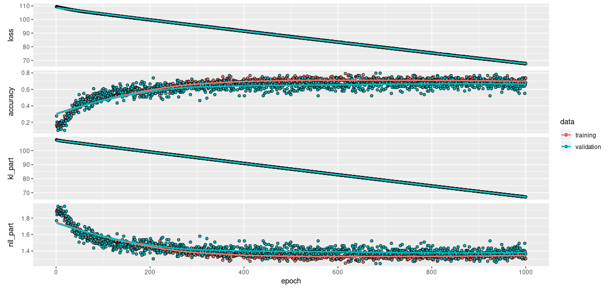

```{r setup, include=FALSE}
knitr::opts_chunk$set(echo = TRUE, eval = FALSE)
```


A bit more than a year ago, in his beautiful [guest post](https://blogs.rstudio.com/tensorflow/posts/2018-07-17-activity-detection/), Nick Strayer showed how to classify a set of everyday activities using smartphone-recorded gyroscope and accelerometer data. Accuracy was very good, but Nick went on to inspect classification results more closely. Were there activities more prone to misclassification than others? And how about those erroneous results: Did the network report them with equal, or less confidence than those that were correct?

Technically, when we speak of _confidence_ in that manner, we're referring to the _score_ obtained for the "winning" class after softmax activation ^[see [Winner takes all: A look at activations and cost functions](https://blogs.rstudio.com/tensorflow/posts/2018-10-11-activations-intro/)]. If that winning score is 0.9, we might say "the network is sure that's a gentoo penguin"; if it's 0.2, we'd instead conclude "to the network, neither option seemed fitting, but cheetah looked best".

This use of "confidence" is convincing, but it has nothing to do with confidence -- or credibility, or prediction, what have you -- intervals. What we'd really like to be able to do is put distributions over the network's weights and make it _Bayesian_. Using _tfprobability_'s variational Keras-compatible layers, this is something we actually can do.

[Adding uncertainty estimates to Keras models with tfprobability](https://blogs.rstudio.com/tensorflow/posts/2019-06-05-uncertainty-estimates-tfprobability/) shows how to use a variational dense layer to obtain estimates of epistemic uncertainty. In this post, we modify the convnet used in Nick's post to be variational throughout. Before we start, let's quickly summarize the task.

## The task

To create the [Smartphone-Based Recognition of Human Activities and Postural Transitions Data Set](http://archive.ics.uci.edu/ml/datasets/Smartphone-Based+Recognition+of+Human+Activities+and+Postural+Transitions) [@Reyes-Ortiz], the researchers had subjects walk, sit, stand, and transition from one of those activities to another. Meanwhile, two types of smartphone sensors were used to record motion data: _Accelerometers_ measure linear acceleration in three ^[or two, depending on the application] dimensions, while _gyroscopes_ are used to track angular velocity around the coordinate axes. Here are the respective raw sensor data for six types of activities from Nick's original post:

```{r, eval=TRUE, echo=FALSE, layout="l-body-outset", fig.cap = "Source: https://blogs.rstudio.com/tensorflow/posts/2018-07-17-activity-detection/"}
knitr::include_graphics("images/raw-data.png")
```

Just like Nick, we're going to zoom in on those six types of activity, and try to infer them from the sensor data. Some data wrangling is needed to get the dataset into a form we can work with; here we'll build on Nick's post, and effectively start from the data nicely pre-processed and split up into training and test sets:

```{r}
trainData %>% glimpse()
```

```
Observations: 289
Variables: 6
$ experiment    <int> 1, 2, 3, 4, 5, 6, 7, 8, 9, 10, 13, 14, 17, 18, 19, 2…
$ userId        <int> 1, 1, 2, 2, 3, 3, 4, 4, 5, 5, 7, 7, 9, 9, 10, 10, 11…
$ activity      <int> 7, 7, 7, 7, 7, 7, 7, 7, 7, 7, 7, 7, 7, 7, 7, 7, 7, 7…
$ data          <list> [<data.frame[160 x 6]>, <data.frame[206 x 6]>, <dat…
$ activityName  <fct> STAND_TO_SIT, STAND_TO_SIT, STAND_TO_SIT, STAND_TO_S…
$ observationId <int> 1, 2, 3, 4, 5, 6, 7, 8, 9, 10, 13, 14, 17, 18, 19, 2…
```

```{r}
testData %>% glimpse()
```

```
Observations: 69
Variables: 6
$ experiment    <int> 11, 12, 15, 16, 32, 33, 42, 43, 52, 53, 56, 57, 11, …
$ userId        <int> 6, 6, 8, 8, 16, 16, 21, 21, 26, 26, 28, 28, 6, 6, 8,…
$ activity      <int> 7, 7, 7, 7, 7, 7, 7, 7, 7, 7, 7, 7, 8, 8, 8, 8, 8, 8…
$ data          <list> [<data.frame[185 x 6]>, <data.frame[151 x 6]>, <dat…
$ activityName  <fct> STAND_TO_SIT, STAND_TO_SIT, STAND_TO_SIT, STAND_TO_S…
$ observationId <int> 11, 12, 15, 16, 31, 32, 41, 42, 51, 52, 55, 56, 71, …
```


The code required to arrive at this stage (copied from Nick's post) may be found in the appendix at the bottom of this page.

## Training pipeline

The dataset in question is small enough to fit in memory -- but yours might not be, so it can't hurt to see some streaming in action. Besides, it's probably safe to say that with TensorFlow 2.0, [tfdatasets](https://tensorflow.rstudio.com/tools/tfdatasets/articles/introduction.html) pipelines are _the_ way to feed data to a model.

Once the code listed in the appendix has run, the sensor data is to be found in `trainData$data`, a list column containing `data.frame`s where each row corresponds to a point in time and each column holds one of the measurements. However, not all time series (recordings) are of the same length; we thus follow the original post to pad all series to length `pad_size` (= 338). The expected shape of training batches will then be `(batch_size, pad_size, 6)`.

We initially create our training dataset:

```{r}
train_x <- train_data$data %>% 
  map(as.matrix) %>%
  pad_sequences(maxlen = pad_size, dtype = "float32") %>%
  tensor_slices_dataset() 

train_y <- train_data$activity %>% 
  one_hot_classes() %>% 
  tensor_slices_dataset()

train_dataset <- zip_datasets(train_x, train_y)
train_dataset
```

```
<ZipDataset shapes: ((338, 6), (6,)), types: (tf.float64, tf.float64)>
```

Then shuffle and batch it:


```{r}
n_train <- nrow(train_data)
# the highest possible batch size for this dataset
# chosen because it yielded the best performance
# alternatively, experiment with e.g. different learning rates, ...
batch_size <- n_train

train_dataset <- train_dataset %>% 
  dataset_shuffle(n_train) %>%
  dataset_batch(batch_size)
train_dataset
```

```
<BatchDataset shapes: ((None, 338, 6), (None, 6)), types: (tf.float64, tf.float64)>
```


Same for the test data.

```{r}
test_x <- test_data$data %>% 
  map(as.matrix) %>%
  pad_sequences(maxlen = pad_size, dtype = "float32") %>%
  tensor_slices_dataset() 

test_y <- test_data$activity %>% 
  one_hot_classes() %>% 
  tensor_slices_dataset()

n_test <- nrow(test_data)
test_dataset <- zip_datasets(test_x, test_y) %>%
  dataset_batch(n_test)

```

Using `tfdatasets` does not mean we cannot run a quick sanity check on our data:

```{r}
first <- test_dataset %>% 
  reticulate::as_iterator() %>% 
  # get first batch (= whole test set, in our case)
  reticulate::iter_next() %>%
  # predictors only
  .[[1]] %>% 
  # first item in batch
  .[1,,]
first
```


```
tf.Tensor(
[[ 0.          0.          0.          0.          0.          0.        ]
 [ 0.          0.          0.          0.          0.          0.        ]
 [ 0.          0.          0.          0.          0.          0.        ]
 ...
 [ 1.00416672  0.2375      0.12916666 -0.40225476 -0.20463985 -0.14782938]
 [ 1.04166663  0.26944447  0.12777779 -0.26755899 -0.02779437 -0.1441642 ]
 [ 1.0250001   0.27083334  0.15277778 -0.19639318  0.35094208 -0.16249016]],
 shape=(338, 6), dtype=float64)
```

Now let's build the network.

## A variational convnet

We build on the straightforward convolutional architecture from Nick's post, just making minor modifications to kernel sizes and numbers of filters. We also throw out all dropout layers; no additional regularization is needed on top of the priors applied to the weights.

Note the following about the "Bayesified" network. 

- Each layer is variational in nature, the convolutional ones ([layer_conv_1d_flipout](https://rstudio.github.io/tfprobability/reference/layer_conv_1d_flipout.html)) as well as the dense layers ([layer_dense_flipout](https://rstudio.github.io/tfprobability/reference/layer_dense_flipout.html)). 

- With variational layers, we can specify the prior weight distribution as well as the form of the posterior; here the defaults are used, resulting in a standard normal prior and a default mean-field posterior.

- Likewise, the user may influence the divergence function used to assess the mismatch between prior and posterior; in this case, we actually take some action: We scale the (default) KL divergence by the number of samples in the training set.

- One last thing to note is the output layer. It is a distribution layer, that is, a layer wrapping a distribution -- where wrapping means: Training the network is business as usual, but predictions are _distributions_, one for each data point. 


```{r}
library(tfprobability)

num_classes <- 6

# scale the KL divergence by number of training examples
n <- n_train %>% tf$cast(tf$float32)
kl_div <- function(q, p, unused)
  tfd_kl_divergence(q, p) / n

model <- keras_model_sequential()
model %>% 
  layer_conv_1d_flipout(
    filters = 12,
    kernel_size = 3, 
    activation = "relu",
    kernel_divergence_fn = kl_div
  ) %>%
  layer_conv_1d_flipout(
    filters = 24,
    kernel_size = 5, 
    activation = "relu",
    kernel_divergence_fn = kl_div
  ) %>%
  layer_conv_1d_flipout(
    filters = 48,
    kernel_size = 7, 
    activation = "relu",
    kernel_divergence_fn = kl_div
  ) %>%
  layer_global_average_pooling_1d() %>% 
  layer_dense_flipout(
    units = 48,
    activation = "relu",
    kernel_divergence_fn = kl_div
  ) %>% 
  layer_dense_flipout(
    num_classes, 
    kernel_divergence_fn = kl_div,
    name = "dense_output"
  ) %>%
  layer_one_hot_categorical(event_size = num_classes)
```

We tell the network to minimize the negative log likelihood.

```{r}
nll <- function(y, model) - (model %>% tfd_log_prob(y))
```

This will become part of the loss. The way we set up this example, this is not its most substantial part though. Here, what dominates the loss is the sum of the KL divergences, added (automatically) to `model$losses`.

In a setup like this, it's interesting to monitor both parts of the loss separately. We can do this by means of two metrics:

```{r}
# the KL part of the loss
kl_part <-  function(y_true, y_pred) {
    kl <- tf$reduce_sum(model$losses)
    kl
}

# the NLL part
nll_part <- function(y_true, y_pred) {
    cat_dist <- tfd_one_hot_categorical(logits = y_pred)
    nll <- - (cat_dist %>% tfd_log_prob(y_true) %>% tf$reduce_mean())
    nll
}
```

We train somewhat longer than Nick did in the original post, allowing for early stopping though. 

```{r}
model %>% compile(
  optimizer = "rmsprop",
  loss = nll,
  metrics = c("accuracy", 
              custom_metric("kl_part", kl_part),
              custom_metric("nll_part", nll_part)),
  experimental_run_tf_function = FALSE
)

train_history <- model %>% fit(
  train_dataset,
  epochs = 1000,
  validation_data = test_dataset,
  callbacks = list(
    callback_early_stopping(patience = 10)
  )
)
```

While the overall loss declines linearly (and probably would for many more epochs), this is not the case for classification accuracy or the NLL part of the loss:


```{r, eval=TRUE, echo=FALSE, layout="l-body-outset", fig.cap = ""}

```

Final accuracy is not as high as in the non-variational setup, though still not bad for a six-class problem. We see that without any additional regularization, there is very little overfitting to the training data.

Now how do we obtain predictions from this model?

## Probabilistic predictions

Though we won't go into this here, it's good to know that we access more than just the output distributions; through their `kernel_posterior` attribute, we can access the hidden layers' posterior weight distributions as well. 

Given the small size of the test set, we compute all predictions at once. The predictions are now categorical distributions, one for each sample in the batch: 


```{r}
test_data_all <- dataset_collect(test_dataset) %>% { .[[1]][[1]]}

one_shot_preds <- model(test_data_all) 

one_shot_preds
```

```
tfp.distributions.OneHotCategorical(
 "sequential_one_hot_categorical_OneHotCategorical_OneHotCategorical",
 batch_shape=[69], event_shape=[6], dtype=float32)
```

We prefixed those predictions with `one_shot` to indicate their noisy nature: These are predictions obtained on a single pass through the network, all layer weights being sampled from their respective posteriors.

From the predicted distributions, we calculate mean and standard deviation _per (test) sample_.

```{r}
one_shot_means <- tfd_mean(one_shot_preds) %>% 
  as.matrix() %>%
  as_tibble() %>% 
  mutate(obs = 1:n()) %>% 
  gather(class, mean, -obs) 

one_shot_sds <- tfd_stddev(one_shot_preds) %>% 
  as.matrix() %>%
  as_tibble() %>% 
  mutate(obs = 1:n()) %>% 
  gather(class, sd, -obs) 
```

The standard deviations thus obtained could be said to reflect the overall _predictive uncertainty_. We can estimate another kind of uncertainty, called _epistemic_ ^[see [Adding uncertainty estimates to Keras models with tfprobability](https://blogs.rstudio.com/tensorflow/posts/2019-06-05-uncertainty-estimates-tfprobability/)], by making a number of passes through the network and then, calculating -- again, per test sample -- the standard deviations of the predicted means.


```{r}
mc_preds <- purrr::map(1:100, function(x) {
  preds <- model(test_data_all)
  tfd_mean(preds) %>% as.matrix()
})

mc_sds <- abind::abind(mc_preds, along = 3) %>% 
  apply(c(1,2), sd) %>% 
  as_tibble() %>%
  mutate(obs = 1:n()) %>% 
  gather(class, mc_sd, -obs) 
```


Putting it all together, we have

```{r}
pred_data <- one_shot_means %>%
  inner_join(one_shot_sds, by = c("obs", "class")) %>% 
  inner_join(mc_sds, by = c("obs", "class")) %>% 
  right_join(one_hot_to_label, by = "class") %>% 
  arrange(obs)

pred_data
```

```
# A tibble: 414 x 6
     obs class       mean      sd    mc_sd label       
   <int> <chr>      <dbl>   <dbl>    <dbl> <fct>       
 1     1 V1    0.945      0.227   0.0743   STAND_TO_SIT
 2     1 V2    0.0534     0.225   0.0675   SIT_TO_STAND
 3     1 V3    0.00114    0.0338  0.0346   SIT_TO_LIE  
 4     1 V4    0.00000238 0.00154 0.000336 LIE_TO_SIT  
 5     1 V5    0.0000132  0.00363 0.00164  STAND_TO_LIE
 6     1 V6    0.0000305  0.00553 0.00398  LIE_TO_STAND
 7     2 V1    0.993      0.0813  0.149    STAND_TO_SIT
 8     2 V2    0.00153    0.0390  0.102    SIT_TO_STAND
 9     2 V3    0.00476    0.0688  0.108    SIT_TO_LIE  
10     2 V4    0.00000172 0.00131 0.000613 LIE_TO_SIT  
# … with 404 more rows
```

Comparing predictions to the ground truth:

```{r}
eval_table <- pred_data %>% 
  group_by(obs) %>% 
  summarise(
    maxprob = max(mean),
    maxprob_sd = sd[mean == maxprob],
    maxprob_mc_sd = mc_sd[mean == maxprob],
    predicted = label[mean == maxprob]
  ) %>% 
  mutate(
    truth = test_data$activityName,
    correct = truth == predicted
  ) 

eval_table %>% print(n = 20)
```

```
# A tibble: 69 x 7
     obs maxprob maxprob_sd maxprob_mc_sd predicted    truth        correct
   <int>   <dbl>      <dbl>         <dbl> <fct>        <fct>        <lgl>  
 1     1   0.945     0.227         0.0743 STAND_TO_SIT STAND_TO_SIT TRUE   
 2     2   0.993     0.0813        0.149  STAND_TO_SIT STAND_TO_SIT TRUE   
 3     3   0.733     0.443         0.131  STAND_TO_SIT STAND_TO_SIT TRUE   
 4     4   0.796     0.403         0.138  STAND_TO_SIT STAND_TO_SIT TRUE   
 5     5   0.843     0.364         0.358  SIT_TO_STAND STAND_TO_SIT FALSE  
 6     6   0.816     0.387         0.176  SIT_TO_STAND STAND_TO_SIT FALSE  
 7     7   0.600     0.490         0.370  STAND_TO_SIT STAND_TO_SIT TRUE   
 8     8   0.941     0.236         0.0851 STAND_TO_SIT STAND_TO_SIT TRUE   
 9     9   0.853     0.355         0.274  SIT_TO_STAND STAND_TO_SIT FALSE  
10    10   0.961     0.195         0.195  STAND_TO_SIT STAND_TO_SIT TRUE   
11    11   0.918     0.275         0.168  STAND_TO_SIT STAND_TO_SIT TRUE   
12    12   0.957     0.203         0.150  STAND_TO_SIT STAND_TO_SIT TRUE   
13    13   0.987     0.114         0.188  SIT_TO_STAND SIT_TO_STAND TRUE   
14    14   0.974     0.160         0.248  SIT_TO_STAND SIT_TO_STAND TRUE   
15    15   0.996     0.0657        0.0534 SIT_TO_STAND SIT_TO_STAND TRUE   
16    16   0.886     0.318         0.0868 SIT_TO_STAND SIT_TO_STAND TRUE   
17    17   0.773     0.419         0.173  SIT_TO_STAND SIT_TO_STAND TRUE   
18    18   0.998     0.0444        0.222  SIT_TO_STAND SIT_TO_STAND TRUE   
19    19   0.885     0.319         0.161  SIT_TO_STAND SIT_TO_STAND TRUE   
20    20   0.930     0.255         0.271  SIT_TO_STAND SIT_TO_STAND TRUE   
# … with 49 more rows
```

Are standard deviations higher for misclassifications?

```{r}
eval_table %>% 
  group_by(truth, predicted) %>% 
  summarise(avg_mean = mean(maxprob),
            avg_sd = mean(maxprob_sd),
            avg_mc_sd = mean(maxprob_mc_sd)) %>% 
  mutate(correct = truth == predicted) %>%
  arrange(avg_mc_sd) 
```

```
# A tibble: 2 x 5
  correct count avg_mean avg_sd avg_mc_sd
  <lgl>   <int>    <dbl>  <dbl>     <dbl>
1 FALSE      19    0.775  0.380     0.237
2 TRUE       50    0.879  0.264     0.183
```

They are; though perhaps not to the extent we might desire.

With just six classes, we can also inspect standard deviations on the individual prediction-target pairings level.

```{r}
eval_table %>% 
  group_by(truth, predicted) %>% 
  summarise(cnt = n(),
            avg_mean = mean(maxprob),
            avg_sd = mean(maxprob_sd),
            avg_mc_sd = mean(maxprob_mc_sd)) %>% 
  mutate(correct = truth == predicted) %>%
  arrange(desc(cnt), avg_mc_sd) 
```


```
# A tibble: 14 x 7
# Groups:   truth [6]
   truth        predicted      cnt avg_mean avg_sd avg_mc_sd correct
   <fct>        <fct>        <int>    <dbl>  <dbl>     <dbl> <lgl>  
 1 SIT_TO_STAND SIT_TO_STAND    12    0.935  0.205    0.184  TRUE   
 2 STAND_TO_SIT STAND_TO_SIT     9    0.871  0.284    0.162  TRUE   
 3 LIE_TO_SIT   LIE_TO_SIT       9    0.765  0.377    0.216  TRUE   
 4 SIT_TO_LIE   SIT_TO_LIE       8    0.908  0.254    0.187  TRUE   
 5 STAND_TO_LIE STAND_TO_LIE     7    0.956  0.144    0.132  TRUE   
 6 LIE_TO_STAND LIE_TO_STAND     5    0.809  0.353    0.227  TRUE   
 7 SIT_TO_LIE   STAND_TO_LIE     4    0.685  0.436    0.233  FALSE  
 8 LIE_TO_STAND SIT_TO_STAND     4    0.909  0.271    0.282  FALSE  
 9 STAND_TO_LIE SIT_TO_LIE       3    0.852  0.337    0.238  FALSE  
10 STAND_TO_SIT SIT_TO_STAND     3    0.837  0.368    0.269  FALSE  
11 LIE_TO_STAND LIE_TO_SIT       2    0.689  0.454    0.233  FALSE  
12 LIE_TO_SIT   STAND_TO_SIT     1    0.548  0.498    0.0805 FALSE  
13 SIT_TO_STAND LIE_TO_STAND     1    0.530  0.499    0.134  FALSE  
14 LIE_TO_SIT   LIE_TO_STAND     1    0.824  0.381    0.231  FALSE  
```

Again, we see higher standard deviations for wrong predictions, but not to a high degree.

## Conclusion

We've shown how to build, train, and obtain predictions from a fully variational convnet. Evidently, there is room for experimentation: Alternative layer implementations exist^[e.g.,  [layer_conv_1d_reparameterization](https://rstudio.github.io/tfprobability/reference/layer_conv_1d_reparameterization.html), [layer_dense_local_reparameterization](https://rstudio.github.io/tfprobability/reference/layer_dense_local_reparameterization.html)]; a different prior could be specified; the divergence could be calculated differently; and the usual neural network hyperparameter tuning options apply.

Then, there's the question of consequences (or: decision making). What is going to happen in high-uncertainty cases, what even is a high-uncertainty case? Naturally, questions like these are out-of-scope for this post, yet of essential importance in real-world applications. 
Thanks for reading!


### Appendix 

To be executed before running this post's code. Copied from [Classifying physical activity from smartphone data](https://blogs.rstudio.com/tensorflow/posts/2018-07-17-activity-detection/).

```{r}
library(keras)     
library(tidyverse) 

activity_labels <- read.table("data/activity_labels.txt", 
                             col.names = c("number", "label")) 

one_hot_to_label <- activity_labels %>% 
  mutate(number = number - 7) %>% 
  filter(number >= 0) %>% 
  mutate(class = paste0("V",number + 1)) %>% 
  select(-number)

labels <- read.table(
  "data/RawData/labels.txt",
  col.names = c("experiment", "userId", "activity", "startPos", "endPos")
)

dataFiles <- list.files("data/RawData")
dataFiles %>% head()

fileInfo <- data_frame(
  filePath = dataFiles
) %>%
  filter(filePath != "labels.txt") %>%
  separate(filePath, sep = '_',
           into = c("type", "experiment", "userId"),
           remove = FALSE) %>%
  mutate(
    experiment = str_remove(experiment, "exp"),
    userId = str_remove_all(userId, "user|\\.txt")
  ) %>%
  spread(type, filePath)

# Read contents of single file to a dataframe with accelerometer and gyro data.
readInData <- function(experiment, userId){
  genFilePath = function(type) {
    paste0("data/RawData/", type, "_exp",experiment, "_user", userId, ".txt")
  }
  bind_cols(
    read.table(genFilePath("acc"), col.names = c("a_x", "a_y", "a_z")),
    read.table(genFilePath("gyro"), col.names = c("g_x", "g_y", "g_z"))
  )
}

# Function to read a given file and get the observations contained along
# with their classes.
loadFileData <- function(curExperiment, curUserId) {

  # load sensor data from file into dataframe
  allData <- readInData(curExperiment, curUserId)
  extractObservation <- function(startPos, endPos){
    allData[startPos:endPos,]
  }

  # get observation locations in this file from labels dataframe
  dataLabels <- labels %>%
    filter(userId == as.integer(curUserId),
           experiment == as.integer(curExperiment))

  # extract observations as dataframes and save as a column in dataframe.
  dataLabels %>%
    mutate(
      data = map2(startPos, endPos, extractObservation)
    ) %>%
    select(-startPos, -endPos)
}

# scan through all experiment and userId combos and gather data into a dataframe.
allObservations <- map2_df(fileInfo$experiment, fileInfo$userId, loadFileData) %>%
  right_join(activityLabels, by = c("activity" = "number")) %>%
  rename(activityName = label)

write_rds(allObservations, "allObservations.rds")

allObservations <- readRDS("allObservations.rds")

desiredActivities <- c(
  "STAND_TO_SIT", "SIT_TO_STAND", "SIT_TO_LIE", 
  "LIE_TO_SIT", "STAND_TO_LIE", "LIE_TO_STAND"  
)

filteredObservations <- allObservations %>% 
  filter(activityName %in% desiredActivities) %>% 
  mutate(observationId = 1:n())

# get all users
userIds <- allObservations$userId %>% unique()

# randomly choose 24 (80% of 30 individuals) for training
set.seed(42) # seed for reproducibility
trainIds <- sample(userIds, size = 24)

# set the rest of the users to the testing set
testIds <- setdiff(userIds,trainIds)

# filter data. 
# note S.K.: renamed to train_data for consistency with 
# variable naming used in this post
train_data <- filteredObservations %>% 
  filter(userId %in% trainIds)

# note S.K.: renamed to test_data for consistency with 
# variable naming used in this post
test_data <- filteredObservations %>% 
  filter(userId %in% testIds)

# note S.K.: renamed to pad_size for consistency with 
# variable naming used in this post
pad_size <- trainData$data %>% 
  map_int(nrow) %>% 
  quantile(p = 0.98) %>% 
  ceiling()

# note S.K.: renamed to one_hot_classes for consistency with 
# variable naming used in this post
one_hot_classes <- . %>% 
  {. - 7} %>%        # bring integers down to 0-6 from 7-12
  to_categorical()   # One-hot encode


```

