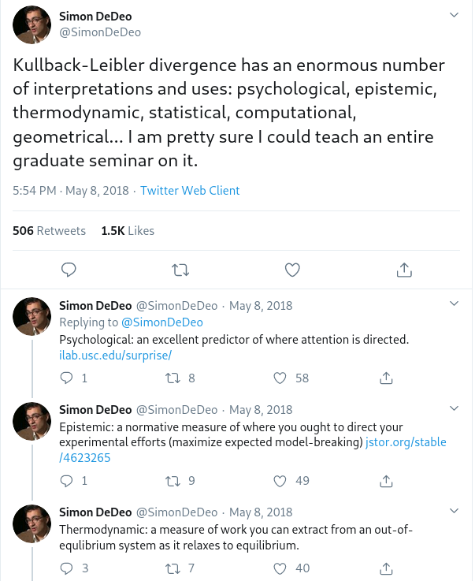

```{r setup, include=FALSE}
knitr::opts_chunk$set(echo = TRUE, eval = FALSE)
```

Among deep learning practitioners, _Kullback-Leibler divergence_ (KL divergence) is perhaps best known for its role in training variational autoencoders (VAEs) ^[See [Representation learning with MMD-VAE](https://blogs.rstudio.com/tensorflow/posts/2018-10-22-mmd-vae/) for an introduction.]. To learn an informative latent space, we don't just optimize for good reconstruction. Rather, we also impose a prior on the latent distribution, and aim to keep them close -- often, by minimizing KL divergence. 

In this role, KL divergence acts like a watchdog; it is a constraining, regularizing factor, and if anthropomorphized, would seem stern and severe. If we leave it at that, however, we've seen just one side of its character, and are missing out on its complement, a picture of playfulness, adventure, and curiosity. In this post, we'll take a look at that other side.

While being inspired by a series of tweets by Simon de Deo, enumerating applications of KL divergence in a vast number of disciplines,





we don't aspire to provide a comprehensive write-up here -- as mentioned in the initial tweet, the topic could easily fill a whole semester of study.

The much more modest goals of this post, then, are

(1) to quickly recap the role of KL divergence in training VAEs, and mention similar-in-character applications;
(2) to illustrate that more playful, adventurous "other side" of its character;^[As you probably guessed, these epitheta are not to be taken entirely seriously...] and
(3) in a not-so-entertaining, but -- hopefully -- useful manner, differentiate KL divergence from related concepts such as cross entropy, mutual information, or free energy.

Before though, we start with a definition and some terminology.

## KL divergence in a nutshell

KL divergence is the expected value of the logarithmic difference in probabilities according to two distributions, $p$ and $q$. Here it is in its discrete-probabilities variant:  

\begin{equation}
D_{KL}(p||q) = \sum\limits_{x} p(x) log(\frac{p(x)}{q(x)})
 (\#eq:1)
\end{equation}

Notably, it is asymmetric; that is, $D_{KL}(p||q)$ is not the same as $D_{KL}(q||p)$. (Which is why it is a _divergence_, not a _distance_.) This aspect will play an important role in section 2 dedicated to the "other side".

To stress this asymmetry, KL divergence is sometimes called _relative information_ (as in "information of $p$ relative to $q$"), or _information gain_. We agree with one of our sources ^[John Baez, whom we cite below when discussing free energy.] that because of its universality and importance, KL divergence would probably have deserved a more informative name; such as, precisely, _information gain_. (Which is less ambiguous pronunciation-wise, as well.)

## KL divergence, "villain" 

In many machine learning algorithms, KL divergence appears in the context of _variational inference_. Often, for realistic data, exact computation of the posterior distribution is  infeasible. Thus, some form of approximation is required. In variational inference, the true posterior $p^*$ is approximated by a simpler distribution, $q$, from some tractable family.
To ensure we have a good approximation, we minimize -- in theory, at least -- the KL divergence of $q$ relative to $p^*$, thus replacing inference by optimization.

In practice, again for reasons of intractability, the KL divergence minimized is that of $q$ relative to an unnormalized distribution $\widetilde{p}$


\begin{equation}
J(q)\ = D_{KL}(q||\widetilde{p})
 (\#eq:2)
\end{equation}


where $\widetilde{p}$ is the joint distribution of parameters and data:

\begin{equation}
\widetilde{p}(\mathbf{x}) = p(\mathbf{x}, \mathcal{D}) = p^*(\mathbf{x}) \ p(\mathcal{D})
 (\#eq:3)
\end{equation}

and $p^*$ is the true posterior:

\begin{equation}
p^*(\mathbf{x}) = p(\mathbf{x}|\mathcal{D})
 (\#eq:4)
\end{equation}

Equivalent to that formulation (eq. \@ref(eq:2)) -- for a derivation see [@Murphy-2012] -- is this, which shows the optimization objective to be an upper bound on the negative log-likelihood (NLL):


\begin{equation}
J(q)\ =  D_{KL}(q||p^*) - log \ p(D)
 (\#eq:5)
\end{equation}
 
Yet another formulation -- again, see [@Murphy-2012] for details -- is the one we actually use when training (e.g.) VAEs. This one corresponds to the expected NLL plus the KL divergence between the approximation $q$ and the imposed _prior_ $p$:

\begin{equation}
J(q)\ =  D_{KL}(q||p) - E_q[- log \ p(\mathcal{D}|\mathbf{x})]
 (\#eq:6)
\end{equation}

Negated, this formulation is also called the _ELBO_, for _evidence lower bound_. In the VAE post cited above, the ELBO was written

\begin{equation}
ELBO\ = \ E[log\ p(x|z)]\ -\ KL(q(z)||p(z))
 (\#eq:7)
\end{equation}

with $z$ denoting the latent variables ($q(z)$ being the approximation, $p(z)$ the prior, often a multivariate normal). 

### Beyond VAEs

Generalizing this "conservative" action pattern of KL divergence beyond VAEs, we can say that it expresses the quality of approximations. An important area where approximation takes place is (lossy) _compression_. KL divergence provides a way to quantify how much information is lost when we compress data.

Summing up, in these and similar applications, KL divergence is "bad" -- although we don't want it to be zero (or else, why bother using the algorithm?), we certainly want to keep it low. So now, let's see the other side.


## KL divergence, good guy

In a second category of applications, KL divergence is not something to be minimized. ^[Not, by contrast, something to be maximized either. Rather, depending on the domain, there will probably be an "optimal" amount of KL divergence for the related behavior to ensue.] In these domains, KL divergence is indicative of surprise, disagreement, exploratory behavior, or learning: This truly is the perspective of _information gain_.

### Surprise

One domain where _surprise_, not information per se, governs behavior is perception. For example, eyetracking studies (e.g., [@IttiB05]) showed that surprise, as measured by KL divergence, was a better predictor of visual attention than information, measured by entropy ^[We discuss entropy in section 3.]. While these studies seem to have popularized the expression "Bayesian surprise", this compound is -- I think -- not the most informative one, as neither part adds much information to the other. In Bayesian updating, the magnitude of the difference between prior and posterior reflects the degree of _surprise_ brought about by the data -- surprise is an integral part of the concept.

Thus, with KL divergence linked to surprise, and surprise rooted in the fundamental process of Bayesian updating, a process that could be used to describe the course of life itself, KL divergence itself becomes fundamental. We could get tempted to see it everywhere. Accordingly, it has been used in many fields to quantify unidirectional divergence.

For example, [@Zanardo2017HOWTM] have applied it in trading, measuring how much a person disagrees with the market belief. Higher disagreement then corresponds to higher expected gains from betting against the market.

Closer to the area of deep learning, it is used in intrinsically motivated reinforcement learning (e.g., [@abs-1103-5708]), where an optimal policy should maximize the long-term information gain. This is possible because like entropy, KL divergence is additive.

Although its asymmetry is relevant whether you use KL divergence for regularization (section 1) or surprise (this section), it becomes especially evident when used for learning and surprise.

### Asymmetry in action

Looking again at the KL formula

\begin{equation}
D_{KL}(p||q) = \sum\limits_{x} p(x) log(\frac{p(x)}{q(x)})
 (\#eq:1)
\end{equation}

the roles of $p$ and $q$ are fundamentally different. For one, the expectation is computed over the first distribution ($p$ in \@ref(eq:1)). This aspect is important because the "order" (the respective roles) of $p$ and $q$ may have to be chosen according to tractability (which distribution are we able to average over).

Secondly, the fraction inside the $log$ means that if $q$ is ever zero at a point where $p$ isn't, the KL divergence will "blow up". What this means for distribution estimation in general is nicely detailed in @Murphy-2012. In the context of surprise, it means that if I learn something I used to think had probability zero, I will be "infinitely surprised".

To avoid infinite surprise, we can make sure our prior probability is never zero. But even then, the interesting thing is that how much information we gain in any one event depends on _how much information I had before_. Let's see a simple example.

Assume that in my current understanding of the world, black swans probably don't exist, but they could ... maybe 1 percent of them is black. Put differently, my prior belief of a swan, should I encounter one, being black is $q = 0.01$. 

Now in fact I _do_ encounter one, and it's black.
The information I've gained is:

\begin{equation}
l(p,q) = 0 * log(\frac{0}{0.99}) + 1 * log(\frac{1}{0.01}) = 6.6 \ bits
 (\#eq:8)
\end{equation}

Conversely, suppose I'd been much more undecided before; say I'd have thought the odds were 50:50.
On seeing a black swan, I get a lot less information:

\begin{equation}
l(p,q) = 0 * log(\frac{0}{0.5}) + 1 * log(\frac{1}{0.5}) = 1 \ bit
 (\#eq:9)
\end{equation}

This view of KL divergence, in terms of surprise and learning, is inspiring -- it could lead one to seeing it in action everywhere. However, we still have the third and final task to handle: quickly compare KL divergence to other concepts in the area.  

## Related concepts

### Entropy

It all starts with entropy, or _uncertainty_, or _information_, as formulated by Claude Shannon.
Entropy is the average log probability of a distribution:

\begin{equation}
H(X) = - \sum\limits_{x=1}^n p(x_i) log(p(x_i))
 (\#eq:10)
\end{equation}

As nicely described in [@DeDeo_2016vy], this formulation was chosen to satisfy four criteria, one of which is what we commonly picture as its "essence", and one of which is especially interesting.

As to the former, if there are $n$ possible states, entropy is maximal when all states are equiprobable. E.g., for a coin flip uncertainty is highest when coin bias is 0.5.

The latter has to do with _coarse-graining_, a change in "resolution" of the state space. Say we have 16 possible states, but we don't really care at that level of detail. We do care about 3 individual states, but all the rest are basically the same to us. Then entropy decomposes additively; total (fine-grained) entropy is the entropy of the coarse-grained space, plus the entropy of the "lumped-together" group, weighted by their probabilities.^[See @DeDeo_2016vy for details.]

Subjectively, entropy reflects our uncertainty whether an event will happen. Interestingly though, it exists in the physical world as well: For example, when ice melts, it becomes more uncertain where individual particles are. As reported by [@DeDeo_2016vy], the number of bits released when one gram of ice melts is about 100 billion terabytes!

As fascinating as it is, information per se may, in many cases, not be the best means of characterizing human behavior. Going back to the eyetracking example, it is completely intuitive that people look at surprising parts of images, not at white noise areas, which are the maximum you could get in terms of entropy.

As a deep learning practitioner, you've probably been waiting for the point at which we'd mention _cross entropy_ -- the most commonly used loss function in categorization.

### Cross entropy

The cross entropy between distributions $p$ and $q$ is the entropy of $p$ plus the KL divergence of $p$ relative to $q$. If you've ever implemented your own classification network, you probably recognize the sum on the very right:

\begin{equation}
H(p,q) = H(p) + D_{KL}(p||q) = - \sum p \ log(q)
 (\#eq:11)
\end{equation}

In information theory-speak, $H(p,q)$ is the expected message length per datum when $q$ is assumed but $p$ is true.
Closer to the world of machine learning, for fixed $p$, minimizing cross entropy is equivalent to minimizing KL divergence.

### Mutual information

Another extremely important quantity, used in many contexts and applications, is _mutual information_. Again citing DeDeo, "you can think of it as the most general form of correlation coefficient that you can measure".

With two variables $X$ and $Y$, we can ask: How much do we learn about $X$ when we learn about an individual $y$, $Y=y$? Averaged over all $y$, this is the _conditional entropy_: 

\begin{equation}
H(X|Y) = - \sum\limits_{i} P(y_i) log(H(X|y_i))
 (\#eq:12)
\end{equation}

Now mutual information is entropy minus conditional entropy:

\begin{equation}
I(X, Y) = H(X) - H(X|Y) = H(Y) - H(Y|X)
 (\#eq:13)
\end{equation}

This quantity -- as required for a measure representing something like correlation -- is symmetric: If two variables $X$ and $Y$ are related, the amount of information $X$ gives you about $Y$ is equal to that $Y$ gives you about $X$.

KL divergence is part of a family of divergences, called [_f-divergences_](https://en.wikipedia.org/wiki/F-divergence), used to measure directed difference between probability distributions. Let's also quickly look another information-theoretic measure that unlike those, is a _distance_.

### Jensen-Shannon distance

In math, a _distance_, or _metric_, besides being non-negative has to satisfy two other criteria: It must be symmetric, and it must obey the [triangle inequality](https://en.wikipedia.org/wiki/Triangle_inequality).

Both criteria are met by the _Jensen-Shannon distance_. With $m$ a mixture distribution:

\begin{equation}
m_i = \frac{1}{2}(p_i + q_i)
 (\#eq:14)
\end{equation}

the Jensen-Shannon distance is an average of KL divergences, one of $m$ relative to $p$, the other of $m$ relative to $q$:

\begin{equation}
JSD = \frac{1}{2}(KL(m||p) + KL(m||q))
 (\#eq:15)
\end{equation}

This would be an ideal candidate to use were we interested in (undirected) distance between, not directed surprise caused by, distributions.

Finally, let's wrap up with a last term, restricting ourselves to a quick glimpse at something whole books could be written about.

### (Variational) Free Energy

Reading papers on variational inference, you're pretty likely to hear people talking not "just" about KL divergence and/or the _ELBO_ (which as soon as you know what it stands for, is just what it is), but also, something mysteriously called _free energy_ (or: _variational free energy_, in that context).

For practical purposes, it suffices to know that _variational free energy_ is negative the ELBO, that is, corresponds to equation \@ref(eq:2). But for those interested, there is _free energy_ as a central concept in [thermodynamics](https://en.wikipedia.org/wiki/Thermodynamic_free_energy).

In this post, we're mainly interested in how concepts are related to KL divergence, and for this, we follow the characterization John Baez gives in his aforementioned [talk](https://www.youtube.com/watch?v=IKetDJof8pk).

_Free_ energy, that is, energy in useful form, is the expected energy minus temperature times entropy:

\begin{equation}
F = [E] -T \ H
 (\#eq:16)
\end{equation}

Then, the extra free energy of a system $Q$ -- compared to a system in equilibrium $P$ -- is proportional to their KL divergence, that is, the information of $Q$ relative to $P$:^[Here k is the Boltzmann constant.] 

\begin{equation}
F(Q) - F(P) = k \ T \ KL(q||p)
 (\#eq:17)
\end{equation}

Speaking of free energy, there's also the -- not uncontroversial -- [free energy principle](https://en.wikipedia.org/wiki/Free_energy_principle) posited in neuroscience. ^[See, e.g., [@friston]]. But at some point, we have to stop, and we do it here. 

## Conclusion

Wrapping up, this post has tried to do three things: Having in mind a reader with background mainly in deep learning, start with the "habitual" use in training variational autoencoders; then show the -- probably less familiar -- "other side"; and finally, provide a synopsis of related terms and their applications. 

If you're interested in digging deeper into the many various applications, in a range of different fields, no better place to start than from the [Twitter thread](https://twitter.com/SimonDeDeo/status/993881889143447552), mentioned above, that gave rise to this post. Thanks for reading!

