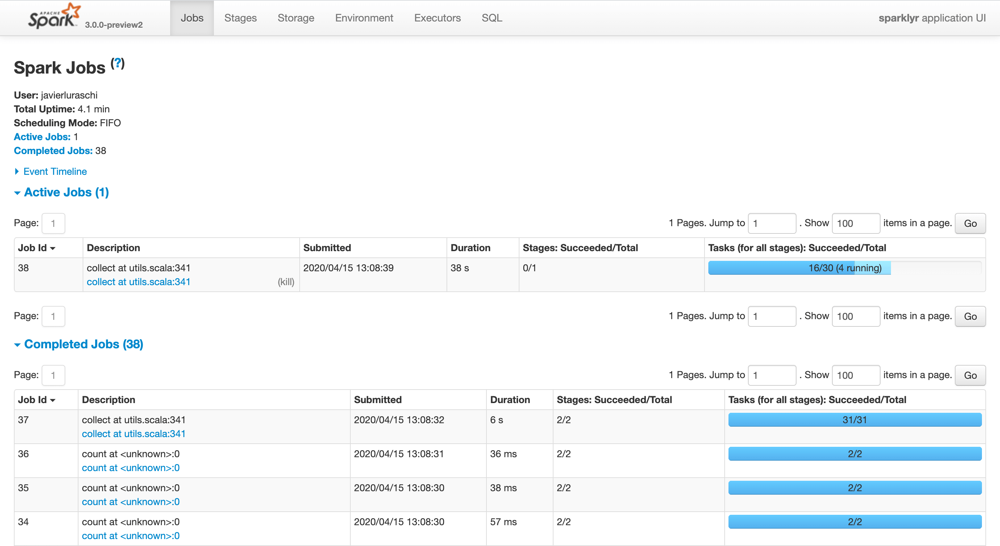

```{r setup, include=FALSE}
knitr::opts_chunk$set(echo = FALSE)
```

Behold the glory that is [sparklyr](https://sparklyr.ai) 1.2! In this release, the following new hotnesses have emerged into spotlight:

- A `registerDoSpark` method to create a [foreach](#foreach) parallel backend powered by Spark that enables hundreds of existing R packages to run in Spark.
- Support for [Databricks Connect](#databricks-connect), allowing `sparklyr` to connect to remote Databricks clusters.
- Improved support for Spark [structures](#structures) when collecting and querying their nested attributes with `dplyr`.

A number of inter-op issues observed with `sparklyr` and Spark 3.0 preview were also addressed recently, in hope that by the time Spark 3.0 officially graces us with its presence, `sparklyr` will be fully ready to work with it. Most notably, key features such as `spark_submit`, `sdf_bind_rows`, and standalone connections are now finally working with Spark 3.0 preview.

To install `sparklyr` 1.2 from CRAN run,

```{r echo=TRUE, eval=FALSE}
install.packages("sparklyr")
```

The full list of changes are available in the sparklyr [NEWS](https://github.com/sparklyr/sparklyr/blob/master/NEWS.md) file.

## Foreach

The `foreach` package provides the `%dopar%` operator to iterate over elements in a collection in parallel. Using `sparklyr` 1.2, you can now register Spark as a backend using `registerDoSpark()` and then easily iterate over R objects using Spark:

```{r echo=TRUE, eval=FALSE}
library(sparklyr)
library(foreach)

sc <- spark_connect(master = "local", version = "2.4")

registerDoSpark(sc)
foreach(i = 1:3, .combine = 'c') %dopar% {
  sqrt(i)
}
```
```
[1] 1.000000 1.414214 1.732051
```

Since many R packages are based on `foreach` to perform parallel computation, we can now make use of all those great packages in Spark as well!

For instance, we can use [parsnip](https://tidymodels.github.io/parsnip/) and the [tune](https://tidymodels.github.io/tune/) package with data from [mlbench](https://CRAN.R-project.org/package=mlbench) to perform hyperparameter tuning in Spark with ease:

```{r echo=TRUE, eval=FALSE}
library(tune)
library(parsnip)
library(mlbench)

data(Ionosphere)
svm_rbf(cost = tune(), rbf_sigma = tune()) %>%
  set_mode("classification") %>%
  set_engine("kernlab") %>%
  tune_grid(Class ~ .,
    resamples = rsample::bootstraps(dplyr::select(Ionosphere, -V2), times = 30),
    control = control_grid(verbose = FALSE))
```
```
# Bootstrap sampling
# A tibble: 30 x 4
   splits            id          .metrics          .notes
 * <list>            <chr>       <list>            <list>
 1 <split [351/124]> Bootstrap01 <tibble [10 × 5]> <tibble [0 × 1]>
 2 <split [351/126]> Bootstrap02 <tibble [10 × 5]> <tibble [0 × 1]>
 3 <split [351/125]> Bootstrap03 <tibble [10 × 5]> <tibble [0 × 1]>
 4 <split [351/135]> Bootstrap04 <tibble [10 × 5]> <tibble [0 × 1]>
 5 <split [351/127]> Bootstrap05 <tibble [10 × 5]> <tibble [0 × 1]>
 6 <split [351/131]> Bootstrap06 <tibble [10 × 5]> <tibble [0 × 1]>
 7 <split [351/141]> Bootstrap07 <tibble [10 × 5]> <tibble [0 × 1]>
 8 <split [351/123]> Bootstrap08 <tibble [10 × 5]> <tibble [0 × 1]>
 9 <split [351/118]> Bootstrap09 <tibble [10 × 5]> <tibble [0 × 1]>
10 <split [351/136]> Bootstrap10 <tibble [10 × 5]> <tibble [0 × 1]>
# … with 20 more rows
```

The Spark connection was already registered, so the code ran in Spark without any additional changes. We can verify this was the case by navigating to the Spark web interface:



## Databricks Connect

[Databricks Connect](https://docs.databricks.com/dev-tools/databricks-connect.html) allows you to connect your favorite IDE (like [RStudio](https://rstudio.com/products/rstudio/download/)!) to a Spark [Databricks](https://databricks.com/) cluster.

You will first have to install the `databricks-connect` package as described in our [README](https://github.com/sparklyr/sparklyr#connecting-through-databricks-connect) and start a Databricks cluster, but once that's ready, connecting to the remote cluster is as easy as running:

```{r echo=TRUE, eval=FALSE}
sc <- spark_connect(
  method = "databricks",
  spark_home = system2("databricks-connect", "get-spark-home", stdout = TRUE))
```


That's about it, you are now remotely connected to a Databricks cluster from your local R session.

## Structures

If you previously used `sdf_collect` to deserialize structurally complex Spark dataframes into their equivalents in R, you likely have noticed Spark SQL struct columns were only mapped into JSON strings in R, which was non-ideal. You might also have run into a much dreaded `java.lang.IllegalArgumentException: Invalid type list` error when using `dplyr` to query nested attributes from any struct column of a Spark dataframe in sparklyr.

Unfortunately, often times in real-world Spark use cases, data describing entities comprising of sub-entities (e.g., a product catalog of all hardware components of some computers) needs to be denormalized / shaped in an object-oriented manner in the form of Spark SQL structs to allow efficient read queries. When sparklyr had the limitations mentioned above, users often had to invent their own workarounds when querying Spark struct columns, which explained why there was a mass popular demand for sparklyr to have better support for such use cases.

The good news is with `sparklyr` 1.2.0, those limitations no longer exist any more when working running with Spark 2.4 or above.

As a concrete example, consider the following catalog of computers:

```{r echo=TRUE, eval=FALSE}
library(dplyr)

computers <- tibble::tibble(
  id = seq(1, 2),
  attributes = list(
    list(
      processor = list(freq = 2.4, num_cores = 256),
      price = 100
   ),
   list(
     processor = list(freq = 1.6, num_cores = 512),
     price = 133
   )
  )
)

computers <- copy_to(sc, computers, overwrite = TRUE)
```

A typical `dplyr` use case involving `computers` would be the following:

```{r echo=TRUE, eval=FALSE}
high_freq_computers <- computers %>%
                       filter(attributes.processor.freq >= 2) %>%
                       collect()
```

As previously mentioned, before `sparklyr` 1.2.0, such query would fail with `Error: java.lang.IllegalArgumentException: Invalid type list`.

Whereas with `sparklyr` 1.2.0, the expected result is returned in the following form:

```
# A tibble: 1 x 2
     id attributes
  <int> <list>
1     1 <named list [2]>
```

where `high_freq_computers$attributes` is what we would expect:

```
[[1]]
[[1]]$price
[1] 100

[[1]]$processor
[[1]]$processor$freq
[1] 2.4

[[1]]$processor$num_cores
[1] 256
```

## And More!

Last but not least, we heard about a number of pain points `sparklyr` users have run into, and have addressed many of them in this release as well. For example:

 -  Date type in R is now correctly serialized into Spark SQL date type by `sdf_copy_to`
 -  `<spark dataframe> %>% print(n = 20)` now actually prints 20 rows as expected instead of 10
 - `spark_connect(master = "local")` will emit a more informative error message if it's failing because the loopback interface is not up

... to just name a few. We want to thank the open source community for their continuous feedback on `sparklyr`, and are looking forward to incorporating more of that feedback to make `sparklyr` even better in the future.

Finally, in chronological order, we wish to thank the following individuals for contributing to `sparklyr` 1.2.0: [zero323](https://github.com/zero323), [Andy Zhang](https://github.com/Loquats), [Yitao Li](https://github.com/yl790),
[Javier Luraschi](https://github.com/javierluraschi), [Hossein Falaki](https://github.com/falaki), [Lu Wang](https://github.com/lu-wang-dl), and [Samuel Macedo](https://github.com/samuelmacedo83). Great job everyone!

If you need to catch up on `sparklyr`, please visit [sparklyr.ai](https://sparklyr.ai), [spark.rstudio.com](https://spark.rstudio.com), or some of the previous release posts: [sparklyr 1.1](https://blog.rstudio.com/2020/01/29/sparklyr-1-1/) and [sparklyr 1.0](https://blog.rstudio.com/2019/03/15/sparklyr-1-0/).

Thank you for reading this post.
