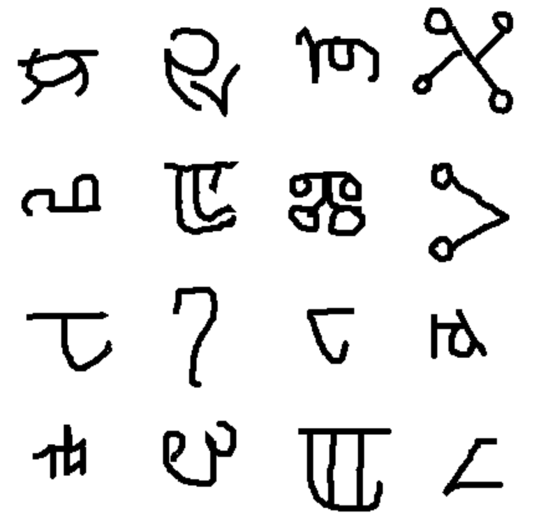
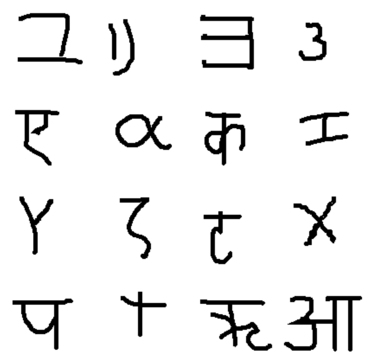

```{r setup, include=FALSE}
knitr::opts_chunk$set(echo = TRUE, eval = FALSE)
```

How private are individual data in the context of machine learning models? The data used to train the model, say. There are
types of models where the answer is simple. Take k-nearest-neighbors, for example. There *is not* even a model without the
complete dataset. Or support vector machines. There is no model without the support vectors. But neural networks? They're just
some composition of functions, -- no data included.

The same is true for data fed to a deployed deep-learning model. It's pretty unlikely one could invert the final softmax
output from a big ResNet and get back the raw input data.

In theory, then, "hacking" a standard neural net to spy on input data sounds illusory. In practice, however, there is always
some real-world *context*. The context may be other datasets, publicly available, that can be linked to the "private" data in
question. This is a popular showcase used in advocating for differential privacy[@Dwork2006]: Take an "anonymized" dataset,
dig up complementary information from public sources, and de-anonymize records ad libitum. Some context in that sense will
often be used in "black-box" attacks, ones that presuppose no insider information about the model to be hacked.

But context can also be structural, such as in the scenario demonstrated in this post. For example, assume a distributed
model, where sets of layers run on different devices -- embedded devices or mobile phones, for example. (A scenario like that
is sometimes seen as "white-box"[@7536387], but in common understanding, white-box attacks probably presuppose some more
insider knowledge, such as access to model architecture or even, weights. I'd therefore prefer calling this white-ish at
most.) --- Now assume that in this context, it is possible to intercept, and interact with, a system that executes the deeper
layers of the model. Based on that system's intermediate-level output, it is possible to perform *model inversion*[@Fred],
that is, to reconstruct the input data fed into the system.

In this post, we'll demonstrate such a model inversion attack, basically porting the approach given in a
[notebook](https://github.com/OpenMined/PySyft/blob/master/examples/tutorials/advanced/privacy_attacks/Tutorial%201%20-%20Black%20box%20model%20inversion.ipynb%20Sy)
found in the [PySyft](https://github.com/OpenMined/PySyft) repository. We then experiment with different levels of
$\epsilon$-privacy, exploring impact on reconstruction success. This second part will make use of TensorFlow Privacy,
introduced in a [previous blog post](https://blogs.rstudio.com/ai/posts/2019-12-20-differential-privacy/).

## Part 1: Model inversion in action

### Example dataset: All the world's letters[^1]

[^1]: Don't take *all* literally please; it's just a nice phrase.

The overall process of model inversion used here is the following. With no, or scarcely any, insider knowledge about a model,
-- but given opportunities to repeatedly query it --, I want to learn how to reconstruct unknown inputs based on just model
outputs . Independently of original model training, this, too, is a training process; however, in general it will not involve
the original data, as those won't be publicly available. Still, for best success, the attacker model is trained with data as
similar as possible to the original training data assumed. Thinking of images, for example, and presupposing the popular view
of successive layers representing successively coarse-grained features, we want that the surrogate data to share as many
representation spaces with the real data as possible -- up to the very highest layers before final classification, ideally.

If we wanted to use classical MNIST as an example, one thing we could do is to only use some of the digits for training the
"real" model; and the rest, for training the adversary. Let's try something different though, something that might make the
undertaking harder as well as easier at the same time. Harder, because the dataset features exemplars more complex than MNIST
digits; easier because of the same reason: More could possibly be learned, by the adversary, from a complex task.

Originally designed to develop a machine model of concept learning and generalization [@Lake1332], the
[OmniGlot](https://github.com/brendenlake/omniglot/) dataset incorporates characters from fifty alphabets, split into two
disjoint groups of thirty and twenty alphabets each. We'll use the group of twenty to train our target model. Here is a
sample:

```{r, eval=TRUE, echo=FALSE, fig.cap = "Sample from the twenty-alphabet set used to train the target model (originally: 'evaluation set')"}

```

The group of thirty we don't use; instead, we'll employ two small five-alphabet collections to train the adversary and to test
reconstruction, respectively. (These small subsets of the original "big" thirty-alphabet set are again disjoint.)

Here first is a sample from the set used to train the adversary.

```{r, eval=TRUE, echo=FALSE, layout="l-body", fig.cap = "Sample from the five-alphabet set used to train the adversary (originally: 'background small 1')"}
knitr::include_graphics("images/attacker_ds.png")
```

The other small subset will be used to test the adversary's spying capabilities after training. Let's peek at this one, too:

```{r, eval=TRUE, echo=FALSE, layout="l-body", fig.cap = "Sample from the five-alphabet set used to test the adversary after training(originally: 'background small 2')"}

```

Conveniently, we can use [tfds](https://github.com/rstudio/tfds), the R wrapper to TensorFlow Datasets, to load those subsets:

```{r}
library(reticulate)
library(keras)
library(tfdatasets)
library(tfautograph)
library(tfds)

library(purrr)

# we'll use this to train the target model
# n = 13180
omni_train <- tfds$load("omniglot", split = "test")

# this is used to train the adversary
# n = 2720
omni_spy <- tfds$load("omniglot", split = "small1")

# this we'll use for testing
# n = 3120
omni_test <- tfds$load("omniglot", split = "small2")

```

Now first, we train the target model.

### Train target model

The dataset originally has four columns: the image, of size 105 x 105; an alphabet id and a within-dataset character id; and a
label. For our use case, we're not really interested in the task the target model was/is used for; we just want to get at the
data. Basically, whatever task we choose, it is not much more than a dummy task. So, let's just say we train the target to
classify characters *by alphabet*.

We thus throw out all unneeded features, keeping just the alphabet id and the image itself:

```{r}
# normalize and work with a single channel (images are black-and-white anyway)
preprocess_image <- function(image) {
  image %>%
    tf$cast(dtype = tf$float32) %>%
    tf$truediv(y = 255) %>%
    tf$image$rgb_to_grayscale()
}

# use the first 11000 images for training
train_ds <- omni_train %>% 
  dataset_take(11000) %>%
  dataset_map(function(record) {
    record$image <- preprocess_image(record$image)
    list(record$image, record$alphabet)}) %>%
  dataset_shuffle(1000) %>% 
  dataset_batch(32)

# use the remaining 2180 records for validation
val_ds <- omni_train %>% 
  dataset_skip(11000) %>%
  dataset_map(function(record) {
    record$image <- preprocess_image(record$image)
    list(record$image, record$alphabet)}) %>%
  dataset_batch(32)
```

The model consists of two parts. The first is imagined to run in a distributed fashion; for example, on mobile devices (stage
one). These devices then send model outputs to a central server, where final results are computed (stage two). Sure, you will
be thinking, this is a convenient setup for our scenario: If we intercept stage one results, we -- most probably -- gain
access to richer information than what is contained in a model's final output layer. --- That is correct, but the scenario is
less contrived than one might assume. Just like federated learning [@McMahanMRA16], it fulfills important desiderata: Actual
training data never leaves the devices, thus staying (in theory!) private; at the same time, ingoing traffic to the server is
significantly reduced.

In our example setup, the on-device model is a convnet, while the server model is a simple feedforward network.

We link both together as a *TargetModel* that when called normally, will run both steps in succession. However, we'll be able
to call `target_model$mobile_step()` separately, thereby intercepting intermediate results.

```{r}
on_device_model <- keras_model_sequential() %>%
  layer_conv_2d(filters = 32, kernel_size = c(7, 7),
                input_shape = c(105, 105, 1), activation = "relu") %>%
  layer_batch_normalization() %>%
  layer_max_pooling_2d(pool_size = c(3, 3), strides = 3) %>%
  layer_dropout(0.2) %>%
  layer_conv_2d(filters = 32, kernel_size = c(7, 7), activation = "relu") %>%
  layer_batch_normalization() %>%
  layer_max_pooling_2d(pool_size = c(3, 3), strides = 2) %>%
  layer_dropout(0.2) %>%
  layer_conv_2d(filters = 32, kernel_size = c(5, 5), activation = "relu") %>%
  layer_batch_normalization() %>%
  layer_max_pooling_2d(pool_size = c(2, 2), strides = 2) %>%
  layer_dropout(0.2) %>%
  layer_conv_2d(filters = 32, kernel_size = c(3, 3), activation = "relu") %>%
  layer_batch_normalization() %>%
  layer_max_pooling_2d(pool_size = c(2, 2), strides = 2) %>%
  layer_dropout(0.2) 

server_model <- keras_model_sequential() %>%
  layer_dense(units = 256, activation = "relu") %>%
  layer_flatten() %>%
  layer_dropout(0.2) %>% 
  # we have just 20 different ids, but they are not in lexicographic order
  layer_dense(units = 50, activation = "softmax")

target_model <- function() {
  keras_model_custom(name = "TargetModel", function(self) {
    
    self$on_device_model <-on_device_model
    self$server_model <- server_model
    self$mobile_step <- function(inputs) 
      self$on_device_model(inputs)
    self$server_step <- function(inputs)
      self$server_model(inputs)

    function(inputs, mask = NULL) {
      inputs %>% 
        self$mobile_step() %>%
        self$server_step()
    }
  })
  
}

model <- target_model()

```

The overall model is a Keras custom model, so we train it [TensorFlow 2.x -
style](https://tensorflow.rstudio.com/tutorials/advanced/). After ten epochs, training and validation accuracy are at \~0.84
and \~0.73, respectively -- not bad at all for a 20-class discrimination task.

```{r}
loss <- loss_sparse_categorical_crossentropy
optimizer <- optimizer_adam()

train_loss <- tf$keras$metrics$Mean(name='train_loss')
train_accuracy <-  tf$keras$metrics$SparseCategoricalAccuracy(name='train_accuracy')

val_loss <- tf$keras$metrics$Mean(name='val_loss')
val_accuracy <-  tf$keras$metrics$SparseCategoricalAccuracy(name='val_accuracy')

train_step <- function(images, labels) {
  with (tf$GradientTape() %as% tape, {
    predictions <- model(images)
    l <- loss(labels, predictions)
  })
  gradients <- tape$gradient(l, model$trainable_variables)
  optimizer$apply_gradients(purrr::transpose(list(
    gradients, model$trainable_variables
  )))
  train_loss(l)
  train_accuracy(labels, predictions)
}

val_step <- function(images, labels) {
  predictions <- model(images)
  l <- loss(labels, predictions)
  val_loss(l)
  val_accuracy(labels, predictions)
}


training_loop <- tf_function(autograph(function(train_ds, val_ds) {
  for (b1 in train_ds) {
    train_step(b1[[1]], b1[[2]])
  }
  for (b2 in val_ds) {
    val_step(b2[[1]], b2[[2]])
  }
  
  tf$print("Train accuracy", train_accuracy$result(),
           "    Validation Accuracy", val_accuracy$result())
  
  train_loss$reset_states()
  train_accuracy$reset_states()
  val_loss$reset_states()
  val_accuracy$reset_states()
}))


for (epoch in 1:10) {
  cat("Epoch: ", epoch, " -----------\n")
  training_loop(train_ds, val_ds)  
}
```

    Epoch:  1  -----------
    Train accuracy 0.195090905     Validation Accuracy 0.376605511
    Epoch:  2  -----------
    Train accuracy 0.472272724     Validation Accuracy 0.5243119
    ...
    ...
    Epoch:  9  -----------
    Train accuracy 0.821454525     Validation Accuracy 0.720183492
    Epoch:  10  -----------
    Train accuracy 0.840454519     Validation Accuracy 0.726605475

Now, we train the adversary.

### Train adversary

The adversary's general strategy will be:

-   **Feed its small, surrogate dataset to the on-device model.** The output received can be regarded as a (highly)
    *compressed* version of the original images.
-   P**ass that "compressed" version as input to its own model,** which tries to reconstruct the original images from the
    sparse code.
-   **Compare original images (those from the surrogate dataset) to the reconstruction pixel-wise.** The goal is to minimize
    the mean (squared, say) error.

Doesn't this sound a lot like the decoding side of an autoencoder? No wonder the attacker model is a deconvolutional network.
Its input -- equivalently, the on-device model's output -- is of size `batch_size x 1 x 1 x 32`. That is, the information is
encoded in 32 channels, but the spatial resolution is 1. Just like in an autoencoder operating on images, we need to
*upsample* until we arrive at the original resolution of 105 x 105.

This is exactly what's happening in the attacker model:

```{r}
attack_model <- function() {
  
  keras_model_custom(name = "AttackModel", function(self) {
    
    self$conv1 <-layer_conv_2d_transpose(filters = 32, kernel_size = 9,
                                         padding = "valid",
                                         strides = 1, activation = "relu")
    self$conv2 <- layer_conv_2d_transpose(filters = 32, kernel_size = 7,
                                          padding = "valid",
                                          strides = 2, activation = "relu") 
    self$conv3 <- layer_conv_2d_transpose(filters = 1, kernel_size = 7,
                                          padding = "valid",
                                          strides = 2, activation = "relu")  
    self$conv4 <- layer_conv_2d_transpose(filters = 1, kernel_size = 5,
                                          padding = "valid",
                                          strides = 2, activation = "relu")
    
    function(inputs, mask = NULL) {
      inputs %>% 
        # bs * 9 * 9 * 32
        # output = strides * (input - 1) + kernel_size - 2 * padding
        self$conv1() %>%
        # bs * 23 * 23 * 32
        self$conv2() %>%
        # bs * 51 * 51 * 1
        self$conv3() %>%
        # bs * 105 * 105 * 1
        self$conv4()
    }
  })
  
}

attacker = attack_model()
```

To train the adversary, we use one of the small (five-alphabet) subsets. To reiterate what was said above, there is no overlap
with the data used to train the target model.

```{r}
attacker_ds <- omni_spy %>% 
dataset_map(function(record) {
    record$image <- preprocess_image(record$image)
    list(record$image, record$alphabet)}) %>%
  dataset_batch(32)
```

Here, then, is the attacker training loop, striving to refine the decoding process over a hundred -- short -- epochs:

```{r}
attacker_criterion <- loss_mean_squared_error
attacker_optimizer <- optimizer_adam()
attacker_loss <- tf$keras$metrics$Mean(name='attacker_loss')
attacker_mse <-  tf$keras$metrics$MeanSquaredError(name='attacker_mse')

attacker_step <- function(images) {
  
  attack_input <- model$mobile_step(images)
  
  with (tf$GradientTape() %as% tape, {
    generated <- attacker(attack_input)
    l <- attacker_criterion(images, generated)
  })
  gradients <- tape$gradient(l, attacker$trainable_variables)
  attacker_optimizer$apply_gradients(purrr::transpose(list(
    gradients, attacker$trainable_variables
  )))
  attacker_loss(l)
  attacker_mse(images, generated)
}


attacker_training_loop <- tf_function(autograph(function(attacker_ds) {
  for (b in attacker_ds) {
    attacker_step(b[[1]])
  }
  
  tf$print("mse: ", attacker_mse$result())
  
  attacker_loss$reset_states()
  attacker_mse$reset_states()
}))

for (epoch in 1:100) {
  cat("Epoch: ", epoch, " -----------\n")
  attacker_training_loop(attacker_ds)  
}
```

    Epoch:  1  -----------
      mse:  0.530902684
    Epoch:  2  -----------
      mse:  0.201351956
    ...
    ...
    Epoch:  99  -----------
      mse:  0.0413453057
    Epoch:  100  -----------
      mse:  0.0413028933

The question now is, -- does it work? Has the attacker really learned to infer actual data from (stage one) model output?

### Test adversary

To test the adversary, we use the third dataset we downloaded, containing images from five yet-unseen alphabets. For display,
we select just the first sixteen records -- a completely arbitrary decision, of course.

```{r}
test_ds <- omni_test %>% 
  dataset_map(function(record) {
    record$image <- preprocess_image(record$image)
    list(record$image, record$alphabet)}) %>%
  dataset_take(16) %>%
  dataset_batch(16)

batch <- as_iterator(test_ds) %>% iterator_get_next()
images <- batch[[1]]

attack_input <- model$mobile_step(images)
generated <- attacker(attack_input) %>% as.array()

generated[generated > 1] <- 1
generated <- generated[ , , , 1]
generated %>%
  purrr::array_tree(1) %>%
  purrr::map(as.raster) %>%
  purrr::iwalk(~{plot(.x)})
```

Just like during the training process, the adversary queries the target model (stage one), obtains the compressed
representation, and attempts to reconstruct the original image. (Of course, in the real world, the setup would be different in
that the attacker would *not* be able to simply inspect the images, as is the case here. There would thus have to be some way
to intercept, and make sense of, network traffic.)

```{r}
attack_input <- model$mobile_step(images)
generated <- attacker(attack_input) %>% as.array()

generated[generated > 1] <- 1
generated <- generated[ , , , 1]
generated %>%
  purrr::array_tree(1) %>%
  purrr::map(as.raster) %>%
  purrr::iwalk(~{plot(.x)})
```

To allow for easier comparison (and increase suspense ...!), here again are the actual images, which we displayed already when
introducing the dataset:

```{r, eval=TRUE, echo=FALSE, layout="l-body", fig.cap = "First images from the test set, the way they really look."}


```

And here is the reconstruction:

```{r, eval=TRUE, echo=FALSE, layout="l-body", fig.cap = "First images from the test set, as reconstructed by the adversary."}
knitr::include_graphics("images/recon_noeps_dropout.png")

```

Of course, it is hard to say how revealing these "guesses" are. There definitely seems to be a connection to character
complexity; overall, it seems like the Greek and Roman letters, which are the least complex, are also the ones most easily
reconstructed. Still, in the end, how much privacy is lost will very much depend on contextual factors.

First and foremost, do the exemplars in the dataset represent *individuals* or *classes* of individuals? If -- as in reality
-- the character `X` represents a class, it might not be so grave if we were able to reconstruct "some X" here: There are many
`X`s in the dataset, all pretty similar to each other; we're unlikely to exactly to have reconstructed one special, individual
`X`. If, however, this was a dataset of individual people, with all `X`s being photographs of Alex, then in reconstructing an
`X` we have effectively reconstructed Alex.

Second, in less obvious scenarios, evaluating the degree of privacy breach will likely surpass computation of quantitative
metrics, and involve the judgment of domain experts.

Speaking of quantitative metrics though -- our example seems like a perfect use case to experiment with *differential
privacy.* Differential privacy is measured by $\epsilon$ (lower is better), the main idea being that answers to queries to a
system should depend as little as possible on the presence or absence of a single (*any* single) datapoint.

So, we will repeat the above experiment, using TensorFlow Privacy (TFP) to add noise, as well as clip gradients, during
optimization of the target model. We'll try three different conditions, resulting in three different values for $\epsilon$s,
and for each condition, inspect the images reconstructed by the adversary.

## Part 2: Differential privacy to the rescue

Unfortunately, the setup for this part of the experiment requires a little workaround. Making use of the flexibility afforded
by TensorFlow 2.x, our target model has been a custom model, joining two distinct stages ("mobile" and "server") that could be
called independently.

TFP, however, does still not work with TensorFlow 2.x, meaning we have to use old-style, non-eager model definitions and
training. Luckily, the workaround will be easy.

First, load (and possibly, install) libraries, taking care to disable TensorFlow V2 behavior.

```{r}
library(keras)
library(tensorflow)
# still necessary when working with TensorFlow Privacy, as of this writing
tf$compat$v1$disable_v2_behavior()

# if you don't have it installed:
# reticulate::py_install("tensorflow_privacy")
tfp <- import("tensorflow_privacy")

library(tfdatasets)
library(tfds)

library(purrr)
```

The training set is loaded, preprocessed and batched (nearly) as before.

```{r}
omni_train <- tfds$load("omniglot", split = "test")

batch_size <- 32

train_ds <- omni_train %>%
  dataset_take(11000) %>%
  dataset_map(function(record) {
    record$image <- preprocess_image(record$image)
    list(record$image, record$alphabet)}) %>%
  dataset_shuffle(1000) %>%
  # need dataset_repeat() when not eager
  dataset_repeat() %>%
  dataset_batch(batch_size)
```

### Train target model -- with TensorFlow Privacy

To train the target, we put the layers from both stages -- "mobile" and "server" -- into one sequential model. Note how we
remove the dropout. This is because noise will be added during optimization anyway.

```{r}
complete_model <- keras_model_sequential() %>%
  layer_conv_2d(filters = 32, kernel_size = c(7, 7),
                input_shape = c(105, 105, 1),
                activation = "relu") %>%
  layer_batch_normalization() %>%
  layer_max_pooling_2d(pool_size = c(3, 3), strides = 3) %>%
  #layer_dropout(0.2) %>%
  layer_conv_2d(filters = 32, kernel_size = c(7, 7), activation = "relu") %>%
  layer_batch_normalization() %>%
  layer_max_pooling_2d(pool_size = c(3, 3), strides = 2) %>%
  #layer_dropout(0.2) %>%
  layer_conv_2d(filters = 32, kernel_size = c(5, 5), activation = "relu") %>%
  layer_batch_normalization() %>%
  layer_max_pooling_2d(pool_size = c(2, 2), strides = 2) %>%
  #layer_dropout(0.2) %>%
  layer_conv_2d(filters = 32, kernel_size = c(3, 3), activation = "relu") %>%
  layer_batch_normalization() %>%
  layer_max_pooling_2d(pool_size = c(2, 2), strides = 2, name = "mobile_output") %>%
  #layer_dropout(0.2) %>%
  layer_dense(units = 256, activation = "relu") %>%
  layer_flatten() %>%
  #layer_dropout(0.2) %>%
  layer_dense(units = 50, activation = "softmax")

```

Using TFP mainly means using a TFP optimizer, one that clips gradients according to some defined magnitude and adds noise of
defined size. `noise_multiplier` is the parameter we are going to vary to arrive at different $\epsilon$s:

```{r}
l2_norm_clip <- 1

# ratio of the standard deviation to the clipping norm
# we run training for each of the three values
noise_multiplier <- 0.7
noise_multiplier <- 0.5
noise_multiplier <- 0.3

# same as batch size
num_microbatches <- k_cast(batch_size, "int32")
learning_rate <- 0.005

optimizer <- tfp$DPAdamGaussianOptimizer(
  l2_norm_clip = l2_norm_clip,
  noise_multiplier = noise_multiplier,
  num_microbatches = num_microbatches,
  learning_rate = learning_rate
)
```

In training the model, the second important change for TFP we need to make is to have loss and gradients computed on the
individual level.

```{r}

# need to add noise to every individual contribution
loss <- tf$keras$losses$SparseCategoricalCrossentropy(reduction =   tf$keras$losses$Reduction$NONE)

complete_model %>% compile(loss = loss, optimizer = optimizer, metrics = "sparse_categorical_accuracy")

num_epochs <- 20

n_train <- 13180

history <- complete_model %>% fit(
  train_ds,
  # need steps_per_epoch when not in eager mode
  steps_per_epoch = n_train/batch_size,
  epochs = num_epochs)
```

To test three different $\epsilon$s, we run this thrice, each time with a different `noise_multiplier`. Each time we arrive at
a different final accuracy.

Here is a synopsis, where $\epsilon$ was computed like so:

```{r}
compute_priv <- tfp$privacy$analysis$compute_dp_sgd_privacy

compute_priv$compute_dp_sgd_privacy(
  # number of records in training set
  n_train,
  batch_size,
  # noise_multiplier
  0.7, # or 0.5, or 0.3
  # number of epochs
  20,
  # delta - should not exceed 1/number of examples in training set
  1e-5)
```

| noise multiplier | epsilon | final acc. (training set) |
|------------------|---------|---------------------------|
| 0.7              | 4.0     | 0.37                      |
| 0.5              | 12.5    | 0.45                      |
| 0.3              | 84.7    | 0.56                      |

Now, as the adversary won't call the complete model, we need to "cut off" the second-stage layers. This leaves us with a model
that executes stage-one logic only. We save its weights, so we can later call it from the adversary:

```{r}
intercepted <- keras_model(
  complete_model$input,
  complete_model$get_layer("mobile_output")$output
)

intercepted %>% save_model_hdf5("./intercepted.hdf5")
```

### Train adversary (against differentially private target)

In training the adversary, we can keep most of the original code -- meaning, we're back to TF-2 style. Even the definition of
the target model is the same as before:

```{r}
on_device_model <- keras_model_sequential() %>%
  [...]

server_model <- keras_model_sequential() %>%
  [...]

target_model <- function() {
  keras_model_custom(name = "TargetModel", function(self) {
    
    self$on_device_model <-on_device_model
    self$server_model <- server_model
    self$mobile_step <- function(inputs) 
      self$on_device_model(inputs)
    self$server_step <- function(inputs)
      self$server_model(inputs)
    
    function(inputs, mask = NULL) {
      inputs %>% 
        self$mobile_step() %>%
        self$server_step()
    }
  })
}

intercepted <- target_model()

```

But now, we load the trained target's weights into the freshly defined model's "mobile stage":

```{r}

intercepted$on_device_model$load_weights("intercepted.hdf5")

```

And now, we're back to the old training routine. Testing setup is the same as before, as well.

So how well does the adversary perform with differential privacy added to the picture?

### Test adversary (against differentially private target)

Here, ordered by decreasing $\epsilon$, are the reconstructions. Again, we refrain from judging the results, for the same
reasons as before: In real-world applications, whether privacy is preserved "well enough" will depend on the context.

Here, first, are reconstructions from the run where the least noise was added.

```{r, eval=TRUE, echo=FALSE, layout="l-body", fig.cap = "Reconstruction attempts from a setup where the target model was trained with an epsilon of 84.7."}
knitr::include_graphics("images/intercepted_eps_84.7.png")
```

On to the next level of privacy protection:

```{r, eval=TRUE, echo=FALSE, layout="l-body", fig.cap = "Reconstruction attempts from a setup where the target model was trained with an epsilon of 12.5."}
knitr::include_graphics("images/intercepted_eps_12.5.png")
```

And the highest-$\epsilon$ one:

```{r, eval=TRUE, echo=FALSE, layout="l-body", fig.cap = "Reconstruction attempts from a setup where the target model was trained with an epsilon of 4.0."}
knitr::include_graphics("images/intercepted_eps_4.0.png")
```

## Conclusion

Throughout this post, we've refrained from "over-commenting" on results, and focused on the why-and-how instead. This is
because in an artificial setup, chosen to facilitate exposition of concepts and methods, there really is no objective frame of
reference. What is a good reconstruction? What is a good $\epsilon$? What constitutes a data breach? No-one knows.

In the real world, there is a context to everything -- there are people involved, the people whose data we're talking about.
There are organizations, regulations, laws. There are abstract principles, and there are implementations; different
implementations of the same "idea" can differ.

As in machine learning overall, research papers on privacy-, ethics- or otherwise society-related topics are full of LaTeX
formulae. Amid the math, let's not forget the people.

Thanks for reading!
