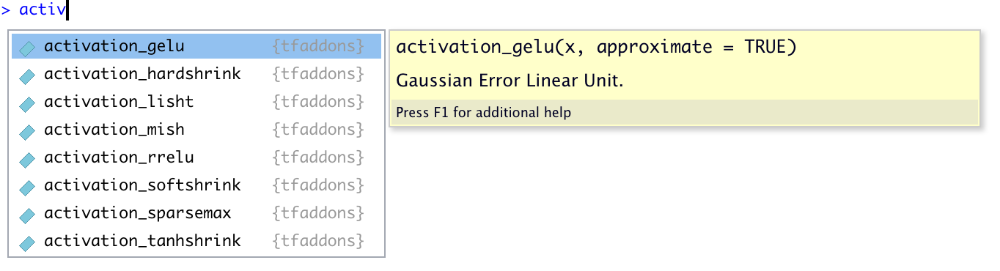
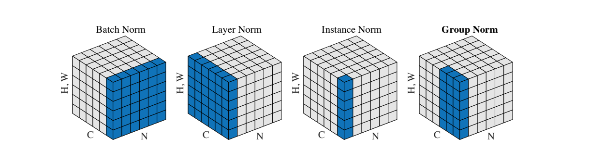
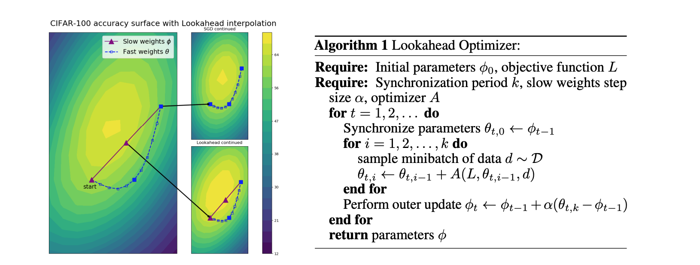

  
---
title: "TensorFlow Addons and classic Keras"
description: |
  Keras is a very powerful framework for building Neural Networks. However, in a fast-moving field like ML, there are a lot of features that are not integrated into core TensorFlow. In this post, we will introduce new types of callbacks, activations, layers, optimizers, losses, metrics, and many more interesting features that are developed by SIG-addons, and fully compatible with the Keras library.
author:
  - name: Turgut Abdullayev 
    url: https://github.com/henry090
    affiliation: Baku State University
date: 05-16-2020
categories:
  - TensorFlow/Keras
  - Packages/Releases
creative_commons: CC BY
repository_url: https://github.com/henry090/tfaddons_intro
bibliography: bibliography.bib
output: 
  distill::distill_article:
    self_contained: false
    toc: true
    toc_depth: 2
preview: images/tfaddons.png
---

```{r setup, include=FALSE}
knitr::opts_chunk$set(echo = TRUE, eval = FALSE)
library(plotly)
```

The [tfaddons](https://github.com/henry090/tfaddons) package provides R wrappers to TensorFlow Addons.

The new features by [SIG-addons for TensorFlow 2.x](https://www.tensorflow.org/addons) make working with Keras even more exciting. Because ready to use additional functionalities help users to apply different techniques without any effort (e.g. writing custom losses, metrics, classes). But which operations exactly do SIG-addons provide us?

- activations
- callbacks
- image
- layers
- losses
- metrics
- optimizers
- rnn
- seq2seq
- text

To make things easier we made the new types of ops very similar to [keras](https://keras.rstudio.com/) library. E.g. to access activations one can print ```activation``` and see the available list of functions.

```{r, eval=TRUE, echo=FALSE, layout="l-body", fig.cap=" ", out.extra="class=external"}

```

Before we start, please make sure that the TensorFlow version in your system is ```2.x```.

```{r}
tensorflow::install_tensorflow() 
```

Later, one needs to install ```tfaddons```. Note that currently the package is under development and has to be installed from Github:

```{r}
devtools::install_github('henry090/tfaddons')
```

## Activations

We can take a look at classic Keras activations and later, see the new ones from __tfaddons__.

### Generate random data

```{r}
set.seed(42)
x_data <- matrix(data = runif(100,-2.4,2.4), nrow = 100,ncol = 5)
y_data <-  seq(-5,4.9,0.1) %>% as.matrix()

old_keras = c('activation_elu','activation_exponential','activation_hard_sigmoid',
              'activation_linear','activation_relu','activation_selu',
              'activation_sigmoid','activation_softmax','activation_softplus',
              'activation_softsign','activation_tanh')

k_clear_session()
```

### Activation Extraction

A small function will quickly provide us with results. So, first we train a model and then extract activations of 1st layer from each model.

```{r }
library(plotly)
library(keras)
get_activations <- function(activations) {
  keras_list = list()
  for (i in 1:length(activations)) {
    activation_fun = eval(parse(text = activations[i]))
    model = keras_model_sequential() %>% 
      layer_dense(1, input_shape = ncol(x_data),
                  activation = activation_fun) %>% 
      layer_dense(1, activation = 'linear') %>% 
      compile(optimizer = 'adagrad', loss = 'mae',
              metrics = 'mse')
    
    model %>% fit(x_data, y_data, verbose = 0,
                  batch_size = 1, epochs = 2)
    
    inputs = model$input                                          
    outputs = lapply(1:length(model$layers), function(x) model$layers[[x]]$output)   
    functions = lapply(1:length(outputs), function(x) 
      k_function(list(inputs), list(outputs[[x]]) ))
    
    act_layers = list()
    
    for (j in 1:nrow(x_data)) {
      res = k_reshape(x_data[j,],c(1, 5))
      layer_outs = functions[[1]](res)[[1]]
      act_layers[[j]] <- layer_outs
    }
    
    activation = do.call(rbind, act_layers) %>% as.vector() %>% sort()
    x = seq(-5, 4.9, 0.1)
    df = data.frame(x = x, activation = activation)
    
    a <- list(
      text = paste(activations[i]),
      xref = "paper",
      yref = "paper",
      yanchor = "bottom",
      xanchor = "center",
      align = "center",
      x = 0.5,
      y = 1,
      showarrow = FALSE
    )
    
    p = plot_ly(df, x = ~x, y = ~activation, 
            mode = 'lines', type = 'scatter',color = I('#CE0002'),
            hovertext = paste(activations[i])) %>% 
      layout(annotations = a)
    keras_list[[i]] <- p
  }
  keras_list
}
```

### Classic Keras

```{r}
old_k = get_activations(old_keras)
subplot(lapply(1:length(old_keras), function(x) old_k[[x]]),nrows = 3, 
        shareX = TRUE, margin = 0.03) %>% layout(showlegend = FALSE)
```

```{r layout="l-screen-inset", eval=TRUE, echo=FALSE,fig.height=6}
old_kk = readRDS("files/old_k.rds")
subplot(lapply(1:length(old_kk), function(x) old_kk[[x]]),nrows = 3, 
        shareX = TRUE, margin = 0.03) %>% layout(showlegend = FALSE)
```

### TensorFlow Addons Activations

Now, the same for the new activation functions from TensorFlow Addons.

```{r}
new_keras = c('activation_gelu','activation_hardshrink','activation_lisht',
              'activation_mish', 'activation_softshrink',
              'activation_sparsemax','activation_tanhshrink')
```

```{r}
new_k = get_activations(new_keras)
subplot(lapply(1:length(new_k), function(x) new_k[[x]]),nrows = 3, 
        shareX = TRUE, margin = 0.03) %>% layout(showlegend = FALSE)
```

```{r layout="l-screen-inset", eval=TRUE, echo=FALSE,fig.height=6}
new_kk = readRDS("files/new_k.rds")
subplot(lapply(1:length(new_kk), function(x) new_kk[[x]]),nrows = 3, 
        shareX = TRUE, margin = 0.03) %>% layout(showlegend = FALSE)
```

### Gaussian Error Linear Units (GELUs)

As we already familiar with MNIST, it will be easier to apply the new features from ```tfaddons``` to this dataset. Using [Sequential API](https://keras.rstudio.com/articles/sequential_model.html) one can consequently add new type of layers and activation functions. For example, below we will choose GELU[@1606.08415] as an activation function for the 1st layer. But first, we need to understand the GELU.

Gaussian Error Linear Unit (GELU) is defined as:

$$\text{GELU}(x)=xP(X\leq x)=x\Phi(x)$$
Where $\Phi$ is the cumulative distribution function of a Gaussian.

GELUs can be approximated as:

$$0.5x(1 + tanh[\sqrt{2/\pi}(x + 0.044715x^3)])$$

Unlike the ReLU, the GELU and ELU outputs can be both negative and positive. In addition, GELU has the following differences:

- it is not linear in the positive domain and exhibits curvature at all points
- GELU weights its input depending upon how much greater it is than other inputs

## Layers

### Layer group normalization
With traditional Keras, we have just had ```layer_batch_normalziation``` which is very effective if our ```batch_size``` is __not small__. However, as ```layer_group_normalization```[@1803.08494] is batch independent, the small ```batch_size``` will not lead to bad performance as in batch normalization case. Therefore, _group normalization_ is more stable and powerful than _batch normalization_ because the first one divides channels into groups and only then normalizes features inside groups. In contrast, batch normalization directly performs normalization by using mean and variance.

```{r, eval=TRUE, echo=FALSE, layout="l-body-outset", fig.cap="[Normalization methods](https://arxiv.org/pdf/1803.08494.pdf). Each subplot shows a feature map tensor, with N as the batch axis, C as the channel axis, and (H, W) as the spatial axes. The pixels in blue are normalized by the same mean and variance, computed by aggregating the values of these pixels.", out.extra="class=external"}

```

### Layer Multi-Head Attention

Multi-Head attention operation takes roots from "Attention Is All You Need"[@1706.03762] paper and defines a multiplication of 3 matrices (dot product), such as: 

- query
- key
- value

The model proposed by this paper is called the Transformer which consists of Encoders and Decoders.

<center>

```{r, eval=TRUE, echo=FALSE, layout="l-body-outset", fig.cap=" ", out.extra="class=external"}

```

</center>

Before going into a brief explanation of Transformers, it is better to visualize the model architecture.

```{r eval=T,echo=T,layout="l-screen-inset",fig.height=7}
library(DiagrammeR)
grViz("
digraph Transformer {

  graph [overlap = false, fontsize = 10]

  node [shape = box,
        fontname = Helvetica,
        width = 3,color=darkgreen]
  edge [arrowhead=none]
  Encoder_1, Encoder_2, Encoder_3, Encoder_4, Encoder_5, Encoder_6

  node [shape = box,
        fixedsize = true,
        width = 3,color=red] // sets as circles
  edge [arrowhead=none, arrowtail = none]
  Decoder_6, Decoder_5, Decoder_4, Decoder_3, Decoder_2, Decoder_1
  
  subgraph cluster1 {
  graph [color=red, penwidth=3]
    Decoder_2->Decoder_1 Decoder_3->Decoder_2
    Decoder_4->Decoder_3 Decoder_5->Decoder_4
    Decoder_6->Decoder_5
  }
  
  node [shape=egg, fontsize=18,width=4.5]
  subgraph cluster0 {
  graph [color=darkgreen, penwidth=3]
    Encoder_2->Encoder_1 Encoder_3->Encoder_2
    Encoder_4->Encoder_3 Encoder_5->Encoder_4
    Encoder_6->Encoder_5
  }
  
  node [color=blue,penwidth=2]
  Multi_Head_Attention [style = filled, fillcolor = gold]
  Feed_Forward_NN [style = filled, fillcolor = grey]
  Add_Norm [style = filled, fillcolor = cornflowerblue,fontcolor=white]
  Add__Norm [style = filled, fillcolor = cornflowerblue,fontcolor=white]
  
    Encoder_1 ->{Add_Norm}
    Add_Norm->Feed_Forward_NN
    Feed_Forward_NN->Add__Norm
    Add__Norm->{Multi_Head_Attention}
    
    node [shape=plaintext, width=6]
    Multi_Head_Attention -> Positional_Embeddings
    Positional_Embeddings -> Input_Embeddings
    node [shape=plaintext, fontsize=30]
    
    Input_Embeddings [style = filled, fillcolor = pink]
    Input_Embeddings -> Inputs
  
  node [color=blue,penwidth=2,shape=egg, fontsize=18,width=4.5]
  Masked_Multi_Head_Attention [style = filled, fillcolor = gold]
  Encoder_Decoder_Attention [style = filled, fillcolor = gold]
  Feed_Forward__NN [style = filled, fillcolor = grey]
  Add_Norm_ [style = filled, fillcolor = cornflowerblue,fontcolor=white]
  Add_Norm__ [style = filled, fillcolor = cornflowerblue,fontcolor=white]
  Add__Norm__ [style = filled, fillcolor = cornflowerblue,fontcolor=white]
    Decoder_1 ->{Add_Norm_}
    Add_Norm_ -> Feed_Forward__NN
    Feed_Forward__NN ->Add__Norm__
    Add__Norm__->Encoder_Decoder_Attention
    Encoder_Decoder_Attention-> Add_Norm__
    Add_Norm__ ->Masked_Multi_Head_Attention
    
    node [shape=plaintext, width=6]
    Masked_Multi_Head_Attention -> Positional__Embeddings
    Positional__Embeddings -> Output_Embeddings
    node [shape=plaintext, fontsize=30]
    
    Output_Embeddings [style = filled, fillcolor = pink]
    Output_Embeddings -> Output
  
  
  node [color=gold,penwidth=3,shape=egg, fontsize=18,width=4.5]
  Output_probabilites [style = filled, fillcolor = gold]
  Softmax [style = filled, fillcolor = gold]
  Linear [style = filled, fillcolor = gold]
  Output_probabilites->Softmax
  Softmax->Linear
  Linear->Decoder_6
  
  edge [arrowhead=vee]
  node [shape =plaintext,fontsize = 45, fontcolor=blue]
  Transformer->{Encoder, Decoder}
  Encoder [shape =plaintext,fontsize = 45, fontcolor=darkgreen]
  Encoder->{Encoder_6}
  Decoder [shape =plaintext,fontsize = 45, fontcolor=red]
  Decoder->{Decoder_6}

}
")

```

Indeed, this seems a bit challenging to understand but we can divide the plot into different sections:

- Econder
- Decoder
  - Feed Forward NN
  - Layer Normalization
  - Multi-Head Attention mechanism
  - Positional Embeddings
  - Linear & Softmax activation
  
__Where to watch?__

Our task is to start from bottom to top. 

1. The first thing we see are the inputs. They are our plain *Input* texts. E.g.: "Very easy". Our input consists of 2 words.
2. Imagine that each word has 512 embeddings[@1301.3781]. Then we have 2 words (rows) with 512 columns (dimensions). Hence, these are your *Input Embeddings*.
3. The title *Positional Embeddings* gives us a clue about the meaning, it simply encodes the position of each word against the other ones.
4. From the left of the plot, we see 3 unique layers: Multi-Head Attention mechanism, Layer Normalization, Feed Forward NN. What is the purpose of these layers? Before explanation, we can observe that in the middle, on the left side Encoder has so-called sub-encoders (Encoder_1, ..., Encoder_6). In fact, each of these encoders contains these 4 layers from Multi-head layer up to Layer normalization. From the right of the plot, we have 6 layers. This means that each Decoder has 6 of these layers.
5. Let's begin from the *Multi-head* Attention layer:

$$\text{Attention}(Q,K,V)=\text{softmax}(\frac{QK^T}{\sqrt{d_k}})V $$
As we already mentioned above there is 3 type of matrices in Attention layer: Query, Key, and Value matrices where Q and K matrices are multiplied, then divided by the square root of Key matrix dimensions (in the paper the number of Key dimensions are 64, so sqrt of 64 is 8). Then the softmax activation is applied in order to normalize the outputs. Later, we have to multiply the normalized value by the Value matrix. 
Note that, these matrices are created by the model during the training process. 

Till now, we just covered the attention mechanism but what are the Heads?
Attention contains 3 Matrices, Heads consist of multiple Attentions. So, basically the purpose of Heads is to concentrate attention over the multiple Attention mechanisms and then concatenate all of $Q$, $K$, $V$ matrices, and multiply with jointly created matrix $W^O$.

6. The information from Attentions moves to the next Layer - Feed Forward NN. But keep in mind that we never lose the dimensionality of our input vectors, 512. So, all the time inputs go into a certain layer, is updated, and without losing dimension size is transferred to the next layer. Between Attention and Feed Forward NN, there are Normalization Layers.

7. After transferring the output to the final Enocder_6, the internal representation of vectors is moved to the stack of decoders. What is on the right side of the diagram?

8. We have Masked and Encoder-Decoder Attentions. As we go from bottom to top the first thing we need to do is to analyze Masked Multi-Head Attention Layer. In the decoder, masked Attention prevents positions from attending to subsequent positions. This means that future positions are masked and set to $−∞$. For example:

English                      |German                        |
-----------------------------|------------------------------|
I love R programming language|Ich liebe R Programmiersprache|

In order to predict first 3 words "I love R" first we encode them like dimensions: "1 2 3" and then German as "4 5 6". What are we doing here?

We use all 3 inputs from English and parallelly translate sentence, but which parallel computations do we mean? For example:

1 2 3 => Predict 4th word

1 2 3 + 4 => Predict 5th word

1 2 3 + 4 + 5 => Predict 6th word

9. Encoder-Decoder Attention is like a standard Attention Layer however it takes Q matrix from below layer; K, and V matrices are taken from stack of Encoders.

10. As a final step, the output from the stack of Decoders are normalized by Softmax and then, by Linear function (logits to probabilities)

Example of Multi-Head attention layer with ```tfaddons```:

```{r}
mha = layer_multi_head_attention(head_size = 128, num_heads = 128)
query = tf$random$uniform(list(32L, 20L, 200L)) # (batch_size, query_elements, query_depth)
key = tf$random$uniform(list(32L, 15L, 300L)) # (batch_size, key_elements, key_depth)
value = tf$random$uniform(list(32L, 15L, 400L)) # (batch_size, key_elements, value_depth)
attention = mha(list(query, key, value)) # (batch_size, query_elements, value_depth)

```


### Keras model architecture

As mentioned, using Sequential API the Keras model with:

- activation GELU
- layer_group_normalization

can be defined as:

```{r }
# Build a sequential model
model = keras_model_sequential() %>% 
  layer_conv_2d(filters = 10, kernel_size = c(3,3),input_shape = c(28,28,1),
                # put channels to the 3rd axis [rows,columns,channels]
                data_format = "channels_last",
                #apply activation gelu
                activation = activation_gelu) %>% 
  # apply group normalization layer
  # after convolution split 10 channels into 5 subgroups
  layer_group_normalization(groups = 5, axis = 3) %>% 
  layer_flatten() %>% 
  layer_dense(10, activation = 'softmax')
```


## Losses

There are a lot of loss functions in ```tfaddons``` as well, for example:

IoU[@1908.03851] and GIoU[@1902.09630] are widely used for object detection, segmentation, and tracking because they show better performance during the assessment of 2D bounding boxes.

Itersection over Union can be defined as:

$$IoU=\dfrac{\mid{A\cap B\mid}}{\mid{A\cup B\mid}}=\dfrac{\mid I \mid}{\mid U \mid}$$

and Generalized Intersection over Union as:

$$GIoU = \dfrac{|A\cap B|}{|A\cup B|} - \dfrac{|C\backslash(A\cup B)|}{|C|} = IoU - \dfrac{|C\backslash(A\cup B)|}{|C|}$$


where "A" and "B" are actuals and predicted values, division of intersection to union. However, if the intersection is 0, then the IoU score is 0 as well. Therefore, we are not able to assess the loss because it is zero. In contrast, GIoU has an additional argument "C" which tries to enclose "A" and "B". What does it mean?

Imagine that A and B are operating systems where R has built-in packages from CRAN.

"A" has {"ggplot2", "dplyr", "tidyr", "distill"}

"B" has {"distill", "keras", "tensorflow", "ggplot2"}

From the point of math:

- What they have in common:$A\cap B = \{ distill,\:ggplot2 \}$
- What they have in union: $A\cup B = \{ ggplot2,\:dplyr,\:tidyr, \:distill,\: keras,\:tensorflow \}$

``` {r eval=T,echo=T}
library(ggplot2)

df = data.frame(pkgs = c("ggplot2","dplyr","tidyr","distill","keras","tensorflow"),
                x = c(5,   2,2,  4,8,9),
                y = c(3.2, 3,4, 4,4,2))

ggplot(df, aes(x, y, label = pkgs)) + geom_label() + 
  scale_y_reverse(breaks = seq(1,10,1)) + theme_bw() +
  scale_x_continuous(breaks = seq(1,10,1)) +
  expand_limits(x = c(1, 10), y = c(0, 7)) +
  # prediction
  annotate("rect", xmin = 1.2, xmax = 5.9, ymin = 2, ymax = 5,
           alpha = .1, color = 'red') +
  # actual
  annotate("rect", xmin = 3, xmax = 10.5, ymin = 1.5, ymax = 4.5,
           alpha = .1, color = 'darkgreen')
```

As we have bounding boxes we can calculate ```IoU``` and ```GIoU``` scores:

```{r}
iou = loss_giou(mode = 'iou') # or giou
# [y_min, x_min, y_max, x_max]
boxes_actual = tf$constant(list(c(1.5,3,4.5,10.5)))
boxes_predicted = tf$constant(list(c(2,1.2,5,5.9)))
iou_loss = iou(boxes_actual,boxes_predicted)
cat('IoU Loss: ', as.array(iou_loss)) 
```

```{r eval=F}
IoU Loss:  0.7529812
```

```{r}
giou = loss_giou(mode = 'giou') # or iou
# [y_min, x_min, y_max, x_max]
giou_loss = giou(boxes_actual,boxes_predicted)
cat('GIoU Loss: ', as.array(giou_loss)) 
```

```{r eval=F}
GIoU Loss:  0.8512915
```

What if they do not have intersection?

``` {r eval=T,echo=T}
df = data.frame(pkgs = c("dplyr","tidyr","keras","tensorflow"),
                x = c(2,2,8,9),
                y = c(3,4,4,2))

ggplot(df, aes(x, y, label = pkgs)) + geom_label() + 
  scale_y_reverse(breaks = seq(1,10,1)) + theme_bw() +
  scale_x_continuous(breaks = seq(1,10,1)) +
  expand_limits(x = c(1, 10), y = c(0, 7)) +
  annotate("rect", xmin = 1.2, xmax = 3, ymin = 2, ymax = 5,
           alpha = .1, color = 'red') +
  annotate("rect", xmin = 7, xmax = 10.5, ymin = 1.5, ymax = 4.5,
           alpha = .1, color = 'darkgreen')
```

### IoU

According to paper, IoU makes a bad prediction. Because loss is 0.

```{r eval=T,echo=T}
df = data.frame(pkgs = c("dplyr","tidyr","keras","tensorflow"),
                x = c(2,2,8,9),
                y = c(3,4,4,2))

ggplot(df, aes(x, y, label = pkgs)) + geom_label() + 
  scale_y_reverse(breaks = seq(1,10,1)) + theme_bw() +
  scale_x_continuous(breaks = seq(1,10,1)) +
  expand_limits(x = c(0, 10), y = c(0, 7)) +
  annotate("rect", xmin = 1.2, xmax = 3, ymin = 2, ymax = 5,
           alpha = .1, color = 'red') +
  annotate("rect", xmin = 7, xmax = 10.5, ymin = 1.5, ymax = 4.5,
           alpha = .1, color = 'darkgreen') +
  annotate("rect", xmin = 0.1, xmax = 11, ymin = 0.1, ymax = 7,
           alpha = .1, color = 'yellow')
```

### GIoU

However, with GIoU the situation is different. From left and right GIoU does not take the whole bound, as a result the loss will not be 0. Hence, the function performs a better object prediction.

```{r eval=T,echo=T}
df = data.frame(pkgs = c("dplyr","tidyr","keras","tensorflow"),
                x = c(2,2,8,9),
                y = c(3,4,4,2))

ggplot(df, aes(x, y, label = pkgs)) + geom_label() + 
  scale_y_reverse(breaks = seq(1,10,1)) + theme_bw() +
  scale_x_continuous(breaks = seq(1,10,1)) +
  expand_limits(x = c(0, 10), y = c(0, 7)) +
  annotate("rect", xmin = 1.2, xmax = 3, ymin = 2, ymax = 5,
           alpha = .1, color = 'red') +
  annotate("rect", xmin = 7, xmax = 10.5, ymin = 1.5, ymax = 4.5,
           alpha = .1, color = 'darkgreen') +
  annotate("rect", xmin = 3.8, xmax = 10.65, ymin = 0.1, ymax = 7,
           alpha = .1, color = 'yellow') +
  annotate("rect", xmin = 4, xmax = 6, ymin = 2, ymax = 4,
           alpha = .1, color = 'orange') +
  annotate("text", x = 5, y = 3, label = c('C argument'),
           size=3,
           color = 'black')
```


Object detection has already been introduced in this [blog](https://blogs.rstudio.com/ai/posts/2018-12-18-object-detection-concepts/). With __tfaddons__ we now can apply this loss function to our object detection model.


## Optimizers

Optimizer Rectified_Adam[@1908.03265] was already mentioned on the RStudio AI blog. However, it was inside "keras-bert" library. With ```tfaddons``` it is not only possible to apply rectified Adam but also using attention[@1907.08610] mechanism to gain more control over weights, and as a result to get a remarkable success during model training.

<aside>
[Bidirectional Encoder Representations from Transformers from R](https://blogs.rstudio.com/ai/posts/2019-09-30-bert-r/)
</aside> 

Empirical and theoretical evidence shows that without warmup training at early steps get a large amount of variance which therefore leads to bad performance. Nonetheless, a small learning rate for the first epochs and gradual increase of this parameter may accelerate convergence. But, it is not guaranteed that warmup is always effective and can work in different ML applications. 

If Adam and SGD use the experience of past accumulated gradients for a better understanding of the next direction, then the Lookahead mechanism runs another optimizer within itself to generate so-called "fast weights". These weights help for an effective update of "slow weights".

```{r, eval=TRUE, echo=FALSE, layout="l-body", fig.cap="(Left) [Visualizing Lookahead](https://arxiv.org/pdf/1907.08610v1.pdf) through a ResNet-32 test accuracy surface at epoch 100 on CIFAR-100. We project the weights onto a plane defined by the first, middle, and last fast (inner-loop) weights. The fast weights are along the blue dashed path. All points that lie on the plane are represented as solid, including the entire Lookahead slow weights path (in purple). Lookahead (middle, bottom right) quickly progresses closer to the minima than SGD (middle, top right) is able to. (Right) Pseudocode for Lookahead.", out.extra="class=external"}

```

According to paper, Lookahead leads to improved convergence over the inner optimizer and often improved generalization
performance while being robust to __hyperparameter changes__. 

So, we also have a [kerastuneR](https://github.com/henry090/kerastuneR) package which is created by [Keras Team](https://keras-team.github.io/keras-tuner/) for tuning the hyperparameters of Keras model. Let's apply this in practice and see what will happen if we apply optimizer Rectified Adam with Lookahead Mechanism and play with hyperparameters.

- Import and prerocess Iris

```{r}
library(magrittr)
data("iris")
iris$Species =  as.integer(factor(iris$Species))
iris[1:4] = scale(iris[1:4])
```

- Define a model-building function which will be used for generating a model with random defined parameters, such as the number of neurons, learning rates. The function takes an argument __hp__ from which one can sample hyperparameters, such as ```hp$Int('units', min_value = 32, max_value = 512, step = 32)``` (an integer from a certain range).

```{r}
library(keras)
library(tensorflow)
library(kerastuneR)
library(tfaddons)

build_model = function(hp) {
  
  model = keras_model_sequential()
  model %>% layer_dense(units = hp$Int('units',
                                       min_value = 2,
                                       max_value = 100,
                                       step =  32/8),input_shape = ncol(iris) - 1,
                        activation =  activation_gelu) %>%
    layer_dense(units = 3, activation = 'softmax') %>%
    compile(
      optimizer = tfaddons::lookahead_mechanism(
        tfaddons::optimizer_radam(
        learning_rate = hp$Choice('learning_rate',
                  values = c(1e-2, 1e-3, 1e-4, 1e-5))
        )
        ),
      loss = 'categorical_crossentropy',
      metrics = 'accuracy')
  return(model)
}
```


- Create a tuner object with parameter ```max_trials```^[the total number of trials to test] and parameter ```executions_per_trial```^[the number of models that should be built and fit for each trial].

```{r}
tuner = RandomSearch(
  build_model,
  objective = 'val_accuracy',
  max_trials = 10,
  executions_per_trial = 8,
  directory = 'radam',
  project_name = 'lookahead_mechanism')
```

Then, start the search for the best hyperparameter configuration. The call to search has the same signature as ```model %>% fit()```. But here instead of ```fit()``` we call ```fit_tuner()```.

```{r}
tuner %>% fit_tuner(iris[1:4],to_categorical(iris[5])[,1:3],
                    epochs = 2, 
                    validation_split = 0.2)
```

Visualize the models for better understanding:

```{r}
tuner %>% plot_tuner(type = 'echarts4r')
```

```{r eval=T,echo=F,layout="l-screen-inset"}
library(echarts4r)
df = data.table::fread('files/tune.csv')
df %>%
    e_charts() %>%
    e_parallel(colnames(df))
```

One can observe that the highest accuracy was got by the highest learning rate. The smaller the learning rate the worse the performance. This is because our network is simple and we do not need warmup steps. But, readers can set higher learning rates and even add another dense layer to see how the lookahead mechanism behaves in this case.

## Metrics

The metrics from ```tfaddons``` really come to rescue. Because if one has ever participated in Kaggle competitions, then it is clear that cohen kappa, f1, Matthews Correlation Coefficient are the most well-known and used metrics in this community. So, with TensorFlow Addons, there is no need for custom functions to assess the result of the Keras model.

How to apply? 

## Example of TF Addons with Keras

``` {r}
library(keras)
library(tfaddons)

mnist = dataset_mnist()

x_train <- mnist$train$x
y_train <- mnist$train$y

# reshape the dataset
x_train <- array_reshape(x_train, c(nrow(x_train), 28, 28, 1))

# Transform RGB values into [0,1] range
x_train <- x_train / 255

# One-hot encoding
y_train <- to_categorical(y_train, 10)

# Build a sequential model
model = keras_model_sequential() %>% 
  layer_conv_2d(filters = 10, kernel_size = c(3,3),input_shape = c(28,28,1),
                #apply activation gelu
                activation = activation_gelu) %>% 
  # apply group normalization layer
  layer_group_normalization(groups = 5, axis = 3) %>% 
  layer_flatten() %>% 
  layer_dense(10, activation='softmax')

# Compile
model %>% compile(
  # apply rectified adam
  optimizer = optimizer_radam(),
  # apply sparse max loss
  loss = loss_sparsemax(),
  # choose cohen kappa metric
  metrics = metric_cohen_kappa(10)
)

model %>% fit(
  x_train, y_train,
  batch_size = 128,
  epochs = 1,
  validation_split = 0.2
)
```

And here is the result:

```{}
Train on 48000 samples, validate on 12000 samples
48000/48000 [==============================] - 24s 510us/sample - loss: 0.1193 - 
cohen_kappa: 0.8074 - val_loss: 0.0583 - val_cohen_kappa: 0.9104
```

## Callbacks

We almost have forgotten to mention the new callbacks! Now it is possible to stop training after a certain time and even get a progress bar while training a model. Just pass callbacks as usual into ```fit``` function:

```{r}
model %>% fit(
  x_train, y_train,
  batch_size = 128,
  epochs = 4,
  validation_split = 0.2,
  verbose = 0,
  callbacks = callback_time_stopping(seconds = 6, verbose = 1)
)
```

```{r eval=F}
Timed stopping at epoch 1 after training for 0:00:06
```


## End notes

In fact, we have just covered a lot of interesting features from TensorFlow Addons. However, there are a giant number of operations which is not possible to introduce in this post, such as:

- image ops
- text ops
- rnn ops
- attention mechanisms, e.g: attention Bahdanau, Luong, Monotonic, and many more. 

[Neural machine translation](https://blogs.rstudio.com/ai/posts/2018-07-30-attention-layer/) was already explained. One can apply new methods from *tfaddons* to the same case or even directly find a new example [here](https://github.com/henry090/tfaddons/blob/master/vignettes/neural%20machine%20translation.R).

We encourage readers to experiment with TensforFlow Addons and share their perspectives on RStudio AI Blog!

Thanks for reading!
