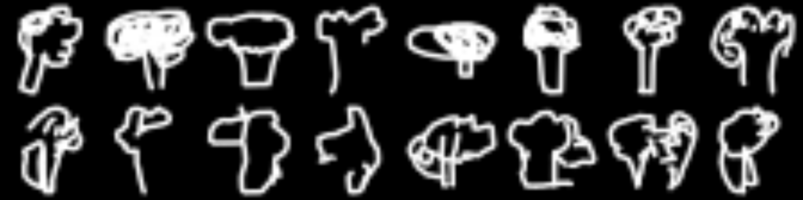
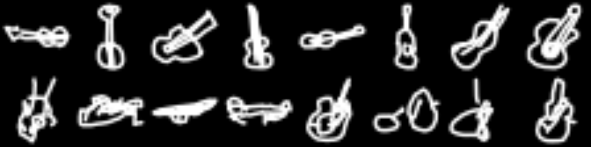

```{r setup, include=FALSE}
knitr::opts_chunk$set(echo = TRUE, eval = FALSE)
```

We've seen quite a few examples of unsupervised learning (or self-supervised learning, to choose the more correct but less
popular term) on this blog.

Often, these involved *Variational Autoencoders (VAEs)*, whose appeal lies in them allowing to model a *latent space* of
underlying, independent (preferably) factors that determine the visible features. A possible downside can be the inferior
quality of generated samples. Generative Adversarial Networks (GANs) are another popular approach. Conceptually, these are
highly attractive due to their game-theoretic framing. However, they can be difficult to train. *PixelCNN* variants, on the
other hand -- we'll subsume them all here under PixelCNN -- are generally known for their good results. They seem to involve
some more alchemy[^1] though. Under those circumstances, what could be more welcome than an easy way of experimenting with
them? Through TensorFlow Probability (TFP) and its R wrapper, [tfprobability](https://github.io/tfprobability), we now have
such a way.

[^1]: Alluding to Ali Rahimi's (in)famous "deep learning is alchemy" [talk](https://www.youtube.com/watch?v=Qi1Yry33TQE) at
    NeurIPS 2017. I would suspect that to some degree, that statement resonates with many DL practitioners -- although one
    need not agree that more mathematical rigor is the solution.

This post first gives an introduction to PixelCNN, concentrating on high-level concepts (leaving the details for the curious
to look them up in the respective papers). We'll then show an example of using `tfprobability` to experiment with the TFP
implementation.

## PixelCNN principles

### Autoregressivity, or: We need (some) order

The basic idea in PixelCNN is autoregressivity. Each pixel is modeled as depending on all prior pixels. Formally:

$$p(\mathbf{x}) = \prod_{i}p(x_i|x_0, x_1, ..., x_{i-1})$$

Now wait a second - what even *are* prior pixels? Last I saw one images were two-dimensional. So this means we have to impose
an *order* on the pixels. Commonly this will be *raster scan* order: row after row, from left to right. But when dealing with
color images, there's something else: At each position, we actually have *three* intensity values, one for each of red, green,
and blue. The original PixelCNN paper[@OordKK16] carried through autoregressivity here as well, with a pixel's intensity for
red depending on just prior pixels, those for green depending on these same prior pixels but additionally, the current value
for red, and those for blue depending on the prior pixels as well as the current values for red and green.

$$p(x_i|\mathbf{x}<i) = p(x_{i,R}|\mathbf{x}<i)\ p(x_{i,G}|\mathbf{x}<i, x_{i,R})\ p(x_{i,B}|\mathbf{x}<i, x_{i,R}, x_{i,G})$$

Here, the variant implemented in TFP, PixelCNN++[@Salimans2017PixeCNN] , introduces a simplification; it factorizes the joint
distribution in a less compute-intensive way.[^2]

[^2]: For details, see [@Salimans2017PixeCNN].

Technically, then, we know how autoregressivity is realized; intuitively, it may still seem surprising that imposing a raster
scan order "just works" (to me, at least, it is). Maybe this is one of those points where compute power successfully
compensates for lack of an equivalent of a cognitive prior.

### Masking, or: Where not to look

Now, PixelCNN ends in "CNN" for a reason -- as usual in image processing, convolutional layers (or blocks thereof) are
involved. But -- is it not the very nature of a convolution that it computes an average of some sorts, looking, for each
output pixel, not just at the corresponding input but also, at its spatial (or temporal) surroundings? How does that rhyme
with the look-at-just-prior-pixels strategy?

Surprisingly, this problem is easier to solve than it sounds. When applying the convolutional kernel, just multiply with a
mask that zeroes out any "forbidden pixels" -- like in this example for a 5x5 kernel, where we're about to compute the
convolved value for row 3, column 3:

$$\left[\begin{array}
{rrr}
1 & 1 & 1 & 1 & 1\\
1 & 1 & 1 & 1 & 1\\
1 & 1 & 1 & 0 & 0\\
0 & 0 & 0 & 0 & 0\\
0 & 0 & 0 & 0 & 0\\
\end{array}\right]
$$

This makes the algorithm honest, but introduces a different problem: With each successive convolutional layer consuming its
predecessor's output, there is a continuously growing *blind spot* (so-called in analogy to the blind spot on the retina, but
located in the top right) of pixels that are never *seen* by the algorithm. Van den Oord et al. (2016)[@OordKVEGK16] fix this
by using two different convolutional stacks, one proceeding from top to bottom, the other from left to right[^3].

[^3]: .For details, see [@OordKVEGK16].


### Conditioning, or: Show me a kitten

So far, we've always talked about "generating images" in a purely generic way. But the real attraction lies in creating
samples of some specified type -- one of the classes we've been training on, or orthogonal information fed into the network.
This is where PixelCNN becomes *Conditional PixelCNN*[@OordKVEGK16], and it is also where that feeling of magic resurfaces.
Again, as "general math" it's not hard to conceive. Here, $\mathbf{h}$ is the additional input we're conditioning on:

$$p(\mathbf{x}| \mathbf{h}) = \prod_{i}p(x_i|x_0, x_1, ..., x_{i-1}, \mathbf{h})$$

But how does this translate into neural network operations? It's just another matrix multiplication ($V^T \mathbf{h}$) added
to the convolutional outputs ($W \mathbf{x}$).

$$\mathbf{y} = tanh(W_{k,f} \mathbf{x} + V^T_{k,f} \mathbf{h}) \odot \sigma(W_{k,g} \mathbf{x} + V^T_{k,g} \mathbf{h})$$

(If you're wondering about the second part on the right, after the Hadamard product sign -- we won't go into details, but in a
nutshell, it's another modification introduced by [@OordKVEGK16], a transfer of the "gating" principle from recurrent neural
networks, such as GRUs and LSTMs, to the convolutional setting.)

So we see what goes into the decision of a pixel value to sample. But how is that decision actually *made*?

### Logistic mixture likelihood , or: No pixel is an island

Again, this is where the TFP implementation does not follow the original paper, but the latter PixelCNN++ one. Originally,
pixels were modeled as discrete values, decided on by a softmax over 256 (0-255) possible values. (That this actually worked
seems like another instance of deep learning magic. Imagine: In this model, 254 is as far from 255 as it is from 0.)

In contrast, PixelCNN++ assumes an underlying continuous distribution of color intensity, and rounds to the nearest integer.
That underlying distribution is a mixture of logistic distributions, thus allowing for multimodality:

$$\nu \sim \sum_{i} \pi_i \ logistic(\mu_i, \sigma_i)$$

### Overall architecture and the PixelCNN distribution

Overall, PixelCNN++, as described in [@Salimans2017PixeCNN], consists of six blocks. The blocks together make up a UNet-like
structure, successively downsizing the input and then, upsampling again:


In TFP's PixelCNN distribution, the number of blocks is configurable as `num_hierarchies`, the default being 3.

Each block consists of a customizable number of layers, called *ResNet layers* due to the residual connection (visible on the
right) complementing the convolutional operations in the horizontal stack:


In TFP, the number of these layers per block is configurable as `num_resnet`.

`num_resnet` and `num_hierarchies` are the parameters you're most likely to experiment with, but there are a few more you can
check out in the [documentation](https://rstudio.github.io/tfprobability/reference/tfd_pixel_cnn.html). The number of logistic
distributions in the mixture is also configurable, but from my experiments it's best to keep that number rather low to avoid
producing `NaN`s during training.

Let's now see a complete example.

## End-to-end example

Our playground will be [QuickDraw](https://github.com/googlecreativelab/quickdraw-dataset), a dataset -- still growing --
obtained by asking people to draw some object in at most twenty seconds, using the mouse. (To see for yourself, just check out
the [website](https://quickdraw.withgoogle.com/)). As of today, there are more than a fifty million instances, from 345
different classes.

First and foremost, these data were chosen to take a break from MNIST and its variants. But just like those (and many more!),
QuickDraw can be obtained, in `tfdatasets`-ready form, via [tfds](https://github.com/rstudio/tfds), the R wrapper to
TensorFlow datasets. In contrast to the MNIST "family" though, the "real samples" are themselves highly irregular, and often
even missing essential parts. So to anchor judgment, when displaying generated samples we always show eight actual drawings
with them.

### Preparing the data

The dataset being gigantic, we instruct `tfds` to load the first 500,000 drawings "only".

```{r}
library(reticulate)

# >= 2.2 required
library(tensorflow)
library(keras)

# make sure to use at least version 0.10
library(tfprobability)

library(tfdatasets)
# currently to be installed from github
library(tfds)

# load just the first 500,000 images
# nonetheless, initially the complete dataset will be downloaded and unpacked
# ... be prepared for this to take some time
train_ds <- tfds_load("quickdraw_bitmap", split='train[:500000]')
```

To speed up training further, we then zoom in on twenty classes. This effectively leaves us with \~ 1,100 - 1,500 drawings per
class.

```{r}
# bee, bicycle, broccoli, butterfly, cactus,
# frog, guitar, lightning, penguin, pizza,
# rollerskates, sea turtle, sheep, snowflake, sun,
# swan, The Eiffel Tower, tractor, train, tree
classes <- c(26, 29, 43, 49, 50,
             125, 134, 172, 218, 225,
             246, 255, 258, 271, 295,
             296, 308, 320, 322, 323
)

classes_tensor <- tf$cast(classes, tf$int64)

train_ds <- train_ds %>%
  dataset_filter(
    function(record) tf$reduce_any(tf$equal(classes_tensor, record$label), -1L)
  )

```

The PixelCNN distribution expects values in the range from 0 to 255 -- no normalization required. Preprocessing then consists
of just casting pixels and labels each to `float`:

```{r}
preprocess <- function(record) {
  record$image <- tf$cast(record$image, tf$float32) 
  record$label <- tf$cast(record$label, tf$float32)
  list(tuple(record$image, record$label))
}

batch_size <- 32

train <- train_ds %>%
  dataset_map(preprocess) %>%
  dataset_shuffle(10000) %>%
  dataset_batch(batch_size)
```

### Creating the model

We now use [tfd\_pixel\_cnn](https://rstudio.github.io/tfprobability/reference/tfd_pixel_cnn.html) to define what will be the
loglikelihood used by the model.

```{r}
dist <- tfd_pixel_cnn(
  image_shape = c(28, 28, 1),
  conditional_shape = list(),
  num_resnet = 5,
  num_hierarchies = 3,
  num_filters = 128,
  num_logistic_mix = 5,
  dropout_p =.5
)

image_input <- layer_input(shape = c(28, 28, 1))
label_input <- layer_input(shape = list())
log_prob <- dist %>% tfd_log_prob(image_input, conditional_input = label_input)
```

This custom loglikelihood is added as a loss to the model, and then, the model is compiled with just an optimizer
specification only. During training, loss first decreased quickly, but improvements from later epochs were smaller.

```{r}
model <- keras_model(inputs = list(image_input, label_input), outputs = log_prob)
model$add_loss(-tf$reduce_mean(log_prob))
model$compile(optimizer = optimizer_adam(lr = .001))

model %>% fit(train, epochs = 10)
```

To jointly display real and fake images:

```{r}
for (i in classes) {
  
  real_images <- train_ds %>%
    dataset_filter(
      function(record) record$label == tf$cast(i, tf$int64)
    ) %>% 
    dataset_take(8) %>%
    dataset_batch(8)
  it <- as_iterator(real_images)
  real_images <- iter_next(it)
  real_images <- real_images$image %>% as.array()
  real_images <- real_images[ , , , 1]/255
  
  generated_images <- dist %>% tfd_sample(8, conditional_input = i)
  generated_images <- generated_images %>% as.array()
  generated_images <- generated_images[ , , , 1]/255
  
  images <- abind::abind(real_images, generated_images, along = 1)
  png(paste0("draw_", i, ".png"), width = 8 * 28 * 10, height = 2 * 28 * 10)
  par(mfrow = c(2, 8), mar = c(0, 0, 0, 0))
  images %>%
    purrr::array_tree(1) %>%
    purrr::map(as.raster) %>%
    purrr::iwalk(plot)
  dev.off()
}
```

From our twenty classes, here's a choice of six, each showing real drawings in the top row, and fake ones below.








We probably wouldn't confuse the first and second rows, but then, the actual human drawings exhibit enormous variation, too.
And no one ever said PixelCNN was an architecture for concept learning. Feel free to play around with other datasets of your
choice -- TFP's PixelCNN distribution makes it easy.

## Wrapping up

In this post, we had `tfprobability` / TFP do all the heavy lifting for us, and so, could focus on the underlying concepts.
Depending on your inclinations, this can be an ideal situation -- you don't lose sight of the forest for the trees. On the
other hand: Should you find that changing the provided parameters doesn't achieve what you want, you have a reference
implementation to start from. So whatever the outcome, the addition of such higher-level functionality to TFP is a win for the
users. (If you're a TFP developer reading this: Yes, we'd like more :-)).

To everyone though, thanks for reading!
