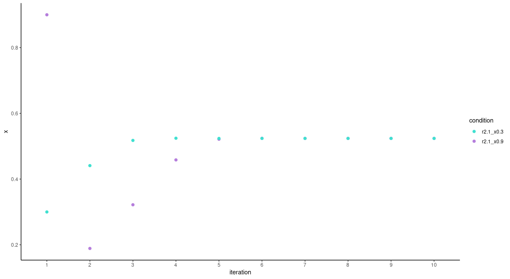
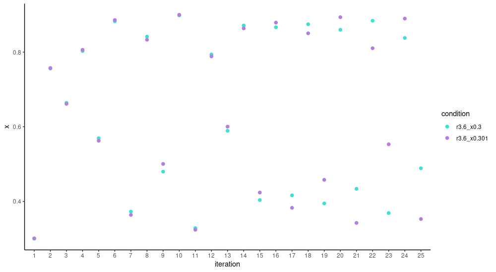
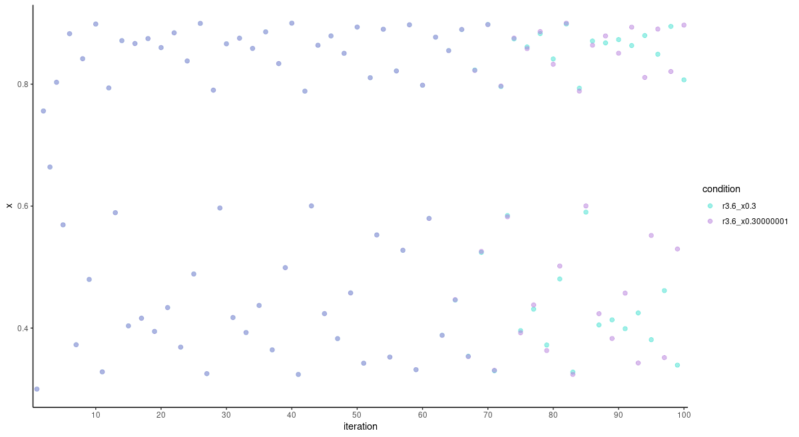
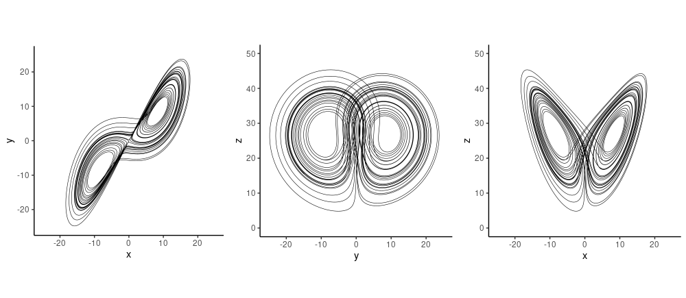
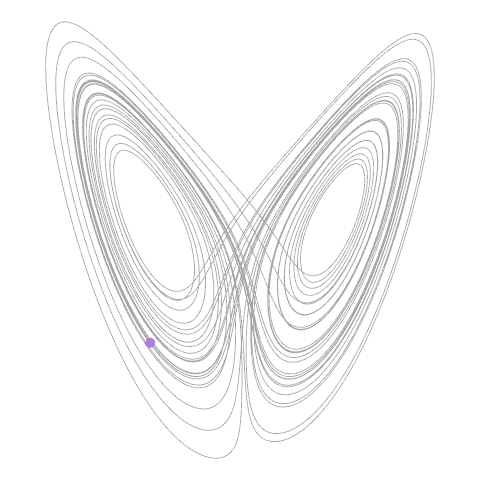

```{r setup, include=FALSE}
knitr::opts_chunk$set(echo = TRUE, eval = FALSE)
```

For us deep learning practitioners, the world is -- not flat, but -- linear, mostly. Or piecewise linear [^1]. Like other
linear approximations, or maybe even more so, deep learning can be incredibly successful at making predictions. But let's
admit it -- sometimes we just miss the thrill of the nonlinear, of good, old, deterministic-yet-unpredictable chaos. Can we
have both? It looks like we can. In this post, we'll see an application of deep learning (DL) to nonlinear time series
prediction -- or rather, the essential step that predates it: reconstructing the attractor underlying its dynamics. While this
post is an introduction, presenting the topic from scratch, further posts will build on this and extrapolate to observational
datasets.

[^1]: For many popular activation functions at least (such as ReLU). See e.g. [@Gilbert].

### What to expect from this post

In his 2020 paper *Deep reconstruction of strange attractors from time series* [@gilpin2020deep], William Gilpin uses an
autoencoder architecture, combined with a regularizer implementing the *false nearest neighbors* statistic
[@PhysRevA.45.3403], to reconstruct attractors from univariate observations of multivariate, nonlinear dynamical systems. If
you feel you completely understand the sentence you just read, you may as well directly jump to the paper -- come back for the
code though[^2]. If, on the other hand, you're more familiar with the chaos on your desk (extrapolating ... apologies) than
*chaos theory chaos*, read on. Here, we'll first go into what it's all about[^3], and then, show an example application,
featuring Edward Lorenz's famous butterfly attractor. While this initial post is primarily supposed to be a fun introduction
to a fascinating topic, we hope to follow up with applications to real-world datasets in the future.

[^2]: The paper is also accompanied by a [Python implementation](https://github.com/williamgilpin/fnn).

[^3]: To people who want to learn more about this topic, the usual recommendation is [@Strogatz]. Personally I prefer another
    source, which I can't recommend highly enough: Santa Fe Institute's [Nonlinear Dynamics: Mathematical and Computational
    Approaches](https://www.complexityexplorer.org/courses/100-nonlinear-dynamics-mathematical-and-computational-approaches),
    taught by Liz Bradley.

## Rabbits, butterflies, and low-dimensional projections: Our problem statement in context

In curious misalignment with how we use "chaos" in day-to-day language, chaos, the technical concept, is very different from
stochasticity, or randomness. Chaos may emerge from purely deterministic processes - very simplistic ones, even. Let's see
how; with rabbits.

### Rabbits, or: Sensitive dependence on initial conditions

You may be familiar with the *logistic* equation, used as a toy model for population growth. Often it's written like this --
with $x$ being the size of the population, expressed as a fraction of the maximal size (a fraction of possible rabbits, thus),
and $r$ being the growth rate (the rate at which rabbits reproduce):

$$
x_{n + 1} = r \ x_n \ (1 - x_n)
$$

This equation describes an *iterated map* over discrete timesteps $n$. Its repeated application results in a *trajectory*
describing how the population of rabbits evolves. Maps can have *fixed points*, states where further function application goes
on producing the same result forever. Example-wise, say the growth rate amounts to $2.1$, and we start at two (pretty
different!) initial values, $0.3$ and $0.8$. Both trajectories arrive at a fixed point -- the same fixed point -- in fewer
than 10 iterations. Were we asked to predict the population size after a hundred iterations, we could make a very confident
guess, whatever the of starting value. (If the initial value is $0$, we stay at $0$, but we can be pretty certain of that as
well.)

```{r, eval=TRUE, echo=FALSE, layout="l-body-outset", fig.cap = "Trajectory of the logistic map for r = 2.1 and two different initial values."}

```

What if the growth rate were somewhat higher, at $3.3$, say? Again, we immediately compare trajectories resulting from initial
values $0.3$ and $0.9$:

```{r, eval=TRUE, echo=FALSE, layout="l-body-outset", fig.cap = "Trajectory of the logistic map for r = 3.3 and two different initial values."}
knitr::include_graphics("images/2cycle.png")
```

This time, don't see a single fixed point, but a *two-cycle*: As the trajectories stabilize, population size inevitably is at
one of two possible values -- either too many rabbits or too few, you could say. The two trajectories are phase-shifted, but
again, the attracting values -- the *attractor* -- is shared by both initial conditions. So still, predictability is pretty
high. But we haven't seen everything yet.

Let's again enhance the growth rate some. Now *this* (literally) is chaos:

```{r, eval=TRUE, echo=FALSE, layout="l-body-outset", fig.cap = "Trajectory of the logistic map for r = 3.6 and two different initial values, 0.3 and 0.9."}
knitr::include_graphics("images/chaos.png")
```

Even after a hundred iterations, there is no set of values the trajectories recur to. We can't be confident about any
prediction we might make.

Or can we? After all, we have the governing equation, which is deterministic. So we should be able to calculate the size of
the population at, say, time $150$? In principle, yes; but this presupposes we have an accurate measurement for the starting
state.

How accurate? Let's compare trajectories for initial values $0.3$ and $0.301$:

```{r, eval=TRUE, echo=FALSE, layout="l-body-outset", fig.cap = "Trajectory of the logistic map for r = 3.6 and two different initial values, 0.3 and 0.301."}

```

At first, trajectories seem to jump around in unison; but during the second dozen iterations already, they dissociate more and
more, and increasingly, all bets are off. What if initial values are *really* close, as in, $0.3$ vs. $0.30000001$?

It just takes a bit longer for the disassociation to surface.

```{r, eval=TRUE, echo=FALSE, layout="l-body-outset", fig.cap = "Trajectory of the logistic map for r = 3.6 and two different initial values, 0.3 and 0.30000001."}

```

What we're seeing here is *sensitive dependence on initial conditions*, an essential precondition for a system to be chaotic.
In an nutshell: Chaos arises when a *deterministic* system shows *sensitive dependence on initial conditions*. Or as Edward
Lorenz [is said to have put it](https://en.wikipedia.org/wiki/Chaos_theory),

> When the present determines the future, but the approximate present does not approximately determine the future.

Now if these unstructured, random-looking point clouds constitute chaos, what with the all-but-amorphous butterfly (to be
displayed very soon)?

### Butterflies, or: Attractors and strange attractors

Actually, in the context of chaos theory, the term butterfly may be encountered in different contexts.

Firstly, as so-called "butterfly effect", it is an instantiation of the templatic phrase "the flap of a butterfly's wing in
\_\_\_\_\_\_\_\_\_ profoundly affects the course of the weather in \_\_\_\_\_\_\_\_\_" [^4]. In this usage, it is mostly a
metaphor for sensitive dependence on initial conditions.

[^4]: See e.g. [Wikipedia](https://en.wikipedia.org/wiki/Butterfly_effect) for some history and links to sources.

Secondly, the existence of this metaphor led to a Rorschach-test-like identification with two-dimensional visualizations of
attractors of the Lorenz system. The Lorenz system is a set of three first-order differential equations designed to describe
[atmospheric convection](https://en.wikipedia.org/wiki/Atmospheric_convection):

$$
\begin{aligned}
& \frac{dx}{dt} = \sigma (y - x)\\
& \frac{dy}{dt} = \rho x - x z - y\\
& \frac{dz}{dt} = x y - \beta z
\end{aligned}
$$

This set of equations is nonlinear, as required for chaotic behavior to appear. It also has the required dimensionality, which
for smooth, continuous systems, is at least 3[^5]. Whether we actually see chaotic attractors -- among which, the butterfly --
depends on the settings of the parameters $\sigma$, $\rho$ and $\beta$. For the values conventionally chosen, $\sigma=10$,
$\rho=28$, and $\beta=8/3$ , we see it when projecting the trajectory on the $x$ and $z$ axes:

[^5]: In discrete systems, like the logistic map, a single dimension is enough.

```{r, eval=TRUE, echo=FALSE, layout="l-body-outset", fig.cap = "Two-dimensional projections of the Lorenz attractor for sigma = 10, rho = 28, beta = 8 / 3. On the right: the butterfly."}

```

The butterfly is an *attractor* (as are the other two projections), but it is neither a point nor a cycle. It is an attractor
in the sense that starting from a variety of different initial values, we end up in some sub-region of the state space, and we
don't get to escape no more. This is easier to see when watching evolution over time, as in this animation:

```{r, eval=TRUE, echo=FALSE, layout="l-body", fig.cap = 'How the Lorenz attractor traces out the famous "butterfly" shape.'}

```

Now, to plot the attractor in two dimensions, we threw away the third. But in "real life", we don't usually have too *much*
information (although it may sometimes seem like we had). We might have a lot of measurements, but these don't usually reflect
the actual state variables we're interested in. In these cases, we may want to actually *add* information.

### Embeddings (as a non-DL term), or: Undoing the projection

Assume that instead of all three variables of the Lorenz system, we had measured just one: $x$, the rate of convection. Often
in nonlinear dynamics, the technique of delay coordinate embedding [@embedology] is used to enhance a series of univariate
measurements.

In this method -- or family of methods -- the univariate series is augmented by time-shifted copies of itself. There are two
decisions to be made: How many copies to add, and how big the delay should be. To illustrate, if we had a scalar series,

    1 2 3 4 5 6 7 8 9 10 11 ...

a three-dimensional embedding with time delay 2 would look like this:

    1 3 5
    2 4 6
    3 5 7
    4 6 8
    5 7 9
    6 8 10
    7 9 11
    ...

Of the two decisions to be made -- number of shifted series and time lag -- the first is a decision on the dimensionality of
the reconstruction space. Various theorems, such as [Taken\'s theorem](https://en.wikipedia.org/wiki/Takens%27s_theorem),
indicate bounds on the number of dimensions required, provided the dimensionality of the true state space is known -- which,
in real-world applications, often is not the case.The second has been of little interest to mathematicians, but is important
in practice. In fact, Kantz and Schreiber [@Kantz] argue that in practice, it is the product of both parameters that matters,
as it indicates the time span represented by an embedding vector.

How are these parameters chosen? Regarding reconstruction dimensionality, the reasoning goes that even in chaotic systems,
points that are close in state space at time $t$ should still be close at time $t + \Delta t$, provided $\Delta t$ is very
small. So say we have two points that are close, by some metric, when represented in two-dimensional space. But in three
dimensions, that is, if we don't "project away" the third dimension, they are a lot more distant. As illustrated in
[@gilpin2020deep]:

```{r, eval=TRUE, echo=FALSE, layout="l-body-outset", fig.cap = 'In the two-dimensional projection on axes x and y, the red points are close neighbors. In 3d, however, they are separate. Compare with the blue points, which stay close even in higher-dimensional space. Figure from Gilpin (2020).'}
knitr::include_graphics("images/fnn.png")
```

If this happens, then projecting down has eliminated some essential information. In 2d, the points were *false neighbors*. The
*false nearest neighbors* (FNN) statistic can be used to determine an adequate embedding size, like this:

For each point, take its closest neighbor in $m$ dimensions, and compute the ratio of their distances in $m$ and $m+1$
dimensions. If the ratio is larger than some threshold $t$, the neighbor was false. Sum the number of false neighbors over all
points. Do this for different $m$ and $t$, and inspect the resulting curves.

At this point, let's look ahead at the autoencoder approach. The autoencoder will use that same FNN statistic as a
regularizer, in addition to the usual autoencoder reconstruction loss. This will result in a new heuristic regarding embedding
dimensionality that involves fewer decisions.

Going back to the classic method for an instant, the second parameter, the time lag, is even more difficult to sort out
[@Kantz]. Usually, mutual information is plotted for different delays and then, the first delay where it falls below some
threshold is chosen. We don't further elaborate on this question as it is rendered obsolete in the neural network approach.
Which we'll see now.

## Learning the Lorenz attractor

Our code closely follows the architecture, parameter settings, and data setup used in the [reference
implementation](https://github.com/williamgilpin/fnn) William provided. The loss function, especially, has been ported
one-to-one.

The general idea is the following. An autoencoder -- for example, an LSTM autoencoder as presented here -- is used to compress
the univariate time series into a latent representation of some dimensionality, which will constitute an upper bound on the
dimensionality of the learned attractor. In addition to mean squared error between input and reconstructions, there will be a
second loss term, applying the FNN regularizer. This results in the latent units being roughly ordered by *importance*, as
measured by their variance. It is expected that somewhere in the listing of variances, a sharp drop will appear. The units
before the drop are then assumed to encode the *attractor* of the system in question.

In this setup, there is still a choice to be made: how to weight the FNN loss. One would run training for different weights
$\lambda$ and look for the drop. Surely, this could in principle be automated, but given the newness of the method -- the
paper was published this year -- it makes sense to focus on thorough analysis first.

### Data generation

We use the `deSolve` package to generate data from the Lorenz equations.

```{r}
library(deSolve)
library(tidyverse)

parameters <- c(sigma = 10,
                rho = 28,
                beta = 8/3)

initial_state <-
  c(x = -8.60632853,
    y = -14.85273055,
    z = 15.53352487)

lorenz <- function(t, state, parameters) {
  with(as.list(c(state, parameters)), {
    dx <- sigma * (y - x)
    dy <- x * (rho - z) - y
    dz <- x * y - beta * z
    
    list(c(dx, dy, dz))
  })
}

times <- seq(0, 500, length.out = 125000)

lorenz_ts <-
  ode(
    y = initial_state,
    times = times,
    func = lorenz,
    parms = parameters,
    method = "lsoda"
  ) %>% as_tibble()

lorenz_ts[1:10,]
```

    # A tibble: 10 x 4
          time      x     y     z
         <dbl>  <dbl> <dbl> <dbl>
     1 0        -8.61 -14.9  15.5
     2 0.00400  -8.86 -15.2  15.9
     3 0.00800  -9.12 -15.6  16.3
     4 0.0120   -9.38 -16.0  16.7
     5 0.0160   -9.64 -16.3  17.1
     6 0.0200   -9.91 -16.7  17.6
     7 0.0240  -10.2  -17.0  18.1
     8 0.0280  -10.5  -17.3  18.6
     9 0.0320  -10.7  -17.7  19.1
    10 0.0360  -11.0  -18.0  19.7

We've already seen the attractor, or rather, its three two-dimensional projections, in figure 6 above. But now our scenario is
different. We only have access to $x$, a univariate time series. As the time interval used to numerically integrate the
differential equations was rather tiny, we just use every tenth observation.

```{r}
obs <- lorenz_ts %>%
  select(time, x) %>%
  filter(row_number() %% 10 == 0)

ggplot(obs, aes(time, x)) +
  geom_line() +
  coord_cartesian(xlim = c(0, 100)) +
  theme_classic()
```

```{r, eval=TRUE, echo=FALSE, layout="l-body-outset", fig.cap = 'Convection rates as a univariate time series.'}
knitr::include_graphics("images/obs.png")
```

### Preprocessing

The first half of the series is used for training. The data is scaled and transformed into the three-dimensional form expected
by recurrent layers.

```{r}
library(keras)
library(tfdatasets)
library(tfautograph)
library(reticulate)
library(purrr)

# scale observations
obs <- obs %>% mutate(
  x = scale(x)
)

# generate timesteps
n <- nrow(obs)
n_timesteps <- 10

gen_timesteps <- function(x, n_timesteps) {
  do.call(rbind,
          purrr::map(seq_along(x),
             function(i) {
               start <- i
               end <- i + n_timesteps - 1
               out <- x[start:end]
               out
             })
  ) %>%
    na.omit()
}

# train with start of time series, test with end of time series 
x_train <- gen_timesteps(as.matrix(obs$x)[1:(n/2)], n_timesteps)
x_test <- gen_timesteps(as.matrix(obs$x)[(n/2):n], n_timesteps) 

# add required dimension for features (we have one)
dim(x_train) <- c(dim(x_train), 1)
dim(x_test) <- c(dim(x_test), 1)

# some batch size (value not crucial)
batch_size <- 100

# transform to datasets so we can use custom training
ds_train <- tensor_slices_dataset(x_train) %>%
  dataset_batch(batch_size)

ds_test <- tensor_slices_dataset(x_test) %>%
  dataset_batch(nrow(x_test))


```

### Autoencoder

With newer versions of TensorFlow (\>= 2.0, certainly if \>= 2.2), autoencoder-like models are best coded as custom models,
and trained in an "autographed" loop.[^6]

[^6]: See the [custom training tutorial](https://tensorflow.rstudio.com/tutorials/advanced/) for a blueprint.

The encoder is centered around a single LSTM layer, whose size determines the maximum dimensionality of the attractor. The
decoder then undoes the compression -- again, mainly using a single LSTM.

```{r}
# size of the latent code
n_latent <- 10L
n_features <- 1

encoder_model <- function(n_timesteps,
                          n_features,
                          n_latent,
                          name = NULL) {
  
  keras_model_custom(name = name, function(self) {
    
    self$noise <- layer_gaussian_noise(stddev = 0.5)
    self$lstm <-  layer_lstm(
      units = n_latent,
      input_shape = c(n_timesteps, n_features),
      return_sequences = FALSE
    ) 
    self$batchnorm <- layer_batch_normalization()
    
    function (x, mask = NULL) {
      x %>%
        self$noise() %>%
        self$lstm() %>%
        self$batchnorm() 
    }
  })
}

decoder_model <- function(n_timesteps,
                          n_features,
                          n_latent,
                          name = NULL) {
  
  keras_model_custom(name = name, function(self) {
    
    self$repeat_vector <- layer_repeat_vector(n = n_timesteps)
    self$noise <- layer_gaussian_noise(stddev = 0.5)
    self$lstm <- layer_lstm(
        units = n_latent,
        return_sequences = TRUE,
        go_backwards = TRUE
      ) 
    self$batchnorm <- layer_batch_normalization()
    self$elu <- layer_activation_elu() 
    self$time_distributed <- time_distributed(layer = layer_dense(units = n_features))
    
    function (x, mask = NULL) {
      x %>%
        self$repeat_vector() %>%
        self$noise() %>%
        self$lstm() %>%
        self$batchnorm() %>%
        self$elu() %>%
        self$time_distributed()
    }
  })
}


encoder <- encoder_model(n_timesteps, n_features, n_latent)
decoder <- decoder_model(n_timesteps, n_features, n_latent)

```

### Loss

As already explained above, the loss function we train with is twofold. On the one hand, we compare the original inputs with
the decoder outputs (the reconstruction), using mean squared error:

```{r}
mse_loss <- tf$keras$losses$MeanSquaredError(
  reduction = tf$keras$losses$Reduction$SUM)
```

In addition, we try to keep the number of false neighbors small, by means of the following regularizer. [^7]

[^7]: See the appendix of [@gilpin2020deep] for a pseudocode-like documentation.

```{r}
loss_false_nn <- function(x) {
 
  # original values used in Kennel et al. (1992)
  rtol <- 10 
  atol <- 2
  k_frac <- 0.01
  
  k <- max(1, floor(k_frac * batch_size))
  
  tri_mask <-
    tf$linalg$band_part(
      tf$ones(
        shape = c(n_latent, n_latent),
        dtype = tf$float32
      ),
      num_lower = -1L,
      num_upper = 0L
    )
  
   batch_masked <- tf$multiply(
     tri_mask[, tf$newaxis,], x[tf$newaxis, reticulate::py_ellipsis()]
   )
  
  x_squared <- tf$reduce_sum(
    batch_masked * batch_masked,
    axis = 2L,
    keepdims = TRUE
  )

  pdist_vector <- x_squared +
  tf$transpose(
    x_squared, perm = c(0L, 2L, 1L)
  ) -
  2 * tf$matmul(
    batch_masked,
    tf$transpose(batch_masked, perm = c(0L, 2L, 1L))
  )

  all_dists <- pdist_vector
  all_ra <-
    tf$sqrt((1 / (
      batch_size * tf$range(1, 1 + n_latent, dtype = tf$float32)
    )) *
      tf$reduce_sum(tf$square(
        batch_masked - tf$reduce_mean(batch_masked, axis = 1L, keepdims = TRUE)
      ), axis = c(1L, 2L)))
  
  all_dists <- tf$clip_by_value(all_dists, 1e-14, tf$reduce_max(all_dists))

  top_k <- tf$math$top_k(-all_dists, tf$cast(k + 1, tf$int32))
  top_indices <- top_k[[1]]

  neighbor_dists_d <- tf$gather(all_dists, top_indices, batch_dims = -1L)
  
  neighbor_new_dists <- tf$gather(
    all_dists[2:-1, , ],
    top_indices[1:-2, , ],
    batch_dims = -1L
  )
  
  # Eq. 4 of Kennel et al. (1992)
  scaled_dist <- tf$sqrt((
    tf$square(neighbor_new_dists) -
      tf$square(neighbor_dists_d[1:-2, , ])) /
      tf$square(neighbor_dists_d[1:-2, , ])
  )
  
  # Kennel condition #1
  is_false_change <- (scaled_dist > rtol)
  # Kennel condition #2
  is_large_jump <-
    (neighbor_new_dists > atol * all_ra[1:-2, tf$newaxis, tf$newaxis])
  
  is_false_neighbor <-
    tf$math$logical_or(is_false_change, is_large_jump)
  
  total_false_neighbors <-
    tf$cast(is_false_neighbor, tf$int32)[reticulate::py_ellipsis(), 2:(k + 2)]
  
  reg_weights <- 1 -
    tf$reduce_mean(tf$cast(total_false_neighbors, tf$float32), axis = c(1L, 2L))
  reg_weights <- tf$pad(reg_weights, list(list(1L, 0L)))
  
  activations_batch_averaged <-
    tf$sqrt(tf$reduce_mean(tf$square(x), axis = 0L))
  
  loss <- tf$reduce_sum(tf$multiply(reg_weights, activations_batch_averaged))
  loss
  
}

```

MSE and FNN are added , with FNN loss weighted according to the essential hyperparameter of this model:

```{r}
fnn_weight <- 10
```

This value was experimentally chosen as the one best conforming to our *look-for-the-highest-drop* heuristic.

### Model training

The training loop closely follows the aforementioned [recipe](https://tensorflow.rstudio.com/tutorials/advanced/) on how to
train with custom models and `tfautograph`.

```{r}

train_loss <- tf$keras$metrics$Mean(name='train_loss')
train_fnn <- tf$keras$metrics$Mean(name='train_fnn')
train_mse <-  tf$keras$metrics$Mean(name='train_mse')

train_step <- function(batch) {
  
  with (tf$GradientTape(persistent = TRUE) %as% tape, {
    
    code <- encoder(batch)
    reconstructed <- decoder(code)
    
    l_mse <- mse_loss(batch, reconstructed)
    l_fnn <- loss_false_nn(code)
    loss <- l_mse + fnn_weight * l_fnn
    
  })
  
  encoder_gradients <- tape$gradient(loss, encoder$trainable_variables)
  decoder_gradients <- tape$gradient(loss, decoder$trainable_variables)
  
  optimizer$apply_gradients(
    purrr::transpose(list(encoder_gradients, encoder$trainable_variables))
  )
  optimizer$apply_gradients(
    purrr::transpose(list(decoder_gradients, decoder$trainable_variables))
  )
  
  train_loss(loss)
  train_mse(l_mse)
  train_fnn(l_fnn)
}

training_loop <- tf_function(autograph(function(ds_train) {
  
  for (batch in ds_train) {
    train_step(batch)
  }
  
  tf$print("Loss: ", train_loss$result())
  tf$print("MSE: ", train_mse$result())
  tf$print("FNN loss: ", train_fnn$result())
  
  train_loss$reset_states()
  train_mse$reset_states()
  train_fnn$reset_states()
  
}))

optimizer <- optimizer_adam(lr = 1e-3)

for (epoch in 1:200) {
  cat("Epoch: ", epoch, " -----------\n")
  training_loop(ds_train)  
}

```

After two hundred epochs, overall loss is at 2.67, with the MSE component at 1.8 and FNN at 0.09.

### Obtaining the attractor from the test set

We use the test set to inspect the latent code:

```{r, eval=FALSE}
test_batch <- as_iterator(ds_test) %>% iter_next()
predicted <- encoder(test_batch) %>%
  as.array(predicted) %>%
  as_tibble()

predicted
```

    # A tibble: 6,242 x 10
          V1    V2         V3        V4        V5         V6        V7        V8       V9       V10
       <dbl> <dbl>      <dbl>     <dbl>     <dbl>      <dbl>     <dbl>     <dbl>    <dbl>     <dbl>
     1 0.439 0.401 -0.000614  -0.0258   -0.00176  -0.0000276  0.000276  0.00677  -0.0239   0.00906 
     2 0.415 0.504  0.0000481 -0.0279   -0.00435  -0.0000970  0.000921  0.00509  -0.0214   0.00921 
     3 0.389 0.619  0.000848  -0.0240   -0.00661  -0.000171   0.00106   0.00454  -0.0150   0.00794 
     4 0.363 0.729  0.00137   -0.0143   -0.00652  -0.000244   0.000523  0.00450  -0.00594  0.00476 
     5 0.335 0.809  0.00128   -0.000450 -0.00338  -0.000307  -0.000561  0.00407   0.00394 -0.000127
     6 0.304 0.828  0.000631   0.0126    0.000889 -0.000351  -0.00167   0.00250   0.0115  -0.00487 
     7 0.274 0.769 -0.000202   0.0195    0.00403  -0.000367  -0.00220  -0.000308  0.0145  -0.00726 
     8 0.246 0.657 -0.000865   0.0196    0.00558  -0.000359  -0.00208  -0.00376   0.0134  -0.00709 
     9 0.224 0.535 -0.00121    0.0162    0.00608  -0.000335  -0.00169  -0.00697   0.0106  -0.00576 
    10 0.211 0.434 -0.00129    0.0129    0.00606  -0.000306  -0.00134  -0.00927   0.00820 -0.00447 
    # … with 6,232 more rows

As a result of the FNN regularizer, the latent code units should be ordered roughly by decreasing variance, with a sharp drop
appearing some place (if the FNN weight has been chosen adequately).

For an `fnn_weight` of 10, we do see a drop after the first two units:

```{r, eval=FALSE}
predicted %>% summarise_all(var)

```

    # A tibble: 1 x 10
          V1     V2      V3      V4      V5      V6      V7      V8      V9     V10
       <dbl>  <dbl>   <dbl>   <dbl>   <dbl>   <dbl>   <dbl>   <dbl>   <dbl>   <dbl>
    1 0.0739 0.0582 1.12e-6 3.13e-4 1.43e-5 1.52e-8 1.35e-6 1.86e-4 1.67e-4 4.39e-5

So the model indicates that the Lorenz attractor can be represented in two dimensions. If we nonetheless want to plot the
complete (reconstructed) state space of three dimensions, we should reorder the remaining variables by magnitude of
variance[^8]. Here, this results in three projections of the set `V1`, `V2` and `V4`:

[^8]: As per author recommendation (personal communication).

```{r, eval=TRUE, echo=FALSE, layout="l-body-outset", fig.cap = 'Attractors as predicted from the latent code (test set). The three highest-variance variables were chosen.'}
knitr::include_graphics("images/predicted_attractors.png")
```

## Wrapping up (for this time)

At this point, we've seen how to reconstruct the Lorenz attractor from data we did not train on (the test set), using an
autoencoder regularized by a custom *false nearest neighbors* loss. It is important to stress that at no point was the network
presented with the expected solution (attractor) -- training was purely unsupervised.

This is a fascinating result. Of course, thinking practically, the next step is to obtain predictions on heldout data. Given
how long this text has become already, we reserve that for a follow-up post. And again *of course*, we're thinking about other
datasets, especially ones where the true state space is not known beforehand. What about measurement noise? What about
datasets that are not completely deterministic[^9]? There is a lot to explore, stay tuned -- and as always, thanks for
reading!

[^9]: See [@Kantz] for detailed discussions on using methodology from nonlinear deterministic systems analysis for noisy
    and/or partly-stochastic data.
