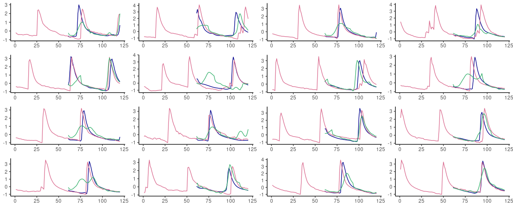
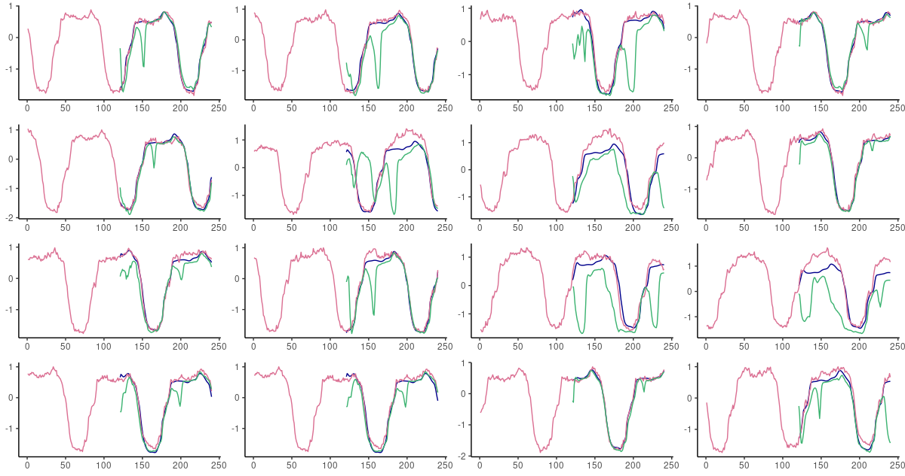
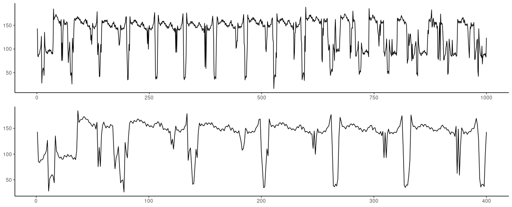
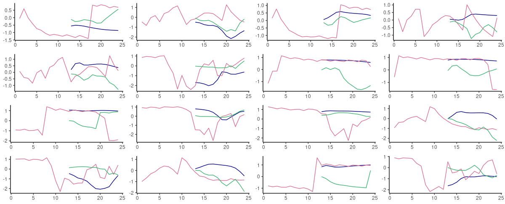
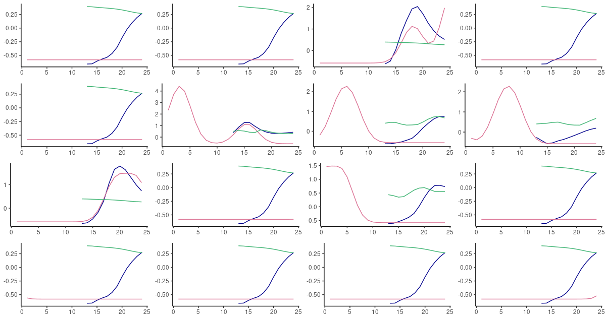

```{r setup, include=FALSE}
knitr::opts_chunk$set(echo = TRUE, eval = FALSE)
```

Today, we pick up on the plan alluded to in the conclusion of the recent [Deep attractors: Where deep learning meets
chaos](https://blogs.rstudio.com/ai/posts/2020-06-24-deep-attractors/): employ that same technique to generate *forecasts* for
empirical time series data.

"That same technique", which for conciseness, I'll take the liberty of referring to as FNN-LSTM, is due to William Gilpin's
2020 paper "Deep reconstruction of strange attractors from time series" [@gilpin2020deep].

In a nutshell[^1], the problem addressed is as follows: A system, known or assumed to be nonlinear and highly dependent on
initial conditions, is observed, resulting in a scalar series of measurements. The measurements are not just -- inevitably --
noisy, but in addition, they are -- at best -- a projection of a multidimensional state space onto a line.

[^1]: Please refer to the aforementioned predecessor post for a detailed introduction.

Classically in nonlinear time series analysis, such scalar series of observations are augmented by supplementing, at every
point in time, delayed measurements of that same series -- a technique called *delay coordinate embedding* [@embedology]. For
example, instead of just a single vector `X1`, we could have a matrix of vectors `X1`, `X2`, and `X3`, with `X2` containing
the same values as `X1`, but starting from the third observation, and `X3`, from the fifth. In this case, the *delay* would be
2, and the *embedding dimension*, 3. Various [theorems](https://en.wikipedia.org/wiki/Takens's_theorem) state that if these
parameters are chosen adequately, it is possible to reconstruct the complete state space. There is a problem though: The
theorems assume that the dimensionality of the true state space is known, which in many real-world applications, won't be the
case.

This is where Gilpin's idea comes in: Train an autoencoder, whose intermediate representation encapsulates the system's
attractor. Not just any MSE-optimized autoencoder though. The latent representation is regularized by *false nearest
neighbors* (FNN) loss, a technique commonly used with delay coordinate embedding to determine an adequate embedding dimension.
False neighbors are those who are close in `n`-dimensional space, but significantly farther apart in `n+1`-dimensional space.
In the aforementioned introductory [post](https://blogs.rstudio.com/ai/posts/2020-06-24-deep-attractors/), we showed how this
technique allowed to reconstruct the attractor of the (synthetic) Lorenz system. Now, we want to move on to prediction.

We first describe the setup, including model definitions, training procedures, and data preparation. Then, we tell you how it
went.

## Setup

### From reconstruction to forecasting, and branching out into the real world

In the previous post, we trained an LSTM autoencoder to generate a compressed code, representing the attractor of the system.
As usual with autoencoders, the target when training is the same as the input, meaning that overall loss consisted of two
components: The FNN loss, computed on the latent representation only, and the mean-squared-error loss between input and
output. Now for prediction, the target consists of future values, as many as we wish to predict. Put differently: The
architecture stays the same, but instead of reconstruction we perform prediction, in the standard RNN way. Where the usual RNN
setup would just directly chain the desired number of LSTMs, we have an LSTM encoder that outputs a (timestep-less) latent
code, and an LSTM decoder that starting from that code, repeated as many times as required, forecasts the required number of
future values.

This of course means that to evaluate forecast performance, we need to compare against an LSTM-only setup. This is exactly
what we'll do, and comparison will turn out to be interesting not just quantitatively, but *qualitatively* as well.

We perform these comparisons on the four datasets Gilpin chose to demonstrate [attractor reconstruction on observational
data](https://github.com/williamgilpin/fnn/blob/master/exploratory.ipynb). While all of these, as is evident from the images
in that notebook, exhibit nice attractors, we'll see that not all of them are equally suited to forecasting using simple
RNN-based architectures -- with or without FNN regularization. But even those that clearly demand a different approach allow
for interesting observations as to the impact of FNN loss.

### Model definitions and training setup

In all four experiments, we use the same model definitions and training procedures, the only differing parameter being the
number of timesteps used in the LSTMs (for reasons that will become evident when we introduce the individual datasets).

Both architectures were chosen to be straightforward, and about comparable in number of parameters -- both basically consist
of two LSTMs with 32 units (`n_recurrent` will be set to 32 for all experiments). [^2]

[^2]: "Basically" because FNN-LSTM technically has three LSTMs -- the third one, with `n_latent = 10` units, being used to
    store the latent code.

#### FNN-LSTM

FNN-LSTM looks nearly like in the previous post, apart from the fact that we split up the encoder LSTM into two, to uncouple
capacity (`n_recurrent`) from maximal latent state dimensionality (`n_latent`, kept at 10 just like before).

```{r, eval = FALSE}
# DL-related packages
library(tensorflow)
library(keras)
library(tfdatasets)
library(tfautograph)
library(reticulate)

# going to need those later
library(tidyverse)
library(cowplot)

encoder_model <- function(n_timesteps,
                          n_features,
                          n_recurrent,
                          n_latent,
                          name = NULL) {
  
  keras_model_custom(name = name, function(self) {
    
    self$noise <- layer_gaussian_noise(stddev = 0.5)
    self$lstm1 <-  layer_lstm(
      units = n_recurrent,
      input_shape = c(n_timesteps, n_features),
      return_sequences = TRUE
    ) 
    self$batchnorm1 <- layer_batch_normalization()
    self$lstm2 <-  layer_lstm(
      units = n_latent,
      return_sequences = FALSE
    ) 
    self$batchnorm2 <- layer_batch_normalization()
    
    function (x, mask = NULL) {
      x %>%
        self$noise() %>%
        self$lstm1() %>%
        self$batchnorm1() %>%
        self$lstm2() %>%
        self$batchnorm2() 
    }
  })
}

decoder_model <- function(n_timesteps,
                          n_features,
                          n_recurrent,
                          n_latent,
                          name = NULL) {
  
  keras_model_custom(name = name, function(self) {
    
    self$repeat_vector <- layer_repeat_vector(n = n_timesteps)
    self$noise <- layer_gaussian_noise(stddev = 0.5)
    self$lstm <- layer_lstm(
      units = n_recurrent,
      return_sequences = TRUE,
      go_backwards = TRUE
    ) 
    self$batchnorm <- layer_batch_normalization()
    self$elu <- layer_activation_elu() 
    self$time_distributed <- time_distributed(layer = layer_dense(units = n_features))
    
    function (x, mask = NULL) {
      x %>%
        self$repeat_vector() %>%
        self$noise() %>%
        self$lstm() %>%
        self$batchnorm() %>%
        self$elu() %>%
        self$time_distributed()
    }
  })
}

n_latent <- 10L
n_features <- 1
n_hidden <- 32

encoder <- encoder_model(n_timesteps,
                         n_features,
                         n_hidden,
                         n_latent)

decoder <- decoder_model(n_timesteps,
                         n_features,
                         n_hidden,
                         n_latent)


```

The regularizer, FNN loss, is unchanged:

```{r, eval = FALSE}
loss_false_nn <- function(x) {
  
  # changing these parameters is equivalent to
  # changing the strength of the regularizer, so we keep these fixed (these values
  # correspond to the original values used in Kennel et al 1992).
  rtol <- 10 
  atol <- 2
  k_frac <- 0.01
  
  k <- max(1, floor(k_frac * batch_size))
  
  ## Vectorized version of distance matrix calculation
  tri_mask <-
    tf$linalg$band_part(
      tf$ones(
        shape = c(tf$cast(n_latent, tf$int32), tf$cast(n_latent, tf$int32)),
        dtype = tf$float32
      ),
      num_lower = -1L,
      num_upper = 0L
    )
  
  # latent x batch_size x latent
  batch_masked <-
    tf$multiply(tri_mask[, tf$newaxis,], x[tf$newaxis, reticulate::py_ellipsis()])
  
  # latent x batch_size x 1
  x_squared <-
    tf$reduce_sum(batch_masked * batch_masked,
                  axis = 2L,
                  keepdims = TRUE)
  
  # latent x batch_size x batch_size
  pdist_vector <- x_squared + tf$transpose(x_squared, perm = c(0L, 2L, 1L)) -
    2 * tf$matmul(batch_masked, tf$transpose(batch_masked, perm = c(0L, 2L, 1L)))
  
  #(latent, batch_size, batch_size)
  all_dists <- pdist_vector
  # latent
  all_ra <-
    tf$sqrt((1 / (
      batch_size * tf$range(1, 1 + n_latent, dtype = tf$float32)
    )) *
      tf$reduce_sum(tf$square(
        batch_masked - tf$reduce_mean(batch_masked, axis = 1L, keepdims = TRUE)
      ), axis = c(1L, 2L)))
  
  # Avoid singularity in the case of zeros
  #(latent, batch_size, batch_size)
  all_dists <-
    tf$clip_by_value(all_dists, 1e-14, tf$reduce_max(all_dists))
  
  #inds = tf.argsort(all_dists, axis=-1)
  top_k <- tf$math$top_k(-all_dists, tf$cast(k + 1, tf$int32))
  # (#(latent, batch_size, batch_size)
  top_indices <- top_k[[1]]
  
  #(latent, batch_size, batch_size)
  neighbor_dists_d <-
    tf$gather(all_dists, top_indices, batch_dims = -1L)
  #(latent - 1, batch_size, batch_size)
  neighbor_new_dists <-
    tf$gather(all_dists[2:-1, , ],
              top_indices[1:-2, , ],
              batch_dims = -1L)
  
  # Eq. 4 of Kennel et al.
  #(latent - 1, batch_size, batch_size)
  scaled_dist <- tf$sqrt((
    tf$square(neighbor_new_dists) -
      # (9, 8, 2)
      tf$square(neighbor_dists_d[1:-2, , ])) /
      # (9, 8, 2)
      tf$square(neighbor_dists_d[1:-2, , ])
  )
  
  # Kennel condition #1
  #(latent - 1, batch_size, batch_size)
  is_false_change <- (scaled_dist > rtol)
  # Kennel condition 2
  #(latent - 1, batch_size, batch_size)
  is_large_jump <-
    (neighbor_new_dists > atol * all_ra[1:-2, tf$newaxis, tf$newaxis])
  
  is_false_neighbor <-
    tf$math$logical_or(is_false_change, is_large_jump)
  #(latent - 1, batch_size, 1)
  total_false_neighbors <-
    tf$cast(is_false_neighbor, tf$int32)[reticulate::py_ellipsis(), 2:(k + 2)]
  
  # Pad zero to match dimensionality of latent space
  # (latent - 1)
  reg_weights <-
    1 - tf$reduce_mean(tf$cast(total_false_neighbors, tf$float32), axis = c(1L, 2L))
  # (latent,)
  reg_weights <- tf$pad(reg_weights, list(list(1L, 0L)))
  
  # Find batch average activity
  
  # L2 Activity regularization
  activations_batch_averaged <-
    tf$sqrt(tf$reduce_mean(tf$square(x), axis = 0L))
  
  loss <- tf$reduce_sum(tf$multiply(reg_weights, activations_batch_averaged))
  loss
  
}

```

Training is unchanged as well, apart from the fact that now, we continually output latent variable variances in addition to
the losses. This is because with FNN-LSTM, we have to choose an adequate weight for the FNN loss component. An "adequate
weight" is one where the variance drops sharply after the first `n` variables, with `n` thought to correspond to attractor
dimensionality. For the Lorenz system discussed in the previous post, this is how these variances looked:

         V1       V2        V3        V4        V5        V6        V7        V8        V9       V10
     0.0739   0.0582   1.12e-6   3.13e-4   1.43e-5   1.52e-8   1.35e-6   1.86e-4   1.67e-4   4.39e-5

If we take variance as an indicator of *importance*, the first two variables are clearly more important than the rest. This
finding nicely corresponds to "official" estimates of Lorenz attractor dimensionality. For example, the correlation dimension
is estimated to lie around 2.05 [@GRASSBERGER1983189].

Thus, here we have the training routine:

```{r, eval = FALSE}
train_step <- function(batch) {
  with (tf$GradientTape(persistent = TRUE) %as% tape, {
    code <- encoder(batch[[1]])
    prediction <- decoder(code)
    
    l_mse <- mse_loss(batch[[2]], prediction)
    l_fnn <- loss_false_nn(code)
    loss <- l_mse + fnn_weight * l_fnn
  })
  
  encoder_gradients <-
    tape$gradient(loss, encoder$trainable_variables)
  decoder_gradients <-
    tape$gradient(loss, decoder$trainable_variables)
  
  optimizer$apply_gradients(purrr::transpose(list(
    encoder_gradients, encoder$trainable_variables
  )))
  optimizer$apply_gradients(purrr::transpose(list(
    decoder_gradients, decoder$trainable_variables
  )))
  
  train_loss(loss)
  train_mse(l_mse)
  train_fnn(l_fnn)
  
  
}

training_loop <- tf_function(autograph(function(ds_train) {
  for (batch in ds_train) {
    train_step(batch)
  }
  
  tf$print("Loss: ", train_loss$result())
  tf$print("MSE: ", train_mse$result())
  tf$print("FNN loss: ", train_fnn$result())
  
  train_loss$reset_states()
  train_mse$reset_states()
  train_fnn$reset_states()
  
}))


mse_loss <-
  tf$keras$losses$MeanSquaredError(reduction = tf$keras$losses$Reduction$SUM)

train_loss <- tf$keras$metrics$Mean(name = 'train_loss')
train_fnn <- tf$keras$metrics$Mean(name = 'train_fnn')
train_mse <-  tf$keras$metrics$Mean(name = 'train_mse')

# fnn_multiplier should be chosen individually per dataset
# this is the value we used on the geyser dataset
fnn_multiplier <- 0.7
fnn_weight <- fnn_multiplier * nrow(x_train)/batch_size

# learning rate may also need adjustment
optimizer <- optimizer_adam(lr = 1e-3)

for (epoch in 1:200) {
 cat("Epoch: ", epoch, " -----------\n")
 training_loop(ds_train)
 
 test_batch <- as_iterator(ds_test) %>% iter_next()
 encoded <- encoder(test_batch[[1]]) 
 test_var <- tf$math$reduce_variance(encoded, axis = 0L)
 print(test_var %>% as.numeric() %>% round(5))
}


```

On to what we'll use as a baseline for comparison.

#### Vanilla LSTM

Here is the vanilla LSTM, stacking two layers, each, again, of size 32. Dropout and recurrent dropout were chosen individually
per dataset, as was the learning rate.

```{r, eval = FALSE}
lstm <- function(n_latent, n_timesteps, n_features, n_recurrent, dropout, recurrent_dropout,
                 optimizer = optimizer_adam(lr =  1e-3)) {
  
  model <- keras_model_sequential() %>%
    layer_lstm(
      units = n_recurrent,
      input_shape = c(n_timesteps, n_features),
      dropout = dropout, 
      recurrent_dropout = recurrent_dropout,
      return_sequences = TRUE
    ) %>% 
    layer_lstm(
      units = n_recurrent,
      dropout = dropout,
      recurrent_dropout = recurrent_dropout,
      return_sequences = TRUE
    ) %>% 
    time_distributed(layer_dense(units = 1))
  
  model %>%
    compile(
      loss = "mse",
      optimizer = optimizer
    )
  model
  
}

model <- lstm(n_latent, n_timesteps, n_features, n_hidden, dropout = 0.2, recurrent_dropout = 0.2)

```

### Data preparation

For all experiments, data were prepared in the same way.

In every case, we used the first 10000 measurements available in the respective `.pkl` files [provided by Gilpin in his GitHub
repository](https://github.com/williamgilpin/fnn/tree/master/datasets). To save on file size and not depend on an external
data source, we extracted those first 10000 entries to `.csv` files downloadable directly from this blog's repo:

```{r eval = FALSE}
geyser <- download.file(
  "https://raw.githubusercontent.com/rstudio/ai-blog/master/docs/posts/2020-07-20-fnn-lstm/data/geyser.csv",
  "data/geyser.csv")

electricity <- download.file(
  "https://raw.githubusercontent.com/rstudio/ai-blog/master/docs/posts/2020-07-20-fnn-lstm/data/electricity.csv",
  "data/electricity.csv")

ecg <- download.file(
  "https://raw.githubusercontent.com/rstudio/ai-blog/master/docs/posts/2020-07-20-fnn-lstm/data/ecg.csv",
  "data/ecg.csv")

mouse <- download.file(
  "https://raw.githubusercontent.com/rstudio/ai-blog/master/docs/posts/2020-07-20-fnn-lstm/data/mouse.csv",
  "data/mouse.csv")
```

Should you want to access the complete time series (of considerably greater lengths), just download them from Gilpin's repo
and load them using `reticulate`:

```{r, eval = FALSE}
# e.g.
geyser <- reticulate::py_load_object("geyser_train_test.pkl")
```

Here is the data preparation code for the first dataset, `geyser` - all other datasets were treated the same way.

```{r, eval = FALSE}
# the first 10000 measurements from the compilation provided by Gilpin
geyser <- read_csv("geyser.csv", col_names = FALSE) %>% select(X1) %>% pull() %>% unclass()

# standardize
geyser <- scale(geyser)

# varies per dataset; see below 
n_timesteps <- 60
batch_size <- 32

# transform into [batch_size, timesteps, features] format required by RNNs
gen_timesteps <- function(x, n_timesteps) {
  do.call(rbind,
          purrr::map(seq_along(x),
                     function(i) {
                       start <- i
                       end <- i + n_timesteps - 1
                       out <- x[start:end]
                       out
                     })
  ) %>%
    na.omit()
}

n <- 10000
train <- gen_timesteps(geyser[1:(n/2)], 2 * n_timesteps)
test <- gen_timesteps(geyser[(n/2):n], 2 * n_timesteps) 

dim(train) <- c(dim(train), 1)
dim(test) <- c(dim(test), 1)

# split into input and target  
x_train <- train[ , 1:n_timesteps, , drop = FALSE]
y_train <- train[ , (n_timesteps + 1):(2*n_timesteps), , drop = FALSE]

x_test <- test[ , 1:n_timesteps, , drop = FALSE]
y_test <- test[ , (n_timesteps + 1):(2*n_timesteps), , drop = FALSE]

# create tfdatasets
ds_train <- tensor_slices_dataset(list(x_train, y_train)) %>%
  dataset_shuffle(nrow(x_train)) %>%
  dataset_batch(batch_size)

ds_test <- tensor_slices_dataset(list(x_test, y_test)) %>%
  dataset_batch(nrow(x_test))

```

Now we're ready to look at how forecasting goes on our four datasets.

## Experiments

### Geyser dataset

People working with time series may have heard of [Old Faithful](https://en.wikipedia.org/wiki/Old_Faithful), a geyser in
Wyoming, US that has continually been erupting every 44 minutes to two hours since the year 2004. For the subset of data
Gilpin extracted[^3],

[^3]: see dataset descriptions in the [repository\'s README](https://github.com/williamgilpin/fnn)

> `geyser_train_test.pkl` corresponds to detrended temperature readings from the main runoff pool of the Old Faithful geyser
> in Yellowstone National Park, downloaded from the [GeyserTimes database](https://geysertimes.org/). Temperature measurements
> start on April 13, 2015 and occur in one-minute increments.

Like we said above, `geyser.csv` is a subset of these measurements, comprising the first 10000 data points. To choose an
adequate timestep for the LSTMs, we inspect the series at various resolutions:

```{r, eval=TRUE, echo=FALSE, layout="l-body-outset", fig.cap = "Geyer dataset. Top: First 1000 observations. Bottom: Zooming in on the first 200."}
knitr::include_graphics("images/geyser_ts.png")
```

It seems like the behavior is periodic with a period of about 40-50; a timestep of 60 thus seemed like a good try.

Having trained both FNN-LSTM and the vanilla LSTM for 200 epochs, we first inspect the variances of the latent variables on
the test set. The value of `fnn_multiplier` corresponding to this run was `0.7`.

```{r, eval = FALSE}
test_batch <- as_iterator(ds_test) %>% iter_next()
encoded <- encoder(test_batch[[1]]) %>%
  as.array() %>%
  as_tibble()

encoded %>% summarise_all(var)

```

```{}
   V1     V2        V3          V4       V5       V6       V7       V8       V9      V10
0.258 0.0262 0.0000627 0.000000600 0.000533 0.000362 0.000238 0.000121 0.000518 0.000365
```

There is a drop in importance between the first two variables and the rest; however, unlike in the Lorenz system, `V1` and
`V2` variances also differ by an order of magnitude.

Now, it's interesting to compare prediction errors for both models. We are going to make an observation that will carry
through to all three datasets to come.

Keeping up the suspense for a while, here is the code used to compute per-timestep prediction errors from both models. The
same code will be used for all other datasets.

```{r, eval = FALSE}
calc_mse <- function(df, y_true, y_pred) {
  (sum((df[[y_true]] - df[[y_pred]])^2))/nrow(df)
}

get_mse <- function(test_batch, prediction) {
  
  comp_df <- 
    data.frame(
      test_batch[[2]][, , 1] %>%
        as.array()) %>%
        rename_with(function(name) paste0(name, "_true")) %>%
    bind_cols(
      data.frame(
        prediction[, , 1] %>%
          as.array()) %>%
          rename_with(function(name) paste0(name, "_pred")))
  
  mse <- purrr::map(1:dim(prediction)[2],
                        function(varno)
                          calc_mse(comp_df,
                                   paste0("X", varno, "_true"),
                                   paste0("X", varno, "_pred"))) %>%
    unlist()
  
  mse
}

prediction_fnn <- decoder(encoder(test_batch[[1]]))
mse_fnn <- get_mse(test_batch, prediction_fnn)

prediction_lstm <- model %>% predict(ds_test)
mse_lstm <- get_mse(test_batch, prediction_lstm)

mses <- data.frame(timestep = 1:n_timesteps, fnn = mse_fnn, lstm = mse_lstm) %>%
  gather(key = "type", value = "mse", -timestep)

ggplot(mses, aes(timestep, mse, color = type)) +
  geom_point() +
  scale_color_manual(values = c("#00008B", "#3CB371")) +
  theme_classic() +
  theme(legend.position = "none") 
```

And here is the actual comparison. One thing especially jumps to the eye: FNN-LSTM forecast error is significantly lower for
initial timesteps, first and foremost, for the very first prediction, which from this graph we expect to be pretty good!

```{r, eval=TRUE, echo=FALSE, layout="l-body-outset", fig.cap = "Per-timestep prediction error as obtained by FNN-LSTM and a vanilla stacked LSTM. Green: LSTM. Blue: FNN-LSTM."}
knitr::include_graphics("images/geyser_mses.png")
```


Interestingly, we see "jumps" in prediction error, for FNN-LSTM, between the very first forecast and the second, and then
between the second and the ensuing ones, reminding of the similar jumps in variable importance for the latent code! After the
first ten timesteps, vanilla LSTM has caught up with FNN-LSTM, and we won't interpret further development of the losses based
on just a single run's output.

Instead, let's inspect actual predictions. We randomly pick sequences from the test set, and ask both FNN-LSTM and vanilla
LSTM for a forecast. The same procedure will be followed for the other datasets.

```{r, eval = FALSE}
given <- data.frame(as.array(tf$concat(list(
  test_batch[[1]][, , 1], test_batch[[2]][, , 1]
),
axis = 1L)) %>% t()) %>%
  add_column(type = "given") %>%
  add_column(num = 1:(2 * n_timesteps))

fnn <- data.frame(as.array(prediction_fnn[, , 1]) %>%
                    t()) %>%
  add_column(type = "fnn") %>%
  add_column(num = (n_timesteps  + 1):(2 * n_timesteps))

lstm <- data.frame(as.array(prediction_lstm[, , 1]) %>%
                     t()) %>%
  add_column(type = "lstm") %>%
  add_column(num = (n_timesteps + 1):(2 * n_timesteps))

compare_preds_df <- bind_rows(given, lstm, fnn)

plots <- 
  purrr::map(sample(1:dim(compare_preds_df)[2], 16),
             function(v) {
               ggplot(compare_preds_df, aes(num, .data[[paste0("X", v)]], color = type)) +
                 geom_line() +
                 theme_classic() +
                 theme(legend.position = "none", axis.title = element_blank()) +
                 scale_color_manual(values = c("#00008B", "#DB7093", "#3CB371"))
             })

plot_grid(plotlist = plots, ncol = 4)
```

Here are sixteen random picks of predictions on the test set. The ground truth is displayed in pink; blue forecasts are from
FNN-LSTM, green ones from vanilla LSTM.

```{r, eval=TRUE, echo=FALSE, layout="l-body-outset", fig.cap = "60-step ahead predictions from FNN-LSTM (blue) and vanilla LSTM (green) on randomly selected sequences from the test set. Pink: the ground truth."}

```

What we expect from the error inspection comes true: FNN-LSTM yields significantly better predictions for immediate
continuations of a given sequence.

Let's move on to the second dataset on our list.

### Electricity dataset

This is a dataset on power consumption, aggregated over 321 different households and fifteen-minute-intervals.

> `electricity_train_test.pkl` corresponds to average power consumption by 321 Portuguese households between 2012 and 2014, in
> units of kilowatts consumed in fifteen minute increments. This dataset is from the [UCI machine learning
> database](http://archive.ics.uci.edu/ml/datasets/ElectricityLoadDiagrams20112014). [^4]

[^4]: again, citing from Gilpin's repository's [README](https://github.com/williamgilpin/fnn).

Here, we see a very regular pattern:

```{r, eval=TRUE, echo=FALSE, layout="l-body-outset", fig.cap = "Electricity dataset. Top: First 2000 observations. Bottom: Zooming in on 500 observations, skipping the very beginning of the series."}
knitr::include_graphics("images/electricity_ts.png")
```

With such regular behavior, we immediately tried to predict a higher number of timesteps (`120`) -- and didn't have to retract
behind that aspiration.

For an `fnn_multiplier` of `0.5`, latent variable variances look like this:

```{}
V1          V2            V3       V4       V5            V6       V7         V8      V9     V10
0.390 0.000637 0.00000000288 1.48e-10 2.10e-11 0.00000000119 6.61e-11 0.00000115 1.11e-4 1.40e-4
```

We definitely see a sharp drop already after the first variable.

How do prediction errors compare on the two architectures?

```{r, eval=TRUE, echo=FALSE, layout="l-body-outset", fig.cap = "Per-timestep prediction error as obtained by FNN-LSTM and a vanilla stacked LSTM. Green: LSTM. Blue: FNN-LSTM."}
knitr::include_graphics("images/electricity_mses.png")
```

Here, FNN-LSTM performs better over a long range of timesteps, but again, the difference is most visible for immediate
predictions. Will an inspection of actual predictions confirm this view?

```{r, eval=TRUE, echo=FALSE, layout="l-body-outset", fig.cap = "60-step ahead predictions from FNN-LSTM (blue) and vanilla LSTM (green) on randomly selected sequences from the test set. Pink: the ground truth."}

```

It does! In fact, forecasts from FNN-LSTM are very impressive on all time scales.

Now that we've seen the easy and predictable, let's approach the weird and difficult.

### ECG dataset

Says Gilpin,

> `ecg_train.pkl` and `ecg_test.pkl` correspond to ECG measurements for two different patients, taken from the [PhysioNet QT
> database](https://physionet.org/content/qtdb/1.0.0/). [^5]

[^5]: again, citing from Gilpin's repository's [README](https://github.com/williamgilpin/fnn).

How do these look?

```{r, eval=TRUE, echo=FALSE, layout="l-body-outset", fig.cap = "ECG dataset. Top: First 1000 observations. Bottom: Zooming in on the first 400 observations."}

```

To the layperson that I am, these do not look nearly as regular as expected. First experiments showed that both architectures
are not capable of dealing with a high number of timesteps. In every try, FNN-LSTM performed better for the very first
timestep.

This is also the case for `n_timesteps = 12`, the final try (after `120`, `60` and `30`). With an `fnn_multiplier` of `1`, the
latent variances obtained amounted to the following:

         V1        V2          V3        V4         V5       V6       V7         V8         V9       V10
      0.110  1.16e-11     3.78e-9 0.0000992    9.63e-9  4.65e-5  1.21e-4    9.91e-9    3.81e-9   2.71e-8

There *is* a gap between the first variable and all other ones; but not much variance is explained by `V1` either.

Apart from the very first prediction, vanilla LSTM shows lower forecast errors this time; however, we have to add that this
was not consistently observed when experimenting with other timestep settings.

```{r, eval=TRUE, echo=FALSE, layout="l-body-outset", fig.cap = "Per-timestep prediction error as obtained by FNN-LSTM and a vanilla stacked LSTM. Green: LSTM. Blue: FNN-LSTM."}
knitr::include_graphics("images/ecg_mses.png")
```

Looking at actual predictions, both architectures perform best when a persistence forecast is adequate -- in fact, they
produce one even when it is *not*.

```{r, eval=TRUE, echo=FALSE, layout="l-body-outset", fig.cap = "60-step ahead predictions from FNN-LSTM (blue) and vanilla LSTM (green) on randomly selected sequences from the test set. Pink: the ground truth."}

```

On this dataset, we certainly would want to explore other architectures better able to capture the presence of high *and* low
frequencies in the data, such as mixture models. But -- were we forced to stay with one of these, and could do a
one-step-ahead, rolling forecast, we'd go with FNN-LSTM.

Speaking of mixed frequencies -- we haven't seen the extremes yet ...

### Mouse dataset

"Mouse", that's spike rates recorded from a mouse thalamus.

> `mouse.pkl` A time series of spiking rates for a neuron in a mouse thalamus. Raw spike data was obtained from
> [CRCNS](http://crcns.org/data-sets/thalamus/th-1/about-th-1) and processed with the authors\' code in order to generate a
> spike rate time series. [^6]

[^6]: again, citing from Gilpin's repository's [README](https://github.com/williamgilpin/fnn).

```{r, eval=TRUE, echo=FALSE, layout="l-body-outset", fig.cap = "Mouse dataset. Top: First 2000 observations. Bottom: Zooming in on the first 500 observations."}
knitr::include_graphics("images/mouse_ts.png")
```

Obviously, this dataset will be very hard to predict. How, after "long" silence, do you know that a neuron is going to fire?

As usual, we inspect latent code variances (`fnn_multiplier` was set to `0.4`):

```{r, eval = FALSE}
     V1       V2        V3         V4       V5       V6        V7      V8       V9        V10
 0.0796  0.00246  0.000214    2.26e-7   .71e-9  4.22e-8  6.45e-10 1.61e-4 2.63e-10    2.05e-8
>
```

Again, we don't see the first variable explaining much variance. Still, interestingly, when inspecting forecast errors we get
a picture very similar to the one obtained on our first, `geyser`, dataset:

```{r, eval=TRUE, echo=FALSE, layout="l-body-outset", fig.cap = "Per-timestep prediction error as obtained by FNN-LSTM and a vanilla stacked LSTM. Green: LSTM. Blue: FNN-LSTM."}
knitr::include_graphics("images/mouse_mses.png")
```

So here, the latent code definitely seems to help! With every timestep "more" that we try to predict, prediction performance
goes down *continuously* -- or put the other way round, short-time predictions are expected to be pretty good!

Let's see:

```{r, eval=TRUE, echo=FALSE, layout="l-body-outset", fig.cap = "60-step ahead predictions from FNN-LSTM (blue) and vanilla LSTM (green) on randomly selected sequences from the test set. Pink: the ground truth."}

```

In fact on this dataset, the difference in behavior between both architectures is striking. When nothing is "supposed to
happen", vanilla LSTM produces "flat" curves at about the mean of the data, while FNN-LSTM takes the effort to "stay on track"
as long as possible before also converging to the mean. Choosing FNN-LSTM -- had we to choose one of these two -- would be an
obvious decision with this dataset.

## Discussion

When, in timeseries forecasting, would we consider FNN-LSTM? Judging by the above experiments, conducted on four very different
datasets: Whenever we consider a deep learning approach. Of course, this has been a casual exploration -- and it was meant to
be, as -- hopefully -- was evident from the nonchalant and bloomy (sometimes) writing style.

Throughout the text, we've emphasized *utility* -- how could this technique be used to improve predictions? But, looking at
the above results, a number of interesting questions come to mind. We already speculated (though in an indirect way) whether
the number of high-variance variables in the latent code was relatable to how far we could sensibly forecast into the future.
However, even more intriguing is the question of how characteristics of the *dataset itself* affect FNN efficiency.

Such characteristics could be:

-   How nonlinear is the dataset? (Put differently, how incompatible, as indicated by some form of test algorithm, is it with
    the hypothesis that the data generation mechanism was a linear one?)

-   To what degree does the system appear to be sensitively dependent on initial conditions? In other words, what is the value
    of its (estimated, from the observations) highest [Lyapunov exponent](https://en.wikipedia.org/wiki/Lyapunov_exponent)?

-   What is its (estimated) dimensionality, for example, in terms of [correlation
    dimension](https://en.wikipedia.org/wiki/Correlation_dimension)?

While it is easy to obtain those estimates, using, for instance, the
[nonlinearTseries](https://cran.r-project.org/web/packages/nonlinearTseries/) package explicitly modeled after practices
described in Kantz & Schreiber's classic [@Kantz], we don't want to extrapolate from our tiny sample of datasets, and leave
such explorations and analyses to further posts, and/or the interested reader's ventures :-). In any case, we hope you enjoyed
the demonstration of practical usability of an approach that in the preceding post, was mainly introduced in terms of its
conceptual attractivity.

Thanks for reading!
