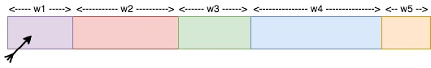
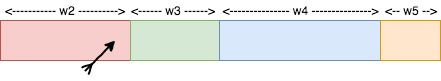

```{r setup, include=FALSE}
knitr::opts_chunk$set(echo = TRUE, eval = FALSE)
```

As part of our recent work to support weighted sampling of Spark dataframes in `sparklyr`, we embarked on a journey searching for algorithms that can perform weighted sampling, especially sampling without replacement, in efficient and scalable ways within a distributed cluster-computing framework such as Apache Spark.

In the interest of brevity, "weighted sampling without replacement" shall be shortened into `SWoR` for the remainder of this blog post.

In the following sections, we will explain and illustrate what `SWoR` means probability-wise, briefly outline some alternative solutions we have considered but were not completely satisfied with, and then deep-dive into exponential variates, a simple mathematical construct that made the ideal solution for this problem possible.

If you cannot wait to jump into action, there is also a [section](#examples) in which we showcase example usages of `sdf_weighted_sample()` in `sparklyr`.

## How it all started?

The journey started from a [Github issue](https://github.com/sparklyr/sparklyr/issues/2592) inquiring about the possibility of supporting the equivalent of `dplyr::sample_frac(..., weight = <weight_column>)` for Spark dataframes in `sparklyr`. For example,

```{r}
dplyr::sample_frac(mtcars, 0.25, weight = gear, replace = FALSE)
```

will randomly select one-fourth of all rows from a R dataframe named "mtcars" without replacement, using `mtcars$gear` as weights. We were unable to find any function implementing the weighted versions of `dplyr::sample_frac` among [Spark SQL built-in functions](https://spark.apache.org/docs/3.0.0/api/sql/index.html) in Spark 3.0 or in earlier versions, which means a future version of `sparklyr` will need to run its own weighted sampling algorithm to support such use cases.

## What exactly is `SWoR`?

Readers already having a crystal-clear mental picture of what `SWoR` entails should probably skip most of this section. The key take-away here is given $N$ rows $r_1, \dotsc, r_N$ and their weights $w_1, \dotsc, w_N$ and a desired sample size $n$, `SWoR` is conceptually equivalent to a $n$-step process of selecting 1 out of $n - j + 1$ remaining rows in the $j$-th step for $j \in \{1, \dotsc, n\}$, with each remaining row's likelihood of getting selected being linearly proportional to its weight in any of the steps, i.e.,

```
samples := {}
population := {r[1], ..., r[N]}

for j = 1 to n
  select r[x] from population with probability
    (w[x] / TotalWeight(population))
  samples := samples + {r[x]}
  population := population - {r[x]}
```

Therefore the probability of `SWoR` selecting a given sequence of $n$ rows $(r_1, \dotsc, r_n)$ is simply $\prod\limits_{j = 1}^{n} \left( {w_j} \middle/ {\sum\limits_{k = j}^{N}{w_k}} \right)$.

Notice the outcome of a `SWoR` process is in fact order-significant, which is why in this post it will always be represented as an ordered tuple of elements.

`SWoR` can also be explained in term of dart-throwing. For example, let's say the size of our sample space is 5:

- Imagine $r_1, r_2, \dotsc, r_5$ as 5 rectangular tiles laid out consecutively on a wall with widths $w_1, w_2, \dotsc, w_5$, with $r_1$ covering $[0, w_1)$, $r_2$ covering $[w_1, w_1 + w_2)$, ..., and $r_5$ covering $\left[\sum\limits_{j = 1}^{4} w_j, \sum\limits_{j = 1}^{5} w_j\right)$
  
- Equate drawing a random sample in each step to throwing a dart uniformly randomly within the interval covered by all tiles that are not hit yet
  
- After a tile is hit, it gets taken out and remaining tiles are re-arranged so that they continue to cover a contiguous interval without overlapping

We shall ask ourselves what is the probability of the dart hitting $(r_1, r_2, r_3)$ in that order? 

In step $j = 1$, the dart will hit $r_1$ with probability $\left. w_1 \middle/ \left(\sum\limits_{k = 1}^{N}w_k\right) \right.$

{ width=50% height=50% } .

After updating `samples` to $(r_1)$ and deleting $r_1$ from the sample space, step $j = 2$ will look like this:

{ width=48% height=45% } ,

and the probability of the dart hitting $r_2$ in step 2 is $\left. w_2 \middle/ \left(\sum\limits_{k = 2}^{N}w_k\right) \right.$ .

Finally, moving on to step $j = 3$, we have:

{ width=40% height=30% } ,

with the probability of the dart hitting $r_3$ being $\left. w_3 \middle/ \left(\sum\limits_{k = 3}^{N}w_k\right) \right.$.

So, combining all of the above, the overall probability of selecting  $(r_1, r_2, r_3)$ is $\prod\limits_{j = 1}^{3} \left( {w_j} \middle/ {\sum\limits_{k = j}^{N}{w_k}} \right)$.

## Naive approaches for implementing `SWoR`

This section contains some possible naive approaches that were briefly under consideration. Because none of them scales well to a large number of rows or a non-trivial number of partitions in a Spark dataframe, we decided to avoid all of those approaches in `sparklyr`.

### A tree-base approach

One possible way to accomplish `SWoR` is to have a mutable data structure keeping track of the sample space at each step.

Continuing with the dart-throwing analogy from the previous section, let us say initially, none of the tiles has been taken out yet, and a dart has landed at some point $x \in \left[0, \sum\limits_{k = 1}^{N} w_k\right)$. Which tile did it hit? This can be answered efficiently if we have a binary tree, pictured as the following (or in general, some $b$-ary tree for integer $b \ge 2$)

{ width=60% height=40%}

To find the tile that was hit given the dart's position $x$, we simply need to traverse down the tree, going through the box containing $x$ in each level, incurring a $O(\log(N))$ cost in time complexity for each sample. To take a tile out of the picture, we update the width of the tile to $0$ and propagate this change upwards from leaf level to root of the tree, again incurring a $O(\log(N))$ cost in time complexity, making the overall time complexity of selecting $n$ samples $O(n \cdot \log(N))$, which is not so great for large data sets, and also, not parallelizable across multiple partitions of a Spark dataframe. 

### Rejection sampling

Another possible approach is to use rejection sampling. In term of the previously mentioned dart-throwing analogy, that means not removing any tile that is hit, hence avoiding the performance cost of keeping the sample space up-to-date, but then having to re-throw the dart in each of the subsequent rounds until the dart lands on a tile that was not hit previously. This approach, just like the previous one, would not be performant, and would not be parallelizable across multiple partitions of a Spark dataframe either.

# Exponential variates to the rescue!

A solution that has proven to be much better than any of the naive approaches turns out to be a numerical stable variant of the algorithm described in "Weighted Random Sampling" [@Efraimidis2016] by Pavlos S. Efraimidis and Paul G. Spirakis.

A version of this sampling algorithm implemented by `sparklyr` does the following to sample $n$ out of $N$ rows from a Spark dataframe $X$:

- For each row $r_j \in X$, draw a random number $u_j$ independently and uniformly randomly from $(0, 1)$ and compute the key of $r_j$ as $k_j = \ln(u_j) / w_j$, where $w_j$ is the weight of $r_j$. Perform this calulation in parallel across all partitions of $X$.
- Select $n$ rows with largest keys and return them as the result. This step is also mostly parallelizable: for each partition of $X$, one can select up to $n$ rows having largest keys within that partition as candidates, and after selecting candidates from all partitions in parallel, simply extract the top $n$ rows among all candidates, and return them as the $n$ chosen samples.

There are at least 4 reasons why this solution is highly appealing and was chosen to be implemented in `sparklyr`:

- It is a one-pass algorithm (i.e., only need to iterate through all rows of a dataframe exactly once).
- Its computational overhead is quite low (as selecting top $n$ rows at any stage only requires a bounded priority queue of max size $n$, which costs $O(\log(n))$ per update in time complexity).
- More importantly, most of its required computations can be performed in parallel. In fact, the only non-parallelizable step is the very last stage of combining top candidates from all partitions and choosing the top $n$ rows among those candidates. So, it fits very well into the world of Spark / MapReduce, and has drastically better horizontal scalability compared to the naive approaches.
- Bonus: it is also suitable for weighted reservoir sampling (i.e., can sample $n$ out of a possibly infinite stream of rows according to their weights such that at any moment the $n$ samples will be a weighted representation of all rows that have been processed so far).

## Why does this algorithm work?

As an interesting aside, some readers have probably seen this technique presented in a slightly different form under another name. It is in fact equivalent to a generalized version of the [Gumbel-max trick](https://lips.cs.princeton.edu/the-gumbel-max-trick-for-discrete-distributions) which is commonly referred to as the Gumbel-top-k trick. Readers familiar with properties of the Gumbel distribution will no doubt have an easy time convincing themselves the algorithm above works as expected.

In this section, we will also present a proof of correctness for this algorithm based on elementary properties of [probability density function](https://en.wikipedia.org/wiki/Probability_density_function) (shortened as PDF from now on), [cumulative distribution function](https://en.wikipedia.org/wiki/Cumulative_distribution_function) (shortened as CDF from now on), and basic calculus.

First of all, to make sense of all the $\ln(u_j) / w_j$ calculations in this algorithm, one has to understand [inverse transform sampling](https://en.wikipedia.org/wiki/Inverse_transform_sampling). For each $j \in \{1, \dotsc, N\}$, consider the probability distribution defined on $(-\infty, 0)$ with CDF $F_j(x) = e^{w_j \cdot x}$. In order to pluck out a value $y$ from this distribution, we first sample a value $u_j$ uniformly randomly out of $(0, 1)$ that determines the percentile of $y$ (i.e., how our $y$ value ranks relative to all possible $y$ values, a.k.a, the "overall population", from this distribution), and then apply $F_j^{-1}$ to $u_j$ to find $y$, so, $y = F_j^{-1}(u_j) = \ln(u_j) / w_j$.

Secondly, after defining all the required CDF functions $F_j(x) = e^{w_j \cdot x}$ for $j \in \{1, \dotsc, N\}$, we can also easily derive their corresponding PDF functions $f_j$: $$f_j(x) = \frac{d F_j(x)}{dx} = w_j e^{w_j \cdot x}$$.

Finally, with a clear understanding of the family of proability distributions this algorithm is working with, it is a non-difficult calculus exercise to show the probability of selecting any tuple of rows (say $(r_1, \dotsc, r_n)$) will be $\prod\limits_{j = 1}^{n} \left( {w_j} \middle/ {\sum\limits_{k = j}^{N}{w_k}} \right)$, which implies the possible outcomes of this algorithm will have exactly the same probability distribution as that of a $n$-step `SWoR`.

In order to not deprive our dear readers the pleasure of completing this proof by themselves, we decided not to inline the rest of the proof within this blog post, and make everything available in [this file](proof.pdf) instead.

# Testing

While parallelized sampling based on exponential variates looks fantastic on paper, there are still plenty of potential pitfalls when it comes to translating such idea into code, and as usual, a good testing plan is necessary to ensure implementation correctness.

For instance, numerical instability issue from floating point numbers arises if $\ln(u_j) / w_j$ were replaced by $u_j ^ {1 / w_j}$ in the aforementioned computations.

Another more subtle source of error is the usage of PRNG seeds. For example, consider the following:

```
  def sampleWithoutReplacement(
    rdd: RDD[Row],
    weightColumn: String,
    sampleSize: Int,
    seed: Long
  ): RDD[Row] = {
    val sc = rdd.context
    if (0 == sampleSize) {
      sc.emptyRDD
    } else {
      val random = new Random(seed)
      val mapRDDs = rdd.mapPartitions { iter =>
        for (row <- iter) {
          val weight = row.getAs[Double](weightColumn)
          val key = scala.math.log(random.nextDouble) / weight
          <and then make sampling decision for `row` based on its `key`,
           as described in the previous section>
        }
        ...
      }
      ...
    }
  }
```

Even though it might look OK upon first glance, careful readers must have noticed `rdd.mapPartitions(...)` from the above will cause the same sequence of pseudorandom numbers to be used in potentially multiple places, which will cause undesired bias in the sampling outcome if the input Spark dataframe has multiple partitions (i.e., sampling outcomes from one partition will have non-trivial correlation with those from another partition when such correlation should be negligible in a correct implementation).

The code snippet below is an example implementation in which each partition of the input Spark dataframe is sampled using a different sequence of pseudorandom numbers:

```
  def sampleWithoutReplacement(
    rdd: RDD[Row],
    weightColumn: String,
    sampleSize: Int,
    seed: Long
  ): RDD[Row] = {
    val sc = rdd.context
    if (0 == sampleSize) {
      sc.emptyRDD
    } else {
      val mapRDDs = rdd.mapPartitionsWithIndex { (index, iter) =>
        val random = new Random(seed + index)

        for (row <- iter) {
          val weight = row.getAs[Double](weightColumn)
          val key = scala.math.log(random.nextDouble) / weight
          <and then make sampling decision for `row` based on its `key`,
           as described in the previous section>
        }

        ...
      }
    ...
  }
}
```

An example test case in which a two-sided Kolmogorov-Smirnov test is used to compare distribution of sampling outcomes from `dplyr::slice_sample` with that from `sparklyr::sdf_weighted_sample` is shown in [this file](test_plan). Such test has proven to be effective in surfacing non-obvious implementation errors such as the ones mentioned above.

# Example Usages {#examples}

Please note the `sparklyr::sdf_weighted_sample()` functionality is not included in any official release of `sparklyr` yet. We are aiming to ship it as part of `sparklyr` 1.4 in about 2 to 3 months from now.

In the meanwhile, you can try it out with the following steps:

First, make sure `devtools` is installed, and then run

```
devtools::install_github("sparklyr/sparklyr", ref = "master")
```
to install `sparklyr` from source

Next, create a test dataframe with numeric weight column consisting of non-negative weight for each row, and then copy it to Spark (see code snippet below as an example):

```
library(sparklyr)

sc <- spark_connect(master = "local")

example_df <- data.frame(
  x = seq(100),
  weight = c(
    rep(1, 50),
    rep(2, 25),
    rep(4, 10),
    rep(8, 10),
    rep(16, 5)
  )
)
example_sdf <- copy_to(sc, example_df, repartition = 5, overwrite = TRUE)
```

Finally, run `sparklyr::sdf_weighted_sample()` on `example_sdf`:

```
sample_size <- 20

samples_without_replacement <- example_sdf %>%
  sdf_weighted_sample(
    weight_col = "weight",
    k = sample_size,
    replacement = FALSE
  )

samples_with_replacement <- example_sdf %>%
  sdf_weighted_sample(
    weight_col = "weight",
    k = sample_size,
    replacement = TRUE
  )
```

# Acknowledgement

First and foremost, the author wishes to thank [\@ajing](https://github.com/ajing) for reporting in this [Github issue](https://github.com/sparklyr/sparklyr/issues/2592) that the weighted sampling use cases were not properly supported yet in `sparklyr` 1.3 and suggesting it should be part of some future version of `sparklyr`.

Special thanks also goes to Javier ([\@javierluraschi](https://github.com/javierluraschi)) for reviewing the [implementation](https://github.com/sparklyr/sparklyr/pull/2606) of all exponential-variate based sampling algorithms in `sparklyr`, and to both and Mara ([\@batpigandme](https://github.com/batpigandme)) and Javier ([\@javierluraschi](https://github.com/javierluraschi)) their valuable editorial suggestions.

We hope you have enjoyed reading this blog post! If you wish to learn more about `sparklyr`, we recommend visiting [sparklyr.ai](https://sparklyr.ai), [spark.rstudio.com](https://spark.rstudio.com), and some of the previous release posts such as [sparklyr 1.3](https://blog.rstudio.com/2020/07/16/sparklyr-1-3/) and [sparklyr 1.2](https://blogs.rstudio.com/ai/posts/2020-04-21-sparklyr-1.2.0-released/). Also, your contributions to `sparklyr` are more than welcome. Please send your pull requests through [here](https://github.com/sparklyr/sparklyr/pulls) and file any bug report or feature request in [here](https://github.com/sparklyr/sparklyr).

Thanks for reading!
