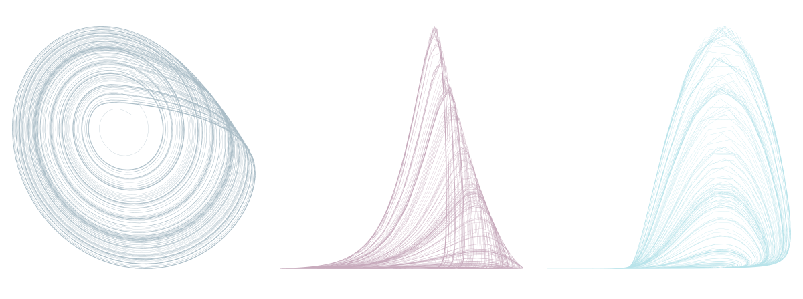
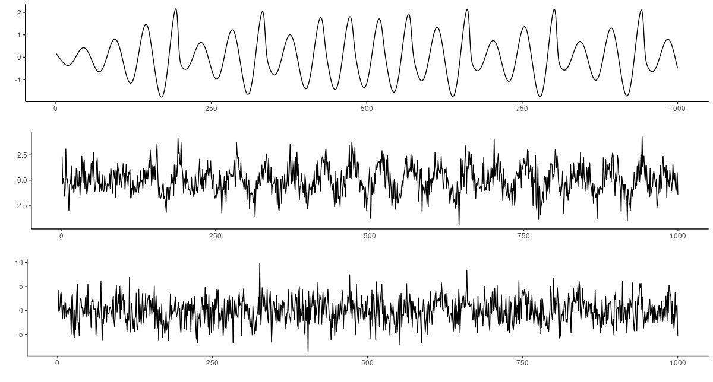
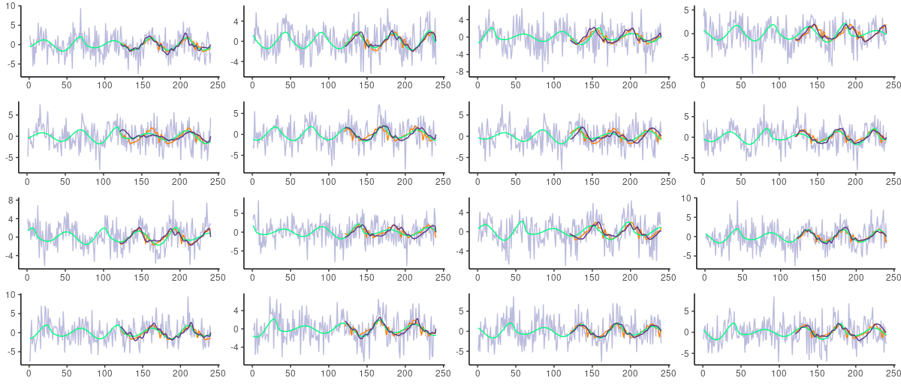

```{r setup, include=FALSE}
knitr::opts_chunk$set(echo = TRUE, eval = FALSE)
```

This post did not end up quite the way I'd imagined. A quick follow-up on the recent [Time series prediction with
FNN-LSTM](https://blogs.rstudio.com/ai/posts/2020-07-20-fnn-lstm/), it was supposed to demonstrate how *noisy* time series (so common in
practice) could profit from a change in architecture: Instead of FNN-LSTM, an LSTM autoencoder regularized by false nearest
neighbors (FNN) loss, use FNN-VAE, a variational autoencoder constrained by the same. However, FNN-VAE did not seem to handle
noise better than FNN-LSTM. No plot, no post, then?

On the other hand -- this is not a scientific study, with hypothesis and experimental setup all preregistered; all that really
matters is if there's something useful to report. And it looks like there is.

Firstly, FNN-VAE, while on par performance-wise with FNN-LSTM, is far superior in that other meaning of "performance":
Training goes a *lot* faster for FNN-VAE.

Secondly, while we don't see much difference between FNN-LSTM and FNN-VAE, we *do* see a clear impact of using FNN loss. Adding in FNN loss strongly reduces mean squared error with respect to the underlying (denoised) series -- especially in the case of VAE, but for LSTM as well. This is of particular interest with VAE, as it comes with a regularizer
out-of-the-box -- namely, Kullback-Leibler (KL) divergence.

Of course, we don't claim that similar results will always be obtained on other noisy series; nor did we tune any of
the models "to death". For what could be the intent of such a post but to show our readers interesting (and promising) ideas
to pursue in their own experimentation?

## The context

This post is the third in a mini-series.

In [Deep attractors: Where deep learning meets chaos](https://blogs.rstudio.com/ai/posts/2020-06-24-deep-attractors/), we
explained, with a substantial detour into chaos theory, the idea of FNN loss, introduced in [@gilpin2020deep]. Please consult
that first post for theoretical background and intuitions behind the technique.

The subsequent post, [Time series prediction with FNN-LSTM](https://blogs.rstudio.com/ai/posts/2020-07-20-fnn-lstm/), showed
how to use an LSTM autoencoder, constrained by FNN loss, for forecasting (as opposed to reconstructing an attractor). The results were stunning: In multi-step prediction (12-120 steps, with that number varying by
dataset), the short-term forecasts were drastically improved by adding in FNN regularization. See that second post for
experimental setup and results on four very different, non-synthetic datasets.

Today, we show how to replace the LSTM autoencoder by a -- convolutional -- VAE. In light of the experimentation results,
already hinted at above, it is completely plausible that the "variational" part is not even so important here -- that a
convolutional autoencoder with just MSE loss would have performed just as well on those data. In fact, to find out, it's
enough to remove the call to `reparameterize()` and multiply the KL component of the loss by 0. (We leave this to the
interested reader, to keep the post at reasonable length.)

One last piece of context, in case you haven't read the two previous posts and would like to jump in here directly. We're
doing time series forecasting; so why this talk of autoencoders? Shouldn't we just be comparing an LSTM (or some other type of
RNN, for that matter) to a convnet? In fact, the necessity of a latent representation is due to the very idea of FNN: The
latent code is supposed to reflect the true attractor of a dynamical system. That is, if the attractor of the underlying
system is roughly two-dimensional, we hope to find that just two of the latent variables have considerable variance. (This
reasoning is explained in a lot of detail in the previous posts.)

## FNN-VAE

So, let's start with the code for our new model.

The encoder takes the time series, of format `batch_size x num_timesteps x num_features` just like in the LSTM case, and
produces a flat, 10-dimensional output: the latent code, which FNN loss is computed on.

```{r, eval = FALSE}

library(tensorflow)
library(keras)
library(tfdatasets)
library(tfautograph)
library(reticulate)
library(purrr)

vae_encoder_model <- function(n_timesteps,
                               n_features,
                               n_latent,
                               name = NULL) {
  keras_model_custom(name = name, function(self) {
    self$conv1 <- layer_conv_1d(kernel_size = 3,
                                filters = 16,
                                strides = 2)
    self$act1 <- layer_activation_leaky_relu()
    self$batchnorm1 <- layer_batch_normalization()
    self$conv2 <- layer_conv_1d(kernel_size = 7,
                                filters = 32,
                                strides = 2)
    self$act2 <- layer_activation_leaky_relu()
    self$batchnorm2 <- layer_batch_normalization()
    self$conv3 <- layer_conv_1d(kernel_size = 9,
                                filters = 64,
                                strides = 2)
    self$act3 <- layer_activation_leaky_relu()
    self$batchnorm3 <- layer_batch_normalization()
    self$conv4 <- layer_conv_1d(
      kernel_size = 9,
      filters = n_latent,
      strides = 2,
      activation = "linear" 
    )
    self$batchnorm4 <- layer_batch_normalization()
    self$flat <- layer_flatten()
    
    function (x, mask = NULL) {
      x %>%
        self$conv1() %>%
        self$act1() %>%
        self$batchnorm1() %>%
        self$conv2() %>%
        self$act2() %>%
        self$batchnorm2() %>%
        self$conv3() %>%
        self$act3() %>%
        self$batchnorm3() %>%
        self$conv4() %>%
        self$batchnorm4() %>%
        self$flat()
    }
  })
}

```

The decoder starts from this -- flat -- representation and decompresses it into a time sequence. In both encoder and decoder
(de-)conv layers, parameters are chosen to handle a sequence length (`num_timesteps`) of 120, which is what we'll use for
prediction below.

```{r, eval = FALSE}
vae_decoder_model <- function(n_timesteps,
                               n_features,
                               n_latent,
                               name = NULL) {
  keras_model_custom(name = name, function(self) {
    self$reshape <- layer_reshape(target_shape = c(1, n_latent))
    self$conv1 <- layer_conv_1d_transpose(kernel_size = 15,
                                          filters = 64,
                                          strides = 3)
    self$act1 <- layer_activation_leaky_relu()
    self$batchnorm1 <- layer_batch_normalization()
    self$conv2 <- layer_conv_1d_transpose(kernel_size = 11,
                                          filters = 32,
                                          strides = 3)
    self$act2 <- layer_activation_leaky_relu()
    self$batchnorm2 <- layer_batch_normalization()
    self$conv3 <- layer_conv_1d_transpose(
      kernel_size = 9,
      filters = 16,
      strides = 2,
      output_padding = 1
    )
    self$act3 <- layer_activation_leaky_relu()
    self$batchnorm3 <- layer_batch_normalization()
    self$conv4 <- layer_conv_1d_transpose(
      kernel_size = 7,
      filters = 1,
      strides = 1,
      activation = "linear"
    )
    self$batchnorm4 <- layer_batch_normalization()
    
    function (x, mask = NULL) {
      x %>%
        self$reshape() %>%
        self$conv1() %>%
        self$act1() %>%
        self$batchnorm1() %>%
        self$conv2() %>%
        self$act2() %>%
        self$batchnorm2() %>%
        self$conv3() %>%
        self$act3() %>%
        self$batchnorm3() %>%
        self$conv4() %>%
        self$batchnorm4()
    }
  })
}
```

Note that even though we called these constructors `vae_encoder_model()` and `vae_decoder_model()`, there is nothing
variational to these models per se; they are really just an encoder and a decoder, respectively. Metamorphosis into a VAE will
happen in the training procedure; in fact, the only two things that will make this a VAE are going to be the
reparameterization of the latent layer and the added-in KL loss.

Speaking of training, these are the routines we'll call. The function to compute FNN loss, `loss_false_nn()`, can be found in
both of the abovementioned predecessor posts; we kindly ask the reader to copy it from one of these places.

```{r, eval = FALSE}
# to reparameterize encoder output before calling decoder
reparameterize <- function(mean, logvar = 0) {
  eps <- k_random_normal(shape = n_latent)
  eps * k_exp(logvar * 0.5) + mean
}

# loss has 3 components: NLL, KL, and FNN
# otherwise, this is just normal TF2-style training 
train_step_vae <- function(batch) {
  with (tf$GradientTape(persistent = TRUE) %as% tape, {
    code <- encoder(batch[[1]])
    z <- reparameterize(code)
    prediction <- decoder(z)
    
    l_mse <- mse_loss(batch[[2]], prediction)
    # see loss_false_nn in 2 previous posts
    l_fnn <- loss_false_nn(code)
    # KL divergence to a standard normal
    l_kl <- -0.5 * k_mean(1 - k_square(z))
    # overall loss is a weighted sum of all 3 components
    loss <- l_mse + fnn_weight * l_fnn + kl_weight * l_kl
  })
  
  encoder_gradients <-
    tape$gradient(loss, encoder$trainable_variables)
  decoder_gradients <-
    tape$gradient(loss, decoder$trainable_variables)
  
  optimizer$apply_gradients(purrr::transpose(list(
    encoder_gradients, encoder$trainable_variables
  )))
  optimizer$apply_gradients(purrr::transpose(list(
    decoder_gradients, decoder$trainable_variables
  )))
  
  train_loss(loss)
  train_mse(l_mse)
  train_fnn(l_fnn)
  train_kl(l_kl)
}

# wrap it all in autograph
training_loop_vae <- tf_function(autograph(function(ds_train) {
  
  for (batch in ds_train) {
    train_step_vae(batch) 
  }
  
  tf$print("Loss: ", train_loss$result())
  tf$print("MSE: ", train_mse$result())
  tf$print("FNN loss: ", train_fnn$result())
  tf$print("KL loss: ", train_kl$result())
  
  train_loss$reset_states()
  train_mse$reset_states()
  train_fnn$reset_states()
  train_kl$reset_states()
  
}))

```

To finish up the model section, here is the actual training code. This is nearly identical to what we did for FNN-LSTM before.

```{r, eval = FALSE}
n_latent <- 10L
n_features <- 1

encoder <- vae_encoder_model(n_timesteps,
                         n_features,
                         n_latent)

decoder <- vae_decoder_model(n_timesteps,
                         n_features,
                         n_latent)
mse_loss <-
  tf$keras$losses$MeanSquaredError(reduction = tf$keras$losses$Reduction$SUM)

train_loss <- tf$keras$metrics$Mean(name = 'train_loss')
train_fnn <- tf$keras$metrics$Mean(name = 'train_fnn')
train_mse <-  tf$keras$metrics$Mean(name = 'train_mse')
train_kl <-  tf$keras$metrics$Mean(name = 'train_kl')

fnn_multiplier <- 1 # default value used in nearly all cases (see text)
fnn_weight <- fnn_multiplier * nrow(x_train)/batch_size

kl_weight <- 1

optimizer <- optimizer_adam(lr = 1e-3)

for (epoch in 1:100) {
  cat("Epoch: ", epoch, " -----------\n")
  training_loop_vae(ds_train)
 
  test_batch <- as_iterator(ds_test) %>% iter_next()
  encoded <- encoder(test_batch[[1]][1:1000])
  test_var <- tf$math$reduce_variance(encoded, axis = 0L)
  print(test_var %>% as.numeric() %>% round(5))
}
```

## Experimental setup and data

The idea was to add white noise to a deterministic series. This time, the [Roessler
system](https://en.wikipedia.org/wiki/R%C3%B6ssler_attractor) was chosen, mainly for the prettiness of its attractor, apparent
even in its two-dimensional projections:

```{r, eval=TRUE, echo=FALSE, layout="l-body-outset", fig.cap = "Roessler attractor, two-dimensional projections."}

```

Like we did for the Lorenz system in the first part of this series, we use `deSolve` to generate data from the Roessler
equations.

```{r, eval = FALSE}
library(deSolve)

parameters <- c(a = .2,
                b = .2,
                c = 5.7)

initial_state <-
  c(x = 1,
    y = 1,
    z = 1.05)

roessler <- function(t, state, parameters) {
  with(as.list(c(state, parameters)), {
    dx <- -y - z
    dy <- x + a * y
    dz = b + z * (x - c)
    
    list(c(dx, dy, dz))
  })
}

times <- seq(0, 2500, length.out = 20000)

roessler_ts <-
  ode(
    y = initial_state,
    times = times,
    func = roessler,
    parms = parameters,
    method = "lsoda"
  ) %>% unclass() %>% as_tibble()

n <- 10000
roessler <- roessler_ts$x[1:n]

roessler <- scale(roessler)
```

Then, noise is added, to the desired degree, by drawing from a normal distribution, centered at zero, with standard deviations
varying between 1 and 2.5.

```{r, eval = FALSE}
# add noise
noise <- 1 # also used 1.5, 2, 2.5
roessler <- roessler + rnorm(10000, mean = 0, sd = noise)

```

Here you can compare effects of not adding any noise (left), standard deviation-1 (middle), and standard deviation-2.5 Gaussian noise:

```{r, eval=TRUE, echo=FALSE, layout="l-body-outset", fig.cap = "Roessler series with added noise. Top: none. Middle: SD = 1. Bottom: SD = 2.5."}

```

Otherwise, preprocessing proceeds as in the previous posts. In the upcoming results section, we'll compare forecasts not just
to the "real", after noise addition, test split of the data, but also to the underlying Roessler system -- that is, the thing
we're really interested in. (Just that in the real world, we can't do that check.) This second test set is prepared for
forecasting just like the other one; to avoid duplication we don't reproduce the code.

```{r, eval = FALSE}
n_timesteps <- 120
batch_size <- 32

gen_timesteps <- function(x, n_timesteps) {
  do.call(rbind,
          purrr::map(seq_along(x),
                     function(i) {
                       start <- i
                       end <- i + n_timesteps - 1
                       out <- x[start:end]
                       out
                     })
  ) %>%
    na.omit()
}

train <- gen_timesteps(roessler[1:(n/2)], 2 * n_timesteps)
test <- gen_timesteps(roessler[(n/2):n], 2 * n_timesteps) 

dim(train) <- c(dim(train), 1)
dim(test) <- c(dim(test), 1)

x_train <- train[ , 1:n_timesteps, , drop = FALSE]
y_train <- train[ , (n_timesteps + 1):(2*n_timesteps), , drop = FALSE]

ds_train <- tensor_slices_dataset(list(x_train, y_train)) %>%
  dataset_shuffle(nrow(x_train)) %>%
  dataset_batch(batch_size)

x_test <- test[ , 1:n_timesteps, , drop = FALSE]
y_test <- test[ , (n_timesteps + 1):(2*n_timesteps), , drop = FALSE]

ds_test <- tensor_slices_dataset(list(x_test, y_test)) %>%
  dataset_batch(nrow(x_test))
```

## Results

The LSTM used for comparison with the VAE described above is identical to the architecture employed in the previous post.
While with the VAE, an `fnn_multiplier` of 1 yielded sufficient regularization for all noise levels, some more experimentation
was needed for the LSTM: At noise levels 2 and 2.5, that multiplier was set to 5.

As a result, in all cases, there was one latent variable with high variance and a second one of minor importance. For all
others, variance was close to 0.

*In all cases* here means: In all cases where FNN regularization was used. As already hinted at in the introduction, the main
regularizing factor providing robustness to noise here seems to be FNN loss, not KL divergence. So for all noise levels,
besides FNN-regularized LSTM and VAE models we also tested their non-constrained counterparts.

#### Low noise

Seeing how all models did superbly on the original deterministic series, a noise level of 1 can almost be treated as
a baseline. Here you see sixteen 120-timestep predictions from both regularized models, FNN-VAE (dark blue), and FNN-LSTM
(orange). The noisy test data, both input (`x`, 120 steps) and output (`y`, 120 steps) are displayed in (blue-ish) grey. In
green, also spanning the whole sequence, we have the original Roessler data, the way they would look had no noise been added.

```{r, eval=TRUE, echo=FALSE, layout="l-page", fig.cap = "Roessler series with added Gaussian noise of standard deviation 1. Grey: actual (noisy) test data. Green: underlying Roessler system. Orange: Predictions from FNN-LSTM. Dark blue: Predictions from FNN-VAE."}
knitr::include_graphics("images/noise_1.png")
```

Despite the noise, forecasts from both models look excellent. Is this due to the FNN regularizer?

Looking at forecasts from their unregularized counterparts, we have to admit these do not look any worse. (For better
comparability, the sixteen sequences to forecast were initiallly picked at random, but used to test all models and
conditions.)

```{r, eval=TRUE, echo=FALSE, layout="l-page", fig.cap = "Roessler series with added Gaussian noise of standard deviation 1. Grey: actual (noisy) test data. Green: underlying Roessler system. Orange: Predictions from unregularized LSTM. Dark blue: Predictions from unregularized VAE."}
knitr::include_graphics("images/noise_1_nofnn.png")
```

What happens when we start to add noise?

#### Substantial noise

Between noise levels 1.5 and 2, something changed, or became noticeable from visual inspection. Let's jump directly to the
highest-used level though: 2.5.

Here first are predictions obtained from the unregularized models.

```{r, eval=TRUE, echo=FALSE, layout="l-page", fig.cap = "Roessler series with added Gaussian noise of standard deviation 2.5. Grey: actual (noisy) test data. Green: underlying Roessler system. Orange: Predictions from unregularized LSTM. Dark blue: Predictions from unregularized VAE."}
knitr::include_graphics("images/noise_2.5_nofnn.png")
```

Both LSTM and VAE get "distracted" a bit too much by the noise, the latter to an even higher degree. This leads to cases
where predictions strongly "overshoot" the underlying non-noisy rhythm. This is not surprising, of course: They were *trained*
on the noisy version; predict fluctuations is what they learned.

Do we see the same with the FNN models?

```{r, eval=TRUE, echo=FALSE, layout="l-page", fig.cap = "Roessler series with added Gaussian noise of standard deviation 2.5. Grey: actual (noisy) test data. Green: underlying Roessler system. Orange: Predictions from FNN-LSTM. Dark blue: Predictions from FNN-VAE."}

```

Interestingly, we see a much better fit to the underlying Roessler system now! Especially the VAE model, FNN-VAE, surprises
with a whole new smoothness of predictions; but FNN-LSTM turns up much smoother forecasts as well.

"Smooth, fitting the system..." -- by now you may be wondering, when are we going to come up with more quantitative
assertions? If quantitative implies "mean squared error" (MSE), and if MSE is taken to be some divergence between forecasts
and the true target from the test set, the answer is that this MSE doesn't differ much between any of the four architectures.
Put differently, it is mostly a function of noise level.

However, we could argue that what we're really interested in is how well a model forecasts the underlying process. And there,
we see differences.

In the following plot, we contrast MSEs obtained for the four model types (grey: VAE; orange: LSTM; dark blue: FNN-VAE; green:
FNN-LSTM). The rows reflect noise levels (1, 1.5, 2, 2.5); the columns represent MSE in relation to the noisy("real") target
(left) on the one hand, and in relation to the underlying system on the other (right). For better visibility of the effect,
*MSEs have been normalized as fractions of the maximum MSE in a category*.

So, if we want to predict *signal plus noise* (left), it is not extremely critical whether we use FNN or not. But if we want to
predict the signal only (right), with increasing noise in the data FNN loss becomes increasingly effective. This effect is far
stronger for VAE vs. FNN-VAE than for LSTM vs. FNN-LSTM: The distance between the grey line (VAE) and the dark blue one
(FNN-VAE) becomes larger and larger as we add more noise.

```{r, eval=TRUE, echo=FALSE, layout="l-page", fig.cap = "Normalized MSEs obtained for the four model types (grey: VAE; orange: LSTM; dark blue: FNN-VAE; green: FNN-LSTM). Rows are noise levels (1, 1.5, 2, 2.5); columns are MSE as related to the real target (left) and the underlying system (right)."}
knitr::include_graphics("images/mses.png")
```

## Summing up

Our experiments show that when noise is likely to obscure measurements from an underlying deterministic system, FNN
regularization can strongly improve forecasts. This is the case especially for convolutional VAEs, and probably convolutional
autoencoders in general. And if an FNN-constrained VAE performs as well, for time series prediction, as an LSTM, there is a
strong incentive to use the convolutional model: It trains significantly faster.

With that, we conclude our mini-series on FNN-regularized models. As always, we'd love to hear from you if you were able to
make use of this in your own work!

Thanks for reading!
