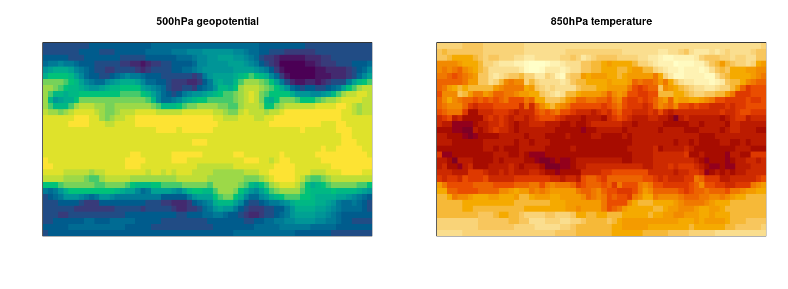

```{r setup, include=FALSE}
knitr::opts_chunk$set(echo = TRUE, eval = FALSE)
```

With all that is going on in the world these days, is it frivolous to talk about weather prediction? Asked in the 21st
century, this is bound to be a rhetorical question. In the 1930s, when German poet Bertolt Brecht wrote the famous lines:

> Was sind das für Zeiten, wo\
> Ein Gespräch über Bäume fast ein Verbrechen ist\
> Weil es ein Schweigen über so viele Untaten einschließt![^1]

[^1]: *An die Nachgeborenen, 1934-38.* The atrocities referred to are those of Nazi Germany.

("What kind of times are these, where a conversation about trees is almost a crime, for it means silence about so many
atrocities!"),

he couldn't have anticipated the responses he would get in the second half of that century, with trees symbolizing, as well as
literally falling victim to, environmental pollution and climate change.

Today, no lengthy justification is needed as to why prediction of atmospheric states is vital: Due to global warming,
frequency and intensity of severe weather conditions -- droughts, wildfires, hurricanes, heatwaves -- have risen and will
continue to rise. And while accurate forecasts don't change those events per se, they constitute essential information in
mitigating their consequences. This goes for atmospheric forecasts on all scales: from so-called "nowcasting" (operating on a
range of about six hours), over medium-range (three to five days) and sub-seasonal (weekly/monthly), to climate forecasts
(concerned with years and decades). Medium-range forecasts especially are extremely important in acute disaster prevention.

This post will show how deep learning (DL) methods can be used to generate atmospheric forecasts, using a newly published
[benchmark dataset](https://github.com/pangeo-data/WeatherBench)[@weatherbench]. Future posts may refine the model used here
and/or discuss the role of DL ("AI") in mitigating climate change -- and its implications -- more globally. And coming back to
Bertolt Brecht: While this text may be about trees, climate change should not remain the only societal topic addressed on this
blog.

That said, let's put the current endeavor in context. In a way, we have here the usual *dejà vu* of using DL as a
black-box-like, magic instrument on a task where *human knowledge* used to be required. Of course, this characterization is
overly dichotomizing; many choices are made in creating DL models, and performance is necessarily constrained by
available algorithms -- which may, or may not, fit the domain to be modeled to a sufficient degree.

If you've started learning about image recognition rather recently, you may well have been using DL methods from the outset,
and not have heard much about the rich set of feature engineering methods developed in pre-DL image recognition. In the
context of atmospheric prediction, then, let's begin by asking: How in the world did they do that *before*?

## Numerical weather prediction in a nutshell

It is not like machine learning and/or statistics are not already used in numerical weather prediction -- on the contrary. For
example, every model has to start from somewhere; but raw observations are not suited to direct use as initial conditions.
Instead, they have to be assimilated to the four-dimensional *grid*[^2] over which model computations are performed. At the
other end, namely, model output, statistical post-processing is used to refine the predictions. And very importantly, ensemble
forecasts are employed to determine uncertainty.

[^2]: Four, because in addition to three spatial dimensions, there is the time dimension.

That said, the model *core*, the part that extrapolates into the future atmospheric conditions observed today, is based on a
set of differential[^3] equations, the so-called [primitive equations](https://en.wikipedia.org/wiki/Primitive_equations),
that are due to the conservation laws of [momentum](https://en.wikipedia.org/wiki/Conservation_of_momentum),
[energy](https://en.wikipedia.org/wiki/Conservation_of_energy), and
[mass](https://en.wikipedia.org/wiki/Conservation_of_mass). These differential equations cannot be solved analytically;
rather, they have to be solved numerically, and that on a grid of resolution as high as possible. In that light, even deep
learning could appear as just "moderately resource-intensive" (dependent, though, on the model in question). So how, then,
could a DL approach look?

[^3]: mostly

## Deep learning models for weather prediction

Accompanying the benchmark dataset they created, Rasp et al.[@weatherbench] provide a set of notebooks, including one
demonstrating the use of a simple convolutional neural network to predict two of the available atmospheric variables, *500hPa
geopotential* and *850hPa temperature*. Here *850hPa temperature* is the (spatially varying) temperature at a fix atmospheric
height of 850hPa (\~ 1.5 kms)[^4] ; *500hPa geopotential* is proportional to the (again, spatially varying) altitude
associated with the pressure level in question (500hPa).

[^4]: Pressure and altitude are related by the [barometric equation](https://en.wikipedia.org/wiki/Barometric_formula). On
    weather maps, pressure is often used to represent the vertical dimension.

For this task, two-dimensional convnets, as usually employed in image processing, are a natural fit: Image width and height
map to longitude and latitude of the spatial grid, respectively; target variables appear as channels. In this architecture,
the time series character of the data is essentially lost: Every sample stands alone, without dependency on either past or
present. In this respect, as well as given its size and simplicity, the convnet presented below is only a toy model, meant to
introduce the approach as well as the application overall. It may also serve as a *deep learning baseline*, along with two
other types of baseline commonly used in numerical weather prediction introduced below.

Directions on how to improve on that baseline are given by recent publications. Weyn et al.[@weyn], in addition to applying
more geometrically-adequate spatial preprocessing, use a U-Net-based architecture instead of a plain convnet. Rasp and Thuerey
[@rasp2020purely], building on a fully convolutional, high-capacity ResNet architecture, add a key new procedural ingredient:
pre-training on climate models. With their method, they are able to not just compete with physical models, but also, show
evidence of the network learning about physical structure and dependencies. Unfortunately, compute facilities of this order
are not available to the average individual, which is why we'll content ourselves with demonstrating a simple toy model.
Still, having seen a simple model in action, as well as the type of data it works on, should help a lot in understanding how
DL can be used for weather prediction.

## Dataset

[Weatherbench](https://github.com/pangeo-data/WeatherBench) was explicitly created as a benchmark dataset and thus, as is
common for this species, hides a lot of preprocessing and standardization effort from the user. Atmospheric data are available
on an hourly basis, ranging from 1979 to 2018, at different spatial resolutions. Depending on resolution, there are about 15
to 20 measured variables, including temperature, geopotential, wind speed, and humidity. Of these variables, some are
available at several pressure levels. Thus, our example makes use of a small subset of available "channels". To save storage,
network and computational resources, it also operates at the smallest available resolution.

This post is accompanied by executable code on [Google
Colaboratory](https://colab.research.google.com/drive/1URSjWfcnhgesHWCqd7Un5GHECYblY04r?usp=sharing), which should not just
render unnecessary any copy-pasting of code snippets but also, allow for uncomplicated modification and experimentation.

To read in and extract the data, stored as [NetCDF](https://www.unidata.ucar.edu/software/netcdf/) files, we use
[tidync](https://docs.ropensci.org/tidync/), a high-level package built on top of
[ncdf4](https://cran.r-project.org/package=ncdf4) and [RNetCDF](https://cran.r-project.org/package=RNetCDF). Otherwise,
availability of the usual "TensorFlow family" as well as a subset of tidyverse packages is assumed.

```{r}
library(reticulate)
library(tensorflow)
library(keras)
library(tfdatasets)
library(tfautograph)

library(dplyr)
library(ggplot2)
library(tidyr)
library(purrr)
library(lubridate)

library(tidync)
```

As already alluded to, our example makes use of two spatio-temporal series: 500hPa geopotential and 850hPa temperature. The
following commands will download and unpack the respective sets of by-year files, for a spatial resolution of 5.625 degrees:

```{r}
download.file("https://dataserv.ub.tum.de/s/m1524895/download?path=%2F5.625deg%2Ftemperature_850&files=temperature_850_5.625deg.zip",
              "temperature_850_5.625deg.zip")
unzip("temperature_850_5.625deg.zip", exdir = "temperature_850")

download.file("https://dataserv.ub.tum.de/s/m1524895/download?path=%2F5.625deg%2Fgeopotential_500&files=geopotential_500_5.625deg.zip",
              "geopotential_500_5.625deg.zip")
unzip("geopotential_500_5.625deg.zip", exdir = "geopotential_500")
```

Inspecting one of those files' contents, we see that its data array is structured along three dimensions, longitude (64
different values), latitude (32) and time (8760). The data itself is `z`, the geopotential.

```{r}
tidync("geopotential_500/geopotential_500hPa_2015_5.625deg.nc") %>% hyper_array()
```

    Class: tidync_data (list of tidync data arrays)
    Variables (1): 'z'
    Dimension (3): lon,lat,time (64, 32, 8760)
    Source: /[...]/geopotential_500/geopotential_500hPa_2015_5.625deg.nc

Extraction of the data array is as easy as telling `tidync` to read the first in the list of arrays:

```{r}
z500_2015 <- (tidync("geopotential_500/geopotential_500hPa_2015_5.625deg.nc") %>%
                hyper_array())[[1]]

dim(z500_2015)
```

    [1] 64 32 8760

While we delegate further introduction to `tidync` to a comprehensive [blog
post](https://ropensci.org/blog/2019/11/05/tidync/) on the ROpenSci website, let's at least look at a quick visualization, for
which we pick the very first time point. (Extraction and visualization code is analogous for 850hPa temperature.)

```{r}
image(z500_2015[ , , 1],
      col = hcl.colors(20, "viridis"), # for temperature, the color scheme used is YlOrRd 
      xaxt = 'n',
      yaxt = 'n',
      main = "500hPa geopotential"
)
```

The maps show how pressure[^5] and temperature strongly depend on latitude. Furthermore, it's easy to spot the
[atmospheric waves](https://en.wikipedia.org/wiki/Atmospheric_wave):

[^5]: Whereas we normally might think of atmospheric pressure as varying at a fixed height (for example, at sea level),
    meteorologists like to display things the other way round, displaying variable heights at fixed constant-pressure
    (isobaric) surfaces. Still, intuitively these may be read in the same way: High pressure at a given location means that
    some predefined pressure level is attained at *higher altitude* than in some low-pressure location. To be precise, these
    kinds of "inverted pressure maps" normally display *geopotential height*, measured in metres, not *geopotential*, the
    variable we're dealing with here. *Geopotential* (without the "height") refers to gravitational potential energy per unit
    mass; it is obtained by multiplying with gravitational acceleration, and measured in metres squared per second squared.
    Both measures are not a hundred percent equivalent, because gravitational acceleration varies with latitude and longitude
    as well as elevation.

```{r, eval=TRUE, echo=FALSE, layout="l-body-outset", fig.cap = "Spatial distribution of 500hPa geopotential and 850 hPa temperature for 2015/01/01 0:00h."}

```

For training, validation and testing, we choose consecutive years: 2015, 2016, and 2017, respectively.

```{r}
z500_train <- (tidync("geopotential_500/geopotential_500hPa_2015_5.625deg.nc") %>% hyper_array())[[1]]

t850_train <- (tidync("temperature_850/temperature_850hPa_2015_5.625deg.nc") %>% hyper_array())[[1]]

z500_valid <- (tidync("geopotential_500/geopotential_500hPa_2016_5.625deg.nc") %>% hyper_array())[[1]]

t850_valid <- (tidync("temperature_850/temperature_850hPa_2016_5.625deg.nc") %>% hyper_array())[[1]]

z500_test <- (tidync("geopotential_500/geopotential_500hPa_2017_5.625deg.nc") %>% hyper_array())[[1]]

t850_test <- (tidync("temperature_850/temperature_850hPa_2017_5.625deg.nc") %>% hyper_array())[[1]]
```

Since geopotential and temperature will be treated as channels, we concatenate the corresponding arrays. To transform the data
into the format needed for images, a permutation is necessary:

```{r}
train_all <- abind::abind(z500_train, t850_train, along = 4)
train_all <- aperm(train_all, perm = c(3, 2, 1, 4))
dim(train_all)
```

    [1] 8760 32 64 2

All data will be standardized according to mean and standard deviation as obtained from the training set:

```{r}
level_means <- apply(train_all, 4, mean)
level_sds <- apply(train_all, 4, sd)

round(level_means, 2)
```

    54124.91  274.8

In words, the mean geopotential height (see footnote 5 for more on this term), as measured at an isobaric surface of 500hPa,
amounts to about 5400 metres[^6], while the mean temperature at the 850hPa level approximates 275 Kelvin (about 2 degrees
Celsius).

[^6]: As explained in the previous footnote, geopotential height is geopotential divided by standard gravitational
    acceleration, roughly, 9.8 metres per seconds squared.

```{r}
train <- train_all
train[, , , 1] <- (train[, , , 1] - level_means[1]) / level_sds[1]
train[, , , 2] <- (train[, , , 2] - level_means[2]) / level_sds[2]

valid_all <- abind::abind(z500_valid, t850_valid, along = 4)
valid_all <- aperm(valid_all, perm = c(3, 2, 1, 4))

valid <- valid_all
valid[, , , 1] <- (valid[, , , 1] - level_means[1]) / level_sds[1]
valid[, , , 2] <- (valid[, , , 2] - level_means[2]) / level_sds[2]

test_all <- abind::abind(z500_test, t850_test, along = 4)
test_all <- aperm(test_all, perm = c(3, 2, 1, 4))

test <- test_all
test[, , , 1] <- (test[, , , 1] - level_means[1]) / level_sds[1]
test[, , , 2] <- (test[, , , 2] - level_means[2]) / level_sds[2]
```

We'll attempt to predict three days ahead.

```{r}
lead_time <- 3 * 24 # 3d

```

Now all that remains to be done is construct the actual *datasets*.

```{r}
batch_size <- 32

train_x <- train %>%
  tensor_slices_dataset() %>%
  dataset_take(dim(train)[1] - lead_time)

train_y <- train %>%
  tensor_slices_dataset() %>%
  dataset_skip(lead_time)

train_ds <- zip_datasets(train_x, train_y) %>%
  dataset_shuffle(buffer_size = dim(train)[1] - lead_time) %>%
  dataset_batch(batch_size = batch_size, drop_remainder = TRUE)

valid_x <- valid %>%
  tensor_slices_dataset() %>%
  dataset_take(dim(valid)[1] - lead_time)

valid_y <- valid %>%
  tensor_slices_dataset() %>%
  dataset_skip(lead_time)

valid_ds <- zip_datasets(valid_x, valid_y) %>%
  dataset_batch(batch_size = batch_size, drop_remainder = TRUE)

test_x <- test %>%
  tensor_slices_dataset() %>%
  dataset_take(dim(test)[1] - lead_time)

test_y <- test %>%
  tensor_slices_dataset() %>%
  dataset_skip(lead_time)

test_ds <- zip_datasets(test_x, test_y) %>%
  dataset_batch(batch_size = batch_size, drop_remainder = TRUE)
```

Let's proceed to defining the model.

## Basic CNN with periodic convolutions

The model is a straightforward convnet, with one exception: Instead of plain convolutions, it uses slightly more sophisticated
ones that "wrap around" longitudinally.

```{r}
periodic_padding_2d <- function(pad_width,
                                name = NULL) {
  
  keras_model_custom(name = name, function(self) {
    self$pad_width <- pad_width
    
    function (x, mask = NULL) {
      x <- if (self$pad_width == 0) {
        x
      } else {
        lon_dim <- dim(x)[3]
        pad_width <- tf$cast(self$pad_width, tf$int32)
        # wrap around for longitude
        tf$concat(list(x[, ,-pad_width:lon_dim,],
                       x,
                       x[, , 1:pad_width,]),
                  axis = 2L) %>%
          tf$pad(list(
            list(0L, 0L),
            # zero-pad for latitude
            list(pad_width, pad_width),
            list(0L, 0L),
            list(0L, 0L)
          ))
      }
    }
  })
}

periodic_conv_2d <- function(filters,
                             kernel_size,
                             name = NULL) {
  
  keras_model_custom(name = name, function(self) {
    self$padding <- periodic_padding_2d(pad_width = (kernel_size - 1) / 2)
    self$conv <-
      layer_conv_2d(filters = filters,
                    kernel_size = kernel_size,
                    padding = 'valid')
    
    function (x, mask = NULL) {
      x %>% self$padding() %>% self$conv()
    }
  })
}
```

For our purposes of establishing a deep learning baseline that is fast to train, CNN architecture and parameter defaults are
chosen to be simple and moderate, respectively:[^7]

[^7]: These are the same filter and kernel sizes as employed in [Rasp et al.\'s simple CNN example on
    github](https://github.com/pangeo-data/WeatherBench/blob/master/notebooks/3-cnn-example.ipynb).

```{r}
periodic_cnn <- function(filters = c(64, 64, 64, 64, 2),
                         kernel_size = c(5, 5, 5, 5, 5),
                         dropout = rep(0.2, 5),
                         name = NULL) {
  
  keras_model_custom(name = name, function(self) {
    
    self$conv1 <-
      periodic_conv_2d(filters = filters[1], kernel_size = kernel_size[1])
    self$act1 <- layer_activation_leaky_relu()
    self$drop1 <- layer_dropout(rate = dropout[1])
    self$conv2 <-
      periodic_conv_2d(filters = filters[2], kernel_size = kernel_size[2])
    self$act2 <- layer_activation_leaky_relu()
    self$drop2 <- layer_dropout(rate =dropout[2])
    self$conv3 <-
      periodic_conv_2d(filters = filters[3], kernel_size = kernel_size[3])
    self$act3 <- layer_activation_leaky_relu()
    self$drop3 <- layer_dropout(rate = dropout[3])
    self$conv4 <-
      periodic_conv_2d(filters = filters[4], kernel_size = kernel_size[4])
    self$act4 <- layer_activation_leaky_relu()
    self$drop4 <- layer_dropout(rate = dropout[4])
    self$conv5 <-
      periodic_conv_2d(filters = filters[5], kernel_size = kernel_size[5])
    
    function (x, mask = NULL) {
      x %>%
        self$conv1() %>%
        self$act1() %>%
        self$drop1() %>%
        self$conv2() %>%
        self$act2() %>%
        self$drop2() %>%
        self$conv3() %>%
        self$act3() %>%
        self$drop3() %>%
        self$conv4() %>%
        self$act4() %>%
        self$drop4() %>%
        self$conv5()
    }
  })
}

model <- periodic_cnn()
```

## Training

In that same spirit of "default-ness", we train with MSE loss and Adam optimizer.

```{r}
loss <- tf$keras$losses$MeanSquaredError(reduction = tf$keras$losses$Reduction$SUM)
optimizer <- optimizer_adam()

train_loss <- tf$keras$metrics$Mean(name='train_loss')

valid_loss <- tf$keras$metrics$Mean(name='test_loss')

train_step <- function(train_batch) {

  with (tf$GradientTape() %as% tape, {
    predictions <- model(train_batch[[1]])
    l <- loss(train_batch[[2]], predictions)
  })

  gradients <- tape$gradient(l, model$trainable_variables)
  optimizer$apply_gradients(purrr::transpose(list(
    gradients, model$trainable_variables
  )))

  train_loss(l)

}

valid_step <- function(valid_batch) {
  predictions <- model(valid_batch[[1]])
  l <- loss(valid_batch[[2]], predictions)
  
  valid_loss(l)
}

training_loop <- tf_function(autograph(function(train_ds, valid_ds, epoch) {
  
  for (train_batch in train_ds) {
    train_step(train_batch)
  }
  
  for (valid_batch in valid_ds) {
    valid_step(valid_batch)
  }
  
  tf$print("MSE: train: ", train_loss$result(), ", validation: ", valid_loss$result()) 
    
}))
```

Depicted graphically, we see that the model trains well, but extrapolation does not surpass a certain threshold (which is
reached early, after training for just two epochs).

```{r, eval=TRUE, echo=FALSE, layout="l-body-outset", fig.cap = "MSE per epoch on training and validation sets."}
knitr::include_graphics("images/history.png")
```

This is not too surprising though, given the model's architectural simplicity and modest size.

## Evaluation

Here, we first present two other baselines, which -- given a highly complex and chaotic system like the atmosphere -- may
sound irritatingly simple and yet, be pretty hard to beat. The metric used for comparison is *latitudinally weighted
root-mean-square error*. Latitudinal weighting up-weights the lower latitudes and down-weights the upper ones.

```{r}
deg2rad <- function(d) {
  (d / 180) * pi
}

lats <- tidync("geopotential_500/geopotential_500hPa_2015_5.625deg.nc")$transforms$lat %>%
  select(lat) %>%
  pull()

lat_weights <- cos(deg2rad(lats))
lat_weights <- lat_weights / mean(lat_weights)

weighted_rmse <- function(forecast, ground_truth) {
  error <- (forecast - ground_truth) ^ 2
  for (i in seq_along(lat_weights)) {
    error[, i, ,] <- error[, i, ,] * lat_weights[i]
  }
  apply(error, 4, mean) %>% sqrt()
}
```

#### Baseline 1: Weekly climatology

In general, climatology refers to long-term averages, computed over defined time ranges. Here, we first calculate weekly
averages based on the training set. These averages are then used to forecast the variables in question for the time period
used as test set.

Step one makes use of `tidync`, `ncmeta`, `RNetCDF` and `lubridate` to compute weekly averages for 2015, following the [ISO
week date system](https://en.wikipedia.org/wiki/ISO_week_date).

```{r}
train_file <- "geopotential_500/geopotential_500hPa_2015_5.625deg.nc"

times_train <- (tidync(train_file) %>% activate("D2") %>% hyper_array())$time

time_unit_train <- ncmeta::nc_atts(train_file, "time") %>%
  tidyr::unnest(cols = c(value)) %>%
  dplyr::filter(name == "units")

time_parts_train <- RNetCDF::utcal.nc(time_unit_train$value, times_train)

iso_train <- ISOdate(
  time_parts_train[, "year"],
  time_parts_train[, "month"],
  time_parts_train[, "day"],
  time_parts_train[, "hour"],
  time_parts_train[, "minute"],
  time_parts_train[, "second"]
)

isoweeks_train <- map(iso_train, isoweek) %>% unlist()

train_by_week <- apply(train_all, c(2, 3, 4), function(x) {
  tapply(x, isoweeks_train, function(y) {
    mean(y)
  })
})

dim(train_by_week)
```

    53 32 64 2

Step two then runs through the test set, mapping dates to corresponding ISO weeks and associating the weekly averages from the
training set:

```{r}
test_file <- "geopotential_500/geopotential_500hPa_2017_5.625deg.nc"

times_test <- (tidync(test_file) %>% activate("D2") %>% hyper_array())$time

time_unit_test <- ncmeta::nc_atts(test_file, "time") %>%
  tidyr::unnest(cols = c(value)) %>%
  dplyr::filter(name == "units")

time_parts_test <- RNetCDF::utcal.nc(time_unit_test$value, times_test)

iso_test <- ISOdate(
  time_parts_test[, "year"],
  time_parts_test[, "month"],
  time_parts_test[, "day"],
  time_parts_test[, "hour"],
  time_parts_test[, "minute"],
  time_parts_test[, "second"]
)

isoweeks_test <- map(iso_test, isoweek) %>% unlist()

climatology_forecast <- test_all

for (i in 1:dim(climatology_forecast)[1]) {
  week <- isoweeks_test[i]
  lookup <- train_by_week[week, , , ]
  climatology_forecast[i, , ,] <- lookup
}

```

For this baseline, the latitudinally-weighted RMSE amounts to roughly 975 for geopotential and 4 for temperature.

```{r}
wrmse <- weighted_rmse(climatology_forecast, test_all)
round(wrmse, 2)
```

    974.50   4.09

#### Baseline 2: Persistence forecast

The second baseline commonly used makes a straightforward assumption: Tomorrow's weather is today's weather, or, in our case:
In three days, things will be just like they are now.

Computation for this metric is almost a one-liner. And as it turns out, for the given lead time (three days), performance is
not too dissimilar from obtained by means of weekly climatology:

```{r}
persistence_forecast <- test_all[1:(dim(test_all)[1] - lead_time), , ,]

test_period <- test_all[(lead_time + 1):dim(test_all)[1], , ,]

wrmse <- weighted_rmse(persistence_forecast, test_period)

round(wrmse, 2)
```

    937.55  4.31

#### Baseline 3: Simple convnet

How does the simple deep learning model stack up against those two?

To answer that question, we first need to obtain predictions on the test set.

```{r}
test_wrmses <- data.frame()

test_loss <- tf$keras$metrics$Mean(name = 'test_loss')

test_step <- function(test_batch, batch_index) {
  predictions <- model(test_batch[[1]])
  l <- loss(test_batch[[2]], predictions)
  
  predictions <- predictions %>% as.array()
  predictions[, , , 1] <- predictions[, , , 1] * level_sds[1] + level_means[1]
  predictions[, , , 2] <- predictions[, , , 2] * level_sds[2] + level_means[2]
  
  wrmse <- weighted_rmse(predictions, test_all[batch_index:(batch_index + 31), , ,])
  test_wrmses <<- test_wrmses %>% bind_rows(c(z = wrmse[1], temp = wrmse[2]))

  test_loss(l)
}

test_iterator <- as_iterator(test_ds)

batch_index <- 0
while (TRUE) {
  test_batch <- test_iterator %>% iter_next()
  if (is.null(test_batch))
    break
  batch_index <- batch_index + 1
  test_step(test_batch, as.integer(batch_index))
}

test_loss$result() %>% as.numeric()
```

    3821.016

Thus, average loss on the test set parallels that seen on the validation set. As to latitudinally weighted RMSE, it turns out
to be higher for the DL baseline than for the other two:

```{r}
apply(test_wrmses, 2, mean) %>% round(2)
```

          z    temp 
    1521.47    7.70 

## Conclusion

At first glance, seeing the DL baseline perform worse than the others might feel anticlimactic. But if you think about it,
there is no need to be disappointed.

For one, given the enormous complexity of the task, these heuristics are not as easy to outsmart. Take persistence: Depending
on lead time - how far into the future we're forecasting - the wisest guess may actually be that everything will stay the
same. What would you guess the weather will look like in five minutes? --- Same with weekly climatology: Looking back at how
warm it was, at a given location, that same week two years ago, does not in general sound like a bad strategy.

Second, the DL baseline shown is as basic as it can get, architecture- as well as parameter-wise. More sophisticated and
powerful architectures have been developed that not just by far surpass the baselines, but can even compete with physical
models (cf. especially Rasp and Thuerey [@rasp2020purely] already mentioned above). Unfortunately, models like that need to be
trained on *a lot* of data.

However, other weather-related applications (other than medium-range forecasting, that is) may be more in reach for
individuals interested in the topic. For those, we hope we have given a useful introduction. Thanks for reading!
