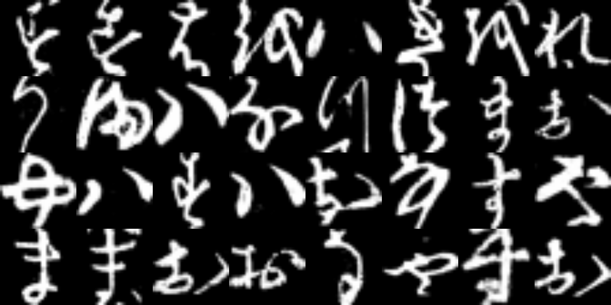

```{r setup, include=FALSE}
knitr::opts_chunk$set(echo = TRUE, eval = FALSE)
```

Last January at [rstudio::conf](https://rstudio.com/conference/), in that distant past when conferences still used to take place at some physical location, my colleague [Daniel](https://twitter.com/dfalbel) gave a talk introducing new features and ongoing development in the `tensorflow` ecosystem. In the Q&A part, he was asked something unexpected: Were we going to build support for [PyTorch](https://pytorch.org/)? He hesitated; that was in fact the plan, and he had already played around with natively implementing `torch` tensors at a prior time, but he was not completely certain how well "it" would work.

"It", that is an implementation which does not bind to Python Torch, meaning, we don't install the PyTorch wheel and import it via `reticulate`. Instead, we delegate to the underlying C++ library `libtorch` for tensor computations and automatic differentiation, while neural network features -- layers, activations, optimizers -- are implemented directly in R. Removing the intermediary has at least two benefits: For one, the leaner software stack means fewer possible problems in installation and fewer places to look when troubleshooting. Secondly, through its non-dependence on Python, `torch` does not require users to install and maintain a suitable Python environment. Depending on operating system and context, this can make an enormous difference: For example, in many organizations employees are not allowed to manipulate privileged software installations on their laptops.

So why did Daniel hesitate, and, if I recall correctly, give a not-too-conclusive answer? On the one hand, it was not clear whether compilation against `libtorch` would, on some operating systems, pose severe difficulties. (It did, but difficulties turned out to be surmountable.)[^1] On the other, the sheer amount of work involved in re-implementing -- not all, but a big amount of -- PyTorch in R seemed intimidating. Today, there is still lots of work to be done (we'll pick up that thread at the end), but the main obstacles have been ovecome, and enough components are available that `torch` can be useful to the R community. Thus, without further ado, let's train a neural network.

[^1]:  In a nutshell, [Javier](https://twitter.com/javierluraschi) had the idea of wrapping `libtorch` into [lantern](https://github.com/mlverse/lantern), a C interface to `libtorch`, thus avoiding cross-compiler issues between MinGW and Visual Studio.

You're not at your laptop now? Just follow along in the [companion notebook on Colaboratory](https://colab.research.google.com/drive/1NdiN9n_a7NEvFpvjPDvxKTshrSWgxZK5?usp=sharing).

## Installation

#### `torch`

Installing `torch` is as straightforward as typing

```{r}
install.packages("torch")
```

This will detect whether you have CUDA installed, and either download the CPU or the GPU version of `libtorch`. Then, it will install the R package from CRAN. To make use of the very newest features, you can install the development version from GitHub:

```{r}
devtools::install_github("mlverse/torch")
```

To quickly check the installation, and whether GPU support works fine (assuming that there *is* a CUDA-capable NVidia GPU), create a tensor *on the CUDA device*:

```{r}
torch_tensor(1, device = "cuda")
```

    torch_tensor 
     1
    [ CUDAFloatType{1} ]

If all our *hello torch* example did was run a network on, say, simulated data, we could stop here. As we'll do image classification, however, we need to install another package: `torchvision`.

#### `torchvision`

```{r}
```

Whereas `torch` is where tensors, network modules, and generic data loading functionality live, datatype-specific capabilities are -- or will be -- provided by dedicated packages. In general, these capabilities comprise three types of things: datasets, tools for pre-processing and data loading, and pre-trained models.

As of this writing, PyTorch has dedicated libraries for three domain areas: vision, text, and audio. In R, we plan to proceed analogously -- "plan", because `torchtext` and `torchaudio` are still to be created. Right now, `torchvision` is all we need:

```{r}
install.packages("torchvision")
```

And we're ready to load the data.

## Data loading and pre-processing

```{r}
library(torch)
library(torchvision)
```

The list of vision datasets bundled with PyTorch is long, and they're continually being added to `torchvision`.

The one we need right now is available already, and it's -- MNIST? ... not quite: It's my favorite "MNIST dropin", [Kuzushiji-MNIST](https://github.com/rois-codh/kmnist) [@clanuwat2018deep]. Like other datasets explicitly created to replace MNIST, it has ten classes -- characters, in this case, depicted as grayscale images of resolution `28x28`.

Here are the first 32 characters:

```{r, eval=TRUE, echo=FALSE, layout="l-body-outset", fig.cap = "Kuzushiji MNIST."}

```

#### Dataset

The following code will download the data, separately for training and test sets.

```{r}
train_ds <- kmnist_dataset(
  ".",
  download = TRUE,
  train = TRUE,
  transform = transform_to_tensor
)

test_ds <- kmnist_dataset(
  ".",
  download = TRUE,
  train = FALSE,
  transform = transform_to_tensor
)

```

Note the `transform` argument. `transform_to_tensor` takes an image and applies two transformations: First, it normalizes the pixels to the range between 0 and 1. Then, it adds another dimension in front. Why?

Contrary to what you might expect -- if until now, you've been using `keras` -- the additional dimension is *not* the batch dimension. Batching will be taken care of by the `dataloader`, to be introduced next. Instead, this is the *channels* dimension that in `torch`, is found *before* the width and height dimensions by default.

One thing I've found to be extremely useful about `torch` is how easy it is to inspect objects. Even though we're dealing with a `dataset`, a custom object, and not an R array or even a `torch` tensor, we can easily peek at what's inside. Indexing in `torch` is 1-based, conforming to the R user's intuitions. Consequently,

```{r}
train_ds[1]
```

gives us the first element in the dataset, an R *list* of two tensors corresponding to input and target, respectively. (We don't reproduce the output here, but you can see for yourself in the notebook.)

Let's inspect the shape of the input tensor:

```{r}
train_ds[1][[1]]$size()
```

    [1]  1 28 28

Now we have the data, we need someone to feed them to a deep learning model, nicely batched and all. In `torch`, this is the task of data loaders.

#### Data loader

Each of training and test sets get their own data loader:

```{r}
train_dl <- dataloader(train_ds, batch_size = 32, shuffle = TRUE)
test_dl <- dataloader(test_ds, batch_size = 32)
```

Again, `torch` makes it easy to verify we did the correct thing. To take a look at the content of the first batch, do

```{r}
train_iter <- train_dl$.iter()
train_iter$.next()
```

Functionality like this may not seem indispensable when working with a well-known dataset, but will turn out to be very useful when a lot of domain-specific pre-processing is required.

Now that we've seen how to load data, all prerequisites are fulfilled for visualizing them. Here is the code that was used to display the first batch of characters, above:

```{r, fig.asp=0.5, fig.width=8}
par(mfrow = c(4,8), mar = rep(0, 4))
images <- train_dl$.iter()$.next()[[1]][1:32, 1, , ] 
images %>%
  purrr::array_tree(1) %>%
  purrr::map(as.raster) %>%
  purrr::iwalk(~{plot(.x)})
```

We're ready to define our network -- a simple convnet.

## Network

If you've been using `keras` *custom models* (or have some experience with *Py*Torch), the following way of defining a network may not look too surprising.

You use `nn_module()` to define an R6 class that will hold the network's components. Its layers are created in `initialize()`; `forward()` describes what happens during the network's forward pass. One thing on terminology: In `torch`, layers are called *modules*, as are networks. This makes sense: The design is truly *modular* in that any module can be used as a component in a larger one.

```{r}
net <- nn_module(
  
  "KMNIST-CNN",
  
  initialize = function() {
    # in_channels, out_channels, kernel_size, stride = 1, padding = 0
    self$conv1 <- nn_conv2d(1, 32, 3)
    self$conv2 <- nn_conv2d(32, 64, 3)
    self$dropout1 <- nn_dropout2d(0.25)
    self$dropout2 <- nn_dropout2d(0.5)
    self$fc1 <- nn_linear(9216, 128)
    self$fc2 <- nn_linear(128, 10)
  },
  
  forward = function(x) {
    x %>% 
      self$conv1() %>%
      nnf_relu() %>%
      self$conv2() %>%
      nnf_relu() %>%
      nnf_max_pool2d(2) %>%
      self$dropout1() %>%
      torch_flatten(start_dim = 2) %>%
      self$fc1() %>%
      nnf_relu() %>%
      self$dropout2() %>%
      self$fc2()
  }
)
```

The layers -- apologies: modules -- themselves may look familiar. Unsurprisingly, `nn_conv2d()` performs two-dimensional convolution; `nn_linear()` multiplies by a weight matrix and adds a vector of biases. But what are those numbers: `nn_linear(128, 10)`, say?

In `torch`, instead of the number of units in a layer, you specify input and output dimensionalities of the "data" that run through it. Thus, `nn_linear(128, 10)` has 128 input connections and outputs 10 values -- one for every class. In some cases, such as this one, specifying dimensions is easy -- we know how many input edges there are (namely, the same as the number of output edges from the previous layer), and we know how many output values we need. But how about this module's predecessor? How do we arrive at `9216` input connections?

Here, a bit of calculation is necessary. We go through all actions that happen in `forward()` -- if they change shapes, we keep track of the transformation; if they don't, we ignore them.

So, we start with input tensors of shape `batch_size x 1 x 28 x 28`. Then,

-   `nn_conv2d(1, 32, 3)` , or equivalently, `nn_conv2d(in_channels = 1, out_channels = 32, kernel_size = 3),`applies a convolution with kernel size 3, stride 1 (the default) and no padding (the default). We can consult the [documentation](https://mlverse.github.io/torch/reference/nn_conv2d.html) to look up the resulting output size, or just intuitively reason that with a kernel of size 3 and no padding, the image will shrink by one pixel in each direction, resulting in a spatial resolution of `26 x 26`. *Per channel*, that is. Thus, the actual output shape is `batch_size x 32 x 26 x 26` . Next,

-   `nnf_relu()` applies ReLU activation, in no way touching the shape. Next is

-   `nn_conv2d(32, 64, 3)`, another convolution with zero padding and kernel size 3. Output size now is `batch_size x 64 x 24 x 24` . Now, the second

-   `nnf_relu()` again does nothing to the output shape, but

-   `nnf_max_pool2d(2)` (equivalently: `nnf_max_pool2d(kernel_size = 2)`) does: It applies max pooling over regions of extension `2 x 2`, thus downsizing the output to a format of `batch_size x 32 x 12 x 12` . Now,

-   `nn_dropout2d(0.25)` is a no-op, shape-wise, but if we want to apply a linear layer later, we need to merge all of the *channels*, *height* and *width* axes into a single dimension. This is done in

-   `torch_flatten(start_dim = 2)`. Output shape is now `batch_size * 9216` , since `64 * 12 * 12 = 9216` . Thus here we have the `9216` input connections fed into the

-   `nn_linear(9216, 128)` discussed above. Again,

-   `nnf_relu()` and `nn_dropout2d(0.5)` leave dimensions as they are, and finally,

-   `nn_linear(128, 10)` gives us the desired output scores, one for each of the ten classes.

Now you'll be thinking, -- what if my network is more complicated? Calculations could become pretty cumbersome. Luckily, with `torch`'s flexibility, there is another way. Since every layer is callable *in isolation*, we can just ... create some sample data and see what happens!

Here is a sample "image" -- or more precisely, a one-item batch containing it:

```{r}
x <- torch_randn(c(1, 1, 28, 28))
```

What if we call the first *conv2d* module on it?

```{r}
conv1 <- nn_conv2d(1, 32, 3)
conv1(x)$size()
```

    [1]  1 32 26 26

Or both *conv2d* modules?

```{r}
conv2 <- nn_conv2d(32, 64, 3)
(conv1(x) %>% conv2())$size()
```

    [1]  1 64 24 24

And so on. This is just one example illustrating how `torch`s flexibility makes developing neural nets easier.

Back to the main thread. We instantiate the model, and we ask `torch` to allocate its weights (parameters) on the GPU:

```{r}
model <- net()
model$to(device = "cuda")
```

We'll do the same for the input and output data -- that is, we'll move them to the GPU. This is done in the training loop, which we'll inspect next.

## Training

In `torch`, when creating an optimizer, we tell it what to operate on, namely, the model's parameters:

```{r}
optimizer <- optim_adam(model$parameters)
```

What about the loss function? For classification with more than two classes, we use *cross entropy*, in `torch`: `nnf_cross_entropy(prediction, ground_truth)`:

```{r}
# this will be called for every batch, see training loop below
loss <- nnf_cross_entropy(output, b[[2]]$to(device = "cuda"))
```

Unlike categorical cross entropy in `keras` , which would expect `prediction` to contain probabilities, as obtained by applying a *softmax* activation, `torch`'s `nnf_cross_entropy()` works with the raw outputs (the *logits*). This is why the network's last linear layer was not followed by any activation.

The training loop, in fact, is a double one: It loops over epochs and batches. For every batch, it calls the model on the input, calculates the loss, and has the optimizer update the weights:

```{r}
for (epoch in 1:5) {

  l <- c()

  for (b in enumerate(train_dl)) {
    # make sure each batch's gradient updates are calculated from a fresh start
    optimizer$zero_grad()
    # get model predictions
    output <- model(b[[1]]$to(device = "cuda"))
    # calculate loss
    loss <- nnf_cross_entropy(output, b[[2]]$to(device = "cuda"))
    # calculate gradient
    loss$backward()
    # apply weight updates
    optimizer$step()
    # track losses
    l <- c(l, loss$item())
  }

  cat(sprintf("Loss at epoch %d: %3f\n", epoch, mean(l)))
}
```

    Loss at epoch 1: 1.795564
    Loss at epoch 2: 1.540063
    Loss at epoch 3: 1.495343
    Loss at epoch 4: 1.461649
    Loss at epoch 5: 1.446628

Although there is a lot more that *could* be done -- calculate metrics or evaluate performance on a validation set, for example -- the above is a typical (if simple) template for a `torch` training loop.

The optimizer-related idioms in particular

```{r}
optimizer$zero_grad()
# ...
loss$backward()
# ...
optimizer$step()
```

you'll keep encountering over and over.

Finally, let's evaluate model performance on the test set.

## Evaluation

Putting a model in `eval` mode tells `torch` *not* to calculate gradients and perform backprop during the operations that follow:

```{r}
model$eval()
```

We iterate over the test set, keeping track of losses and accuracies obtained on the batches.

```{r}
test_losses <- c()
total <- 0
correct <- 0

for (b in enumerate(test_dl)) {
  output <- model(b[[1]]$to(device = "cuda"))
  labels <- b[[2]]$to(device = "cuda")
  loss <- nnf_cross_entropy(output, labels)
  test_losses <- c(test_losses, loss$item())
  # torch_max returns a list, with position 1 containing the values 
  # and position 2 containing the respective indices
  predicted <- torch_max(output$data(), dim = 2)[[2]]
  total <- total + labels$size(1)
  # add number of correct classifications in this batch to the aggregate
  correct <- correct + (predicted == labels)$sum()$item()
}

mean(test_losses)
```

    [1] 1.53784480643349

Here is mean accuracy, computed as proportion of correct classifications:

```{r}
test_accuracy <-  correct/total
test_accuracy
```

    [1] 0.9449

That's it for our first `torch` example. Where to from here?

## Learn

To learn more, check out our vignettes on the `torch` [website](https://mlverse.github.io/torch). To begin, you may want to check out these in particular:

-   "Getting started" series: Build a simple neural network from scratch, starting from [low-level tensor manipulation](https://mlverse.github.io/tohttps://mlverse.github.io/torch/articles/getting-started/tensors.html) and gradually adding in higher-level features like [automatic differentiation](https://mlverse.github.io/torch/articles/getting-started/tensors-and-autograd.html) and [network modules](https://mlverse.github.io/torch/articles/getting-started/nn.html).
-   More on tensors: [Tensor creation](https://mlverse.github.io/torch/articles/tensor-creation.html) and [indexing](https://mlverse.github.io/torch/articles/indexing.html)
-   Backpropagation in `torch`: [autograd](https://mlverse.github.io/torch/articles/using-autograd.html)

If you have questions, or run into problems, please feel free to ask on [GitHub](https://github.com/mlverse/torch) or on the [RStudio community forum](https://community.rstudio.com/).

## We need you

We very much wish that the R community will find the new functionality useful. But that's not all. Instead, we hope that you, many of you, will take part in the journey.

There is not just a whole framework to be built, including many specialized modules, activation functions, optimizers and schedulers, with more of each being added continuously, on the Python side.

There is not just that whole "bag of data types" to be taken care of (images, text, audio...), each of which demand their own pre-processing and data-loading functionality. As everyone knows from experience, ease of data preparation is a, perhaps *the* essential factor in how usable a framework is.

Then, there is the ever-expanding ecosystem of libraries built on top of PyTorch: [PySyft](https://github.com/OpenMined/PySyft) and [CrypTen](https://github.com/facebookresearch/CrypTen) for privacy-preserving machine learning, [PyTorch Geometric](https://github.com/rusty1s/pytorch_geometric) for deep learning on manifolds, and [Pyro](http://pyro.ai/) for probabilistic programming, to name just a few.

All this is much more than can be done by one or two people: We need your help! Contributions are greatly welcomed at absolutely *any* scale:

-   Add or improve documentation, add introductory examples

-   Implement missing layers (modules), activations, helper functions...

-   Implement model architectures

-   Port some of the PyTorch ecosystem

One component that should be of special interest to the R community is [Torch distributions](https://pytorch.org/docs/stable/distributions.html), the basis for probabilistic computation. This package is built upon by e.g. the aforementioned [Pyro](http://pyro.ai/); at the same time, the distributions that live there are used in probabilistic neural networks or normalizing flows.

To reiterate, participation from the R community is greatly encouraged (more than that -- fervently hoped for!). Have fun with `torch`, and thanks for reading!
