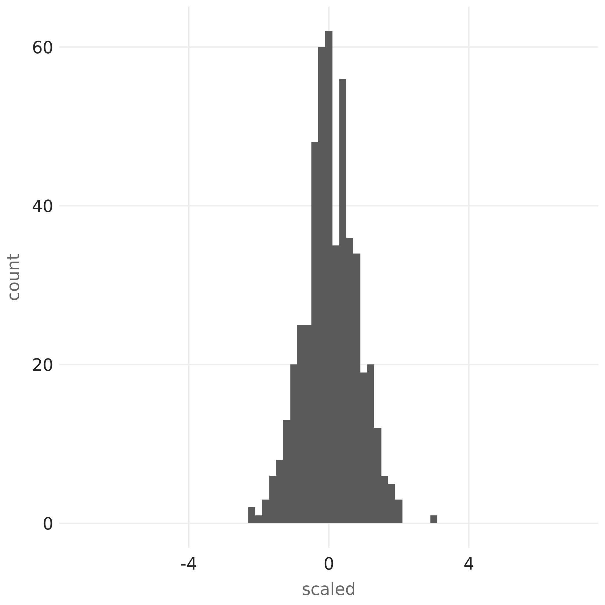

```{r setup, include=FALSE}
knitr::opts_chunk$set(echo = FALSE)
```

[`sparklyr`](https://sparklyr.ai) 1.4 is now available on [CRAN](https://cran.r-project.org/web/packages/sparklyr/index.html)!  To install `sparklyr` 1.4 from CRAN, run

```{r echo=TRUE, eval=FALSE}
install.packages("sparklyr")
```

In this blog post, we will showcase the following much anticipated new functionalities from the `sparklyr` 1.4 release:

 * [Parallelized Weighted Sampling](#parallelized-weighted-sampling) with Spark
 * Support for [Tidyr Verbs](#tidyr-verbs) on Spark Dataframes
 * [`ft_robust_scaler`](#robust-scaler) as the R interface for [RobustScaler](https://spark.apache.org/docs/3.0.0/api/java/org/apache/spark/ml/feature/RobustScaler.html) from Spark 3.0
 * Option for enabling [`RAPIDS`](#rapids) GPU acceleration plugin in `spark_connect()`
 * [Higher-order functions and `dplyr`-related improvements](#higher-order-functions-and-dplyr-related-improvements)

## Parallelized Weighted Sampling

Readers familiar with `dplyr::sample_n()` and `dplyr::sample_frac()` functions may have noticed both of them support weighted-sampling use cases on R dataframes, e.g.,

```{r echo=TRUE, eval=FALSE}
dplyr::sample_n(mtcars, size = 3, weight = mpg, replace = FALSE)
```
```
               mpg cyl  disp  hp drat    wt  qsec vs am gear carb
Fiat 128      32.4   4  78.7  66 4.08 2.200 19.47  1  1    4    1
Merc 280C     17.8   6 167.6 123 3.92 3.440 18.90  1  0    4    4
Mazda RX4 Wag 21.0   6 160.0 110 3.90 2.875 17.02  0  1    4    4
```

and

```{r echo=TRUE, eval=FALSE}
dplyr::sample_frac(mtcars, size = 0.1, weight = mpg, replace = FALSE)
```

```
             mpg cyl  disp  hp drat    wt  qsec vs am gear carb
Honda Civic 30.4   4  75.7  52 4.93 1.615 18.52  1  1    4    2
Merc 450SE  16.4   8 275.8 180 3.07 4.070 17.40  0  0    3    3
Fiat X1-9   27.3   4  79.0  66 4.08 1.935 18.90  1  1    4    1
```

will select some random subset of `mtcars` using the `mpg` attribute as the sampling weight for each row. If `replace = FALSE` is set, then a row is removed from the sampling population once it gets selected, whereas when setting `replace = TRUE`, each row will always stay in the sampling population and can be selected multiple times.

Now the exact same use cases are supported for Spark dataframes in `sparklyr` 1.4! For example:

```{r echo=TRUE, eval=FALSE}
library(sparklyr)

sc <- spark_connect(master = "local")
mtcars_sdf <- copy_to(sc, mtcars, repartition = 4L)

dplyr::sample_n(mtcars_sdf, size = 5, weight = mpg, replace = FALSE)
```

will return a random subset of size 5 from the Spark dataframe `mtcars_sdf`.

More importantly, the sampling algorithm implemented in `sparklyr` 1.4 is something that fits perfectly into the MapReduce paradigm: as we have split our `mtcars` data into 4 partitions of `mtcars_sdf` by specifying `repartition = 4L`, the algorithm will first process each partition independently and in parallel, selecting a sample set of size up to 5 from each, and then reduce all 4 sample sets into a final sample set of size 5 by choosing records having the top 5 highest sampling priorities among all.

How is such parallelization possible, especially for the sampling without replacement scenario, where the desired result is defined as the outcome of a sequential process? A detailed answer to this question is in [this blog post](https://blogs.rstudio.com/ai/posts/2020-07-29-parallelized-sampling/), which includes a definition of the problem (in particular, the exact meaning of sampling weights in term of probabilities), a high-level explanation of the current solution and the motivation behind it, and also, some mathematical details all hidden in one link to a PDF file, so that non-math-oriented readers can get the gist of everything else without getting scared away, while math-oriented readers can enjoy working out all the integrals themselves before peeking at the answer.

## Tidyr Verbs

The specialized implementations of the following [`tidyr`](https://tidyr.tidyverse.org/) verbs that work efficiently with Spark dataframes were included as part of `sparklyr` 1.4:

* `tidyr::fill`
* `tidyr::nest`
* `tidyr::unnest`
* `tidyr::pivot_wider`
* `tidyr::pivot_longer`
* `tidyr::separate`
* `tidyr::unite`

We can demonstrate how those verbs are useful for tidying data through some examples.

Let's say we are given `mtcars_sdf`, a Spark dataframe containing all rows from `mtcars` plus the name of each row:

```{r echo=TRUE, eval=FALSE}
library(sparklyr)

sc <- spark_connect(master = "local")
mtcars_sdf <- cbind(
  data.frame(model = rownames(mtcars)),
  data.frame(mtcars, row.names = NULL)
) %>%
  copy_to(sc, ., repartition = 4L)

print(mtcars_sdf, n = 5)
```
```
# Source: spark<?> [?? x 12]
  model          mpg   cyl  disp    hp  drat    wt  qsec    vs    am  gear  carb
  <chr>        <dbl> <dbl> <dbl> <dbl> <dbl> <dbl> <dbl> <dbl> <dbl> <dbl> <dbl>
1 Mazda RX4     21       6   160   110  3.9   2.62  16.5     0     1     4     4
2 Mazda RX4 W…  21       6   160   110  3.9   2.88  17.0     0     1     4     4
3 Datsun 710    22.8     4   108    93  3.85  2.32  18.6     1     1     4     1
4 Hornet 4 Dr…  21.4     6   258   110  3.08  3.22  19.4     1     0     3     1
5 Hornet Spor…  18.7     8   360   175  3.15  3.44  17.0     0     0     3     2
# … with more rows
```

and we would like to turn all numeric attributes in `mtcar_sdf` (in other words, all columns other than the `model` column) into key-value pairs stored in 2 columns, with the `key` column storing the name of each attribute, and the `value` column storing each attribute's numeric value. One way to accomplish that with `tidyr` is by utilizing the `tidyr::pivot_longer` functionality:

```{r echo=TRUE, eval=FALSE}
mtcars_kv_sdf <- mtcars_sdf %>%
  tidyr::pivot_longer(cols = -model, names_to = "key", values_to = "value")
print(mtcars_kv_sdf, n = 5)
```

```
# Source: spark<?> [?? x 3]
  model     key   value
  <chr>     <chr> <dbl>
1 Mazda RX4 am      1
2 Mazda RX4 carb    4
3 Mazda RX4 cyl     6
4 Mazda RX4 disp  160
5 Mazda RX4 drat    3.9
# … with more rows
```

To undo the effect of `tidyr::pivot_longer`, we can apply `tidyr::pivot_wider` to our `mtcars_kv_sdf` Spark dataframe, and get back the original data that was present in `mtcars_sdf`:

```{r echo=TRUE, eval=FALSE}
tbl <- mtcars_kv_sdf %>%
  tidyr::pivot_wider(names_from = key, values_from = value)
print(tbl, n = 5)
```

```
# Source: spark<?> [?? x 12]
  model         carb   cyl  drat    hp   mpg    vs    wt    am  disp  gear  qsec
  <chr>        <dbl> <dbl> <dbl> <dbl> <dbl> <dbl> <dbl> <dbl> <dbl> <dbl> <dbl>
1 Mazda RX4        4     6  3.9    110  21       0  2.62     1  160      4  16.5
2 Hornet 4 Dr…     1     6  3.08   110  21.4     1  3.22     0  258      3  19.4
3 Hornet Spor…     2     8  3.15   175  18.7     0  3.44     0  360      3  17.0
4 Merc 280C        4     6  3.92   123  17.8     1  3.44     0  168.     4  18.9
5 Merc 450SLC      3     8  3.07   180  15.2     0  3.78     0  276.     3  18
# … with more rows
```

Another way to reduce many columns into fewer ones is by using `tidyr::nest` to move some columns into nested tables. For instance, we can create a nested table `perf` encapsulating all performance-related attributes from `mtcars` (namely, `hp`, `mpg`, `disp`, and `qsec`). However, unlike R dataframes, Spark Dataframes do not have the concept of nested tables, and the closest to nested tables we can get is a `perf` column containing named structs with `hp`, `mpg`, `disp`, and `qsec` attributes:

```{r echo=TRUE, eval=FALSE}
mtcars_nested_sdf <- mtcars_sdf %>%
  tidyr::nest(perf = c(hp, mpg, disp, qsec))
```

We can then inspect the type of `perf` column in `mtcars_nested_sdf`:

```{r echo=TRUE, eval=FALSE}
sdf_schema(mtcars_nested_sdf)$perf$type
```

```
[1] "ArrayType(StructType(StructField(hp,DoubleType,true), StructField(mpg,DoubleType,true), StructField(disp,DoubleType,true), StructField(qsec,DoubleType,true)),true)"
```

and inspect individual struct elements within `perf`:

```{r echo=TRUE, eval=FALSE}
perf <- mtcars_nested_sdf %>% dplyr::pull(perf)
unlist(perf[[1]])
```

```
    hp    mpg   disp   qsec
110.00  21.00 160.00  16.46
```

Finally, we can also use `tidyr::unnest` to undo the effects of `tidyr::nest`:

```{r echo=TRUE, eval=FALSE}
mtcars_unnested_sdf <- mtcars_nested_sdf %>%
  tidyr::unnest(col = perf)
print(mtcars_unnested_sdf, n = 5)
```

```
# Source: spark<?> [?? x 12]
  model          cyl  drat    wt    vs    am  gear  carb    hp   mpg  disp  qsec
  <chr>        <dbl> <dbl> <dbl> <dbl> <dbl> <dbl> <dbl> <dbl> <dbl> <dbl> <dbl>
1 Mazda RX4        6  3.9   2.62     0     1     4     4   110  21    160   16.5
2 Hornet 4 Dr…     6  3.08  3.22     1     0     3     1   110  21.4  258   19.4
3 Duster 360       8  3.21  3.57     0     0     3     4   245  14.3  360   15.8
4 Merc 280         6  3.92  3.44     1     0     4     4   123  19.2  168.  18.3
5 Lincoln Con…     8  3     5.42     0     0     3     4   215  10.4  460   17.8
# … with more rows
```

## Robust Scaler

[RobustScaler](https://spark.apache.org/docs/3.0.0/api/java/org/apache/spark/ml/feature/RobustScaler.html) is a new functionality introduced in Spark 3.0 ([SPARK-28399](https://issues.apache.org/jira/browse/SPARK-28399)). Thanks to a [pull request](https://github.com/sparklyr/sparklyr/pull/2254) by [\@zero323](https://github.com/zero323), an R interface for `RobustScaler`, namely, the `ft_robust_scaler()` function, is now part of `sparklyr`.

It is often observed that many machine learning algorithms perform better on numeric inputs that are standardized. Many of us have learned in stats 101 that given a random variable $X$, we can compute its mean $\mu = E[X]$, standard deviation $\sigma = \sqrt{E[X^2] - (E[X])^2}$, and then obtain a standard score $z = \frac{X - \mu}{\sigma}$ which has mean of 0 and standard deviation of 1.

However, notice both $E[X]$ and $E[X^2]$ from above are quantities that can be easily skewed by extreme outliers in $X$, causing distortions in $z$.

An alternative way of standardizing $X$ based on its median, 1st quartile, and 3rd quartile values, all of which are robust against outliers, would be the following:

$\displaystyle z = \frac{X - \text{Median}(X)}{\text{P75}(X) - \text{P25}(X)}$

and this is precisely what [RobustScaler](https://spark.apache.org/docs/3.0.0/api/java/org/apache/spark/ml/feature/RobustScaler.html) offers.

To see `ft_robust_scaler()` in action and demonstrate its usefulness, we can go through a contrived example consisting of the following steps:

- Draw 100 random samples from the standard normal distribution

```{r echo=TRUE, eval=FALSE}
sample_values <- rnorm(100)
print(sample_values)
```

```
  [1] -0.885440337  0.831855863 -0.890427366  0.437780168  0.091902152
  [6]  0.774895164 -0.839350781 -1.173025189 -0.442174680 -0.002573251
  ...
```
- Inspect the minimal and maximal values among the 100 random samples:

```{r echo=TRUE, eval=FALSE}
print(min(sample_values))
```
```
  [1] -2.377851
```

```{r echo=TRUE, eval=FALSE}
print(max(sample_values))
```
```
  [1] 2.629998
```

- Now create 5 other values that are extreme outliers compared to the 100 random samples above. Given that we know all 100 samples are within the range of $(-3, 3)$, we can choose $21, 22, \ldots, 25$ as our outliers:

```{r echo=TRUE, eval=FALSE}
outliers <- 20 + seq(5)
```

- Copy all 105 values into a Spark dataframe named `sdf`

```{r echo=TRUE, eval=FALSE}
library(sparklyr)

sc <- spark_connect(master = "local", version = "3.0.0")
sdf <- copy_to(sc, data.frame(value = c(sample_values, outliers)))
```

- We can then apply `ft_robust_scaler()` to obtain the standardized value for each input:

```{r echo=TRUE, eval=FALSE}
scaled <- sdf %>%
  ft_vector_assembler("value", "input") %>%
  ft_robust_scaler("input", "scaled") %>%
  dplyr::pull(scaled) %>%
  unlist()
```

- Plotting the result shows the non-outlier data points are scaled to values that still more or less form a bell-shaped distribution, as expected, so the scaling is robust against influences of the outliers:

```{r echo=TRUE, eval=FALSE}
library(ggplot2)

ggplot(data.frame(scaled = scaled), aes(x = scaled)) + geom_histogram(binwidth = 0.2)
```

{#id .class width=40% height=40%}

- Finally, we can compare the distribution of the scaled values above with the distribution of z-scores of all input values, and notice how scaling the input with only mean and standard deviation would have caused noticeable skewness which the robust scaler has successfully avoided:


```{r echo=TRUE, eval=FALSE}
all_values <- c(sample_values, outliers)
z_scores <- (all_values - mean(all_values)) / sd(all_values)
ggplot(data.frame(scaled = z_scores), aes(x = scaled)) + geom_histogram(binwidth = 0.2)
```

{#id .class width=40% height=40%}

## RAPIDS

Readers following Apache Spark releases closely probably have noticed the recent addition of [RAPIDS](https://rapids.ai/) GPU acceleration support in Spark 3.0. Catching up with this recent development, an option to enable RAPIDS in Spark connections was also created in `sparklyr` and shipped in `sparklyr` 1.4. On a host with RAPIDS-capable hardware (e.g., an Amazon EC2 instance of type 'p3.2xlarge'), one can install `sparklyr` 1.4 and observe RAPIDS hardware acceleration being reflected in Spark SQL physical query plans:

```{r echo=TRUE, eval=FALSE}
library(sparklyr)

sc <- spark_connect(master = "local", version = "3.0.0", packages = "rapids")
dplyr::db_explain(sc, "SELECT 4")
```

```
== Physical Plan ==
*(2) GpuColumnarToRow false
+- GpuProject [4 AS 4#45]
   +- GpuRowToColumnar TargetSize(2147483647)
      +- *(1) Scan OneRowRelation[]
```

## Higher-Order Functions and `dplyr`-Related Improvements

All newly introduced higher-order functions from Spark 3.0, such as `array_sort()` with custom comparator, `transform_keys()`, `transform_values()`, and `map_zip_with()`, are supported by `sparklyr` 1.4.

In addition, all higher-order functions can now be accessed directly through `dplyr` rather than their `hof_*` counterparts in `sparklyr`, which means, for example, we can run the following `dplyr` queries to calculate the square of all array elements in column `x` of `sdf` and then sort them in descending order:

```{r echo=TRUE, eval=FALSE}
library(sparklyr)

sc <- spark_connect(master = "local", version = "3.0.0")
sdf <- copy_to(sc, tibble::tibble(x = list(c(-3, -2, 1, 5), c(6, -7, 5, 8))))

sq_desc <- sdf %>%
  dplyr::mutate(x = transform(x, ~ .x * .x)) %>%
  dplyr::mutate(x = array_sort(x, ~ as.integer(sign(.y - .x)))) %>%
  dplyr::pull(x)

print(sq_desc)
```
```
[[1]]
[1] 25  9  4  1

[[2]]
[1] 64 49 36 25
```

## Acknowledgement

In chronological order, we would like to thank the following individuals for their contribution towards `sparklyr` 1.4:

* [\@javierluraschi](https:://github.com/javierluraschi)
* [\@nealrichardson](https:://github.com/nealrichardson)
* [\@yitao-li](https:://github.com/yitao-li)
* [\@wkdavis](https:://github.com/wkdavis)
* [\@Loquats](https:://github.com/Loquats)
* [\@zero323](https:://github.com/zero323)

We also appreciate bug reports, feature requests, and valuable other feedback about `sparklyr` from our awesome open-source community (e.g., the weighted sampling feature in `sparklyr` 1.4 was largely motivated by this [Github issue](https://github.com/sparklyr/sparklyr/issues/2592) filed by [\@ajing](https://github.com/ajing), and some `dplyr`-related bug fixes shipped in this release was initiated in [#2648](https://github.com/sparklyr/sparklyr/issues/2648) and completed with this [pull request](https://github.com/sparklyr/sparklyr/pull/2651) by [\@wkdavis](https:://github.com/wkdavis)).

Last but not least, the author of this blog post is extremely grateful for fantastic editorial suggestions from [\@javierluraschi](https:://github.com/javierluraschi), [\@batpigandme](https://github.com/batpigandme), and [\@skeydan](https://github.com/skeydan). 

If you wish to learn more about `sparklyr`, we recommend checking out [sparklyr.ai](https://sparklyr.ai), [spark.rstudio.com](https://spark.rstudio.com), and also some of the previous release posts such as [sparklyr 1.3](https://blog.rstudio.com/2020/07/16/sparklyr-1-3/) and [sparklyr 1.2](https://blogs.rstudio.com/ai/posts/2020-04-21-sparklyr-1.2.0-released/).

Thanks for reading!
