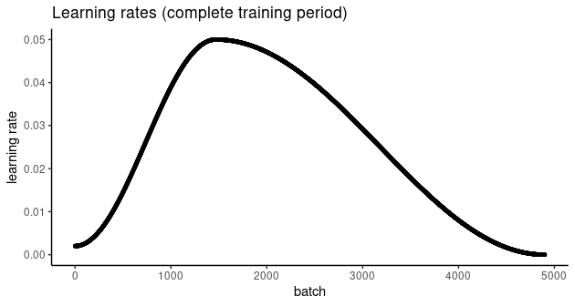

```{r setup, include=FALSE}
knitr::opts_chunk$set(echo = TRUE, eval = FALSE)
```

In recent posts, we've been exploring essential `torch` functionality: [tensors](https://blogs.rstudio.com/ai/posts/2020-10-01-torch-network-from-scratch/), the sine qua non of every deep learning framework; [autograd](https://blogs.rstudio.com/ai/posts/2020-10-05-torch-network-with-autograd), `torch`'s implementation of reverse-mode automatic differentiation; [modules](https://blogs.rstudio.com/ai/posts/2020-10-07-torch-modules), composable building blocks of neural networks; and [optimizers](https://blogs.rstudio.com/ai/posts/2020-10-09-torch-optim/), the -- well -- optimization algorithms that `torch` provides.

But we haven't really had our "hello world" moment yet, at least not if by "hello world" you mean the inevitable *deep learning experience of classifying pets*. Cat or dog? Beagle or boxer? Chinook or Chihuahua? We'll distinguish ourselves by asking a (slightly) different question: What kind of bird?

Questions we'll address on our way:

-   What are the core roles of `torch` *datasets* and *data loaders*, respectively?

-   How to apply `transform`s, both for image preprocessing and data augmentation.

-   How to use Resnet [@HeZRS15], a pre-trained model that comes with `torchvision`, for transfer learning.

-   How to use learning rate schedulers, and in particular, the one-cycle learning rate algorithm [\@abs-1708-07120].

-   How to find a good initial learning rate.

For convenience, the code is available on [Google Colaboratory](https://colab.research.google.com/drive/1OJzzqiQVbh3ZdLB2L2t_DhBGInlh9o-k?usp=sharing) -- no copy-pasting required.

## Data loading and preprocessing

The example dataset used here is available on [Kaggle](https://www.kaggle.com/gpiosenka/100-bird-species/data){.uri}.

Conveniently, it may be obtained using [`torchdatasets`](https://github.com/mlverse/torchdatasets), which uses [`pins`](https://github.com/rstudio/pins) for authentication, retrieval and storage. To enable `pins` to manage your Kaggle downloads, please follow the instructions [here](https://pins.rstudio.com/articles/boards-kaggle.html).

This dataset is very "clean", unlike the images we may be used to from, e.g., [ImageNet](http://image-net.org/). To help with generalization, we introduce noise during training -- in other words, we perform *data augmentation*. In `torchvision`, data augmentation is part of an *image processing pipeline* that first converts an image to a tensor, and then applies any transformations such as resizing, cropping, normalization, or various forms of distorsion.

Below are the transformations performed on the training set. Note how most of them are for data augmentation, while normalization is done to comply with what's expected by ResNet.

#### Image preprocessing pipeline

```{r}
library(torch)
library(torchvision)
library(torchdatasets)

library(dplyr)
library(pins)
library(ggplot2)

device <- if (cuda_is_available()) torch_device("cuda:0") else "cpu"

train_transforms <- function(img) {
  img %>%
    # first convert image to tensor
    transform_to_tensor() %>%
    # then move to the GPU (if available)
    (function(x) x$to(device = device)) %>%
    # data augmentation
    transform_random_resized_crop(size = c(224, 224)) %>%
    # data augmentation
    transform_color_jitter() %>%
    # data augmentation
    transform_random_horizontal_flip() %>%
    # normalize according to what is expected by resnet
    transform_normalize(mean = c(0.485, 0.456, 0.406), std = c(0.229, 0.224, 0.225))
}

```

On the validation set, we don't want to introduce noise, but still need to resize, crop, and normalize the images. The test set should be treated identically.

```{r}
valid_transforms <- function(img) {
  img %>%
    transform_to_tensor() %>%
    (function(x) x$to(device = device)) %>%
    transform_resize(256) %>%
    transform_center_crop(224) %>%
    transform_normalize(mean = c(0.485, 0.456, 0.406), std = c(0.229, 0.224, 0.225))
}

test_transforms <- valid_transforms
```

And now, let's get the data. A one-liner each will download the three sets and tell the corresponding R objects what transformations they're expected to apply: [^1]

[^1]: Physically, the dataset consists of a single `zip` file; so it is really the first instruction that downloads all the data. The remaining two function calls perform semantic mappings only.

```{r}
train_ds <- bird_species_dataset("data", download = TRUE, transform = train_transforms)

valid_ds <- bird_species_dataset("data", split = "valid", transform = valid_transforms)

test_ds <- bird_species_dataset("data", split = "test", transform = test_transforms)

```

Two things to note. First, transformations are part of the *dataset* concept, as opposed to the *data loader* we'll encounter shortly. Second, let's take a look at how the images have been stored on disk. The overall directory structure (starting from `data`, which we specified as the root directory to be used) is this:

    data/bird_species/train
    data/bird_species/valid
    data/bird_species/test

In the `train`, `valid`, and `test` directories, different classes of images reside in their own folders. For example, here is the directory layout for the first three classes in the test set:

    data/bird_species/test/ALBATROSS/
     - data/bird_species/test/ALBATROSS/1.jpg
     - data/bird_species/test/ALBATROSS/2.jpg
     - data/bird_species/test/ALBATROSS/3.jpg
     - data/bird_species/test/ALBATROSS/4.jpg
     - data/bird_species/test/ALBATROSS/5.jpg
     
    data/test/'ALEXANDRINE PARAKEET'/
     - data/bird_species/test/'ALEXANDRINE PARAKEET'/1.jpg
     - data/bird_species/test/'ALEXANDRINE PARAKEET'/2.jpg
     - data/bird_species/test/'ALEXANDRINE PARAKEET'/3.jpg
     - data/bird_species/test/'ALEXANDRINE PARAKEET'/4.jpg
     - data/bird_species/test/'ALEXANDRINE PARAKEET'/5.jpg
     
     data/test/'AMERICAN BITTERN'/
     - data/bird_species/test/'AMERICAN BITTERN'/1.jpg
     - data/bird_species/test/'AMERICAN BITTERN'/2.jpg
     - data/bird_species/test/'AMERICAN BITTERN'/3.jpg
     - data/bird_species/test/'AMERICAN BITTERN'/4.jpg
     - data/bird_species/test/'AMERICAN BITTERN'/5.jpg

This is exactly the kind of layout expected by `torch`s `image_folder_dataset()` -- and really `bird_species_dataset()` instantiates a subtype of this class. Had we downloaded the data manually, respecting the required directory structure, we could have created the datasets like so:

```{r}
# e.g.
train_ds <- image_folder_dataset(
  file.path(data_dir, "train"),
  transform = train_transforms)
```

Now that we got the data, let's see how many items there are in each set.

```{r}
train_ds$.length()
valid_ds$.length()
test_ds$.length()
```

    31316
    1125
    1125

That training set is really big! It's thus recommended to run this on GPU, or just play around with the provided Colab notebook.

With so many samples, we're curious how many classes there are.

```{r}
class_names <- test_ds$classes
length(class_names)
```

    225

So we *do* have a substantial training set, but the task is formidable as well: We're going to tell apart no less than 225 different bird species.

#### Data loaders

While *datasets* know what to do with each single item, *data loaders* know how to treat them collectively. How many samples make up a batch? Do we want to feed them in the same order always, or instead, have a different order chosen for every epoch?

```{r}
batch_size <- 64

train_dl <- dataloader(train_ds, batch_size = batch_size, shuffle = TRUE)
valid_dl <- dataloader(valid_ds, batch_size = batch_size)
test_dl <- dataloader(test_ds, batch_size = batch_size)
```

Data loaders, too, may be queried for their length. Now length means: How many batches?

```{r}
train_dl$.length() 
valid_dl$.length() 
test_dl$.length()  
```

    490
    18
    18

#### Some birds

Next, let's view a few images from the test set. We can retrieve the first batch -- images and corresponding classes -- by creating an iterator from the `dataloader` and calling `next()` on it:

```{r}
# for display purposes, here we are actually using a batch_size of 24
batch <- train_dl$.iter()$.next()
```

`batch` is a list, the first item being the image tensors:

```{r}
batch[[1]]$size()
```

    [1]  24   3 224 224

And the second, the classes:

```{r}
batch[[2]]$size()
```

    [1] 24

Classes are coded as integers, to be used as indices in a vector of class names. We'll use those for labeling the images.

```{r}
classes <- batch[[2]]
classes
```

    torch_tensor 
     1
     1
     1
     1
     1
     2
     2
     2
     2
     2
     3
     3
     3
     3
     3
     4
     4
     4
     4
     4
     5
     5
     5
     5
    [ GPULongType{24} ]

The image tensors have shape `batch_size x num_channels x height x width`. For plotting using `as.raster()`, we need to reshape the images such that channels come last. We also undo the normalization applied by the `dataloader`.

Here are the first twenty-four images:

```{r, fig.width = 12, fig.height = 8}
library(dplyr)

images <- as_array(batch[[1]]) %>% aperm(perm = c(1, 3, 4, 2))
mean <- c(0.485, 0.456, 0.406)
std <- c(0.229, 0.224, 0.225)
images <- std * images + mean
images <- images * 255
images[images > 255] <- 255
images[images < 0] <- 0

par(mfcol = c(4,6), mar = rep(1, 4))

images %>%
  purrr::array_tree(1) %>%
  purrr::set_names(class_names[as_array(classes)]) %>%
  purrr::map(as.raster, max = 255) %>%
  purrr::iwalk(~{plot(.x); title(.y)})
```

```{r, eval = TRUE, echo = FALSE, layout="l-page"}
knitr::include_graphics("images/image_classif_birds.png")
```

## Model

The backbone of our model is a pre-trained instance of ResNet.

```{r}
model <- model_resnet18(pretrained = TRUE)
```

But we want to distinguish among our 225 bird species, while ResNet was trained on 1000 different classes. What can we do? We simply replace the output layer.

The new output layer is also the only one whose weights we are going to train -- leaving all other ResNet parameters the way they are. Technically, we *could* perform backpropagation through the complete model, striving to fine-tune Resnet's weights as well. This, however, would slow down training significantly. In fact, the choice is not all-or-none: It is up to us how many of the original parameters to keep fixed, and how many to "set free" for fine tuning. For the task at hand, we'll be content to just train the newly added output layer: With the abundance of animals, including birds, in ImageNet, we expect the trained ResNet to know a lot about them!

```{r}
model$parameters %>% purrr::walk(function(param) param$requires_grad_(FALSE))
```

To replace the output layer, the model is modified in-place:

```{r}
num_features <- model$fc$in_features

model$fc <- nn_linear(in_features = num_features, out_features = length(class_names))
```

Now put the modified model on the GPU (if available):

```{r}
model <- model$to(device = device)
```

## Training

For optimization, we use cross entropy loss and stochastic gradient descent.

```{r}
criterion <- nn_cross_entropy_loss()

optimizer <- optim_sgd(model$parameters, lr = 0.1, momentum = 0.9)
```

#### Finding an optimally efficient learning rate

We set the learning rate to `0.1`, but that is just a formality. As became widely known due to the excellent lectures by [fast.ai](http://fast.ai), it makes sense to spend some time upfront to determine an efficient learning rate. While out-of-the-box, `torch` does not provide a tool like fast.ai's learning rate finder, the logic is straightforward to implement. Here's how to find a good learning rate, as translated to R from [Sylvain Gugger's post](https://sgugger.github.io/how-do-you-find-a-good-learning-rate.html):

```{r}
# ported from: https://sgugger.github.io/how-do-you-find-a-good-learning-rate.html

losses <- c()
log_lrs <- c()

find_lr <- function(init_value = 1e-8, final_value = 10, beta = 0.98) {

  num <- train_dl$.length()
  mult = (final_value/init_value)^(1/num)
  lr <- init_value
  optimizer$param_groups[[1]]$lr <- lr
  avg_loss <- 0
  best_loss <- 0
  batch_num <- 0

  for (b in enumerate(train_dl)) {

    batch_num <- batch_num + 1
    optimizer$zero_grad()
    output <- model(b[[1]]$to(device = device))
    loss <- criterion(output, b[[2]]$to(device = device))

    #Compute the smoothed loss
    avg_loss <- beta * avg_loss + (1-beta) * loss$item()
    smoothed_loss <- avg_loss / (1 - beta^batch_num)
    #Stop if the loss is exploding
    if (batch_num > 1 && smoothed_loss > 4 * best_loss) break
    #Record the best loss
    if (smoothed_loss < best_loss || batch_num == 1) best_loss <- smoothed_loss

    #Store the values
    losses <<- c(losses, smoothed_loss)
    log_lrs <<- c(log_lrs, (log(lr, 10)))

    loss$backward()
    optimizer$step()

    #Update the lr for the next step
    lr <- lr * mult
    optimizer$param_groups[[1]]$lr <- lr
  }
}

find_lr()

df <- data.frame(log_lrs = log_lrs, losses = losses)
ggplot(df, aes(log_lrs, losses)) + geom_point(size = 1) + theme_classic()

```

```{r, eval = TRUE, echo = FALSE, layout="l-body-outset"}
knitr::include_graphics("images/lr_finder.png")
```

The best learning rate is not the exact one where loss is at a minimum. Instead, it should be picked somewhat earlier on the curve, while loss is still decreasing. `0.05` looks like a sensible choice.

This value is nothing but an anchor, however. *Learning rate schedulers* allow learning rates to evolve according to some proven algorithm. Among others, `torch` implements one-cycle learning [\@abs-1708-07120], cyclical learning rates [@Smith15a], and cosine annealing with warm restarts [@LoshchilovH16a].

Here, we use `lr_one_cycle()`, passing in our newly found, optimally efficient, hopefully, value `0.05` as a maximum learning rate. `lr_one_cycle()` will start with a low rate, then gradually ramp up until it reaches the allowed maximum. After that, the learning rate will slowly, continually decrease, until it falls slightly below its initial value.

All this happens not per epoch, but exactly once, which is why the name has `one_cycle` in it. Here's how the evolution of learning rates looks in our example:

```{r, eval = TRUE, echo = FALSE, layout="l-body-outset"}

```

Before we start training, let's quickly re-initialize the model, so as to start from a clean slate:

```{r}
model <- model_resnet18(pretrained = TRUE)
model$parameters %>% purrr::walk(function(param) param$requires_grad_(FALSE))

num_features <- model$fc$in_features

model$fc <- nn_linear(in_features = num_features, out_features = length(class_names))

model <- model$to(device = device)

criterion <- nn_cross_entropy_loss()

optimizer <- optim_sgd(model$parameters, lr = 0.05, momentum = 0.9)
```

And instantiate the scheduler:

```{r}
num_epochs = 10

scheduler <- optimizer %>% 
  lr_one_cycle(max_lr = 0.05, epochs = num_epochs, steps_per_epoch = train_dl$.length())

```

#### Training loop

Now we train for ten epochs. For every training batch, we call `scheduler$step()` to adjust the learning rate. Notably, this has to be done *after* `optimizer$step()`.

```{r}
train_batch <- function(b) {

  optimizer$zero_grad()
  output <- model(b[[1]])
  loss <- criterion(output, b[[2]]$to(device = device))
  loss$backward()
  optimizer$step()
  scheduler$step()
  loss$item()

}

valid_batch <- function(b) {

  output <- model(b[[1]])
  loss <- criterion(output, b[[2]]$to(device = device))
  loss$item()
}

for (epoch in 1:num_epochs) {

  model$train()
  train_losses <- c()

  for (b in enumerate(train_dl)) {
    loss <- train_batch(b)
    train_losses <- c(train_losses, loss)
  }

  model$eval()
  valid_losses <- c()

  for (b in enumerate(valid_dl)) {
    loss <- valid_batch(b)
    valid_losses <- c(valid_losses, loss)
  }

  cat(sprintf("\nLoss at epoch %d: training: %3f, validation: %3f\n", epoch, mean(train_losses), mean(valid_losses)))
}

```

    Loss at epoch 1: training: 2.662528, validation: 1.043235

    Loss at epoch 2: training: 1.514869, validation: 1.028505

    Loss at epoch 3: training: 1.376912, validation: 0.825048

    Loss at epoch 4: training: 1.126123, validation: 0.599732

    Loss at epoch 5: training: 0.938386, validation: 0.521426

    Loss at epoch 6: training: 0.772376, validation: 0.403144

    Loss at epoch 7: training: 0.646624, validation: 0.326391

    Loss at epoch 8: training: 0.517824, validation: 0.246606

    Loss at epoch 9: training: 0.405815, validation: 0.205518

    Loss at epoch 10: training: 0.344259, validation: 0.189231

It looks like the model made good progress, but we don't yet know anything about classification accuracy in absolute terms. We'll check that out on the test set.

## Test set accuracy

Finally, we calculate accuracy on the test set:

```{r}
model$eval()

test_batch <- function(b) {

  output <- model(b[[1]])
  labels <- b[[2]]$to(device = device)
  loss <- criterion(output, labels)
  
  test_losses <<- c(test_losses, loss$item())
  # torch_max returns a list, with position 1 containing the values
  # and position 2 containing the respective indices
  predicted <- torch_max(output$data(), dim = 2)[[2]]
  total <<- total + labels$size(1)
  # add number of correct classifications in this batch to the aggregate
  correct <<- correct + (predicted == labels)$sum()$item()

}

test_losses <- c()
total <- 0
correct <- 0

for (b in enumerate(test_dl)) {
  test_batch(b)
}

mean(test_losses)

```

    [1] 1.257352

```{r}
test_accuracy <-  correct/total
test_accuracy
```

    [1] 0.704

Not a bad result, given how many different species there are!

## Wrapup

Hopefully, this has been a useful introduction to classifying images with `torch`, as well as to its non-domain-specific architectural elements, like datasets, data loaders, and learning-rate schedulers. Future posts will explore other domains, as well as move on beyond "hello world" in image recognition. Thanks for reading!
