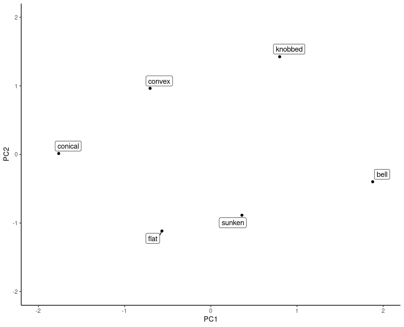

```{r setup, include=FALSE}
knitr::opts_chunk$set(echo = TRUE, eval = FALSE)
```

Machine learning on image-like data can be many things: fun (dogs vs. cats), societally useful (medical imaging), or societally harmful (surveillance). In comparison, tabular data -- the bread and butter of data science -- may seem more mundane.

What's more, if you're particularly interested in deep learning (DL), and looking for the extra benefits to be gained from big data, big architectures, and big compute, you're much more likely to build an impressive showcase on the former instead of the latter.

So for tabular data, why not just go with random forests, or gradient boosting, or other classical methods? I can think of at least a few reasons to learn about DL for tabular data:

-   Even if all your features are interval-scale or ordinal, thus requiring "just" some form of (not necessarily linear) regression, applying DL may result in performance benefits due to sophisticated optimization algorithms, activation functions, layer depth, and more (plus interactions of all of these).

-   If, in addition, there are categorical features, DL models may profit from *embedding* those in continuous space, discovering similarities and relationships that go unnoticed in one-hot encoded representations.

-   What if most features are numeric or categorical, but there's also text in column F and an image in column G? With DL, different modalities can be worked on by different modules that feed their outputs into a common module, to take over from there.

## Agenda

In this introductory post, we keep the architecture straightforward. We don't experiment with fancy optimizers or nonlinearities. However, we do make use of embeddings, and pretty prominently at that. Thus from the above bullet list, we'll shed a light on the second, while leaving the other two for future posts.

In a nutshell, what we'll see is

-   How to create a custom *dataset*, tailored to the specific data you have.

-   How to handle a mix of numeric and categorical data.

-   How to extract continuous-space representations from the embedding modules.

## Dataset

The dataset, [Mushrooms](https://archive.ics.uci.edu/ml/datasets/Mushroom), was chosen for its abundance of categorical columns. It is an unusual dataset to use in DL: It was designed for machine learning models to infer logical rules, as in: IF *a* AND NOT *b* OR *c* [...], then it's an *x*.

Mushrooms are classified into two groups: edible and non-edible. The dataset description lists five possible rules with their resulting accuracies. While the least we want to go into here is the hotly debated topic of whether DL is suited to, or how it could be made more suited to rule learning, we'll allow ourselves some curiosity and check out what happens if we successively remove all columns used to construct those five rules.

Oh, and before you start copy-pasting: Here is the example in a [Google Colaboratory notebook](https://colab.research.google.com/drive/1bfyoD13YaLPLVcQVOLimv6vq9y4CKMM2?usp=sharing).

```{r}
library(torch)
library(purrr)
library(readr)
library(dplyr)
library(ggplot2)

download.file(
  "https://archive.ics.uci.edu/ml/machine-learning-databases/mushroom/agaricus-lepiota.data",
  destfile = "agaricus-lepiota.data"
)

mushroom_data <- read_csv(
  "agaricus-lepiota.data",
  col_names = c(
    "poisonous",
    "cap-shape",
    "cap-surface",
    "cap-color",
    "bruises",
    "odor",
    "gill-attachment",
    "gill-spacing",
    "gill-size",
    "gill-color",
    "stalk-shape",
    "stalk-root",
    "stalk-surface-above-ring",
    "stalk-surface-below-ring",
    "stalk-color-above-ring",
    "stalk-color-below-ring",
    "veil-type",
    "veil-color",
    "ring-type",
    "ring-number",
    "spore-print-color",
    "population",
    "habitat"
  ),
  col_types = rep("c", 23) %>% paste(collapse = "")
) %>%
  # can as well remove because there's just 1 unique value
  select(-`veil-type`)
```

In `torch`, `dataset()` creates an R6 class. As with most R6 classes, there will usually be a need for an `initialize()` method. Below, we use `initialize()` to preprocess the data and store it in convenient pieces. More on that in a minute. Prior to that, please note the two other methods a `dataset` has to implement:

-   `.getitem(i)` . This is the whole purpose of a `dataset`: Retrieve and return the observation located at some index it is asked for. Which index? That's to be decided by the caller, a `dataloader`. During training, usually we want to permute the order in which observations are used, while not caring about order in case of validation or test data.

-   `.length()`. This method, again for use of a `dataloader`, indicates how many observations there are.

In our example, both methods are straightforward to implement. `.getitem(i)` directly uses its argument to index into the data, and `.length()` returns the number of observations:

```{r}
mushroom_dataset <- dataset(
  name = "mushroom_dataset",

  initialize = function(indices) {
    data <- self$prepare_mushroom_data(mushroom_data[indices, ])
    self$xcat <- data[[1]][[1]]
    self$xnum <- data[[1]][[2]]
    self$y <- data[[2]]
  },

  .getitem = function(i) {
    xcat <- self$xcat[i, ]
    xnum <- self$xnum[i, ]
    y <- self$y[i, ]
    
    list(x = list(xcat, xnum), y = y)
  },
  
  .length = function() {
    dim(self$y)[1]
  },
  
  prepare_mushroom_data = function(input) {
    
    input <- input %>%
      mutate(across(.fns = as.factor)) 
    
    target_col <- input$poisonous %>% 
      as.integer() %>%
      `-`(1) %>%
      as.matrix()
    
    categorical_cols <- input %>% 
      select(-poisonous) %>%
      select(where(function(x) nlevels(x) != 2)) %>%
      mutate(across(.fns = as.integer)) %>%
      as.matrix()

    numerical_cols <- input %>%
      select(-poisonous) %>%
      select(where(function(x) nlevels(x) == 2)) %>%
      mutate(across(.fns = as.integer)) %>%
      as.matrix()
    
    list(list(torch_tensor(categorical_cols), torch_tensor(numerical_cols)),
         torch_tensor(target_col))
  }
)
```

As for data storage, there is a field for the target, `self$y`, but instead of the naturally to-be-expected `self$x` we see separate fields for numerical features (`self$xnum`) and categorical ones (`self$xcat`). This is just for convenience: The latter will be passed into embedding modules, which require its inputs to be of type `torch_long()`, as opposed to most other modules that, by default, work with `torch_float()`.

Accordingly, then, all `prepare_mushroom_data()` does is break apart the data into those three parts. *Indispensable aside:* In this dataset, really *all* features happen to be categorical -- it's just that for some, there are but two types. Technically, we could just have treated them the same as the non-binary features. But since normally in DL, we just leave binary features the way they are, we use this as an occasion to show how to handle a mix of various data types.

Our custom `dataset` defined, we create instances for training and validation; each gets its companion `dataloader`:

```{r}
train_indices <- sample(1:nrow(mushroom_data), size = floor(0.8 * nrow(mushroom_data)))
valid_indices <- setdiff(1:nrow(mushroom_data), train_indices)

train_ds <- mushroom_dataset(train_indices)
train_dl <- train_ds %>% dataloader(batch_size = 256, shuffle = TRUE)

valid_ds <- mushroom_dataset(valid_indices)
valid_dl <- valid_ds %>% dataloader(batch_size = 256, shuffle = FALSE)
```

## Model

In `torch`, how much you *modularize* your models is up to you. Often, high degrees of modularization enhance readability and help with troubleshooting.

Here we factor out the embedding functionality. An `embedding_module`, to be passed the categorical features only, will call `torch`'s `nn_embedding()` on each of them:

```{r}
embedding_module <- nn_module(
  
  initialize = function(cardinalities) {
    self$embeddings = nn_module_list(lapply(cardinalities, function(x) nn_embedding(num_embeddings = x, embedding_dim = ceiling(x/2))))
  },
  
  forward = function(x) {
    embedded <- vector(mode = "list", length = length(self$embeddings))
    for (i in 1:length(self$embeddings)) {
      embedded[[i]] <- self$embeddings[[i]](x[ , i])
    }
    torch_cat(embedded, dim = 2)
  }
)
```

The main model, when called, starts by embedding the categorical features, then appends the numerical input and continues processing:

```{r}
net <- nn_module(
  "mushroom_net",

  initialize = function(cardinalities,
                        num_numerical,
                        fc1_dim,
                        fc2_dim) {
    self$embedder <- embedding_module(cardinalities)
    self$fc1 <- nn_linear(sum(map(cardinalities, function(x) ceiling(x/2)) %>% unlist()) + num_numerical, fc1_dim)
    self$fc2 <- nn_linear(fc1_dim, fc2_dim)
    self$output <- nn_linear(fc2_dim, 1)
  },

  forward = function(xcat, xnum) {
    embedded <- self$embedder(xcat)
    all <- torch_cat(list(embedded, xnum$to(dtype = torch_float())), dim = 2)
    all %>% self$fc1() %>%
      nnf_relu() %>%
      self$fc2() %>%
      self$output() %>%
      nnf_sigmoid()
  }
)

```

Now instantiate this model, passing in, on the one hand, output sizes for the linear layers, and on the other, feature cardinalities. The latter will be used by the embedding modules to determine their output sizes, following a simple rule "embed into a space of size half the number of input values":

```{r}
cardinalities <- map(
  mushroom_data[ , 2:ncol(mushroom_data)], compose(nlevels, as.factor)) %>%
  keep(function(x) x > 2) %>%
  unlist() %>%
  unname()

num_numerical <- ncol(mushroom_data) - length(cardinalities) - 1

fc1_dim <- 16
fc2_dim <- 16

model <- net(
  cardinalities,
  num_numerical,
  fc1_dim,
  fc2_dim
)

device <- if (cuda_is_available()) torch_device("cuda:0") else "cpu"

model <- model$to(device = device)
```

## Training

The training loop now is "business as usual":

```{r}
optimizer <- optim_adam(model$parameters, lr = 0.1)

for (epoch in 1:20) {

  model$train()
  train_losses <- c()  

  for (b in enumerate(train_dl)) {
    optimizer$zero_grad()
    output <- model(b$x[[1]]$to(device = device), b$x[[2]]$to(device = device))
    loss <- nnf_binary_cross_entropy(output, b$y$to(dtype = torch_float(), device = device))
    loss$backward()
    optimizer$step()
    train_losses <- c(train_losses, loss$item())
  }

  model$eval()
  valid_losses <- c()

  for (b in enumerate(valid_dl)) {
    output <- model(b$x[[1]]$to(device = device), b$x[[2]]$to(device = device))
    loss <- nnf_binary_cross_entropy(output, b$y$to(dtype = torch_float(), device = device))
    valid_losses <- c(valid_losses, loss$item())
  }

  cat(sprintf("Loss at epoch %d: training: %3f, validation: %3f\n", epoch, mean(train_losses), mean(valid_losses)))
}

```

    Loss at epoch 1: training: 0.274634, validation: 0.111689
    Loss at epoch 2: training: 0.057177, validation: 0.036074
    Loss at epoch 3: training: 0.025018, validation: 0.016698
    Loss at epoch 4: training: 0.010819, validation: 0.010996
    Loss at epoch 5: training: 0.005467, validation: 0.002849
    Loss at epoch 6: training: 0.002026, validation: 0.000959
    Loss at epoch 7: training: 0.000458, validation: 0.000282
    Loss at epoch 8: training: 0.000231, validation: 0.000190
    Loss at epoch 9: training: 0.000172, validation: 0.000144
    Loss at epoch 10: training: 0.000120, validation: 0.000110
    Loss at epoch 11: training: 0.000098, validation: 0.000090
    Loss at epoch 12: training: 0.000079, validation: 0.000074
    Loss at epoch 13: training: 0.000066, validation: 0.000064
    Loss at epoch 14: training: 0.000058, validation: 0.000055
    Loss at epoch 15: training: 0.000052, validation: 0.000048
    Loss at epoch 16: training: 0.000043, validation: 0.000042
    Loss at epoch 17: training: 0.000038, validation: 0.000038
    Loss at epoch 18: training: 0.000034, validation: 0.000034
    Loss at epoch 19: training: 0.000032, validation: 0.000031
    Loss at epoch 20: training: 0.000028, validation: 0.000027

While loss on the validation set is still decreasing, we'll soon see that this is good enough for 100% accuracy.

## Evaluation

To check classification accuracy, we re-use the validation set, seeing how we haven't employed it for tuning anyway.

```{r}
model$eval()

test_dl <- valid_ds %>% dataloader(batch_size = valid_ds$.length(), shuffle = FALSE)
iter <- test_dl$.iter()
b <- iter$.next()

output <- model(b$x[[1]]$to(device = device), b$x[[2]]$to(device = device))
preds <- output$to(device = "cpu") %>% as.array()
preds <- ifelse(preds > 0.5, 1, 0)

comp_df <- data.frame(preds = preds, y = b[[2]] %>% as_array())
num_correct <- sum(comp_df$preds == comp_df$y)
num_total <- nrow(comp_df)
accuracy <- num_correct/num_total
accuracy
```

    1

Phew. No embarrassing failure for the DL approach on a task where straightforward rules are sufficient. Plus, we've really been parsimonious as to network size.

Before concluding with an inspection of the learned embeddings, let's have some fun obscuring things.

## Making the task harder

The following rules (with accompanying accuracies) are reported in the dataset description.

    Disjunctive rules for poisonous mushrooms, from most general
        to most specific:

        P_1) odor=NOT(almond.OR.anise.OR.none)
             120 poisonous cases missed, 98.52% accuracy

        P_2) spore-print-color=green
             48 cases missed, 99.41% accuracy
             
        P_3) odor=none.AND.stalk-surface-below-ring=scaly.AND.
                  (stalk-color-above-ring=NOT.brown) 
             8 cases missed, 99.90% accuracy
             
        P_4) habitat=leaves.AND.cap-color=white
                 100% accuracy     

        Rule P_4) may also be

        P_4') population=clustered.AND.cap_color=white

        These rule involve 6 attributes (out of 22). 

Evidently, there's no distinction being made between training and test sets; but we'll stay with our 80:20 split anyway. We'll successively remove all mentioned attributes, starting with the three that enabled 100% accuracy, and continuing our way up. Here are the results I obtained seeding the random number generator like so:

```{r}
torch_manual_seed(777)
```

+-------------------------------------------------------------------------------------------------------------+----------+
| without                                                                                                     | accuracy |
+:============================================================================================================+=========:+
| `cap-color, population, habitat`                                                                            | 0.9938   |
+-------------------------------------------------------------------------------------------------------------+----------+
| `cap-color, population, habitat, stalk-surface-below-ring, stalk-color-above-ring`                          | 1        |
+-------------------------------------------------------------------------------------------------------------+----------+
| `cap-color, population, habitat, stalk-surface-below-ring, stalk-color-above-ring, spore-print-color`       | 0.9994   |
+-------------------------------------------------------------------------------------------------------------+----------+
| `cap-color, population, habitat, stalk-surface-below-ring, stalk-color-above-ring, spore-print-color, odor` | 0.9526   |
+-------------------------------------------------------------------------------------------------------------+----------+

Still 95% correct ... While experiments like this are fun, it looks like they can also tell us something serious: Imagine the case of so-called "debiasing" by removing features like race, gender, or income. How many proxy variables may still be left that allow for inferring the masked attributes?

## A look at the hidden representations

Looking at the weight matrix of an embedding module, what we see are the learned representations of a feature's values. The first categorical column was `cap-shape`; let's extract its corresponding embeddings:

```{r}
embedding_weights <- vector(mode = "list")
for (i in 1: length(model$embedder$embeddings)) {
  embedding_weights[[i]] <- model$embedder$embeddings[[i]]$parameters$weight$to(device = "cpu")
}

cap_shape_repr <- embedding_weights[[1]]
cap_shape_repr
```

    torch_tensor
    -0.0025 -0.1271  1.8077
    -0.2367 -2.6165 -0.3363
    -0.5264 -0.9455 -0.6702
     0.3057 -1.8139  0.3762
    -0.8583 -0.7752  1.0954
     0.2740 -0.7513  0.4879
    [ CPUFloatType{6,3} ]

The number of columns is three, since that's what we chose when creating the embedding layer. The number of rows is six, matching the number of available categories. We may look up per-feature categories in the dataset description (*agaricus-lepiota.names*):

```{r}
cap_shapes <- c("bell", "conical", "convex", "flat", "knobbed", "sunken")

```

For visualization, it's convenient to do principal components analysis (but there are other options, like t-SNE). Here are the six cap shapes in two-dimensional space:

```{r}

pca <- prcomp(cap_shape_repr, center = TRUE, scale. = TRUE, rank = 2)$x[, c("PC1", "PC2")]

pca %>%
  as.data.frame() %>%
  mutate(class = cap_shapes) %>%
  ggplot(aes(x = PC1, y = PC2)) +
  geom_point() +
  geom_label_repel(aes(label = class)) + 
  coord_cartesian(xlim = c(-2, 2), ylim = c(-2, 2)) +
  theme(aspect.ratio = 1) +
  theme_classic()
```

```{r, eval = TRUE, echo = FALSE, layout="l-body-outset"}

```

Naturally, how interesting you find the results depends on how much you care about the hidden representation of a variable. Analyses like these may quickly turn into an activity where extreme caution is to be applied, as any biases in the data will immediately translate into biased representations. Moreover, reduction to two-dimensional space may or may not be adequate.

This concludes our introduction to `torch` for tabular data. While the conceptual focus was on categorical features, and how to make use of them in combination with numerical ones, we've taken care to also provide background on something that will come up time and again: defining a `dataset` tailored to the task at hand.

Thanks for reading!
