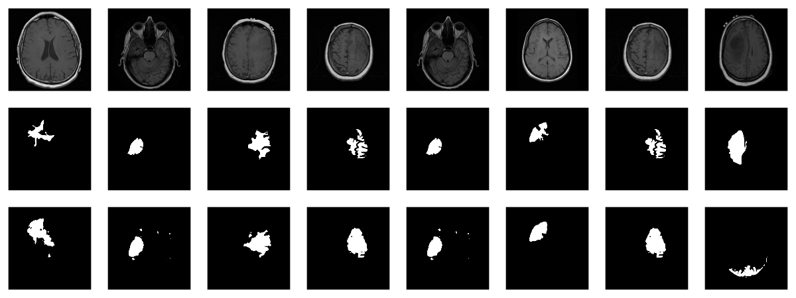

```{r setup, include=FALSE}
knitr::opts_chunk$set(echo = TRUE, eval = FALSE)
```

## When *what* is not enough

True, sometimes it's vital to distinguish between different kinds of objects. Is that a car speeding towards me, in which case I'd better jump out of the way? Or is it a huge terrier (in which case I'd probably do the same)? Often in real life though, instead of coarse-grained *classification*, what is needed is fine-grained *segmentation*.

Zooming in on images, we're not looking for a single label; instead, we want to classify every pixel according to some criterion:

-   In medicine, we may want to distinguish between different cell types, or identify tumors.

-   In various earth sciences, satellite data are used to segment terrestrial surfaces.

-   To enable use of custom backgrounds, video-conferencing software has to be able to tell foreground from background.

Image segmentation is a form of supervised learning: Some kind of ground truth is needed. Here, it comes in form of a *mask* -- an image, of spatial resolution identical to that of the input data, that designates the true class for every pixel. Accordingly, classification loss is calculated pixel-wise; losses are then summed up to yield an aggregate to be used in optimization.

The "canonical" architecture for image segmentation, around since 2015, is *U-Net.*

## U-Net

Here is the prototypical U-Net, as depicted in the original Rönneberger et al. paper [@RonnebergerFB15].

Of this architecture, numerous variants exist; you could use different layer sizes, activations, ways to achieve downsizing and upsizing, and more. However, there is one defining characteristic: The U-shape, stabilized by the "bridges" crossing over horizontally at all levels.

.")

In a nutshell, the left-hand side of the U resembles the convolutional architectures used in image classification: It successively reduces spatial resolution. At the same time, another dimension -- the *channels* dimension -- is used to build up a hierarchy of features, ranging from very basic to very specialized.

Unlike in classification, however, the output should have the same spatial resolution as the input. Thus, we need to upsize again -- this is taken care of by the right-hand side of the U. But: How are we going to arrive at a good *per-pixel* classification, now that so much spatial information has been lost?

This is what the "bridges" are for: At each level, the input to an upsampling layer is a *concatenation* of the previous layer's output -- which went through the whole compression/decompression routine -- and some preserved intermediate representation from the downsizing phase. In this way, a U-Net architecture combines attention to detail with feature extraction.

## Brain image segmentation

With U-Net, domain applicability is as broad as the architecture is flexible. Here, we want to detect abnormalities in brain scans. The dataset, used in @BUDA2019218, contains MR images together with manually created [FLAIR](https://en.wikipedia.org/wiki/Fluid-attenuated_inversion_recovery) abnormality segmentation masks. It is available on [Kaggle](https://www.kaggle.com/mateuszbuda/lgg-mri-segmentation).

Nicely, the paper is accompanied by a [GitHub repository](https://github.com/mateuszbuda/brain-segmentation-pytorch). Below, we closely follow (though not exactly replicate) the authors' preprocessing and data augmentation code.

As is often the case in medical imaging, there is notable class imbalance in the data. For every patient, sections have been taken at multiple positions. (Number of sections per patient varies.) Most sections do not exhibit any lesions; the corresponding masks are colored black everywhere.

Here are three examples where the masks *do* indicate abnormalities:


Let's see if we can build a U-Net that generates such masks for us.

## Data

Before you start typing, here is a [Colaboratory notebook](https://colab.research.google.com/drive/1gcPOlF4jff42yiquRbbCxnRANEqPpGMD?usp=sharing) to conveniently follow along.

We use `pins` to obtain the data. Please see [this introduction](https://pins.rstudio.com/articles/boards-kaggle.html) if you haven't been using that package before.

```{r}
library(torch)
library(torchvision)
library(tidyverse)
library(magick)
library(zeallot)
library(cowplot)
library(zip)
library(pins)

torch_manual_seed(777)
set.seed(777)

# use your own kaggle.json here
pins::board_register_kaggle(token = "~/kaggle.json")

files <- pins::pin_get("mateuszbuda/lgg-mri-segmentation", board = "kaggle",  extract = FALSE)


```

The dataset is not that big -- it includes scans from 110 different patients --, so we'll have to do with just a training and a validation set. (Don't do this in real life, as you'll inevitably end up fine-tuning on the latter.)

```{r}
train_dir <- "data/mri_train"
valid_dir <- "data/mri_valid"

if(dir.exists(train_dir)) unlink(train_dir, recursive = TRUE, force = TRUE)
if(dir.exists(valid_dir)) unlink(valid_dir, recursive = TRUE, force = TRUE)

zip::unzip(files, exdir = "data")

file.rename("data/kaggle_3m", train_dir)

# this is a duplicate, again containing kaggle_3m (evidently a packaging error on Kaggle)
# we just remove it
unlink("data/lgg-mri-segmentation", recursive = TRUE)

dir.create(valid_dir)

```

Of those 110 patients, we keep 30 for validation. Some more file manipulations, and we're set up with a nice hierarchical structure, with each of `train_dir` and `valid_dir` holding their per-patient sub-directories, respectively.

```{r}
valid_indices <- sample(1:length(patients), 30)

patients <- list.dirs(train_dir, recursive = FALSE)

for (i in valid_indices) {
  dir.create(file.path(valid_dir, basename(patients[i])))
  for (f in list.files(patients[i])) {    
    file.rename(file.path(train_dir, basename(patients[i]), f), file.path(valid_dir, basename(patients[i]), f))    
  }
  unlink(file.path(train_dir, basename(patients[i])), recursive = TRUE)
}

```

We now need a `dataset` that knows what to do with these files.

## Dataset

Like every `torch` dataset, this one has `initialize()` and `.getitem()` methods. `initialize()` creates an inventory of scan and mask file names, to be used by `.getitem()` when it actually reads those files. In contrast to what we've seen in previous posts, though , `.getitem()` does not simply return input-target pairs in order. Instead, whenever the parameter `random_sampling` is true, it will perform weighted sampling, preferring items with sizable lesions. This option will be used for the training set, to counter the class imbalance mentioned above.

The other way training and validation sets will differ is use of data augmentation. Training images/masks may be flipped, re-sized, and rotated; probabilities and amounts are configurable.

An instance of `brainseg_dataset` encapsulates all this functionality:

```{r}
brainseg_dataset <- dataset(
  name = "brainseg_dataset",
  
  initialize = function(img_dir,
                        augmentation_params = NULL,
                        random_sampling = FALSE) {
    self$images <- tibble(
      img = grep(
        list.files(
          img_dir,
          full.names = TRUE,
          pattern = "tif",
          recursive = TRUE
        ),
        pattern = 'mask',
        invert = TRUE,
        value = TRUE
      ),
      mask = grep(
        list.files(
          img_dir,
          full.names = TRUE,
          pattern = "tif",
          recursive = TRUE
        ),
        pattern = 'mask',
        value = TRUE
      )
    )
    self$slice_weights <- self$calc_slice_weights(self$images$mask)
    self$augmentation_params <- augmentation_params
    self$random_sampling <- random_sampling
  },
  
  .getitem = function(i) {
    index <-
      if (self$random_sampling == TRUE)
        sample(1:self$.length(), 1, prob = self$slice_weights)
    else
      i
    
    img <- self$images$img[index] %>%
      image_read() %>%
      transform_to_tensor() 
    mask <- self$images$mask[index] %>%
      image_read() %>%
      transform_to_tensor() %>%
      transform_rgb_to_grayscale() %>%
      torch_unsqueeze(1)
    
    img <- self$min_max_scale(img)
    
    if (!is.null(self$augmentation_params)) {
      scale_param <- self$augmentation_params[1]
      c(img, mask) %<-% self$resize(img, mask, scale_param)
      
      rot_param <- self$augmentation_params[2]
      c(img, mask) %<-% self$rotate(img, mask, rot_param)
      
      flip_param <- self$augmentation_params[3]
      c(img, mask) %<-% self$flip(img, mask, flip_param)
      
    }
    list(img = img, mask = mask)
  },
  
  .length = function() {
    nrow(self$images)
  },
  
  calc_slice_weights = function(masks) {
    weights <- map_dbl(masks, function(m) {
      img <-
        as.integer(magick::image_data(image_read(m), channels = "gray"))
      sum(img / 255)
    })
    
    sum_weights <- sum(weights)
    num_weights <- length(weights)
    
    weights <- weights %>% map_dbl(function(w) {
      w <- (w + sum_weights * 0.1 / num_weights) / (sum_weights * 1.1)
    })
    weights
  },
  
  min_max_scale = function(x) {
    min = x$min()$item()
    max = x$max()$item()
    x$clamp_(min = min, max = max)
    x$add_(-min)$div_(max - min + 1e-5)
    x
  },
  
  resize = function(img, mask, scale_param) {
    img_size <- dim(img)[2]
    rnd_scale <- runif(1, 1 - scale_param, 1 + scale_param)
    img <- transform_resize(img, size = rnd_scale * img_size)
    mask <- transform_resize(mask, size = rnd_scale * img_size)
    diff <- dim(img)[2] - img_size
    if (diff > 0) {
      top <- ceiling(diff / 2)
      left <- ceiling(diff / 2)
      img <- transform_crop(img, top, left, img_size, img_size)
      mask <- transform_crop(mask, top, left, img_size, img_size)
    } else {
      img <- transform_pad(img,
                           padding = -c(
                             ceiling(diff / 2),
                             floor(diff / 2),
                             ceiling(diff / 2),
                             floor(diff / 2)
                           ))
      mask <- transform_pad(mask, padding = -c(
        ceiling(diff / 2),
        floor(diff /
                2),
        ceiling(diff /
                  2),
        floor(diff /
                2)
      ))
    }
    list(img, mask)
  },
  
  rotate = function(img, mask, rot_param) {
    rnd_rot <- runif(1, 1 - rot_param, 1 + rot_param)
    img <- transform_rotate(img, angle = rnd_rot)
    mask <- transform_rotate(mask, angle = rnd_rot)
    
    list(img, mask)
  },
  
  flip = function(img, mask, flip_param) {
    rnd_flip <- runif(1)
    if (rnd_flip > flip_param) {
      img <- transform_hflip(img)
      mask <- transform_hflip(mask)
    }
    
    list(img, mask)
  }
)

```

After instantiation, we see we have 2977 training pairs and 952 validation pairs, respectively:

```{r}
train_ds <- brainseg_dataset(
  train_dir,
  augmentation_params = c(0.05, 15, 0.5),
  random_sampling = TRUE
)

length(train_ds)
# 2977

valid_ds <- brainseg_dataset(
  valid_dir,
  augmentation_params = NULL,
  random_sampling = FALSE
)

length(valid_ds)
# 952
```

As a correctness check, let's plot an image and associated mask:

```{r}
par(mfrow = c(1, 2), mar = c(0, 1, 0, 1))

img_and_mask <- valid_ds[27]
img <- img_and_mask[[1]]
mask <- img_and_mask[[2]]

img$permute(c(2, 3, 1)) %>% as.array() %>% as.raster() %>% plot()
mask$squeeze() %>% as.array() %>% as.raster() %>% plot()
```

```{r, eval = TRUE, echo = FALSE, layout="l-body-outset"}
knitr::include_graphics("images/scan_and_mask.png")
```

With `torch`, it is straightforward to inspect what happens when you change augmentation-related parameters. We just pick a pair from the validation set, which has not had any augmentation applied as yet, and call `valid_ds$<augmentation_func()>` directly. Just for fun, let's use more "extreme" parameters here than we do in actual training. (Actual training uses the settings from Mateusz' GitHub repository, which we assume have been carefully chosen for optimal performance.[^1])

[^1]: Yes, we did a few experiments, confirming that more augmentation isn't better ... what did I say about inevitably ending up doing optimization on the validation set ...

```{r}
img_and_mask <- valid_ds[77]
img <- img_and_mask[[1]]
mask <- img_and_mask[[2]]

imgs <- map (1:24, function(i) {
  
  # scale factor; train_ds really uses 0.05
  c(img, mask) %<-% valid_ds$resize(img, mask, 0.2) 
  c(img, mask) %<-% valid_ds$flip(img, mask, 0.5)
  # rotation angle; train_ds really uses 15
  c(img, mask) %<-% valid_ds$rotate(img, mask, 90) 
  img %>%
    transform_rgb_to_grayscale() %>%
    as.array() %>%
    as_tibble() %>%
    rowid_to_column(var = "Y") %>%
    gather(key = "X", value = "value", -Y) %>%
    mutate(X = as.numeric(gsub("V", "", X))) %>%
    ggplot(aes(X, Y, fill = value)) +
    geom_raster() +
    theme_void() +
    theme(legend.position = "none") +
    theme(aspect.ratio = 1)
  
})

plot_grid(plotlist = imgs, nrow = 4)
```

```{r, eval = TRUE, echo = FALSE, layout="l-body-outset"}
knitr::include_graphics("images/brainseg_augmentation.png")
```

Now we still need the data loaders, and then, nothing keeps us from proceeding to the next big task: building the model.

```{r}
batch_size <- 4
train_dl <- dataloader(train_ds, batch_size)
valid_dl <- dataloader(valid_ds, batch_size)

```

## Model

Our model nicely illustrates the kind of modular code that comes "naturally" with `torch`. We approach things top-down, starting with the U-Net container itself.

`unet` takes care of the global composition -- how far "down" do we go, shrinking the image while incrementing the number of filters, and then how do we go "up" again?

Importantly, it is also the system's memory: In `forward()`, it keeps track of layer outputs seen going "down", to be added back in going "up".

```{r}
unet <- nn_module(
  "unet",
  
  initialize = function(channels_in = 3,
                        n_classes = 1,
                        depth = 5,
                        n_filters = 6) {
    
    self$down_path <- nn_module_list()
    
    prev_channels <- channels_in
    for (i in 1:depth) {
      self$down_path$append(down_block(prev_channels, 2 ^ (n_filters + i - 1)))
      prev_channels <- 2 ^ (n_filters + i -1)
    }
    
    self$up_path <- nn_module_list()
    
    for (i in ((depth - 1):1)) {
      self$up_path$append(up_block(prev_channels, 2 ^ (n_filters + i - 1)))
      prev_channels <- 2 ^ (n_filters + i - 1)
    }
    
    self$last = nn_conv2d(prev_channels, n_classes, kernel_size = 1)
  },
  
  forward = function(x) {
    
    blocks <- list()
    
    for (i in 1:length(self$down_path)) {
      x <- self$down_path[[i]](x)
      if (i != length(self$down_path)) {
        blocks <- c(blocks, x)
        x <- nnf_max_pool2d(x, 2)
      }
    }
    
    for (i in 1:length(self$up_path)) {  
      x <- self$up_path[[i]](x, blocks[[length(blocks) - i + 1]]$to(device = device))
    }
    
    torch_sigmoid(self$last(x))
  }
)
```

`unet` delegates to two containers just below it in the hierarchy: `down_block` and `up_block`. While `down_block` is "just" there for aesthetic reasons (it immediately delegates to its own workhorse, `conv_block`), in `up_block` we see the U-Net "bridges" in action.

```{r}
down_block <- nn_module(
  "down_block",
  
  initialize = function(in_size, out_size) {
    self$conv_block <- conv_block(in_size, out_size)
  },
  
  forward = function(x) {
    self$conv_block(x)
  }
)

up_block <- nn_module(
  "up_block",
  
  initialize = function(in_size, out_size) {
    
    self$up = nn_conv_transpose2d(in_size,
                                  out_size,
                                  kernel_size = 2,
                                  stride = 2)
    self$conv_block = conv_block(in_size, out_size)
  },
  
  forward = function(x, bridge) {
    
    up <- self$up(x)
    torch_cat(list(up, bridge), 2) %>%
      self$conv_block()
  }
)

```

Finally, a `conv_block` is a sequential structure containing convolutional, ReLU, and dropout layers.

```{r}
conv_block <- nn_module( 
  "conv_block",
  
  initialize = function(in_size, out_size) {
    
    self$conv_block <- nn_sequential(
      nn_conv2d(in_size, out_size, kernel_size = 3, padding = 1),
      nn_relu(),
      nn_dropout(0.6),
      nn_conv2d(out_size, out_size, kernel_size = 3, padding = 1),
      nn_relu()
    )
  },
  
  forward = function(x){
    self$conv_block(x)
  }
)
```

Now instantiate the model, and possibly, move it to the GPU:

```{r}
device <- torch_device(if(cuda_is_available()) "cuda" else "cpu")
model <- unet(depth = 5)$to(device = device)
```

## Optimization

We train our model with a combination of cross entropy and [dice loss](https://en.wikipedia.org/wiki/S%C3%B8rensen%E2%80%93Dice_coefficient).

The latter, though not shipped with `torch`, may straightforwardly be implemented manually:

```{r}
calc_dice_loss <- function(y_pred, y_true) {
  
  smooth <- 1
  y_pred <- y_pred$view(-1)
  y_true <- y_true$view(-1)
  intersection <- (y_pred * y_true)$sum()
  
  1 - ((2 * intersection + smooth) / (y_pred$sum() + y_true$sum() + smooth))
}

dice_weight <- 0.3
```

Optimization uses stochastic gradient descent (SGD), together with the one-cycle learning rate scheduler introduced in the context of [image classification with torch](https://blogs.rstudio.com/ai/posts/2020-10-19-torch-image-classification/).

```{r}
optimizer <- optim_sgd(model$parameters, lr = 0.1, momentum = 0.9)

num_epochs <- 20

scheduler <- lr_one_cycle(
  optimizer,
  max_lr = 0.1,
  steps_per_epoch = length(train_dl),
  epochs = num_epochs
)
```

## Training

The training loop then follows the usual scheme. One thing to note: Every epoch, we save the model (using `torch_save()`), so we can later pick the best one, should performance have degraded thereafter.

```{r}
train_batch <- function(b) {
  
  optimizer$zero_grad()
  output <- model(b[[1]]$to(device = device))
  target <- b[[2]]$to(device = device)
  
  bce_loss <- nnf_binary_cross_entropy(output, target)
  dice_loss <- calc_dice_loss(output, target)
  loss <-  dice_weight * dice_loss + (1 - dice_weight) * bce_loss
  
  loss$backward()
  optimizer$step()
  scheduler$step()

  list(bce_loss$item(), dice_loss$item(), loss$item())
  
}

valid_batch <- function(b) {
  
  output <- model(b[[1]]$to(device = device))
  target <- b[[2]]$to(device = device)

  bce_loss <- nnf_binary_cross_entropy(output, target)
  dice_loss <- calc_dice_loss(output, target)
  loss <-  dice_weight * dice_loss + (1 - dice_weight) * bce_loss
  
  list(bce_loss$item(), dice_loss$item(), loss$item())
  
}

for (epoch in 1:num_epochs) {
  
  model$train()
  train_bce <- c()
  train_dice <- c()
  train_loss <- c()
  
  for (b in enumerate(train_dl)) {
    c(bce_loss, dice_loss, loss) %<-% train_batch(b)
    train_bce <- c(train_bce, bce_loss)
    train_dice <- c(train_dice, dice_loss)
    train_loss <- c(train_loss, loss)
  }
  
  torch_save(model, paste0("model_", epoch, ".pt"))
  
  cat(sprintf("\nEpoch %d, training: loss:%3f, bce: %3f, dice: %3f\n",
              epoch, mean(train_loss), mean(train_bce), mean(train_dice)))
  
  model$eval()
  valid_bce <- c()
  valid_dice <- c()
  valid_loss <- c()
  
  i <- 0
  for (b in enumerate(valid_dl)) {
    
    i <<- i + 1
    c(bce_loss, dice_loss, loss) %<-% valid_batch(b)
    valid_bce <- c(valid_bce, bce_loss)
    valid_dice <- c(valid_dice, dice_loss)
    valid_loss <- c(valid_loss, loss)
    
  }
  
  cat(sprintf("\nEpoch %d, validation: loss:%3f, bce: %3f, dice: %3f\n",
              epoch, mean(valid_loss), mean(valid_bce), mean(valid_dice)))
}

```

    Epoch 1, training: loss:0.304232, bce: 0.148578, dice: 0.667423
    Epoch 1, validation: loss:0.333961, bce: 0.127171, dice: 0.816471

    Epoch 2, training: loss:0.194665, bce: 0.101973, dice: 0.410945
    Epoch 2, validation: loss:0.341121, bce: 0.117465, dice: 0.862983

    [...]

    Epoch 19, training: loss:0.073863, bce: 0.038559, dice: 0.156236
    Epoch 19, validation: loss:0.302878, bce: 0.109721, dice: 0.753577

    Epoch 20, training: loss:0.070621, bce: 0.036578, dice: 0.150055
    Epoch 20, validation: loss:0.295852, bce: 0.101750, dice: 0.748757

## Evaluation

In this run, it is the final model that performs best on the validation set. Still, we'd like to show how to load a saved model, using `torch_load()` .

Once loaded, put the model into `eval` mode:

```{r}
saved_model <- torch_load("model_20.pt") 

model <- saved_model
model$eval()

```

Now, since we don't have a separate test set, we already know the average out-of-sample metrics; but in the end, what we care about are the generated masks. Let's view some, displaying ground truth and MRI scans for comparison.

```{r}
# without random sampling, we'd mainly see lesion-free patches
eval_ds <- brainseg_dataset(valid_dir, augmentation_params = NULL, random_sampling = TRUE)
eval_dl <- dataloader(eval_ds, batch_size = 8)

batch <- eval_dl %>% dataloader_make_iter() %>% dataloader_next()

par(mfcol = c(3, 8), mar = c(0, 1, 0, 1))

for (i in 1:8) {
  
  img <- batch[[1]][i, .., drop = FALSE]
  inferred_mask <- model(img$to(device = device))
  true_mask <- batch[[2]][i, .., drop = FALSE]$to(device = device)
  
  bce <- nnf_binary_cross_entropy(inferred_mask, true_mask)$to(device = "cpu") %>%
    as.numeric()
  dc <- calc_dice_loss(inferred_mask, true_mask)$to(device = "cpu") %>% as.numeric()
  cat(sprintf("\nSample %d, bce: %3f, dice: %3f\n", i, bce, dc))
  

  inferred_mask <- inferred_mask$to(device = "cpu") %>% as.array() %>% .[1, 1, , ]
  
  inferred_mask <- ifelse(inferred_mask > 0.5, 1, 0)
  
  img[1, 1, ,] %>% as.array() %>% as.raster() %>% plot()
  true_mask$to(device = "cpu")[1, 1, ,] %>% as.array() %>% as.raster() %>% plot()
  inferred_mask %>% as.raster() %>% plot()
}
```

We also print the individual cross entropy and dice losses; relating those to the generated masks might yield useful information for model tuning.

    Sample 1, bce: 0.088406, dice: 0.387786}

    Sample 2, bce: 0.026839, dice: 0.205724

    Sample 3, bce: 0.042575, dice: 0.187884

    Sample 4, bce: 0.094989, dice: 0.273895

    Sample 5, bce: 0.026839, dice: 0.205724

    Sample 6, bce: 0.020917, dice: 0.139484

    Sample 7, bce: 0.094989, dice: 0.273895

    Sample 8, bce: 2.310956, dice: 0.999824

```{r, eval = TRUE, echo = FALSE, layout="l-body-outset"}

```

While far from perfect, most of these masks aren't that bad -- a nice result given the small dataset!

## Wrapup

This has been our most complex `torch` post so far; however, we hope you've found the time well spent. For one, among applications of deep learning, medical image segmentation stands out as highly societally useful. Secondly, U-Net-like architectures are employed in many other areas. And finally, we once more saw `torch`'s flexibility and intuitive behavior in action.

Thanks for reading!
