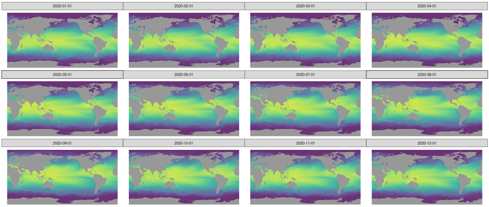

```{r setup, include=FALSE}
knitr::opts_chunk$set(echo = TRUE, eval = FALSE)
```

Today, we use the convLSTM introduced in a [previous](https://blogs.rstudio.com/ai/posts/2020-12-17-torch-convlstm/) post to predict [El Niño-Southern Oscillation (ENSO).](https://en.wikipedia.org/wiki/El_Ni%C3%B1o%E2%80%93Southern_Oscillation)

# El Niño, la Niña

ENSO refers to a changing pattern of sea surface temperatures and sea-level pressures occurring in the equatorial Pacific. From its three overall states, probably the best-known is El Niño. El Niño occurs when surface water temperatures in the eastern Pacific are higher than normal, and the strong winds that normally blow from east to west are unusually weak. The opposite conditions are termed La Niña. Everything in-between is classified as normal.

ENSO has great impact on the weather worldwide, and routinely harms ecosystems and societies through storms, droughts and flooding, possibly resulting in famines and economic crises. The best societies can do is try to adapt and mitigate severe consequences. Such efforts are aided by accurate forecasts, the further ahead the better.

Here, deep learning (DL) can potentially help: Variables like sea surface temperatures and pressures are given on a spatial grid -- that of the earth -- and as we know, DL is good at extracting spatial (e.g., image) features. For ENSO prediction, architectures like convolutional neural networks (@2019Natur) or convolutional-recurrent hybrids[^1] are habitually used. One such hybrid is just our convLSTM; it operates on sequences of features given on a spatial grid. Today, thus, we'll be training a model for ENSO forecasting. This model will have a convLSTM for its central ingredient.

[^1]: E.g., [Forecasting El Niño with Convolutional and Recurrent Neural Networks](https://www.climatechange.ai/papers/neurips2019/40/paper.pdf).

Before we start, a note. While our model fits well with architectures described in the relevant papers, the same cannot be said for amount of training data used. For reasons of practicality, we use actual observations only; consequently, we end up with a small (relative to the task) dataset. In contrast, research papers tend to make use of climate simulations[^2], resulting in significantly more data to work with.

[^2]: E.g., [CMIP5](https://esgf-node.llnl.gov/projects/cmip5/), [CNRM-CM5](http://www.umr-cnrm.fr/spip.php?article126&lang=en), or [HADGEM2-ES](https://southernocean.arizona.edu/content/hadgem2-es).

From the outset, then, we don't expect stellar performance. Nevertheless, this should make for an interesting case study, and a useful code template for our readers to apply to their own data.

# Data

We will attempt to predict monthly average sea surface temperature in the Niño 3.4 region[^3], as represented by the Niño 3.4 Index, plus categorization as one of *El Niño*, *La Niña* or *neutral*[^4]. Predictions will be based on prior monthly sea surface temperatures spanning a large portion of the globe.

[^3]: This region extends over latitudes from 5° south to 5° north and longitudes from 120° west to 170° west.

[^4]: That classification is based on ONI (Oceanic Niño Index), a measure representing 3-month average anomalies in the Niño 3.4 Index.

On the input side, public and ready-to-use data may be downloaded from [Tokyo Climate Center](https://ds.data.jma.go.jp/tcc/tcc/index.html); as to prediction targets, we obtain index and classification [here](https://bmcnoldy.rsmas.miami.edu/tropics/oni/).

Input and target data both are provided monthly. They intersect in the time period ranging from 1891-01-01 to 2020-08-01; so this is the range of dates we'll be zooming in on.

## Input: Sea Surface Temperatures

Monthly sea surface temperatures are provided in a latitude-longitude grid of resolution 1°. Details of how the data were processed are available [here](https://ds.data.jma.go.jp/tcc/tcc/library/MRCS_SV12/explanation/cobe_sst_e.htm).

Data files are available in [GRIB](https://en.wikipedia.org/wiki/GRIB) format; each file contains averages computed for a single month. We can either download individual files or [generate a text file of URLs](https://ds.data.jma.go.jp/tcc/tcc/products/elnino/cobesst/cobe-sst.html) for download. In case you'd like to follow along with the post, you'll find the contents of the text file I generated in the appendix. Once you've saved these URLs to a file, you can have R get the files for you like so:

```{r}
purrr::walk(
   readLines("files"),
   function(f) download.file(url = f, destfile = basename(f))
)
```

From R, we can read GRIB files using [stars](https://cran.r-project.org/web/packages/stars/). For example:

```{r}
# let's just quickly load all libraries we require to start with

library(torch)
library(tidyverse)
library(stars)
library(viridis)
library(ggthemes)

torch_manual_seed(777)

read_stars(file.path(grb_dir, "sst189101.grb"))
```

    stars object with 2 dimensions and 1 attribute
    attribute(s):
     sst189101.grb   
     Min.   :-274.9  
     1st Qu.:-272.8  
     Median :-259.1  
     Mean   :-260.0  
     3rd Qu.:-248.4  
     Max.   :-242.8  
     NA's   :21001   
    dimension(s):
      from  to offset delta                       refsys point values    
    x    1 360      0     1 Coordinate System importe...    NA   NULL [x]
    y    1 180     90    -1 Coordinate System importe...    NA   NULL [y]

So in this GRIB file, we have one attribute - which we know to be sea surface temperature -- on a two-dimensional grid. As to the latter, we can complement what `stars` tells us with additional info found in the [documentation](https://ds.data.jma.go.jp/tcc/tcc/library/MRCS_SV12/explanation/cobe_sst_e.htm):

> The east-west grid points run eastward from 0.5ºE to 0.5ºW, while the north-south grid points run northward from 89.5ºS to 89.5ºN.

We note a few things we'll want to do with this data. For one, the temperatures seem to be given in Kelvin, but with minus signs.[^5] We'll remove the minus signs and convert to degrees Celsius for convenience. We'll also have to think about what to do with the `NA`s that appear for all non-maritime coordinates.

[^5]: This may also be an artifact produced by the software stack involved in reading the file.

Before we get there though, we need to combine data from all files into a single data frame. This adds an additional dimension, time, ranging from 1891/01/01 to 2020/01/12:

```{r}
grb <- read_stars(
  file.path(grb_dir, map(readLines("files", warn = FALSE), basename)), along = "time") %>%
  st_set_dimensions(3,
                    values = seq(as.Date("1891-01-01"), as.Date("2020-12-01"), by = "months"),
                    names = "time"
                    )

grb
```

    stars object with 3 dimensions and 1 attribute
    attribute(s), summary of first 1e+05 cells:
     sst189101.grb   
     Min.   :-274.9  
     1st Qu.:-273.3  
     Median :-258.8  
     Mean   :-260.0  
     3rd Qu.:-247.8  
     Max.   :-242.8  
     NA's   :33724   
    dimension(s):
         from   to offset delta                       refsys point                    values    
    x       1  360      0     1 Coordinate System importe...    NA                      NULL [x]
    y       1  180     90    -1 Coordinate System importe...    NA                      NULL [y]
    time    1 1560     NA    NA                         Date    NA 1891-01-01,...,2020-12-01    

Let's visually inspect the spatial distribution of monthly temperatures for one year, 2020:

```{r}
ggplot() +
  geom_stars(data = grb %>% filter(between(time, as.Date("2020-01-01"), as.Date("2020-12-01"))), alpha = 0.8) +
  facet_wrap("time") +
  scale_fill_viridis() +
  coord_equal() +
  theme_map() +
  theme(legend.position = "none") 
```

```{r, eval = TRUE, echo = FALSE, layout="l-body-outset", fig.cap="Monthly sea surface temperatures, 2020/01/01 - 2020/01/12."}

```

## Target: Niño 3.4 Index

For the Niño 3.4 Index, we download the monthly [data](https://bmcnoldy.rsmas.miami.edu/tropics/oni/ONI_NINO34_1854-2020.txt) and, among the provided features, zoom in on two: the index itself (column `NINO34_MEAN`) and `PHASE`, which can be `E` (El Niño), `L` (La Niño) or `N` (neutral).

```{r}
nino <- read_table2("ONI_NINO34_1854-2020.txt", skip = 9) %>%
  mutate(month = as.Date(paste0(YEAR, "-", `MON/MMM`, "-01"))) %>%
  select(month, NINO34_MEAN, PHASE) %>%
  filter(between(month, as.Date("1891-01-01"), as.Date("2020-08-01"))) %>%
  mutate(phase_code = as.numeric(as.factor(PHASE)))

nrow(nino)

```

    1556

Next, we look at how to get the data into a format convenient for training and prediction.

# Preprocessing

## Input

First, we remove all input data for points in time where ground truth data are still missing.

```{r}
sst <- grb %>% filter(time <= as.Date("2020-08-01"))
```

Next, as is done by e.g. @dlenso, we only use grid points between 55° south and 60° north. This has the additional advantage of reducing memory requirements.

```{r}
sst <- grb %>% filter(between(y,-55, 60))

dim(sst)
```

    360, 115, 1560

As already alluded to, with the little data we have we can't expect much in terms of generalization. Still, we set aside a small portion of the data for validation, since we'd like for this post to serve as a useful template to be used with bigger datasets.

```{r}
sst_train <- sst %>% filter(time < as.Date("1990-01-01"))
sst_valid <- sst %>% filter(time >= as.Date("1990-01-01"))
```

From here on, we work with R arrays.

```{r}
sst_train <- as.tbl_cube.stars(sst_train)$mets[[1]]
sst_valid <- as.tbl_cube.stars(sst_valid)$mets[[1]]

```

Conversion to degrees Celsius is not strictly necessary, as initial experiments showed a slight performance increase due to normalizing the input, and we're going to do that anyway. Still, it reads nicer to humans than Kelvin.

```{r}
sst_train <- sst_train + 273.15
quantile(sst_train, na.rm = TRUE)
```

         0%     25%     50%     75%    100% 
    -1.8000 12.9975 21.8775 26.8200 34.3700 

Not at all surprisingly, global warming is evident from inspecting temperature distribution on the validation set (which was chosen to span the last thirty-one years).

```{r}
sst_valid <- sst_valid + 273.15
quantile(sst_valid, na.rm = TRUE)
```

        0%    25%    50%    75%   100% 
    -1.800 13.425 22.335 27.240 34.870 

The next-to-last step normalizes both sets according to training mean and variance.

```{r}
train_mean <- mean(sst_train, na.rm = TRUE)
train_sd <- sd(sst_train, na.rm = TRUE)

sst_train <- (sst_train - train_mean) / train_sd

sst_valid <- (sst_valid - train_mean) / train_sd

```

Finally, what should we do about the `NA` entries? We set them to zero, the (training set) mean. That may not be enough of an action though: It means we're feeding the network roughly 30% misleading data. This is something we're not done with yet.

```{r}
sst_train[is.na(sst_train)] <- 0
sst_valid[is.na(sst_valid)] <- 0
```

## Target

The target data are split analogously. Let's check though: Are phases (categorizations) distributedly similarly in both sets?

```{r}
nino_train <- nino %>% filter(month < as.Date("1990-01-01"))
nino_valid <- nino %>% filter(month >= as.Date("1990-01-01"))

nino_train %>% group_by(phase_code, PHASE) %>% summarise(count = n(), avg = mean(NINO34_MEAN))

```

    # A tibble: 3 x 4
    # Groups:   phase_code [3]
      phase_code PHASE count   avg
           <dbl> <chr> <int> <dbl>
    1          1 E       301  27.7
    2          2 L       333  25.6
    3          3 N       554  26.7

```{r}
nino_valid %>% group_by(phase_code, PHASE) %>% summarise(count = n(), avg = mean(NINO34_MEAN))
```

    # A tibble: 3 x 4
    # Groups:   phase_code [3]
      phase_code PHASE count   avg
           <dbl> <chr> <int> <dbl>
    1          1 E        93  28.1
    2          2 L        93  25.9
    3          3 N       182  27.2

This doesn't look too bad. Of course, we again see the overall rise in temperature, irrespective of phase.

Lastly, we normalize the index, same as we did for the input data.

```{r}
train_mean_nino <- mean(nino_train$NINO34_MEAN)
train_sd_nino <- sd(nino_train$NINO34_MEAN)

nino_train <- nino_train %>% mutate(NINO34_MEAN = scale(NINO34_MEAN, center = train_mean_nino, scale = train_sd_nino))
nino_valid <- nino_valid %>% mutate(NINO34_MEAN = scale(NINO34_MEAN, center = train_mean_nino, scale = train_sd_nino))
```

On to the `torch` dataset.

# `Torch` dataset

The dataset is responsible for correctly matching up inputs and targets.

Our goal is to take six months of global sea surface temperatures and predict the Niño 3.4 Index for the following month. Input-wise, the model will expect the following format semantics:

`batch_size * timesteps * width * height * channels`, where

-   `batch_size` is the number of observations worked on in one round of computations,

-   `timesteps` chains consecutive observations from adjacent months,

-   `width` and `height` together constitute the spatial grid, and

-   `channels` corresponds to available visual channels in the "image".

In `.getitem()`, we select the consecutive observations, starting at a given index, and stack them in dimension one. (One, not two, as batches will only start to exist once the `dataloader` comes into play.)

Now, what about the target? Our ultimate goal was -- is -- predicting the Niño 3.4 Index. However, as you see we define three targets: One is the index, as expected; an additional one holds the spatially-gridded sea surface temperatures for the prediction month. Why? Our main instrument, the most prominent constituent of the model, will be a convLSTM, an architecture designed for *spatial* prediction. Thus, to train it efficiently, we want to give it the opportunity to predict values on a spatial grid. So far so good; but there's one more target, the phase/category. This was added for experimentation purposes: Maybe predicting *both* index *and* phase helps in training?

Finally, here is the code for the dataset. In our experiments, we based predictions on inputs from the preceding six months (`n_timesteps <- 6`). This is a parameter you might want to play with, though.

```{r}
n_timesteps <- 6

enso_dataset <- dataset(
  name = "enso_dataset",
  
  initialize = function(sst, nino, n_timesteps) {
    self$sst <- sst
    self$nino <- nino
    self$n_timesteps <- n_timesteps
  },
  
  .getitem = function(i) {
    x <- torch_tensor(self$sst[, , i:(n_timesteps + i - 1)]) # (360, 115, n_timesteps)
    x <- x$permute(c(3,1,2))$unsqueeze(2) # (n_timesteps, 1, 360, 115))
    
    y1 <- torch_tensor(self$sst[, , n_timesteps + i])$unsqueeze(1) # (1, 360, 115)
    y2 <- torch_tensor(self$nino$NINO34_MEAN[n_timesteps + i])
    y3 <- torch_tensor(self$nino$phase_code[n_timesteps + i])$squeeze()$to(torch_long())
    list(x = x, y1 = y1, y2 = y2, y3 = y3)
  },
  
  .length = function() {
    nrow(self$nino) - n_timesteps
  }
  
)

valid_ds <- enso_dataset(sst_valid, nino_valid, n_timesteps)
```

# Dataloaders

After the custom dataset, we create the -- pretty typical -- `dataloader`s, making use of a batch size of 4.

```{r}
batch_size <- 4

train_dl <- train_ds %>% dataloader(batch_size = batch_size, shuffle = TRUE)

valid_dl <- valid_ds %>% dataloader(batch_size = batch_size)

```

Next, we proceed to model creation.

# Model

The model's main ingredient is the convLSTM introduced in a [prior post](https://blogs.rstudio.com/ai/posts/2020-12-17-torch-convlstm/). For convenience, we reproduce the code in the appendix.

Besides the convLSTM, the model makes use of three convolutional layers, a batchnorm layer and five linear layers. The logic is the following.

First, the convLSTM job is to predict the next month's sea surface temperatures on the spatial grid. For that, we *almost* just return its final state, - almost: We use `self$conv1` to reduce the number channels to one.

For predicting index and phase, we then need to flatten the grid, as we require a single value each. This is where the additional conv layers come in. We *do* hope they'll aid in learning, but we also want to reduce the number of parameters a bit, downsizing the grid (`strides = 2` and `strides = 3`, resp.) a bit before the upcoming `torch_flatten()`.

Once we have a flat structure, learning is shared between the tasks of index and phase prediction (`self$linear`), until finally their paths split (`self$cont` and `self$cat`, resp.), and they return their separate outputs.

(The batchnorm? I'll comment on that in the [Discussion].)

```{r}
model <- nn_module(
  
  initialize = function(channels_in,
                        convlstm_hidden,
                        convlstm_kernel,
                        convlstm_layers) {
    
    self$n_layers <- convlstm_layers
    
    self$convlstm <- convlstm(
      input_dim = channels_in,
      hidden_dims = convlstm_hidden,
      kernel_sizes = convlstm_kernel,
      n_layers = convlstm_layers
    )
    
    self$conv1 <-
      nn_conv2d(
        in_channels = 32,
        out_channels = 1,
        kernel_size = 5,
        padding = 2
      )
    
    self$conv2 <-
      nn_conv2d(
        in_channels = 32,
        out_channels = 32,
        kernel_size = 5,
        stride = 2
      )
    
    self$conv3 <-
      nn_conv2d(
        in_channels = 32,
        out_channels = 32,
        kernel_size = 5,
        stride = 3
      )
    
    self$linear <- nn_linear(33408, 64)
    
    self$b1 <- nn_batch_norm1d(num_features = 64)
        
    self$cont <- nn_linear(64, 128)
    self$cat <- nn_linear(64, 128)
    
    self$cont_output <- nn_linear(128, 1)
    self$cat_output <- nn_linear(128, 3)
    
  },
  
  forward = function(x) {
    
    ret <- self$convlstm(x)
    layer_last_states <- ret[[2]]
    last_hidden <- layer_last_states[[self$n_layers]][[1]]
    
    next_sst <- last_hidden %>% self$conv1() 
    
    c2 <- last_hidden %>% self$conv2() 
    c3 <- c2 %>% self$conv3() 
    
    flat <- torch_flatten(c3, start_dim = 2)
    common <- self$linear(flat) %>% self$b3() %>% nnf_relu()

    next_temp <- common %>% self$cont() %>% nnf_relu() %>% self$cont_output()
    next_nino <- common %>% self$cat() %>% nnf_relu() %>% self$cat_output()
    
    list(next_sst, next_temp, next_nino)
    
  }
  
)

```

Next, we instantiate a pretty small-ish model. You're more than welcome to experiment with larger models, but training time as well as GPU memory requirements will increase.

```{r}
net <- model(
  channels_in = 1,
  convlstm_hidden = c(16, 16, 32),
  convlstm_kernel = c(3, 3, 5),
  convlstm_layers = 3
)

device <- torch_device(if (cuda_is_available()) "cuda" else "cpu")

net <- net$to(device = device)
net
```

    An `nn_module` containing 2,389,605 parameters.

    ── Modules ───────────────────────────────────────────────────────────────────────────────
    ● convlstm: <nn_module> #182,080 parameters
    ● conv1: <nn_conv2d> #801 parameters
    ● conv2: <nn_conv2d> #25,632 parameters
    ● conv3: <nn_conv2d> #25,632 parameters
    ● linear: <nn_linear> #2,138,176 parameters
    ● b1: <nn_batch_norm1d> #128 parameters
    ● cont: <nn_linear> #8,320 parameters
    ● cat: <nn_linear> #8,320 parameters
    ● cont_output: <nn_linear> #129 parameters
    ● cat_output: <nn_linear> #387 parameters

# Training

We have three model outputs. How should we combine the losses?

Given that the main goal is predicting the index, and the other two outputs are essentially means to an end, I found the following combination rather effective:

    # weight for sea surface temperature prediction
    lw_sst <- 0.2

    # weight for prediction of El Nino 3.4 Index
    lw_temp <- 0.4

    # weight for phase prediction
    lw_nino <- 0.4

The training process follows the pattern seen in all `torch` posts so far: For each epoch, loop over the training set, backpropagate, check performance on validation set.

*But*, when we did the pre-processing, we were aware of an imminent problem: the missing temperatures for continental areas, which we set to zero. As a sole measure, this approach is clearly insufficient. What if we had chosen to use latitude-dependent averages? Or interpolation? Both may be better than a global average, but both have their problems as well. Let's at least alleviate negative consequences by not using the respective pixels for spatial loss calculation. This is taken care of by the following line below:

```{r}
sst_loss <- nnf_mse_loss(sst_output[sst_target != 0], sst_target[sst_target != 0])
```

Here, then, is the complete training code.

```{r}

optimizer <- optim_adam(net$parameters, lr = 0.001)

num_epochs <- 50

train_batch <- function(b) {
  
  optimizer$zero_grad()
  output <- net(b$x$to(device = device))
  
  sst_output <- output[[1]]
  sst_target <- b$y1$to(device = device)
  
  sst_loss <- nnf_mse_loss(sst_output[sst_target != 0], sst_target[sst_target != 0])
  temp_loss <- nnf_mse_loss(output[[2]], b$y2$to(device = device))
  nino_loss <- nnf_cross_entropy(output[[3]], b$y3$to(device = device))
  
  loss <- lw_sst * sst_loss + lw_temp * temp_loss + lw_nino * nino_loss
  loss$backward()
  optimizer$step()

  list(sst_loss$item(), temp_loss$item(), nino_loss$item(), loss$item())
  
}

valid_batch <- function(b) {
  
  output <- net(b$x$to(device = device))
  
  sst_output <- output[[1]]
  sst_target <- b$y1$to(device = device)
  
  sst_loss <- nnf_mse_loss(sst_output[sst_target != 0], sst_target[sst_target != 0])
  temp_loss <- nnf_mse_loss(output[[2]], b$y2$to(device = device))
  nino_loss <- nnf_cross_entropy(output[[3]], b$y3$to(device = device))
  
  loss <-
    lw_sst * sst_loss + lw_temp * temp_loss + lw_nino * nino_loss

  list(sst_loss$item(),
       temp_loss$item(),
       nino_loss$item(),
       loss$item())
}

for (epoch in 1:num_epochs) {
  
  net$train()
  
  train_loss_sst <- c()
  train_loss_temp <- c()
  train_loss_nino <- c()
  train_loss <- c()

  coro::loop(for (b in train_dl) {
    losses <- train_batch(b)
    train_loss_sst <- c(train_loss_sst, losses[[1]])
    train_loss_temp <- c(train_loss_temp, losses[[2]])
    train_loss_nino <- c(train_loss_nino, losses[[3]])
    train_loss <- c(train_loss, losses[[4]])
  })
  
  cat(
    sprintf(
      "\nEpoch %d, training: loss: %3.3f sst: %3.3f temp: %3.3f nino: %3.3f \n",
      epoch, mean(train_loss), mean(train_loss_sst), mean(train_loss_temp), mean(train_loss_nino)
    )
  )
  
  net$eval()
  
  valid_loss_sst <- c()
  valid_loss_temp <- c()
  valid_loss_nino <- c()
  valid_loss <- c()

  coro::loop(for (b in valid_dl) {
    losses <- valid_batch(b)
    valid_loss_sst <- c(valid_loss_sst, losses[[1]])
    valid_loss_temp <- c(valid_loss_temp, losses[[2]])
    valid_loss_nino <- c(valid_loss_nino, losses[[3]])
    valid_loss <- c(valid_loss, losses[[4]])
    
  })
  
  cat(
    sprintf(
      "\nEpoch %d, validation: loss: %3.3f sst: %3.3f temp: %3.3f nino: %3.3f \n",
      epoch, mean(valid_loss), mean(valid_loss_sst), mean(valid_loss_temp), mean(valid_loss_nino)
    )
  )
  
  torch_save(net, paste0(
    "model_", epoch, "_", round(mean(train_loss), 3), "_", round(mean(valid_loss), 3), ".pt"
  ))
  
}

```

When I ran this, performance on the training set decreased in a not-too-fast, but continuous way, while validation set performance kept fluctuating. For reference, total (composite) losses looked like this:

    Epoch     Training    Validation
       
       10        0.336         0.633
       20        0.233         0.295
       30        0.135         0.461
       40        0.099         0.903
       50        0.061         0.727

Thinking of the size of the validation set - thirty-one years, or equivalently, 372 data points -- those fluctuations may not be all too surprising.

# Predictions

Now losses tend to be abstract; let's see what actually gets predicted. We obtain predictions for index values and phases like so ...

```{r}
net$eval()

pred_index <- c()
pred_phase <- c()

coro::loop(for (b in valid_dl) {

  output <- net(b$x$to(device = device))

  pred_index <- c(pred_index, output[[2]]$to(device = "cpu"))
  pred_phase <- rbind(pred_phase, as.matrix(output[[3]]$to(device = "cpu")))

})
```

... and combine these with the ground truth, stripping off the first six rows (six was the number of timesteps used as predictors):

```{r}
valid_perf <- data.frame(
  actual_temp = nino_valid$NINO34_MEAN[(batch_size + 1):nrow(nino_valid)] * train_sd_nino + train_mean_nino,
  actual_nino = factor(nino_valid$phase_code[(batch_size + 1):nrow(nino_valid)]),
  pred_temp = pred_index * train_sd_nino + train_mean_nino,
  pred_nino = factor(pred_phase %>% apply(1, which.max))
)
```

For the phase, we can generate a confusion matrix:

```{r}
yardstick::conf_mat(valid_perf, actual_nino, pred_nino)
```

              Truth
    Prediction   1   2   3
             1  70   0  43
             2   0  47  10
             3  23  46 123

This looks better than expected (based on the losses). Phases 1 and 2 correspond to El Niño and La Niña, respectively, and these get sharply separated.

What about the Niño 3.4 Index? Let's plot predictions versus ground truth:

```{r}
valid_perf <- valid_perf %>% 
  select(actual = actual_temp, predicted = pred_temp) %>% 
  add_column(month = seq(as.Date("1990-07-01"), as.Date("2020-08-01"), by = "months")) %>%
  pivot_longer(-month, names_to = "Index", values_to = "temperature")

ggplot(valid_perf, aes(x = month, y = temperature, color = Index)) +
  geom_line() +
  scale_color_manual(values = c("#006D6F", "#B2FFFF")) +
  theme_classic()
```

```{r, eval = TRUE, echo = FALSE, layout="l-body-outset", fig.cap="Nino 3.4 Index: Ground truth vs. predictions (validation set)."}
knitr::include_graphics("images/preds.png")
```

This does not look bad either. However, we need to keep in mind that we're predicting just a single time step ahead. We probably should not overestimate the results. Which leads directly to the discussion.

# Discussion

When working with small amounts of data, a lot can be learned by quick-ish experimentation. However, when *at the same time*, the task is complex, one should be cautious extrapolating.

For example, well-established regularizers such as batchnorm and dropout, while intended to improve generalization to the validation set, may turn out to severely impede training itself. This is the story behind the one batchnorm layer I kept (I did try having more), and it is also why there is no dropout.

One lesson to learn from this experience then is: Make sure the amount of data matches the complexity of the task. This is what we see in the ENSO prediction papers published on arxiv.

If we should treat the results with caution, why even publish the post?

For one, it shows an application of convLSTM to real-world data, employing a reasonably complex architecture and illustrating techniques like custom losses and loss masking. Similar architectures and strategies should be applicable to a wide range of real-world tasks -- basically, whenever predictors in a time-series problem are given on a spatial grid.

Secondly, the application itself -- forecasting an atmospheric phenomenon that greatly affects ecosystems as well as human well-being -- seems like an excellent use of deep learning. Applications like these stand out as all the more worthwhile as the same cannot be said of everything deep learning is -- and will be, barring effective regulation -- used for.

Thanks for reading!

# Appendix

## A1: List of GRB files

To be put into a text file for use with `purrr::walk( … download.file … )`.

    https://ds.data.jma.go.jp/tcc/tcc/products/elnino/cobesst/gpvdata/1891-1899/sst189101.grb
    https://ds.data.jma.go.jp/tcc/tcc/products/elnino/cobesst/gpvdata/1891-1899/sst189102.grb
    https://ds.data.jma.go.jp/tcc/tcc/products/elnino/cobesst/gpvdata/1891-1899/sst189103.grb
    https://ds.data.jma.go.jp/tcc/tcc/products/elnino/cobesst/gpvdata/1891-1899/sst189104.grb
    https://ds.data.jma.go.jp/tcc/tcc/products/elnino/cobesst/gpvdata/1891-1899/sst189105.grb
    https://ds.data.jma.go.jp/tcc/tcc/products/elnino/cobesst/gpvdata/1891-1899/sst189106.grb
    https://ds.data.jma.go.jp/tcc/tcc/products/elnino/cobesst/gpvdata/1891-1899/sst189107.grb
    https://ds.data.jma.go.jp/tcc/tcc/products/elnino/cobesst/gpvdata/1891-1899/sst189108.grb
    https://ds.data.jma.go.jp/tcc/tcc/products/elnino/cobesst/gpvdata/1891-1899/sst189109.grb
    https://ds.data.jma.go.jp/tcc/tcc/products/elnino/cobesst/gpvdata/1891-1899/sst189110.grb
    https://ds.data.jma.go.jp/tcc/tcc/products/elnino/cobesst/gpvdata/1891-1899/sst189111.grb
    https://ds.data.jma.go.jp/tcc/tcc/products/elnino/cobesst/gpvdata/1891-1899/sst189112.grb
    https://ds.data.jma.go.jp/tcc/tcc/products/elnino/cobesst/gpvdata/1891-1899/sst189201.grb
    https://ds.data.jma.go.jp/tcc/tcc/products/elnino/cobesst/gpvdata/1891-1899/sst189202.grb
    https://ds.data.jma.go.jp/tcc/tcc/products/elnino/cobesst/gpvdata/1891-1899/sst189203.grb
    https://ds.data.jma.go.jp/tcc/tcc/products/elnino/cobesst/gpvdata/1891-1899/sst189204.grb
    https://ds.data.jma.go.jp/tcc/tcc/products/elnino/cobesst/gpvdata/1891-1899/sst189205.grb
    https://ds.data.jma.go.jp/tcc/tcc/products/elnino/cobesst/gpvdata/1891-1899/sst189206.grb
    https://ds.data.jma.go.jp/tcc/tcc/products/elnino/cobesst/gpvdata/1891-1899/sst189207.grb
    https://ds.data.jma.go.jp/tcc/tcc/products/elnino/cobesst/gpvdata/1891-1899/sst189208.grb
    https://ds.data.jma.go.jp/tcc/tcc/products/elnino/cobesst/gpvdata/1891-1899/sst189209.grb
    https://ds.data.jma.go.jp/tcc/tcc/products/elnino/cobesst/gpvdata/1891-1899/sst189210.grb
    https://ds.data.jma.go.jp/tcc/tcc/products/elnino/cobesst/gpvdata/1891-1899/sst189211.grb
    https://ds.data.jma.go.jp/tcc/tcc/products/elnino/cobesst/gpvdata/1891-1899/sst189212.grb
    https://ds.data.jma.go.jp/tcc/tcc/products/elnino/cobesst/gpvdata/1891-1899/sst189301.grb
    https://ds.data.jma.go.jp/tcc/tcc/products/elnino/cobesst/gpvdata/1891-1899/sst189302.grb
    https://ds.data.jma.go.jp/tcc/tcc/products/elnino/cobesst/gpvdata/1891-1899/sst189303.grb
    https://ds.data.jma.go.jp/tcc/tcc/products/elnino/cobesst/gpvdata/1891-1899/sst189304.grb
    https://ds.data.jma.go.jp/tcc/tcc/products/elnino/cobesst/gpvdata/1891-1899/sst189305.grb
    https://ds.data.jma.go.jp/tcc/tcc/products/elnino/cobesst/gpvdata/1891-1899/sst189306.grb
    https://ds.data.jma.go.jp/tcc/tcc/products/elnino/cobesst/gpvdata/1891-1899/sst189307.grb
    https://ds.data.jma.go.jp/tcc/tcc/products/elnino/cobesst/gpvdata/1891-1899/sst189308.grb
    https://ds.data.jma.go.jp/tcc/tcc/products/elnino/cobesst/gpvdata/1891-1899/sst189309.grb
    https://ds.data.jma.go.jp/tcc/tcc/products/elnino/cobesst/gpvdata/1891-1899/sst189310.grb
    https://ds.data.jma.go.jp/tcc/tcc/products/elnino/cobesst/gpvdata/1891-1899/sst189311.grb
    https://ds.data.jma.go.jp/tcc/tcc/products/elnino/cobesst/gpvdata/1891-1899/sst189312.grb
    https://ds.data.jma.go.jp/tcc/tcc/products/elnino/cobesst/gpvdata/1891-1899/sst189401.grb
    https://ds.data.jma.go.jp/tcc/tcc/products/elnino/cobesst/gpvdata/1891-1899/sst189402.grb
    https://ds.data.jma.go.jp/tcc/tcc/products/elnino/cobesst/gpvdata/1891-1899/sst189403.grb
    https://ds.data.jma.go.jp/tcc/tcc/products/elnino/cobesst/gpvdata/1891-1899/sst189404.grb
    https://ds.data.jma.go.jp/tcc/tcc/products/elnino/cobesst/gpvdata/1891-1899/sst189405.grb
    https://ds.data.jma.go.jp/tcc/tcc/products/elnino/cobesst/gpvdata/1891-1899/sst189406.grb
    https://ds.data.jma.go.jp/tcc/tcc/products/elnino/cobesst/gpvdata/1891-1899/sst189407.grb
    https://ds.data.jma.go.jp/tcc/tcc/products/elnino/cobesst/gpvdata/1891-1899/sst189408.grb
    https://ds.data.jma.go.jp/tcc/tcc/products/elnino/cobesst/gpvdata/1891-1899/sst189409.grb
    https://ds.data.jma.go.jp/tcc/tcc/products/elnino/cobesst/gpvdata/1891-1899/sst189410.grb
    https://ds.data.jma.go.jp/tcc/tcc/products/elnino/cobesst/gpvdata/1891-1899/sst189411.grb
    https://ds.data.jma.go.jp/tcc/tcc/products/elnino/cobesst/gpvdata/1891-1899/sst189412.grb
    https://ds.data.jma.go.jp/tcc/tcc/products/elnino/cobesst/gpvdata/1891-1899/sst189501.grb
    https://ds.data.jma.go.jp/tcc/tcc/products/elnino/cobesst/gpvdata/1891-1899/sst189502.grb
    https://ds.data.jma.go.jp/tcc/tcc/products/elnino/cobesst/gpvdata/1891-1899/sst189503.grb
    https://ds.data.jma.go.jp/tcc/tcc/products/elnino/cobesst/gpvdata/1891-1899/sst189504.grb
    https://ds.data.jma.go.jp/tcc/tcc/products/elnino/cobesst/gpvdata/1891-1899/sst189505.grb
    https://ds.data.jma.go.jp/tcc/tcc/products/elnino/cobesst/gpvdata/1891-1899/sst189506.grb
    https://ds.data.jma.go.jp/tcc/tcc/products/elnino/cobesst/gpvdata/1891-1899/sst189507.grb
    https://ds.data.jma.go.jp/tcc/tcc/products/elnino/cobesst/gpvdata/1891-1899/sst189508.grb
    https://ds.data.jma.go.jp/tcc/tcc/products/elnino/cobesst/gpvdata/1891-1899/sst189509.grb
    https://ds.data.jma.go.jp/tcc/tcc/products/elnino/cobesst/gpvdata/1891-1899/sst189510.grb
    https://ds.data.jma.go.jp/tcc/tcc/products/elnino/cobesst/gpvdata/1891-1899/sst189511.grb
    https://ds.data.jma.go.jp/tcc/tcc/products/elnino/cobesst/gpvdata/1891-1899/sst189512.grb
    https://ds.data.jma.go.jp/tcc/tcc/products/elnino/cobesst/gpvdata/1891-1899/sst189601.grb
    https://ds.data.jma.go.jp/tcc/tcc/products/elnino/cobesst/gpvdata/1891-1899/sst189602.grb
    https://ds.data.jma.go.jp/tcc/tcc/products/elnino/cobesst/gpvdata/1891-1899/sst189603.grb
    https://ds.data.jma.go.jp/tcc/tcc/products/elnino/cobesst/gpvdata/1891-1899/sst189604.grb
    https://ds.data.jma.go.jp/tcc/tcc/products/elnino/cobesst/gpvdata/1891-1899/sst189605.grb
    https://ds.data.jma.go.jp/tcc/tcc/products/elnino/cobesst/gpvdata/1891-1899/sst189606.grb
    https://ds.data.jma.go.jp/tcc/tcc/products/elnino/cobesst/gpvdata/1891-1899/sst189607.grb
    https://ds.data.jma.go.jp/tcc/tcc/products/elnino/cobesst/gpvdata/1891-1899/sst189608.grb
    https://ds.data.jma.go.jp/tcc/tcc/products/elnino/cobesst/gpvdata/1891-1899/sst189609.grb
    https://ds.data.jma.go.jp/tcc/tcc/products/elnino/cobesst/gpvdata/1891-1899/sst189610.grb
    https://ds.data.jma.go.jp/tcc/tcc/products/elnino/cobesst/gpvdata/1891-1899/sst189611.grb
    https://ds.data.jma.go.jp/tcc/tcc/products/elnino/cobesst/gpvdata/1891-1899/sst189612.grb
    https://ds.data.jma.go.jp/tcc/tcc/products/elnino/cobesst/gpvdata/1891-1899/sst189701.grb
    https://ds.data.jma.go.jp/tcc/tcc/products/elnino/cobesst/gpvdata/1891-1899/sst189702.grb
    https://ds.data.jma.go.jp/tcc/tcc/products/elnino/cobesst/gpvdata/1891-1899/sst189703.grb
    https://ds.data.jma.go.jp/tcc/tcc/products/elnino/cobesst/gpvdata/1891-1899/sst189704.grb
    https://ds.data.jma.go.jp/tcc/tcc/products/elnino/cobesst/gpvdata/1891-1899/sst189705.grb
    https://ds.data.jma.go.jp/tcc/tcc/products/elnino/cobesst/gpvdata/1891-1899/sst189706.grb
    https://ds.data.jma.go.jp/tcc/tcc/products/elnino/cobesst/gpvdata/1891-1899/sst189707.grb
    https://ds.data.jma.go.jp/tcc/tcc/products/elnino/cobesst/gpvdata/1891-1899/sst189708.grb
    https://ds.data.jma.go.jp/tcc/tcc/products/elnino/cobesst/gpvdata/1891-1899/sst189709.grb
    https://ds.data.jma.go.jp/tcc/tcc/products/elnino/cobesst/gpvdata/1891-1899/sst189710.grb
    https://ds.data.jma.go.jp/tcc/tcc/products/elnino/cobesst/gpvdata/1891-1899/sst189711.grb
    https://ds.data.jma.go.jp/tcc/tcc/products/elnino/cobesst/gpvdata/1891-1899/sst189712.grb
    https://ds.data.jma.go.jp/tcc/tcc/products/elnino/cobesst/gpvdata/1891-1899/sst189801.grb
    https://ds.data.jma.go.jp/tcc/tcc/products/elnino/cobesst/gpvdata/1891-1899/sst189802.grb
    https://ds.data.jma.go.jp/tcc/tcc/products/elnino/cobesst/gpvdata/1891-1899/sst189803.grb
    https://ds.data.jma.go.jp/tcc/tcc/products/elnino/cobesst/gpvdata/1891-1899/sst189804.grb
    https://ds.data.jma.go.jp/tcc/tcc/products/elnino/cobesst/gpvdata/1891-1899/sst189805.grb
    https://ds.data.jma.go.jp/tcc/tcc/products/elnino/cobesst/gpvdata/1891-1899/sst189806.grb
    https://ds.data.jma.go.jp/tcc/tcc/products/elnino/cobesst/gpvdata/1891-1899/sst189807.grb
    https://ds.data.jma.go.jp/tcc/tcc/products/elnino/cobesst/gpvdata/1891-1899/sst189808.grb
    https://ds.data.jma.go.jp/tcc/tcc/products/elnino/cobesst/gpvdata/1891-1899/sst189809.grb
    https://ds.data.jma.go.jp/tcc/tcc/products/elnino/cobesst/gpvdata/1891-1899/sst189810.grb
    https://ds.data.jma.go.jp/tcc/tcc/products/elnino/cobesst/gpvdata/1891-1899/sst189811.grb
    https://ds.data.jma.go.jp/tcc/tcc/products/elnino/cobesst/gpvdata/1891-1899/sst189812.grb
    https://ds.data.jma.go.jp/tcc/tcc/products/elnino/cobesst/gpvdata/1891-1899/sst189901.grb
    https://ds.data.jma.go.jp/tcc/tcc/products/elnino/cobesst/gpvdata/1891-1899/sst189902.grb
    https://ds.data.jma.go.jp/tcc/tcc/products/elnino/cobesst/gpvdata/1891-1899/sst189903.grb
    https://ds.data.jma.go.jp/tcc/tcc/products/elnino/cobesst/gpvdata/1891-1899/sst189904.grb
    https://ds.data.jma.go.jp/tcc/tcc/products/elnino/cobesst/gpvdata/1891-1899/sst189905.grb
    https://ds.data.jma.go.jp/tcc/tcc/products/elnino/cobesst/gpvdata/1891-1899/sst189906.grb
    https://ds.data.jma.go.jp/tcc/tcc/products/elnino/cobesst/gpvdata/1891-1899/sst189907.grb
    https://ds.data.jma.go.jp/tcc/tcc/products/elnino/cobesst/gpvdata/1891-1899/sst189908.grb
    https://ds.data.jma.go.jp/tcc/tcc/products/elnino/cobesst/gpvdata/1891-1899/sst189909.grb
    https://ds.data.jma.go.jp/tcc/tcc/products/elnino/cobesst/gpvdata/1891-1899/sst189910.grb
    https://ds.data.jma.go.jp/tcc/tcc/products/elnino/cobesst/gpvdata/1891-1899/sst189911.grb
    https://ds.data.jma.go.jp/tcc/tcc/products/elnino/cobesst/gpvdata/1891-1899/sst189912.grb
    https://ds.data.jma.go.jp/tcc/tcc/products/elnino/cobesst/gpvdata/1900-1909/sst190001.grb
    https://ds.data.jma.go.jp/tcc/tcc/products/elnino/cobesst/gpvdata/1900-1909/sst190002.grb
    https://ds.data.jma.go.jp/tcc/tcc/products/elnino/cobesst/gpvdata/1900-1909/sst190003.grb
    https://ds.data.jma.go.jp/tcc/tcc/products/elnino/cobesst/gpvdata/1900-1909/sst190004.grb
    https://ds.data.jma.go.jp/tcc/tcc/products/elnino/cobesst/gpvdata/1900-1909/sst190005.grb
    https://ds.data.jma.go.jp/tcc/tcc/products/elnino/cobesst/gpvdata/1900-1909/sst190006.grb
    https://ds.data.jma.go.jp/tcc/tcc/products/elnino/cobesst/gpvdata/1900-1909/sst190007.grb
    https://ds.data.jma.go.jp/tcc/tcc/products/elnino/cobesst/gpvdata/1900-1909/sst190008.grb
    https://ds.data.jma.go.jp/tcc/tcc/products/elnino/cobesst/gpvdata/1900-1909/sst190009.grb
    https://ds.data.jma.go.jp/tcc/tcc/products/elnino/cobesst/gpvdata/1900-1909/sst190010.grb
    https://ds.data.jma.go.jp/tcc/tcc/products/elnino/cobesst/gpvdata/1900-1909/sst190011.grb
    https://ds.data.jma.go.jp/tcc/tcc/products/elnino/cobesst/gpvdata/1900-1909/sst190012.grb
    https://ds.data.jma.go.jp/tcc/tcc/products/elnino/cobesst/gpvdata/1900-1909/sst190101.grb
    https://ds.data.jma.go.jp/tcc/tcc/products/elnino/cobesst/gpvdata/1900-1909/sst190102.grb
    https://ds.data.jma.go.jp/tcc/tcc/products/elnino/cobesst/gpvdata/1900-1909/sst190103.grb
    https://ds.data.jma.go.jp/tcc/tcc/products/elnino/cobesst/gpvdata/1900-1909/sst190104.grb
    https://ds.data.jma.go.jp/tcc/tcc/products/elnino/cobesst/gpvdata/1900-1909/sst190105.grb
    https://ds.data.jma.go.jp/tcc/tcc/products/elnino/cobesst/gpvdata/1900-1909/sst190106.grb
    https://ds.data.jma.go.jp/tcc/tcc/products/elnino/cobesst/gpvdata/1900-1909/sst190107.grb
    https://ds.data.jma.go.jp/tcc/tcc/products/elnino/cobesst/gpvdata/1900-1909/sst190108.grb
    https://ds.data.jma.go.jp/tcc/tcc/products/elnino/cobesst/gpvdata/1900-1909/sst190109.grb
    https://ds.data.jma.go.jp/tcc/tcc/products/elnino/cobesst/gpvdata/1900-1909/sst190110.grb
    https://ds.data.jma.go.jp/tcc/tcc/products/elnino/cobesst/gpvdata/1900-1909/sst190111.grb
    https://ds.data.jma.go.jp/tcc/tcc/products/elnino/cobesst/gpvdata/1900-1909/sst190112.grb
    https://ds.data.jma.go.jp/tcc/tcc/products/elnino/cobesst/gpvdata/1900-1909/sst190201.grb
    https://ds.data.jma.go.jp/tcc/tcc/products/elnino/cobesst/gpvdata/1900-1909/sst190202.grb
    https://ds.data.jma.go.jp/tcc/tcc/products/elnino/cobesst/gpvdata/1900-1909/sst190203.grb
    https://ds.data.jma.go.jp/tcc/tcc/products/elnino/cobesst/gpvdata/1900-1909/sst190204.grb
    https://ds.data.jma.go.jp/tcc/tcc/products/elnino/cobesst/gpvdata/1900-1909/sst190205.grb
    https://ds.data.jma.go.jp/tcc/tcc/products/elnino/cobesst/gpvdata/1900-1909/sst190206.grb
    https://ds.data.jma.go.jp/tcc/tcc/products/elnino/cobesst/gpvdata/1900-1909/sst190207.grb
    https://ds.data.jma.go.jp/tcc/tcc/products/elnino/cobesst/gpvdata/1900-1909/sst190208.grb
    https://ds.data.jma.go.jp/tcc/tcc/products/elnino/cobesst/gpvdata/1900-1909/sst190209.grb
    https://ds.data.jma.go.jp/tcc/tcc/products/elnino/cobesst/gpvdata/1900-1909/sst190210.grb
    https://ds.data.jma.go.jp/tcc/tcc/products/elnino/cobesst/gpvdata/1900-1909/sst190211.grb
    https://ds.data.jma.go.jp/tcc/tcc/products/elnino/cobesst/gpvdata/1900-1909/sst190212.grb
    https://ds.data.jma.go.jp/tcc/tcc/products/elnino/cobesst/gpvdata/1900-1909/sst190301.grb
    https://ds.data.jma.go.jp/tcc/tcc/products/elnino/cobesst/gpvdata/1900-1909/sst190302.grb
    https://ds.data.jma.go.jp/tcc/tcc/products/elnino/cobesst/gpvdata/1900-1909/sst190303.grb
    https://ds.data.jma.go.jp/tcc/tcc/products/elnino/cobesst/gpvdata/1900-1909/sst190304.grb
    https://ds.data.jma.go.jp/tcc/tcc/products/elnino/cobesst/gpvdata/1900-1909/sst190305.grb
    https://ds.data.jma.go.jp/tcc/tcc/products/elnino/cobesst/gpvdata/1900-1909/sst190306.grb
    https://ds.data.jma.go.jp/tcc/tcc/products/elnino/cobesst/gpvdata/1900-1909/sst190307.grb
    https://ds.data.jma.go.jp/tcc/tcc/products/elnino/cobesst/gpvdata/1900-1909/sst190308.grb
    https://ds.data.jma.go.jp/tcc/tcc/products/elnino/cobesst/gpvdata/1900-1909/sst190309.grb
    https://ds.data.jma.go.jp/tcc/tcc/products/elnino/cobesst/gpvdata/1900-1909/sst190310.grb
    https://ds.data.jma.go.jp/tcc/tcc/products/elnino/cobesst/gpvdata/1900-1909/sst190311.grb
    https://ds.data.jma.go.jp/tcc/tcc/products/elnino/cobesst/gpvdata/1900-1909/sst190312.grb
    https://ds.data.jma.go.jp/tcc/tcc/products/elnino/cobesst/gpvdata/1900-1909/sst190401.grb
    https://ds.data.jma.go.jp/tcc/tcc/products/elnino/cobesst/gpvdata/1900-1909/sst190402.grb
    https://ds.data.jma.go.jp/tcc/tcc/products/elnino/cobesst/gpvdata/1900-1909/sst190403.grb
    https://ds.data.jma.go.jp/tcc/tcc/products/elnino/cobesst/gpvdata/1900-1909/sst190404.grb
    https://ds.data.jma.go.jp/tcc/tcc/products/elnino/cobesst/gpvdata/1900-1909/sst190405.grb
    https://ds.data.jma.go.jp/tcc/tcc/products/elnino/cobesst/gpvdata/1900-1909/sst190406.grb
    https://ds.data.jma.go.jp/tcc/tcc/products/elnino/cobesst/gpvdata/1900-1909/sst190407.grb
    https://ds.data.jma.go.jp/tcc/tcc/products/elnino/cobesst/gpvdata/1900-1909/sst190408.grb
    https://ds.data.jma.go.jp/tcc/tcc/products/elnino/cobesst/gpvdata/1900-1909/sst190409.grb
    https://ds.data.jma.go.jp/tcc/tcc/products/elnino/cobesst/gpvdata/1900-1909/sst190410.grb
    https://ds.data.jma.go.jp/tcc/tcc/products/elnino/cobesst/gpvdata/1900-1909/sst190411.grb
    https://ds.data.jma.go.jp/tcc/tcc/products/elnino/cobesst/gpvdata/1900-1909/sst190412.grb
    https://ds.data.jma.go.jp/tcc/tcc/products/elnino/cobesst/gpvdata/1900-1909/sst190501.grb
    https://ds.data.jma.go.jp/tcc/tcc/products/elnino/cobesst/gpvdata/1900-1909/sst190502.grb
    https://ds.data.jma.go.jp/tcc/tcc/products/elnino/cobesst/gpvdata/1900-1909/sst190503.grb
    https://ds.data.jma.go.jp/tcc/tcc/products/elnino/cobesst/gpvdata/1900-1909/sst190504.grb
    https://ds.data.jma.go.jp/tcc/tcc/products/elnino/cobesst/gpvdata/1900-1909/sst190505.grb
    https://ds.data.jma.go.jp/tcc/tcc/products/elnino/cobesst/gpvdata/1900-1909/sst190506.grb
    https://ds.data.jma.go.jp/tcc/tcc/products/elnino/cobesst/gpvdata/1900-1909/sst190507.grb
    https://ds.data.jma.go.jp/tcc/tcc/products/elnino/cobesst/gpvdata/1900-1909/sst190508.grb
    https://ds.data.jma.go.jp/tcc/tcc/products/elnino/cobesst/gpvdata/1900-1909/sst190509.grb
    https://ds.data.jma.go.jp/tcc/tcc/products/elnino/cobesst/gpvdata/1900-1909/sst190510.grb
    https://ds.data.jma.go.jp/tcc/tcc/products/elnino/cobesst/gpvdata/1900-1909/sst190511.grb
    https://ds.data.jma.go.jp/tcc/tcc/products/elnino/cobesst/gpvdata/1900-1909/sst190512.grb
    https://ds.data.jma.go.jp/tcc/tcc/products/elnino/cobesst/gpvdata/1900-1909/sst190601.grb
    https://ds.data.jma.go.jp/tcc/tcc/products/elnino/cobesst/gpvdata/1900-1909/sst190602.grb
    https://ds.data.jma.go.jp/tcc/tcc/products/elnino/cobesst/gpvdata/1900-1909/sst190603.grb
    https://ds.data.jma.go.jp/tcc/tcc/products/elnino/cobesst/gpvdata/1900-1909/sst190604.grb
    https://ds.data.jma.go.jp/tcc/tcc/products/elnino/cobesst/gpvdata/1900-1909/sst190605.grb
    https://ds.data.jma.go.jp/tcc/tcc/products/elnino/cobesst/gpvdata/1900-1909/sst190606.grb
    https://ds.data.jma.go.jp/tcc/tcc/products/elnino/cobesst/gpvdata/1900-1909/sst190607.grb
    https://ds.data.jma.go.jp/tcc/tcc/products/elnino/cobesst/gpvdata/1900-1909/sst190608.grb
    https://ds.data.jma.go.jp/tcc/tcc/products/elnino/cobesst/gpvdata/1900-1909/sst190609.grb
    https://ds.data.jma.go.jp/tcc/tcc/products/elnino/cobesst/gpvdata/1900-1909/sst190610.grb
    https://ds.data.jma.go.jp/tcc/tcc/products/elnino/cobesst/gpvdata/1900-1909/sst190611.grb
    https://ds.data.jma.go.jp/tcc/tcc/products/elnino/cobesst/gpvdata/1900-1909/sst190612.grb
    https://ds.data.jma.go.jp/tcc/tcc/products/elnino/cobesst/gpvdata/1900-1909/sst190701.grb
    https://ds.data.jma.go.jp/tcc/tcc/products/elnino/cobesst/gpvdata/1900-1909/sst190702.grb
    https://ds.data.jma.go.jp/tcc/tcc/products/elnino/cobesst/gpvdata/1900-1909/sst190703.grb
    https://ds.data.jma.go.jp/tcc/tcc/products/elnino/cobesst/gpvdata/1900-1909/sst190704.grb
    https://ds.data.jma.go.jp/tcc/tcc/products/elnino/cobesst/gpvdata/1900-1909/sst190705.grb
    https://ds.data.jma.go.jp/tcc/tcc/products/elnino/cobesst/gpvdata/1900-1909/sst190706.grb
    https://ds.data.jma.go.jp/tcc/tcc/products/elnino/cobesst/gpvdata/1900-1909/sst190707.grb
    https://ds.data.jma.go.jp/tcc/tcc/products/elnino/cobesst/gpvdata/1900-1909/sst190708.grb
    https://ds.data.jma.go.jp/tcc/tcc/products/elnino/cobesst/gpvdata/1900-1909/sst190709.grb
    https://ds.data.jma.go.jp/tcc/tcc/products/elnino/cobesst/gpvdata/1900-1909/sst190710.grb
    https://ds.data.jma.go.jp/tcc/tcc/products/elnino/cobesst/gpvdata/1900-1909/sst190711.grb
    https://ds.data.jma.go.jp/tcc/tcc/products/elnino/cobesst/gpvdata/1900-1909/sst190712.grb
    https://ds.data.jma.go.jp/tcc/tcc/products/elnino/cobesst/gpvdata/1900-1909/sst190801.grb
    https://ds.data.jma.go.jp/tcc/tcc/products/elnino/cobesst/gpvdata/1900-1909/sst190802.grb
    https://ds.data.jma.go.jp/tcc/tcc/products/elnino/cobesst/gpvdata/1900-1909/sst190803.grb
    https://ds.data.jma.go.jp/tcc/tcc/products/elnino/cobesst/gpvdata/1900-1909/sst190804.grb
    https://ds.data.jma.go.jp/tcc/tcc/products/elnino/cobesst/gpvdata/1900-1909/sst190805.grb
    https://ds.data.jma.go.jp/tcc/tcc/products/elnino/cobesst/gpvdata/1900-1909/sst190806.grb
    https://ds.data.jma.go.jp/tcc/tcc/products/elnino/cobesst/gpvdata/1900-1909/sst190807.grb
    https://ds.data.jma.go.jp/tcc/tcc/products/elnino/cobesst/gpvdata/1900-1909/sst190808.grb
    https://ds.data.jma.go.jp/tcc/tcc/products/elnino/cobesst/gpvdata/1900-1909/sst190809.grb
    https://ds.data.jma.go.jp/tcc/tcc/products/elnino/cobesst/gpvdata/1900-1909/sst190810.grb
    https://ds.data.jma.go.jp/tcc/tcc/products/elnino/cobesst/gpvdata/1900-1909/sst190811.grb
    https://ds.data.jma.go.jp/tcc/tcc/products/elnino/cobesst/gpvdata/1900-1909/sst190812.grb
    https://ds.data.jma.go.jp/tcc/tcc/products/elnino/cobesst/gpvdata/1900-1909/sst190901.grb
    https://ds.data.jma.go.jp/tcc/tcc/products/elnino/cobesst/gpvdata/1900-1909/sst190902.grb
    https://ds.data.jma.go.jp/tcc/tcc/products/elnino/cobesst/gpvdata/1900-1909/sst190903.grb
    https://ds.data.jma.go.jp/tcc/tcc/products/elnino/cobesst/gpvdata/1900-1909/sst190904.grb
    https://ds.data.jma.go.jp/tcc/tcc/products/elnino/cobesst/gpvdata/1900-1909/sst190905.grb
    https://ds.data.jma.go.jp/tcc/tcc/products/elnino/cobesst/gpvdata/1900-1909/sst190906.grb
    https://ds.data.jma.go.jp/tcc/tcc/products/elnino/cobesst/gpvdata/1900-1909/sst190907.grb
    https://ds.data.jma.go.jp/tcc/tcc/products/elnino/cobesst/gpvdata/1900-1909/sst190908.grb
    https://ds.data.jma.go.jp/tcc/tcc/products/elnino/cobesst/gpvdata/1900-1909/sst190909.grb
    https://ds.data.jma.go.jp/tcc/tcc/products/elnino/cobesst/gpvdata/1900-1909/sst190910.grb
    https://ds.data.jma.go.jp/tcc/tcc/products/elnino/cobesst/gpvdata/1900-1909/sst190911.grb
    https://ds.data.jma.go.jp/tcc/tcc/products/elnino/cobesst/gpvdata/1900-1909/sst190912.grb
    https://ds.data.jma.go.jp/tcc/tcc/products/elnino/cobesst/gpvdata/1910-1919/sst191001.grb
    https://ds.data.jma.go.jp/tcc/tcc/products/elnino/cobesst/gpvdata/1910-1919/sst191002.grb
    https://ds.data.jma.go.jp/tcc/tcc/products/elnino/cobesst/gpvdata/1910-1919/sst191003.grb
    https://ds.data.jma.go.jp/tcc/tcc/products/elnino/cobesst/gpvdata/1910-1919/sst191004.grb
    https://ds.data.jma.go.jp/tcc/tcc/products/elnino/cobesst/gpvdata/1910-1919/sst191005.grb
    https://ds.data.jma.go.jp/tcc/tcc/products/elnino/cobesst/gpvdata/1910-1919/sst191006.grb
    https://ds.data.jma.go.jp/tcc/tcc/products/elnino/cobesst/gpvdata/1910-1919/sst191007.grb
    https://ds.data.jma.go.jp/tcc/tcc/products/elnino/cobesst/gpvdata/1910-1919/sst191008.grb
    https://ds.data.jma.go.jp/tcc/tcc/products/elnino/cobesst/gpvdata/1910-1919/sst191009.grb
    https://ds.data.jma.go.jp/tcc/tcc/products/elnino/cobesst/gpvdata/1910-1919/sst191010.grb
    https://ds.data.jma.go.jp/tcc/tcc/products/elnino/cobesst/gpvdata/1910-1919/sst191011.grb
    https://ds.data.jma.go.jp/tcc/tcc/products/elnino/cobesst/gpvdata/1910-1919/sst191012.grb
    https://ds.data.jma.go.jp/tcc/tcc/products/elnino/cobesst/gpvdata/1910-1919/sst191101.grb
    https://ds.data.jma.go.jp/tcc/tcc/products/elnino/cobesst/gpvdata/1910-1919/sst191102.grb
    https://ds.data.jma.go.jp/tcc/tcc/products/elnino/cobesst/gpvdata/1910-1919/sst191103.grb
    https://ds.data.jma.go.jp/tcc/tcc/products/elnino/cobesst/gpvdata/1910-1919/sst191104.grb
    https://ds.data.jma.go.jp/tcc/tcc/products/elnino/cobesst/gpvdata/1910-1919/sst191105.grb
    https://ds.data.jma.go.jp/tcc/tcc/products/elnino/cobesst/gpvdata/1910-1919/sst191106.grb
    https://ds.data.jma.go.jp/tcc/tcc/products/elnino/cobesst/gpvdata/1910-1919/sst191107.grb
    https://ds.data.jma.go.jp/tcc/tcc/products/elnino/cobesst/gpvdata/1910-1919/sst191108.grb
    https://ds.data.jma.go.jp/tcc/tcc/products/elnino/cobesst/gpvdata/1910-1919/sst191109.grb
    https://ds.data.jma.go.jp/tcc/tcc/products/elnino/cobesst/gpvdata/1910-1919/sst191110.grb
    https://ds.data.jma.go.jp/tcc/tcc/products/elnino/cobesst/gpvdata/1910-1919/sst191111.grb
    https://ds.data.jma.go.jp/tcc/tcc/products/elnino/cobesst/gpvdata/1910-1919/sst191112.grb
    https://ds.data.jma.go.jp/tcc/tcc/products/elnino/cobesst/gpvdata/1910-1919/sst191201.grb
    https://ds.data.jma.go.jp/tcc/tcc/products/elnino/cobesst/gpvdata/1910-1919/sst191202.grb
    https://ds.data.jma.go.jp/tcc/tcc/products/elnino/cobesst/gpvdata/1910-1919/sst191203.grb
    https://ds.data.jma.go.jp/tcc/tcc/products/elnino/cobesst/gpvdata/1910-1919/sst191204.grb
    https://ds.data.jma.go.jp/tcc/tcc/products/elnino/cobesst/gpvdata/1910-1919/sst191205.grb
    https://ds.data.jma.go.jp/tcc/tcc/products/elnino/cobesst/gpvdata/1910-1919/sst191206.grb
    https://ds.data.jma.go.jp/tcc/tcc/products/elnino/cobesst/gpvdata/1910-1919/sst191207.grb
    https://ds.data.jma.go.jp/tcc/tcc/products/elnino/cobesst/gpvdata/1910-1919/sst191208.grb
    https://ds.data.jma.go.jp/tcc/tcc/products/elnino/cobesst/gpvdata/1910-1919/sst191209.grb
    https://ds.data.jma.go.jp/tcc/tcc/products/elnino/cobesst/gpvdata/1910-1919/sst191210.grb
    https://ds.data.jma.go.jp/tcc/tcc/products/elnino/cobesst/gpvdata/1910-1919/sst191211.grb
    https://ds.data.jma.go.jp/tcc/tcc/products/elnino/cobesst/gpvdata/1910-1919/sst191212.grb
    https://ds.data.jma.go.jp/tcc/tcc/products/elnino/cobesst/gpvdata/1910-1919/sst191301.grb
    https://ds.data.jma.go.jp/tcc/tcc/products/elnino/cobesst/gpvdata/1910-1919/sst191302.grb
    https://ds.data.jma.go.jp/tcc/tcc/products/elnino/cobesst/gpvdata/1910-1919/sst191303.grb
    https://ds.data.jma.go.jp/tcc/tcc/products/elnino/cobesst/gpvdata/1910-1919/sst191304.grb
    https://ds.data.jma.go.jp/tcc/tcc/products/elnino/cobesst/gpvdata/1910-1919/sst191305.grb
    https://ds.data.jma.go.jp/tcc/tcc/products/elnino/cobesst/gpvdata/1910-1919/sst191306.grb
    https://ds.data.jma.go.jp/tcc/tcc/products/elnino/cobesst/gpvdata/1910-1919/sst191307.grb
    https://ds.data.jma.go.jp/tcc/tcc/products/elnino/cobesst/gpvdata/1910-1919/sst191308.grb
    https://ds.data.jma.go.jp/tcc/tcc/products/elnino/cobesst/gpvdata/1910-1919/sst191309.grb
    https://ds.data.jma.go.jp/tcc/tcc/products/elnino/cobesst/gpvdata/1910-1919/sst191310.grb
    https://ds.data.jma.go.jp/tcc/tcc/products/elnino/cobesst/gpvdata/1910-1919/sst191311.grb
    https://ds.data.jma.go.jp/tcc/tcc/products/elnino/cobesst/gpvdata/1910-1919/sst191312.grb
    https://ds.data.jma.go.jp/tcc/tcc/products/elnino/cobesst/gpvdata/1910-1919/sst191401.grb
    https://ds.data.jma.go.jp/tcc/tcc/products/elnino/cobesst/gpvdata/1910-1919/sst191402.grb
    https://ds.data.jma.go.jp/tcc/tcc/products/elnino/cobesst/gpvdata/1910-1919/sst191403.grb
    https://ds.data.jma.go.jp/tcc/tcc/products/elnino/cobesst/gpvdata/1910-1919/sst191404.grb
    https://ds.data.jma.go.jp/tcc/tcc/products/elnino/cobesst/gpvdata/1910-1919/sst191405.grb
    https://ds.data.jma.go.jp/tcc/tcc/products/elnino/cobesst/gpvdata/1910-1919/sst191406.grb
    https://ds.data.jma.go.jp/tcc/tcc/products/elnino/cobesst/gpvdata/1910-1919/sst191407.grb
    https://ds.data.jma.go.jp/tcc/tcc/products/elnino/cobesst/gpvdata/1910-1919/sst191408.grb
    https://ds.data.jma.go.jp/tcc/tcc/products/elnino/cobesst/gpvdata/1910-1919/sst191409.grb
    https://ds.data.jma.go.jp/tcc/tcc/products/elnino/cobesst/gpvdata/1910-1919/sst191410.grb
    https://ds.data.jma.go.jp/tcc/tcc/products/elnino/cobesst/gpvdata/1910-1919/sst191411.grb
    https://ds.data.jma.go.jp/tcc/tcc/products/elnino/cobesst/gpvdata/1910-1919/sst191412.grb
    https://ds.data.jma.go.jp/tcc/tcc/products/elnino/cobesst/gpvdata/1910-1919/sst191501.grb
    https://ds.data.jma.go.jp/tcc/tcc/products/elnino/cobesst/gpvdata/1910-1919/sst191502.grb
    https://ds.data.jma.go.jp/tcc/tcc/products/elnino/cobesst/gpvdata/1910-1919/sst191503.grb
    https://ds.data.jma.go.jp/tcc/tcc/products/elnino/cobesst/gpvdata/1910-1919/sst191504.grb
    https://ds.data.jma.go.jp/tcc/tcc/products/elnino/cobesst/gpvdata/1910-1919/sst191505.grb
    https://ds.data.jma.go.jp/tcc/tcc/products/elnino/cobesst/gpvdata/1910-1919/sst191506.grb
    https://ds.data.jma.go.jp/tcc/tcc/products/elnino/cobesst/gpvdata/1910-1919/sst191507.grb
    https://ds.data.jma.go.jp/tcc/tcc/products/elnino/cobesst/gpvdata/1910-1919/sst191508.grb
    https://ds.data.jma.go.jp/tcc/tcc/products/elnino/cobesst/gpvdata/1910-1919/sst191509.grb
    https://ds.data.jma.go.jp/tcc/tcc/products/elnino/cobesst/gpvdata/1910-1919/sst191510.grb
    https://ds.data.jma.go.jp/tcc/tcc/products/elnino/cobesst/gpvdata/1910-1919/sst191511.grb
    https://ds.data.jma.go.jp/tcc/tcc/products/elnino/cobesst/gpvdata/1910-1919/sst191512.grb
    https://ds.data.jma.go.jp/tcc/tcc/products/elnino/cobesst/gpvdata/1910-1919/sst191601.grb
    https://ds.data.jma.go.jp/tcc/tcc/products/elnino/cobesst/gpvdata/1910-1919/sst191602.grb
    https://ds.data.jma.go.jp/tcc/tcc/products/elnino/cobesst/gpvdata/1910-1919/sst191603.grb
    https://ds.data.jma.go.jp/tcc/tcc/products/elnino/cobesst/gpvdata/1910-1919/sst191604.grb
    https://ds.data.jma.go.jp/tcc/tcc/products/elnino/cobesst/gpvdata/1910-1919/sst191605.grb
    https://ds.data.jma.go.jp/tcc/tcc/products/elnino/cobesst/gpvdata/1910-1919/sst191606.grb
    https://ds.data.jma.go.jp/tcc/tcc/products/elnino/cobesst/gpvdata/1910-1919/sst191607.grb
    https://ds.data.jma.go.jp/tcc/tcc/products/elnino/cobesst/gpvdata/1910-1919/sst191608.grb
    https://ds.data.jma.go.jp/tcc/tcc/products/elnino/cobesst/gpvdata/1910-1919/sst191609.grb
    https://ds.data.jma.go.jp/tcc/tcc/products/elnino/cobesst/gpvdata/1910-1919/sst191610.grb
    https://ds.data.jma.go.jp/tcc/tcc/products/elnino/cobesst/gpvdata/1910-1919/sst191611.grb
    https://ds.data.jma.go.jp/tcc/tcc/products/elnino/cobesst/gpvdata/1910-1919/sst191612.grb
    https://ds.data.jma.go.jp/tcc/tcc/products/elnino/cobesst/gpvdata/1910-1919/sst191701.grb
    https://ds.data.jma.go.jp/tcc/tcc/products/elnino/cobesst/gpvdata/1910-1919/sst191702.grb
    https://ds.data.jma.go.jp/tcc/tcc/products/elnino/cobesst/gpvdata/1910-1919/sst191703.grb
    https://ds.data.jma.go.jp/tcc/tcc/products/elnino/cobesst/gpvdata/1910-1919/sst191704.grb
    https://ds.data.jma.go.jp/tcc/tcc/products/elnino/cobesst/gpvdata/1910-1919/sst191705.grb
    https://ds.data.jma.go.jp/tcc/tcc/products/elnino/cobesst/gpvdata/1910-1919/sst191706.grb
    https://ds.data.jma.go.jp/tcc/tcc/products/elnino/cobesst/gpvdata/1910-1919/sst191707.grb
    https://ds.data.jma.go.jp/tcc/tcc/products/elnino/cobesst/gpvdata/1910-1919/sst191708.grb
    https://ds.data.jma.go.jp/tcc/tcc/products/elnino/cobesst/gpvdata/1910-1919/sst191709.grb
    https://ds.data.jma.go.jp/tcc/tcc/products/elnino/cobesst/gpvdata/1910-1919/sst191710.grb
    https://ds.data.jma.go.jp/tcc/tcc/products/elnino/cobesst/gpvdata/1910-1919/sst191711.grb
    https://ds.data.jma.go.jp/tcc/tcc/products/elnino/cobesst/gpvdata/1910-1919/sst191712.grb
    https://ds.data.jma.go.jp/tcc/tcc/products/elnino/cobesst/gpvdata/1910-1919/sst191801.grb
    https://ds.data.jma.go.jp/tcc/tcc/products/elnino/cobesst/gpvdata/1910-1919/sst191802.grb
    https://ds.data.jma.go.jp/tcc/tcc/products/elnino/cobesst/gpvdata/1910-1919/sst191803.grb
    https://ds.data.jma.go.jp/tcc/tcc/products/elnino/cobesst/gpvdata/1910-1919/sst191804.grb
    https://ds.data.jma.go.jp/tcc/tcc/products/elnino/cobesst/gpvdata/1910-1919/sst191805.grb
    https://ds.data.jma.go.jp/tcc/tcc/products/elnino/cobesst/gpvdata/1910-1919/sst191806.grb
    https://ds.data.jma.go.jp/tcc/tcc/products/elnino/cobesst/gpvdata/1910-1919/sst191807.grb
    https://ds.data.jma.go.jp/tcc/tcc/products/elnino/cobesst/gpvdata/1910-1919/sst191808.grb
    https://ds.data.jma.go.jp/tcc/tcc/products/elnino/cobesst/gpvdata/1910-1919/sst191809.grb
    https://ds.data.jma.go.jp/tcc/tcc/products/elnino/cobesst/gpvdata/1910-1919/sst191810.grb
    https://ds.data.jma.go.jp/tcc/tcc/products/elnino/cobesst/gpvdata/1910-1919/sst191811.grb
    https://ds.data.jma.go.jp/tcc/tcc/products/elnino/cobesst/gpvdata/1910-1919/sst191812.grb
    https://ds.data.jma.go.jp/tcc/tcc/products/elnino/cobesst/gpvdata/1910-1919/sst191901.grb
    https://ds.data.jma.go.jp/tcc/tcc/products/elnino/cobesst/gpvdata/1910-1919/sst191902.grb
    https://ds.data.jma.go.jp/tcc/tcc/products/elnino/cobesst/gpvdata/1910-1919/sst191903.grb
    https://ds.data.jma.go.jp/tcc/tcc/products/elnino/cobesst/gpvdata/1910-1919/sst191904.grb
    https://ds.data.jma.go.jp/tcc/tcc/products/elnino/cobesst/gpvdata/1910-1919/sst191905.grb
    https://ds.data.jma.go.jp/tcc/tcc/products/elnino/cobesst/gpvdata/1910-1919/sst191906.grb
    https://ds.data.jma.go.jp/tcc/tcc/products/elnino/cobesst/gpvdata/1910-1919/sst191907.grb
    https://ds.data.jma.go.jp/tcc/tcc/products/elnino/cobesst/gpvdata/1910-1919/sst191908.grb
    https://ds.data.jma.go.jp/tcc/tcc/products/elnino/cobesst/gpvdata/1910-1919/sst191909.grb
    https://ds.data.jma.go.jp/tcc/tcc/products/elnino/cobesst/gpvdata/1910-1919/sst191910.grb
    https://ds.data.jma.go.jp/tcc/tcc/products/elnino/cobesst/gpvdata/1910-1919/sst191911.grb
    https://ds.data.jma.go.jp/tcc/tcc/products/elnino/cobesst/gpvdata/1910-1919/sst191912.grb
    https://ds.data.jma.go.jp/tcc/tcc/products/elnino/cobesst/gpvdata/1920-1929/sst192001.grb
    https://ds.data.jma.go.jp/tcc/tcc/products/elnino/cobesst/gpvdata/1920-1929/sst192002.grb
    https://ds.data.jma.go.jp/tcc/tcc/products/elnino/cobesst/gpvdata/1920-1929/sst192003.grb
    https://ds.data.jma.go.jp/tcc/tcc/products/elnino/cobesst/gpvdata/1920-1929/sst192004.grb
    https://ds.data.jma.go.jp/tcc/tcc/products/elnino/cobesst/gpvdata/1920-1929/sst192005.grb
    https://ds.data.jma.go.jp/tcc/tcc/products/elnino/cobesst/gpvdata/1920-1929/sst192006.grb
    https://ds.data.jma.go.jp/tcc/tcc/products/elnino/cobesst/gpvdata/1920-1929/sst192007.grb
    https://ds.data.jma.go.jp/tcc/tcc/products/elnino/cobesst/gpvdata/1920-1929/sst192008.grb
    https://ds.data.jma.go.jp/tcc/tcc/products/elnino/cobesst/gpvdata/1920-1929/sst192009.grb
    https://ds.data.jma.go.jp/tcc/tcc/products/elnino/cobesst/gpvdata/1920-1929/sst192010.grb
    https://ds.data.jma.go.jp/tcc/tcc/products/elnino/cobesst/gpvdata/1920-1929/sst192011.grb
    https://ds.data.jma.go.jp/tcc/tcc/products/elnino/cobesst/gpvdata/1920-1929/sst192012.grb
    https://ds.data.jma.go.jp/tcc/tcc/products/elnino/cobesst/gpvdata/1920-1929/sst192101.grb
    https://ds.data.jma.go.jp/tcc/tcc/products/elnino/cobesst/gpvdata/1920-1929/sst192102.grb
    https://ds.data.jma.go.jp/tcc/tcc/products/elnino/cobesst/gpvdata/1920-1929/sst192103.grb
    https://ds.data.jma.go.jp/tcc/tcc/products/elnino/cobesst/gpvdata/1920-1929/sst192104.grb
    https://ds.data.jma.go.jp/tcc/tcc/products/elnino/cobesst/gpvdata/1920-1929/sst192105.grb
    https://ds.data.jma.go.jp/tcc/tcc/products/elnino/cobesst/gpvdata/1920-1929/sst192106.grb
    https://ds.data.jma.go.jp/tcc/tcc/products/elnino/cobesst/gpvdata/1920-1929/sst192107.grb
    https://ds.data.jma.go.jp/tcc/tcc/products/elnino/cobesst/gpvdata/1920-1929/sst192108.grb
    https://ds.data.jma.go.jp/tcc/tcc/products/elnino/cobesst/gpvdata/1920-1929/sst192109.grb
    https://ds.data.jma.go.jp/tcc/tcc/products/elnino/cobesst/gpvdata/1920-1929/sst192110.grb
    https://ds.data.jma.go.jp/tcc/tcc/products/elnino/cobesst/gpvdata/1920-1929/sst192111.grb
    https://ds.data.jma.go.jp/tcc/tcc/products/elnino/cobesst/gpvdata/1920-1929/sst192112.grb
    https://ds.data.jma.go.jp/tcc/tcc/products/elnino/cobesst/gpvdata/1920-1929/sst192201.grb
    https://ds.data.jma.go.jp/tcc/tcc/products/elnino/cobesst/gpvdata/1920-1929/sst192202.grb
    https://ds.data.jma.go.jp/tcc/tcc/products/elnino/cobesst/gpvdata/1920-1929/sst192203.grb
    https://ds.data.jma.go.jp/tcc/tcc/products/elnino/cobesst/gpvdata/1920-1929/sst192204.grb
    https://ds.data.jma.go.jp/tcc/tcc/products/elnino/cobesst/gpvdata/1920-1929/sst192205.grb
    https://ds.data.jma.go.jp/tcc/tcc/products/elnino/cobesst/gpvdata/1920-1929/sst192206.grb
    https://ds.data.jma.go.jp/tcc/tcc/products/elnino/cobesst/gpvdata/1920-1929/sst192207.grb
    https://ds.data.jma.go.jp/tcc/tcc/products/elnino/cobesst/gpvdata/1920-1929/sst192208.grb
    https://ds.data.jma.go.jp/tcc/tcc/products/elnino/cobesst/gpvdata/1920-1929/sst192209.grb
    https://ds.data.jma.go.jp/tcc/tcc/products/elnino/cobesst/gpvdata/1920-1929/sst192210.grb
    https://ds.data.jma.go.jp/tcc/tcc/products/elnino/cobesst/gpvdata/1920-1929/sst192211.grb
    https://ds.data.jma.go.jp/tcc/tcc/products/elnino/cobesst/gpvdata/1920-1929/sst192212.grb
    https://ds.data.jma.go.jp/tcc/tcc/products/elnino/cobesst/gpvdata/1920-1929/sst192301.grb
    https://ds.data.jma.go.jp/tcc/tcc/products/elnino/cobesst/gpvdata/1920-1929/sst192302.grb
    https://ds.data.jma.go.jp/tcc/tcc/products/elnino/cobesst/gpvdata/1920-1929/sst192303.grb
    https://ds.data.jma.go.jp/tcc/tcc/products/elnino/cobesst/gpvdata/1920-1929/sst192304.grb
    https://ds.data.jma.go.jp/tcc/tcc/products/elnino/cobesst/gpvdata/1920-1929/sst192305.grb
    https://ds.data.jma.go.jp/tcc/tcc/products/elnino/cobesst/gpvdata/1920-1929/sst192306.grb
    https://ds.data.jma.go.jp/tcc/tcc/products/elnino/cobesst/gpvdata/1920-1929/sst192307.grb
    https://ds.data.jma.go.jp/tcc/tcc/products/elnino/cobesst/gpvdata/1920-1929/sst192308.grb
    https://ds.data.jma.go.jp/tcc/tcc/products/elnino/cobesst/gpvdata/1920-1929/sst192309.grb
    https://ds.data.jma.go.jp/tcc/tcc/products/elnino/cobesst/gpvdata/1920-1929/sst192310.grb
    https://ds.data.jma.go.jp/tcc/tcc/products/elnino/cobesst/gpvdata/1920-1929/sst192311.grb
    https://ds.data.jma.go.jp/tcc/tcc/products/elnino/cobesst/gpvdata/1920-1929/sst192312.grb
    https://ds.data.jma.go.jp/tcc/tcc/products/elnino/cobesst/gpvdata/1920-1929/sst192401.grb
    https://ds.data.jma.go.jp/tcc/tcc/products/elnino/cobesst/gpvdata/1920-1929/sst192402.grb
    https://ds.data.jma.go.jp/tcc/tcc/products/elnino/cobesst/gpvdata/1920-1929/sst192403.grb
    https://ds.data.jma.go.jp/tcc/tcc/products/elnino/cobesst/gpvdata/1920-1929/sst192404.grb
    https://ds.data.jma.go.jp/tcc/tcc/products/elnino/cobesst/gpvdata/1920-1929/sst192405.grb
    https://ds.data.jma.go.jp/tcc/tcc/products/elnino/cobesst/gpvdata/1920-1929/sst192406.grb
    https://ds.data.jma.go.jp/tcc/tcc/products/elnino/cobesst/gpvdata/1920-1929/sst192407.grb
    https://ds.data.jma.go.jp/tcc/tcc/products/elnino/cobesst/gpvdata/1920-1929/sst192408.grb
    https://ds.data.jma.go.jp/tcc/tcc/products/elnino/cobesst/gpvdata/1920-1929/sst192409.grb
    https://ds.data.jma.go.jp/tcc/tcc/products/elnino/cobesst/gpvdata/1920-1929/sst192410.grb
    https://ds.data.jma.go.jp/tcc/tcc/products/elnino/cobesst/gpvdata/1920-1929/sst192411.grb
    https://ds.data.jma.go.jp/tcc/tcc/products/elnino/cobesst/gpvdata/1920-1929/sst192412.grb
    https://ds.data.jma.go.jp/tcc/tcc/products/elnino/cobesst/gpvdata/1920-1929/sst192501.grb
    https://ds.data.jma.go.jp/tcc/tcc/products/elnino/cobesst/gpvdata/1920-1929/sst192502.grb
    https://ds.data.jma.go.jp/tcc/tcc/products/elnino/cobesst/gpvdata/1920-1929/sst192503.grb
    https://ds.data.jma.go.jp/tcc/tcc/products/elnino/cobesst/gpvdata/1920-1929/sst192504.grb
    https://ds.data.jma.go.jp/tcc/tcc/products/elnino/cobesst/gpvdata/1920-1929/sst192505.grb
    https://ds.data.jma.go.jp/tcc/tcc/products/elnino/cobesst/gpvdata/1920-1929/sst192506.grb
    https://ds.data.jma.go.jp/tcc/tcc/products/elnino/cobesst/gpvdata/1920-1929/sst192507.grb
    https://ds.data.jma.go.jp/tcc/tcc/products/elnino/cobesst/gpvdata/1920-1929/sst192508.grb
    https://ds.data.jma.go.jp/tcc/tcc/products/elnino/cobesst/gpvdata/1920-1929/sst192509.grb
    https://ds.data.jma.go.jp/tcc/tcc/products/elnino/cobesst/gpvdata/1920-1929/sst192510.grb
    https://ds.data.jma.go.jp/tcc/tcc/products/elnino/cobesst/gpvdata/1920-1929/sst192511.grb
    https://ds.data.jma.go.jp/tcc/tcc/products/elnino/cobesst/gpvdata/1920-1929/sst192512.grb
    https://ds.data.jma.go.jp/tcc/tcc/products/elnino/cobesst/gpvdata/1920-1929/sst192601.grb
    https://ds.data.jma.go.jp/tcc/tcc/products/elnino/cobesst/gpvdata/1920-1929/sst192602.grb
    https://ds.data.jma.go.jp/tcc/tcc/products/elnino/cobesst/gpvdata/1920-1929/sst192603.grb
    https://ds.data.jma.go.jp/tcc/tcc/products/elnino/cobesst/gpvdata/1920-1929/sst192604.grb
    https://ds.data.jma.go.jp/tcc/tcc/products/elnino/cobesst/gpvdata/1920-1929/sst192605.grb
    https://ds.data.jma.go.jp/tcc/tcc/products/elnino/cobesst/gpvdata/1920-1929/sst192606.grb
    https://ds.data.jma.go.jp/tcc/tcc/products/elnino/cobesst/gpvdata/1920-1929/sst192607.grb
    https://ds.data.jma.go.jp/tcc/tcc/products/elnino/cobesst/gpvdata/1920-1929/sst192608.grb
    https://ds.data.jma.go.jp/tcc/tcc/products/elnino/cobesst/gpvdata/1920-1929/sst192609.grb
    https://ds.data.jma.go.jp/tcc/tcc/products/elnino/cobesst/gpvdata/1920-1929/sst192610.grb
    https://ds.data.jma.go.jp/tcc/tcc/products/elnino/cobesst/gpvdata/1920-1929/sst192611.grb
    https://ds.data.jma.go.jp/tcc/tcc/products/elnino/cobesst/gpvdata/1920-1929/sst192612.grb
    https://ds.data.jma.go.jp/tcc/tcc/products/elnino/cobesst/gpvdata/1920-1929/sst192701.grb
    https://ds.data.jma.go.jp/tcc/tcc/products/elnino/cobesst/gpvdata/1920-1929/sst192702.grb
    https://ds.data.jma.go.jp/tcc/tcc/products/elnino/cobesst/gpvdata/1920-1929/sst192703.grb
    https://ds.data.jma.go.jp/tcc/tcc/products/elnino/cobesst/gpvdata/1920-1929/sst192704.grb
    https://ds.data.jma.go.jp/tcc/tcc/products/elnino/cobesst/gpvdata/1920-1929/sst192705.grb
    https://ds.data.jma.go.jp/tcc/tcc/products/elnino/cobesst/gpvdata/1920-1929/sst192706.grb
    https://ds.data.jma.go.jp/tcc/tcc/products/elnino/cobesst/gpvdata/1920-1929/sst192707.grb
    https://ds.data.jma.go.jp/tcc/tcc/products/elnino/cobesst/gpvdata/1920-1929/sst192708.grb
    https://ds.data.jma.go.jp/tcc/tcc/products/elnino/cobesst/gpvdata/1920-1929/sst192709.grb
    https://ds.data.jma.go.jp/tcc/tcc/products/elnino/cobesst/gpvdata/1920-1929/sst192710.grb
    https://ds.data.jma.go.jp/tcc/tcc/products/elnino/cobesst/gpvdata/1920-1929/sst192711.grb
    https://ds.data.jma.go.jp/tcc/tcc/products/elnino/cobesst/gpvdata/1920-1929/sst192712.grb
    https://ds.data.jma.go.jp/tcc/tcc/products/elnino/cobesst/gpvdata/1920-1929/sst192801.grb
    https://ds.data.jma.go.jp/tcc/tcc/products/elnino/cobesst/gpvdata/1920-1929/sst192802.grb
    https://ds.data.jma.go.jp/tcc/tcc/products/elnino/cobesst/gpvdata/1920-1929/sst192803.grb
    https://ds.data.jma.go.jp/tcc/tcc/products/elnino/cobesst/gpvdata/1920-1929/sst192804.grb
    https://ds.data.jma.go.jp/tcc/tcc/products/elnino/cobesst/gpvdata/1920-1929/sst192805.grb
    https://ds.data.jma.go.jp/tcc/tcc/products/elnino/cobesst/gpvdata/1920-1929/sst192806.grb
    https://ds.data.jma.go.jp/tcc/tcc/products/elnino/cobesst/gpvdata/1920-1929/sst192807.grb
    https://ds.data.jma.go.jp/tcc/tcc/products/elnino/cobesst/gpvdata/1920-1929/sst192808.grb
    https://ds.data.jma.go.jp/tcc/tcc/products/elnino/cobesst/gpvdata/1920-1929/sst192809.grb
    https://ds.data.jma.go.jp/tcc/tcc/products/elnino/cobesst/gpvdata/1920-1929/sst192810.grb
    https://ds.data.jma.go.jp/tcc/tcc/products/elnino/cobesst/gpvdata/1920-1929/sst192811.grb
    https://ds.data.jma.go.jp/tcc/tcc/products/elnino/cobesst/gpvdata/1920-1929/sst192812.grb
    https://ds.data.jma.go.jp/tcc/tcc/products/elnino/cobesst/gpvdata/1920-1929/sst192901.grb
    https://ds.data.jma.go.jp/tcc/tcc/products/elnino/cobesst/gpvdata/1920-1929/sst192902.grb
    https://ds.data.jma.go.jp/tcc/tcc/products/elnino/cobesst/gpvdata/1920-1929/sst192903.grb
    https://ds.data.jma.go.jp/tcc/tcc/products/elnino/cobesst/gpvdata/1920-1929/sst192904.grb
    https://ds.data.jma.go.jp/tcc/tcc/products/elnino/cobesst/gpvdata/1920-1929/sst192905.grb
    https://ds.data.jma.go.jp/tcc/tcc/products/elnino/cobesst/gpvdata/1920-1929/sst192906.grb
    https://ds.data.jma.go.jp/tcc/tcc/products/elnino/cobesst/gpvdata/1920-1929/sst192907.grb
    https://ds.data.jma.go.jp/tcc/tcc/products/elnino/cobesst/gpvdata/1920-1929/sst192908.grb
    https://ds.data.jma.go.jp/tcc/tcc/products/elnino/cobesst/gpvdata/1920-1929/sst192909.grb
    https://ds.data.jma.go.jp/tcc/tcc/products/elnino/cobesst/gpvdata/1920-1929/sst192910.grb
    https://ds.data.jma.go.jp/tcc/tcc/products/elnino/cobesst/gpvdata/1920-1929/sst192911.grb
    https://ds.data.jma.go.jp/tcc/tcc/products/elnino/cobesst/gpvdata/1920-1929/sst192912.grb
    https://ds.data.jma.go.jp/tcc/tcc/products/elnino/cobesst/gpvdata/1930-1939/sst193001.grb
    https://ds.data.jma.go.jp/tcc/tcc/products/elnino/cobesst/gpvdata/1930-1939/sst193002.grb
    https://ds.data.jma.go.jp/tcc/tcc/products/elnino/cobesst/gpvdata/1930-1939/sst193003.grb
    https://ds.data.jma.go.jp/tcc/tcc/products/elnino/cobesst/gpvdata/1930-1939/sst193004.grb
    https://ds.data.jma.go.jp/tcc/tcc/products/elnino/cobesst/gpvdata/1930-1939/sst193005.grb
    https://ds.data.jma.go.jp/tcc/tcc/products/elnino/cobesst/gpvdata/1930-1939/sst193006.grb
    https://ds.data.jma.go.jp/tcc/tcc/products/elnino/cobesst/gpvdata/1930-1939/sst193007.grb
    https://ds.data.jma.go.jp/tcc/tcc/products/elnino/cobesst/gpvdata/1930-1939/sst193008.grb
    https://ds.data.jma.go.jp/tcc/tcc/products/elnino/cobesst/gpvdata/1930-1939/sst193009.grb
    https://ds.data.jma.go.jp/tcc/tcc/products/elnino/cobesst/gpvdata/1930-1939/sst193010.grb
    https://ds.data.jma.go.jp/tcc/tcc/products/elnino/cobesst/gpvdata/1930-1939/sst193011.grb
    https://ds.data.jma.go.jp/tcc/tcc/products/elnino/cobesst/gpvdata/1930-1939/sst193012.grb
    https://ds.data.jma.go.jp/tcc/tcc/products/elnino/cobesst/gpvdata/1930-1939/sst193101.grb
    https://ds.data.jma.go.jp/tcc/tcc/products/elnino/cobesst/gpvdata/1930-1939/sst193102.grb
    https://ds.data.jma.go.jp/tcc/tcc/products/elnino/cobesst/gpvdata/1930-1939/sst193103.grb
    https://ds.data.jma.go.jp/tcc/tcc/products/elnino/cobesst/gpvdata/1930-1939/sst193104.grb
    https://ds.data.jma.go.jp/tcc/tcc/products/elnino/cobesst/gpvdata/1930-1939/sst193105.grb
    https://ds.data.jma.go.jp/tcc/tcc/products/elnino/cobesst/gpvdata/1930-1939/sst193106.grb
    https://ds.data.jma.go.jp/tcc/tcc/products/elnino/cobesst/gpvdata/1930-1939/sst193107.grb
    https://ds.data.jma.go.jp/tcc/tcc/products/elnino/cobesst/gpvdata/1930-1939/sst193108.grb
    https://ds.data.jma.go.jp/tcc/tcc/products/elnino/cobesst/gpvdata/1930-1939/sst193109.grb
    https://ds.data.jma.go.jp/tcc/tcc/products/elnino/cobesst/gpvdata/1930-1939/sst193110.grb
    https://ds.data.jma.go.jp/tcc/tcc/products/elnino/cobesst/gpvdata/1930-1939/sst193111.grb
    https://ds.data.jma.go.jp/tcc/tcc/products/elnino/cobesst/gpvdata/1930-1939/sst193112.grb
    https://ds.data.jma.go.jp/tcc/tcc/products/elnino/cobesst/gpvdata/1930-1939/sst193201.grb
    https://ds.data.jma.go.jp/tcc/tcc/products/elnino/cobesst/gpvdata/1930-1939/sst193202.grb
    https://ds.data.jma.go.jp/tcc/tcc/products/elnino/cobesst/gpvdata/1930-1939/sst193203.grb
    https://ds.data.jma.go.jp/tcc/tcc/products/elnino/cobesst/gpvdata/1930-1939/sst193204.grb
    https://ds.data.jma.go.jp/tcc/tcc/products/elnino/cobesst/gpvdata/1930-1939/sst193205.grb
    https://ds.data.jma.go.jp/tcc/tcc/products/elnino/cobesst/gpvdata/1930-1939/sst193206.grb
    https://ds.data.jma.go.jp/tcc/tcc/products/elnino/cobesst/gpvdata/1930-1939/sst193207.grb
    https://ds.data.jma.go.jp/tcc/tcc/products/elnino/cobesst/gpvdata/1930-1939/sst193208.grb
    https://ds.data.jma.go.jp/tcc/tcc/products/elnino/cobesst/gpvdata/1930-1939/sst193209.grb
    https://ds.data.jma.go.jp/tcc/tcc/products/elnino/cobesst/gpvdata/1930-1939/sst193210.grb
    https://ds.data.jma.go.jp/tcc/tcc/products/elnino/cobesst/gpvdata/1930-1939/sst193211.grb
    https://ds.data.jma.go.jp/tcc/tcc/products/elnino/cobesst/gpvdata/1930-1939/sst193212.grb
    https://ds.data.jma.go.jp/tcc/tcc/products/elnino/cobesst/gpvdata/1930-1939/sst193301.grb
    https://ds.data.jma.go.jp/tcc/tcc/products/elnino/cobesst/gpvdata/1930-1939/sst193302.grb
    https://ds.data.jma.go.jp/tcc/tcc/products/elnino/cobesst/gpvdata/1930-1939/sst193303.grb
    https://ds.data.jma.go.jp/tcc/tcc/products/elnino/cobesst/gpvdata/1930-1939/sst193304.grb
    https://ds.data.jma.go.jp/tcc/tcc/products/elnino/cobesst/gpvdata/1930-1939/sst193305.grb
    https://ds.data.jma.go.jp/tcc/tcc/products/elnino/cobesst/gpvdata/1930-1939/sst193306.grb
    https://ds.data.jma.go.jp/tcc/tcc/products/elnino/cobesst/gpvdata/1930-1939/sst193307.grb
    https://ds.data.jma.go.jp/tcc/tcc/products/elnino/cobesst/gpvdata/1930-1939/sst193308.grb
    https://ds.data.jma.go.jp/tcc/tcc/products/elnino/cobesst/gpvdata/1930-1939/sst193309.grb
    https://ds.data.jma.go.jp/tcc/tcc/products/elnino/cobesst/gpvdata/1930-1939/sst193310.grb
    https://ds.data.jma.go.jp/tcc/tcc/products/elnino/cobesst/gpvdata/1930-1939/sst193311.grb
    https://ds.data.jma.go.jp/tcc/tcc/products/elnino/cobesst/gpvdata/1930-1939/sst193312.grb
    https://ds.data.jma.go.jp/tcc/tcc/products/elnino/cobesst/gpvdata/1930-1939/sst193401.grb
    https://ds.data.jma.go.jp/tcc/tcc/products/elnino/cobesst/gpvdata/1930-1939/sst193402.grb
    https://ds.data.jma.go.jp/tcc/tcc/products/elnino/cobesst/gpvdata/1930-1939/sst193403.grb
    https://ds.data.jma.go.jp/tcc/tcc/products/elnino/cobesst/gpvdata/1930-1939/sst193404.grb
    https://ds.data.jma.go.jp/tcc/tcc/products/elnino/cobesst/gpvdata/1930-1939/sst193405.grb
    https://ds.data.jma.go.jp/tcc/tcc/products/elnino/cobesst/gpvdata/1930-1939/sst193406.grb
    https://ds.data.jma.go.jp/tcc/tcc/products/elnino/cobesst/gpvdata/1930-1939/sst193407.grb
    https://ds.data.jma.go.jp/tcc/tcc/products/elnino/cobesst/gpvdata/1930-1939/sst193408.grb
    https://ds.data.jma.go.jp/tcc/tcc/products/elnino/cobesst/gpvdata/1930-1939/sst193409.grb
    https://ds.data.jma.go.jp/tcc/tcc/products/elnino/cobesst/gpvdata/1930-1939/sst193410.grb
    https://ds.data.jma.go.jp/tcc/tcc/products/elnino/cobesst/gpvdata/1930-1939/sst193411.grb
    https://ds.data.jma.go.jp/tcc/tcc/products/elnino/cobesst/gpvdata/1930-1939/sst193412.grb
    https://ds.data.jma.go.jp/tcc/tcc/products/elnino/cobesst/gpvdata/1930-1939/sst193501.grb
    https://ds.data.jma.go.jp/tcc/tcc/products/elnino/cobesst/gpvdata/1930-1939/sst193502.grb
    https://ds.data.jma.go.jp/tcc/tcc/products/elnino/cobesst/gpvdata/1930-1939/sst193503.grb
    https://ds.data.jma.go.jp/tcc/tcc/products/elnino/cobesst/gpvdata/1930-1939/sst193504.grb
    https://ds.data.jma.go.jp/tcc/tcc/products/elnino/cobesst/gpvdata/1930-1939/sst193505.grb
    https://ds.data.jma.go.jp/tcc/tcc/products/elnino/cobesst/gpvdata/1930-1939/sst193506.grb
    https://ds.data.jma.go.jp/tcc/tcc/products/elnino/cobesst/gpvdata/1930-1939/sst193507.grb
    https://ds.data.jma.go.jp/tcc/tcc/products/elnino/cobesst/gpvdata/1930-1939/sst193508.grb
    https://ds.data.jma.go.jp/tcc/tcc/products/elnino/cobesst/gpvdata/1930-1939/sst193509.grb
    https://ds.data.jma.go.jp/tcc/tcc/products/elnino/cobesst/gpvdata/1930-1939/sst193510.grb
    https://ds.data.jma.go.jp/tcc/tcc/products/elnino/cobesst/gpvdata/1930-1939/sst193511.grb
    https://ds.data.jma.go.jp/tcc/tcc/products/elnino/cobesst/gpvdata/1930-1939/sst193512.grb
    https://ds.data.jma.go.jp/tcc/tcc/products/elnino/cobesst/gpvdata/1930-1939/sst193601.grb
    https://ds.data.jma.go.jp/tcc/tcc/products/elnino/cobesst/gpvdata/1930-1939/sst193602.grb
    https://ds.data.jma.go.jp/tcc/tcc/products/elnino/cobesst/gpvdata/1930-1939/sst193603.grb
    https://ds.data.jma.go.jp/tcc/tcc/products/elnino/cobesst/gpvdata/1930-1939/sst193604.grb
    https://ds.data.jma.go.jp/tcc/tcc/products/elnino/cobesst/gpvdata/1930-1939/sst193605.grb
    https://ds.data.jma.go.jp/tcc/tcc/products/elnino/cobesst/gpvdata/1930-1939/sst193606.grb
    https://ds.data.jma.go.jp/tcc/tcc/products/elnino/cobesst/gpvdata/1930-1939/sst193607.grb
    https://ds.data.jma.go.jp/tcc/tcc/products/elnino/cobesst/gpvdata/1930-1939/sst193608.grb
    https://ds.data.jma.go.jp/tcc/tcc/products/elnino/cobesst/gpvdata/1930-1939/sst193609.grb
    https://ds.data.jma.go.jp/tcc/tcc/products/elnino/cobesst/gpvdata/1930-1939/sst193610.grb
    https://ds.data.jma.go.jp/tcc/tcc/products/elnino/cobesst/gpvdata/1930-1939/sst193611.grb
    https://ds.data.jma.go.jp/tcc/tcc/products/elnino/cobesst/gpvdata/1930-1939/sst193612.grb
    https://ds.data.jma.go.jp/tcc/tcc/products/elnino/cobesst/gpvdata/1930-1939/sst193701.grb
    https://ds.data.jma.go.jp/tcc/tcc/products/elnino/cobesst/gpvdata/1930-1939/sst193702.grb
    https://ds.data.jma.go.jp/tcc/tcc/products/elnino/cobesst/gpvdata/1930-1939/sst193703.grb
    https://ds.data.jma.go.jp/tcc/tcc/products/elnino/cobesst/gpvdata/1930-1939/sst193704.grb
    https://ds.data.jma.go.jp/tcc/tcc/products/elnino/cobesst/gpvdata/1930-1939/sst193705.grb
    https://ds.data.jma.go.jp/tcc/tcc/products/elnino/cobesst/gpvdata/1930-1939/sst193706.grb
    https://ds.data.jma.go.jp/tcc/tcc/products/elnino/cobesst/gpvdata/1930-1939/sst193707.grb
    https://ds.data.jma.go.jp/tcc/tcc/products/elnino/cobesst/gpvdata/1930-1939/sst193708.grb
    https://ds.data.jma.go.jp/tcc/tcc/products/elnino/cobesst/gpvdata/1930-1939/sst193709.grb
    https://ds.data.jma.go.jp/tcc/tcc/products/elnino/cobesst/gpvdata/1930-1939/sst193710.grb
    https://ds.data.jma.go.jp/tcc/tcc/products/elnino/cobesst/gpvdata/1930-1939/sst193711.grb
    https://ds.data.jma.go.jp/tcc/tcc/products/elnino/cobesst/gpvdata/1930-1939/sst193712.grb
    https://ds.data.jma.go.jp/tcc/tcc/products/elnino/cobesst/gpvdata/1930-1939/sst193801.grb
    https://ds.data.jma.go.jp/tcc/tcc/products/elnino/cobesst/gpvdata/1930-1939/sst193802.grb
    https://ds.data.jma.go.jp/tcc/tcc/products/elnino/cobesst/gpvdata/1930-1939/sst193803.grb
    https://ds.data.jma.go.jp/tcc/tcc/products/elnino/cobesst/gpvdata/1930-1939/sst193804.grb
    https://ds.data.jma.go.jp/tcc/tcc/products/elnino/cobesst/gpvdata/1930-1939/sst193805.grb
    https://ds.data.jma.go.jp/tcc/tcc/products/elnino/cobesst/gpvdata/1930-1939/sst193806.grb
    https://ds.data.jma.go.jp/tcc/tcc/products/elnino/cobesst/gpvdata/1930-1939/sst193807.grb
    https://ds.data.jma.go.jp/tcc/tcc/products/elnino/cobesst/gpvdata/1930-1939/sst193808.grb
    https://ds.data.jma.go.jp/tcc/tcc/products/elnino/cobesst/gpvdata/1930-1939/sst193809.grb
    https://ds.data.jma.go.jp/tcc/tcc/products/elnino/cobesst/gpvdata/1930-1939/sst193810.grb
    https://ds.data.jma.go.jp/tcc/tcc/products/elnino/cobesst/gpvdata/1930-1939/sst193811.grb
    https://ds.data.jma.go.jp/tcc/tcc/products/elnino/cobesst/gpvdata/1930-1939/sst193812.grb
    https://ds.data.jma.go.jp/tcc/tcc/products/elnino/cobesst/gpvdata/1930-1939/sst193901.grb
    https://ds.data.jma.go.jp/tcc/tcc/products/elnino/cobesst/gpvdata/1930-1939/sst193902.grb
    https://ds.data.jma.go.jp/tcc/tcc/products/elnino/cobesst/gpvdata/1930-1939/sst193903.grb
    https://ds.data.jma.go.jp/tcc/tcc/products/elnino/cobesst/gpvdata/1930-1939/sst193904.grb
    https://ds.data.jma.go.jp/tcc/tcc/products/elnino/cobesst/gpvdata/1930-1939/sst193905.grb
    https://ds.data.jma.go.jp/tcc/tcc/products/elnino/cobesst/gpvdata/1930-1939/sst193906.grb
    https://ds.data.jma.go.jp/tcc/tcc/products/elnino/cobesst/gpvdata/1930-1939/sst193907.grb
    https://ds.data.jma.go.jp/tcc/tcc/products/elnino/cobesst/gpvdata/1930-1939/sst193908.grb
    https://ds.data.jma.go.jp/tcc/tcc/products/elnino/cobesst/gpvdata/1930-1939/sst193909.grb
    https://ds.data.jma.go.jp/tcc/tcc/products/elnino/cobesst/gpvdata/1930-1939/sst193910.grb
    https://ds.data.jma.go.jp/tcc/tcc/products/elnino/cobesst/gpvdata/1930-1939/sst193911.grb
    https://ds.data.jma.go.jp/tcc/tcc/products/elnino/cobesst/gpvdata/1930-1939/sst193912.grb
    https://ds.data.jma.go.jp/tcc/tcc/products/elnino/cobesst/gpvdata/1940-1949/sst194001.grb
    https://ds.data.jma.go.jp/tcc/tcc/products/elnino/cobesst/gpvdata/1940-1949/sst194002.grb
    https://ds.data.jma.go.jp/tcc/tcc/products/elnino/cobesst/gpvdata/1940-1949/sst194003.grb
    https://ds.data.jma.go.jp/tcc/tcc/products/elnino/cobesst/gpvdata/1940-1949/sst194004.grb
    https://ds.data.jma.go.jp/tcc/tcc/products/elnino/cobesst/gpvdata/1940-1949/sst194005.grb
    https://ds.data.jma.go.jp/tcc/tcc/products/elnino/cobesst/gpvdata/1940-1949/sst194006.grb
    https://ds.data.jma.go.jp/tcc/tcc/products/elnino/cobesst/gpvdata/1940-1949/sst194007.grb
    https://ds.data.jma.go.jp/tcc/tcc/products/elnino/cobesst/gpvdata/1940-1949/sst194008.grb
    https://ds.data.jma.go.jp/tcc/tcc/products/elnino/cobesst/gpvdata/1940-1949/sst194009.grb
    https://ds.data.jma.go.jp/tcc/tcc/products/elnino/cobesst/gpvdata/1940-1949/sst194010.grb
    https://ds.data.jma.go.jp/tcc/tcc/products/elnino/cobesst/gpvdata/1940-1949/sst194011.grb
    https://ds.data.jma.go.jp/tcc/tcc/products/elnino/cobesst/gpvdata/1940-1949/sst194012.grb
    https://ds.data.jma.go.jp/tcc/tcc/products/elnino/cobesst/gpvdata/1940-1949/sst194101.grb
    https://ds.data.jma.go.jp/tcc/tcc/products/elnino/cobesst/gpvdata/1940-1949/sst194102.grb
    https://ds.data.jma.go.jp/tcc/tcc/products/elnino/cobesst/gpvdata/1940-1949/sst194103.grb
    https://ds.data.jma.go.jp/tcc/tcc/products/elnino/cobesst/gpvdata/1940-1949/sst194104.grb
    https://ds.data.jma.go.jp/tcc/tcc/products/elnino/cobesst/gpvdata/1940-1949/sst194105.grb
    https://ds.data.jma.go.jp/tcc/tcc/products/elnino/cobesst/gpvdata/1940-1949/sst194106.grb
    https://ds.data.jma.go.jp/tcc/tcc/products/elnino/cobesst/gpvdata/1940-1949/sst194107.grb
    https://ds.data.jma.go.jp/tcc/tcc/products/elnino/cobesst/gpvdata/1940-1949/sst194108.grb
    https://ds.data.jma.go.jp/tcc/tcc/products/elnino/cobesst/gpvdata/1940-1949/sst194109.grb
    https://ds.data.jma.go.jp/tcc/tcc/products/elnino/cobesst/gpvdata/1940-1949/sst194110.grb
    https://ds.data.jma.go.jp/tcc/tcc/products/elnino/cobesst/gpvdata/1940-1949/sst194111.grb
    https://ds.data.jma.go.jp/tcc/tcc/products/elnino/cobesst/gpvdata/1940-1949/sst194112.grb
    https://ds.data.jma.go.jp/tcc/tcc/products/elnino/cobesst/gpvdata/1940-1949/sst194201.grb
    https://ds.data.jma.go.jp/tcc/tcc/products/elnino/cobesst/gpvdata/1940-1949/sst194202.grb
    https://ds.data.jma.go.jp/tcc/tcc/products/elnino/cobesst/gpvdata/1940-1949/sst194203.grb
    https://ds.data.jma.go.jp/tcc/tcc/products/elnino/cobesst/gpvdata/1940-1949/sst194204.grb
    https://ds.data.jma.go.jp/tcc/tcc/products/elnino/cobesst/gpvdata/1940-1949/sst194205.grb
    https://ds.data.jma.go.jp/tcc/tcc/products/elnino/cobesst/gpvdata/1940-1949/sst194206.grb
    https://ds.data.jma.go.jp/tcc/tcc/products/elnino/cobesst/gpvdata/1940-1949/sst194207.grb
    https://ds.data.jma.go.jp/tcc/tcc/products/elnino/cobesst/gpvdata/1940-1949/sst194208.grb
    https://ds.data.jma.go.jp/tcc/tcc/products/elnino/cobesst/gpvdata/1940-1949/sst194209.grb
    https://ds.data.jma.go.jp/tcc/tcc/products/elnino/cobesst/gpvdata/1940-1949/sst194210.grb
    https://ds.data.jma.go.jp/tcc/tcc/products/elnino/cobesst/gpvdata/1940-1949/sst194211.grb
    https://ds.data.jma.go.jp/tcc/tcc/products/elnino/cobesst/gpvdata/1940-1949/sst194212.grb
    https://ds.data.jma.go.jp/tcc/tcc/products/elnino/cobesst/gpvdata/1940-1949/sst194301.grb
    https://ds.data.jma.go.jp/tcc/tcc/products/elnino/cobesst/gpvdata/1940-1949/sst194302.grb
    https://ds.data.jma.go.jp/tcc/tcc/products/elnino/cobesst/gpvdata/1940-1949/sst194303.grb
    https://ds.data.jma.go.jp/tcc/tcc/products/elnino/cobesst/gpvdata/1940-1949/sst194304.grb
    https://ds.data.jma.go.jp/tcc/tcc/products/elnino/cobesst/gpvdata/1940-1949/sst194305.grb
    https://ds.data.jma.go.jp/tcc/tcc/products/elnino/cobesst/gpvdata/1940-1949/sst194306.grb
    https://ds.data.jma.go.jp/tcc/tcc/products/elnino/cobesst/gpvdata/1940-1949/sst194307.grb
    https://ds.data.jma.go.jp/tcc/tcc/products/elnino/cobesst/gpvdata/1940-1949/sst194308.grb
    https://ds.data.jma.go.jp/tcc/tcc/products/elnino/cobesst/gpvdata/1940-1949/sst194309.grb
    https://ds.data.jma.go.jp/tcc/tcc/products/elnino/cobesst/gpvdata/1940-1949/sst194310.grb
    https://ds.data.jma.go.jp/tcc/tcc/products/elnino/cobesst/gpvdata/1940-1949/sst194311.grb
    https://ds.data.jma.go.jp/tcc/tcc/products/elnino/cobesst/gpvdata/1940-1949/sst194312.grb
    https://ds.data.jma.go.jp/tcc/tcc/products/elnino/cobesst/gpvdata/1940-1949/sst194401.grb
    https://ds.data.jma.go.jp/tcc/tcc/products/elnino/cobesst/gpvdata/1940-1949/sst194402.grb
    https://ds.data.jma.go.jp/tcc/tcc/products/elnino/cobesst/gpvdata/1940-1949/sst194403.grb
    https://ds.data.jma.go.jp/tcc/tcc/products/elnino/cobesst/gpvdata/1940-1949/sst194404.grb
    https://ds.data.jma.go.jp/tcc/tcc/products/elnino/cobesst/gpvdata/1940-1949/sst194405.grb
    https://ds.data.jma.go.jp/tcc/tcc/products/elnino/cobesst/gpvdata/1940-1949/sst194406.grb
    https://ds.data.jma.go.jp/tcc/tcc/products/elnino/cobesst/gpvdata/1940-1949/sst194407.grb
    https://ds.data.jma.go.jp/tcc/tcc/products/elnino/cobesst/gpvdata/1940-1949/sst194408.grb
    https://ds.data.jma.go.jp/tcc/tcc/products/elnino/cobesst/gpvdata/1940-1949/sst194409.grb
    https://ds.data.jma.go.jp/tcc/tcc/products/elnino/cobesst/gpvdata/1940-1949/sst194410.grb
    https://ds.data.jma.go.jp/tcc/tcc/products/elnino/cobesst/gpvdata/1940-1949/sst194411.grb
    https://ds.data.jma.go.jp/tcc/tcc/products/elnino/cobesst/gpvdata/1940-1949/sst194412.grb
    https://ds.data.jma.go.jp/tcc/tcc/products/elnino/cobesst/gpvdata/1940-1949/sst194501.grb
    https://ds.data.jma.go.jp/tcc/tcc/products/elnino/cobesst/gpvdata/1940-1949/sst194502.grb
    https://ds.data.jma.go.jp/tcc/tcc/products/elnino/cobesst/gpvdata/1940-1949/sst194503.grb
    https://ds.data.jma.go.jp/tcc/tcc/products/elnino/cobesst/gpvdata/1940-1949/sst194504.grb
    https://ds.data.jma.go.jp/tcc/tcc/products/elnino/cobesst/gpvdata/1940-1949/sst194505.grb
    https://ds.data.jma.go.jp/tcc/tcc/products/elnino/cobesst/gpvdata/1940-1949/sst194506.grb
    https://ds.data.jma.go.jp/tcc/tcc/products/elnino/cobesst/gpvdata/1940-1949/sst194507.grb
    https://ds.data.jma.go.jp/tcc/tcc/products/elnino/cobesst/gpvdata/1940-1949/sst194508.grb
    https://ds.data.jma.go.jp/tcc/tcc/products/elnino/cobesst/gpvdata/1940-1949/sst194509.grb
    https://ds.data.jma.go.jp/tcc/tcc/products/elnino/cobesst/gpvdata/1940-1949/sst194510.grb
    https://ds.data.jma.go.jp/tcc/tcc/products/elnino/cobesst/gpvdata/1940-1949/sst194511.grb
    https://ds.data.jma.go.jp/tcc/tcc/products/elnino/cobesst/gpvdata/1940-1949/sst194512.grb
    https://ds.data.jma.go.jp/tcc/tcc/products/elnino/cobesst/gpvdata/1940-1949/sst194601.grb
    https://ds.data.jma.go.jp/tcc/tcc/products/elnino/cobesst/gpvdata/1940-1949/sst194602.grb
    https://ds.data.jma.go.jp/tcc/tcc/products/elnino/cobesst/gpvdata/1940-1949/sst194603.grb
    https://ds.data.jma.go.jp/tcc/tcc/products/elnino/cobesst/gpvdata/1940-1949/sst194604.grb
    https://ds.data.jma.go.jp/tcc/tcc/products/elnino/cobesst/gpvdata/1940-1949/sst194605.grb
    https://ds.data.jma.go.jp/tcc/tcc/products/elnino/cobesst/gpvdata/1940-1949/sst194606.grb
    https://ds.data.jma.go.jp/tcc/tcc/products/elnino/cobesst/gpvdata/1940-1949/sst194607.grb
    https://ds.data.jma.go.jp/tcc/tcc/products/elnino/cobesst/gpvdata/1940-1949/sst194608.grb
    https://ds.data.jma.go.jp/tcc/tcc/products/elnino/cobesst/gpvdata/1940-1949/sst194609.grb
    https://ds.data.jma.go.jp/tcc/tcc/products/elnino/cobesst/gpvdata/1940-1949/sst194610.grb
    https://ds.data.jma.go.jp/tcc/tcc/products/elnino/cobesst/gpvdata/1940-1949/sst194611.grb
    https://ds.data.jma.go.jp/tcc/tcc/products/elnino/cobesst/gpvdata/1940-1949/sst194612.grb
    https://ds.data.jma.go.jp/tcc/tcc/products/elnino/cobesst/gpvdata/1940-1949/sst194701.grb
    https://ds.data.jma.go.jp/tcc/tcc/products/elnino/cobesst/gpvdata/1940-1949/sst194702.grb
    https://ds.data.jma.go.jp/tcc/tcc/products/elnino/cobesst/gpvdata/1940-1949/sst194703.grb
    https://ds.data.jma.go.jp/tcc/tcc/products/elnino/cobesst/gpvdata/1940-1949/sst194704.grb
    https://ds.data.jma.go.jp/tcc/tcc/products/elnino/cobesst/gpvdata/1940-1949/sst194705.grb
    https://ds.data.jma.go.jp/tcc/tcc/products/elnino/cobesst/gpvdata/1940-1949/sst194706.grb
    https://ds.data.jma.go.jp/tcc/tcc/products/elnino/cobesst/gpvdata/1940-1949/sst194707.grb
    https://ds.data.jma.go.jp/tcc/tcc/products/elnino/cobesst/gpvdata/1940-1949/sst194708.grb
    https://ds.data.jma.go.jp/tcc/tcc/products/elnino/cobesst/gpvdata/1940-1949/sst194709.grb
    https://ds.data.jma.go.jp/tcc/tcc/products/elnino/cobesst/gpvdata/1940-1949/sst194710.grb
    https://ds.data.jma.go.jp/tcc/tcc/products/elnino/cobesst/gpvdata/1940-1949/sst194711.grb
    https://ds.data.jma.go.jp/tcc/tcc/products/elnino/cobesst/gpvdata/1940-1949/sst194712.grb
    https://ds.data.jma.go.jp/tcc/tcc/products/elnino/cobesst/gpvdata/1940-1949/sst194801.grb
    https://ds.data.jma.go.jp/tcc/tcc/products/elnino/cobesst/gpvdata/1940-1949/sst194802.grb
    https://ds.data.jma.go.jp/tcc/tcc/products/elnino/cobesst/gpvdata/1940-1949/sst194803.grb
    https://ds.data.jma.go.jp/tcc/tcc/products/elnino/cobesst/gpvdata/1940-1949/sst194804.grb
    https://ds.data.jma.go.jp/tcc/tcc/products/elnino/cobesst/gpvdata/1940-1949/sst194805.grb
    https://ds.data.jma.go.jp/tcc/tcc/products/elnino/cobesst/gpvdata/1940-1949/sst194806.grb
    https://ds.data.jma.go.jp/tcc/tcc/products/elnino/cobesst/gpvdata/1940-1949/sst194807.grb
    https://ds.data.jma.go.jp/tcc/tcc/products/elnino/cobesst/gpvdata/1940-1949/sst194808.grb
    https://ds.data.jma.go.jp/tcc/tcc/products/elnino/cobesst/gpvdata/1940-1949/sst194809.grb
    https://ds.data.jma.go.jp/tcc/tcc/products/elnino/cobesst/gpvdata/1940-1949/sst194810.grb
    https://ds.data.jma.go.jp/tcc/tcc/products/elnino/cobesst/gpvdata/1940-1949/sst194811.grb
    https://ds.data.jma.go.jp/tcc/tcc/products/elnino/cobesst/gpvdata/1940-1949/sst194812.grb
    https://ds.data.jma.go.jp/tcc/tcc/products/elnino/cobesst/gpvdata/1940-1949/sst194901.grb
    https://ds.data.jma.go.jp/tcc/tcc/products/elnino/cobesst/gpvdata/1940-1949/sst194902.grb
    https://ds.data.jma.go.jp/tcc/tcc/products/elnino/cobesst/gpvdata/1940-1949/sst194903.grb
    https://ds.data.jma.go.jp/tcc/tcc/products/elnino/cobesst/gpvdata/1940-1949/sst194904.grb
    https://ds.data.jma.go.jp/tcc/tcc/products/elnino/cobesst/gpvdata/1940-1949/sst194905.grb
    https://ds.data.jma.go.jp/tcc/tcc/products/elnino/cobesst/gpvdata/1940-1949/sst194906.grb
    https://ds.data.jma.go.jp/tcc/tcc/products/elnino/cobesst/gpvdata/1940-1949/sst194907.grb
    https://ds.data.jma.go.jp/tcc/tcc/products/elnino/cobesst/gpvdata/1940-1949/sst194908.grb
    https://ds.data.jma.go.jp/tcc/tcc/products/elnino/cobesst/gpvdata/1940-1949/sst194909.grb
    https://ds.data.jma.go.jp/tcc/tcc/products/elnino/cobesst/gpvdata/1940-1949/sst194910.grb
    https://ds.data.jma.go.jp/tcc/tcc/products/elnino/cobesst/gpvdata/1940-1949/sst194911.grb
    https://ds.data.jma.go.jp/tcc/tcc/products/elnino/cobesst/gpvdata/1940-1949/sst194912.grb
    https://ds.data.jma.go.jp/tcc/tcc/products/elnino/cobesst/gpvdata/1950-1959/sst195001.grb
    https://ds.data.jma.go.jp/tcc/tcc/products/elnino/cobesst/gpvdata/1950-1959/sst195002.grb
    https://ds.data.jma.go.jp/tcc/tcc/products/elnino/cobesst/gpvdata/1950-1959/sst195003.grb
    https://ds.data.jma.go.jp/tcc/tcc/products/elnino/cobesst/gpvdata/1950-1959/sst195004.grb
    https://ds.data.jma.go.jp/tcc/tcc/products/elnino/cobesst/gpvdata/1950-1959/sst195005.grb
    https://ds.data.jma.go.jp/tcc/tcc/products/elnino/cobesst/gpvdata/1950-1959/sst195006.grb
    https://ds.data.jma.go.jp/tcc/tcc/products/elnino/cobesst/gpvdata/1950-1959/sst195007.grb
    https://ds.data.jma.go.jp/tcc/tcc/products/elnino/cobesst/gpvdata/1950-1959/sst195008.grb
    https://ds.data.jma.go.jp/tcc/tcc/products/elnino/cobesst/gpvdata/1950-1959/sst195009.grb
    https://ds.data.jma.go.jp/tcc/tcc/products/elnino/cobesst/gpvdata/1950-1959/sst195010.grb
    https://ds.data.jma.go.jp/tcc/tcc/products/elnino/cobesst/gpvdata/1950-1959/sst195011.grb
    https://ds.data.jma.go.jp/tcc/tcc/products/elnino/cobesst/gpvdata/1950-1959/sst195012.grb
    https://ds.data.jma.go.jp/tcc/tcc/products/elnino/cobesst/gpvdata/1950-1959/sst195101.grb
    https://ds.data.jma.go.jp/tcc/tcc/products/elnino/cobesst/gpvdata/1950-1959/sst195102.grb
    https://ds.data.jma.go.jp/tcc/tcc/products/elnino/cobesst/gpvdata/1950-1959/sst195103.grb
    https://ds.data.jma.go.jp/tcc/tcc/products/elnino/cobesst/gpvdata/1950-1959/sst195104.grb
    https://ds.data.jma.go.jp/tcc/tcc/products/elnino/cobesst/gpvdata/1950-1959/sst195105.grb
    https://ds.data.jma.go.jp/tcc/tcc/products/elnino/cobesst/gpvdata/1950-1959/sst195106.grb
    https://ds.data.jma.go.jp/tcc/tcc/products/elnino/cobesst/gpvdata/1950-1959/sst195107.grb
    https://ds.data.jma.go.jp/tcc/tcc/products/elnino/cobesst/gpvdata/1950-1959/sst195108.grb
    https://ds.data.jma.go.jp/tcc/tcc/products/elnino/cobesst/gpvdata/1950-1959/sst195109.grb
    https://ds.data.jma.go.jp/tcc/tcc/products/elnino/cobesst/gpvdata/1950-1959/sst195110.grb
    https://ds.data.jma.go.jp/tcc/tcc/products/elnino/cobesst/gpvdata/1950-1959/sst195111.grb
    https://ds.data.jma.go.jp/tcc/tcc/products/elnino/cobesst/gpvdata/1950-1959/sst195112.grb
    https://ds.data.jma.go.jp/tcc/tcc/products/elnino/cobesst/gpvdata/1950-1959/sst195201.grb
    https://ds.data.jma.go.jp/tcc/tcc/products/elnino/cobesst/gpvdata/1950-1959/sst195202.grb
    https://ds.data.jma.go.jp/tcc/tcc/products/elnino/cobesst/gpvdata/1950-1959/sst195203.grb
    https://ds.data.jma.go.jp/tcc/tcc/products/elnino/cobesst/gpvdata/1950-1959/sst195204.grb
    https://ds.data.jma.go.jp/tcc/tcc/products/elnino/cobesst/gpvdata/1950-1959/sst195205.grb
    https://ds.data.jma.go.jp/tcc/tcc/products/elnino/cobesst/gpvdata/1950-1959/sst195206.grb
    https://ds.data.jma.go.jp/tcc/tcc/products/elnino/cobesst/gpvdata/1950-1959/sst195207.grb
    https://ds.data.jma.go.jp/tcc/tcc/products/elnino/cobesst/gpvdata/1950-1959/sst195208.grb
    https://ds.data.jma.go.jp/tcc/tcc/products/elnino/cobesst/gpvdata/1950-1959/sst195209.grb
    https://ds.data.jma.go.jp/tcc/tcc/products/elnino/cobesst/gpvdata/1950-1959/sst195210.grb
    https://ds.data.jma.go.jp/tcc/tcc/products/elnino/cobesst/gpvdata/1950-1959/sst195211.grb
    https://ds.data.jma.go.jp/tcc/tcc/products/elnino/cobesst/gpvdata/1950-1959/sst195212.grb
    https://ds.data.jma.go.jp/tcc/tcc/products/elnino/cobesst/gpvdata/1950-1959/sst195301.grb
    https://ds.data.jma.go.jp/tcc/tcc/products/elnino/cobesst/gpvdata/1950-1959/sst195302.grb
    https://ds.data.jma.go.jp/tcc/tcc/products/elnino/cobesst/gpvdata/1950-1959/sst195303.grb
    https://ds.data.jma.go.jp/tcc/tcc/products/elnino/cobesst/gpvdata/1950-1959/sst195304.grb
    https://ds.data.jma.go.jp/tcc/tcc/products/elnino/cobesst/gpvdata/1950-1959/sst195305.grb
    https://ds.data.jma.go.jp/tcc/tcc/products/elnino/cobesst/gpvdata/1950-1959/sst195306.grb
    https://ds.data.jma.go.jp/tcc/tcc/products/elnino/cobesst/gpvdata/1950-1959/sst195307.grb
    https://ds.data.jma.go.jp/tcc/tcc/products/elnino/cobesst/gpvdata/1950-1959/sst195308.grb
    https://ds.data.jma.go.jp/tcc/tcc/products/elnino/cobesst/gpvdata/1950-1959/sst195309.grb
    https://ds.data.jma.go.jp/tcc/tcc/products/elnino/cobesst/gpvdata/1950-1959/sst195310.grb
    https://ds.data.jma.go.jp/tcc/tcc/products/elnino/cobesst/gpvdata/1950-1959/sst195311.grb
    https://ds.data.jma.go.jp/tcc/tcc/products/elnino/cobesst/gpvdata/1950-1959/sst195312.grb
    https://ds.data.jma.go.jp/tcc/tcc/products/elnino/cobesst/gpvdata/1950-1959/sst195401.grb
    https://ds.data.jma.go.jp/tcc/tcc/products/elnino/cobesst/gpvdata/1950-1959/sst195402.grb
    https://ds.data.jma.go.jp/tcc/tcc/products/elnino/cobesst/gpvdata/1950-1959/sst195403.grb
    https://ds.data.jma.go.jp/tcc/tcc/products/elnino/cobesst/gpvdata/1950-1959/sst195404.grb
    https://ds.data.jma.go.jp/tcc/tcc/products/elnino/cobesst/gpvdata/1950-1959/sst195405.grb
    https://ds.data.jma.go.jp/tcc/tcc/products/elnino/cobesst/gpvdata/1950-1959/sst195406.grb
    https://ds.data.jma.go.jp/tcc/tcc/products/elnino/cobesst/gpvdata/1950-1959/sst195407.grb
    https://ds.data.jma.go.jp/tcc/tcc/products/elnino/cobesst/gpvdata/1950-1959/sst195408.grb
    https://ds.data.jma.go.jp/tcc/tcc/products/elnino/cobesst/gpvdata/1950-1959/sst195409.grb
    https://ds.data.jma.go.jp/tcc/tcc/products/elnino/cobesst/gpvdata/1950-1959/sst195410.grb
    https://ds.data.jma.go.jp/tcc/tcc/products/elnino/cobesst/gpvdata/1950-1959/sst195411.grb
    https://ds.data.jma.go.jp/tcc/tcc/products/elnino/cobesst/gpvdata/1950-1959/sst195412.grb
    https://ds.data.jma.go.jp/tcc/tcc/products/elnino/cobesst/gpvdata/1950-1959/sst195501.grb
    https://ds.data.jma.go.jp/tcc/tcc/products/elnino/cobesst/gpvdata/1950-1959/sst195502.grb
    https://ds.data.jma.go.jp/tcc/tcc/products/elnino/cobesst/gpvdata/1950-1959/sst195503.grb
    https://ds.data.jma.go.jp/tcc/tcc/products/elnino/cobesst/gpvdata/1950-1959/sst195504.grb
    https://ds.data.jma.go.jp/tcc/tcc/products/elnino/cobesst/gpvdata/1950-1959/sst195505.grb
    https://ds.data.jma.go.jp/tcc/tcc/products/elnino/cobesst/gpvdata/1950-1959/sst195506.grb
    https://ds.data.jma.go.jp/tcc/tcc/products/elnino/cobesst/gpvdata/1950-1959/sst195507.grb
    https://ds.data.jma.go.jp/tcc/tcc/products/elnino/cobesst/gpvdata/1950-1959/sst195508.grb
    https://ds.data.jma.go.jp/tcc/tcc/products/elnino/cobesst/gpvdata/1950-1959/sst195509.grb
    https://ds.data.jma.go.jp/tcc/tcc/products/elnino/cobesst/gpvdata/1950-1959/sst195510.grb
    https://ds.data.jma.go.jp/tcc/tcc/products/elnino/cobesst/gpvdata/1950-1959/sst195511.grb
    https://ds.data.jma.go.jp/tcc/tcc/products/elnino/cobesst/gpvdata/1950-1959/sst195512.grb
    https://ds.data.jma.go.jp/tcc/tcc/products/elnino/cobesst/gpvdata/1950-1959/sst195601.grb
    https://ds.data.jma.go.jp/tcc/tcc/products/elnino/cobesst/gpvdata/1950-1959/sst195602.grb
    https://ds.data.jma.go.jp/tcc/tcc/products/elnino/cobesst/gpvdata/1950-1959/sst195603.grb
    https://ds.data.jma.go.jp/tcc/tcc/products/elnino/cobesst/gpvdata/1950-1959/sst195604.grb
    https://ds.data.jma.go.jp/tcc/tcc/products/elnino/cobesst/gpvdata/1950-1959/sst195605.grb
    https://ds.data.jma.go.jp/tcc/tcc/products/elnino/cobesst/gpvdata/1950-1959/sst195606.grb
    https://ds.data.jma.go.jp/tcc/tcc/products/elnino/cobesst/gpvdata/1950-1959/sst195607.grb
    https://ds.data.jma.go.jp/tcc/tcc/products/elnino/cobesst/gpvdata/1950-1959/sst195608.grb
    https://ds.data.jma.go.jp/tcc/tcc/products/elnino/cobesst/gpvdata/1950-1959/sst195609.grb
    https://ds.data.jma.go.jp/tcc/tcc/products/elnino/cobesst/gpvdata/1950-1959/sst195610.grb
    https://ds.data.jma.go.jp/tcc/tcc/products/elnino/cobesst/gpvdata/1950-1959/sst195611.grb
    https://ds.data.jma.go.jp/tcc/tcc/products/elnino/cobesst/gpvdata/1950-1959/sst195612.grb
    https://ds.data.jma.go.jp/tcc/tcc/products/elnino/cobesst/gpvdata/1950-1959/sst195701.grb
    https://ds.data.jma.go.jp/tcc/tcc/products/elnino/cobesst/gpvdata/1950-1959/sst195702.grb
    https://ds.data.jma.go.jp/tcc/tcc/products/elnino/cobesst/gpvdata/1950-1959/sst195703.grb
    https://ds.data.jma.go.jp/tcc/tcc/products/elnino/cobesst/gpvdata/1950-1959/sst195704.grb
    https://ds.data.jma.go.jp/tcc/tcc/products/elnino/cobesst/gpvdata/1950-1959/sst195705.grb
    https://ds.data.jma.go.jp/tcc/tcc/products/elnino/cobesst/gpvdata/1950-1959/sst195706.grb
    https://ds.data.jma.go.jp/tcc/tcc/products/elnino/cobesst/gpvdata/1950-1959/sst195707.grb
    https://ds.data.jma.go.jp/tcc/tcc/products/elnino/cobesst/gpvdata/1950-1959/sst195708.grb
    https://ds.data.jma.go.jp/tcc/tcc/products/elnino/cobesst/gpvdata/1950-1959/sst195709.grb
    https://ds.data.jma.go.jp/tcc/tcc/products/elnino/cobesst/gpvdata/1950-1959/sst195710.grb
    https://ds.data.jma.go.jp/tcc/tcc/products/elnino/cobesst/gpvdata/1950-1959/sst195711.grb
    https://ds.data.jma.go.jp/tcc/tcc/products/elnino/cobesst/gpvdata/1950-1959/sst195712.grb
    https://ds.data.jma.go.jp/tcc/tcc/products/elnino/cobesst/gpvdata/1950-1959/sst195801.grb
    https://ds.data.jma.go.jp/tcc/tcc/products/elnino/cobesst/gpvdata/1950-1959/sst195802.grb
    https://ds.data.jma.go.jp/tcc/tcc/products/elnino/cobesst/gpvdata/1950-1959/sst195803.grb
    https://ds.data.jma.go.jp/tcc/tcc/products/elnino/cobesst/gpvdata/1950-1959/sst195804.grb
    https://ds.data.jma.go.jp/tcc/tcc/products/elnino/cobesst/gpvdata/1950-1959/sst195805.grb
    https://ds.data.jma.go.jp/tcc/tcc/products/elnino/cobesst/gpvdata/1950-1959/sst195806.grb
    https://ds.data.jma.go.jp/tcc/tcc/products/elnino/cobesst/gpvdata/1950-1959/sst195807.grb
    https://ds.data.jma.go.jp/tcc/tcc/products/elnino/cobesst/gpvdata/1950-1959/sst195808.grb
    https://ds.data.jma.go.jp/tcc/tcc/products/elnino/cobesst/gpvdata/1950-1959/sst195809.grb
    https://ds.data.jma.go.jp/tcc/tcc/products/elnino/cobesst/gpvdata/1950-1959/sst195810.grb
    https://ds.data.jma.go.jp/tcc/tcc/products/elnino/cobesst/gpvdata/1950-1959/sst195811.grb
    https://ds.data.jma.go.jp/tcc/tcc/products/elnino/cobesst/gpvdata/1950-1959/sst195812.grb
    https://ds.data.jma.go.jp/tcc/tcc/products/elnino/cobesst/gpvdata/1950-1959/sst195901.grb
    https://ds.data.jma.go.jp/tcc/tcc/products/elnino/cobesst/gpvdata/1950-1959/sst195902.grb
    https://ds.data.jma.go.jp/tcc/tcc/products/elnino/cobesst/gpvdata/1950-1959/sst195903.grb
    https://ds.data.jma.go.jp/tcc/tcc/products/elnino/cobesst/gpvdata/1950-1959/sst195904.grb
    https://ds.data.jma.go.jp/tcc/tcc/products/elnino/cobesst/gpvdata/1950-1959/sst195905.grb
    https://ds.data.jma.go.jp/tcc/tcc/products/elnino/cobesst/gpvdata/1950-1959/sst195906.grb
    https://ds.data.jma.go.jp/tcc/tcc/products/elnino/cobesst/gpvdata/1950-1959/sst195907.grb
    https://ds.data.jma.go.jp/tcc/tcc/products/elnino/cobesst/gpvdata/1950-1959/sst195908.grb
    https://ds.data.jma.go.jp/tcc/tcc/products/elnino/cobesst/gpvdata/1950-1959/sst195909.grb
    https://ds.data.jma.go.jp/tcc/tcc/products/elnino/cobesst/gpvdata/1950-1959/sst195910.grb
    https://ds.data.jma.go.jp/tcc/tcc/products/elnino/cobesst/gpvdata/1950-1959/sst195911.grb
    https://ds.data.jma.go.jp/tcc/tcc/products/elnino/cobesst/gpvdata/1950-1959/sst195912.grb
    https://ds.data.jma.go.jp/tcc/tcc/products/elnino/cobesst/gpvdata/1960-1969/sst196001.grb
    https://ds.data.jma.go.jp/tcc/tcc/products/elnino/cobesst/gpvdata/1960-1969/sst196002.grb
    https://ds.data.jma.go.jp/tcc/tcc/products/elnino/cobesst/gpvdata/1960-1969/sst196003.grb
    https://ds.data.jma.go.jp/tcc/tcc/products/elnino/cobesst/gpvdata/1960-1969/sst196004.grb
    https://ds.data.jma.go.jp/tcc/tcc/products/elnino/cobesst/gpvdata/1960-1969/sst196005.grb
    https://ds.data.jma.go.jp/tcc/tcc/products/elnino/cobesst/gpvdata/1960-1969/sst196006.grb
    https://ds.data.jma.go.jp/tcc/tcc/products/elnino/cobesst/gpvdata/1960-1969/sst196007.grb
    https://ds.data.jma.go.jp/tcc/tcc/products/elnino/cobesst/gpvdata/1960-1969/sst196008.grb
    https://ds.data.jma.go.jp/tcc/tcc/products/elnino/cobesst/gpvdata/1960-1969/sst196009.grb
    https://ds.data.jma.go.jp/tcc/tcc/products/elnino/cobesst/gpvdata/1960-1969/sst196010.grb
    https://ds.data.jma.go.jp/tcc/tcc/products/elnino/cobesst/gpvdata/1960-1969/sst196011.grb
    https://ds.data.jma.go.jp/tcc/tcc/products/elnino/cobesst/gpvdata/1960-1969/sst196012.grb
    https://ds.data.jma.go.jp/tcc/tcc/products/elnino/cobesst/gpvdata/1960-1969/sst196101.grb
    https://ds.data.jma.go.jp/tcc/tcc/products/elnino/cobesst/gpvdata/1960-1969/sst196102.grb
    https://ds.data.jma.go.jp/tcc/tcc/products/elnino/cobesst/gpvdata/1960-1969/sst196103.grb
    https://ds.data.jma.go.jp/tcc/tcc/products/elnino/cobesst/gpvdata/1960-1969/sst196104.grb
    https://ds.data.jma.go.jp/tcc/tcc/products/elnino/cobesst/gpvdata/1960-1969/sst196105.grb
    https://ds.data.jma.go.jp/tcc/tcc/products/elnino/cobesst/gpvdata/1960-1969/sst196106.grb
    https://ds.data.jma.go.jp/tcc/tcc/products/elnino/cobesst/gpvdata/1960-1969/sst196107.grb
    https://ds.data.jma.go.jp/tcc/tcc/products/elnino/cobesst/gpvdata/1960-1969/sst196108.grb
    https://ds.data.jma.go.jp/tcc/tcc/products/elnino/cobesst/gpvdata/1960-1969/sst196109.grb
    https://ds.data.jma.go.jp/tcc/tcc/products/elnino/cobesst/gpvdata/1960-1969/sst196110.grb
    https://ds.data.jma.go.jp/tcc/tcc/products/elnino/cobesst/gpvdata/1960-1969/sst196111.grb
    https://ds.data.jma.go.jp/tcc/tcc/products/elnino/cobesst/gpvdata/1960-1969/sst196112.grb
    https://ds.data.jma.go.jp/tcc/tcc/products/elnino/cobesst/gpvdata/1960-1969/sst196201.grb
    https://ds.data.jma.go.jp/tcc/tcc/products/elnino/cobesst/gpvdata/1960-1969/sst196202.grb
    https://ds.data.jma.go.jp/tcc/tcc/products/elnino/cobesst/gpvdata/1960-1969/sst196203.grb
    https://ds.data.jma.go.jp/tcc/tcc/products/elnino/cobesst/gpvdata/1960-1969/sst196204.grb
    https://ds.data.jma.go.jp/tcc/tcc/products/elnino/cobesst/gpvdata/1960-1969/sst196205.grb
    https://ds.data.jma.go.jp/tcc/tcc/products/elnino/cobesst/gpvdata/1960-1969/sst196206.grb
    https://ds.data.jma.go.jp/tcc/tcc/products/elnino/cobesst/gpvdata/1960-1969/sst196207.grb
    https://ds.data.jma.go.jp/tcc/tcc/products/elnino/cobesst/gpvdata/1960-1969/sst196208.grb
    https://ds.data.jma.go.jp/tcc/tcc/products/elnino/cobesst/gpvdata/1960-1969/sst196209.grb
    https://ds.data.jma.go.jp/tcc/tcc/products/elnino/cobesst/gpvdata/1960-1969/sst196210.grb
    https://ds.data.jma.go.jp/tcc/tcc/products/elnino/cobesst/gpvdata/1960-1969/sst196211.grb
    https://ds.data.jma.go.jp/tcc/tcc/products/elnino/cobesst/gpvdata/1960-1969/sst196212.grb
    https://ds.data.jma.go.jp/tcc/tcc/products/elnino/cobesst/gpvdata/1960-1969/sst196301.grb
    https://ds.data.jma.go.jp/tcc/tcc/products/elnino/cobesst/gpvdata/1960-1969/sst196302.grb
    https://ds.data.jma.go.jp/tcc/tcc/products/elnino/cobesst/gpvdata/1960-1969/sst196303.grb
    https://ds.data.jma.go.jp/tcc/tcc/products/elnino/cobesst/gpvdata/1960-1969/sst196304.grb
    https://ds.data.jma.go.jp/tcc/tcc/products/elnino/cobesst/gpvdata/1960-1969/sst196305.grb
    https://ds.data.jma.go.jp/tcc/tcc/products/elnino/cobesst/gpvdata/1960-1969/sst196306.grb
    https://ds.data.jma.go.jp/tcc/tcc/products/elnino/cobesst/gpvdata/1960-1969/sst196307.grb
    https://ds.data.jma.go.jp/tcc/tcc/products/elnino/cobesst/gpvdata/1960-1969/sst196308.grb
    https://ds.data.jma.go.jp/tcc/tcc/products/elnino/cobesst/gpvdata/1960-1969/sst196309.grb
    https://ds.data.jma.go.jp/tcc/tcc/products/elnino/cobesst/gpvdata/1960-1969/sst196310.grb
    https://ds.data.jma.go.jp/tcc/tcc/products/elnino/cobesst/gpvdata/1960-1969/sst196311.grb
    https://ds.data.jma.go.jp/tcc/tcc/products/elnino/cobesst/gpvdata/1960-1969/sst196312.grb
    https://ds.data.jma.go.jp/tcc/tcc/products/elnino/cobesst/gpvdata/1960-1969/sst196401.grb
    https://ds.data.jma.go.jp/tcc/tcc/products/elnino/cobesst/gpvdata/1960-1969/sst196402.grb
    https://ds.data.jma.go.jp/tcc/tcc/products/elnino/cobesst/gpvdata/1960-1969/sst196403.grb
    https://ds.data.jma.go.jp/tcc/tcc/products/elnino/cobesst/gpvdata/1960-1969/sst196404.grb
    https://ds.data.jma.go.jp/tcc/tcc/products/elnino/cobesst/gpvdata/1960-1969/sst196405.grb
    https://ds.data.jma.go.jp/tcc/tcc/products/elnino/cobesst/gpvdata/1960-1969/sst196406.grb
    https://ds.data.jma.go.jp/tcc/tcc/products/elnino/cobesst/gpvdata/1960-1969/sst196407.grb
    https://ds.data.jma.go.jp/tcc/tcc/products/elnino/cobesst/gpvdata/1960-1969/sst196408.grb
    https://ds.data.jma.go.jp/tcc/tcc/products/elnino/cobesst/gpvdata/1960-1969/sst196409.grb
    https://ds.data.jma.go.jp/tcc/tcc/products/elnino/cobesst/gpvdata/1960-1969/sst196410.grb
    https://ds.data.jma.go.jp/tcc/tcc/products/elnino/cobesst/gpvdata/1960-1969/sst196411.grb
    https://ds.data.jma.go.jp/tcc/tcc/products/elnino/cobesst/gpvdata/1960-1969/sst196412.grb
    https://ds.data.jma.go.jp/tcc/tcc/products/elnino/cobesst/gpvdata/1960-1969/sst196501.grb
    https://ds.data.jma.go.jp/tcc/tcc/products/elnino/cobesst/gpvdata/1960-1969/sst196502.grb
    https://ds.data.jma.go.jp/tcc/tcc/products/elnino/cobesst/gpvdata/1960-1969/sst196503.grb
    https://ds.data.jma.go.jp/tcc/tcc/products/elnino/cobesst/gpvdata/1960-1969/sst196504.grb
    https://ds.data.jma.go.jp/tcc/tcc/products/elnino/cobesst/gpvdata/1960-1969/sst196505.grb
    https://ds.data.jma.go.jp/tcc/tcc/products/elnino/cobesst/gpvdata/1960-1969/sst196506.grb
    https://ds.data.jma.go.jp/tcc/tcc/products/elnino/cobesst/gpvdata/1960-1969/sst196507.grb
    https://ds.data.jma.go.jp/tcc/tcc/products/elnino/cobesst/gpvdata/1960-1969/sst196508.grb
    https://ds.data.jma.go.jp/tcc/tcc/products/elnino/cobesst/gpvdata/1960-1969/sst196509.grb
    https://ds.data.jma.go.jp/tcc/tcc/products/elnino/cobesst/gpvdata/1960-1969/sst196510.grb
    https://ds.data.jma.go.jp/tcc/tcc/products/elnino/cobesst/gpvdata/1960-1969/sst196511.grb
    https://ds.data.jma.go.jp/tcc/tcc/products/elnino/cobesst/gpvdata/1960-1969/sst196512.grb
    https://ds.data.jma.go.jp/tcc/tcc/products/elnino/cobesst/gpvdata/1960-1969/sst196601.grb
    https://ds.data.jma.go.jp/tcc/tcc/products/elnino/cobesst/gpvdata/1960-1969/sst196602.grb
    https://ds.data.jma.go.jp/tcc/tcc/products/elnino/cobesst/gpvdata/1960-1969/sst196603.grb
    https://ds.data.jma.go.jp/tcc/tcc/products/elnino/cobesst/gpvdata/1960-1969/sst196604.grb
    https://ds.data.jma.go.jp/tcc/tcc/products/elnino/cobesst/gpvdata/1960-1969/sst196605.grb
    https://ds.data.jma.go.jp/tcc/tcc/products/elnino/cobesst/gpvdata/1960-1969/sst196606.grb
    https://ds.data.jma.go.jp/tcc/tcc/products/elnino/cobesst/gpvdata/1960-1969/sst196607.grb
    https://ds.data.jma.go.jp/tcc/tcc/products/elnino/cobesst/gpvdata/1960-1969/sst196608.grb
    https://ds.data.jma.go.jp/tcc/tcc/products/elnino/cobesst/gpvdata/1960-1969/sst196609.grb
    https://ds.data.jma.go.jp/tcc/tcc/products/elnino/cobesst/gpvdata/1960-1969/sst196610.grb
    https://ds.data.jma.go.jp/tcc/tcc/products/elnino/cobesst/gpvdata/1960-1969/sst196611.grb
    https://ds.data.jma.go.jp/tcc/tcc/products/elnino/cobesst/gpvdata/1960-1969/sst196612.grb
    https://ds.data.jma.go.jp/tcc/tcc/products/elnino/cobesst/gpvdata/1960-1969/sst196701.grb
    https://ds.data.jma.go.jp/tcc/tcc/products/elnino/cobesst/gpvdata/1960-1969/sst196702.grb
    https://ds.data.jma.go.jp/tcc/tcc/products/elnino/cobesst/gpvdata/1960-1969/sst196703.grb
    https://ds.data.jma.go.jp/tcc/tcc/products/elnino/cobesst/gpvdata/1960-1969/sst196704.grb
    https://ds.data.jma.go.jp/tcc/tcc/products/elnino/cobesst/gpvdata/1960-1969/sst196705.grb
    https://ds.data.jma.go.jp/tcc/tcc/products/elnino/cobesst/gpvdata/1960-1969/sst196706.grb
    https://ds.data.jma.go.jp/tcc/tcc/products/elnino/cobesst/gpvdata/1960-1969/sst196707.grb
    https://ds.data.jma.go.jp/tcc/tcc/products/elnino/cobesst/gpvdata/1960-1969/sst196708.grb
    https://ds.data.jma.go.jp/tcc/tcc/products/elnino/cobesst/gpvdata/1960-1969/sst196709.grb
    https://ds.data.jma.go.jp/tcc/tcc/products/elnino/cobesst/gpvdata/1960-1969/sst196710.grb
    https://ds.data.jma.go.jp/tcc/tcc/products/elnino/cobesst/gpvdata/1960-1969/sst196711.grb
    https://ds.data.jma.go.jp/tcc/tcc/products/elnino/cobesst/gpvdata/1960-1969/sst196712.grb
    https://ds.data.jma.go.jp/tcc/tcc/products/elnino/cobesst/gpvdata/1960-1969/sst196801.grb
    https://ds.data.jma.go.jp/tcc/tcc/products/elnino/cobesst/gpvdata/1960-1969/sst196802.grb
    https://ds.data.jma.go.jp/tcc/tcc/products/elnino/cobesst/gpvdata/1960-1969/sst196803.grb
    https://ds.data.jma.go.jp/tcc/tcc/products/elnino/cobesst/gpvdata/1960-1969/sst196804.grb
    https://ds.data.jma.go.jp/tcc/tcc/products/elnino/cobesst/gpvdata/1960-1969/sst196805.grb
    https://ds.data.jma.go.jp/tcc/tcc/products/elnino/cobesst/gpvdata/1960-1969/sst196806.grb
    https://ds.data.jma.go.jp/tcc/tcc/products/elnino/cobesst/gpvdata/1960-1969/sst196807.grb
    https://ds.data.jma.go.jp/tcc/tcc/products/elnino/cobesst/gpvdata/1960-1969/sst196808.grb
    https://ds.data.jma.go.jp/tcc/tcc/products/elnino/cobesst/gpvdata/1960-1969/sst196809.grb
    https://ds.data.jma.go.jp/tcc/tcc/products/elnino/cobesst/gpvdata/1960-1969/sst196810.grb
    https://ds.data.jma.go.jp/tcc/tcc/products/elnino/cobesst/gpvdata/1960-1969/sst196811.grb
    https://ds.data.jma.go.jp/tcc/tcc/products/elnino/cobesst/gpvdata/1960-1969/sst196812.grb
    https://ds.data.jma.go.jp/tcc/tcc/products/elnino/cobesst/gpvdata/1960-1969/sst196901.grb
    https://ds.data.jma.go.jp/tcc/tcc/products/elnino/cobesst/gpvdata/1960-1969/sst196902.grb
    https://ds.data.jma.go.jp/tcc/tcc/products/elnino/cobesst/gpvdata/1960-1969/sst196903.grb
    https://ds.data.jma.go.jp/tcc/tcc/products/elnino/cobesst/gpvdata/1960-1969/sst196904.grb
    https://ds.data.jma.go.jp/tcc/tcc/products/elnino/cobesst/gpvdata/1960-1969/sst196905.grb
    https://ds.data.jma.go.jp/tcc/tcc/products/elnino/cobesst/gpvdata/1960-1969/sst196906.grb
    https://ds.data.jma.go.jp/tcc/tcc/products/elnino/cobesst/gpvdata/1960-1969/sst196907.grb
    https://ds.data.jma.go.jp/tcc/tcc/products/elnino/cobesst/gpvdata/1960-1969/sst196908.grb
    https://ds.data.jma.go.jp/tcc/tcc/products/elnino/cobesst/gpvdata/1960-1969/sst196909.grb
    https://ds.data.jma.go.jp/tcc/tcc/products/elnino/cobesst/gpvdata/1960-1969/sst196910.grb
    https://ds.data.jma.go.jp/tcc/tcc/products/elnino/cobesst/gpvdata/1960-1969/sst196911.grb
    https://ds.data.jma.go.jp/tcc/tcc/products/elnino/cobesst/gpvdata/1960-1969/sst196912.grb
    https://ds.data.jma.go.jp/tcc/tcc/products/elnino/cobesst/gpvdata/1970-1979/sst197001.grb
    https://ds.data.jma.go.jp/tcc/tcc/products/elnino/cobesst/gpvdata/1970-1979/sst197002.grb
    https://ds.data.jma.go.jp/tcc/tcc/products/elnino/cobesst/gpvdata/1970-1979/sst197003.grb
    https://ds.data.jma.go.jp/tcc/tcc/products/elnino/cobesst/gpvdata/1970-1979/sst197004.grb
    https://ds.data.jma.go.jp/tcc/tcc/products/elnino/cobesst/gpvdata/1970-1979/sst197005.grb
    https://ds.data.jma.go.jp/tcc/tcc/products/elnino/cobesst/gpvdata/1970-1979/sst197006.grb
    https://ds.data.jma.go.jp/tcc/tcc/products/elnino/cobesst/gpvdata/1970-1979/sst197007.grb
    https://ds.data.jma.go.jp/tcc/tcc/products/elnino/cobesst/gpvdata/1970-1979/sst197008.grb
    https://ds.data.jma.go.jp/tcc/tcc/products/elnino/cobesst/gpvdata/1970-1979/sst197009.grb
    https://ds.data.jma.go.jp/tcc/tcc/products/elnino/cobesst/gpvdata/1970-1979/sst197010.grb
    https://ds.data.jma.go.jp/tcc/tcc/products/elnino/cobesst/gpvdata/1970-1979/sst197011.grb
    https://ds.data.jma.go.jp/tcc/tcc/products/elnino/cobesst/gpvdata/1970-1979/sst197012.grb
    https://ds.data.jma.go.jp/tcc/tcc/products/elnino/cobesst/gpvdata/1970-1979/sst197101.grb
    https://ds.data.jma.go.jp/tcc/tcc/products/elnino/cobesst/gpvdata/1970-1979/sst197102.grb
    https://ds.data.jma.go.jp/tcc/tcc/products/elnino/cobesst/gpvdata/1970-1979/sst197103.grb
    https://ds.data.jma.go.jp/tcc/tcc/products/elnino/cobesst/gpvdata/1970-1979/sst197104.grb
    https://ds.data.jma.go.jp/tcc/tcc/products/elnino/cobesst/gpvdata/1970-1979/sst197105.grb
    https://ds.data.jma.go.jp/tcc/tcc/products/elnino/cobesst/gpvdata/1970-1979/sst197106.grb
    https://ds.data.jma.go.jp/tcc/tcc/products/elnino/cobesst/gpvdata/1970-1979/sst197107.grb
    https://ds.data.jma.go.jp/tcc/tcc/products/elnino/cobesst/gpvdata/1970-1979/sst197108.grb
    https://ds.data.jma.go.jp/tcc/tcc/products/elnino/cobesst/gpvdata/1970-1979/sst197109.grb
    https://ds.data.jma.go.jp/tcc/tcc/products/elnino/cobesst/gpvdata/1970-1979/sst197110.grb
    https://ds.data.jma.go.jp/tcc/tcc/products/elnino/cobesst/gpvdata/1970-1979/sst197111.grb
    https://ds.data.jma.go.jp/tcc/tcc/products/elnino/cobesst/gpvdata/1970-1979/sst197112.grb
    https://ds.data.jma.go.jp/tcc/tcc/products/elnino/cobesst/gpvdata/1970-1979/sst197201.grb
    https://ds.data.jma.go.jp/tcc/tcc/products/elnino/cobesst/gpvdata/1970-1979/sst197202.grb
    https://ds.data.jma.go.jp/tcc/tcc/products/elnino/cobesst/gpvdata/1970-1979/sst197203.grb
    https://ds.data.jma.go.jp/tcc/tcc/products/elnino/cobesst/gpvdata/1970-1979/sst197204.grb
    https://ds.data.jma.go.jp/tcc/tcc/products/elnino/cobesst/gpvdata/1970-1979/sst197205.grb
    https://ds.data.jma.go.jp/tcc/tcc/products/elnino/cobesst/gpvdata/1970-1979/sst197206.grb
    https://ds.data.jma.go.jp/tcc/tcc/products/elnino/cobesst/gpvdata/1970-1979/sst197207.grb
    https://ds.data.jma.go.jp/tcc/tcc/products/elnino/cobesst/gpvdata/1970-1979/sst197208.grb
    https://ds.data.jma.go.jp/tcc/tcc/products/elnino/cobesst/gpvdata/1970-1979/sst197209.grb
    https://ds.data.jma.go.jp/tcc/tcc/products/elnino/cobesst/gpvdata/1970-1979/sst197210.grb
    https://ds.data.jma.go.jp/tcc/tcc/products/elnino/cobesst/gpvdata/1970-1979/sst197211.grb
    https://ds.data.jma.go.jp/tcc/tcc/products/elnino/cobesst/gpvdata/1970-1979/sst197212.grb
    https://ds.data.jma.go.jp/tcc/tcc/products/elnino/cobesst/gpvdata/1970-1979/sst197301.grb
    https://ds.data.jma.go.jp/tcc/tcc/products/elnino/cobesst/gpvdata/1970-1979/sst197302.grb
    https://ds.data.jma.go.jp/tcc/tcc/products/elnino/cobesst/gpvdata/1970-1979/sst197303.grb
    https://ds.data.jma.go.jp/tcc/tcc/products/elnino/cobesst/gpvdata/1970-1979/sst197304.grb
    https://ds.data.jma.go.jp/tcc/tcc/products/elnino/cobesst/gpvdata/1970-1979/sst197305.grb
    https://ds.data.jma.go.jp/tcc/tcc/products/elnino/cobesst/gpvdata/1970-1979/sst197306.grb
    https://ds.data.jma.go.jp/tcc/tcc/products/elnino/cobesst/gpvdata/1970-1979/sst197307.grb
    https://ds.data.jma.go.jp/tcc/tcc/products/elnino/cobesst/gpvdata/1970-1979/sst197308.grb
    https://ds.data.jma.go.jp/tcc/tcc/products/elnino/cobesst/gpvdata/1970-1979/sst197309.grb
    https://ds.data.jma.go.jp/tcc/tcc/products/elnino/cobesst/gpvdata/1970-1979/sst197310.grb
    https://ds.data.jma.go.jp/tcc/tcc/products/elnino/cobesst/gpvdata/1970-1979/sst197311.grb
    https://ds.data.jma.go.jp/tcc/tcc/products/elnino/cobesst/gpvdata/1970-1979/sst197312.grb
    https://ds.data.jma.go.jp/tcc/tcc/products/elnino/cobesst/gpvdata/1970-1979/sst197401.grb
    https://ds.data.jma.go.jp/tcc/tcc/products/elnino/cobesst/gpvdata/1970-1979/sst197402.grb
    https://ds.data.jma.go.jp/tcc/tcc/products/elnino/cobesst/gpvdata/1970-1979/sst197403.grb
    https://ds.data.jma.go.jp/tcc/tcc/products/elnino/cobesst/gpvdata/1970-1979/sst197404.grb
    https://ds.data.jma.go.jp/tcc/tcc/products/elnino/cobesst/gpvdata/1970-1979/sst197405.grb
    https://ds.data.jma.go.jp/tcc/tcc/products/elnino/cobesst/gpvdata/1970-1979/sst197406.grb
    https://ds.data.jma.go.jp/tcc/tcc/products/elnino/cobesst/gpvdata/1970-1979/sst197407.grb
    https://ds.data.jma.go.jp/tcc/tcc/products/elnino/cobesst/gpvdata/1970-1979/sst197408.grb
    https://ds.data.jma.go.jp/tcc/tcc/products/elnino/cobesst/gpvdata/1970-1979/sst197409.grb
    https://ds.data.jma.go.jp/tcc/tcc/products/elnino/cobesst/gpvdata/1970-1979/sst197410.grb
    https://ds.data.jma.go.jp/tcc/tcc/products/elnino/cobesst/gpvdata/1970-1979/sst197411.grb
    https://ds.data.jma.go.jp/tcc/tcc/products/elnino/cobesst/gpvdata/1970-1979/sst197412.grb
    https://ds.data.jma.go.jp/tcc/tcc/products/elnino/cobesst/gpvdata/1970-1979/sst197501.grb
    https://ds.data.jma.go.jp/tcc/tcc/products/elnino/cobesst/gpvdata/1970-1979/sst197502.grb
    https://ds.data.jma.go.jp/tcc/tcc/products/elnino/cobesst/gpvdata/1970-1979/sst197503.grb
    https://ds.data.jma.go.jp/tcc/tcc/products/elnino/cobesst/gpvdata/1970-1979/sst197504.grb
    https://ds.data.jma.go.jp/tcc/tcc/products/elnino/cobesst/gpvdata/1970-1979/sst197505.grb
    https://ds.data.jma.go.jp/tcc/tcc/products/elnino/cobesst/gpvdata/1970-1979/sst197506.grb
    https://ds.data.jma.go.jp/tcc/tcc/products/elnino/cobesst/gpvdata/1970-1979/sst197507.grb
    https://ds.data.jma.go.jp/tcc/tcc/products/elnino/cobesst/gpvdata/1970-1979/sst197508.grb
    https://ds.data.jma.go.jp/tcc/tcc/products/elnino/cobesst/gpvdata/1970-1979/sst197509.grb
    https://ds.data.jma.go.jp/tcc/tcc/products/elnino/cobesst/gpvdata/1970-1979/sst197510.grb
    https://ds.data.jma.go.jp/tcc/tcc/products/elnino/cobesst/gpvdata/1970-1979/sst197511.grb
    https://ds.data.jma.go.jp/tcc/tcc/products/elnino/cobesst/gpvdata/1970-1979/sst197512.grb
    https://ds.data.jma.go.jp/tcc/tcc/products/elnino/cobesst/gpvdata/1970-1979/sst197601.grb
    https://ds.data.jma.go.jp/tcc/tcc/products/elnino/cobesst/gpvdata/1970-1979/sst197602.grb
    https://ds.data.jma.go.jp/tcc/tcc/products/elnino/cobesst/gpvdata/1970-1979/sst197603.grb
    https://ds.data.jma.go.jp/tcc/tcc/products/elnino/cobesst/gpvdata/1970-1979/sst197604.grb
    https://ds.data.jma.go.jp/tcc/tcc/products/elnino/cobesst/gpvdata/1970-1979/sst197605.grb
    https://ds.data.jma.go.jp/tcc/tcc/products/elnino/cobesst/gpvdata/1970-1979/sst197606.grb
    https://ds.data.jma.go.jp/tcc/tcc/products/elnino/cobesst/gpvdata/1970-1979/sst197607.grb
    https://ds.data.jma.go.jp/tcc/tcc/products/elnino/cobesst/gpvdata/1970-1979/sst197608.grb
    https://ds.data.jma.go.jp/tcc/tcc/products/elnino/cobesst/gpvdata/1970-1979/sst197609.grb
    https://ds.data.jma.go.jp/tcc/tcc/products/elnino/cobesst/gpvdata/1970-1979/sst197610.grb
    https://ds.data.jma.go.jp/tcc/tcc/products/elnino/cobesst/gpvdata/1970-1979/sst197611.grb
    https://ds.data.jma.go.jp/tcc/tcc/products/elnino/cobesst/gpvdata/1970-1979/sst197612.grb
    https://ds.data.jma.go.jp/tcc/tcc/products/elnino/cobesst/gpvdata/1970-1979/sst197701.grb
    https://ds.data.jma.go.jp/tcc/tcc/products/elnino/cobesst/gpvdata/1970-1979/sst197702.grb
    https://ds.data.jma.go.jp/tcc/tcc/products/elnino/cobesst/gpvdata/1970-1979/sst197703.grb
    https://ds.data.jma.go.jp/tcc/tcc/products/elnino/cobesst/gpvdata/1970-1979/sst197704.grb
    https://ds.data.jma.go.jp/tcc/tcc/products/elnino/cobesst/gpvdata/1970-1979/sst197705.grb
    https://ds.data.jma.go.jp/tcc/tcc/products/elnino/cobesst/gpvdata/1970-1979/sst197706.grb
    https://ds.data.jma.go.jp/tcc/tcc/products/elnino/cobesst/gpvdata/1970-1979/sst197707.grb
    https://ds.data.jma.go.jp/tcc/tcc/products/elnino/cobesst/gpvdata/1970-1979/sst197708.grb
    https://ds.data.jma.go.jp/tcc/tcc/products/elnino/cobesst/gpvdata/1970-1979/sst197709.grb
    https://ds.data.jma.go.jp/tcc/tcc/products/elnino/cobesst/gpvdata/1970-1979/sst197710.grb
    https://ds.data.jma.go.jp/tcc/tcc/products/elnino/cobesst/gpvdata/1970-1979/sst197711.grb
    https://ds.data.jma.go.jp/tcc/tcc/products/elnino/cobesst/gpvdata/1970-1979/sst197712.grb
    https://ds.data.jma.go.jp/tcc/tcc/products/elnino/cobesst/gpvdata/1970-1979/sst197801.grb
    https://ds.data.jma.go.jp/tcc/tcc/products/elnino/cobesst/gpvdata/1970-1979/sst197802.grb
    https://ds.data.jma.go.jp/tcc/tcc/products/elnino/cobesst/gpvdata/1970-1979/sst197803.grb
    https://ds.data.jma.go.jp/tcc/tcc/products/elnino/cobesst/gpvdata/1970-1979/sst197804.grb
    https://ds.data.jma.go.jp/tcc/tcc/products/elnino/cobesst/gpvdata/1970-1979/sst197805.grb
    https://ds.data.jma.go.jp/tcc/tcc/products/elnino/cobesst/gpvdata/1970-1979/sst197806.grb
    https://ds.data.jma.go.jp/tcc/tcc/products/elnino/cobesst/gpvdata/1970-1979/sst197807.grb
    https://ds.data.jma.go.jp/tcc/tcc/products/elnino/cobesst/gpvdata/1970-1979/sst197808.grb
    https://ds.data.jma.go.jp/tcc/tcc/products/elnino/cobesst/gpvdata/1970-1979/sst197809.grb
    https://ds.data.jma.go.jp/tcc/tcc/products/elnino/cobesst/gpvdata/1970-1979/sst197810.grb
    https://ds.data.jma.go.jp/tcc/tcc/products/elnino/cobesst/gpvdata/1970-1979/sst197811.grb
    https://ds.data.jma.go.jp/tcc/tcc/products/elnino/cobesst/gpvdata/1970-1979/sst197812.grb
    https://ds.data.jma.go.jp/tcc/tcc/products/elnino/cobesst/gpvdata/1970-1979/sst197901.grb
    https://ds.data.jma.go.jp/tcc/tcc/products/elnino/cobesst/gpvdata/1970-1979/sst197902.grb
    https://ds.data.jma.go.jp/tcc/tcc/products/elnino/cobesst/gpvdata/1970-1979/sst197903.grb
    https://ds.data.jma.go.jp/tcc/tcc/products/elnino/cobesst/gpvdata/1970-1979/sst197904.grb
    https://ds.data.jma.go.jp/tcc/tcc/products/elnino/cobesst/gpvdata/1970-1979/sst197905.grb
    https://ds.data.jma.go.jp/tcc/tcc/products/elnino/cobesst/gpvdata/1970-1979/sst197906.grb
    https://ds.data.jma.go.jp/tcc/tcc/products/elnino/cobesst/gpvdata/1970-1979/sst197907.grb
    https://ds.data.jma.go.jp/tcc/tcc/products/elnino/cobesst/gpvdata/1970-1979/sst197908.grb
    https://ds.data.jma.go.jp/tcc/tcc/products/elnino/cobesst/gpvdata/1970-1979/sst197909.grb
    https://ds.data.jma.go.jp/tcc/tcc/products/elnino/cobesst/gpvdata/1970-1979/sst197910.grb
    https://ds.data.jma.go.jp/tcc/tcc/products/elnino/cobesst/gpvdata/1970-1979/sst197911.grb
    https://ds.data.jma.go.jp/tcc/tcc/products/elnino/cobesst/gpvdata/1970-1979/sst197912.grb
    https://ds.data.jma.go.jp/tcc/tcc/products/elnino/cobesst/gpvdata/1980-1989/sst198001.grb
    https://ds.data.jma.go.jp/tcc/tcc/products/elnino/cobesst/gpvdata/1980-1989/sst198002.grb
    https://ds.data.jma.go.jp/tcc/tcc/products/elnino/cobesst/gpvdata/1980-1989/sst198003.grb
    https://ds.data.jma.go.jp/tcc/tcc/products/elnino/cobesst/gpvdata/1980-1989/sst198004.grb
    https://ds.data.jma.go.jp/tcc/tcc/products/elnino/cobesst/gpvdata/1980-1989/sst198005.grb
    https://ds.data.jma.go.jp/tcc/tcc/products/elnino/cobesst/gpvdata/1980-1989/sst198006.grb
    https://ds.data.jma.go.jp/tcc/tcc/products/elnino/cobesst/gpvdata/1980-1989/sst198007.grb
    https://ds.data.jma.go.jp/tcc/tcc/products/elnino/cobesst/gpvdata/1980-1989/sst198008.grb
    https://ds.data.jma.go.jp/tcc/tcc/products/elnino/cobesst/gpvdata/1980-1989/sst198009.grb
    https://ds.data.jma.go.jp/tcc/tcc/products/elnino/cobesst/gpvdata/1980-1989/sst198010.grb
    https://ds.data.jma.go.jp/tcc/tcc/products/elnino/cobesst/gpvdata/1980-1989/sst198011.grb
    https://ds.data.jma.go.jp/tcc/tcc/products/elnino/cobesst/gpvdata/1980-1989/sst198012.grb
    https://ds.data.jma.go.jp/tcc/tcc/products/elnino/cobesst/gpvdata/1980-1989/sst198101.grb
    https://ds.data.jma.go.jp/tcc/tcc/products/elnino/cobesst/gpvdata/1980-1989/sst198102.grb
    https://ds.data.jma.go.jp/tcc/tcc/products/elnino/cobesst/gpvdata/1980-1989/sst198103.grb
    https://ds.data.jma.go.jp/tcc/tcc/products/elnino/cobesst/gpvdata/1980-1989/sst198104.grb
    https://ds.data.jma.go.jp/tcc/tcc/products/elnino/cobesst/gpvdata/1980-1989/sst198105.grb
    https://ds.data.jma.go.jp/tcc/tcc/products/elnino/cobesst/gpvdata/1980-1989/sst198106.grb
    https://ds.data.jma.go.jp/tcc/tcc/products/elnino/cobesst/gpvdata/1980-1989/sst198107.grb
    https://ds.data.jma.go.jp/tcc/tcc/products/elnino/cobesst/gpvdata/1980-1989/sst198108.grb
    https://ds.data.jma.go.jp/tcc/tcc/products/elnino/cobesst/gpvdata/1980-1989/sst198109.grb
    https://ds.data.jma.go.jp/tcc/tcc/products/elnino/cobesst/gpvdata/1980-1989/sst198110.grb
    https://ds.data.jma.go.jp/tcc/tcc/products/elnino/cobesst/gpvdata/1980-1989/sst198111.grb
    https://ds.data.jma.go.jp/tcc/tcc/products/elnino/cobesst/gpvdata/1980-1989/sst198112.grb
    https://ds.data.jma.go.jp/tcc/tcc/products/elnino/cobesst/gpvdata/1980-1989/sst198201.grb
    https://ds.data.jma.go.jp/tcc/tcc/products/elnino/cobesst/gpvdata/1980-1989/sst198202.grb
    https://ds.data.jma.go.jp/tcc/tcc/products/elnino/cobesst/gpvdata/1980-1989/sst198203.grb
    https://ds.data.jma.go.jp/tcc/tcc/products/elnino/cobesst/gpvdata/1980-1989/sst198204.grb
    https://ds.data.jma.go.jp/tcc/tcc/products/elnino/cobesst/gpvdata/1980-1989/sst198205.grb
    https://ds.data.jma.go.jp/tcc/tcc/products/elnino/cobesst/gpvdata/1980-1989/sst198206.grb
    https://ds.data.jma.go.jp/tcc/tcc/products/elnino/cobesst/gpvdata/1980-1989/sst198207.grb
    https://ds.data.jma.go.jp/tcc/tcc/products/elnino/cobesst/gpvdata/1980-1989/sst198208.grb
    https://ds.data.jma.go.jp/tcc/tcc/products/elnino/cobesst/gpvdata/1980-1989/sst198209.grb
    https://ds.data.jma.go.jp/tcc/tcc/products/elnino/cobesst/gpvdata/1980-1989/sst198210.grb
    https://ds.data.jma.go.jp/tcc/tcc/products/elnino/cobesst/gpvdata/1980-1989/sst198211.grb
    https://ds.data.jma.go.jp/tcc/tcc/products/elnino/cobesst/gpvdata/1980-1989/sst198212.grb
    https://ds.data.jma.go.jp/tcc/tcc/products/elnino/cobesst/gpvdata/1980-1989/sst198301.grb
    https://ds.data.jma.go.jp/tcc/tcc/products/elnino/cobesst/gpvdata/1980-1989/sst198302.grb
    https://ds.data.jma.go.jp/tcc/tcc/products/elnino/cobesst/gpvdata/1980-1989/sst198303.grb
    https://ds.data.jma.go.jp/tcc/tcc/products/elnino/cobesst/gpvdata/1980-1989/sst198304.grb
    https://ds.data.jma.go.jp/tcc/tcc/products/elnino/cobesst/gpvdata/1980-1989/sst198305.grb
    https://ds.data.jma.go.jp/tcc/tcc/products/elnino/cobesst/gpvdata/1980-1989/sst198306.grb
    https://ds.data.jma.go.jp/tcc/tcc/products/elnino/cobesst/gpvdata/1980-1989/sst198307.grb
    https://ds.data.jma.go.jp/tcc/tcc/products/elnino/cobesst/gpvdata/1980-1989/sst198308.grb
    https://ds.data.jma.go.jp/tcc/tcc/products/elnino/cobesst/gpvdata/1980-1989/sst198309.grb
    https://ds.data.jma.go.jp/tcc/tcc/products/elnino/cobesst/gpvdata/1980-1989/sst198310.grb
    https://ds.data.jma.go.jp/tcc/tcc/products/elnino/cobesst/gpvdata/1980-1989/sst198311.grb
    https://ds.data.jma.go.jp/tcc/tcc/products/elnino/cobesst/gpvdata/1980-1989/sst198312.grb
    https://ds.data.jma.go.jp/tcc/tcc/products/elnino/cobesst/gpvdata/1980-1989/sst198401.grb
    https://ds.data.jma.go.jp/tcc/tcc/products/elnino/cobesst/gpvdata/1980-1989/sst198402.grb
    https://ds.data.jma.go.jp/tcc/tcc/products/elnino/cobesst/gpvdata/1980-1989/sst198403.grb
    https://ds.data.jma.go.jp/tcc/tcc/products/elnino/cobesst/gpvdata/1980-1989/sst198404.grb
    https://ds.data.jma.go.jp/tcc/tcc/products/elnino/cobesst/gpvdata/1980-1989/sst198405.grb
    https://ds.data.jma.go.jp/tcc/tcc/products/elnino/cobesst/gpvdata/1980-1989/sst198406.grb
    https://ds.data.jma.go.jp/tcc/tcc/products/elnino/cobesst/gpvdata/1980-1989/sst198407.grb
    https://ds.data.jma.go.jp/tcc/tcc/products/elnino/cobesst/gpvdata/1980-1989/sst198408.grb
    https://ds.data.jma.go.jp/tcc/tcc/products/elnino/cobesst/gpvdata/1980-1989/sst198409.grb
    https://ds.data.jma.go.jp/tcc/tcc/products/elnino/cobesst/gpvdata/1980-1989/sst198410.grb
    https://ds.data.jma.go.jp/tcc/tcc/products/elnino/cobesst/gpvdata/1980-1989/sst198411.grb
    https://ds.data.jma.go.jp/tcc/tcc/products/elnino/cobesst/gpvdata/1980-1989/sst198412.grb
    https://ds.data.jma.go.jp/tcc/tcc/products/elnino/cobesst/gpvdata/1980-1989/sst198501.grb
    https://ds.data.jma.go.jp/tcc/tcc/products/elnino/cobesst/gpvdata/1980-1989/sst198502.grb
    https://ds.data.jma.go.jp/tcc/tcc/products/elnino/cobesst/gpvdata/1980-1989/sst198503.grb
    https://ds.data.jma.go.jp/tcc/tcc/products/elnino/cobesst/gpvdata/1980-1989/sst198504.grb
    https://ds.data.jma.go.jp/tcc/tcc/products/elnino/cobesst/gpvdata/1980-1989/sst198505.grb
    https://ds.data.jma.go.jp/tcc/tcc/products/elnino/cobesst/gpvdata/1980-1989/sst198506.grb
    https://ds.data.jma.go.jp/tcc/tcc/products/elnino/cobesst/gpvdata/1980-1989/sst198507.grb
    https://ds.data.jma.go.jp/tcc/tcc/products/elnino/cobesst/gpvdata/1980-1989/sst198508.grb
    https://ds.data.jma.go.jp/tcc/tcc/products/elnino/cobesst/gpvdata/1980-1989/sst198509.grb
    https://ds.data.jma.go.jp/tcc/tcc/products/elnino/cobesst/gpvdata/1980-1989/sst198510.grb
    https://ds.data.jma.go.jp/tcc/tcc/products/elnino/cobesst/gpvdata/1980-1989/sst198511.grb
    https://ds.data.jma.go.jp/tcc/tcc/products/elnino/cobesst/gpvdata/1980-1989/sst198512.grb
    https://ds.data.jma.go.jp/tcc/tcc/products/elnino/cobesst/gpvdata/1980-1989/sst198601.grb
    https://ds.data.jma.go.jp/tcc/tcc/products/elnino/cobesst/gpvdata/1980-1989/sst198602.grb
    https://ds.data.jma.go.jp/tcc/tcc/products/elnino/cobesst/gpvdata/1980-1989/sst198603.grb
    https://ds.data.jma.go.jp/tcc/tcc/products/elnino/cobesst/gpvdata/1980-1989/sst198604.grb
    https://ds.data.jma.go.jp/tcc/tcc/products/elnino/cobesst/gpvdata/1980-1989/sst198605.grb
    https://ds.data.jma.go.jp/tcc/tcc/products/elnino/cobesst/gpvdata/1980-1989/sst198606.grb
    https://ds.data.jma.go.jp/tcc/tcc/products/elnino/cobesst/gpvdata/1980-1989/sst198607.grb
    https://ds.data.jma.go.jp/tcc/tcc/products/elnino/cobesst/gpvdata/1980-1989/sst198608.grb
    https://ds.data.jma.go.jp/tcc/tcc/products/elnino/cobesst/gpvdata/1980-1989/sst198609.grb
    https://ds.data.jma.go.jp/tcc/tcc/products/elnino/cobesst/gpvdata/1980-1989/sst198610.grb
    https://ds.data.jma.go.jp/tcc/tcc/products/elnino/cobesst/gpvdata/1980-1989/sst198611.grb
    https://ds.data.jma.go.jp/tcc/tcc/products/elnino/cobesst/gpvdata/1980-1989/sst198612.grb
    https://ds.data.jma.go.jp/tcc/tcc/products/elnino/cobesst/gpvdata/1980-1989/sst198701.grb
    https://ds.data.jma.go.jp/tcc/tcc/products/elnino/cobesst/gpvdata/1980-1989/sst198702.grb
    https://ds.data.jma.go.jp/tcc/tcc/products/elnino/cobesst/gpvdata/1980-1989/sst198703.grb
    https://ds.data.jma.go.jp/tcc/tcc/products/elnino/cobesst/gpvdata/1980-1989/sst198704.grb
    https://ds.data.jma.go.jp/tcc/tcc/products/elnino/cobesst/gpvdata/1980-1989/sst198705.grb
    https://ds.data.jma.go.jp/tcc/tcc/products/elnino/cobesst/gpvdata/1980-1989/sst198706.grb
    https://ds.data.jma.go.jp/tcc/tcc/products/elnino/cobesst/gpvdata/1980-1989/sst198707.grb
    https://ds.data.jma.go.jp/tcc/tcc/products/elnino/cobesst/gpvdata/1980-1989/sst198708.grb
    https://ds.data.jma.go.jp/tcc/tcc/products/elnino/cobesst/gpvdata/1980-1989/sst198709.grb
    https://ds.data.jma.go.jp/tcc/tcc/products/elnino/cobesst/gpvdata/1980-1989/sst198710.grb
    https://ds.data.jma.go.jp/tcc/tcc/products/elnino/cobesst/gpvdata/1980-1989/sst198711.grb
    https://ds.data.jma.go.jp/tcc/tcc/products/elnino/cobesst/gpvdata/1980-1989/sst198712.grb
    https://ds.data.jma.go.jp/tcc/tcc/products/elnino/cobesst/gpvdata/1980-1989/sst198801.grb
    https://ds.data.jma.go.jp/tcc/tcc/products/elnino/cobesst/gpvdata/1980-1989/sst198802.grb
    https://ds.data.jma.go.jp/tcc/tcc/products/elnino/cobesst/gpvdata/1980-1989/sst198803.grb
    https://ds.data.jma.go.jp/tcc/tcc/products/elnino/cobesst/gpvdata/1980-1989/sst198804.grb
    https://ds.data.jma.go.jp/tcc/tcc/products/elnino/cobesst/gpvdata/1980-1989/sst198805.grb
    https://ds.data.jma.go.jp/tcc/tcc/products/elnino/cobesst/gpvdata/1980-1989/sst198806.grb
    https://ds.data.jma.go.jp/tcc/tcc/products/elnino/cobesst/gpvdata/1980-1989/sst198807.grb
    https://ds.data.jma.go.jp/tcc/tcc/products/elnino/cobesst/gpvdata/1980-1989/sst198808.grb
    https://ds.data.jma.go.jp/tcc/tcc/products/elnino/cobesst/gpvdata/1980-1989/sst198809.grb
    https://ds.data.jma.go.jp/tcc/tcc/products/elnino/cobesst/gpvdata/1980-1989/sst198810.grb
    https://ds.data.jma.go.jp/tcc/tcc/products/elnino/cobesst/gpvdata/1980-1989/sst198811.grb
    https://ds.data.jma.go.jp/tcc/tcc/products/elnino/cobesst/gpvdata/1980-1989/sst198812.grb
    https://ds.data.jma.go.jp/tcc/tcc/products/elnino/cobesst/gpvdata/1980-1989/sst198901.grb
    https://ds.data.jma.go.jp/tcc/tcc/products/elnino/cobesst/gpvdata/1980-1989/sst198902.grb
    https://ds.data.jma.go.jp/tcc/tcc/products/elnino/cobesst/gpvdata/1980-1989/sst198903.grb
    https://ds.data.jma.go.jp/tcc/tcc/products/elnino/cobesst/gpvdata/1980-1989/sst198904.grb
    https://ds.data.jma.go.jp/tcc/tcc/products/elnino/cobesst/gpvdata/1980-1989/sst198905.grb
    https://ds.data.jma.go.jp/tcc/tcc/products/elnino/cobesst/gpvdata/1980-1989/sst198906.grb
    https://ds.data.jma.go.jp/tcc/tcc/products/elnino/cobesst/gpvdata/1980-1989/sst198907.grb
    https://ds.data.jma.go.jp/tcc/tcc/products/elnino/cobesst/gpvdata/1980-1989/sst198908.grb
    https://ds.data.jma.go.jp/tcc/tcc/products/elnino/cobesst/gpvdata/1980-1989/sst198909.grb
    https://ds.data.jma.go.jp/tcc/tcc/products/elnino/cobesst/gpvdata/1980-1989/sst198910.grb
    https://ds.data.jma.go.jp/tcc/tcc/products/elnino/cobesst/gpvdata/1980-1989/sst198911.grb
    https://ds.data.jma.go.jp/tcc/tcc/products/elnino/cobesst/gpvdata/1980-1989/sst198912.grb
    https://ds.data.jma.go.jp/tcc/tcc/products/elnino/cobesst/gpvdata/1990-1999/sst199001.grb
    https://ds.data.jma.go.jp/tcc/tcc/products/elnino/cobesst/gpvdata/1990-1999/sst199002.grb
    https://ds.data.jma.go.jp/tcc/tcc/products/elnino/cobesst/gpvdata/1990-1999/sst199003.grb
    https://ds.data.jma.go.jp/tcc/tcc/products/elnino/cobesst/gpvdata/1990-1999/sst199004.grb
    https://ds.data.jma.go.jp/tcc/tcc/products/elnino/cobesst/gpvdata/1990-1999/sst199005.grb
    https://ds.data.jma.go.jp/tcc/tcc/products/elnino/cobesst/gpvdata/1990-1999/sst199006.grb
    https://ds.data.jma.go.jp/tcc/tcc/products/elnino/cobesst/gpvdata/1990-1999/sst199007.grb
    https://ds.data.jma.go.jp/tcc/tcc/products/elnino/cobesst/gpvdata/1990-1999/sst199008.grb
    https://ds.data.jma.go.jp/tcc/tcc/products/elnino/cobesst/gpvdata/1990-1999/sst199009.grb
    https://ds.data.jma.go.jp/tcc/tcc/products/elnino/cobesst/gpvdata/1990-1999/sst199010.grb
    https://ds.data.jma.go.jp/tcc/tcc/products/elnino/cobesst/gpvdata/1990-1999/sst199011.grb
    https://ds.data.jma.go.jp/tcc/tcc/products/elnino/cobesst/gpvdata/1990-1999/sst199012.grb
    https://ds.data.jma.go.jp/tcc/tcc/products/elnino/cobesst/gpvdata/1990-1999/sst199101.grb
    https://ds.data.jma.go.jp/tcc/tcc/products/elnino/cobesst/gpvdata/1990-1999/sst199102.grb
    https://ds.data.jma.go.jp/tcc/tcc/products/elnino/cobesst/gpvdata/1990-1999/sst199103.grb
    https://ds.data.jma.go.jp/tcc/tcc/products/elnino/cobesst/gpvdata/1990-1999/sst199104.grb
    https://ds.data.jma.go.jp/tcc/tcc/products/elnino/cobesst/gpvdata/1990-1999/sst199105.grb
    https://ds.data.jma.go.jp/tcc/tcc/products/elnino/cobesst/gpvdata/1990-1999/sst199106.grb
    https://ds.data.jma.go.jp/tcc/tcc/products/elnino/cobesst/gpvdata/1990-1999/sst199107.grb
    https://ds.data.jma.go.jp/tcc/tcc/products/elnino/cobesst/gpvdata/1990-1999/sst199108.grb
    https://ds.data.jma.go.jp/tcc/tcc/products/elnino/cobesst/gpvdata/1990-1999/sst199109.grb
    https://ds.data.jma.go.jp/tcc/tcc/products/elnino/cobesst/gpvdata/1990-1999/sst199110.grb
    https://ds.data.jma.go.jp/tcc/tcc/products/elnino/cobesst/gpvdata/1990-1999/sst199111.grb
    https://ds.data.jma.go.jp/tcc/tcc/products/elnino/cobesst/gpvdata/1990-1999/sst199112.grb
    https://ds.data.jma.go.jp/tcc/tcc/products/elnino/cobesst/gpvdata/1990-1999/sst199201.grb
    https://ds.data.jma.go.jp/tcc/tcc/products/elnino/cobesst/gpvdata/1990-1999/sst199202.grb
    https://ds.data.jma.go.jp/tcc/tcc/products/elnino/cobesst/gpvdata/1990-1999/sst199203.grb
    https://ds.data.jma.go.jp/tcc/tcc/products/elnino/cobesst/gpvdata/1990-1999/sst199204.grb
    https://ds.data.jma.go.jp/tcc/tcc/products/elnino/cobesst/gpvdata/1990-1999/sst199205.grb
    https://ds.data.jma.go.jp/tcc/tcc/products/elnino/cobesst/gpvdata/1990-1999/sst199206.grb
    https://ds.data.jma.go.jp/tcc/tcc/products/elnino/cobesst/gpvdata/1990-1999/sst199207.grb
    https://ds.data.jma.go.jp/tcc/tcc/products/elnino/cobesst/gpvdata/1990-1999/sst199208.grb
    https://ds.data.jma.go.jp/tcc/tcc/products/elnino/cobesst/gpvdata/1990-1999/sst199209.grb
    https://ds.data.jma.go.jp/tcc/tcc/products/elnino/cobesst/gpvdata/1990-1999/sst199210.grb
    https://ds.data.jma.go.jp/tcc/tcc/products/elnino/cobesst/gpvdata/1990-1999/sst199211.grb
    https://ds.data.jma.go.jp/tcc/tcc/products/elnino/cobesst/gpvdata/1990-1999/sst199212.grb
    https://ds.data.jma.go.jp/tcc/tcc/products/elnino/cobesst/gpvdata/1990-1999/sst199301.grb
    https://ds.data.jma.go.jp/tcc/tcc/products/elnino/cobesst/gpvdata/1990-1999/sst199302.grb
    https://ds.data.jma.go.jp/tcc/tcc/products/elnino/cobesst/gpvdata/1990-1999/sst199303.grb
    https://ds.data.jma.go.jp/tcc/tcc/products/elnino/cobesst/gpvdata/1990-1999/sst199304.grb
    https://ds.data.jma.go.jp/tcc/tcc/products/elnino/cobesst/gpvdata/1990-1999/sst199305.grb
    https://ds.data.jma.go.jp/tcc/tcc/products/elnino/cobesst/gpvdata/1990-1999/sst199306.grb
    https://ds.data.jma.go.jp/tcc/tcc/products/elnino/cobesst/gpvdata/1990-1999/sst199307.grb
    https://ds.data.jma.go.jp/tcc/tcc/products/elnino/cobesst/gpvdata/1990-1999/sst199308.grb
    https://ds.data.jma.go.jp/tcc/tcc/products/elnino/cobesst/gpvdata/1990-1999/sst199309.grb
    https://ds.data.jma.go.jp/tcc/tcc/products/elnino/cobesst/gpvdata/1990-1999/sst199310.grb
    https://ds.data.jma.go.jp/tcc/tcc/products/elnino/cobesst/gpvdata/1990-1999/sst199311.grb
    https://ds.data.jma.go.jp/tcc/tcc/products/elnino/cobesst/gpvdata/1990-1999/sst199312.grb
    https://ds.data.jma.go.jp/tcc/tcc/products/elnino/cobesst/gpvdata/1990-1999/sst199401.grb
    https://ds.data.jma.go.jp/tcc/tcc/products/elnino/cobesst/gpvdata/1990-1999/sst199402.grb
    https://ds.data.jma.go.jp/tcc/tcc/products/elnino/cobesst/gpvdata/1990-1999/sst199403.grb
    https://ds.data.jma.go.jp/tcc/tcc/products/elnino/cobesst/gpvdata/1990-1999/sst199404.grb
    https://ds.data.jma.go.jp/tcc/tcc/products/elnino/cobesst/gpvdata/1990-1999/sst199405.grb
    https://ds.data.jma.go.jp/tcc/tcc/products/elnino/cobesst/gpvdata/1990-1999/sst199406.grb
    https://ds.data.jma.go.jp/tcc/tcc/products/elnino/cobesst/gpvdata/1990-1999/sst199407.grb
    https://ds.data.jma.go.jp/tcc/tcc/products/elnino/cobesst/gpvdata/1990-1999/sst199408.grb
    https://ds.data.jma.go.jp/tcc/tcc/products/elnino/cobesst/gpvdata/1990-1999/sst199409.grb
    https://ds.data.jma.go.jp/tcc/tcc/products/elnino/cobesst/gpvdata/1990-1999/sst199410.grb
    https://ds.data.jma.go.jp/tcc/tcc/products/elnino/cobesst/gpvdata/1990-1999/sst199411.grb
    https://ds.data.jma.go.jp/tcc/tcc/products/elnino/cobesst/gpvdata/1990-1999/sst199412.grb
    https://ds.data.jma.go.jp/tcc/tcc/products/elnino/cobesst/gpvdata/1990-1999/sst199501.grb
    https://ds.data.jma.go.jp/tcc/tcc/products/elnino/cobesst/gpvdata/1990-1999/sst199502.grb
    https://ds.data.jma.go.jp/tcc/tcc/products/elnino/cobesst/gpvdata/1990-1999/sst199503.grb
    https://ds.data.jma.go.jp/tcc/tcc/products/elnino/cobesst/gpvdata/1990-1999/sst199504.grb
    https://ds.data.jma.go.jp/tcc/tcc/products/elnino/cobesst/gpvdata/1990-1999/sst199505.grb
    https://ds.data.jma.go.jp/tcc/tcc/products/elnino/cobesst/gpvdata/1990-1999/sst199506.grb
    https://ds.data.jma.go.jp/tcc/tcc/products/elnino/cobesst/gpvdata/1990-1999/sst199507.grb
    https://ds.data.jma.go.jp/tcc/tcc/products/elnino/cobesst/gpvdata/1990-1999/sst199508.grb
    https://ds.data.jma.go.jp/tcc/tcc/products/elnino/cobesst/gpvdata/1990-1999/sst199509.grb
    https://ds.data.jma.go.jp/tcc/tcc/products/elnino/cobesst/gpvdata/1990-1999/sst199510.grb
    https://ds.data.jma.go.jp/tcc/tcc/products/elnino/cobesst/gpvdata/1990-1999/sst199511.grb
    https://ds.data.jma.go.jp/tcc/tcc/products/elnino/cobesst/gpvdata/1990-1999/sst199512.grb
    https://ds.data.jma.go.jp/tcc/tcc/products/elnino/cobesst/gpvdata/1990-1999/sst199601.grb
    https://ds.data.jma.go.jp/tcc/tcc/products/elnino/cobesst/gpvdata/1990-1999/sst199602.grb
    https://ds.data.jma.go.jp/tcc/tcc/products/elnino/cobesst/gpvdata/1990-1999/sst199603.grb
    https://ds.data.jma.go.jp/tcc/tcc/products/elnino/cobesst/gpvdata/1990-1999/sst199604.grb
    https://ds.data.jma.go.jp/tcc/tcc/products/elnino/cobesst/gpvdata/1990-1999/sst199605.grb
    https://ds.data.jma.go.jp/tcc/tcc/products/elnino/cobesst/gpvdata/1990-1999/sst199606.grb
    https://ds.data.jma.go.jp/tcc/tcc/products/elnino/cobesst/gpvdata/1990-1999/sst199607.grb
    https://ds.data.jma.go.jp/tcc/tcc/products/elnino/cobesst/gpvdata/1990-1999/sst199608.grb
    https://ds.data.jma.go.jp/tcc/tcc/products/elnino/cobesst/gpvdata/1990-1999/sst199609.grb
    https://ds.data.jma.go.jp/tcc/tcc/products/elnino/cobesst/gpvdata/1990-1999/sst199610.grb
    https://ds.data.jma.go.jp/tcc/tcc/products/elnino/cobesst/gpvdata/1990-1999/sst199611.grb
    https://ds.data.jma.go.jp/tcc/tcc/products/elnino/cobesst/gpvdata/1990-1999/sst199612.grb
    https://ds.data.jma.go.jp/tcc/tcc/products/elnino/cobesst/gpvdata/1990-1999/sst199701.grb
    https://ds.data.jma.go.jp/tcc/tcc/products/elnino/cobesst/gpvdata/1990-1999/sst199702.grb
    https://ds.data.jma.go.jp/tcc/tcc/products/elnino/cobesst/gpvdata/1990-1999/sst199703.grb
    https://ds.data.jma.go.jp/tcc/tcc/products/elnino/cobesst/gpvdata/1990-1999/sst199704.grb
    https://ds.data.jma.go.jp/tcc/tcc/products/elnino/cobesst/gpvdata/1990-1999/sst199705.grb
    https://ds.data.jma.go.jp/tcc/tcc/products/elnino/cobesst/gpvdata/1990-1999/sst199706.grb
    https://ds.data.jma.go.jp/tcc/tcc/products/elnino/cobesst/gpvdata/1990-1999/sst199707.grb
    https://ds.data.jma.go.jp/tcc/tcc/products/elnino/cobesst/gpvdata/1990-1999/sst199708.grb
    https://ds.data.jma.go.jp/tcc/tcc/products/elnino/cobesst/gpvdata/1990-1999/sst199709.grb
    https://ds.data.jma.go.jp/tcc/tcc/products/elnino/cobesst/gpvdata/1990-1999/sst199710.grb
    https://ds.data.jma.go.jp/tcc/tcc/products/elnino/cobesst/gpvdata/1990-1999/sst199711.grb
    https://ds.data.jma.go.jp/tcc/tcc/products/elnino/cobesst/gpvdata/1990-1999/sst199712.grb
    https://ds.data.jma.go.jp/tcc/tcc/products/elnino/cobesst/gpvdata/1990-1999/sst199801.grb
    https://ds.data.jma.go.jp/tcc/tcc/products/elnino/cobesst/gpvdata/1990-1999/sst199802.grb
    https://ds.data.jma.go.jp/tcc/tcc/products/elnino/cobesst/gpvdata/1990-1999/sst199803.grb
    https://ds.data.jma.go.jp/tcc/tcc/products/elnino/cobesst/gpvdata/1990-1999/sst199804.grb
    https://ds.data.jma.go.jp/tcc/tcc/products/elnino/cobesst/gpvdata/1990-1999/sst199805.grb
    https://ds.data.jma.go.jp/tcc/tcc/products/elnino/cobesst/gpvdata/1990-1999/sst199806.grb
    https://ds.data.jma.go.jp/tcc/tcc/products/elnino/cobesst/gpvdata/1990-1999/sst199807.grb
    https://ds.data.jma.go.jp/tcc/tcc/products/elnino/cobesst/gpvdata/1990-1999/sst199808.grb
    https://ds.data.jma.go.jp/tcc/tcc/products/elnino/cobesst/gpvdata/1990-1999/sst199809.grb
    https://ds.data.jma.go.jp/tcc/tcc/products/elnino/cobesst/gpvdata/1990-1999/sst199810.grb
    https://ds.data.jma.go.jp/tcc/tcc/products/elnino/cobesst/gpvdata/1990-1999/sst199811.grb
    https://ds.data.jma.go.jp/tcc/tcc/products/elnino/cobesst/gpvdata/1990-1999/sst199812.grb
    https://ds.data.jma.go.jp/tcc/tcc/products/elnino/cobesst/gpvdata/1990-1999/sst199901.grb
    https://ds.data.jma.go.jp/tcc/tcc/products/elnino/cobesst/gpvdata/1990-1999/sst199902.grb
    https://ds.data.jma.go.jp/tcc/tcc/products/elnino/cobesst/gpvdata/1990-1999/sst199903.grb
    https://ds.data.jma.go.jp/tcc/tcc/products/elnino/cobesst/gpvdata/1990-1999/sst199904.grb
    https://ds.data.jma.go.jp/tcc/tcc/products/elnino/cobesst/gpvdata/1990-1999/sst199905.grb
    https://ds.data.jma.go.jp/tcc/tcc/products/elnino/cobesst/gpvdata/1990-1999/sst199906.grb
    https://ds.data.jma.go.jp/tcc/tcc/products/elnino/cobesst/gpvdata/1990-1999/sst199907.grb
    https://ds.data.jma.go.jp/tcc/tcc/products/elnino/cobesst/gpvdata/1990-1999/sst199908.grb
    https://ds.data.jma.go.jp/tcc/tcc/products/elnino/cobesst/gpvdata/1990-1999/sst199909.grb
    https://ds.data.jma.go.jp/tcc/tcc/products/elnino/cobesst/gpvdata/1990-1999/sst199910.grb
    https://ds.data.jma.go.jp/tcc/tcc/products/elnino/cobesst/gpvdata/1990-1999/sst199911.grb
    https://ds.data.jma.go.jp/tcc/tcc/products/elnino/cobesst/gpvdata/1990-1999/sst199912.grb
    https://ds.data.jma.go.jp/tcc/tcc/products/elnino/cobesst/gpvdata/2000-2009/sst200001.grb
    https://ds.data.jma.go.jp/tcc/tcc/products/elnino/cobesst/gpvdata/2000-2009/sst200002.grb
    https://ds.data.jma.go.jp/tcc/tcc/products/elnino/cobesst/gpvdata/2000-2009/sst200003.grb
    https://ds.data.jma.go.jp/tcc/tcc/products/elnino/cobesst/gpvdata/2000-2009/sst200004.grb
    https://ds.data.jma.go.jp/tcc/tcc/products/elnino/cobesst/gpvdata/2000-2009/sst200005.grb
    https://ds.data.jma.go.jp/tcc/tcc/products/elnino/cobesst/gpvdata/2000-2009/sst200006.grb
    https://ds.data.jma.go.jp/tcc/tcc/products/elnino/cobesst/gpvdata/2000-2009/sst200007.grb
    https://ds.data.jma.go.jp/tcc/tcc/products/elnino/cobesst/gpvdata/2000-2009/sst200008.grb
    https://ds.data.jma.go.jp/tcc/tcc/products/elnino/cobesst/gpvdata/2000-2009/sst200009.grb
    https://ds.data.jma.go.jp/tcc/tcc/products/elnino/cobesst/gpvdata/2000-2009/sst200010.grb
    https://ds.data.jma.go.jp/tcc/tcc/products/elnino/cobesst/gpvdata/2000-2009/sst200011.grb
    https://ds.data.jma.go.jp/tcc/tcc/products/elnino/cobesst/gpvdata/2000-2009/sst200012.grb
    https://ds.data.jma.go.jp/tcc/tcc/products/elnino/cobesst/gpvdata/2000-2009/sst200101.grb
    https://ds.data.jma.go.jp/tcc/tcc/products/elnino/cobesst/gpvdata/2000-2009/sst200102.grb
    https://ds.data.jma.go.jp/tcc/tcc/products/elnino/cobesst/gpvdata/2000-2009/sst200103.grb
    https://ds.data.jma.go.jp/tcc/tcc/products/elnino/cobesst/gpvdata/2000-2009/sst200104.grb
    https://ds.data.jma.go.jp/tcc/tcc/products/elnino/cobesst/gpvdata/2000-2009/sst200105.grb
    https://ds.data.jma.go.jp/tcc/tcc/products/elnino/cobesst/gpvdata/2000-2009/sst200106.grb
    https://ds.data.jma.go.jp/tcc/tcc/products/elnino/cobesst/gpvdata/2000-2009/sst200107.grb
    https://ds.data.jma.go.jp/tcc/tcc/products/elnino/cobesst/gpvdata/2000-2009/sst200108.grb
    https://ds.data.jma.go.jp/tcc/tcc/products/elnino/cobesst/gpvdata/2000-2009/sst200109.grb
    https://ds.data.jma.go.jp/tcc/tcc/products/elnino/cobesst/gpvdata/2000-2009/sst200110.grb
    https://ds.data.jma.go.jp/tcc/tcc/products/elnino/cobesst/gpvdata/2000-2009/sst200111.grb
    https://ds.data.jma.go.jp/tcc/tcc/products/elnino/cobesst/gpvdata/2000-2009/sst200112.grb
    https://ds.data.jma.go.jp/tcc/tcc/products/elnino/cobesst/gpvdata/2000-2009/sst200201.grb
    https://ds.data.jma.go.jp/tcc/tcc/products/elnino/cobesst/gpvdata/2000-2009/sst200202.grb
    https://ds.data.jma.go.jp/tcc/tcc/products/elnino/cobesst/gpvdata/2000-2009/sst200203.grb
    https://ds.data.jma.go.jp/tcc/tcc/products/elnino/cobesst/gpvdata/2000-2009/sst200204.grb
    https://ds.data.jma.go.jp/tcc/tcc/products/elnino/cobesst/gpvdata/2000-2009/sst200205.grb
    https://ds.data.jma.go.jp/tcc/tcc/products/elnino/cobesst/gpvdata/2000-2009/sst200206.grb
    https://ds.data.jma.go.jp/tcc/tcc/products/elnino/cobesst/gpvdata/2000-2009/sst200207.grb
    https://ds.data.jma.go.jp/tcc/tcc/products/elnino/cobesst/gpvdata/2000-2009/sst200208.grb
    https://ds.data.jma.go.jp/tcc/tcc/products/elnino/cobesst/gpvdata/2000-2009/sst200209.grb
    https://ds.data.jma.go.jp/tcc/tcc/products/elnino/cobesst/gpvdata/2000-2009/sst200210.grb
    https://ds.data.jma.go.jp/tcc/tcc/products/elnino/cobesst/gpvdata/2000-2009/sst200211.grb
    https://ds.data.jma.go.jp/tcc/tcc/products/elnino/cobesst/gpvdata/2000-2009/sst200212.grb
    https://ds.data.jma.go.jp/tcc/tcc/products/elnino/cobesst/gpvdata/2000-2009/sst200301.grb
    https://ds.data.jma.go.jp/tcc/tcc/products/elnino/cobesst/gpvdata/2000-2009/sst200302.grb
    https://ds.data.jma.go.jp/tcc/tcc/products/elnino/cobesst/gpvdata/2000-2009/sst200303.grb
    https://ds.data.jma.go.jp/tcc/tcc/products/elnino/cobesst/gpvdata/2000-2009/sst200304.grb
    https://ds.data.jma.go.jp/tcc/tcc/products/elnino/cobesst/gpvdata/2000-2009/sst200305.grb
    https://ds.data.jma.go.jp/tcc/tcc/products/elnino/cobesst/gpvdata/2000-2009/sst200306.grb
    https://ds.data.jma.go.jp/tcc/tcc/products/elnino/cobesst/gpvdata/2000-2009/sst200307.grb
    https://ds.data.jma.go.jp/tcc/tcc/products/elnino/cobesst/gpvdata/2000-2009/sst200308.grb
    https://ds.data.jma.go.jp/tcc/tcc/products/elnino/cobesst/gpvdata/2000-2009/sst200309.grb
    https://ds.data.jma.go.jp/tcc/tcc/products/elnino/cobesst/gpvdata/2000-2009/sst200310.grb
    https://ds.data.jma.go.jp/tcc/tcc/products/elnino/cobesst/gpvdata/2000-2009/sst200311.grb
    https://ds.data.jma.go.jp/tcc/tcc/products/elnino/cobesst/gpvdata/2000-2009/sst200312.grb
    https://ds.data.jma.go.jp/tcc/tcc/products/elnino/cobesst/gpvdata/2000-2009/sst200401.grb
    https://ds.data.jma.go.jp/tcc/tcc/products/elnino/cobesst/gpvdata/2000-2009/sst200402.grb
    https://ds.data.jma.go.jp/tcc/tcc/products/elnino/cobesst/gpvdata/2000-2009/sst200403.grb
    https://ds.data.jma.go.jp/tcc/tcc/products/elnino/cobesst/gpvdata/2000-2009/sst200404.grb
    https://ds.data.jma.go.jp/tcc/tcc/products/elnino/cobesst/gpvdata/2000-2009/sst200405.grb
    https://ds.data.jma.go.jp/tcc/tcc/products/elnino/cobesst/gpvdata/2000-2009/sst200406.grb
    https://ds.data.jma.go.jp/tcc/tcc/products/elnino/cobesst/gpvdata/2000-2009/sst200407.grb
    https://ds.data.jma.go.jp/tcc/tcc/products/elnino/cobesst/gpvdata/2000-2009/sst200408.grb
    https://ds.data.jma.go.jp/tcc/tcc/products/elnino/cobesst/gpvdata/2000-2009/sst200409.grb
    https://ds.data.jma.go.jp/tcc/tcc/products/elnino/cobesst/gpvdata/2000-2009/sst200410.grb
    https://ds.data.jma.go.jp/tcc/tcc/products/elnino/cobesst/gpvdata/2000-2009/sst200411.grb
    https://ds.data.jma.go.jp/tcc/tcc/products/elnino/cobesst/gpvdata/2000-2009/sst200412.grb
    https://ds.data.jma.go.jp/tcc/tcc/products/elnino/cobesst/gpvdata/2000-2009/sst200501.grb
    https://ds.data.jma.go.jp/tcc/tcc/products/elnino/cobesst/gpvdata/2000-2009/sst200502.grb
    https://ds.data.jma.go.jp/tcc/tcc/products/elnino/cobesst/gpvdata/2000-2009/sst200503.grb
    https://ds.data.jma.go.jp/tcc/tcc/products/elnino/cobesst/gpvdata/2000-2009/sst200504.grb
    https://ds.data.jma.go.jp/tcc/tcc/products/elnino/cobesst/gpvdata/2000-2009/sst200505.grb
    https://ds.data.jma.go.jp/tcc/tcc/products/elnino/cobesst/gpvdata/2000-2009/sst200506.grb
    https://ds.data.jma.go.jp/tcc/tcc/products/elnino/cobesst/gpvdata/2000-2009/sst200507.grb
    https://ds.data.jma.go.jp/tcc/tcc/products/elnino/cobesst/gpvdata/2000-2009/sst200508.grb
    https://ds.data.jma.go.jp/tcc/tcc/products/elnino/cobesst/gpvdata/2000-2009/sst200509.grb
    https://ds.data.jma.go.jp/tcc/tcc/products/elnino/cobesst/gpvdata/2000-2009/sst200510.grb
    https://ds.data.jma.go.jp/tcc/tcc/products/elnino/cobesst/gpvdata/2000-2009/sst200511.grb
    https://ds.data.jma.go.jp/tcc/tcc/products/elnino/cobesst/gpvdata/2000-2009/sst200512.grb
    https://ds.data.jma.go.jp/tcc/tcc/products/elnino/cobesst/gpvdata/2000-2009/sst200601.grb
    https://ds.data.jma.go.jp/tcc/tcc/products/elnino/cobesst/gpvdata/2000-2009/sst200602.grb
    https://ds.data.jma.go.jp/tcc/tcc/products/elnino/cobesst/gpvdata/2000-2009/sst200603.grb
    https://ds.data.jma.go.jp/tcc/tcc/products/elnino/cobesst/gpvdata/2000-2009/sst200604.grb
    https://ds.data.jma.go.jp/tcc/tcc/products/elnino/cobesst/gpvdata/2000-2009/sst200605.grb
    https://ds.data.jma.go.jp/tcc/tcc/products/elnino/cobesst/gpvdata/2000-2009/sst200606.grb
    https://ds.data.jma.go.jp/tcc/tcc/products/elnino/cobesst/gpvdata/2000-2009/sst200607.grb
    https://ds.data.jma.go.jp/tcc/tcc/products/elnino/cobesst/gpvdata/2000-2009/sst200608.grb
    https://ds.data.jma.go.jp/tcc/tcc/products/elnino/cobesst/gpvdata/2000-2009/sst200609.grb
    https://ds.data.jma.go.jp/tcc/tcc/products/elnino/cobesst/gpvdata/2000-2009/sst200610.grb
    https://ds.data.jma.go.jp/tcc/tcc/products/elnino/cobesst/gpvdata/2000-2009/sst200611.grb
    https://ds.data.jma.go.jp/tcc/tcc/products/elnino/cobesst/gpvdata/2000-2009/sst200612.grb
    https://ds.data.jma.go.jp/tcc/tcc/products/elnino/cobesst/gpvdata/2000-2009/sst200701.grb
    https://ds.data.jma.go.jp/tcc/tcc/products/elnino/cobesst/gpvdata/2000-2009/sst200702.grb
    https://ds.data.jma.go.jp/tcc/tcc/products/elnino/cobesst/gpvdata/2000-2009/sst200703.grb
    https://ds.data.jma.go.jp/tcc/tcc/products/elnino/cobesst/gpvdata/2000-2009/sst200704.grb
    https://ds.data.jma.go.jp/tcc/tcc/products/elnino/cobesst/gpvdata/2000-2009/sst200705.grb
    https://ds.data.jma.go.jp/tcc/tcc/products/elnino/cobesst/gpvdata/2000-2009/sst200706.grb
    https://ds.data.jma.go.jp/tcc/tcc/products/elnino/cobesst/gpvdata/2000-2009/sst200707.grb
    https://ds.data.jma.go.jp/tcc/tcc/products/elnino/cobesst/gpvdata/2000-2009/sst200708.grb
    https://ds.data.jma.go.jp/tcc/tcc/products/elnino/cobesst/gpvdata/2000-2009/sst200709.grb
    https://ds.data.jma.go.jp/tcc/tcc/products/elnino/cobesst/gpvdata/2000-2009/sst200710.grb
    https://ds.data.jma.go.jp/tcc/tcc/products/elnino/cobesst/gpvdata/2000-2009/sst200711.grb
    https://ds.data.jma.go.jp/tcc/tcc/products/elnino/cobesst/gpvdata/2000-2009/sst200712.grb
    https://ds.data.jma.go.jp/tcc/tcc/products/elnino/cobesst/gpvdata/2000-2009/sst200801.grb
    https://ds.data.jma.go.jp/tcc/tcc/products/elnino/cobesst/gpvdata/2000-2009/sst200802.grb
    https://ds.data.jma.go.jp/tcc/tcc/products/elnino/cobesst/gpvdata/2000-2009/sst200803.grb
    https://ds.data.jma.go.jp/tcc/tcc/products/elnino/cobesst/gpvdata/2000-2009/sst200804.grb
    https://ds.data.jma.go.jp/tcc/tcc/products/elnino/cobesst/gpvdata/2000-2009/sst200805.grb
    https://ds.data.jma.go.jp/tcc/tcc/products/elnino/cobesst/gpvdata/2000-2009/sst200806.grb
    https://ds.data.jma.go.jp/tcc/tcc/products/elnino/cobesst/gpvdata/2000-2009/sst200807.grb
    https://ds.data.jma.go.jp/tcc/tcc/products/elnino/cobesst/gpvdata/2000-2009/sst200808.grb
    https://ds.data.jma.go.jp/tcc/tcc/products/elnino/cobesst/gpvdata/2000-2009/sst200809.grb
    https://ds.data.jma.go.jp/tcc/tcc/products/elnino/cobesst/gpvdata/2000-2009/sst200810.grb
    https://ds.data.jma.go.jp/tcc/tcc/products/elnino/cobesst/gpvdata/2000-2009/sst200811.grb
    https://ds.data.jma.go.jp/tcc/tcc/products/elnino/cobesst/gpvdata/2000-2009/sst200812.grb
    https://ds.data.jma.go.jp/tcc/tcc/products/elnino/cobesst/gpvdata/2000-2009/sst200901.grb
    https://ds.data.jma.go.jp/tcc/tcc/products/elnino/cobesst/gpvdata/2000-2009/sst200902.grb
    https://ds.data.jma.go.jp/tcc/tcc/products/elnino/cobesst/gpvdata/2000-2009/sst200903.grb
    https://ds.data.jma.go.jp/tcc/tcc/products/elnino/cobesst/gpvdata/2000-2009/sst200904.grb
    https://ds.data.jma.go.jp/tcc/tcc/products/elnino/cobesst/gpvdata/2000-2009/sst200905.grb
    https://ds.data.jma.go.jp/tcc/tcc/products/elnino/cobesst/gpvdata/2000-2009/sst200906.grb
    https://ds.data.jma.go.jp/tcc/tcc/products/elnino/cobesst/gpvdata/2000-2009/sst200907.grb
    https://ds.data.jma.go.jp/tcc/tcc/products/elnino/cobesst/gpvdata/2000-2009/sst200908.grb
    https://ds.data.jma.go.jp/tcc/tcc/products/elnino/cobesst/gpvdata/2000-2009/sst200909.grb
    https://ds.data.jma.go.jp/tcc/tcc/products/elnino/cobesst/gpvdata/2000-2009/sst200910.grb
    https://ds.data.jma.go.jp/tcc/tcc/products/elnino/cobesst/gpvdata/2000-2009/sst200911.grb
    https://ds.data.jma.go.jp/tcc/tcc/products/elnino/cobesst/gpvdata/2000-2009/sst200912.grb
    https://ds.data.jma.go.jp/tcc/tcc/products/elnino/cobesst/gpvdata/2010-2019/sst201001.grb
    https://ds.data.jma.go.jp/tcc/tcc/products/elnino/cobesst/gpvdata/2010-2019/sst201002.grb
    https://ds.data.jma.go.jp/tcc/tcc/products/elnino/cobesst/gpvdata/2010-2019/sst201003.grb
    https://ds.data.jma.go.jp/tcc/tcc/products/elnino/cobesst/gpvdata/2010-2019/sst201004.grb
    https://ds.data.jma.go.jp/tcc/tcc/products/elnino/cobesst/gpvdata/2010-2019/sst201005.grb
    https://ds.data.jma.go.jp/tcc/tcc/products/elnino/cobesst/gpvdata/2010-2019/sst201006.grb
    https://ds.data.jma.go.jp/tcc/tcc/products/elnino/cobesst/gpvdata/2010-2019/sst201007.grb
    https://ds.data.jma.go.jp/tcc/tcc/products/elnino/cobesst/gpvdata/2010-2019/sst201008.grb
    https://ds.data.jma.go.jp/tcc/tcc/products/elnino/cobesst/gpvdata/2010-2019/sst201009.grb
    https://ds.data.jma.go.jp/tcc/tcc/products/elnino/cobesst/gpvdata/2010-2019/sst201010.grb
    https://ds.data.jma.go.jp/tcc/tcc/products/elnino/cobesst/gpvdata/2010-2019/sst201011.grb
    https://ds.data.jma.go.jp/tcc/tcc/products/elnino/cobesst/gpvdata/2010-2019/sst201012.grb
    https://ds.data.jma.go.jp/tcc/tcc/products/elnino/cobesst/gpvdata/2010-2019/sst201101.grb
    https://ds.data.jma.go.jp/tcc/tcc/products/elnino/cobesst/gpvdata/2010-2019/sst201102.grb
    https://ds.data.jma.go.jp/tcc/tcc/products/elnino/cobesst/gpvdata/2010-2019/sst201103.grb
    https://ds.data.jma.go.jp/tcc/tcc/products/elnino/cobesst/gpvdata/2010-2019/sst201104.grb
    https://ds.data.jma.go.jp/tcc/tcc/products/elnino/cobesst/gpvdata/2010-2019/sst201105.grb
    https://ds.data.jma.go.jp/tcc/tcc/products/elnino/cobesst/gpvdata/2010-2019/sst201106.grb
    https://ds.data.jma.go.jp/tcc/tcc/products/elnino/cobesst/gpvdata/2010-2019/sst201107.grb
    https://ds.data.jma.go.jp/tcc/tcc/products/elnino/cobesst/gpvdata/2010-2019/sst201108.grb
    https://ds.data.jma.go.jp/tcc/tcc/products/elnino/cobesst/gpvdata/2010-2019/sst201109.grb
    https://ds.data.jma.go.jp/tcc/tcc/products/elnino/cobesst/gpvdata/2010-2019/sst201110.grb
    https://ds.data.jma.go.jp/tcc/tcc/products/elnino/cobesst/gpvdata/2010-2019/sst201111.grb
    https://ds.data.jma.go.jp/tcc/tcc/products/elnino/cobesst/gpvdata/2010-2019/sst201112.grb
    https://ds.data.jma.go.jp/tcc/tcc/products/elnino/cobesst/gpvdata/2010-2019/sst201201.grb
    https://ds.data.jma.go.jp/tcc/tcc/products/elnino/cobesst/gpvdata/2010-2019/sst201202.grb
    https://ds.data.jma.go.jp/tcc/tcc/products/elnino/cobesst/gpvdata/2010-2019/sst201203.grb
    https://ds.data.jma.go.jp/tcc/tcc/products/elnino/cobesst/gpvdata/2010-2019/sst201204.grb
    https://ds.data.jma.go.jp/tcc/tcc/products/elnino/cobesst/gpvdata/2010-2019/sst201205.grb
    https://ds.data.jma.go.jp/tcc/tcc/products/elnino/cobesst/gpvdata/2010-2019/sst201206.grb
    https://ds.data.jma.go.jp/tcc/tcc/products/elnino/cobesst/gpvdata/2010-2019/sst201207.grb
    https://ds.data.jma.go.jp/tcc/tcc/products/elnino/cobesst/gpvdata/2010-2019/sst201208.grb
    https://ds.data.jma.go.jp/tcc/tcc/products/elnino/cobesst/gpvdata/2010-2019/sst201209.grb
    https://ds.data.jma.go.jp/tcc/tcc/products/elnino/cobesst/gpvdata/2010-2019/sst201210.grb
    https://ds.data.jma.go.jp/tcc/tcc/products/elnino/cobesst/gpvdata/2010-2019/sst201211.grb
    https://ds.data.jma.go.jp/tcc/tcc/products/elnino/cobesst/gpvdata/2010-2019/sst201212.grb
    https://ds.data.jma.go.jp/tcc/tcc/products/elnino/cobesst/gpvdata/2010-2019/sst201301.grb
    https://ds.data.jma.go.jp/tcc/tcc/products/elnino/cobesst/gpvdata/2010-2019/sst201302.grb
    https://ds.data.jma.go.jp/tcc/tcc/products/elnino/cobesst/gpvdata/2010-2019/sst201303.grb
    https://ds.data.jma.go.jp/tcc/tcc/products/elnino/cobesst/gpvdata/2010-2019/sst201304.grb
    https://ds.data.jma.go.jp/tcc/tcc/products/elnino/cobesst/gpvdata/2010-2019/sst201305.grb
    https://ds.data.jma.go.jp/tcc/tcc/products/elnino/cobesst/gpvdata/2010-2019/sst201306.grb
    https://ds.data.jma.go.jp/tcc/tcc/products/elnino/cobesst/gpvdata/2010-2019/sst201307.grb
    https://ds.data.jma.go.jp/tcc/tcc/products/elnino/cobesst/gpvdata/2010-2019/sst201308.grb
    https://ds.data.jma.go.jp/tcc/tcc/products/elnino/cobesst/gpvdata/2010-2019/sst201309.grb
    https://ds.data.jma.go.jp/tcc/tcc/products/elnino/cobesst/gpvdata/2010-2019/sst201310.grb
    https://ds.data.jma.go.jp/tcc/tcc/products/elnino/cobesst/gpvdata/2010-2019/sst201311.grb
    https://ds.data.jma.go.jp/tcc/tcc/products/elnino/cobesst/gpvdata/2010-2019/sst201312.grb
    https://ds.data.jma.go.jp/tcc/tcc/products/elnino/cobesst/gpvdata/2010-2019/sst201401.grb
    https://ds.data.jma.go.jp/tcc/tcc/products/elnino/cobesst/gpvdata/2010-2019/sst201402.grb
    https://ds.data.jma.go.jp/tcc/tcc/products/elnino/cobesst/gpvdata/2010-2019/sst201403.grb
    https://ds.data.jma.go.jp/tcc/tcc/products/elnino/cobesst/gpvdata/2010-2019/sst201404.grb
    https://ds.data.jma.go.jp/tcc/tcc/products/elnino/cobesst/gpvdata/2010-2019/sst201405.grb
    https://ds.data.jma.go.jp/tcc/tcc/products/elnino/cobesst/gpvdata/2010-2019/sst201406.grb
    https://ds.data.jma.go.jp/tcc/tcc/products/elnino/cobesst/gpvdata/2010-2019/sst201407.grb
    https://ds.data.jma.go.jp/tcc/tcc/products/elnino/cobesst/gpvdata/2010-2019/sst201408.grb
    https://ds.data.jma.go.jp/tcc/tcc/products/elnino/cobesst/gpvdata/2010-2019/sst201409.grb
    https://ds.data.jma.go.jp/tcc/tcc/products/elnino/cobesst/gpvdata/2010-2019/sst201410.grb
    https://ds.data.jma.go.jp/tcc/tcc/products/elnino/cobesst/gpvdata/2010-2019/sst201411.grb
    https://ds.data.jma.go.jp/tcc/tcc/products/elnino/cobesst/gpvdata/2010-2019/sst201412.grb
    https://ds.data.jma.go.jp/tcc/tcc/products/elnino/cobesst/gpvdata/2010-2019/sst201501.grb
    https://ds.data.jma.go.jp/tcc/tcc/products/elnino/cobesst/gpvdata/2010-2019/sst201502.grb
    https://ds.data.jma.go.jp/tcc/tcc/products/elnino/cobesst/gpvdata/2010-2019/sst201503.grb
    https://ds.data.jma.go.jp/tcc/tcc/products/elnino/cobesst/gpvdata/2010-2019/sst201504.grb
    https://ds.data.jma.go.jp/tcc/tcc/products/elnino/cobesst/gpvdata/2010-2019/sst201505.grb
    https://ds.data.jma.go.jp/tcc/tcc/products/elnino/cobesst/gpvdata/2010-2019/sst201506.grb
    https://ds.data.jma.go.jp/tcc/tcc/products/elnino/cobesst/gpvdata/2010-2019/sst201507.grb
    https://ds.data.jma.go.jp/tcc/tcc/products/elnino/cobesst/gpvdata/2010-2019/sst201508.grb
    https://ds.data.jma.go.jp/tcc/tcc/products/elnino/cobesst/gpvdata/2010-2019/sst201509.grb
    https://ds.data.jma.go.jp/tcc/tcc/products/elnino/cobesst/gpvdata/2010-2019/sst201510.grb
    https://ds.data.jma.go.jp/tcc/tcc/products/elnino/cobesst/gpvdata/2010-2019/sst201511.grb
    https://ds.data.jma.go.jp/tcc/tcc/products/elnino/cobesst/gpvdata/2010-2019/sst201512.grb
    https://ds.data.jma.go.jp/tcc/tcc/products/elnino/cobesst/gpvdata/2010-2019/sst201601.grb
    https://ds.data.jma.go.jp/tcc/tcc/products/elnino/cobesst/gpvdata/2010-2019/sst201602.grb
    https://ds.data.jma.go.jp/tcc/tcc/products/elnino/cobesst/gpvdata/2010-2019/sst201603.grb
    https://ds.data.jma.go.jp/tcc/tcc/products/elnino/cobesst/gpvdata/2010-2019/sst201604.grb
    https://ds.data.jma.go.jp/tcc/tcc/products/elnino/cobesst/gpvdata/2010-2019/sst201605.grb
    https://ds.data.jma.go.jp/tcc/tcc/products/elnino/cobesst/gpvdata/2010-2019/sst201606.grb
    https://ds.data.jma.go.jp/tcc/tcc/products/elnino/cobesst/gpvdata/2010-2019/sst201607.grb
    https://ds.data.jma.go.jp/tcc/tcc/products/elnino/cobesst/gpvdata/2010-2019/sst201608.grb
    https://ds.data.jma.go.jp/tcc/tcc/products/elnino/cobesst/gpvdata/2010-2019/sst201609.grb
    https://ds.data.jma.go.jp/tcc/tcc/products/elnino/cobesst/gpvdata/2010-2019/sst201610.grb
    https://ds.data.jma.go.jp/tcc/tcc/products/elnino/cobesst/gpvdata/2010-2019/sst201611.grb
    https://ds.data.jma.go.jp/tcc/tcc/products/elnino/cobesst/gpvdata/2010-2019/sst201612.grb
    https://ds.data.jma.go.jp/tcc/tcc/products/elnino/cobesst/gpvdata/2010-2019/sst201701.grb
    https://ds.data.jma.go.jp/tcc/tcc/products/elnino/cobesst/gpvdata/2010-2019/sst201702.grb
    https://ds.data.jma.go.jp/tcc/tcc/products/elnino/cobesst/gpvdata/2010-2019/sst201703.grb
    https://ds.data.jma.go.jp/tcc/tcc/products/elnino/cobesst/gpvdata/2010-2019/sst201704.grb
    https://ds.data.jma.go.jp/tcc/tcc/products/elnino/cobesst/gpvdata/2010-2019/sst201705.grb
    https://ds.data.jma.go.jp/tcc/tcc/products/elnino/cobesst/gpvdata/2010-2019/sst201706.grb
    https://ds.data.jma.go.jp/tcc/tcc/products/elnino/cobesst/gpvdata/2010-2019/sst201707.grb
    https://ds.data.jma.go.jp/tcc/tcc/products/elnino/cobesst/gpvdata/2010-2019/sst201708.grb
    https://ds.data.jma.go.jp/tcc/tcc/products/elnino/cobesst/gpvdata/2010-2019/sst201709.grb
    https://ds.data.jma.go.jp/tcc/tcc/products/elnino/cobesst/gpvdata/2010-2019/sst201710.grb
    https://ds.data.jma.go.jp/tcc/tcc/products/elnino/cobesst/gpvdata/2010-2019/sst201711.grb
    https://ds.data.jma.go.jp/tcc/tcc/products/elnino/cobesst/gpvdata/2010-2019/sst201712.grb
    https://ds.data.jma.go.jp/tcc/tcc/products/elnino/cobesst/gpvdata/2010-2019/sst201801.grb
    https://ds.data.jma.go.jp/tcc/tcc/products/elnino/cobesst/gpvdata/2010-2019/sst201802.grb
    https://ds.data.jma.go.jp/tcc/tcc/products/elnino/cobesst/gpvdata/2010-2019/sst201803.grb
    https://ds.data.jma.go.jp/tcc/tcc/products/elnino/cobesst/gpvdata/2010-2019/sst201804.grb
    https://ds.data.jma.go.jp/tcc/tcc/products/elnino/cobesst/gpvdata/2010-2019/sst201805.grb
    https://ds.data.jma.go.jp/tcc/tcc/products/elnino/cobesst/gpvdata/2010-2019/sst201806.grb
    https://ds.data.jma.go.jp/tcc/tcc/products/elnino/cobesst/gpvdata/2010-2019/sst201807.grb
    https://ds.data.jma.go.jp/tcc/tcc/products/elnino/cobesst/gpvdata/2010-2019/sst201808.grb
    https://ds.data.jma.go.jp/tcc/tcc/products/elnino/cobesst/gpvdata/2010-2019/sst201809.grb
    https://ds.data.jma.go.jp/tcc/tcc/products/elnino/cobesst/gpvdata/2010-2019/sst201810.grb
    https://ds.data.jma.go.jp/tcc/tcc/products/elnino/cobesst/gpvdata/2010-2019/sst201811.grb
    https://ds.data.jma.go.jp/tcc/tcc/products/elnino/cobesst/gpvdata/2010-2019/sst201812.grb
    https://ds.data.jma.go.jp/tcc/tcc/products/elnino/cobesst/gpvdata/2010-2019/sst201901.grb
    https://ds.data.jma.go.jp/tcc/tcc/products/elnino/cobesst/gpvdata/2010-2019/sst201902.grb
    https://ds.data.jma.go.jp/tcc/tcc/products/elnino/cobesst/gpvdata/2010-2019/sst201903.grb
    https://ds.data.jma.go.jp/tcc/tcc/products/elnino/cobesst/gpvdata/2010-2019/sst201904.grb
    https://ds.data.jma.go.jp/tcc/tcc/products/elnino/cobesst/gpvdata/2010-2019/sst201905.grb
    https://ds.data.jma.go.jp/tcc/tcc/products/elnino/cobesst/gpvdata/2010-2019/sst201906.grb
    https://ds.data.jma.go.jp/tcc/tcc/products/elnino/cobesst/gpvdata/2010-2019/sst201907.grb
    https://ds.data.jma.go.jp/tcc/tcc/products/elnino/cobesst/gpvdata/2010-2019/sst201908.grb
    https://ds.data.jma.go.jp/tcc/tcc/products/elnino/cobesst/gpvdata/2010-2019/sst201909.grb
    https://ds.data.jma.go.jp/tcc/tcc/products/elnino/cobesst/gpvdata/2010-2019/sst201910.grb
    https://ds.data.jma.go.jp/tcc/tcc/products/elnino/cobesst/gpvdata/2010-2019/sst201911.grb
    https://ds.data.jma.go.jp/tcc/tcc/products/elnino/cobesst/gpvdata/2010-2019/sst201912.grb
    https://ds.data.jma.go.jp/tcc/tcc/products/elnino/cobesst/gpvdata/2020-2029/sst202001.grb
    https://ds.data.jma.go.jp/tcc/tcc/products/elnino/cobesst/gpvdata/2020-2029/sst202002.grb
    https://ds.data.jma.go.jp/tcc/tcc/products/elnino/cobesst/gpvdata/2020-2029/sst202003.grb
    https://ds.data.jma.go.jp/tcc/tcc/products/elnino/cobesst/gpvdata/2020-2029/sst202004.grb
    https://ds.data.jma.go.jp/tcc/tcc/products/elnino/cobesst/gpvdata/2020-2029/sst202005.grb
    https://ds.data.jma.go.jp/tcc/tcc/products/elnino/cobesst/gpvdata/2020-2029/sst202006.grb
    https://ds.data.jma.go.jp/tcc/tcc/products/elnino/cobesst/gpvdata/2020-2029/sst202007.grb
    https://ds.data.jma.go.jp/tcc/tcc/products/elnino/cobesst/gpvdata/2020-2029/sst202008.grb
    https://ds.data.jma.go.jp/tcc/tcc/products/elnino/cobesst/gpvdata/2020-2029/sst202009.grb
    https://ds.data.jma.go.jp/tcc/tcc/products/elnino/cobesst/gpvdata/2020-2029/sst202010.grb
    https://ds.data.jma.go.jp/tcc/tcc/products/elnino/cobesst/gpvdata/2020-2029/sst202011.grb
    https://ds.data.jma.go.jp/tcc/tcc/products/elnino/cobesst/gpvdata/2020-2029/sst202012.grb

## A2: `convlstm` code

For an in-depth explanation of `convlstm`, see [the blog post](https://blogs.rstudio.com/ai/posts/2020-12-17-torch-convlstm/).

```{r}
library(torch)
library(torchvision)

convlstm_cell <- nn_module(
  
  initialize = function(input_dim, hidden_dim, kernel_size, bias) {
    
    self$hidden_dim <- hidden_dim
    
    padding <- kernel_size %/% 2
    
    self$conv <- nn_conv2d(
      in_channels = input_dim + self$hidden_dim,
      # for each of input, forget, output, and cell gates
      out_channels = 4 * self$hidden_dim,
      kernel_size = kernel_size,
      padding = padding,
      bias = bias
    )
  },
  
  forward = function(x, prev_states) {

    h_prev <- prev_states[[1]]
    c_prev <- prev_states[[2]]
    
    combined <- torch_cat(list(x, h_prev), dim = 2)  # concatenate along channel axis
    combined_conv <- self$conv(combined)
    gate_convs <- torch_split(combined_conv, self$hidden_dim, dim = 2)
    cc_i <- gate_convs[[1]]
    cc_f <- gate_convs[[2]]
    cc_o <- gate_convs[[3]]
    cc_g <- gate_convs[[4]]
    
    # input, forget, output, and cell gates (corresponding to torch's LSTM)
    i <- torch_sigmoid(cc_i)
    f <- torch_sigmoid(cc_f)
    o <- torch_sigmoid(cc_o)
    g <- torch_tanh(cc_g)
    
    # cell state
    c_next <- f * c_prev + i * g
    # hidden state
    h_next <- o * torch_tanh(c_next)
    
    list(h_next, c_next)
    
  },
  
  init_hidden = function(batch_size, height, width) {
    list(torch_zeros(batch_size, self$hidden_dim, height, width, device = self$conv$weight$device),
         torch_zeros(batch_size, self$hidden_dim, height, width, device = self$conv$weight$device))
  }
)

convlstm <- nn_module(
  
  initialize = function(input_dim, hidden_dims, kernel_sizes, n_layers, bias = TRUE) {
 
    self$n_layers <- n_layers
    
    self$cell_list <- nn_module_list()
    
    for (i in 1:n_layers) {
      cur_input_dim <- if (i == 1) input_dim else hidden_dims[i - 1]
      self$cell_list$append(convlstm_cell(cur_input_dim, hidden_dims[i], kernel_sizes[i], bias))
    }
  },
  
  # we always assume batch-first
  forward = function(x) {
    
    batch_size <- x$size()[1]
    seq_len <- x$size()[2]
    height <- x$size()[4]
    width <- x$size()[5]
   
    # initialize hidden states
    init_hidden <- vector(mode = "list", length = self$n_layers)
    for (i in 1:self$n_layers) {
      init_hidden[[i]] <- self$cell_list[[i]]$init_hidden(batch_size, height, width)
    }
    
    # list containing the outputs, of length seq_len, for each layer
    # this is the same as h, at each step in the sequence
    layer_output_list <- vector(mode = "list", length = self$n_layers)
    
    # list containing the last states (h, c) for each layer
    layer_state_list <- vector(mode = "list", length = self$n_layers)

    cur_layer_input <- x
    hidden_states <- init_hidden
    
    # loop over layers
    for (i in 1:self$n_layers) {
      
      # every layer's hidden state starts from 0 (non-stateful)
      h_c <- hidden_states[[i]]
      h <- h_c[[1]]
      c <- h_c[[2]]
      # outputs, of length seq_len, for this layer
      # equivalently, list of h states for each time step
      output_sequence <- vector(mode = "list", length = seq_len)
      
      # loop over timesteps
      for (t in 1:seq_len) {
        h_c <- self$cell_list[[i]](cur_layer_input[ , t, , , ], list(h, c))
        h <- h_c[[1]]
        c <- h_c[[2]]
        # keep track of output (h) for every timestep
        # h has dim (batch_size, hidden_size, height, width)
        output_sequence[[t]] <- h
      }

      # stack hs for all timesteps over seq_len dimension
      # stacked_outputs has dim (batch_size, seq_len, hidden_size, height, width)
      # same as input to forward (x)
      stacked_outputs <- torch_stack(output_sequence, dim = 2)
      
      # pass the list of outputs (hs) to next layer
      cur_layer_input <- stacked_outputs
      
      # keep track of list of outputs or this layer
      layer_output_list[[i]] <- stacked_outputs
      # keep track of last state for this layer
      layer_state_list[[i]] <- list(h, c)
    }
 
    list(layer_output_list, layer_state_list)
      
  }
    
)
```
