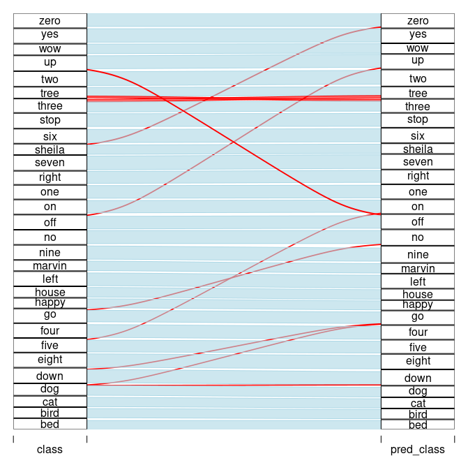

```{r, include = FALSE}
knitr::opts_chunk$set(echo = TRUE, eval = FALSE)
```

This article translates [Daniel Falbel's](https://github.com/dfalbel) ['Simple Audio Classification'](https://blogs.rstudio.com/ai/posts/2018-06-06-simple-audio-classification-keras/) article from `tensorflow/keras` to `torch/torchaudio`. The main goal is to introduce torchaudio and illustrate its contributions to the `torch` ecosystem. Here, we focus on a popular dataset, the audio loader and the spectrogram transformer. An interesting side product is the parallel between torch and tensorflow, showing sometimes the differences, sometimes the similarities between them.

<!-- https://towardsdatascience.com/a-tale-of-two-frameworks-985fa7fcec#6f89 -->

```{r setup}
library(torch)
library(torchaudio)
```

## Downloading and Importing

torchaudio has the `speechcommand_dataset` built in. It filter sout `_background_noise_` by default and lets us choose between versions `v0.01` and `v0.02`.

```{r}
# set an existing folder here to cache the dataset
DATASETS_PATH <- "~/datasets/"

# 1.4GB download
df <- speechcommand_dataset(
  root = DATASETS_PATH, 
  url = "speech_commands_v0.01",
  download = TRUE
)

# expect folder: _background_noise_
df$EXCEPT_FOLDER
# [1] "_background_noise_"

# number of audio files
length(df)
# [1] 64721

# a sample
sample <- df[1]

sample$waveform[, 1:10]
```

    torch_tensor
    0.0001 *
     0.9155  0.3052  1.8311  1.8311 -0.3052  0.3052  2.4414  0.9155 -0.9155 -0.6104
    [ CPUFloatType{1,10} ]

```{r}
sample$sample_rate
# 16000
sample$label
# bed

plot(sample$waveform[1], type = "l", col = "royalblue", main = sample$label)
```

```{r, eval = TRUE, echo = FALSE, layout="l-body-outset", fig.cap="A sample of a 'bed' word waveform."}
knitr::include_graphics("images/bedwave.png")
```


## Classes

```{r}
df$classes
```
    
     [1] "bed"    "bird"   "cat"    "dog"    "down"   "eight"  "five"  
     [8] "four"   "go"     "happy"  "house"  "left"   "marvin" "nine"  
    [15] "no"     "off"    "on"     "one"    "right"  "seven"  "sheila"
    [22] "six"    "stop"   "three"  "tree"   "two"    "up"     "wow"   
    [29] "yes"    "zero"  

## ~~Generator~~ Dataloader

`torch::dataloader` has the same task as `data_generator` defined in the original article. It is responsible for preparing batches - including shuffling, padding, one-hot encoding, etc - and for taking care of paralellism/device I/O orchestration.

In torch we do this by passing the train/test subset to `torch::dataloader` and encapsulating all the batch setup logic inside a `collate_fn()` function.

```{r}
set.seed(6)
id_train <- sample(length(df), size = 0.7*length(df))
id_test <- setdiff(seq_len(length(df)), id_train)
# subsets

train_subset <- torch::dataset_subset(df, id_train)
test_subset <- torch::dataset_subset(df, id_test)
```

At this point, `dataloader(train_subset)` would not work because the samples are not padded. So we need build our own `collate_fn()` with the padding strategy.

I suggest using the following approach when implementing the `collate_fn()`:

1) begin with `collate_fn <- function(batch) browser()`.
2) instantiate `dataloader` with the `collate_fn()`
3) create an environment by calling `enumerate(dataloader)` so you can ask to retrieve a batch from dataloader.
4) run `environment[[1]][[1]]`. Now you should be sent inside collate_fn() with access to `batch` input object. 
5) build the logic.

```{r, eval = FALSE}
collate_fn <- function(batch) {
  browser()
}

ds_train <- dataloader(
  train_subset, 
  batch_size = 32, 
  shuffle = TRUE, 
  collate_fn = collate_fn
)

ds_train_env <- enumerate(ds_train)
ds_train_env[[1]][[1]]
```

The final `collate_fn()` pads the waveform to length 16001 and then stack them up together. At this point there are no spectrograms yet. We going to make spectrogram transformation a part of model architecture.

```{r}
pad_sequence <- function(batch) {
    # Make all tensors in a batch the same length by padding with zeros
    batch <- sapply(batch, function(x) (x$t()))
    batch <- torch::nn_utils_rnn_pad_sequence(batch, batch_first = TRUE, padding_value = 0.)
    return(batch$permute(c(1, 3, 2)))
  }

# Final collate_fn
collate_fn <- function(batch) {
 # Input structure:
 # list of 32 lists: list(waveform, sample_rate, label, speaker_id, utterance_number)
 # Transpose it
 batch <- purrr::transpose(batch)
 tensors <- batch$waveform
 targets <- batch$label_index

 # Group the list of tensors into a batched tensor
 tensors <- pad_sequence(tensors)
 
 # target encoding
 targets <- torch::torch_stack(targets)

 list(tensors = tensors, targets = targets) # (64, 1, 16001)
}
```

Batch structure is:

- batch[[1]]: **waveforms** - `tensor` with dimension (32, 1, 16001)
- batch[[2]]: **targets** - `tensor` with dimension (32, 1)


Also, torchaudio comes with 3 loaders, `av_loader`, `tuner_loader`, and `audiofile_loader`- more to come.  `set_audio_backend()` is used to set one of them as the audio loader. Their performances differ based on audio format (mp3 or wav). There is no perfect world yet: `tuner_loader`is best for mp3, `audiofile_loader` is  best for wav, but neither of them has the option of partially loading a sample from an audio file without bringing all the data into memory first.

For set a given audio backend we need pass it to each worker through `worker_init_fn()` argument.

```{r}
ds_train <- dataloader(
  train_subset, 
  batch_size = 128, 
  shuffle = TRUE, 
  collate_fn = collate_fn,
  num_workers = 16,
  worker_init_fn = function(.) {torchaudio::set_audio_backend("audiofile_loader")},
  worker_globals = c("pad_sequence") # pad_sequence is needed for collect_fn
)

ds_test <- dataloader(
  test_subset, 
  batch_size = 64, 
  shuffle = FALSE, 
  collate_fn = collate_fn,
  num_workers = 8,
  worker_globals = c("pad_sequence") # pad_sequence is needed for collect_fn
)
```


## Model definition

Instead of `keras::keras_model_sequential()` we going to define a `torch::nn_module()`. As referenced by the original article, the model is based on [this architecture for MNIST from this tutorial](https://keras.rstudio.com/articles/examples/mnist_cnn.html), and I'll call it 'DanielNN'.

```{r}
dan_nn <- torch::nn_module(
  "DanielNN",
  
  initialize = function(
    window_size_ms = 30, 
    window_stride_ms = 10
  ) {
    
    # spectrogram spec
    window_size <- as.integer(16000*window_size_ms/1000)
    stride <- as.integer(16000*window_stride_ms/1000)
    fft_size <- as.integer(2^trunc(log(window_size, 2) + 1))
    n_chunks <- length(seq(0, 16000, stride))
    
    self$spectrogram <- torchaudio::transform_spectrogram(
      n_fft = fft_size, 
      win_length = window_size, 
      hop_length = stride, 
      normalized = TRUE, 
      power = 2
    )
    
    # convs 2D
    self$conv1 <- torch::nn_conv2d(in_channels = 1, out_channels = 32, kernel_size = c(3,3))
    self$conv2 <- torch::nn_conv2d(in_channels = 32, out_channels = 64, kernel_size = c(3,3))
    self$conv3 <- torch::nn_conv2d(in_channels = 64, out_channels = 128, kernel_size = c(3,3))
    self$conv4 <- torch::nn_conv2d(in_channels = 128, out_channels = 256, kernel_size = c(3,3))
    
    # denses
    self$dense1 <- torch::nn_linear(in_features = 14336, out_features = 128)
    self$dense2 <- torch::nn_linear(in_features = 128, out_features = 30)
  },
  
  forward = function(x) {
    x %>% # (64, 1, 16001)
      self$spectrogram() %>% # (64, 1, 257, 101)
      torch::torch_add(0.01) %>%
      torch::torch_log() %>%
      self$conv1() %>%
      torch::nnf_relu() %>%
      torch::nnf_max_pool2d(kernel_size = c(2,2)) %>%
      
      self$conv2() %>%
      torch::nnf_relu() %>%
      torch::nnf_max_pool2d(kernel_size = c(2,2)) %>%
      
      self$conv3() %>%
      torch::nnf_relu() %>%
      torch::nnf_max_pool2d(kernel_size = c(2,2)) %>%
      
      self$conv4() %>%
      torch::nnf_relu() %>%
      torch::nnf_max_pool2d(kernel_size = c(2,2)) %>%
      
      torch::nnf_dropout(p = 0.25) %>%
      torch::torch_flatten(start_dim = 2) %>%
      
      self$dense1() %>%
      torch::nnf_relu() %>%
      torch::nnf_dropout(p = 0.5) %>%
      self$dense2() 
  }
)

model <- dan_nn()


device <- torch::torch_device(if(torch::cuda_is_available()) "cuda" else "cpu")
model$to(device = device)

print(model)
```

    An `nn_module` containing 2,226,846 parameters.

    ── Modules ──────────────────────────────────────────────────────
    ● spectrogram: <Spectrogram> #0 parameters
    ● conv1: <nn_conv2d> #320 parameters
    ● conv2: <nn_conv2d> #18,496 parameters
    ● conv3: <nn_conv2d> #73,856 parameters
    ● conv4: <nn_conv2d> #295,168 parameters
    ● dense1: <nn_linear> #1,835,136 parameters
    ● dense2: <nn_linear> #3,870 parameters

## Model fitting

Unlike tensorflow, there is no `model %>% compile(...)` step in torch, so are going to set `loss criterion`, `optimizer strategy` and `evaluation metrics` explicitly in the training loop.

```{r}
loss_criterion <- torch::nn_cross_entropy_loss()
optimizer <- torch::optim_adadelta(model$parameters, rho = 0.95, eps = 1e-7)
metrics <- list(acc = yardstick::accuracy_vec)
```

### Training loop

```{r}
library(glue)
library(progress)

pred_to_r <- function(x) {
  classes <- factor(df$classes)
  classes[as.numeric(x$to(device = "cpu"))]
}

set_progress_bar <- function(total) {
  progress_bar$new(
    total = total, clear = FALSE, width = 70,
    format = ":current/:total [:bar] - :elapsed - loss: :loss - acc: :acc"
  )
}
```


```{r}
epochs <- 20
losses <- c()
accs <- c()

for(epoch in seq_len(epochs)) {
  pb <- set_progress_bar(length(ds_train))
  pb$message(glue("Epoch {epoch}/{epochs}"))
  coro::loop(for(batch in ds_train) {
    optimizer$zero_grad()
    predictions <- model(batch[[1]]$to(device = device))
    targets <- batch[[2]]$to(device = device)
    loss <- loss_criterion(predictions, targets)
    loss$backward()
    optimizer$step()
    
    # eval reports
    prediction_r <- pred_to_r(predictions$argmax(dim = 2))
    targets_r <- pred_to_r(targets)
    acc <- metrics$acc(targets_r, prediction_r)
    accs <- c(accs, acc)
    loss_r <- as.numeric(loss$item())
    losses <- c(losses, loss_r)
    
    pb$tick(tokens = list(loss = round(mean(losses), 4), acc = round(mean(accs), 4)))
  })
}


# test
predictions_r <- c()
targets_r <- c()
coro::loop(for(batch_test in ds_test) {
  predictions <- model(batch_test[[1]]$to(device = device))
  targets <- batch_test[[2]]$to(device = device)
  predictions_r <- c(predictions_r, pred_to_r(predictions$argmax(dim = 2)))
  targets_r <- c(targets_r, pred_to_r(targets))
})
val_acc <- metrics$acc(factor(targets_r, levels = 1:30), factor(predictions_r, levels = 1:30))
cat(glue("val_acc: {val_acc}\n\n"))
```

    
    Epoch 1/20                                                            
    [W SpectralOps.cpp:590] Warning: The function torch.rfft is deprecated and will be removed in a future PyTorch release. Use the new torch.fft module functions, instead, by importing torch.fft and calling torch.fft.fft or torch.fft.rfft. (function operator())
    354/354 [=========================] -  1m - loss: 2.6102 - acc: 0.2333
    Epoch 2/20                                                            
    354/354 [=========================] -  1m - loss: 1.9779 - acc: 0.4138
    Epoch 3/20                                                            
    354/354 [============================] -  1m - loss: 1.62 - acc: 0.519
    Epoch 4/20                                                            
    354/354 [=========================] -  1m - loss: 1.3926 - acc: 0.5859
    Epoch 5/20                                                            
    354/354 [==========================] -  1m - loss: 1.2334 - acc: 0.633
    Epoch 6/20                                                            
    354/354 [=========================] -  1m - loss: 1.1135 - acc: 0.6685
    Epoch 7/20                                                            
    354/354 [=========================] -  1m - loss: 1.0199 - acc: 0.6961
    Epoch 8/20                                                            
    354/354 [=========================] -  1m - loss: 0.9444 - acc: 0.7181
    Epoch 9/20                                                            
    354/354 [=========================] -  1m - loss: 0.8816 - acc: 0.7365
    Epoch 10/20                                                           
    354/354 [=========================] -  1m - loss: 0.8278 - acc: 0.7524
    Epoch 11/20                                                           
    354/354 [=========================] -  1m - loss: 0.7818 - acc: 0.7659
    Epoch 12/20                                                           
    354/354 [=========================] -  1m - loss: 0.7413 - acc: 0.7778
    Epoch 13/20                                                           
    354/354 [=========================] -  1m - loss: 0.7064 - acc: 0.7881
    Epoch 14/20                                                           
    354/354 [=========================] -  1m - loss: 0.6751 - acc: 0.7974
    Epoch 15/20                                                           
    354/354 [=========================] -  1m - loss: 0.6469 - acc: 0.8058
    Epoch 16/20                                                           
    354/354 [=========================] -  1m - loss: 0.6216 - acc: 0.8133
    Epoch 17/20                                                           
    354/354 [=========================] -  1m - loss: 0.5985 - acc: 0.8202
    Epoch 18/20                                                           
    354/354 [=========================] -  1m - loss: 0.5774 - acc: 0.8263
    Epoch 19/20                                                           
    354/354 [==========================] -  1m - loss: 0.5582 - acc: 0.832
    Epoch 20/20                                                           
    354/354 [=========================] -  1m - loss: 0.5403 - acc: 0.8374
    val_acc: 0.876705979296493
    
## Making predictions

We already have all predictions calculated for `test_subset`, let's recreate the alluvial plot from original article.

```{r}
library(dplyr)
library(alluvial)
df_validation <- data.frame(
  pred_class = df$classes[predictions_r],
  class = df$classes[targets_r]
)
x <-  df_validation %>%
  mutate(correct = pred_class == class) %>%
  count(pred_class, class, correct)

alluvial(
  x %>% select(class, pred_class),
  freq = x$n,
  col = ifelse(x$correct, "lightblue", "red"),
  border = ifelse(x$correct, "lightblue", "red"),
  alpha = 0.6,
  hide = x$n < 20
)
```


```{r, eval = TRUE, echo = FALSE, layout="l-body-outset", fig.cap="Model performance: true labels <--> predicted labels."}

```


Model accuracy is 87,7%, somewhat worse than tensorflow version from the original post. Nevertheless, all conclusions from original post still hold.
