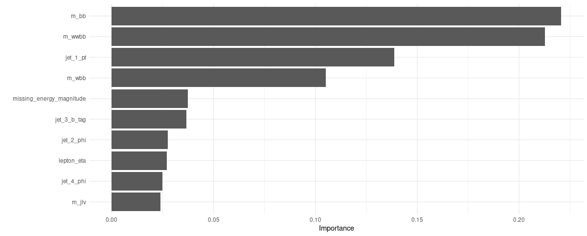
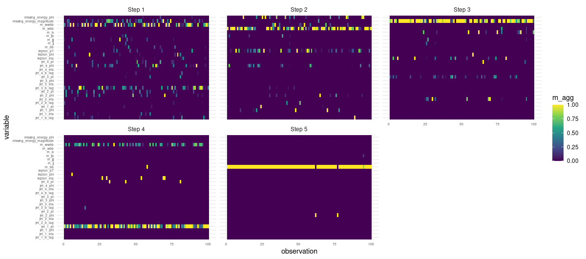

```{r setup, include=FALSE}
knitr::opts_chunk$set(echo = TRUE, eval = FALSE)
```

So what's with the clickbait (*high-energy physics*)? Well, it's not just clickbait. To showcase TabNet, we will be using the [Higgs](https://archive.ics.uci.edu/ml/datasets/HIGGS) dataset (@higgs), available at UCI Machine Learning Repository. I don't know about you, but I always enjoy using datasets that motivate me to learn more about things. But first, let's get acquainted with the main actors of this post!

# TabNet

TabNet was introduced in @arik2020tabnet. It is interesting for three reasons:

-   It claims highly competitive performance on tabular data, an area where deep learning has not gained much of a reputation yet.

-   TabNet includes interpretability[^1] features by design.

-   It is claimed to significantly profit from self-supervised pre-training, again in an area where this is anything but undeserving of mention.

[^1]: I'm using the term "naively" here. For a short discussion, see the final section, [Interpretable, explainable, you tell me -- beyond arbitrary definitions].

In this post, we won't go into (3), but we do expand on (2), the ways TabNet allows access to its inner workings.

How do we use TabNet from R? The `torch` ecosystem includes a package -- `tabnet` -- that not only implements the model of the same name, but also allows you to make use of it as part of a `tidymodels` workflow.

# tidymodels

To many R-using data scientists, the [tidymodels](https://www.tidymodels.org/) framework will not be a stranger. `tidymodels` provides a high-level, unified approach to model training, hyperparameter optimization, and inference.

`tabnet` is the first (of many, we hope) `torch` models that let you use a `tidymodels` workflow all the way: from data pre-processing over hyperparameter tuning to performance evaluation and inference. While the first, as well as the last, may seem nice-to-have but not "mandatory", the tuning experience is likely to be something you'll won't want to do without!

# Using tabnet with tidymodels

In this post, we first showcase a `tabnet`-using workflow in a nutshell, making use of hyperparameter settings reported in the paper.

Then, we initiate a `tidymodels`-powered hyperparameter search, focusing on the basics but also, encouraging you to dig deeper at your leisure.

Finally, we circle back to the promise of interpretability, demonstrating what is offered by `tabnet` and ending in a short discussion.

# In the flow with TabNet

As usual, we start by loading all required libraries. We also set a random seed, on the R as well as the `torch` sides. When model interpretation is part of your task, you will want to investigate the role of random initialization.

```{r}
library(torch)
library(tabnet)
library(tidyverse)
library(tidymodels)
library(finetune) # to use tuning functions from the new finetune package
library(vip) # to plot feature importances

set.seed(777)
torch_manual_seed(777)

```

Next, we load the dataset.

```{r}
# download from https://archive.ics.uci.edu/ml/datasets/HIGGS
higgs <- read_csv(
  "HIGGS.csv",
  col_names = c("class", "lepton_pT", "lepton_eta", "lepton_phi", "missing_energy_magnitude",
                "missing_energy_phi", "jet_1_pt", "jet_1_eta", "jet_1_phi", "jet_1_b_tag",
                "jet_2_pt", "jet_2_eta", "jet_2_phi", "jet_2_b_tag", "jet_3_pt", "jet_3_eta",
                "jet_3_phi", "jet_3_b_tag", "jet_4_pt", "jet_4_eta", "jet_4_phi", "jet_4_b_tag",
                "m_jj", "m_jjj", "m_lv", "m_jlv", "m_bb", "m_wbb", "m_wwbb"),
  col_types = "fdddddddddddddddddddddddddddd"
  )
```

What's this about? In high-energy physics, the search for new particles takes place at powerful particle accelerators, such as (and most prominently) CERN's [Large Hadron Collider](https://home.cern/science/accelerators/large-hadron-collider). In addition to actual experiments, simulation plays an important role. In simulations, "measurement" data are generated according to different underlying hypotheses, resulting in distributions that can be compared with each other. Given the likelihood of the simulated data, the goal then is to make inferences about the hypotheses.

The above dataset (@higgs) results from just such a simulation. It explores what features could be measured assuming two different processes. In the first process, two gluons collide, and a heavy Higgs boson is produced; this is the signal process, the one we're interested in. In the second, the collision of the gluons results in a pair of top quarks -- this is the background process.

Through different intermediaries, both processes result in the same end products -- so tracking these does not help. Instead, what the paper authors did was simulate kinematic features (momenta, specifically) of decay products, such as leptons (electrons and protons) and particle jets. In addition, they constructed a number of high-level features, features that presuppose domain knowledge. In their article, they showed that, in contrast to other machine learning methods, deep neural networks did nearly as well when presented with the low-level features (the momenta) only as with just the high-level features alone.

Certainly, it would be interesting to double-check these results on `tabnet`, and then, look at the respective feature importances. However, given the size of the dataset, non-negligible computing resources (and patience) will be required.

Speaking of size, let's take a look:

```{r}
higgs %>% glimpse()
```

    Rows: 11,000,000
    Columns: 29
    $ class                    <fct> 1.000000000000000000e+00, 1.000000…
    $ lepton_pT                <dbl> 0.8692932, 0.9075421, 0.7988347, 1…
    $ lepton_eta               <dbl> -0.6350818, 0.3291473, 1.4706388, …
    $ lepton_phi               <dbl> 0.225690261, 0.359411865, -1.63597…
    $ missing_energy_magnitude <dbl> 0.3274701, 1.4979699, 0.4537732, 1…
    $ missing_energy_phi       <dbl> -0.68999320, -0.31300953, 0.425629…
    $ jet_1_pt                 <dbl> 0.7542022, 1.0955306, 1.1048746, 1…
    $ jet_1_eta                <dbl> -0.24857314, -0.55752492, 1.282322…
    $ jet_1_phi                <dbl> -1.09206390, -1.58822978, 1.381664…
    $ jet_1_b_tag              <dbl> 0.000000, 2.173076, 0.000000, 0.00…
    $ jet_2_pt                 <dbl> 1.3749921, 0.8125812, 0.8517372, 2…
    $ jet_2_eta                <dbl> -0.6536742, -0.2136419, 1.5406590,…
    $ jet_2_phi                <dbl> 0.9303491, 1.2710146, -0.8196895, …
    $ jet_2_b_tag              <dbl> 1.107436, 2.214872, 2.214872, 2.21…
    $ jet_3_pt                 <dbl> 1.1389043, 0.4999940, 0.9934899, 1…
    $ jet_3_eta                <dbl> -1.578198314, -1.261431813, 0.3560…
    $ jet_3_phi                <dbl> -1.04698539, 0.73215616, -0.208777…
    $ jet_3_b_tag              <dbl> 0.000000, 0.000000, 2.548224, 0.00…
    $ jet_4_pt                 <dbl> 0.6579295, 0.3987009, 1.2569546, 0…
    $ jet_4_eta                <dbl> -0.01045457, -1.13893008, 1.128847…
    $ jet_4_phi                <dbl> -0.0457671694, -0.0008191102, 0.90…
    $ jet_4_btag               <dbl> 3.101961, 0.000000, 0.000000, 0.00…
    $ m_jj                     <dbl> 1.3537600, 0.3022199, 0.9097533, 0…
    $ m_jjj                    <dbl> 0.9795631, 0.8330482, 1.1083305, 1…
    $ m_lv                     <dbl> 0.9780762, 0.9856997, 0.9856922, 0…
    $ m_jlv                    <dbl> 0.9200048, 0.9780984, 0.9513313, 0…
    $ m_bb                     <dbl> 0.7216575, 0.7797322, 0.8032515, 0…
    $ m_wbb                    <dbl> 0.9887509, 0.9923558, 0.8659244, 1…
    $ m_wwbb                   <dbl> 0.8766783, 0.7983426, 0.7801176, 0…

Eleven million "observations" (kind of) -- that's a lot! Like the authors of the TabNet paper (@arik2020tabnet), we'll use 500,000 of these for validation. (Unlike them, though, we won't be able to train for 870,000 iterations!)

The first variable, `class`, is either `1` or `0`, depending on whether a Higgs boson was present or not. While in experiments, only a tiny fraction of collisions produce one of those, both classes are about equally frequent in this dataset.

As for the predictors, the last seven are high-level (derived). All others are "measured".

Data loaded, we're ready to build a `tidymodels` *workflow*, resulting in a short sequence of concise steps.

First, split the data:

```{r}
n <- 11000000
n_test <- 500000
test_frac <- n/n_all

split <- initial_time_split(higgs, prop = 1 - test_frac)
train <- training(split)
test  <- testing(split)
```

Second, create a `recipe`. We want to predict `class` from all other features present:

```{r}
rec <- recipe(class ~ ., train) 
```

Third, create a `parsnip` model specification of class `tabnet`. The parameters passed are those reported by the TabNet paper, for the S-sized model variant used on this dataset. [^2]

[^2]: Apart from the number of epochs, that is.

```{r}
# hyperparameter settings (apart from epochs) as per the TabNet paper (TabNet-S)
mod <- tabnet(epochs = 3, batch_size = 16384, decision_width = 24, attention_width = 26,
              num_steps = 5, penalty = 0.000001, virtual_batch_size = 512, momentum = 0.6,
              feature_reusage = 1.5, learn_rate = 0.02) %>%
  set_engine("torch", verbose = TRUE) %>%
  set_mode("classification")

```

Fourth, bundle recipe and model specifications in a workflow:

```{r}
wf <- workflow() %>%
  add_model(mod) %>%
  add_recipe(rec)
```

Fifth, train the model. This will take some time. Training finished, we save the trained `parsnip` model, so we can reuse it at a later time.

```{r}
fitted_model <- wf %>% fit(train)

# access the underlying parsnip model and save it to RDS format
# depending on when you read this, a nice wrapper may exist
# see https://github.com/mlverse/tabnet/issues/27  
fitted_model$fit$fit$fit %>% saveRDS("saved_model.rds")
```

After three epochs, loss was at 0.609.

Sixth -- and finally -- we ask the model for test-set predictions and have accuracy computed.

```{r}
preds <- test %>% 
  bind_cols(predict(fitted_model, test))

yardstick::accuracy(preds, class, .pred_class)
```

    # A tibble: 1 x 3
      .metric  .estimator .estimate
      <chr>    <chr>          <dbl>
    1 accuracy binary         0.672

We didn't quite arrive at the accuracy reported in the TabNet paper (0.783), but then, we only trained for a tiny fraction of the time.

In case you're thinking: *well, that was a nice and effortless way of training a neural network!* -- just wait and see how easy hyperparameter tuning can get. In fact, no need to wait, we'll take a look right now.

# TabNet tuning

For hyperparameter tuning, the `tidymodels` framework makes use of cross-validation. With a dataset of considerable size, some time and patience is needed; for the purpose of this post, I'll use 1/1,000 of observations.

Changes to the above workflow start at model specification. Let's say we'll leave most settings fixed, but vary the TabNet-specific hyperparameters `decision_width`, `attention_width`, and `num_steps`, as well as the learning rate:[^3]

[^3]: The number of epochs is set to one for demonstration purposes only; in reality, you will want to tune this as well.

```{r}
mod <- tabnet(epochs = 1, batch_size = 16384, decision_width = tune(), attention_width = tune(),
              num_steps = tune(), penalty = 0.000001, virtual_batch_size = 512, momentum = 0.6,
              feature_reusage = 1.5, learn_rate = tune()) %>%
  set_engine("torch", verbose = TRUE) %>%
  set_mode("classification")

```

Workflow creation looks the same as before:

```{r}
wf <- workflow() %>%
  add_model(mod) %>%
  add_recipe(rec)

```

Next, we specify the hyperparameter ranges we're interested in, and call one of the grid construction functions from the `dials` package to build one for us. If it wasn't for demonstration purposes, we'd probably want to have more than eight alternatives though, and pass a higher `size` to `grid_max_entropy()` .

```{r}
grid <-
  wf %>%
  parameters() %>%
  update(
    decision_width = decision_width(range = c(20, 40)),
    attention_width = attention_width(range = c(20, 40)),
    num_steps = num_steps(range = c(4, 6)),
    learn_rate = learn_rate(range = c(-2.5, -1))
  ) %>%
  grid_max_entropy(size = 8)

grid
```

    # A tibble: 8 x 4
      learn_rate decision_width attention_width num_steps
           <dbl>          <int>           <int>     <int>
    1    0.00529             28              25         5
    2    0.0858              24              34         5
    3    0.0230              38              36         4
    4    0.0968              27              23         6
    5    0.0825              26              30         4
    6    0.0286              36              25         5
    7    0.0230              31              37         5
    8    0.00341             39              23         5

To search the space, we use `tune_race_anova()` from the new [finetune](https://www.tidyverse.org/blog/2020/12/finetune-0-0-1/) package, making use of five-fold cross-validation:

```{r}
ctrl <- control_race(verbose_elim = TRUE)
folds <- vfold_cv(train, v = 5)
set.seed(777)

res <- wf %>% 
    tune_race_anova(
    resamples = folds, 
    grid = grid,
    control = ctrl
  )

```

We can now extract the best hyperparameter combinations:

```{r}
res %>% show_best("accuracy") %>% select(- c(.estimator, .config))
```

    # A tibble: 5 x 8
      learn_rate decision_width attention_width num_steps .metric   mean     n std_err
           <dbl>          <int>           <int>     <int> <chr>    <dbl> <int>   <dbl>
    1     0.0858             24              34         5 accuracy 0.516     5 0.00370
    2     0.0230             38              36         4 accuracy 0.510     5 0.00786
    3     0.0230             31              37         5 accuracy 0.510     5 0.00601
    4     0.0286             36              25         5 accuracy 0.510     5 0.0136 
    5     0.0968             27              23         6 accuracy 0.498     5 0.00835

It's hard to imagine how tuning could be more convenient!

Now, we circle back to the original training workflow, and inspect TabNet's interpretability features.

# TabNet interpretability features

TabNet's most prominent characteristic is the way -- inspired by decision trees -- it executes in distinct steps. At each step, it again looks at the original input features, and decides which of those to consider based on lessons learned in prior steps. Concretely, it uses an attention mechanism to learn sparse *masks* which are then applied to the features.

Now, these masks being "just" model weights means we can extract them and draw conclusions about feature importance. Depending on how we proceed, we can either

-   aggregate mask weights over steps, resulting in global per-feature importances;

-   run the model on a few test samples and aggregate over steps, resulting in observation-wise feature importances; or

-   run the model on a few test samples and extract individual weights observation- as well as step-wise.

This is how to accomplish the above with `tabnet`.

#### Per-feature importances

We continue with the `fitted_model` workflow object we ended up with at the end of part 1. `vip::vip` is able to display feature importances directly from the `parsnip` model:

```{r}
fit <- pull_workflow_fit(fitted_model)
vip(fit) + theme_minimal()
```

```{r, eval = TRUE, echo = FALSE, layout="l-body-outset", fig.cap="Global feature importances."}

```

Together, two high-level features dominate, accounting for nearly 50% of overall attention. Along with a third high-level feature, ranked in place four, they occupy about 60% of "importance space".

#### Observation-level feature importances

We choose the first hundred observations in the test set to extract feature importances. Due to how TabNet enforces sparsity, we see that many features have not been made use of:

```{r}
ex_fit <- tabnet_explain(fit$fit, test[1:100, ])

ex_fit$M_explain %>%
  mutate(observation = row_number()) %>%
  pivot_longer(-observation, names_to = "variable", values_to = "m_agg") %>%
  ggplot(aes(x = observation, y = variable, fill = m_agg)) +
  geom_tile() +
  theme_minimal() + 
  scale_fill_viridis_c()
```

```{r, eval = TRUE, echo = FALSE, layout="l-body-outset", fig.cap="Per-observation feature importances."}
knitr::include_graphics("images/agg_masks.png")
```

#### Per-step, observation-level feature importances

Finally and on the same selection of observations, we again inspect the masks, but this time, per decision step:

```{r}
ex_fit$masks %>% 
  imap_dfr(~mutate(
    .x, 
    step = sprintf("Step %d", .y),
    observation = row_number()
  )) %>% 
  pivot_longer(-c(observation, step), names_to = "variable", values_to = "m_agg") %>% 
  ggplot(aes(x = observation, y = variable, fill = m_agg)) +
  geom_tile() +
  theme_minimal() + 
  theme(axis.text = element_text(size = 5)) +
  scale_fill_viridis_c() +
  facet_wrap(~step)
```

```{r, eval = TRUE, echo = FALSE, layout="l-page", fig.cap="Per-observation, per-step feature importances."}

```

This is nice: We clearly see how TabNet makes use of different features at different times.

So what do we make of this? It depends. Given the enormous societal importance of this topic -- call it interpretability, explainability, or whatever -- let's finish this post with a short discussion.

# Interpretable, explainable, ...? Beyond the arbitrariness of definitions

An internet search for "interpretable vs. explainable ML" immediately turns up a number of sites confidently stating "interpretable ML is ..." and "explainable ML is ...", as though there were no arbitrariness in common-speech definitions. Going deeper, you find articles such as Cynthia Rudin's "Stop Explaining Black Box Machine Learning Models for High Stakes Decisions and Use Interpretable Models Instead" (@rudin2018stop) that present you with a clear-cut, deliberate, instrumentalizable distinction that can actually be used in real-world scenarios.

In a nutshell, what she decides to call explainability is: approximate a black-box model by a simpler (e.g., linear) model and, starting from the simple model, make inferences about how the black-box model works. One of the examples she gives for how this could fail is so striking I'd like to fully cite it:

> Even an explanation model that performs almost identically to a black box model might use completely different features, and is thus not faithful to the computation of the black box. Consider a black box model for criminal recidivism prediction, where the goal is to predict whether someone will be arrested within a certain time after being released from jail/prison. Most recidivism prediction models depend explicitly on age and criminal history, but do not explicitly depend on race. Since criminal history and age are correlated with race in all of our datasets, a fairly accurate explanation model could construct a rule such as "This person is predicted to be arrested because they are black." This might be an accurate explanation model since it correctly mimics the predictions of the original model, but it would not be faithful to what the original model computes.

What she calls interpretability, in contrast, is deeply related to domain knowledge:

> Interpretability is a domain-specific notion [...] Usually, however, an interpretable machine learning model is constrained in model form so that it is either useful to someone, or obeys structural knowledge of the domain, such as monotonicity [e.g.,8], causality, structural (generative) constraints, additivity [9], or physical constraints that come from domain knowledge. Often for structured data, sparsity is a useful measure of interpretability [...]. Sparse models allow a view of how variables interact jointly rather than individually. [...] e.g., in some domains, sparsity is useful,and in others is it not.

If we accept these well-thought-out definitions, what can we say about TabNet? Is looking at attention masks more like constructing a post-hoc model or more like having domain knowledge incorporated? I believe Rudin would argue the former, since

-   the image-classification example she uses to point out weaknesses of explainability techniques employs saliency maps, a technical device comparable, in some ontological sense, to attention masks;

-   the sparsity enforced by TabNet is a technical, not a domain-related constraint;

-   we only know *what* features were used by TabNet, not *how* it used them.

On the other hand, one could disagree with Rudin (and others) about the premises. Do explanations *have* to be modeled after human cognition to be considered valid? Personally, I guess I'm not sure, and to cite from a post by [Keith O'Rourke on just this topic of interpretability](https://statmodeling.stat.columbia.edu/2018/10/30/explainable-ml-versus-interpretable-ml/),

> As with any critically-thinking inquirer, the views behind these deliberations are always subject to rethinking and revision at any time.

In any case though, we can be sure that this topic's importance will only grow with time. While in the very early days of the GDPR (the EU General Data Protection Regulation) it was said that [Article 22](https://www.gdpr.org/regulation/article-22.html) (on automated decision-making) would have significant impact on how ML is used[^4], unfortunately the current view seems to be that its wordings are far too vague to have immediate consequences (e.g., @wachter). But this will be a fascinating topic to follow, from a technical as well as a political point of view.

[^4]: See, e.g., [\<http://www.odbms.org/2018/07/ai-machine-learning-and-the-gdpr-are-the-wild-west-days-of-advanced-analytics-over/\>](http://www.odbms.org/2018/07/ai-machine-learning-and-the-gdpr-are-the-wild-west-days-of-advanced-analytics-over/){.uri}.

Thanks for reading!
