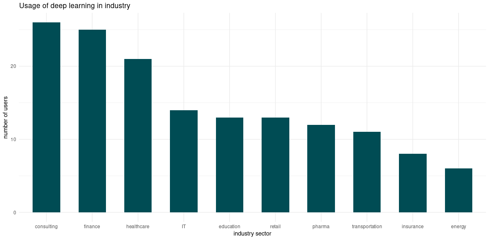
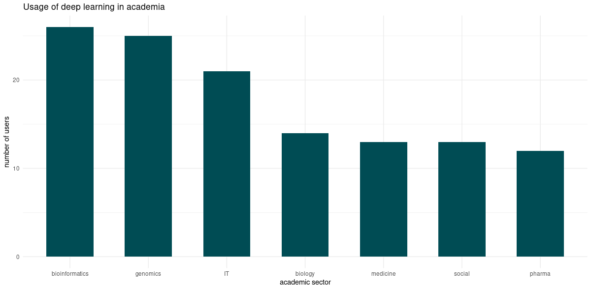
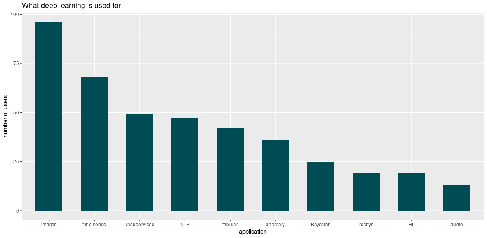
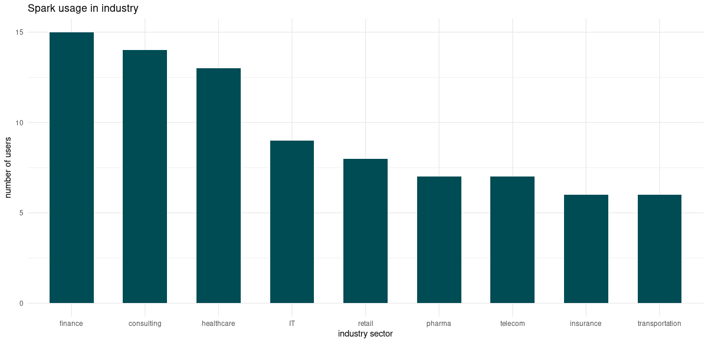
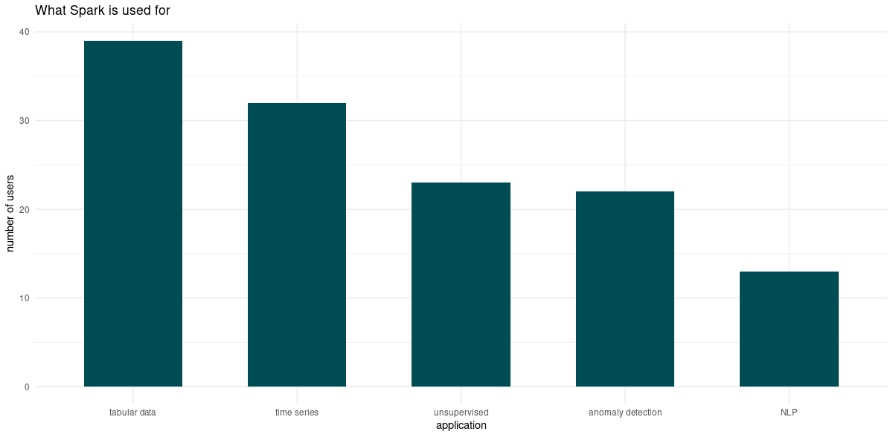
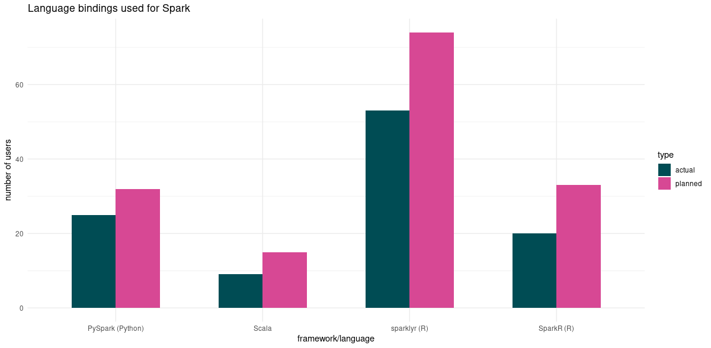
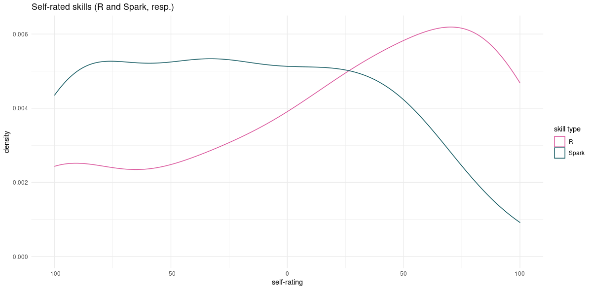
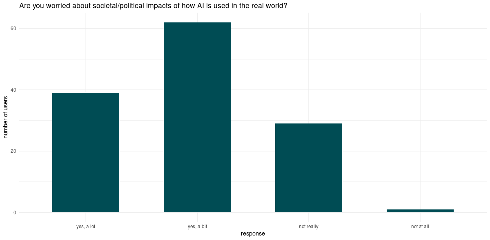
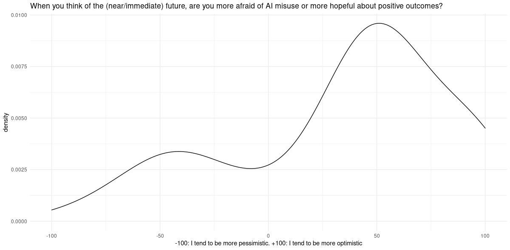
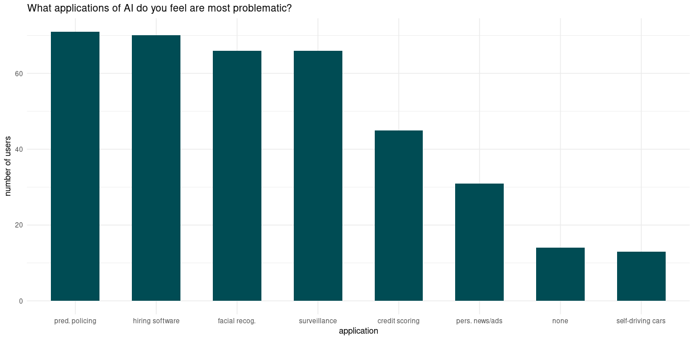

```{r setup, include=FALSE}
knitr::opts_chunk$set(echo = TRUE, eval = FALSE)
```


Thank you everyone who participated in our first *mlverse* survey!

(Inevitable aside: Why -- or: what even is -- *mlverse*? The mlverse originated as an abbreviation of *multiverse*[^1], which, on its part, came into being as an intended allusion to the well-known *tidyverse.* As such, although *mlverse* software aims for seamless interoperability with the tidyverse, or even integration when feasible (see our recent [post](https://blogs.rstudio.com/ai/posts/2021-02-11-tabnet/) featuring a wholly tidymodels-integrated `torch` network architecture), the priorities are probably a bit different: Often, mlverse software's raison d'être is to allow R users to do things that are commonly known to be done with other languages, such as Python.

[^1]: Calling it an abbreviation is, in fact, itself abbreviating things. The main motivation is more practical, as in: being able to obtain not-yet-reserved URLs and not-too-frequently-used hashtags.

As of today, *mlverse* development takes place mainly in two broad areas: deep learning, and distributed computing / ML automation. By its very nature, though, it is open to changing user interests and demands. Which leads us to the topic of this post.

# The survey

GitHub issues and [community](https://community.rstudio.com/) questions are valuable feedback, but we wanted something more direct. We wanted a way to find out how you, our users, employ the software, and what for; what you think could be improved; what you wish existed but is not there (yet). To that end, we created a survey. Complementing software- and application-related questions for the above-mentioned broad areas, the survey had a third section, asking about how you perceive ethical and social implications of AI as applied in the "real world".

In the following, I state major results, both quantitative and qualitative. For the qualitative part, I'll try to address topics that seem to be relevant to a larger number of users. I'd also like to explicitly invite you to comment on this blog post, whether you took part in the survey or not.

A few things upfront:

Firstly, the survey was completely anonymous, in that we asked for neither identifiers (such as e-mail addresses) nor things that render one identifiable, such as gender or geographic location. In the same vein, we had collection of IP addresses disabled on purpose.

Secondly, just like GitHub issues are a biased sample, this survey's participants must be. Main venues of promotion were [rstudio::global](https://rstudio.com/resources/rstudioglobal-2021/), Twitter, LinkedIn, and RStudio Community. As this was the first time we did such a thing (and under significant time constraints), not everything was planned to perfection -- not wording-wise and not distribution-wise. Nevertheless, we got a lot of interesting, helpful, and often very detailed answers, -- and for the next time we do this, we'll have our lessons learned!

Thirdly, all questions were optional, naturally resulting in different numbers of valid answers per question. On the other hand, not having to select a bunch of "not applicable" boxes freed respondents to spend time on topics that mattered to them.

As a final pre-remark, most questions allowed for multiple answers.

In sum, we ended up with 138 completed[^2] surveys. Thanks again everyone who participated, and especially, thank you for taking the time to answer the -- many -- free-form questions!

[^2]: There were quite a few uncompleted ones as well, but I decided to leave them out to avoid accidental errors like double-counting. I'm sorry if that has led to valuable answers having been excluded.

I am going to present the results in three parts, following the structure of the survey. We start with deep learning -- applications, software usage, and wishes --, proceed with distributed computing (topics being analogous), and end with people's thoughts on ethics.

# Deep learning

### Areas and applications

Our first goal was to find out in which settings, and for what kinds of applications, deep-learning software is being used.

Overall, 72 respondents reported using DL in their jobs in industry, followed by academia (23), study (21), spare time (43), and not-actually-using-but-wanting-to (24).

Of those working with DL in industry, more than twenty said they worked in consulting, finance, and healthcare (each). IT, education, retail, pharma, and transportation were each mentioned more than ten times:

```{r, eval = TRUE, echo = FALSE, layout="l-body-outset", fig.cap="Number of users reporting to use DL in industry. Smaller groups not displayed."}


```

In academia, dominant fields (as per survey participants) were bioinformatics, genomics, and IT, followed by biology, medicine, pharmacology, and social sciences:

```{r, eval = TRUE, echo = FALSE, layout="l-body-outset", fig.cap="Number of users reporting to use DL in academia. Smaller groups not displayed."}

```

What application areas matter to larger subgroups of "our" users? Nearly a hundred (of 138!) respondents said they used DL for some kind of image-processing application (including classification, segmentation, and object detection). Next up was time-series forecasting, followed by unsupervised learning.

The popularity of unsupervised DL was a bit unexpected; had we anticipated this, we would have asked for more detail here. So if you're one of the people who selected this -- or if you didn't participate, but do use DL for unsupervised learning -- please let us know a bit more in the comments!

Next, NLP was about on par with the former; followed by DL on tabular data, and anomaly detection. Bayesian deep learning, reinforcement learning, recommendation systems, and audio processing were still mentioned frequently.

```{r, eval = TRUE, echo = FALSE, layout="l-body-outset", fig.cap="Applications deep learning is used for. Smaller groups not displayed."}

```

### Frameworks and skills

We also asked what frameworks and languages participants were using for deep learning, and what they were planning on using in the future. Single-time mentions (e.g., deeplearning4J) are not displayed.

```{r, eval = TRUE, echo = FALSE, layout="l-body-outset", fig.cap="Framework / language used for deep learning. Single mentions not displayed."}
knitr::include_graphics("images/dl_lang.png")

```

An important thing for any software developer or content creator to investigate is proficiency/levels of expertise present in their audiences. It (nearly) goes without saying that expertise is very different from *self-reported* expertise. I'd like to be very cautious, then, to interpret the below results.

While re R skills[^3], the aggregate self-ratings look plausible (to me), I would have guessed a slightly different outcome re DL. Judging from other sources (like, e.g., GitHub issues), I tend to suspect more of a bimodal distribution (a far stronger version of the bimodality we're already seeing, that is). To me, it seems like we have rather many users who know a *lot* about DL. In agreement with my gut feeling, though, is the bimodality itself -- as opposed to, say, a Gaussian shape.

[^3]: This question was addressed only to people using R for deep learning.

But of course, sample size is moderate, and sample bias is present.

```{r, eval = TRUE, echo = FALSE, layout="l-body-outset", fig.cap="Self-rated skills re R and deep learning."}
knitr::include_graphics("images/dl_skills.png")

```

### Wishes and suggestions

Now, to the free-form questions. We wanted to know what we could do better.

I'll address the most salient topics in order of frequency of mention.[^4] For DL, this is surprisingly easy (as opposed to Spark, as you'll see).

[^4]: For space reasons, I'm not able to address every single suggestion. But please be sure that everything has carefully been read and considered.

##### "No Python"

The number one concern with deep learning from R, for survey respondents, clearly has to do not with R but with Python. This topic appeared in various forms, the most frequent being frustration over how hard it can be, dependent on the environment, to get Python dependencies for TensorFlow/Keras correct. (It also appeared as enthusiasm for `torch`, which  we are very happy about.)

Let me clarify and add some context.

TensorFlow is a Python framework (nowadays subsuming Keras, which is why I'll be addressing both of those as "TensorFlow" for simplicity) that is made available from R through packages `tensorflow` and `keras` . As with other Python libraries, objects are imported and accessible via `reticulate` . While `tensorflow` provides the low-level access, `keras` brings idiomatic-feeling, nice-to-use wrappers that let you forget about the chain of dependencies involved.

On the other hand, `torch`, a recent addition to *mlverse* software, is an R port of PyTorch that does not delegate to Python. Instead, its R layer directly calls into `libtorch`, the C++ library behind PyTorch. In that way, it is like a lot of high-duty R packages, making use of C++ for performance reasons.

Now, this is not the place for recommendations. Here are a few thoughts though.

Clearly, as one respondent remarked, as of today the `torch` ecosystem does not offer functionality on par with TensorFlow, and for that to change time and -- hopefully! more on that below -- your, the community's, help is needed. Why? Because `torch` is so young, for one; but also, there is a "systemic" reason! With TensorFlow, as we can access any symbol via the `tf` object, it is always possible, if inelegant, to do from R what you see done in Python. Respective R wrappers nonexistent, quite a few blog posts (see, e.g., <https://blogs.rstudio.com/ai/posts/2020-04-29-encrypted_keras_with_syft/>, or [A first look at federated learning with TensorFlow](https://blogs.rstudio.com/ai/posts/2020-04-08-tf-federated-intro/)) relied on this!

Switching to the topic of `tensorflow`'s Python dependencies causing problems with installation, my experience (from GitHub issues, as well as my own) has been that difficulties are quite system-dependent. On some OSes, complications seem to appear more often than on others; and low-control (to the individual user) environments like HPC clusters can make things especially difficult. In any case though, I have to (unfortunately) admit that when installation problems appear, they can be very tricky to solve.

On to the next point (and I promise, this was by far the longest subsection).

##### `tidymodels` integration

The second most-frequent mention clearly was the wish for tighter `tidymodels` integration. Here, we wholeheartedly agree. As of today, there is no automated way to accomplish this for `torch` models generically, but it can be done for specific model implementations.

Last week, [torch, tidymodels, and high-energy physics](https://blogs.rstudio.com/ai/posts/2021-02-11-tabnet/) featured the first `tidymodels`-integrated `torch` package. And there's more to come. In fact, if you are developing a package in the `torch` ecosystem, why not consider doing the same? Should you run into problems, the growing `torch` community will be happy to help.

##### Documentation, examples, teaching materials

Thirdly, several respondents expressed the wish for more documentation, examples, and teaching materials. Let me say that here, the situation is different for TensorFlow than for `torch`.

For [`tensorflow`](https://tensorflow.rstudio.com/), the website has a multitude of guides, tutorials, and examples. For [`torch`](torch.mlverse.org), reflecting the discrepancy in respective lifecycles, materials are not that abundant (yet). However, after a recent refactoring, the website has a new, four-part [Get started](https://torch.mlverse.org/start/) section addressed to both beginners in DL and experienced TensorFlow users curious to learn about `torch`. After this hands-on introduction, a good place to get more technical background would be the section on [tensors, autograd, and neural network modules](https://torch.mlverse.org/technical/).

Truth be told, though, nothing would be more helpful here than contributions from the community. Whenever you solve even the tiniest (which is often how things appear to oneself) problem, consider creating a vignette explaining what you did. Future users will be thankful, and a growing user base means that over time, it'll be your turn to find that some things have already been solved for you!

Which leads me to the last -- aggregate -- point.

##### Community, community, community

The remaining things I'd like to mention didn't come up quite as often (individually), but taken together, they all have something in common: They all are wishes *we* happen to have, as well!

This definitely holds in the abstract -- let me cite:

> "Develop more of a DL community"
>
> "Larger developer community and ecosystem. Rstudio has made great tools, but for applied work is has been hard to work against the momentum of working in Python."

We wholeheartedly agree: And building a larger community is exactly what we're trying to do. I like the formulation "a DL community" insofar it is framework-independent. In the end, frameworks are just tools, and what counts is our ability to usefully apply those tools to problems we need to solve.

Concrete wishes include

-   More paper/model implementations (such as TabNet).

-   Facilities for easy data reshaping and pre-processing (e.g., in order to pass data to RNNs or 1dd convnets in the expected 3-d format).

-   Probabilistic programming for `torch` (analogously to TensorFlow Probability)

-   A high-level library (such as fast.ai) based on `torch.`

If time and resources were infinite, all of these would have become reality already.

But then, instead of having everything implemented by a small group of people, isn't it much more effective (and satisfying!) to have a large and diverse group of people each contribute "theirs": the things they're interested in most, or which they feel drawn to most due to their individual backgrounds? In other words, if you're motivated to do so, please feel very encouraged to contribute to the growing community!

And now, on to Spark.

# Spark

### Areas and applications

For Spark, questions broadly paralleled those asked for DL.

Overall, judging from this survey (and unsurprisingly), Spark is predominantly used in industry (n = 39). For academic staff and students, n = 4 (each). Seventeen people reported using Spark in their spare time, while 34 said they wanted to use it in the future.

Looking at industry sectors, we again find finance, consulting, and healthcare dominating.[^5]

[^5]: In hindsight, if you were a consultant, the survey should have asked what industry sectors you were doing consulting for/in.

```{r, eval = TRUE, echo = FALSE, layout="l-body-outset", fig.cap="Number of users reporting to use Spark in industry. Smaller groups not displayed."}


```

What do survey respondents do with Spark? Analyses of tabular data and time series dominate:

```{r, eval = TRUE, echo = FALSE, layout="l-body-outset", fig.cap="Number of users reporting to use Spark in industry. Smaller groups not displayed."}


```

### Frameworks and skills

As with deep learning, we wanted to know what language people use to do Spark. If you look at the below graphic, you see R appearing twice: once in connection with `sparklyr`, once with `SparkR`. What's that about?

Both `sparklyr` and `SparkR` are R interfaces for Apache Spark, each designed and built with very different sets of priorities and, consequently, trade-offs in mind.

[`sparklyr`](https://spark.rstudio.com/), one the one hand, will appeal to data scientists at home in the tidyverse, as they'll be able to use all the data manipulation interfaces they're familiar with from packages such as `dplyr`, `DBI`, `tidyr`, or `broom`.

[`SparkR`](https://spark.apache.org/docs/latest/sparkr.html), on the other hand, is a light-weight R binding for Apache Spark, and bundled with the same. It's an excellent choice for practitioners who are well-versed in Apache Spark and just need a thin wrapper to access various Spark functionalities from R.

```{r, eval = TRUE, echo = FALSE, layout="l-body-outset", fig.cap="Language / language bindings used to do Spark."}


```

When asked to rate their expertise in R[^6] and Spark, respectively, respondents showed similar behavior as observed for deep learning above: Most people seem to think more of their R skills than their theoretical Spark-related knowledge. However, the same caution should be exercised here as above, -- or more caution, even: The number of responses here amounted to about half of its DL counterpart.

[^6]: This question only applied Spark users working in R.

```{r, eval = TRUE, echo = FALSE, layout="l-body-outset", fig.cap="Self-rated skills re R and Spark."}

```

### Wishes and suggestions

Just like with DL, Spark users were asked what could be improved, and what they were hoping for.

Interestingly, answers are less "clustered" than for DL. While with DL, a few things cropped up again and again, and there were very few mentions of concrete technical features, here we see about the opposite: The great majority of wishes are concrete, technical, and often, have been uttered just a single time.

Probably though, this is not a coincidence.

Looking back at how `sparklyr` has evolved from 2016 until now, there is a persistent theme of it being the bridge that joins the (vast in itself!) Apache Spark ecosystem to numerous useful R interfaces, frameworks, and utilities (most notably, the tidyverse).

Many of our users' suggestions are essentially a continuation of this theme. This holds, for example, for two features already available as of `sparklyr` 1.4 and 1.2, respectively: support for the Arrow serialization format and for Databricks Connect. It also holds for `tidymodels` integration (a frequent wish), a simple R interface for defining Spark UDFs (frequently desired, this one too), out-of-core direct computations on Parquet files, and extended time series functionalities.

We're thankful for the feedback and will evaluate carefully what could be done in each case. In general, integrating `sparklyr` with some feature X is a process to be planned carefully, as modifications could, in theory, be made in various places (`sparklyr`; X; both `sparklyr` and X; or even a newly-to-be-created extension). In fact, this is a topic deserving of much more detailed coverage, and has to be left to a future post.

Now to the last section, that on ethics and societal impact of AI.

# Ethics and AI in society

To start, this is probably the section that will profit most from more preparation, the next time we do this survey. Due to time pressure, some (not all!) of the questions ended up being too suggestive, possibly resulting in non-insignificant social-desirability bias.[^7]

[^7]: I'll indicate below the questions for which I think this might have been the case.

Next time, we'll try to avoid this, and questions in this area will likely look pretty different (more like scenarios or what-if stories)[^8]. However, I was told by several people they'd been positively surprised by simply *encountering this topic at all in the survey*. So perhaps this is the main point -- although there are a few results that I'm sure will be interesting by themselves!

[^8]: Although I don't think there is an escape from social desirability bias. Even thought experiments like the Trolley problem are not free of this.

Anticlimactically, and instead, following the order of questions in the survey, I'll report on the most non-obvious findings first.

### "Are you worried about societal/political impacts of how AI is used in the real world?"

For this question, we had four answer options, formulated in a way that left no real "middle ground". (The labels in the graphic below verbatim reflect those options.)

```{r, eval = TRUE, echo = FALSE, layout="l-body-outset", fig.cap="Number of users responding to the question 'Are you worried about societal/political impacts of how AI is used in the real world?' with the answer options given."}

```

The next question is definitely one to keep for future editions, as from all questions in this section, it definitely has the highest information content.

### "When you think of the (near/immediate) future, are you more afraid of AI misuse or more hopeful about positive outcomes?"

Here, the answer was to be given by moving a slider, with -100 signifying "I tend to be more pessimistic"; and 100, "I tend to be more optimistic". Although it would have been possible to remain undecided, choosing a value close to 0, we instead see a bimodal distribution:

```{r, eval = TRUE, echo = FALSE, layout="l-body-outset", fig.cap="Number of users responding to the question 'Are you worried about societal/political impacts of how AI is used in the real world?' with the answer options given."}


```

### Why worry, and what about

The following two questions are those already alluded to as possibly being overly prone to social-desirability bias. They asked what applications people were worried about, and for what reasons, respectively. Both questions allowed to select however many responses one wanted, intentionally not forcing people to rank things that are not comparable (the way I see it). In both cases though, it was possible to explicitly indicate *None* (corresponding to "I don't really find any of these problematic" and "I am not extensively worried", respectively.)

> What applications of AI do you feel are most problematic?

```{r, eval = TRUE, echo = FALSE, layout="l-body-outset", fig.cap="Number of users selecting the respective application in response to the question: What applications of AI do you feel are most problematic?"}



```

> If you are worried about misuse and negative impacts, what exactly is it that worries you?[^9]

[^9]: For space reasons, some of the labels end up too cryptic here. This is what they corresponded to in the survey: Minorities: Disproportional disadvantage for demographic groups that are already at a disadvantage.Inequality: Increasing inequality. Power imbalance: Increasing power imbalance. Democratic governance: Lack of democratic governance. Surveillance: Surveillance and loss of privacy.

```{r, eval = TRUE, echo = FALSE, layout="l-body-outset", fig.cap="Number of users selecting the respective impact in response to the question: If you are worried about misuse and negative impacts, what exactly is it that worries you?"}
knitr::include_graphics("images/ai_worries.png")

```

Complementing these questions, it was possible to enter further thoughts and concerns in free-form. Although I can't cite everything that was mentioned here, recurring themes were:

-   *Misuse* of AI to the wrong purposes, by the wrong people, and at scale.

-   Not feeling responsible for how one's algorithms are used (the *I'm just a software engineer* topos).

-   Reluctance, in AI but in society overall as well, to even discuss the topic (ethics).

Finally, although this was mentioned just once, I'd like to relay a comment that went in a direction absent from all provided answer options, but that probably should have been there already: AI being used to construct social credit systems.

> "It's also that you somehow might have to learn to game the algorithm, which will make AI application forcing us to behave in some way to be scored good. That moment scares me when the algorithm is not only learning from our behavior but we behave so that the algorithm predicts us optimally (turning every use case around)."[^10]

[^10]: Cited verbatim, except for typos.

# Conclusion

This has become a long text. But I think that seeing how much time respondents took to answer the many questions, often including lots of detail in the free-form answers, it seemed like a matter of decency to, in the analysis and report, go into some detail as well.

Thanks again to everyone who took part! We hope to make this a recurring thing, and will strive to design the next edition in a way that makes answers even more information-rich.

Thanks for reading!
