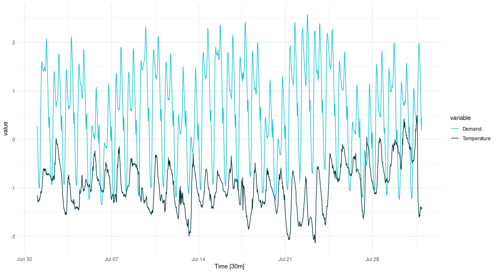
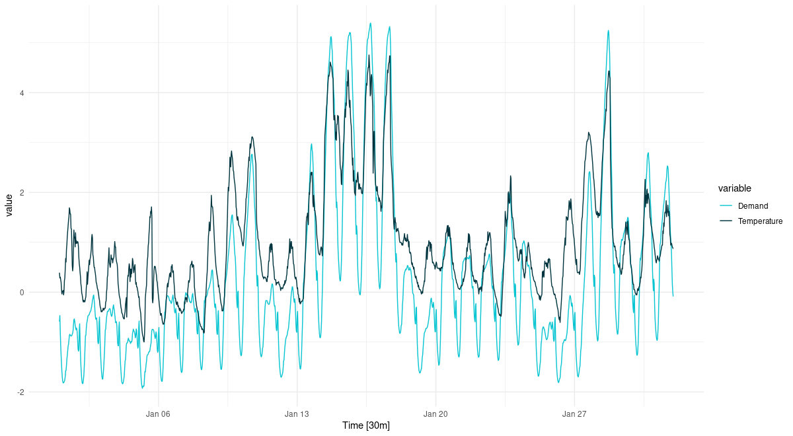
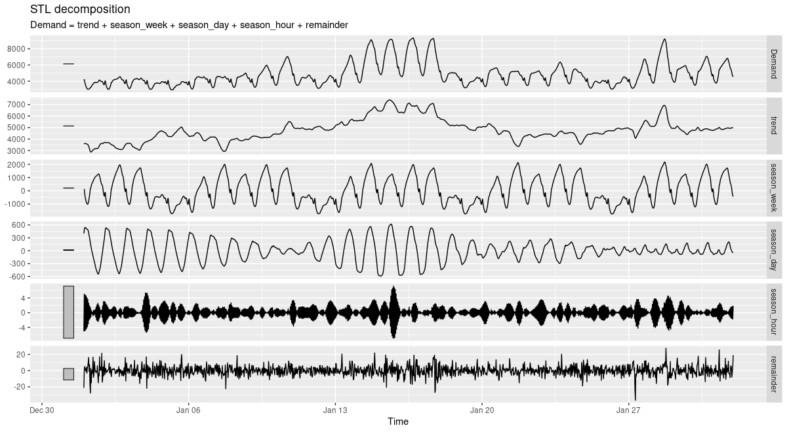
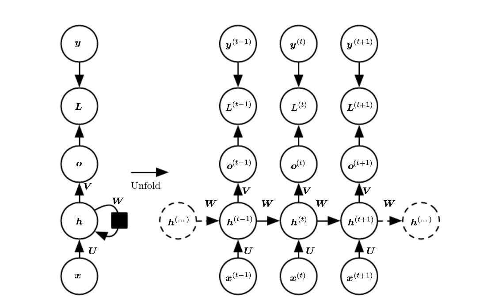
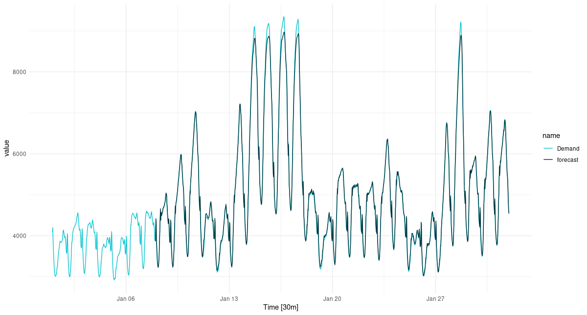
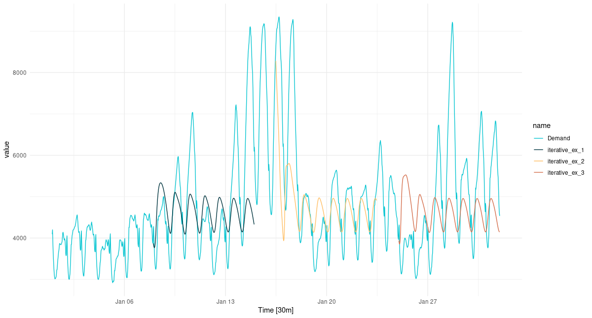

```{r setup, include=FALSE}
knitr::opts_chunk$set(echo = TRUE, eval = FALSE)
```

This is the first post in a series introducing time-series forecasting with `torch`. It does assume some prior experience with `torch` and/or deep learning. But as far as time series are concerned, it starts right from the beginning, using recurrent neural networks (GRU or LSTM) to predict how something develops in time.

In this post, we build a network that uses a sequence of observations to predict a value for the very next point in time. What if we'd like to forecast a *sequence* of values, corresponding to, say, a week or a month of measurements?

One thing we could do is feed back into the system the previously forecasted value; this is something we'll try at the end of this post. Subsequent posts will explore other options, some of them involving significantly more complex architectures. It will be interesting to compare their performances; but the essential goal is to introduce some `torch` "recipes" that you can apply to your own data.

We start by examining the dataset used. It is a low-dimensional, but pretty polyvalent and complex one.

# Time-series inspection

The `vic_elec` dataset, available through package `tsibbledata`, provides three years of half-hourly electricity demand for Victoria, Australia, augmented by same-resolution temperature information and a daily holiday indicator.

```{r}
library(tidyverse)
library(lubridate)

library(tsibble) # Tidy Temporal Data Frames and Tools
library(feasts) # Feature Extraction and Statistics for Time Series
library(tsibbledata) # Diverse Datasets for 'tsibble'

vic_elec %>% glimpse()
```

    Rows: 52,608
    Columns: 5
    $ Time        <dttm> 2012-01-01 00:00:00, 2012-01-01 00:30:00, 2012-01-01 01:00:00,…
    $ Demand      <dbl> 4382.825, 4263.366, 4048.966, 3877.563, 4036.230, 3865.597, 369…
    $ Temperature <dbl> 21.40, 21.05, 20.70, 20.55, 20.40, 20.25, 20.10, 19.60, 19.10, …
    $ Date        <date> 2012-01-01, 2012-01-01, 2012-01-01, 2012-01-01, 2012-01-01, 20…
    $ Holiday     <lgl> TRUE, TRUE, TRUE, TRUE, TRUE, TRUE, TRUE, TRUE, TRUE, TRUE, TRU…

Depending on what subset of variables is used, and whether and how data is temporally aggregated, these data may serve to illustrate a variety of different techniques. For example, in the third edition of [Forecasting: Principles and Practice](https://otexts.com/fpp3/) daily averages are used to teach [quadratic regression with ARMA errors](https://otexts.com/fpp3/forecasting.html). In this first introductory post though, as well as in most of its successors, we'll attempt to forecast `Demand` without relying on additional information, and we keep the original resolution.

To get an impression of how electricity demand varies over different timescales. Let's inspect data for two months that nicely illustrate the U-shaped relationship between temperature and demand: January, 2014 and July, 2014.

First, here is July.

```{r}
vic_elec_2014 <-  vic_elec %>%
  filter(year(Date) == 2014) %>%
  select(-c(Date, Holiday)) %>%
  mutate(Demand = scale(Demand), Temperature = scale(Temperature)) %>%
  pivot_longer(-Time, names_to = "variable") %>%
  update_tsibble(key = variable)

vic_elec_2014 %>% filter(month(Time) == 7) %>% 
  autoplot() + 
  scale_colour_manual(values = c("#08c5d1", "#00353f")) +
  theme_minimal()

```

```{r, eval = TRUE, echo = FALSE, layout="l-page", fig.cap="Temperature and electricity demand (normalized). Victoria, Australia, 07/2014."}


```

It's winter; temperature fluctuates below average, while electricity demand is above average (heating). There is strong variation over the course of the day; we see troughs in the demand curve corresponding to ridges in the temperature graph, and vice versa. While diurnal variation dominates, there is hebdomadal variation as well. Between weeks though, we don't see much difference.

Compare this with the data for January:

```{r}
vic_elec_2014 %>% filter(month(Time) == 1) %>% 
  autoplot() + 
  scale_colour_manual(values = c("#08c5d1", "#00353f")) +
  theme_minimal()
```

```{r, eval = TRUE, echo = FALSE, layout="l-page", fig.cap="Temperature and electricity demand (normalized). Victoria, Australia, 01/2014."}


```

We still see the strong circadian variation. We still see lower demand on weekends, but now it is *high* temperatures that cause elevated demand (cooling). Also, there are two periods of unusually high temperatures, accompanied by exceptional demand. We anticipate that in a univariate forecast, not taking into account temperature, this will be hard -- or even, impossible -- to forecast.

Let's see a concise portrait of how `Demand` behaves using `feasts::STL()`. First, here is the decomposition for July:

```{r}
vic_elec_2014 <-  vic_elec %>%
  filter(year(Date) == 2014) %>%
  select(-c(Date, Holiday))

cmp <- vic_elec_2014 %>% filter(month(Time) == 7) %>%
  model(STL(Demand)) %>% 
  components()

cmp %>% autoplot()
```

```{r, eval = TRUE, echo = FALSE, layout="l-page", fig.cap="STL decomposition of electricity demand. Victoria, Australia, 07/2014."}
knitr::include_graphics("images/july_stl.png")
```

And here, for January:

```{r, eval = TRUE, echo = FALSE, layout="l-page", fig.cap="STL decomposition of electricity demand. Victoria, Australia, 01/2014."}

```

Both nicely illustrate the strong circadian and weekly seasonalities (with diurnal variation substantially stronger in January). If we look closely, we can even see how the trend component is more influential in January than in July. This again hints at much stronger difficulties predicting the January than the July developments.

Now that we have an idea what awaits us, let's begin by creating a `torch` `dataset`.

# Data input

For that purpose, we need to be able to clearly formulate what we intend to do.

We want to start our journey into forecasting by using a sequence of observations to predict their immediate successor. In other words, the input (`x`) for each batch item is a vector, while the target (`y`) is a single value. The length of the input sequence, `x`, is parameterized as `n_timesteps`, the number of consecutive observations to extrapolate from.

The `dataset` will reflect this in its `.getitem()` method. When asked for the observations at index `i`, it will return tensors like so:

```{r}
list(
      x = self$x[start:end, drop = FALSE],
      y = self$x[end+1]
)
```

where `start:end` is a vector of indices, of length `n_timesteps`, and `end+1` is a single index.

Now, if the `dataset` just iterated over its input in order, advancing the index one at a time, these lines could simply read

```{r}
list(
      x = self$x[i:(i + self$n_timesteps - 1), drop = FALSE],
      y = self$x[self$n_timesteps + 1]
)
```

But since many sequences in the data are similar, we can reduce training time by just making use of a fraction of the data in every epoch. This can be accomplished by (optionally) passing a `sample_frac` smaller than 1. In `initialize()`, a random set of start indices is prepared; `.getitem()` then just does what it normally does: look for the `(x,y)` pair at a given index.

Here is the complete `dataset` code:

```{r}
elec_dataset <- dataset(
  name = "elec_dataset",
  
  initialize = function(x, n_timesteps, sample_frac = 1) {

    self$n_timesteps <- n_timesteps
    self$x <- torch_tensor((x - train_mean) / train_sd)
    
    n <- length(self$x) - self$n_timesteps 
    
    self$starts <- sort(sample.int(
      n = n,
      size = n * sample_frac
    ))

  },
  
  .getitem = function(i) {
    
    start <- self$starts[i]
    end <- start + self$n_timesteps - 1
    
    list(
      x = self$x[start:end, drop = FALSE],
      y = self$x[end + 1]
    )

  },
  
  .length = function() {
    length(self$starts) 
  }
)
```

You may have noticed that we normalize the data by globally defined `train_mean` and `train_sd`. We yet have to calculate those.

The way we split the data is straightforward. We use the whole of 2012 for training, and all of 2013 for validation. For testing, we take the "difficult" month of January, 2014. You are invited to compare testing results for July that same year, and compare performances.

```{r}
vic_elec_get_year <- function(year, month = NULL) {
  vic_elec %>%
    filter(year(Date) == year, month(Date) == if (is.null(month)) month(Date) else month) %>%
    as_tibble() %>%
    select(Demand)
}

elec_train <- vic_elec_get_year(2012) %>% as.matrix()
elec_valid <- vic_elec_get_year(2013) %>% as.matrix()
elec_test <- vic_elec_get_year(2014, 1) %>% as.matrix() # or 2014, 7, alternatively

train_mean <- mean(elec_train)
train_sd <- sd(elec_train)
```

Now, to instantiate a `dataset`, we still need to pick sequence length. From prior inspection, a week seems like a sensible choice.

```{r}
n_timesteps <- 7 * 24 * 2 # days * hours * half-hours
```

Now we can go ahead and create a `dataset` for the training data. Let's say we'll make use of 50% of the data in each epoch:

```{r}
train_ds <- elec_dataset(elec_train, n_timesteps, sample_frac = 0.5)
length(train_ds)
```

     8615

Quick check: Are the shapes correct?

```{r}
train_ds[1]
```

    $x
    torch_tensor
    -0.4141
    -0.5541
    [...]       ### lines removed by me
     0.8204
     0.9399
    ... [the output was truncated (use n=-1 to disable)]
    [ CPUFloatType{336,1} ]

    $y
    torch_tensor
    -0.6771
    [ CPUFloatType{1} ]

Yes: This is what we wanted to see. The input sequence has `n_timesteps` values in the first dimension, and a single one in the second, corresponding to the only feature present, `Demand`. And also as intended, the prediction tensor holds a single value only, corresponding to -- as we know -- `n_timesteps+1`.

So that takes care of a single input-output pair. As usual, batching is arranged for by `torch`'s `dataloader` class. We instantiate one for the training data, and immediately again verify the outcome:

```{r}
batch_size <- 32
train_dl <- train_ds %>% dataloader(batch_size = batch_size, shuffle = TRUE)
length(train_dl)

b <- train_dl %>% dataloader_make_iter() %>% dataloader_next()
b
```

    $x
    torch_tensor
    (1,.,.) = 
      0.4805
      0.3125
    [...]       ### lines removed by me
     -1.1756
     -0.9981
    ... [the output was truncated (use n=-1 to disable)]
    [ CPUFloatType{32,336,1} ]

    $y
    torch_tensor
     0.1890
     0.5405
    [...]       ### lines removed by me
     2.4015
     0.7891
    ... [the output was truncated (use n=-1 to disable)]
    [ CPUFloatType{32,1} ]

We see the added batch dimension in front, resulting in overall shape `(batch_size, n_timesteps, num_features)`. This is the format expected by the model, or more precisely, by its initial RNN layer.

Before we go on, let's just quickly create `dataset`s and `dataloader`s for validation and test data, as well.

```{r}
valid_ds <- elec_dataset(elec_valid, n_timesteps)
valid_dl <- valid_ds %>% dataloader(batch_size = batch_size)

test_ds <- elec_dataset(elec_test, n_timesteps)
test_dl <- test_ds %>% dataloader(batch_size = 1)
```

# Model

The model consists of an RNN -- of type GRU or LSTM, as per the user's choice -- and an output layer. The RNN does most of the work; the single-neuron linear layer that outputs the prediction just compresses its vector input to a single value.

Here first is the model definition; read on for a more detailed explanation.

```{r}
model <- nn_module(
  
  initialize = function(type, input_size, hidden_size, num_layers = 1, dropout = 0) {
    
    self$type <- type
    self$num_layers <- num_layers
    
    self$rnn <- if (self$type == "gru") {
      nn_gru(
        input_size = input_size,
        hidden_size = hidden_size,
        num_layers = num_layers,
        dropout = dropout,
        batch_first = TRUE
      )
    } else {
      nn_lstm(
        input_size = input_size,
        hidden_size = hidden_size,
        num_layers = num_layers,
        dropout = dropout,
        batch_first = TRUE
      )
    }
    
    self$output <- nn_linear(hidden_size, 1)
    
  },
  
  forward = function(x) {
    
    # list of [output, hidden]
    # we use the output, which is of size (batch_size, n_timesteps, hidden_size)
    x <- self$rnn(x)[[1]]
    
    # from the output, we only want the final timestep
    # shape now is (batch_size, hidden_size)
    x <- x[ , dim(x)[2], ]
    
    # feed this to a single output neuron
    # final shape then is (batch_size, 1)
    x %>% self$output() 
  }
  
)
```

Most importantly, this is what happens in `forward()`.

1.  The RNN returns a list. The list holds two tensors, an *output* and a synopsis of *hidden states*. We discard the state tensor, and keep the output only. The distinction between state and output, or rather, the way it is reflected in what a `torch` RNN returns, deserves to be inspected more closely. We'll do that in a second.

    ```{r}
    x <- self$rnn(x)[[1]]
    ```

2.  Of the output tensor, we're interested in only the final time-step, though.

    ```{r}
    x <- x[ , dim(x)[2], ]
    ```

3.  Only this one, thus, is passed to the output layer.

    ```{r}
    x %>% self$output()
    ```

4.  Finally, the said output layer's output is returned.

Now, a bit more on *states* vs. *outputs*. Consider Fig. 1, from @Goodfellow-et-al-2016.

```{r, eval = TRUE, echo = FALSE, layout="l-body-outset", fig.cap="Source: Goodfellow et al., Deep learning. Chapter URL: https://www.deeplearningbook.org/contents/rnn.html."}


```

Let's pretend there are three time steps only, corresponding to $t-1$, $t$, and $t+1$. The input sequence, accordingly, is composed of $x_{t-1}$, $x_{t}$, and $x_{t+1}$.

At each $t$, a hidden state is generated, and so is an output. Normally, if our goal is to predict $y_{t+2}$, that is, the very next observation, we want to take into account the complete input sequence. Put differently, we want to have run through the complete machinery of state updates. The logical thing to do would thus be to choose $o_{t+1}$, for either direct return from `forward()` or for further processing.

Indeed, return $o_{t+1}$ is what a Keras LSTM or GRU would do by default.[^1] Not so its `torch` counterparts. In `torch`, the output tensor comprises all of $o$. This is why, in step two above, we select the single time step we're interested in -- namely, the last one.

[^1]: By default means that if the optional `return_sequences` argument is not passed. See [here](https://blogs.rstudio.com/ai/posts/2020-12-17-torch-convlstm/#interlude-outputs-states-hidden-values-whats-what) for a systematic comparison of RNN return values for both `torch` and Keras.

In later posts, we will make use of more than the last time step. Sometimes, we'll use the sequence of hidden states (the $h$s) instead of the outputs (the $o$s). So you may feel like asking, what if we used $h_{t+1}$ here instead of $o_{t+1}$? The answer is: With a GRU, this would not make a difference, as those two are identical. With LSTM though, it would, as LSTM keeps a second, namely, the "cell", state[^2].

[^2]: Again, see [this post](https://blogs.rstudio.com/ai/posts/2020-12-17-torch-convlstm/#interlude-outputs-states-hidden-values-whats-what) for more details.

Now that we've talked about `forward()`, less is to be said about `initialize()`. For ease of experimentation, we instantiate either a GRU or an LSTM based on user input. Two things are worth noting:

-   We pass `batch_first = TRUE` when creating the RNNs. This is required with `torch` RNNs when we want to consistently have batch items stacked in the first dimension. And we *do* want that; it is arguably less confusing than a change of dimension semantics for one sub-type of module.

-   `num_layers` can be used to build a stacked RNN, corresponding to what you'd get in Keras when chaining two GRUs/LSTMs (the first one created with `return_sequences = TRUE`). This parameter, too, we've included for quick experimentation.

Let's instantiate a model for training. It will be a single-layer GRU with thirty-two units.

```{r}
# training RNNs on the GPU currently prints a warning that may clutter 
# the console
# see https://github.com/mlverse/torch/issues/461
# alternatively, use 
# device <- "cpu"
device <- torch_device(if (cuda_is_available()) "cuda" else "cpu")

net <- model("gru", 1, 32)
net <- net$to(device = device)
```

# Training

After all those RNN specifics, the training process is completely standard.

```{r}
optimizer <- optim_adam(net$parameters, lr = 0.001)

num_epochs <- 10

train_batch <- function(b) {
  
  optimizer$zero_grad()
  output <- net(b$x$to(device = device))
  target <- b$y$to(device = device)
  
  loss <- nnf_mse_loss(output, target)
  loss$backward()
  optimizer$step()
  
  loss$item()
}

valid_batch <- function(b) {
  
  output <- net(b$x$to(device = device))
  target <- b$y$to(device = device)
  
  loss <- nnf_mse_loss(output, target)
  loss$item()
  
}

for (epoch in 1:num_epochs) {
  
  net$train()
  train_loss <- c()
  
  coro::loop(for (b in train_dl) {
    loss <-train_batch(b)
    train_loss <- c(train_loss, loss)
  })
  
  cat(sprintf("\nEpoch %d, training: loss: %3.5f \n", epoch, mean(train_loss)))
  
  net$eval()
  valid_loss <- c()
  
  coro::loop(for (b in valid_dl) {
    loss <- valid_batch(b)
    valid_loss <- c(valid_loss, loss)
  })
  
  cat(sprintf("\nEpoch %d, validation: loss: %3.5f \n", epoch, mean(valid_loss)))
}

```

    Epoch 1, training: loss: 0.18820 

    Epoch 1, validation: loss: 0.04727 

    Epoch 2, training: loss: 0.03227 

    Epoch 2, validation: loss: 0.03104 

    Epoch 3, training: loss: 0.02383 

    Epoch 3, validation: loss: 0.02299 

    Epoch 4, training: loss: 0.01890 

    Epoch 4, validation: loss: 0.01752 

    Epoch 5, training: loss: 0.01574 

    Epoch 5, validation: loss: 0.01441 

    Epoch 6, training: loss: 0.01372 

    Epoch 6, validation: loss: 0.01346 

    Epoch 7, training: loss: 0.01276 

    Epoch 7, validation: loss: 0.01198 

    Epoch 8, training: loss: 0.01229 

    Epoch 8, validation: loss: 0.01126 

    Epoch 9, training: loss: 0.01197 

    Epoch 9, validation: loss: 0.01093 

    Epoch 10, training: loss: 0.01148 

    Epoch 10, validation: loss: 0.01103 

Loss decreases quickly, and we don't seem to be overfitting on the validation set.

Numbers are pretty abstract, though. So, we'll use the test set to see how the forecast actually *looks*.

# Evaluation

Here is the forecast for January, 2014, thirty minutes at a time.

```{r}
net$eval()

preds <- rep(NA, n_timesteps)

coro::loop(for (b in test_dl) {
  output <- net(b$x$to(device = device))
  preds <- c(preds, output %>% as.numeric())
})

ic_elec_jan_2014 <-  vic_elec %>%
  filter(year(Date) == 2014, month(Date) == 1) %>%
  select(Demand)

preds_ts <- vic_elec_jan_2014 %>%
  add_column(forecast = preds * train_sd + train_mean) %>%
  pivot_longer(-Time) %>%
  update_tsibble(key = name)

preds_ts %>%
  autoplot() +
  scale_colour_manual(values = c("#08c5d1", "#00353f")) +
  theme_minimal()
```

```{r, eval = TRUE, echo = FALSE, layout="l-page", fig.cap="One-step-ahead predictions for January, 2014."}

```

Overall, the forecast is excellent, but it is interesting to see how the forecast "regularizes" the most extreme peaks. This kind of "regression to the mean" will be seen much more strongly in later setups, when we try to forecast further into the future.

In fact, above we said we'd have a first go at multi-step prediction in this post already. Let's do this now.

With our current architecture, one thing we can do is feed back the current prediction, that is, append it to the input sequence as soon as it is available. Effectively thus, for each batch item, we obtain a sequence of predictions in a loop.

We'll try to forecast 336 time steps, that is, a complete week.

```{r}
n_forecast <- 2 * 24 * 7

test_preds <- vector(mode = "list", length = length(test_dl))

i <- 1

coro::loop(for (b in test_dl) {
  
  input <- b$x
  output <- net(input$to(device = device))
  preds <- as.numeric(output)
  
  for(j in 2:n_forecast) {
    input <- torch_cat(list(input[ , 2:length(input), ], output$view(c(1, 1, 1))), dim = 2)
    output <- net(input$to(device = device))
    preds <- c(preds, as.numeric(output))
  }
  
  test_preds[[i]] <- preds
  i <<- i + 1
  
})

```

For visualization, let's pick three non-overlapping sequences.

```{r}
test_pred1 <- test_preds[[1]]
test_pred1 <- c(rep(NA, n_timesteps), test_pred1, rep(NA, nrow(vic_elec_jan_2014) - n_timesteps - n_forecast))

test_pred2 <- test_preds[[408]]
test_pred2 <- c(rep(NA, n_timesteps + 407), test_pred2, rep(NA, nrow(vic_elec_jan_2014) - 407 - n_timesteps - n_forecast))

test_pred3 <- test_preds[[817]]
test_pred3 <- c(rep(NA, nrow(vic_elec_jan_2014) - n_forecast), test_pred3)


preds_ts <- vic_elec %>%
  filter(year(Date) == 2014, month(Date) == 1) %>%
  select(Demand) %>%
  add_column(
    iterative_ex_1 = test_pred1 * train_sd + train_mean,
    iterative_ex_2 = test_pred2 * train_sd + train_mean,
    iterative_ex_3 = test_pred3 * train_sd + train_mean) %>%
  pivot_longer(-Time) %>%
  update_tsibble(key = name)

preds_ts %>%
  autoplot() +
  scale_colour_manual(values = c("#08c5d1", "#00353f", "#ffbf66", "#d46f4d")) +
  theme_minimal()

```

```{r, eval = TRUE, echo = FALSE, layout="l-body-outset", fig.cap="Multi-step predictions for January, 2014, obtained in a loop."}

```

Even with this very basic forecasting technique, the diurnal rhythm is preserved, albeit in a strongly smoothed form. There is even apparent hebdomadal periodicity in the forecast. We do see, however, very strong regression to the mean, even in loop instances where the network was "primed" with a higher input sequence.

# Conclusion

Hopefully this post provided a useful introduction to time series forecasting with `torch`. Evidently, we picked a challenging time series -- challenging, that is, for at least two reasons:

-   To correctly factor in the trend, external information is needed: external information in form of a temperature forecast, which, "in reality", would be easily obtainable.

-   In addition to the highly important trend component, the data are characterized by multiple levels of seasonality.

Of these, the latter is less of a problem for the techniques we're working with here. If we found that some level of seasonality went undetected, we could try to adapt the current configuration in a number of uncomplicated ways:

-   Use an LSTM instead of a GRU. In theory, LSTM should better be able to capture additional lower-frequency components due to its secondary storage, the cell state.

-   Stack multiple layers of GRU/LSTM. In theory, this should allow for learning a hierarchy of temporal features, analogously to what we see in a convolutional neural network.

To address the former obstacle, bigger changes to the architecture would be needed. We may attempt to do that in a later, "bonus", post. But in the upcoming installments, we'll first dive into often-used techniques for sequence prediction, also porting to numerical time series things that are commonly done in natural language processing.

Thanks for reading!
