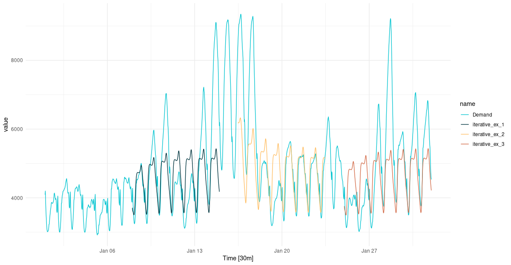

```{r setup, include=FALSE}
knitr::opts_chunk$set(echo = TRUE, eval = FALSE)
```

Today, we continue our exploration of multi-step time-series forecasting with `torch`. This post is the third in a series.

-   [Initially](https://blogs.rstudio.com/ai/posts/2021-03-10-forecasting-time-series-with-torch_1/), we covered basics of recurrent neural networks (RNNs), and trained a model to predict the very next value in a sequence. We also found we could forecast quite a few steps ahead by feeding back individual predictions in a loop.

-   [Next](https://blogs.rstudio.com/ai/posts/2021-03-11-forecasting-time-series-with-torch_2/), we built a model "natively" for multi-step prediction. A small multi-layer-perceptron (MLP) was used to project RNN output to several time points in the future.

Of both approaches, the latter was the more successful. But conceptually, it has an unsatisfying touch to it: When the MLP extrapolates and generates output for, say, ten consecutive points in time, there is no causal relation between those. (Imagine a weather forecast for ten days that never got updated.)

Now, we'd like to try something more intuitively appealing. The input is a sequence; the output is a sequence. In natural language processing (NLP), this type of task is very common: It's exactly the kind of situation we see with machine translation or summarization.

Quite fittingly, the types of models employed to these ends are named sequence-to-sequence models (often abbreviated *seq2seq*). In a nutshell, they split up the task into two components: an encoding and a decoding part. The former is done just once per input-target pair. The latter is done in a loop, as in our first try. But the decoder has more information at its disposal: At each iteration, its processing is based on the previous prediction as well as previous state. That previous state will be the encoder's when a loop is started, and its own ever thereafter.

Before discussing the model in detail, we need to adapt our data input mechanism.

# Data input

We continue working with `vic_elec` , provided by `tsibbledata`.

Again, the dataset definition in the current post looks a bit different from the way it did before; it's the shape of the target that differs. This time, `y` equals `x`, shifted to the left by one.

The reason we do this is owed to the way we are going to train the network. With *seq2seq*, people often use a technique called "teacher forcing" where, instead of feeding back its own prediction into the decoder module, you pass it the value it *should* have predicted. To be clear, this is done during training only, and to a configurable degree.

```{r}
n_timesteps <- 7 * 24 * 2
n_forecast <- n_timesteps

vic_elec_get_year <- function(year, month = NULL) {
  vic_elec %>%
    filter(year(Date) == year, month(Date) == if (is.null(month)) month(Date) else month) %>%
    as_tibble() %>%
    select(Demand)
}

elec_train <- vic_elec_get_year(2012) %>% as.matrix()
elec_valid <- vic_elec_get_year(2013) %>% as.matrix()
elec_test <- vic_elec_get_year(2014, 1) %>% as.matrix()

train_mean <- mean(elec_train)
train_sd <- sd(elec_train)

elec_dataset <- dataset(
  name = "elec_dataset",
  
  initialize = function(x, n_timesteps, sample_frac = 1) {
    
    self$n_timesteps <- n_timesteps
    self$x <- torch_tensor((x - train_mean) / train_sd)
    
    n <- length(self$x) - self$n_timesteps - 1
    
    self$starts <- sort(sample.int(
      n = n,
      size = n * sample_frac
    ))
    
  },
  
  .getitem = function(i) {
    
    start <- self$starts[i]
    end <- start + self$n_timesteps - 1
    lag <- 1
    
    list(
      x = self$x[start:end],
      y = self$x[(start+lag):(end+lag)]$squeeze(2)
    )
    
  },
  
  .length = function() {
    length(self$starts) 
  }
)
```

Dataset as well as dataloader instantations then can proceed as before.

```{r}
batch_size <- 32

train_ds <- elec_dataset(elec_train, n_timesteps, sample_frac = 0.5)
train_dl <- train_ds %>% dataloader(batch_size = batch_size, shuffle = TRUE)

valid_ds <- elec_dataset(elec_valid, n_timesteps, sample_frac = 0.5)
valid_dl <- valid_ds %>% dataloader(batch_size = batch_size)

test_ds <- elec_dataset(elec_test, n_timesteps)
test_dl <- test_ds %>% dataloader(batch_size = 1)
```

# Model

Technically, the model consists of three *modules*: the aforementioned encoder and decoder, and the *seq2seq* module that orchestrates them.

### Encoder

The encoder takes its input and runs it through an RNN. Of the two things returned by a recurrent neural network, outputs and state, so far we've only been using output. This time, we do the opposite: We throw away the outputs, and only return the state.

If the RNN in question is a GRU (and assuming that of the outputs, we take just the final time step, which is what we've been doing throughout), there really is no difference: The final state equals the final output. If it's an LSTM, however, there is a second kind of state, the "cell state". In that case, returning the state instead of the final output will carry more information.

```{r}
encoder_module <- nn_module(
  
  initialize = function(type, input_size, hidden_size, num_layers = 1, dropout = 0) {
    
    self$type <- type
    
    self$rnn <- if (self$type == "gru") {
      nn_gru(
        input_size = input_size,
        hidden_size = hidden_size,
        num_layers = num_layers,
        dropout = dropout,
        batch_first = TRUE
      )
    } else {
      nn_lstm(
        input_size = input_size,
        hidden_size = hidden_size,
        num_layers = num_layers,
        dropout = dropout,
        batch_first = TRUE
      )
    }
    
  },
  
  forward = function(x) {
    
    x <- self$rnn(x)
    
    # return last states for all layers
    # per layer, a single tensor for GRU, a list of 2 tensors for LSTM
    x <- x[[2]]
    x
    
  }
  
)
```

### Decoder

In the decoder, just like in the encoder, the main component is an RNN. In contrast to previously-shown architectures, though, it does not just return a prediction. It also reports back the RNN's final state.

```{r}
decoder_module <- nn_module(
  
  initialize = function(type, input_size, hidden_size, num_layers = 1) {
    
    self$type <- type
    
    self$rnn <- if (self$type == "gru") {
      nn_gru(
        input_size = input_size,
        hidden_size = hidden_size,
        num_layers = num_layers,
        batch_first = TRUE
      )
    } else {
      nn_lstm(
        input_size = input_size,
        hidden_size = hidden_size,
        num_layers = num_layers,
        batch_first = TRUE
      )
    }
    
    self$linear <- nn_linear(hidden_size, 1)
    
  },
  
  forward = function(x, state) {
    
    # input to forward:
    # x is (batch_size, 1, 1)
    # state is (1, batch_size, hidden_size)
    x <- self$rnn(x, state)
    
    # break up RNN return values
    # output is (batch_size, 1, hidden_size)
    # next_hidden is
    c(output, next_hidden) %<-% x
    
    output <- output$squeeze(2)
    output <- self$linear(output)
    
    list(output, next_hidden)
    
  }
  
)
```

### `seq2seq` module

`seq2seq` is where the action happens. The plan is to encode once, then call the decoder in a loop.

If you look back to decoder `forward()`, you see that it takes two arguments: `x` and `state`.

Depending on the context, `x` corresponds to one of three things: final input, preceding prediction, or prior ground truth.

-   The very first time the decoder is called on an input sequence, `x` maps to the final input value. This is different from a task like machine translation, where you would pass in a start token. With time series, though, we'd like to continue where the actual measurements stop.

-   In further calls, we want the decoder to continue from its most recent prediction. It is only logical, thus, to pass back the preceding forecast.

-   That said, in NLP a technique called "teacher forcing" is commonly used to speed up training. With teacher forcing, instead of the forecast we pass the actual ground truth, the thing the decoder should have predicted. We do that only in a configurable fraction of cases, and -- naturally -- only while training. The rationale behind this technique is that without this form of re-calibration, consecutive prediction errors can quickly erase any remaining signal.

`state`, too, is polyvalent. But here, there are just two possibilities: encoder state and decoder state.

-   The first time the decoder is called, it is "seeded" with the final state from the encoder. Note how this is *the only time* we make use of the encoding.

-   From then on, the decoder's own previous state will be passed. Remember how it returns two values, forecast and state?

```{r}
seq2seq_module <- nn_module(
  
  initialize = function(type, input_size, hidden_size, n_forecast, num_layers = 1, encoder_dropout = 0) {
    
    self$encoder <- encoder_module(type = type, input_size = input_size,
                                   hidden_size = hidden_size, num_layers, encoder_dropout)
    self$decoder <- decoder_module(type = type, input_size = input_size,
                                   hidden_size = hidden_size, num_layers)
    self$n_forecast <- n_forecast
    
  },
  
  forward = function(x, y, teacher_forcing_ratio) {
    
    # prepare empty output
    outputs <- torch_zeros(dim(x)[1], self$n_forecast)$to(device = device)
    
    # encode current input sequence
    hidden <- self$encoder(x)
    
    # prime decoder with final input value and hidden state from the encoder
    out <- self$decoder(x[ , n_timesteps, , drop = FALSE], hidden)
    
    # decompose into predictions and decoder state
    # pred is (batch_size, 1)
    # state is (1, batch_size, hidden_size)
    c(pred, state) %<-% out
    
    # store first prediction
    outputs[ , 1] <- pred$squeeze(2)
    
    # iterate to generate remaining forecasts
    for (t in 2:self$n_forecast) {
      
      # call decoder on either ground truth or previous prediction, plus previous decoder state
      teacher_forcing <- runif(1) < teacher_forcing_ratio
      input <- if (teacher_forcing == TRUE) y[ , t - 1, drop = FALSE] else pred
      input <- input$unsqueeze(3)
      out <- self$decoder(input, state)
      
      # again, decompose decoder return values
      c(pred, state) %<-% out
      # and store current prediction
      outputs[ , t] <- pred$squeeze(2)
    }
    outputs
  }
  
)

net <- seq2seq_module("gru", input_size = 1, hidden_size = 32, n_forecast = n_forecast)

# training RNNs on the GPU currently prints a warning that may clutter 
# the console
# see https://github.com/mlverse/torch/issues/461
# alternatively, use 
# device <- "cpu"
device <- torch_device(if (cuda_is_available()) "cuda" else "cpu")

net <- net$to(device = device)
```

# Training

The training procedure is *mainly* unchanged. We do, however, need to decide about `teacher_forcing_ratio`, the proportion of input sequences we want to perform re-calibration on. In `valid_batch()`, this should always be `0`, while in `train_batch()`, it's up to us (or rather, experimentation). Here, we set it to `0.3`.

```{r}
optimizer <- optim_adam(net$parameters, lr = 0.001)

num_epochs <- 50

train_batch <- function(b, teacher_forcing_ratio) {
  
  optimizer$zero_grad()
  output <- net(b$x$to(device = device), b$y$to(device = device), teacher_forcing_ratio)
  target <- b$y$to(device = device)
  
  loss <- nnf_mse_loss(output, target)
  loss$backward()
  optimizer$step()
  
  loss$item()
  
}

valid_batch <- function(b, teacher_forcing_ratio = 0) {
  
  output <- net(b$x$to(device = device), b$y$to(device = device), teacher_forcing_ratio)
  target <- b$y$to(device = device)
  
  loss <- nnf_mse_loss(output, target)
  
  loss$item()
  
}

for (epoch in 1:num_epochs) {
  
  net$train()
  train_loss <- c()
  
  coro::loop(for (b in train_dl) {
    loss <-train_batch(b, teacher_forcing_ratio = 0.3)
    train_loss <- c(train_loss, loss)
  })
  
  cat(sprintf("\nEpoch %d, training: loss: %3.5f \n", epoch, mean(train_loss)))
  
  net$eval()
  valid_loss <- c()
  
  coro::loop(for (b in valid_dl) {
    loss <- valid_batch(b)
    valid_loss <- c(valid_loss, loss)
  })
  
  cat(sprintf("\nEpoch %d, validation: loss: %3.5f \n", epoch, mean(valid_loss)))
}

```

    Epoch 1, training: loss: 0.37961 

    Epoch 1, validation: loss: 1.10699 

    Epoch 2, training: loss: 0.19355 

    Epoch 2, validation: loss: 1.26462 

    # ...
    # ...

    Epoch 49, training: loss: 0.03233 

    Epoch 49, validation: loss: 0.62286 

    Epoch 50, training: loss: 0.03091 

    Epoch 50, validation: loss: 0.54457

It's interesting to compare performances for different settings of `teacher_forcing_ratio`. With a setting of `0.5`, training loss decreases a lot more slowly; the opposite is seen with a setting of `0`. Validation loss, however, is not affected significantly.

# Evaluation

The code to inspect test-set forecasts is unchanged.

```{r}
net$eval()

test_preds <- vector(mode = "list", length = length(test_dl))

i <- 1

coro::loop(for (b in test_dl) {
  
  input <- b$x
  output <- net(input$to(device = device))
  preds <- as.numeric(output)
  
  test_preds[[i]] <- preds
  i <<- i + 1
  
})

vic_elec_jan_2014 <- vic_elec %>%
  filter(year(Date) == 2014, month(Date) == 1)

test_pred1 <- test_preds[[1]]
test_pred1 <- c(rep(NA, n_timesteps), test_pred1, rep(NA, nrow(vic_elec_jan_2014) - n_timesteps - n_forecast))

test_pred2 <- test_preds[[408]]
test_pred2 <- c(rep(NA, n_timesteps + 407), test_pred2, rep(NA, nrow(vic_elec_jan_2014) - 407 - n_timesteps - n_forecast))

test_pred3 <- test_preds[[817]]
test_pred3 <- c(rep(NA, nrow(vic_elec_jan_2014) - n_forecast), test_pred3)


preds_ts <- vic_elec_jan_2014 %>%
  select(Demand) %>%
  add_column(
    mlp_ex_1 = test_pred1 * train_sd + train_mean,
    mlp_ex_2 = test_pred2 * train_sd + train_mean,
    mlp_ex_3 = test_pred3 * train_sd + train_mean) %>%
  pivot_longer(-Time) %>%
  update_tsibble(key = name)


preds_ts %>%
  autoplot() +
  scale_colour_manual(values = c("#08c5d1", "#00353f", "#ffbf66", "#d46f4d")) +
  theme_minimal()
```

```{r, eval = TRUE, echo = FALSE, layout="l-page", fig.cap="One-week-ahead predictions for January, 2014."}

```

Comparing this to the forecast obtained from last time's RNN-MLP combo, we don't see much of a difference. Is this surprising? To me it is. If asked to speculate about the reason, I would probably say this: In all of the architectures we've used so far, the main carrier of information has been the final hidden state of the RNN (*one and only* RNN in the two previous setups, *encoder* RNN in this one). It will be interesting to see what happens in the last part of this series, when we augment the encoder-decoder architecture by *attention*.

Thanks for reading!

Photo by <a href="https://unsplash.com/@innocentrip?utm_source=unsplash&utm_medium=referral&utm_content=creditCopyText">Suzuha Kozuki</a> on <a href="/?utm_source=unsplash&utm_medium=referral&utm_content=creditCopyText">Unsplash</a>
