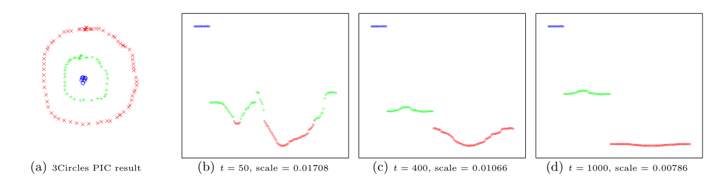

```{r setup, include=FALSE}
knitr::opts_chunk$set(echo = FALSE)
```

[`Sparklyr`](https://sparklyr.ai) 1.6 is now available on [CRAN](https://cran.r-project.org/web/packages/sparklyr/index.html)!

To install `sparklyr` 1.6 from CRAN, run

```{r echo=TRUE, eval=FALSE}
install.packages("sparklyr")
```

In this blog post, we shall highlight the following features and enhancements
from `sparklyr` 1.6:

 * [Weighted quantile summaries](#weighted-quantile-summaries)
 * [Power iteration clustering](#power-iteration-clustering)
 * [`spark_write_rds()` + `collect_from_rds()`](#spark_write_rds-collect_from_rds)
 * [Dplyr-related improvements](#dplyr-related-improvements)

## Weighted quantile summaries

[Apache Spark](https://spark.apache.org) is well-known for supporting
approximate algorithms that trade off marginal amounts of accuracy for greater
speed and parallelism.
Such algorithms are particularly beneficial for performing preliminary data
explorations at scale, as they enable users to quickly query certain estimated
statistics within a predefined error margin, while avoiding the high cost of
exact computations.
One example is the Greenwald-Khanna algorithm for on-line computation of quantile
summaries, as described in @10.1145/376284.375670.
This algorithm was originally designed for efficient $\epsilon$-
approximation of quantiles within a large dataset *without* the notion of data
points carrying different weights, and the unweighted version of it has been
implemented as
[`approxQuantile()`](https://spark.apache.org/docs/2.0.0/api/java/org/apache/spark/sql/DataFrameStatFunctions.html#approxQuantile(java.lang.String,%20double[],%20double))
 since Spark 2.0.
 However, the same algorithm can be generalized to handle weighted
inputs, and as `sparklyr` user [\@Zhuk66](https://github.com/Zhuk66) mentioned
in [this issue](https://github.com/sparklyr/sparklyr/issues/2915), a
[weighted version](https://github.com/sparklyr/sparklyr/blob/4b6bc6677ecf92787ab3521f364a8d80b973d92f/java/spark-1.5.2/weightedquantilesummaries.scala#L13-L332)
of this algorithm makes for a useful `sparklyr` feature.

To properly explain what weighted-quantile means, we must clarify what the
weight of each data point signifies. For example, if we have a sequence of
observations $(1, 1, 1, 1, 0, 2, -1, -1)$, and would like to approximate the
median of all data points, then we have the following two options:

* Either run the unweighted version of `approxQuantile()` in Spark to scan
through all 8 data points

* Or alternatively, "compress" the data into 4 tuples of (value, weight):
$((1, 0.5), (0, 0.125), (2, 0.125), (-1, 0.25))$, where the second component of
each tuple represents how often a value occurs relative to the rest of the
observed values, and then find the median by scanning through the 4 tuples
using the weighted version of the Greenwald-Khanna algorithm

We can also run through a contrived example involving the standard normal
distribution to illustrate the power of weighted quantile estimation in
`sparklyr` 1.6. Suppose we cannot simply run `qnorm()` in R to evaluate the
[quantile function](https://en.wikipedia.org/wiki/Normal_distribution#Quantile_function)
of the standard normal distribution at $p = 0.25$ and $p = 0.75$, how can
we get some vague idea about the 1st and 3rd quantiles of this distribution?
One way is to sample a large number of data points from this distribution, and
then apply the Greenwald-Khanna algorithm to our unweighted samples, as shown
below:

```{r echo=TRUE, eval=FALSE}
library(sparklyr)

sc <- spark_connect(master = "local")

num_samples <- 1e6
samples <- data.frame(x = rnorm(num_samples))

samples_sdf <- copy_to(sc, samples, name = random_string())

samples_sdf %>%
  sdf_quantile(
    column = "x",
    probabilities = c(0.25, 0.75),
    relative.error = 0.01
  ) %>%
  print()
```

```
##        25%        75%
## -0.6629242  0.6874939
```

Notice that because we are working with an approximate algorithm, and have specified
`relative.error = 0.01`, the estimated value of $-0.6629242$ from above
could be anywhere between the 24th and the 26th percentile of all samples.
In fact, it falls in the $25.36896$-th percentile:

```{r echo=TRUE, eval=FALSE}
pnorm(-0.6629242)
```

```
## [1] 0.2536896
```

Now how can we make use of weighted quantile estimation from `sparklyr` 1.6 to
obtain similar results? Simple! We can sample a large number of $x$ values
uniformly randomly from $(-\infty, \infty)$ (or alternatively, just select a
large number of values uniformly spaced between $(-M, M)$ where $M$ is
approximately $\infty$), and assign each $x$ value a weight of
$\displaystyle \frac{1}{\sqrt{2 \pi}}e^{-\frac{x^2}{2}}$, the standard normal
distribution's probability density at $x$. Then, we make `sdf_quantile()` take
both the value column, `"x"`, and the weight column into account, as shown below:

```{r echo=TRUE, eval=FALSE}
library(sparklyr)

sc <- spark_connect(master = "local")

num_samples <- 1e6
M <- 1000
samples <- tibble::tibble(
  x = M * seq(-num_samples / 2 + 1, num_samples / 2) / num_samples,
  weight = dnorm(x)
)

samples_sdf <- copy_to(sc, samples, name = random_string())

samples_sdf %>%
  sdf_quantile(
    column = "x",
    weight.column = "weight",
    probabilities = c(0.25, 0.75),
    relative.error = 0.01
  ) %>%
  print()
```
```
##    25%    75%
## -0.696  0.662
```

Voilà! The estimates are not too far off from the 25th and 75th percentiles (in
relation to our abovementioned maximum permissible error of $0.01$):

```{r echo=TRUE, eval=FALSE}
pnorm(-0.696)
```
```
## [1] 0.2432144
```
```{r echo=TRUE, eval=FALSE}
pnorm(0.662)
```
```
## [1] 0.7460144
```

## Power iteration clustering

Power iteration clustering (PIC), a simple and scalable graph clustering method
presented in @PIC, first finds a low-dimensional embedding of a dataset, using
truncated power iteration on a normalized pairwise-similarity matrix of all data
points, and then uses this embedding as the "cluster indicator", an intermediate
representation of the dataset that leads to fast convergence when used as input
to k-means clustering. This process is very well illustrated in figure 1
of @PIC (reproduced below)

```{r, echo=FALSE, eval=TRUE}

```

in which the leftmost image is the visualization of a dataset consisting of 3
circles, with points colored in red, green, and blue indicating clustering
results, and the subsequent images show the power iteration process gradually
transforming the original set of points into what appears to be three disjoint line
segments, an intermediate representation that can be rapidly separated into 3
clusters using k-means clustering with $k = 3$.

In `sparklyr` 1.6, `ml_power_iteration()` was implemented to make the
[PIC functionality](http://spark.apache.org/docs/latest/api/java/org/apache/spark/ml/clustering/PowerIterationClustering.html)
in Spark accessible from R. It expects as input a 3-column Spark dataframe that
represents a pairwise-similarity matrix of all data points. Two of
the columns in this dataframe should contain 0-based row and column indices, and
the third column should hold the corresponding similarity measure.
In the example below, we will see a dataset consisting of two circles being
easily separated into two clusters by `ml_power_iteration()`, with the Gaussian
kernel being used as the similarity measure between any 2 points:

```{r echo=TRUE, eval=FALSE}
gen_similarity_matrix <- function() {
  # Guassian similarity measure
  guassian_similarity <- function(pt1, pt2) {
    exp(-sum((pt2 - pt1) ^ 2) / 2)
  }
  # generate evenly distributed points on a circle centered at the origin
  gen_circle <- function(radius, num_pts) {
    seq(0, num_pts - 1) %>%
      purrr::map_dfr(
        function(idx) {
          theta <- 2 * pi * idx / num_pts
          radius * c(x = cos(theta), y = sin(theta))
        })
  }
  # generate points on both circles
  pts <- rbind(
    gen_circle(radius = 1, num_pts = 80),
    gen_circle(radius = 4, num_pts = 80)
  )
  # populate the pairwise similarity matrix (stored as a 3-column dataframe)
  similarity_matrix <- data.frame()
  for (i in seq(2, nrow(pts)))
    similarity_matrix <- similarity_matrix %>%
      rbind(seq(i - 1L) %>%
        purrr::map_dfr(~ list(
          src = i - 1L, dst = .x - 1L,
          similarity = guassian_similarity(pts[i,], pts[.x,])
        ))
      )

  similarity_matrix
}

library(sparklyr)

sc <- spark_connect(master = "local")
sdf <- copy_to(sc, gen_similarity_matrix())
clusters <- ml_power_iteration(
  sdf, k = 2, max_iter = 10, init_mode = "degree",
  src_col = "src", dst_col = "dst", weight_col = "similarity"
)

clusters %>% print(n = 160)
```

```
## # A tibble: 160 x 2
##        id cluster
##     <dbl>   <int>
##   1     0       1
##   2     1       1
##   3     2       1
##   4     3       1
##   5     4       1
##   ...
##   157   156       0
##   158   157       0
##   159   158       0
##   160   159       0
```

The output shows points from the two circles being assigned to separate clusters,
as expected, after only a small number of PIC iterations.

## `spark_write_rds()` + `collect_from_rds()`

`spark_write_rds()` and `collect_from_rds()` are implemented as a less memory-
consuming alternative to `collect()`. Unlike `collect()`, which retrieves all
elements of a Spark dataframe through the Spark driver node, hence potentially
causing slowness or out-of-memory failures when collecting large amounts of data,
`spark_write_rds()`, when used in conjunction with `collect_from_rds()`, can
retrieve all partitions of a Spark dataframe directly from Spark workers,
rather than through the Spark driver node.
First, `spark_write_rds()` will
distribute the tasks of serializing Spark dataframe partitions in RDS version
2 format among Spark workers. Spark workers can then process multiple partitions
in parallel, each handling one partition at a time and persisting the RDS output
directly to disk, rather than sending dataframe partitions to the Spark driver
node. Finally, the RDS outputs can be re-assembled to R dataframes using
`collect_from_rds()`.

Shown below is an example of `spark_write_rds()` + `collect_from_rds()` usage,
where RDS outputs are first saved to HDFS, then downloaded to the local
filesystem with `hadoop fs -get`, and finally, post-processed with
`collect_from_rds()`:

```{r echo=TRUE, eval=FALSE}
library(sparklyr)
library(nycflights13)

num_partitions <- 10L
sc <- spark_connect(master = "yarn", spark_home = "/usr/lib/spark")
flights_sdf <- copy_to(sc, flights, repartition = num_partitions)

# Spark workers serialize all partition in RDS format in parallel and write RDS
# outputs to HDFS
spark_write_rds(
  flights_sdf,
  dest_uri = "hdfs://<namenode>:8020/flights-part-{partitionId}.rds"
)

# Run `hadoop fs -get` to download RDS files from HDFS to local file system
for (partition in seq(num_partitions) - 1)
  system2(
    "hadoop",
    c("fs", "-get", sprintf("hdfs://<namenode>:8020/flights-part-%d.rds", partition))
  )

# Post-process RDS outputs
partitions <- seq(num_partitions) - 1 %>%
  lapply(function(partition) collect_from_rds(sprintf("flights-part-%d.rds", partition)))

# Optionally, call `rbind()` to combine data from all partitions into a single R dataframe
flights_df <- do.call(rbind, partitions)
```

## Dplyr-related improvements

Similar to other recent `sparklyr` releases, `sparklyr` 1.6 comes with a
number of dplyr-related improvements, such as

* Support for `where()` predicate within `select()` and `summarize(across(...))`
operations on Spark dataframes
* Addition of `if_all()` and `if_any()` functions
* Full compatibility with `dbplyr` 2.0 backend API

### `select(where(...))` and `summarize(across(where(...)))`

The dplyr `where(...)` construct is useful for applying a selection or
aggregation function to multiple columns that satisfy some boolean predicate.
For example,

```{r echo=TRUE, eval=FALSE}
library(dplyr)

iris %>% select(where(is.numeric))
```
returns all numeric columns from the `iris` dataset, and

```{r echo=TRUE, eval=FALSE}
library(dplyr)

iris %>% summarize(across(where(is.numeric), mean))
```

computes the average of each numeric column.

In sparklyr 1.6, both types of operations can be applied to Spark dataframes, e.g.,

```{r echo=TRUE, eval=FALSE}
library(dplyr)
library(sparklyr)

sc <- spark_connect(master = "local")
iris_sdf <- copy_to(sc, iris, name = random_string())

iris_sdf %>% select(where(is.numeric))

iris %>% summarize(across(where(is.numeric), mean))
```

### `if_all()` and `if_any()`

`if_all()` and `if_any()` are two convenience functions from `dplyr` 1.0.4 (see
[here](https://www.tidyverse.org/blog/2021/02/dplyr-1-0-4-if-any) for more details)
that effectively ^[modulo possible implementation-dependent short-circuit evaluations]
combine the results of applying a boolean predicate to a tidy selection of columns
using the logical `and`/`or` operators.

Starting from sparklyr 1.6, `if_all()` and `if_any()` can also be applied to
Spark dataframes, .e.g.,

```{r echo=TRUE, eval=FALSE}
library(dplyr)
library(sparklyr)

sc <- spark_connect(master = "local")
iris_sdf <- copy_to(sc, iris, name = random_string())

# Select all records with Petal.Width > 2 and Petal.Length > 2
iris_sdf %>% filter(if_all(starts_with("Petal"), ~ .x > 2))

# Select all records with Petal.Width > 5 or Petal.Length > 5
iris_sdf %>% filter(if_any(starts_with("Petal"), ~ .x > 5))
```

### Compatibility with `dbplyr` 2.0 backend API

`Sparklyr` 1.6 is fully compatible with the newer `dbplyr` 2.0 backend API (by
implementing all interface changes recommended in
[here](https://dbplyr.tidyverse.org/articles/backend-2.html)), while still
maintaining backward compatibility with the previous edition of `dbplyr` API, so
that `sparklyr` users will not be forced to switch to any particular version of
`dbplyr`.

This should be a mostly non-user-visible change as of now. In fact, the only
discernible behavior change will be the following code

```{r echo=TRUE, eval=FALSE}
library(dbplyr)
library(sparklyr)

sc <- spark_connect(master = "local")

print(dbplyr_edition(sc))
```

outputting

```
[1] 2
```

if `sparklyr` is working with `dbplyr` 2.0+, and

```
[1] 1
```

if otherwise.

## Acknowledgements

In chronological order, we would like to thank the following contributors for
making `sparklyr` 1.6 awesome:

* [\@yitao-li](https://github.com/yitao-li)
* [\@pgramme](https://github.com/pgramme)
* [\@javierluraschi](https://github.com/javierluraschi)
* [\@andrew-christianson](https://github.com/andrew-christianson)
* [\@jozefhajnala](https://github.com/jozefhajnala)
* [\@nathaneastwood](https://github.com/nathaneastwood)

We would also like to give a big shout-out to the wonderful open-source community
behind `sparklyr`, without whom we would not have benefitted from numerous
`sparklyr`-related bug reports and feature suggestions.

Finally, the author of this blog post also very much appreciates the highly
valuable editorial suggestions from [\@skeydan](https://github.com/skeydan).

If you wish to learn more about `sparklyr`, we recommend checking out
[sparklyr.ai](https://sparklyr.ai), [spark.rstudio.com](https://spark.rstudio.com),
and also some previous `sparklyr` release posts such as
[sparklyr 1.5](https://blogs.rstudio.com/ai/posts/2020-12-14-sparklyr-1.5.0-released/)
and [sparklyr 1.4](https://blogs.rstudio.com/ai/posts/2020-09-30-sparklyr-1.4.0-released/).

That is all. Thanks for reading!
