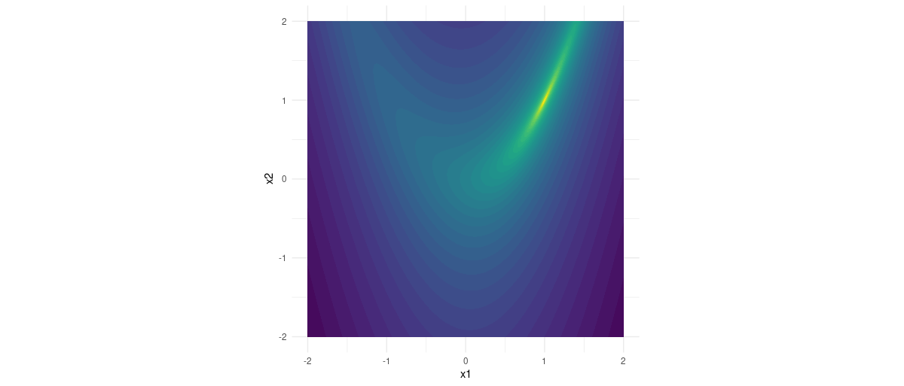

```{r setup, include=FALSE}
knitr::opts_chunk$set(echo = TRUE, eval = FALSE)
```

So far, all `torch` use cases we've discussed here have been in deep learning. However, its automatic differentiation feature is useful in other areas. One prominent example is numerical optimization: We can use `torch` to find the minimum of a function.

In fact, function minimization is *exactly* what happens in training a neural network. But there, the function in question normally is far too complex to even imagine finding its minima analytically. Numerical optimization aims at building up the tools to handle just this complexity. To that end, however, it starts from functions that are far less deeply composed. Instead, they are hand-crafted to pose specific challenges.

This post is a first introduction to numerical optimization with `torch`. Central takeaways are the existence and usefulness of its L-BFGS optimizer, as well as the impact of running L-BFGS with line search. As a fun add-on, we show an example of constrained optimization, where a constraint is enforced via a quadratic penalty function.

To warm up, we take a detour, minimizing a function "ourselves" using nothing but tensors. This will turn out to be relevant later, though, as the overall process will still be the same. All changes will be related to integration of `optimizer`s and their capabilities.

## Function minimization, DYI approach

To see how we can minimize a function "by hand", let's try the iconic [Rosenbrock function](https://en.wikipedia.org/wiki/Rosenbrock_function). This is a function with two variables:

$$
f(x_1, x_2) = (a - x_1)^2 + b * (x_2 - x_1^2)^2
$$

, with $a$ and $b$ configurable parameters often set to 1 and 5, respectively.

In R:

```{r}
library(torch)

a <- 1
b <- 5

rosenbrock <- function(x) {
  x1 <- x[1]
  x2 <- x[2]
  (a - x1)^2 + b * (x2 - x1^2)^2
}
```

Its minimum is located at (1,1), inside a narrow valley surrounded by breakneck-steep cliffs:[^1]

[^1]: The code used to generate this plot is found in the [appendix](#rosenbrock-function-plotting-code).

```{r, eval = TRUE, echo = FALSE, layout="l-page", fig.cap="Rosenbrock function."}

```

Our goal and strategy are as follows.

We want to find the values $x_1$ and $x_2$ for which the function attains its minimum. We have to start somewhere; and from wherever that gets us on the graph we follow the negative of the gradient "downwards", descending into regions of consecutively smaller function value.

Concretely, in every iteration, we take the current $(x1,x2)$ point, compute the function value as well as the gradient, and subtract some fraction of the latter to arrive at a new $(x1,x2)$ candidate. This process goes on until we either reach the minimum -- the gradient is zero -- or improvement is below a chosen threshold.

Here is the corresponding code. For no special reasons, we start at `(-1,1)` . The learning rate (the fraction of the gradient to subtract) needs some experimentation. (Try 0.1 and 0.001 to see its impact.)

```{r}
num_iterations <- 1000

# fraction of the gradient to subtract 
lr <- 0.01

# function input (x1,x2)
# this is the tensor w.r.t. which we'll have torch compute the gradient
x_star <- torch_tensor(c(-1, 1), requires_grad = TRUE)

for (i in 1:num_iterations) {

  if (i %% 100 == 0) cat("Iteration: ", i, "\n")

  # call function
  value <- rosenbrock(x_star)
  if (i %% 100 == 0) cat("Value is: ", as.numeric(value), "\n")

  # compute gradient of value w.r.t. params
  value$backward()
  if (i %% 100 == 0) cat("Gradient is: ", as.matrix(x_star$grad), "\n\n")

  # manual update
  with_no_grad({
    x_star$sub_(lr * x_star$grad)
    x_star$grad$zero_()
  })
}
```

    Iteration:  100 
    Value is:  0.3502924 
    Gradient is:  -0.667685 -0.5771312 

    Iteration:  200 
    Value is:  0.07398106 
    Gradient is:  -0.1603189 -0.2532476 

    ...
    ...

    Iteration:  900 
    Value is:  0.0001532408 
    Gradient is:  -0.004811743 -0.009894371 

    Iteration:  1000 
    Value is:  6.962555e-05 
    Gradient is:  -0.003222887 -0.006653666 

While this works, it really serves to illustrate the principle only. With `torch` providing a bunch of proven optimization algorithms, there is no need for us to manually compute the candidate $\mathbf{x}$ values.

## Function minimization with `torch` optimizers

Instead, we let a `torch` optimizer update the candidate $\mathbf{x}$ for us. Habitually, our first try is *Adam*.

### Adam (?)

With Adam, optimization proceeds a lot faster. Truth be told, though, choosing a good learning rate *still* takes non-negligeable experimentation. (Try the default learning rate, 0.001, for comparison.)

```{r}
num_iterations <- 100

x_star <- torch_tensor(c(-1, 1), requires_grad = TRUE)

lr <- 1
optimizer <- optim_adam(x_star, lr)

for (i in 1:num_iterations) {
  
  if (i %% 10 == 0) cat("Iteration: ", i, "\n")
  
  optimizer$zero_grad()
  value <- rosenbrock(x_star)
  if (i %% 10 == 0) cat("Value is: ", as.numeric(value), "\n")
  
  value$backward()
  optimizer$step()
  
  if (i %% 10 == 0) cat("Gradient is: ", as.matrix(x_star$grad), "\n\n")
  
}

```

    Iteration:  10 
    Value is:  0.8559565 
    Gradient is:  -1.732036 -0.5898831 

    Iteration:  20 
    Value is:  0.1282992 
    Gradient is:  -3.22681 1.577383 

    ...
    ...

    Iteration:  90 
    Value is:  4.003079e-05 
    Gradient is:  -0.05383469 0.02346456 

    Iteration:  100 
    Value is:  6.937736e-05 
    Gradient is:  -0.003240437 -0.006630421 

It took us about a hundred iterations to arrive at a decent value. This is a lot faster than the manual approach above, but still quite a lot. Luckily, further improvements are possible.

### L-BFGS (!)

Among the many `torch` optimizers commonly used in deep learning (Adam, AdamW, RMSprop ...), there is one "outsider", much better known in classic numerical optimization than in neural-networks space: L-BFGS, a.k.a. [Limited-memory BFGS](https://en.wikipedia.org/wiki/Limited-memory_BFGS), a memory-optimized implementation of the [Broyden--Fletcher--Goldfarb--Shanno optimization algorithm](https://en.wikipedia.org/wiki/Broyden%E2%80%93Fletcher%E2%80%93Goldfarb%E2%80%93Shanno_algorithm) (BFGS).

BFGS is perhaps the most widely used among the so-called Quasi-Newton, second-order optimization algorithms. As opposed to the family of first-order algorithms that, in deciding on a descent direction, make use of gradient information only, second-order algorithms additionally take curvature information into account. To that end, exact Newton methods actually compute the Hessian (a costly operation), while Quasi-Newton methods avoid that cost and, instead, resort to iterative approximation.

Looking at the contours of the Rosenbrock function, with its prolonged, narrow valley, it is not difficult to imagine that curvature information might make a difference. And, as you'll see in a second, it really does. Before though, one note on the code. When using L-BFGS, it is necessary to wrap function call and gradient evaluation in a closure (`calc_loss()`, in the below snippet), for them to be callable several times per iteration. You can convince yourself that the closure is, in fact, entered repeatedly, by inspecting this code snippet's chatty output:

```{r}
num_iterations <- 3

x_star <- torch_tensor(c(-1, 1), requires_grad = TRUE)

optimizer <- optim_lbfgs(x_star)

calc_loss <- function() {

  optimizer$zero_grad()

  value <- rosenbrock(x_star)
  cat("Value is: ", as.numeric(value), "\n")

  value$backward()
  cat("Gradient is: ", as.matrix(x_star$grad), "\n\n")
  value

}

for (i in 1:num_iterations) {
  cat("Iteration: ", i, "\n")
  optimizer$step(calc_loss)
}

```

    Iteration:  1 
    Value is:  4 
    Gradient is:  -4 0 

    Value is:  6 
    Gradient is:  -2 10 

    ...
    ...

    Value is:  0.04880721 
    Gradient is:  -0.262119 -0.1132655 

    Value is:  0.0302862 
    Gradient is:  1.293824 -0.7403332 

    Iteration:  2 
    Value is:  0.01697086 
    Gradient is:  0.3468466 -0.3173429 

    Value is:  0.01124081 
    Gradient is:  0.2420997 -0.2347881 

    ...
    ...

    Value is:  1.111701e-09 
    Gradient is:  0.0002865837 -0.0001251698 

    Value is:  4.547474e-12 
    Gradient is:  -1.907349e-05 9.536743e-06 

    Iteration:  3 
    Value is:  4.547474e-12 
    Gradient is:  -1.907349e-05 9.536743e-06 

Even though we ran the algorithm for three iterations, the optimal value really is reached after two. Seeing how well this worked, we try L-BFGS on a slightly more crazy function, named *flower*, for pretty self-evident reasons.

## (Yet) more fun with L-BFGS

Here is the *flower* function.[^2] Mathematically, its minimum is near `(0,0)`, but at `(0,0)` itself it is undefined since the `atan2` used in the function is not defined in that location.

[^2]: The code to plot it is, again, found in the [appendix](#flower-function-plotting-code).

```{r}
a <- 1
b <- 1
c <- 4

flower <- function(x) {
  a * torch_norm(x) + b * torch_sin(c * torch_atan2(x[2], x[1]))
}
```

```{r, eval = TRUE, echo = FALSE, layout="l-page", fig.cap="Flower function."}
knitr::include_graphics("images/flower.png")
```

We now run the same code as above, starting from `(20,20)` this time.

```{r}
num_iterations <- 3

x_star <- torch_tensor(c(20, 0), requires_grad = TRUE)

optimizer <- optim_lbfgs(x_star)

calc_loss <- function() {

  optimizer$zero_grad()

  value <- flower(x_star)
  cat("Value is: ", as.numeric(value), "\n")

  value$backward()
  cat("Gradient is: ", as.matrix(x_star$grad), "\n")
  
  cat("X is: ", as.matrix(x_star), "\n\n")
  
  value

}

for (i in 1:num_iterations) {
  cat("Iteration: ", i, "\n")
  optimizer$step(calc_loss)
}
```

    Iteration:  1 
    Value is:  28.28427 
    Gradient is:  0.8071069 0.6071068 
    X is:  20 20 

    ...
    ...

    Value is:  19.33546 
    Gradient is:  0.8100872 0.6188223 
    X is:  12.957 14.68274 

    ...
    ...

    Value is:  18.29546 
    Gradient is:  0.8096464 0.622064 
    X is:  12.14691 14.06392 

    ...
    ...

    Value is:  9.853705 
    Gradient is:  0.7546976 0.7025688 
    X is:  5.763702 8.895616 

    Value is:  2635.866 
    Gradient is:  -0.7407354 -0.6717985 
    X is:  -1949.697 -1773.551 

    Iteration:  2 
    Value is:  1333.113 
    Gradient is:  -0.7413024 -0.6711776 
    X is:  -985.4553 -897.5367 

    Value is:  30.16862 
    Gradient is:  -0.7903821 -0.6266789 
    X is:  -21.02814 -21.72296 

    Value is:  1281.39 
    Gradient is:  0.7544561 0.6563575 
    X is:  964.0121 843.7817 

    Value is:  628.1306 
    Gradient is:  0.7616636 0.6480014 
    X is:  475.7051 409.7372 

    Value is:  4965690 
    Gradient is:  -0.7493951 -0.662123 
    X is:  -3721262 -3287901 

    Value is:  2482306 
    Gradient is:  -0.7503822 -0.6610042 
    X is:  -1862675 -1640817 

    Value is:  8.61863e+11 
    Gradient is:  0.7486113 0.6630091 
    X is:  645200412672 571423064064 

    Value is:  430929412096 
    Gradient is:  0.7487153 0.6628917 
    X is:  322643460096 285659529216 

    Value is:  Inf 
    Gradient is:  0 0 
    X is:  -2.826342e+19 -2.503904e+19 

    Iteration:  3 
    Value is:  Inf 
    Gradient is:  0 0 
    X is:  -2.826342e+19 -2.503904e+19 

This has been less of a success. At first, loss decreases nicely, but suddenly, the estimate dramatically overshoots, and keeps bouncing between negative and positive outer space ever after.

Luckily, there is something we can do.

### L-BFGS with line search

Taken in isolation, what a Quasi-Newton method like L-BFGS does is determine the best descent direction. However, as we just saw, a good direction is not enough. With the flower function, wherever we are, the optimal path leads to disaster if we stay on it long enough. We thus need an algorithm that carefully evaluates not only where to go, but also, how far.

For this reason, L-BFGS implementations commonly incorporate line search, that is, a set of rules indicating whether a proposed step length is a good one, or should be improved upon.

Specifically, `torch`'s L-BFGS optimizer implements the [Strong Wolfe conditions](https://en.wikipedia.org/wiki/Wolfe_conditions). We re-run the above code, changing just two lines. Most importantly, the one where the optimizer is instantiated:

```{r}
optimizer <- optim_lbfgs(x_star, line_search_fn = "strong_wolfe")
```

And secondly, this time I found that after the third iteration, loss continued to decrease for a while, so I let it run for five iterations. Here is the output:

    Iteration:  1 
    ...
    ...

    Value is:  -0.8838741 
    Gradient is:  3.742207 7.521572 
    X is:  0.09035123 -0.03220009 

    Value is:  -0.928809 
    Gradient is:  1.464702 0.9466625 
    X is:  0.06564617 -0.026706 

    Iteration:  2 
    ...
    ...

    Value is:  -0.9991404 
    Gradient is:  39.28394 93.40318 
    X is:  0.0006493925 -0.0002656128 

    Value is:  -0.9992246 
    Gradient is:  6.372203 12.79636 
    X is:  0.0007130796 -0.0002947929 

    Iteration:  3 
    ...
    ...

    Value is:  -0.9997789 
    Gradient is:  3.565234 5.995832 
    X is:  0.0002042478 -8.457939e-05 

    Value is:  -0.9998025 
    Gradient is:  -4.614189 -13.74602 
    X is:  0.0001822711 -7.553725e-05 

    Iteration:  4 
    ...
    ...

    Value is:  -0.9999917 
    Gradient is:  -382.3041 -921.4625 
    X is:  -6.320081e-06 2.614706e-06 

    Value is:  -0.9999923 
    Gradient is:  -134.0946 -321.2681 
    X is:  -6.921942e-06 2.865841e-06 

    Iteration:  5 
    ...
    ...

    Value is:  -0.9999999 
    Gradient is:  -3446.911 -8320.007 
    X is:  -7.267168e-08 3.009783e-08 

    Value is:  -0.9999999 
    Gradient is:  -3419.361 -8253.501 
    X is:  -7.404627e-08 3.066708e-08 

It's still not perfect, but a lot better.

Finally, let's go one step further. Can we use `torch` for constrained optimization?

### Quadratic penalty for constrained optimization

In constrained optimization, we still search for a minimum, but that minimum can't reside just anywhere: Its location has to fulfill some number of additional conditions. In optimization lingo, it has to be *feasible*.

To illustrate, we stay with the flower function, but add on a constraint: $\mathbf{x}$ has to lie outside a circle of radius $sqrt(2)$, centered at the origin. Formally, this yields the inequality constraint

$$
2 - {x_1}^2 - {x_2}^2 <= 0
$$

A way to minimize *flower* and yet, at the same time, honor the constraint is to use a penalty function. With penalty methods, the value to be minimized is a sum of two things: the target function's output and a penalty reflecting potential constraint violation. Use of a *quadratic* *penalty*, for example, results in adding a multiple of the square of the constraint function's output:

```{r}
# x^2 + y^2 >= 2
# 2 - x^2 - y^2 <= 0
constraint <- function(x) 2 - torch_square(torch_norm(x))

# quadratic penalty
penalty <- function(x) torch_square(torch_max(constraint(x), other = 0))

```

A priori, we can't know how big that multiple has to be to enforce the constraint. Therefore, optimization proceeds iteratively. We start with a small multiplier, $1$, say, and increase it for as long as the constraint is still violated:

```{r}
penalty_method <- function(f, p, x, k_max, rho = 1, gamma = 2, num_iterations = 1) {

  for (k in 1:k_max) {
    cat("Starting step: ", k, ", rho = ", rho, "\n")

    minimize(f, p, x, rho, num_iterations)

    cat("Value: ",  as.numeric(f(x)), "\n")
    cat("X: ",  as.matrix(x), "\n")
    
    current_penalty <- as.numeric(p(x))
    cat("Penalty: ", current_penalty, "\n")
    if (current_penalty == 0) break
    
    rho <- rho * gamma
  }

}
```

`Minimize()`, called from `penalty_method()`, follows the usual proceedings, but now it minimizes the sum of the target and up-weighted penalty function outputs:

```{r}
minimize <- function(f, p, x, rho, num_iterations) {

  calc_loss <- function() {
    optimizer$zero_grad()
    value <- f(x) + rho * p(x)
    value$backward()
    value
  }

  for (i in 1:num_iterations) {
    cat("Iteration: ", i, "\n")
    optimizer$step(calc_loss)
  }

}
```

This time, we start from a low-target-loss, but unfeasible value. With yet another change to default L-BFGS (namely, a decrease in tolerance), we see the algorithm exiting successfully after twenty-two iterations, at the point `(0.5411692,1.306563)`.

```{r}
x_star <- torch_tensor(c(0.5, 0.5), requires_grad = TRUE)

optimizer <- optim_lbfgs(x_star, line_search_fn = "strong_wolfe", tolerance_change = 1e-20)

penalty_method(flower, penalty, x_star, k_max = 30)

```

    Starting step:  1 , rho =  1 
    Iteration:  1 
    Value:  0.3469974 
    X:  0.5154735 1.244463 
    Penalty:  0.03444662 

    Starting step:  2 , rho =  2 
    Iteration:  1 
    Value:  0.3818618 
    X:  0.5288152 1.276674 
    Penalty:  0.008182613 

    Starting step:  3 , rho =  4 
    Iteration:  1 
    Value:  0.3983252 
    X:  0.5351116 1.291886 
    Penalty:  0.001996888 

    ...
    ...

    Starting step:  20 , rho =  524288 
    Iteration:  1 
    Value:  0.4142133 
    X:  0.5411959 1.306563 
    Penalty:  3.552714e-13 

    Starting step:  21 , rho =  1048576 
    Iteration:  1 
    Value:  0.4142134 
    X:  0.5411956 1.306563 
    Penalty:  1.278977e-13 

    Starting step:  22 , rho =  2097152 
    Iteration:  1 
    Value:  0.4142135 
    X:  0.5411962 1.306563 
    Penalty:  0 

## Conclusion

Summing up, we've gotten a first impression of the effectiveness of `torch`'s L-BFGS optimizer, especially when used with Strong-Wolfe line search. In fact, in numerical optimization -- as opposed to deep learning, where computational speed is much more of an issue -- there probably is hardly ever a reason to *not* use L-BFGS with line search.

We've then caught a glimpse of how to do constrained optimization, a task that arises in many real-world applications. In that regard, this post feels a lot more like a beginning than a stock-taking. There is a lot to explore, from general method fit -- when is L-BFGS well suited to a problem? -- via computational efficacy to applicability to different species of neural networks. Needless to say, if this inspires you to run your own experiments, and/or if you use L-BFGS in your own projects, we'd love to hear your feedback!

Thanks for reading!

## Appendix

### Rosenbrock function plotting code

```{r}
library(tidyverse)

a <- 1
b <- 5

rosenbrock <- function(x) {
  x1 <- x[1]
  x2 <- x[2]
  (a - x1)^2 + b * (x2 - x1^2)^2
}

df <- expand_grid(x1 = seq(-2, 2, by = 0.01), x2 = seq(-2, 2, by = 0.01)) %>%
  rowwise() %>%
  mutate(x3 = rosenbrock(c(x1, x2))) %>%
  ungroup()

ggplot(data = df,
       aes(x = x1,
           y = x2,
           z = x3)) +
  geom_contour_filled(breaks = as.numeric(torch_logspace(-3, 3, steps = 50)),
                      show.legend = FALSE) +
  theme_minimal() +
  scale_fill_viridis_d(direction = -1) +
  theme(aspect.ratio = 1)
```

### Flower function plotting code

```{r}
a <- 1
b <- 1
c <- 4

flower <- function(x) {
  a * torch_norm(x) + b * torch_sin(c * torch_atan2(x[2], x[1]))
}

df <- expand_grid(x = seq(-3, 3, by = 0.05), y = seq(-3, 3, by = 0.05)) %>%
  rowwise() %>%
  mutate(z = flower(torch_tensor(c(x, y))) %>% as.numeric()) %>%
  ungroup()

ggplot(data = df,
       aes(x = x,
           y = y,
           z = z)) +
  geom_contour_filled(show.legend = FALSE) +
  theme_minimal() +
  scale_fill_viridis_d(direction = -1) +
  theme(aspect.ratio = 1)
```

### 

Thanks for reading!
