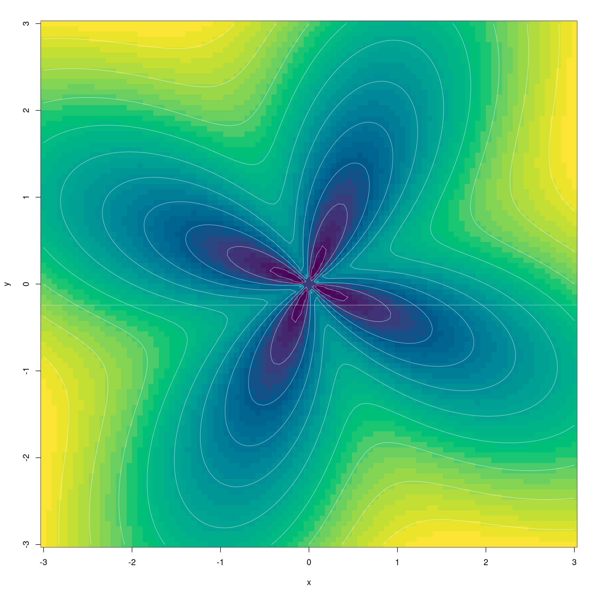
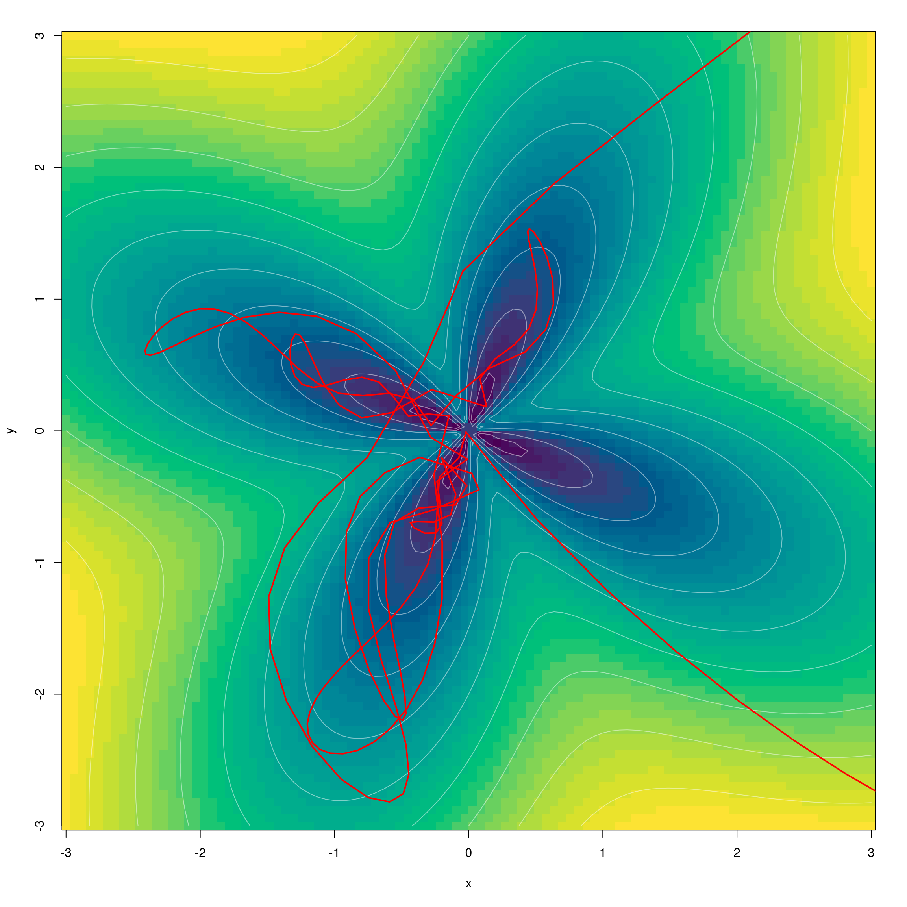
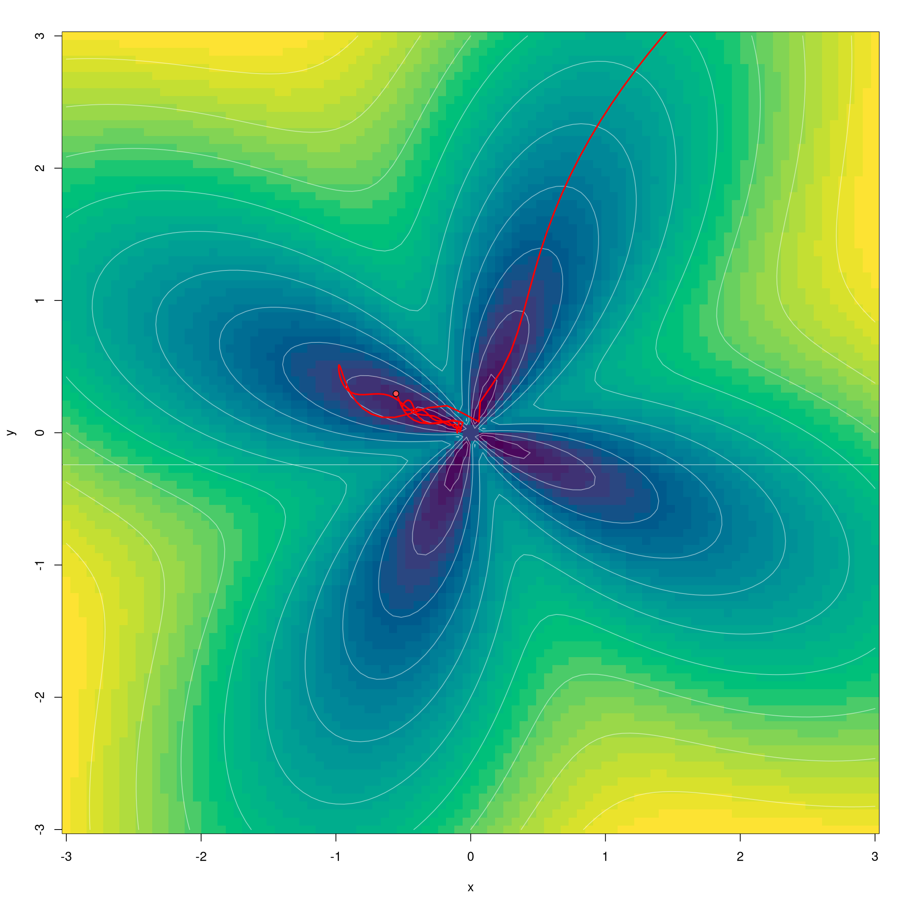
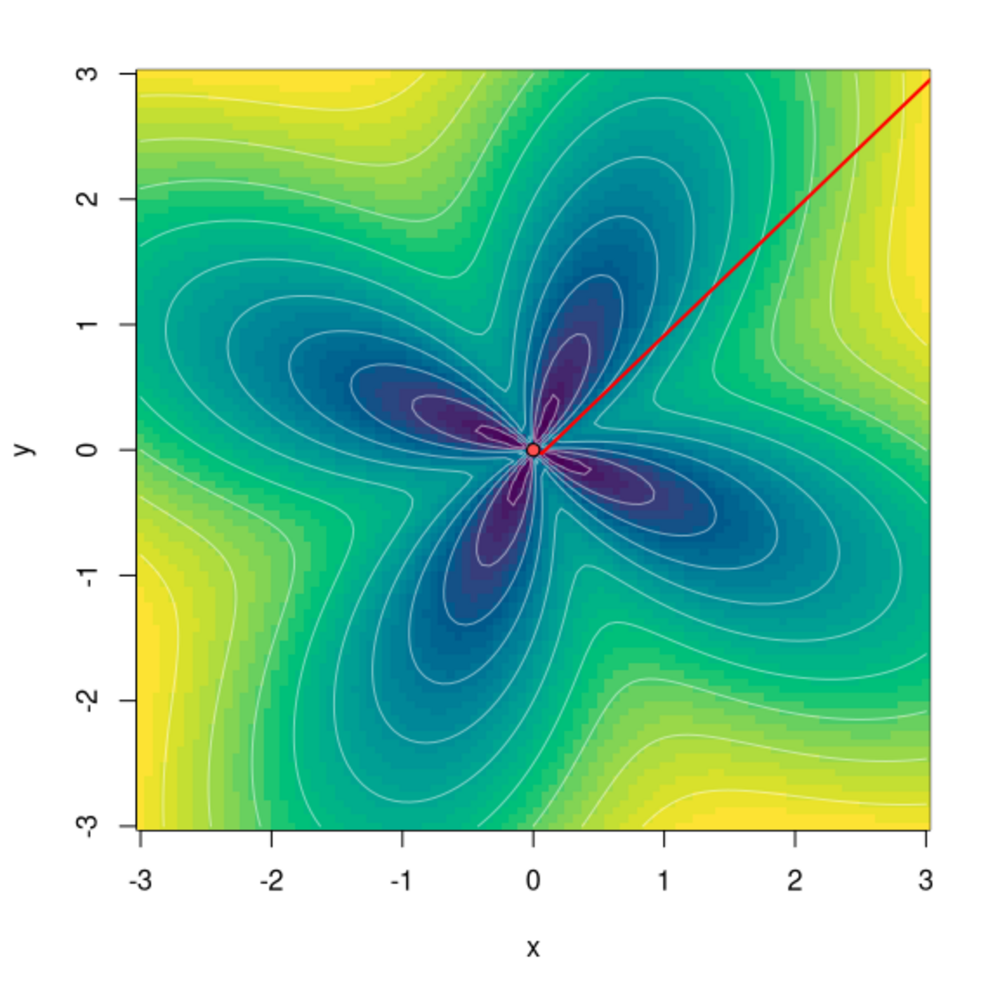

```{r setup, include=FALSE}
knitr::opts_chunk$set(echo = TRUE, eval = FALSE, fig.width = 6, fig.height = 6)
```

From the beginning, it has been exciting to watch the growing number of packages developing in the `torch` ecosystem. What's amazing is the variety of things people do with `torch`: extend its functionality; integrate and put to domain-specific use its low-level automatic differentiation infrastructure; port neural network architectures ... and last but not least, answer scientific questions.

This blog post will introduce, in short and rather subjective form, one of these packages: [`torchopt`](https://github.com/e-sensing/torchopt). Before we start, one thing we should probably say a lot more often: If you'd like to publish a post on this blog, on the package you're developing or the way you employ R-language deep learning frameworks, let us know -- you're more than welcome![^1]

[^1]: For example, by creating an issue on GitHub, in either the [blog's repo](https://github.com/rstudio/ai-blog) or that of the respective software (e.g., [keras](https://github.com/rstudio/keras), [torch](https://github.com/mlverse/torch), ...)

## `torchopt`

`torchopt` is a package developed by [Gilberto Camara](https://gilbertocamara.org/) and colleagues at [National Institute for Space Research, Brazil](https://www.gov.br/inpe/pt-br).

By the look of it, the package's reason of being is rather self-evident. `torch` itself does not -- nor should it -- implement all the newly-published, potentially-useful-for-your-purposes optimization algorithms out there.[^2] The algorithms assembled here, then, are probably exactly those the authors were most eager to experiment with in their own work. As of this writing, they comprise, amongst others, various members of the popular *ADA*\* and \**ADAM*\* families.[^3] And we may safely assume the list will grow over time.

[^2]: For why it shouldn't, and a overview of [some of] the things `torch` users can do, see also our recent post on [extending `torch`](https://blogs.rstudio.com/ai/posts/2022-04-27-torch-outside-the-box/).

[^3]: See the [Readme](https://github.com/e-sensing/torchopt) for an up-to-date listing.

In this text, instead of a dry summary of optimizers included, I'm going to introduce the package by highlighting something that technically, is "merely" a utility function, but to the user, can be extremely helpful: namely, the ability to, for an arbitrary optimizer and an arbitrary test function, plot the steps taken in optimization.

While it's true that I have no intent of comparing (let alone analyzing) different strategies, there is one that, to me, stands out in the list: ADAHESSIAN [@abs-2006-00719], a second-order algorithm designed to scale to large neural networks. I'm especially curious to see how it behaves as compared to L-BFGS, the second-order "classic" available from base `torch` we've had a [dedicated blog post](https://blogs.rstudio.com/ai/posts/2021-04-22-torch-for-optimization/) about last year.

## The way it works

The utility function in question is named `test_optim()`. The only required argument concerns the optimizer to try (`optim`). But you'll likely want to tweak three others as well:

-   `test_fn`: To use a test function different from the default (`beale`). You can choose among the many provided in `torchopt`, or you can pass in your own. In the latter case, you also need to provide information about search domain and starting points. (We'll see that in an instant.)
-   `steps`: To set the number of optimization steps.
-   `opt_hparams`: To modify optimizer hyperparameters; most notably, the learning rate.

Here, I'm going to use the *flower* function that already prominently figured in the aforementioned post on [L-BFGS](https://blogs.rstudio.com/ai/posts/2021-04-22-torch-for-optimization/). It approaches its minimum as it gets closer and closer to `(0,0)` (but is undefined at the origin itself).

Here it is:

```{r}
flower <- function(x, y) {
  a <- 1
  b <- 1
  c <- 4
  a * torch_sqrt(torch_square(x) + torch_square(y)) + b * torch_sin(c * torch_atan2(y, x))
}
```

Let's begin with our explorations. There'll be three short sections.

## Why do they always say learning rate matters?

True, it's a rhetorical question. But still, sometimes visualizations make for the most memorable evidence.

Here, we use a popular first-order optimizer, AdamW [@abs-1711-05101]. We call it with its default learning rate, `0.01`, and let the search run for two-hundred steps. As in that previous post, we start from far away -- the point `(20,20)`, way outside the rectangular region of interest.

```{r}
library(torchopt)
library(torch)

test_optim(
    # call with default learning rate (0.01)
    optim = optim_adamw,
    # pass in self-defined test function, plus a closure indicating starting points and search domain
    test_fn = list(flower, function() (c(x0 = 20, y0 = 20, xmax = 3, xmin = -3, ymax = 3, ymin = -3))),
    steps = 200
)
```



Whoops, what happened? Is there an error in the plotting code? -- Not at all; it's just that after the maximum number of steps allowed, we haven't yet entered the region of interest.

Next, we scale up the learning rate by a factor of ten.

```{r}

test_optim(
    optim = optim_adamw,
    # scale default rate by a factor of 10
    opt_hparams = list(lr = 0.1),
    test_fn = list(flower, function() (c(x0 = 20, y0 = 20, xmax = 3, xmin = -3, ymax = 3, ymin = -3))),
    steps = 200
)
```

{alt="Minimizing the flower function with AdamW. Setup no. 1: default learning rate, 200 steps."}

What a change! With ten-fold learning rate, the result is optimal. Does this mean the default setting is bad? Of course not; the algorithm has been tuned to work well with neural networks, not some function that has been purposefully designed to present a specific challenge.

Naturally, we also have to see what happens for yet higher a learning rate.

```{r}

test_optim(
    optim = optim_adamw,
    # scale default rate by a factor of 70
    opt_hparams = list(lr = 0.7),
    test_fn = list(flower, function() (c(x0 = 20, y0 = 20, xmax = 3, xmin = -3, ymax = 3, ymin = -3))),
    steps = 200
)
```



We see the behavior we've always been warned about: Optimization hops around wildly, before seemingly heading off forever. (Seemingly, because in this case, this is not what happens. Instead, the search will jump far away, and back again, continuously.)

Now, this might make one curious. What actually happens if we choose the "good" learning rate, but don't stop optimizing at two-hundred steps? Here, we try three-hundred instead:

```{r}

test_optim(
    optim = optim_adamw,
    # scale default rate by a factor of 10
    opt_hparams = list(lr = 0.1),
    test_fn = list(flower, function() (c(x0 = 20, y0 = 20, xmax = 3, xmin = -3, ymax = 3, ymin = -3))),
    # this time, continue search until we reach step 300
    steps = 300
)
```

{alt="Minimizing the flower function with AdamW. Setup no. 3: lr "}

Interestingly, we see the same kind of to-and-fro happening here as with a higher learning rate -- it's just delayed in time.

Another playful question that comes to mind is: Can we track how the optimization process "explores" the four petals? With some quick experimentation, I arrived at this:


Who says you need chaos[^4] to produce a beautiful plot?

[^4]: Alluding to strange attractors here. If you're interested, you might want to check out the mini-series on chaos and deep learning: [Deep attractors: Where deep learning meets chaos](https://blogs.rstudio.com/ai/posts/2020-06-24-deep-attractors/), [Time series prediction with FNN-LSTM](https://blogs.rstudio.com/ai/posts/2020-07-20-fnn-lstm/), and [FNN-VAE for noisy time series forecasting](https://blogs.rstudio.com/ai/posts/2020-07-31-fnn-vae-for-noisy-timeseries/).

## A second-order optimizer for neural networks: ADAHESSIAN

On to the one algorithm I'd like to check out specifically. Subsequent to a little bit of learning-rate experimentation, I was able to arrive at an excellent result after just thirty-five steps.

```{r}
test_optim(
    optim = optim_adahessian,
    opt_hparams = list(lr = 0.3),
    test_fn = list(flower, function() (c(x0 = 20, y0 = 20, xmax = 3, xmin = -3, ymax = 3, ymin = -3))),
    steps = 35
)
```

{alt="Minimizing the flower function with AdamW. Setup no. 3: lr"}

Given our recent experiences with AdamW though -- meaning, its "just not settling in" very close to the minimum -- we may want to run an equivalent test with ADAHESSIAN, as well. What happens if we go on optimizing quite a bit longer -- for two-hundred steps, say?

```{r}
test_optim(
    optim = optim_adahessian,
    opt_hparams = list(lr = 0.3),
    test_fn = list(flower, function() (c(x0 = 20, y0 = 20, xmax = 3, xmin = -3, ymax = 3, ymin = -3))),
    steps = 200
)
```


Like AdamW, ADAHESSIAN goes on to "explore" the petals, but it does not stray as far away from the minimum.

Is this surprising? I wouldn't say it is. The argument is the same as with AdamW, above: Its algorithm has been tuned to perform well on large neural networks, not to solve a classic, hand-crafted minimization task.

Now we've heard that argument twice already, it's time to verify the explicit assumption: that a classic second-order algorithm handles this better. In other words, it's time to revisit L-BFGS.

## Best of the classics: Revisiting L-BFGS

To use `test_optim()` with L-BFGS, we need to take a little detour. If you've read the post on L-BFGS, you may remember that with this optimizer, it is necessary to wrap both the call to the test function and the evaluation of the gradient in a closure. (The reason being that both have to be callable several times per iteration.)

Now, seeing how L-BFGS is a very special case, and few people are likely to use `test_optim()` with it in the future, it wouldn't seem worthwhile to make that function handle different cases. For this on-off test, I simply copied and modified the code as required. The result, `test_optim_lbfgs()`, is found in the appendix.

In deciding what number of steps to try, we take into account that L-BFGS has a different concept of iterations than other optimizers; meaning, it may refine its search several times per step. Indeed, from the previous post I happen to know that three iterations are sufficient:

```{r}
test_optim_lbfgs(
    optim = optim_lbfgs,
    opt_hparams = list(line_search_fn = "strong_wolfe"),
    test_fn = list(flower, function() (c(x0 = 20, y0 = 20, xmax = 3, xmin = -3, ymax = 3, ymin = -3))),
    steps = 3
)
```



At this point, of course, I need to stick with my rule of testing what happens with "too many steps". (Even though this time, I have strong reasons to believe that nothing will happen.)

```{r}
test_optim_lbfgs(
    optim = optim_lbfgs,
    opt_hparams = list(line_search_fn = "strong_wolfe"),
    test_fn = list(flower, function() (c(x0 = 20, y0 = 20, xmax = 3, xmin = -3, ymax = 3, ymin = -3))),
    steps = 10
)
```


Hypothesis confirmed.

And here ends my playful and subjective introduction to `torchopt`. I certainly hope you liked it; but in any case, I think you should have gotten the impression that here is a useful, extensible and likely-to-grow package, to be watched out for in the future. As always, thanks for reading!

## Appendix: `test_optim_lbfgs()`

```{r}
test_optim_lbfgs <- function(optim, ...,
                       opt_hparams = NULL,
                       test_fn = "beale",
                       steps = 200,
                       pt_start_color = "#5050FF7F",
                       pt_end_color = "#FF5050FF",
                       ln_color = "#FF0000FF",
                       ln_weight = 2,
                       bg_xy_breaks = 100,
                       bg_z_breaks = 32,
                       bg_palette = "viridis",
                       ct_levels = 10,
                       ct_labels = FALSE,
                       ct_color = "#FFFFFF7F",
                       plot_each_step = FALSE) {


    if (is.character(test_fn)) {
        # get starting points
        domain_fn <- get(paste0("domain_",test_fn),
                         envir = asNamespace("torchopt"),
                         inherits = FALSE)
        # get gradient function
        test_fn <- get(test_fn,
                       envir = asNamespace("torchopt"),
                       inherits = FALSE)
    } else if (is.list(test_fn)) {
        domain_fn <- test_fn[[2]]
        test_fn <- test_fn[[1]]
    }

    # starting point
    dom <- domain_fn()
    x0 <- dom[["x0"]]
    y0 <- dom[["y0"]]
    # create tensor
    x <- torch::torch_tensor(x0, requires_grad = TRUE)
    y <- torch::torch_tensor(y0, requires_grad = TRUE)

    # instantiate optimizer
    optim <- do.call(optim, c(list(params = list(x, y)), opt_hparams))

    # with L-BFGS, it is necessary to wrap both function call and gradient evaluation in a closure,
    # for them to be callable several times per iteration.
    calc_loss <- function() {
      optim$zero_grad()
      z <- test_fn(x, y)
      z$backward()
      z
    }

    # run optimizer
    x_steps <- numeric(steps)
    y_steps <- numeric(steps)
    for (i in seq_len(steps)) {
        x_steps[i] <- as.numeric(x)
        y_steps[i] <- as.numeric(y)
        optim$step(calc_loss)
    }

    # prepare plot
    # get xy limits

    xmax <- dom[["xmax"]]
    xmin <- dom[["xmin"]]
    ymax <- dom[["ymax"]]
    ymin <- dom[["ymin"]]

    # prepare data for gradient plot
    x <- seq(xmin, xmax, length.out = bg_xy_breaks)
    y <- seq(xmin, xmax, length.out = bg_xy_breaks)
    z <- outer(X = x, Y = y, FUN = function(x, y) as.numeric(test_fn(x, y)))

    plot_from_step <- steps
    if (plot_each_step) {
        plot_from_step <- 1
    }

    for (step in seq(plot_from_step, steps, 1)) {

        # plot background
        image(
            x = x,
            y = y,
            z = z,
            col = hcl.colors(
                n = bg_z_breaks,
                palette = bg_palette
            ),
            ...
        )

        # plot contour
        if (ct_levels > 0) {
            contour(
                x = x,
                y = y,
                z = z,
                nlevels = ct_levels,
                drawlabels = ct_labels,
                col = ct_color,
                add = TRUE
            )
        }

        # plot starting point
        points(
            x_steps[1],
            y_steps[1],
            pch = 21,
            bg = pt_start_color
        )

        # plot path line
        lines(
            x_steps[seq_len(step)],
            y_steps[seq_len(step)],
            lwd = ln_weight,
            col = ln_color
        )

        # plot end point
        points(
            x_steps[step],
            y_steps[step],
            pch = 21,
            bg = pt_end_color
        )
    }
}
```
