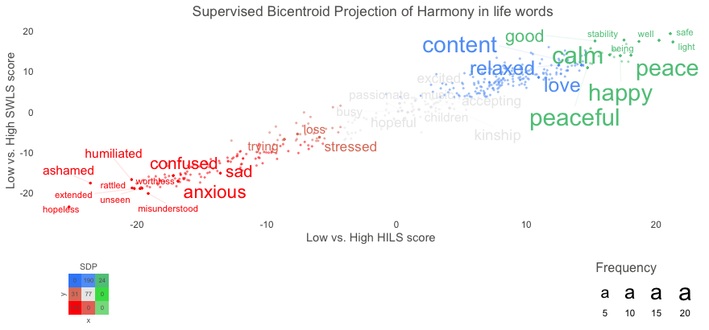

```{r setup, include=FALSE}
knitr::opts_chunk$set(echo = FALSE,
                      eval = FALSE)
```

AI-based language analysis has recently gone through a “paradigm shift” (Bommasani et al., 2021, p. 1), thanks in part to a new technique referred to as transformer language model (Vaswani et al., 2017, Liu et al., 2019). Companies, including Google, Meta, and OpenAI have released such models, including BERT, RoBERTa, and GPT, that have achieved unprecedented large improvements across most language tasks such as web search and sentiment analysis. While these language models are accessible in Python, and for typical AI tasks through [HuggingFace](https://huggingface.co/), the R package [`text`](http://r-text.org/) makes HuggingFace and state-of-the-art transformer language models accessible as social scientific pipelines in R.


## Introduction

We developed the `text` package [(Kjell, Giorgi & Schwartz, 2022)](https://psyarxiv.com/293kt) with two objectives in mind: 
To serve as a modular solution for downloading and using transformer language models. This, for example, includes transforming text to word embeddings as well as accessing common language model tasks such as text classification, sentiment analysis, text generation, question answering, translation and so on. 
To provide an end-to-end solution that is designed for human-level analyses including pipelines for state-of-the-art AI techniques tailored for predicting characteristics of the person that produced the language or eliciting insights about linguistic correlates of psychological attributes.

This blog post shows how to install the `text` package, transform text to state-of-the-art contextual word embeddings, use language analysis tasks as well as visualize words in word embedding space.  

## Installation and setting up a python environment
The `text` package is setting up a python environment to get access to the HuggingFace language models. The first time after installing the `text` package you need to run two functions: `textrpp_install()` and `textrpp_initialize()`.  

```{r one, echo=TRUE, eval=FALSE}
# Install text from CRAN
install.packages("text")
library(text)

# Install text required python packages in a conda environment (with defaults)
textrpp_install()

# Initialize the installed conda environment
# save_profile = TRUE saves the settings so that you do not have to run textrpp_initialize() again after restarting R
textrpp_initialize(save_profile = TRUE)
```


See the [extended installation guide](https://www.r-text.org/articles/huggingface_in_r_extended_installation_guide.html) for more information.

## Transform text to word embeddings
The [`textEmbed()`](https://www.r-text.org/reference/textEmbed.html) function is used to transform text to word embeddings (numeric representations of text). The `model` argument enables you to set which language model to use from HuggingFace; if you have not used the model before, it will automatically download the model and necessary files.

```{r three, echo=TRUE, eval=FALSE}
# Transform the text data to BERT word embeddings
# Note: To run faster, try something smaller: model = 'distilroberta-base'.
word_embeddings <- textEmbed(texts = "Hello, how are you doing?",
                            model = 'bert-base-uncased')
word_embeddings
comment(word_embeddings)

```

The word embeddings can now be used for downstream tasks such as training models to predict related numeric variables (e.g., see the [textTrain()](https://www.r-text.org/reference/textTrain.html) and [textPredict()](https://www.r-text.org/reference/textPredict.html) functions).
  
(To get token and individual layers output see the [textEmbedRawLayers()](https://www.r-text.org/reference/textEmbedRawLayers.html) function.)


# Language Analysis Tasks
There are many transformer language models at HuggingFace that can be used for various language model tasks such as text classification, sentiment analysis, text generation, question answering, translation and so on. The `text` package comprises user-friendly functions to access these.  

```{r four, echo=TRUE, eval=FALSE}
classifications <- textClassify("Hello, how are you doing?")
classifications
comment(classifications)
```


```{r five, echo=TRUE, eval=FALSE}
generated_text <- textGeneration("The meaning of life is")
generated_text

```

For more examples of available language model tasks, for example, see [textSum()](https://www.r-text.org/reference/textSum.html), [textQA()](https://www.r-text.org/reference/textQA.html), [textTranslate()](https://www.r-text.org/reference/textTranslate.html), and [textZeroShot()](https://www.r-text.org/reference/textZeroShot.html) under [Language Analysis Tasks](https://www.r-text.org/reference/index.html).


# Visualizing Words in Embedding Space
Visualizing words in the `text` package is achieved in two steps: First with a function to pre-process the data, and second to plot the words including adjusting visual characteristics such as color and font size. 
To demonstrate these two functions we use example data included in the `text` package: `Language_based_assessment_data_3_100`. We show how to create a two-dimensional figure with words that individuals have used to describe their harmony in life, plotted according to two different well-being questionnaires: the harmony in life scale and the satisfaction with life scale. So, the x-axis shows words that are related to low versus high harmony in life scale scores, and the y-axis shows words related to low versus high satisfaction with life scale scores.

```{r six, echo=TRUE, eval=FALSE}
word_embeddings_bert <- textEmbed(Language_based_assessment_data_3_100,
                                  aggregation_from_tokens_to_word_types = "mean",
                                  keep_token_embeddings = FALSE)

# Pre-process the data for plotting
df_for_plotting <- textProjection(Language_based_assessment_data_3_100$harmonywords, 
                                  word_embeddings_bert$text$harmonywords,
                                  word_embeddings_bert$word_types,
                                  Language_based_assessment_data_3_100$hilstotal, 
                                  Language_based_assessment_data_3_100$swlstotal
)

# Plot the data
plot_projection <- textProjectionPlot(
  word_data = df_for_plotting,
  y_axes = TRUE,
  p_alpha = 0.05,
  title_top = "Supervised Bicentroid Projection of Harmony in life words",
  x_axes_label = "Low vs. High HILS score",
  y_axes_label = "Low vs. High SWLS score",
  p_adjust_method = "bonferroni",
  points_without_words_size = 0.4,
  points_without_words_alpha = 0.4
)
plot_projection$final_plot

```




# Conclusion
This post demonstrates how to carry out state-of-the-art text analysis in R using the `text` package. The package intends to make it easy to access and use transformers language models from HuggingFace to analyze natural language. We look forward to your feedback and contributions toward making such models available for social scientific and other applications more typical of R users. 


# References
- Bommasani et al. (2021). On the opportunities and risks of foundation models.
- Kjell et al. (2022). The text package: An R-package for Analyzing and Visualizing Human Language Using Natural Language Processing and Deep Learning.
- Liu et al (2019). Roberta: A robustly optimized bert pretraining approach.
- Vaswaniet al (2017). Attention is all you need. Advances in Neural Information Processing Systems, 5998–6008


