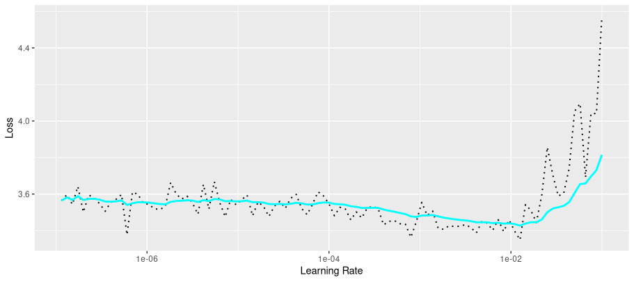
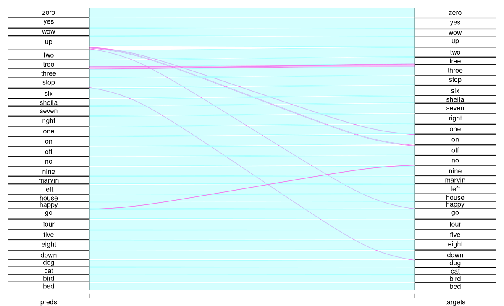

```{r setup, include=FALSE}
knitr::opts_chunk$set(echo = TRUE, eval = FALSE, fig.width = 6, fig.height = 6)
```

## Variations on a theme

[Simple audio classification with Keras](https://blogs.rstudio.com/ai/posts/2018-06-06-simple-audio-classification-keras/), [Audio classification with Keras: Looking closer at the non-deep learning parts](https://blogs.rstudio.com/ai/posts/2019-02-07-audio-background/), [Simple audio classification with torch](https://blogs.rstudio.com/ai/posts/2021-02-04-simple-audio-classification-with-torch/): No, this is not the first post on this blog that introduces speech classification using deep learning. With two of those posts (the "applied" ones) it shares the general setup, the type of deep-learning architecture employed, and the dataset used. With the third, it has in common the interest in the ideas and concepts involved. Each of these posts has a different focus -- should you read this one?

Well, of course I can't say "no" -- all the more so because, here, you have an abbreviated and condensed version of the chapter on this topic in the forthcoming book from CRC Press, *Deep Learning and Scientific Computing with R `torch`*. By way of comparison with the previous post that used `torch`, written by the creator and maintainer of `torchaudio`, Athos Damiani, significant developments have taken place in the `torch` ecosystem, the end result being that the code got a lot easier (especially in the model training part). That said, let's end the preamble already, and plunge into the topic!

## Inspecting the data

We use the *speech commands* dataset (@abs-1804-03209) that comes with [`torchaudio`](https://github.com/curso-r/torchaudio). The dataset holds recordings of thirty different, one- or two-syllable words, uttered by different speakers; there are about 65,000 audio files overall. Our task will be to predict, from the audio solely, which of thirty possible words was pronounced.

```{r}
library(torch)
library(torchaudio)
library(luz)

ds <- speechcommand_dataset(
  root = "~/.torch-datasets", 
  url = "speech_commands_v0.01",
  download = TRUE
)
```

We start by inspecting the data.

```{r}
ds$classes
```

    [1]  "bed"    "bird"   "cat"    "dog"    "down"   "eight"
    [7]  "five"   "four"   "go"     "happy"  "house"  "left"
    [32] " marvin" "nine"   "no"     "off"    "on"     "one"
    [19] "right"  "seven" "sheila" "six"    "stop"   "three"
    [25]  "tree"   "two"    "up"     "wow"    "yes"    "zero" 

Picking a sample at random, we see that the information we'll need is contained in four properties: `waveform`, `sample_rate`, `label_index`, and `label`.

The first, `waveform`, will be our predictor.

```{r}
sample <- ds[2000]
dim(sample$waveform)
```

    [1]     1 16000

Individual tensor values are centered at zero, and range between -1 and 1. There are 16,000 of them, reflecting the fact that the recording lasted for one second, and was registered at (or has been converted to, by the dataset creators) a rate of 16,000 samples per second. The latter information is stored in `sample$sample_rate`:

```{r}
sample$sample_rate
```

    [1] 16000

All recordings have been sampled at the same rate. Their length almost always equals one second; the -- very -- few sounds that are minimally longer we can safely truncate.

Finally, the target is stored, in integer form, in `sample$label_index`, the corresponding word being available from `sample$label`:

```{r}
sample$label
sample$label_index
```

    [1] "bird"
    torch_tensor
    2
    [ CPULongType{} ]

How does this audio signal "look"?

```{r}
library(ggplot2)

df <- data.frame(
  x = 1:length(sample$waveform[1]),
  y = as.numeric(sample$waveform[1])
  )

ggplot(df, aes(x = x, y = y)) +
  geom_line(size = 0.3) +
  ggtitle(
    paste0(
      "The spoken word \"", sample$label, "\": Sound wave"
    )
  ) +
  xlab("time") +
  ylab("amplitude") +
  theme_minimal()
```

{#fig-audio-bird-waveform fig-alt="A sound wave, displaying amplitude over time."}

What we see is a sequence of amplitudes, reflecting the sound wave produced by someone saying "bird". Put differently, we have here a time series of "loudness values". Even for experts, guessing *which* word resulted in those amplitudes is an impossible task. This is where domain knowledge comes in. The expert may not be able to make much of the signal *in this representation*; but they may know a way to more meaningfully represent it.

## Two equivalent representations

Imagine that instead of as a sequence of amplitudes over time, the above wave were represented in a way that had no information about time at all. Next, imagine we took that representation and tried to recover the original signal. For that to be possible, the new representation would somehow have to contain "just as much" information as the wave we started from. That "just as much" is obtained from the *Fourier Transform*, and it consists of the magnitudes and phase shifts of the different *frequencies* that make up the signal.

How, then, does the Fourier-transformed version of the "bird" sound wave look? We obtain it by calling `torch_fft_fft()` (where `fft` stands for Fast Fourier Transform):

```{r}
dft <- torch_fft_fft(sample$waveform)
dim(dft)
```

    [1]     1 16000

The length of this tensor is the same; however, its values are not in chronological order. Instead, they represent the *Fourier coefficients*, corresponding to the frequencies contained in the signal. The higher their magnitude, the more they contribute to the signal:

```{r}
mag <- torch_abs(dft[1, ])

df <- data.frame(
  x = 1:(length(sample$waveform[1]) / 2),
  y = as.numeric(mag[1:8000])
)

ggplot(df, aes(x = x, y = y)) +
  geom_line(size = 0.3) +
  ggtitle(
    paste0(
      "The spoken word \"",
      sample$label,
      "\": Discrete Fourier Transform"
    )
  ) +
  xlab("frequency") +
  ylab("magnitude") +
  theme_minimal()
```

{#fig-audio-bird-dft fig-alt="A curve showing magnitude for Fourier bins from 0 to 8000. Above 4000, nearly all are zero."}

From this, alternate, representation, we could go back to the original sound wave by taking the frequencies present in the signal, weighting them according to their coefficients, and adding them up. But in sound classification, timing information must surely matter; we don't really want to throw it away.

## Combining representations: The spectrogram

In fact, what really would help us is a synthesis of both representations; some sort of "have your cake and eat it, too". What if we could divide the signal into small chunks, and run the Fourier Transform on each of them? As you may have guessed from this lead-up, this indeed is something we can do; and the representation it creates is called the *spectrogram*.

With a spectrogram, we still keep some time-domain information -- some, since there is an unavoidable loss in granularity. On the other hand, for each of the time segments, we learn about their spectral composition. There's an important point to be made, though. The resolutions we get in *time* versus in *frequency*, respectively, are inversely related. If we split up the signals into many chunks (called "windows"), the frequency representation per window will not be very fine-grained. Conversely, if we want to get better resolution in the frequency domain, we have to choose longer windows, thus losing information about how spectral composition varies over time. What sounds like a big problem -- and in many cases, will be -- won't be one for us, though, as you'll see very soon.

First, though, let's create and inspect such a spectrogram for our example signal. In the following code snippet, the size of the -- overlapping -- windows is chosen so as to allow for reasonable granularity in both the time and the frequency domain. We're left with sixty-three windows, and, for each window, obtain two hundred fifty-seven coefficients:

```{r}
fft_size <- 512
window_size <- 512
power <- 0.5

spectrogram <- transform_spectrogram(
  n_fft = fft_size,
  win_length = window_size,
  normalized = TRUE,
  power = power
)

spec <- spectrogram(sample$waveform)$squeeze()
dim(spec)

```

    [1]   257 63

We can display the spectrogram visually:

```{r}
bins <- 1:dim(spec)[1]
freqs <- bins / (fft_size / 2 + 1) * sample$sample_rate 
log_freqs <- log10(freqs)

frames <- 1:(dim(spec)[2])
seconds <- (frames / dim(spec)[2]) *
  (dim(sample$waveform$squeeze())[1] / sample$sample_rate)

image(x = as.numeric(seconds),
      y = log_freqs,
      z = t(as.matrix(spec)),
      ylab = 'log frequency [Hz]',
      xlab = 'time [s]',
      col = hcl.colors(12, palette = "viridis")
)
main <- paste0("Spectrogram, window size = ", window_size)
sub <- "Magnitude (square root)"
mtext(side = 3, line = 2, at = 0, adj = 0, cex = 1.3, main)
mtext(side = 3, line = 1, at = 0, adj = 0, cex = 1, sub)

```

{#fig-audio-spectrogram fig-alt="A three-dimensional plot where the x-axis represents time, the y-axis, frequency, and color, magnitude."}

We know that we've lost some resolution, in both time and frequency. By displaying the square root of the coefficients' magnitudes, though -- and thus, enhancing sensitivity -- we were still able to obtain a reasonable result. (With the `viridis` color scheme, long-wave shades indicate higher-valued coefficients; short-wave ones, the opposite.)

Finally, let's get back to the crucial question. If this representation, by necessity, is a compromise -- why, then, would we want to employ it? This is where we take the deep-learning perspective. The spectrogram is a two-dimensional representation: an image. With images, we have access to a rich reservoir of techniques and architectures: Among all areas deep learning has been successful in, image recognition still stands out. Soon, you'll see that for this task, fancy architectures are not even needed; a straightforward convnet will do a very good job.

## Training a neural network on spectrograms

We start by creating a `torch::dataset()` that, starting from the original `speechcommand_dataset()`, computes a spectrogram for every sample.

```{r}

spectrogram_dataset <- dataset(
  inherit = speechcommand_dataset,
  initialize = function(...,
                        pad_to = 16000,
                        sampling_rate = 16000,
                        n_fft = 512,
                        window_size_seconds = 0.03,
                        window_stride_seconds = 0.01,
                        power = 2) {
    self$pad_to <- pad_to
    self$window_size_samples <- sampling_rate *
      window_size_seconds
    self$window_stride_samples <- sampling_rate *
      window_stride_seconds
    self$power <- power
    self$spectrogram <- transform_spectrogram(
        n_fft = n_fft,
        win_length = self$window_size_samples,
        hop_length = self$window_stride_samples,
        normalized = TRUE,
        power = self$power
      )
    super$initialize(...)
  },
  .getitem = function(i) {
    item <- super$.getitem(i)

    x <- item$waveform
    # make sure all samples have the same length (57)
    # shorter ones will be padded,
    # longer ones will be truncated
    x <- nnf_pad(x, pad = c(0, self$pad_to - dim(x)[2]))
    x <- x %>% self$spectrogram()

    if (is.null(self$power)) {
      # in this case, there is an additional dimension, in position 4,
      # that we want to appear in front
      # (as a second channel)
      x <- x$squeeze()$permute(c(3, 1, 2))
    }

    y <- item$label_index
    list(x = x, y = y)
  }
)

```

In the parameter list to `spectrogram_dataset()`, note `power`, with a default value of 2. This is the value that, unless told otherwise, `torch`'s `transform_spectrogram()` will assume that `power` should have. Under these circumstances, the values that make up the spectrogram are the squared magnitudes of the Fourier coefficients. Using `power`, you can change the default, and specify, for example, that'd you'd like absolute values (`power = 1`), any other positive value (such as `0.5`, the one we used above to display a concrete example) -- or both the real and imaginary parts of the coefficients (`power = NULL)`.

Display-wise, of course, the full complex representation is inconvenient; the spectrogram plot would need an additional dimension. But we may well wonder whether a neural network could profit from the additional information contained in the "whole" complex number. After all, when reducing to magnitudes we lose the phase shifts for the individual coefficients, which might contain usable information. In fact, my tests showed that it did; use of the complex values resulted in enhanced classification accuracy. [^1]

[^1]: In the book, I'm comparing three different setups (the third being use of Mel spectrograms). Using complex coefficients for network input was the winner.

Let's see what we get from `spectrogram_dataset()`:

```{r}
ds <- spectrogram_dataset(
  root = "~/.torch-datasets",
  url = "speech_commands_v0.01",
  download = TRUE,
  power = NULL
)

dim(ds[1]$x)
```

    [1]   2 257 101

We have two hundred fifty-seven coefficients for a hundred and one windows; and each coefficient is represented by both its real and imaginary parts.

Next, we split up the data, and instantiate the `dataset()` and `dataloader()` objects.

```{r}

train_ids <- sample(
  1:length(ds),
  size = 0.6 * length(ds)
)
valid_ids <- sample(
  setdiff(
    1:length(ds),
    train_ids
  ),
  size = 0.2 * length(ds)
)
test_ids <- setdiff(
  1:length(ds),
  union(train_ids, valid_ids)
)

batch_size <- 128

train_ds <- dataset_subset(ds, indices = train_ids)
train_dl <- dataloader(
  train_ds,
  batch_size = batch_size, shuffle = TRUE
)

valid_ds <- dataset_subset(ds, indices = valid_ids)
valid_dl <- dataloader(
  valid_ds,
  batch_size = batch_size
)

test_ds <- dataset_subset(ds, indices = test_ids)
test_dl <- dataloader(test_ds, batch_size = 64)

b <- train_dl %>%
  dataloader_make_iter() %>%
  dataloader_next()

dim(b$x)

```

    [1] 128   2 257 101

The model is a straightforward convnet, with dropout and batch normalization. The real and imaginary parts of the Fourier coefficients are passed to the model's initial `nn_conv2d()` as two separate *channels*.

```{r}
model <- nn_module(
  initialize = function() {
    self$features <- nn_sequential(
      nn_conv2d(2, 32, kernel_size = 3),
      nn_batch_norm2d(32),
      nn_relu(),
      nn_max_pool2d(kernel_size = 2),
      nn_dropout2d(p = 0.2),
      nn_conv2d(32, 64, kernel_size = 3),
      nn_batch_norm2d(64),
      nn_relu(),
      nn_max_pool2d(kernel_size = 2),
      nn_dropout2d(p = 0.2),
      nn_conv2d(64, 128, kernel_size = 3),
      nn_batch_norm2d(128),
      nn_relu(),
      nn_max_pool2d(kernel_size = 2),
      nn_dropout2d(p = 0.2),
      nn_conv2d(128, 256, kernel_size = 3),
      nn_batch_norm2d(256),
      nn_relu(),
      nn_max_pool2d(kernel_size = 2),
      nn_dropout2d(p = 0.2),
      nn_conv2d(256, 512, kernel_size = 3),
      nn_batch_norm2d(512),
      nn_relu(),
      nn_adaptive_avg_pool2d(c(1, 1)),
      nn_dropout2d(p = 0.2)
    )

    self$classifier <- nn_sequential(
      nn_linear(512, 512),
      nn_batch_norm1d(512),
      nn_relu(),
      nn_dropout(p = 0.5),
      nn_linear(512, 30)
    )
  },
  forward = function(x) {
    x <- self$features(x)$squeeze()
    x <- self$classifier(x)
    x
  }
)
```

We next determine a suitable learning rate:

```{r}
model <- model %>%
  setup(
    loss = nn_cross_entropy_loss(),
    optimizer = optim_adam,
    metrics = list(luz_metric_accuracy())
  )

rates_and_losses <- model %>%
  lr_finder(train_dl)
rates_and_losses %>% plot()
```

{#fig-audio-lr-finder-complex fig-alt="A noisy  curve that, from left to right, first declines very slowly (until shortly before x"}

Based on the plot, I decided to use 0.01 as a maximal learning rate. Training went on for forty epochs.

```{r}
fitted <- model %>%
  fit(train_dl,
    epochs = 50, valid_data = valid_dl,
    callbacks = list(
      luz_callback_early_stopping(patience = 3),
      luz_callback_lr_scheduler(
        lr_one_cycle,
        max_lr = 1e-2,
        epochs = 50,
        steps_per_epoch = length(train_dl),
        call_on = "on_batch_end"
      ),
      luz_callback_model_checkpoint(path = "models_complex/"),
      luz_callback_csv_logger("logs_complex.csv")
    ),
    verbose = TRUE
  )

plot(fitted)
```

{#fig-audio-fit-complex fig-alt="Top row: Curves displaying how classification accuracy develops over the training period, for both training and validation sets. Both first rise steeply, then slow down and flatten. Bottom row: Corresponding curves representing the loss. Both first descend quickly, then continue falling very slowly, then flatten."}

Let's check actual accuracies.

    "epoch","set","loss","acc"
    1,"train",3.09768574611813,0.12396992171405
    1,"valid",2.52993751740923,0.284378862793572
    2,"train",2.26747255972008,0.333642356819118
    2,"valid",1.66693911248562,0.540791100123609
    3,"train",1.62294889937818,0.518464153275649
    3,"valid",1.11740599192825,0.704882571075402
    ...
    ...
    38,"train",0.18717994078312,0.943809229501442
    38,"valid",0.23587799138006,0.936418417799753
    39,"train",0.19338578602993,0.942882159044087
    39,"valid",0.230597475945365,0.939431396786156
    40,"train",0.190593419024368,0.942727647301195
    40,"valid",0.243536252455384,0.936186650185414

With thirty classes to distinguish between, a final validation-set accuracy of \~0.94 looks like a very decent result!

We can confirm this on the test set:

```{r}
evaluate(fitted, test_dl)
```

    loss: 0.2373
    acc: 0.9324

An interesting question is which words get confused most often. (Of course, even more interesting is how error probabilities are related to features of the spectrograms \-- but this, we have to leave to the *true* domain experts. A nice way of displaying the confusion matrix is to create an alluvial plot. We see the predictions, on the left, "flow into" the target slots. (Target-prediction pairs less frequent than a thousandth of test set cardinality are hidden.)

{#fig-audio-alluvial-complex fig-alt="On the left and the right sides, the thirty words that make up this dataset. In the middle, arrows showing which word a given one was mapped to in classification. Clearly different from the ones before in that there are much fewer mis-classifications."}

## Wrapup

That's it for today! In the upcoming weeks, expect more posts drawing on content from the soon-to-appear CRC book, *Deep Learning and Scientific Computing with R `torch`*. Thanks for reading!

Photo by \<a href="[https://unsplash.com/\@unknown_613?utm_source=unsplash&utm_medium=referral&utm_content=creditCopyText"](https://unsplash.com/@unknown_613?utm_source=unsplash&utm_medium=referral&utm_content=creditCopyText")alex lauzon\</a\> on \<a href="[https://unsplash.com/?utm_source=unsplash&utm_medium=referral&utm_content=creditCopyText"](https://unsplash.com/?utm_source=unsplash&utm_medium=referral&utm_content=creditCopyText")Unsplash\</a\>
