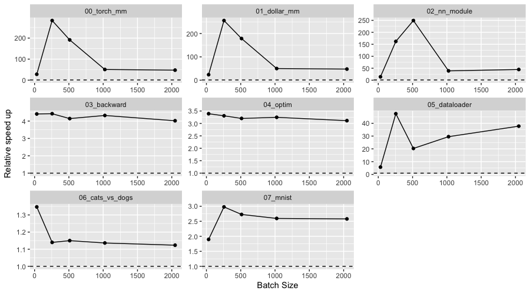
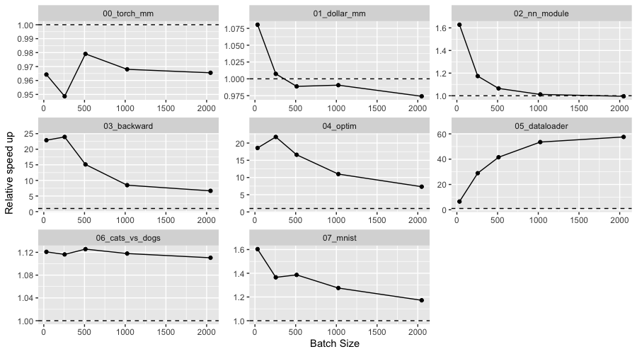

```{r setup, include=FALSE}
knitr::opts_chunk$set(echo = TRUE, eval = FALSE)
```

We are happy to announce that `torch` v0.9.0 is now on CRAN. This version adds support for ARM systems running macOS, and brings significant performance improvements. This release also includes many smaller bug fixes and features. The full changelog can be found [here](https://torch.mlverse.org/docs/news/index.html#torch-080).

## Performance improvements

`torch` for R uses LibTorch as its backend. This is the same library that powers PyTorch -- meaning that we should see very similar performance when
comparing programs. 

However, `torch` has a very different design, compared to other machine learning libraries wrapping C++ code bases (e.g', `xgboost`). There, the overhead is insignificant because there's only a few R function calls before we start training the model; the whole training then happens without ever leaving C++. In `torch`, C++ functions are wrapped at the operation level. And since a model consists of multiple calls to operators, this can render the R function call overhead more substantial.

We have established a set of benchmarks, each trying to identify performance bottlenecks in specific `torch` features. In some of the benchmarks we were able to make the new version up to 250x faster than the last CRAN version. In Figure \@ref(fig:cuda) we can see the relative performance of `torch` v0.9.0 and `torch` v0.8.1 in each of the benchmarks running on the CUDA device:

```{r cuda, echo=FALSE, eval=TRUE, layout = "l-body-outset", fig.cap="Relative performance of v0.8.1 vs v0.9.0 on the CUDA device. Relative performance is measured by (new_time/old_time)^-1."}

```

The main source of performance improvements on the GPU is due to better memory
management, by avoiding unnecessary calls to the R garbage collector. See more details in
the ['Memory management' article](https://torch.mlverse.org/docs/articles/memory-management.html) in the `torch` documentation.

On the CPU device we have less expressive results, even though some of the benchmarks 
are 25x faster with v0.9.0. On CPU, the main bottleneck for performance that has been
solved is the use of a new thread for each backward call. We now use a thread pool, making the _backward_ and _optim_ benchmarks almost 25x faster for some batch sizes.

```{r cpu, echo=FALSE, eval=TRUE, layout = "l-body-outset", fig.cap="Relative performance of v0.8.1 vs v0.9.0 on the CPU device. Relative performance is measured by (new_time/old_time)^-1."}

```

The benchmark code is fully available for [reproducibility](https://github.com/mlverse/bench-torch). Although this release brings
significant improvements in `torch` for R performance, we will continue working on this topic, and hope to further improve results in the next releases. 

## Support for Apple Silicon

`torch` v0.9.0 can now run natively on devices equipped with Apple Silicon. When
installing `torch` from a ARM R build, `torch` will automatically download the pre-built
LibTorch binaries that target this platform. 

Additionally you can now run `torch` operations on your Mac GPU. This feature is
implemented in LibTorch through the [Metal Performance Shaders API](https://developer.apple.com/documentation/metalperformanceshaders), meaning that it
supports both Mac devices equipped with AMD GPU's and those with Apple Silicon chips. So far, it
has only been tested on Apple Silicon devices. Don't hesitate to open an issue if you
have problems testing this feature.

In order to use the macOS GPU, you need to place tensors on the MPS device. Then,
operations on those tensors will happen on the GPU. For example:

```{r}
x <- torch_randn(100, 100, device="mps")
torch_mm(x, x)
```

If you are using `nn_module`s you also need to move the module to the MPS device,
using the `$to(device="mps")` method.

Note that this feature is in [beta](https://pytorch.org/blog/introducing-accelerated-pytorch-training-on-mac/) as
of this blog post, and you might find operations that are not yet implemented on the
GPU. In this case, you might need to set the environment variable `PYTORCH_ENABLE_MPS_FALLBACK=1`, so `torch` automatically uses the CPU as a fallback for
that operation.

## Other

Many other small changes have been added in this release, including:

- Update to LibTorch v1.12.1
- Added `torch_serialize()` to allow creating a raw vector from `torch` objects.
- `torch_movedim()` and `$movedim()` are now both 1-based indexed.

Read the full changelog available [here](https://torch.mlverse.org/docs/news/index.html).
