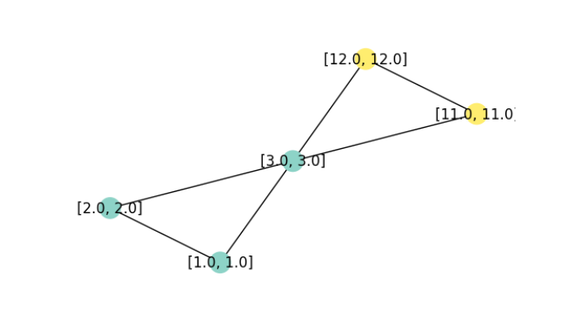

```{r setup, include=FALSE}
knitr::opts_chunk$set(echo = TRUE, eval = FALSE, fig.width = 6, fig.height = 6)
```

If, in deep-learning world, the first half of the last decade has been the age of images, and the second, that of language, one could say that now, we're living in the age of graphs. At least, that's what commonly cited research metrics suggest. But as we're all aware, deep-learning research is anything but an ivory tower. To see real-world implications, it suffices to reflect on how many things can be modeled as graphs. Some things quite naturally "are" graphs, in the sense of having nodes and edges: take neurons, underground stations, social networks. Other things can fruitfully be modeled as graphs: molecules, for example: or language, concepts, three-dimensional shapes ... If deep learning on graphs is desirable, what are the challenges, and what do we get for free?

## What's so special about deep learning on graphs?

Graphs are different from images, language, as well as tabular data in that node numbering does not matter. In other words, graphs are permutation-invariant. Already this means that architectures established in other domains cannot be transferred verbatim. (The *ideas* underlying them can be transferred though. Thus, in the graph neural network (henceforth: GNN) model zoo you'll see lots of allusions to "convolutional", "attention", and other established terms.) Put very simply, and in concordance with common sense, whatever algorithm is used, it will fundamentally be based on how nodes are connected: the edges, that is.

When relationships are modeled as graphs, both nodes and edges can have features. This, too, adds complexity. But not everything is harder with graphs. Think of how cumbersome it can be to obtain labeled data for supervised learning. With graphs, often an astonishingly small amount of labeled data is needed. More surprisingly still, a graph can be constructed when not a single edge is present. Put differently, learning on *sets* can morph into learning on *graphs*.

At this point, let me switch gears and move on to the practical part: the raison d'être of this post. Before, a quick note on software.

## Implementations

Deep learning on graphs can be done in both frameworks currently dominating the market, TensorFlow as well as PyTorch. The most popular, at this time -- and fastest-growing in terms of functionality -- library seems to be [PyTorch Geometric](https://pytorch-geometric.readthedocs.io/en/latest/#) (from hereon: PyG). In particular, this tendency is documented by more and more research groups switching to PyG -- and often, extending it in significant ways.

Of course, you can do deep learning on graphs in other libraries and frameworks. For researchers, though, enabling quick experimentation is of utmost importance; the same goes for extensive documentation and realistic use cases. On this blog, I have an additional reason to pick PyG over alternatives: I plan to write regularly about uses of deep learning in the sciences, and to no big surprise, there graphs and graph-like structures are widely used as domain models.

As a regular reader, you may have stumbled across me writing: "PyTorch Geometric". What about R `torch`? Well, we'd love to have PyG in the `torch` ecosystem! But looking at the extent of this project, and more importantly, its rapid, ever-accelerating growth, it would make sense for a `torchgeometric` to be a community effort. If you're interested to help, or if the upcoming posts make you so, please don't hesitate to let us know!

That said, let me come to what *this* post is for: *get started with PyG for deep learning on graphs --the low-level, "I want-to-really-understand" way*.

## Matching concepts and code: PyTorch Geometric

Deep learning on graphs, in its most general form, is usually characterized by the term *message passing*. Messages are passed between nodes that are linked by an edge: If node $A$ has three neighbors, it will receive three messages. Those messages have to be summarized in some meaningful way. Finally -- GNNs consisting of consecutive layers -- the node will have to decide how to modify its previous-layer features (a.k.a. embeddings) based on that summary.

Together, these make up a three-step sequence: collect messages; aggegate; update. What about the "learning" in deep learning, though? There are two places where learning can happen: Firstly, in message collection: Incoming messages could be transformed by a MLP, for example. Secondly, as part of the update step. All in all, this yields mathematical formulae like this, given in the PyG documentation:

$$
\mathbf{x}_i^{(k)} = \gamma^{(k)} \left( \mathbf{x}_i^{(k-1)}, \square_{j \in \mathcal{N}(i)} \, \phi^{(k)}\left(\mathbf{x}_i^{(k-1)}, \mathbf{x}_j^{(k-1)},\mathbf{e}_{j,i}\right) \right)
$$

Scary though this looks, once we read it from the right, we see that it nicely fits the conceptual description. The $(\mathbf{x}_i^{(k-1)}, \mathbf{x}_j^{(k-1)},\mathbf{e}_{j,i})$ are the three types of incoming messages a node can receive: its own state at the previous layer, the states of its neighbors (the nodes $j \in \mathcal{N}(i)$) at the previous layer, and features/embeddings associated to the edge in question. (I'm leaving out edge features in this discussion completely, so as to not further enhance complexity.) These messages are (optionally) transformed by the neural network $\phi$, and whatever comes out is summarized by the aggregator function $\square$. Finally, a node will update itself based on that summary as well as its own previous-layer state, possibly by means of applying neural network $\gamma$.

Now we have this conceptual/mathematical representation, how does it map to code we see, or would like to write? PyG has excellent, extensive documentation, including at the beginner level. But here, I'd like to spell things out in detail -- pedantically, if you like, but in a way that tells us a lot about how GNNs work.

Let's start by the information given in one of the key documentation pages, [Creating message passing networks](https://pytorch-geometric.readthedocs.io/en/latest/notes/create_gnn.html):

> PyG provides the `MessagePassing` base class, which helps in creating such kinds of message passing graph neural networks by automatically taking care of message propagation. The user only has to define the functions $\phi$, i.e. `message()`, and $\gamma$, i.e. `update()`, as well as the aggregation scheme to use, i.e. `aggr="add"`, `aggr="mean"` or `aggr="max"`.

Scrolling down that page and looking at the two example implementations, however, we see that an implementation of `update()` does not have to be provided; and from inspecting the [source code](https://pytorch-geometric.readthedocs.io/en/latest/_modules/torch_geometric/nn/conv/message_passing.html#MessagePassing), it is clear that, technically, the same holds for `message()`. (And unless we want a form of aggregation different from the default `add`, we do not even need to specify that, either.)

Thus, the question becomes: What happens if we code the *minimal PyG GNN*? To find out, we first need to create a minimal graph, one minimal enough for us to track what is going on.

### A minimal graph

First, let me list all imports required for this post.

```{python}
import numpy as np

import torch
from torch.nn import Sequential as Seq, Linear, ReLU
import torch.nn.functional as F

from torch_geometric.nn import MessagePassing
from torch_geometric.data import Data
from torch_geometric.utils import add_self_loops, degree, to_networkx

from torch_scatter import scatter

import networkx as nx
import matplotlib.pyplot as plt
```

Now, a basic `Data` object is created from three tensors. The first holds the node features: two features each for five nodes. (Both features are identical on purpose, for "cognitive ease" -- on our, not the algorithm's, part.)

```{python}
x = torch.tensor([[1, 1], [2, 2], [3, 3], [11, 11], [12, 12]], dtype=torch.float)
```

The second specifies existing connections. For undirected graphs (like ours), each edge appears twice. The tensor you see here is specified in one-edge-per-line form for convenience reasons; to the `Data()` constructor we'll pass its transpose instead.

```{python}
edge_index = torch.tensor([
  [0, 1],
  [1, 0],
  [0, 2],
  [2, 0],
  [1, 2],
  [2, 1],
  [2, 3],
  [3, 2],
  [2, 4],
  [4, 2],
  [3, 4],
  [4, 3]
], dtype=torch.long)

```

The third tensor holds the node labels. (The task will be one of node -- not edge, not graph -- classification.)

```{python}
y = torch.tensor([[0], [0], [0], [1], [1]], dtype=torch.float)
```

Constructing and inspecting the resulting graph, we have:

```{python}
data = Data(x = x, edge_index = edge_index.t().contiguous(), y = y)
data.x
data.edge_index
data.y
```

    tensor([[ 1.,  1.],
            [ 2.,  2.],
            [ 3.,  3.],
            [11., 11.],
            [12., 12.]])
            
    tensor([[0, 1, 0, 2, 1, 2, 2, 3, 2, 4, 3, 4],
            [1, 0, 2, 0, 2, 1, 3, 2, 4, 2, 4, 3]])
            
    tensor([[0.],
            [0.],
            [0.],
            [1.],
            [1.]])

For our upcoming experiments, it's more helpful, though, to visualize the graph:

```{python}
def visualize_graph(G, color, labels):
    plt.figure(figsize=(7,7))
    plt.axis('off')
    nx.draw_networkx(
      G,
      pos = nx.spring_layout(G, seed = 777),
      labels = labels,
      node_color = color,
      cmap = "Set3"
      )
    plt.show()

G = to_networkx(data, to_undirected = True, node_attrs = ["x"])
labels = nx.get_node_attributes(G, "x")
visualize_graph(G, color = data.y, labels = labels)
```



Although our experiments won't be about training performance (how could they be, with just five nodes), let me remark in passing that this graph is small, but not boring: The middle node is equally connected to both "sides", yet feature-wise, it would pretty clearly appear to belong on just one of them. (Which is true, given the provided class labels). Such a constellation is interesting because, in the majority of networks, edges indicate similarity.

### A minimal GNN

Now, we code and run the minimal GNN. We're not interested in class labels (yet); we just want to see each node's embeddings after a single pass.

```{python}
class IAmLazy(MessagePassing):
    def forward(self, x, edge_index):
        out = self.propagate(edge_index, x = x)
        return out
      
module = IAmLazy()
out = module(data.x, data.edge_index)
out
```

    tensor([[ 5.,  5.],
            [ 4.,  4.],
            [26., 26.],
            [15., 15.],
            [14., 14.]])

Evidently, we just had to start the process -- but what process, exactly? From what we know about the three stages of message passing, an essential question is what nodes do with the information that flows over the edges. Our first experiment, then, is to inspect the incoming messages.

### Poking into `message()`

In `message()`, we have access to a structure named `x_j`. This tensor holds, for each node $i$, the embeddings of all nodes $j$ connected to it via incoming edges. We'll print them, and then, just return them, unchanged.

```{python}
class IAmMyOthers(MessagePassing):
    def forward(self, x, edge_index):
        out = self.propagate(edge_index, x = x)
        return out
    def message(self, x_j):
        print("in message, x_j is")
        print(x_j)
        return x_j
      
module = IAmMyOthers()
out = module(data.x, data.edge_index)
print("result is:")
out
```

    in message, x_j is
    tensor([[ 1.,  1.],
            [ 2.,  2.],
            [ 1.,  1.],
            [ 3.,  3.],
            [ 2.,  2.],
            [ 3.,  3.],
            [ 3.,  3.],
            [11., 11.],
            [ 3.,  3.],
            [12., 12.],
            [11., 11.],
            [12., 12.]])
            
    result is:
    tensor([[ 5.,  5.],
            [ 4.,  4.],
            [26., 26.],
            [15., 15.],
            [14., 14.]])

Let me spell this out. In `data.edge_index`, repeated here for convenience:

    tensor([[0, 1, 0, 2, 1, 2, 2, 3, 2, 4, 3, 4],
            [1, 0, 2, 0, 2, 1, 3, 2, 4, 2, 4, 3]])

the first pair denotes the edge from node `0` (that had features `(1, 1)`) to node `1`. This information is found in `x_j`'s first row. Then row two holds the information flowing in the opposite direction, namely, the features associated with node `1`. And so on.

Interestingly, since we're passing through this module just once, we can see the messages that will be sent without even running it.

Namely, since `data.edge_index[0]` designates the *source* nodes for each edge:

```{python}
data.edge_index[0]
```

we can index `into data.x` to pick up what will be the *incoming* features for each connection.

```{python}
data.x[data.edge_index[0]]
```

    tensor([[ 1.,  1.],
            [ 2.,  2.],
            [ 1.,  1.],
            [ 3.,  3.],
            [ 2.,  2.],
            [ 3.,  3.],
            [ 3.,  3.],
            [11., 11.],
            [ 3.,  3.],
            [12., 12.],
            [11., 11.],
            [12., 12.]])

Now, what does this tell us? Node `0`, for example, received messages from nodes `1` and `2`: `(2, 2)` and `(3, 3)`, respectively. We know that the default aggregation mode is `add`; and so, would expect an outcome of `(5, 5)`. Indeed, this is the new embedding for node `0`.

In a nutshell, thus, the minimal GNN updates every node's embedding so as to prototypically reflect the node's neighborhood. Take care though: Nodes represent their neighborhoods, but themselves, they don't count. We will change that now.

### Adding self loops

All we need to do is modify the adjacency matrix to include edges going from each node back to itself.

```{python}
class IAmMyOthersAndMyselfAsWell(MessagePassing):
    def forward(self, x, edge_index):
        edge_index, _ = add_self_loops(edge_index, num_nodes = x.size(0))
        print("in forward, augmented edge index now has shape")
        print(edge_index.shape)
        out = self.propagate(edge_index, x = x)
        return out
    def message(self, x_j):
        return x_j

module = IAmMyOthersAndMyselfAsWell()
out = module(data.x, data.edge_index)
print("result is:")
out

```

    in forward, augmented edge index now has shape:
    torch.Size([2, 17])

    result is:
    tensor([[ 6.,  6.],
            [ 6.,  6.],
            [29., 29.],
            [26., 26.],
            [26., 26.]])

As expected, the neighborhood summary at each node now includes a contribution from each node itself.

Now we know how to access the messages, we'd like to aggregate them in a non-standard way.

### Customizing `aggregate()`

Instead of `message()`, we now override `aggregate()`. If we wanted to use another of the "standard" aggregation modes (`mean`, `mul`, `min`, or `max`), we could just override `__init__(),` like so:

```{python}
def __init__(self):
        super().__init__(aggr = "mean")
```

To implement custom summaries, however, we make use of `torch_scatter` (one of PyG's installation prerequisites) for optimal performance. Let me show this by means of a simple example.

```{python}
class IAmJustTheOppositeReally(MessagePassing):
    def forward(self, x, edge_index):
        out = self.propagate(edge_index, x = x)
        return out
    def aggregate(self, inputs, index):
        print("in aggregate, inputs is")
        # same as x_j (incoming node features)
        print(inputs)
        print("in aggregate, index is")
        # this is data.edge_index[1]
        print(index)
        # see https://pytorch-scatter.readthedocs.io/en/1.3.0/index.html
        # for other aggregation modes
        # default dim is -1
        return - scatter(inputs, index, dim = 0, reduce = "add") 
      
module = IAmJustTheOppositeReally()
out = module(data.x, data.edge_index)
print("result is:")
out

```

    in aggregate, inputs is
    tensor([[ 1.,  1.],
            [ 2.,  2.],
            [ 1.,  1.],
            [ 3.,  3.],
            [ 2.,  2.],
            [ 3.,  3.],
            [ 3.,  3.],
            [11., 11.],
            [ 3.,  3.],
            [12., 12.],
            [11., 11.],
            [12., 12.]])
            
    in aggregate, index is
    tensor([1, 0, 2, 0, 2, 1, 3, 2, 4, 2, 4, 3])

    result is:
    tensor([[ -5.,  -5.],
            [ -4.,  -4.],
            [-26., -26.],
            [-15., -15.],
            [-14., -14.]])

In `aggregate()`, we have two types of tensors to work with. One, `inputs`, holds what was returned from `message()`. In our case, this is identical to `x_j`, since we didn't make any modifications to the default behavior. The second, `index`, holds the recipe for where in the aggregation those features should go. Here, the very first tuple, (`(1, 1)`), will contribute to the summary for node `1`; the second, ((`2, 2)`), to that for node `0` -- and so on. By the way, just like `x_j` (in a single-layer, single-pass setup) is "just" `data.x[data.edge_index[0]]`, that `index` is just `data.edge_index[1]`. Meaning, this is the list of target nodes connected to the edges in question.

At this point, all kinds of manipulations could be done on either `inputs` or `index`; however, we content ourselves with just passing them through to `torch_scatter.scatter()`, and returning the negated sums. We've successfully built a network of contrarians.

By now, we've played with `message()` as well as `aggregate()`. What about `update()`?

### Add memory to `update()`

There's one thing really strange in what we're doing. It doesn't jump to the eye, since we're not simulating a real training phase; we've been calling the layer just once. If we hadn't, we'd have noticed that at every call, the nodes happily forget who they've been before, dutifully assuming the new identities assigned. In reality, we probably want them to evolve in a more consistent way.

For example:

```{python}
class IDoEvolveOverTime(MessagePassing):
    def forward(self, x, edge_index):
        edge_index, _ = add_self_loops(edge_index, num_nodes=x.size(0))
        out = self.propagate(edge_index, x = x)
        return out
    def update(self, inputs, x):
        print("in update, inputs is")
        print(inputs)
        print("in update, x is")
        print(x)
        return (inputs + x)/2

module = IDoEvolveOverTime()
out = module(data.x, data.edge_index)
print("result is:")
out
```

    in update, inputs is
    tensor([[ 6.,  6.],
            [ 6.,  6.],
            [29., 29.],
            [26., 26.],
            [26., 26.]])
    in update, x is
    tensor([[ 1.,  1.],
            [ 2.,  2.],
            [ 3.,  3.],
            [11., 11.],
            [12., 12.]])
    result is:
    tensor([[ 3.5000,  3.5000],
            [ 4.0000,  4.0000],
            [16.0000, 16.0000],
            [18.5000, 18.5000],
            [19.0000, 19.0000]])

In `update()`, we have access to both the final message aggregate (`inputs`) and the nodes' prior states (`x`). Here, I'm just averaging those two.

At this point, we've successfully acquainted ourselves with the three stages of message passing: acting on individual messages, aggregating them, and self-updating based on past state and present information. But none of our models so far could be called a neural network, since there was no learning involved.

### Add parameters

If we look back at the generic message passing formulation:

$$
\mathbf{x}_i^{(k)} = \gamma^{(k)} \left( \mathbf{x}_i^{(k-1)}, \square_{j \in \mathcal{N}(i)} \, \phi^{(k)}\left(\mathbf{x}_i^{(k-1)}, \mathbf{x}_j^{(k-1)},\mathbf{e}_{j,i}\right) \right)
$$ we see two places where neural network modules can act on the computation: before message aggregation, and as part of the node update process. First, we illustrate the former option. For example, we can apply a MLP in `forward()`, before the call to `aggregate()`:

```{python}
class ILearnAndEvolve(MessagePassing):
    def __init__(self, in_channels, out_channels):
        super().__init__(aggr = "sum")
        self.mlp = Seq(Linear(in_channels, out_channels),
                       ReLU(),
                       Linear(out_channels, out_channels))
    def forward(self, x, edge_index):
        edge_index, _ = add_self_loops(edge_index, num_nodes=x.size(0))
        x = self.mlp(x)
        out = self.propagate(edge_index = edge_index, x = x)
        return out
    def update(self, inputs, x):
        return (inputs + x)/2

module = ILearnAndEvolve(2, 2)
out = module(data.x, data.edge_index)
print("result is:")
out
```

    result is:
    tensor([[-0.8724, -0.4407],
            [-0.9056, -0.4623],
            [-2.0229, -1.1240],
            [-1.8691, -1.0867],
            [-1.9024, -1.1082]], grad_fn=<DivBackward0>)

Finally, we can apply network modules in both places, as exemplified next.

### General message passing

We keep the MLP from the previous class, and add a second in `update()`:

```{python}
class ILearnAndEvolveDoubly(MessagePassing):
    def __init__(self, in_channels, out_channels):
        super().__init__(aggr = "sum")
        self.mlp1 = Seq(Linear(in_channels, out_channels),
                       ReLU(),
                       Linear(out_channels, out_channels))
        self.mlp2 = Seq(Linear(out_channels, out_channels),
                       ReLU(),
                       Linear(out_channels, out_channels))
    def forward(self, x, edge_index):
        edge_index, _ = add_self_loops(edge_index, num_nodes=x.size(0))
        x = self.mlp1(x)
        out = self.propagate(edge_index = edge_index, x = x)
        return out
    def update(self, inputs, x):
        return self.mlp2((inputs + x)/2)

module = ILearnAndEvolveDoubly(2, 2)
out = module(data.x, data.edge_index)
print("result is:")
out

```

```{python}
result is:
tensor([[ 0.0573, -0.6988],
        [ 0.0358, -0.6894],
        [-0.1730, -0.6450],
        [-0.5855, -0.4171],
        [-0.5890, -0.4141]], grad_fn=<AddmmBackward0>)
```

At this point, I hope you'll feel comfortable to play around, subclassing the `MessagePassing` base class. Also, if now you consult the above-mentioned documentation page ([Creating message passing networks](https://pytorch-geometric.readthedocs.io/en/latest/notes/create_gnn.html)), you'll be able to map the example implementations (dedicated to popular GNN layer types) to where they "hook into" the message passing process.

Experimentation with `MessagePassing()` was the point of this post. However, you may be wondering: How do I actually use this for node classification? Didn't the graph have a class defined for each node? (It did: `data.y`.)

So let me conclude by a (minimal) end-to-end example that uses one of the above modules.

### A minimal workflow

To that purpose, we compose that module with a linear one that performs node classification:

```{python}
class Network(torch.nn.Module):
    def __init__(self, in_channels, out_channels, num_classes):
        super().__init__()
        self.conv = ILearnAndEvolveDoubly(in_channels, out_channels)
        self.classifier = Linear(out_channels, num_classes)
    def forward(self, x, edge_index):
        x, edge_index = data.x, data.edge_index
        x = self.conv(x, edge_index)
        return self.classifier(x)

model = Network(2, 2, 1) 
```

We can then train the model like any other:

```{python}
optimizer = torch.optim.Adam(model.parameters(), lr = 0.01)
model.train()

for epoch in range(5):
    optimizer.zero_grad()
    out = model(data.x, data.edge_index)
    loss = F.binary_cross_entropy_with_logits(out, data.y)
    loss.backward()
    optimizer.step()

preds = torch.sigmoid(out)
preds
```

    tensor([[0.6502],
            [0.6532],
            [0.7027],
            [0.7145],
            [0.7165]], grad_fn=<SigmoidBackward0>)

And that's it for this time. Stay tuned for examples of how graph models are applied in the sciences, as well as illustrations of bleeding-edge developments in [Geometric Deep Learning](https://blogs.rstudio.com/ai/posts/2021-08-26-geometric-deep-learning/), the principles-based, heuristics-transcending approach to neural networks.

Thanks for reading!

Photo by <a href="https://unsplash.com/@alinnnaaaa?utm_source=unsplash&utm_medium=referral&utm_content=creditCopyText">Alina Grubnyak</a> on <a href="https://unsplash.com/?utm_source=unsplash&utm_medium=referral&utm_content=creditCopyText">Unsplash</a>

