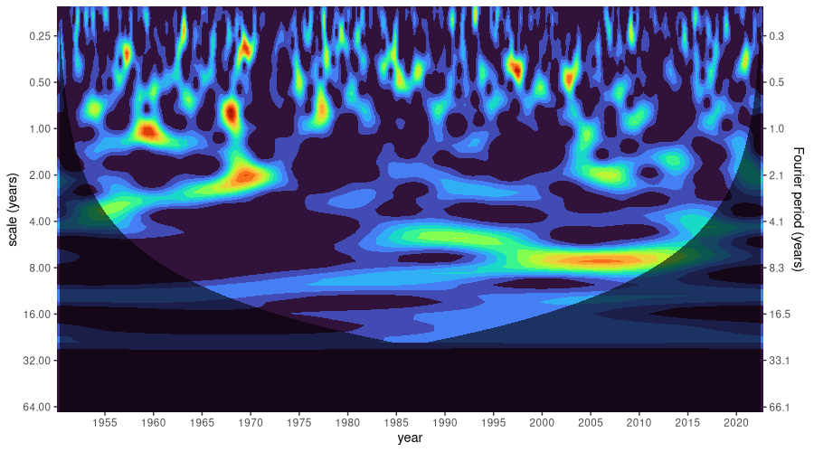
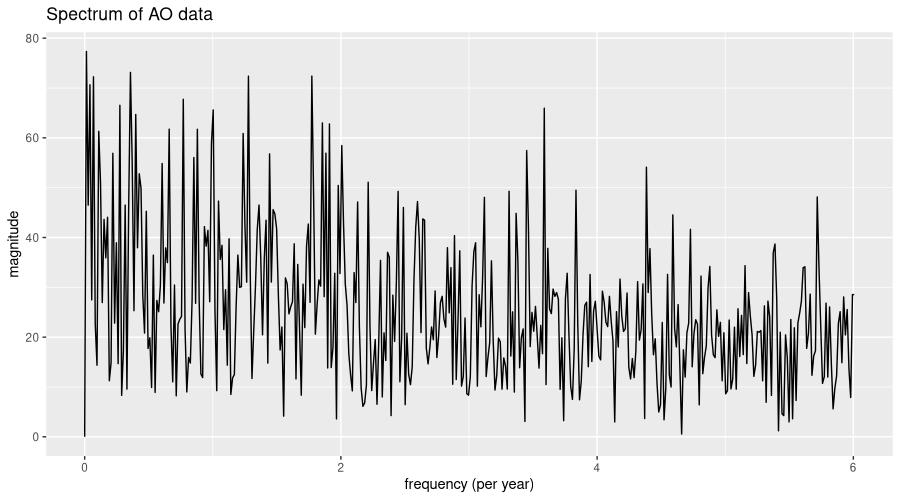
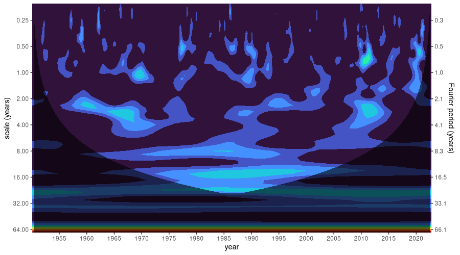

```{r setup, include=FALSE}
knitr::opts_chunk$set(echo = TRUE, eval = FALSE, fig.width = 6, fig.height = 6)
```

Recently, we showed how to use `torch` for [wavelet analysis](https://blogs.rstudio.com/ai/posts/2022-10-27-wavelets/). A member of the family of spectral analysis methods, wavelet analysis bears some similarity to the Fourier Transform, and specifically, to its popular two-dimensional application, the spectrogram.

As explained in that book excerpt, though, there are significant differences. For the purposes of the current post, it suffices to know that frequency-domain patterns are discovered by having a little "wave" (that, really, can be of any shape) "slide" over the data, computing degree of match (or mismatch) in the neighborhood of every sample.

With this post, then, my goal is two-fold.

First, to introduce [torchwavelets](https://github.com/skeydan/torchwavelets){.uri}, a tiny, yet useful package that automates all of the essential steps involved. Compared to the Fourier Transform and its applications, the topic of wavelets is rather "chaotic" -- meaning, it enjoys much less shared terminology, and much less shared practice. Consequently, it makes sense for implementations to follow established, community-embraced approaches, whenever such are available and well documented. With `torchwavelets`, we provide an implementation of Torrence and Compo's 1998 "Practical Guide to Wavelet Analysis" (@Torrence.Compo1998), an oft-cited paper that proved influential across a wide range of application domains. Code-wise, our package is mostly a port of [Tom Runia's PyTorch implementation](https://github.com/QUVA-Lab/PyTorchWavelets/), itself based on a prior implementation by [Aaron O'Leary](https://github.com/aaren/wavelets/).

Resuming from the above, my second goal is to show an attractive use case of wavelet analysis in an area of great scientific interest (meteorology/climatology) and tremendous social importance. Being by no means an expert myself, I'd like to hope this could be inspiring to people working in these fields, as well as to scientists and analysts in other areas where temporal data arise.

Concretely, what we'll do is take three different atmospheric phenomena -- El Niño--Southern Oscillation (ENSO), North Atlantic Oscillation (NAO), and Arctic Oscillation (AO) -- and investigate them using wavelet analysis. In each case, we also look at the overall frequency spectrum, given by the Discrete Fourier Transform (DFT), as well as a classic time-series decomposition into trend, seasonal components, and remainder.

## Three oscillations

By far the best-known -- the most infamous, I should say -- among the three is [El Niño--Southern Oscillation (ENSO)](https://en.wikipedia.org/wiki/El_Ni%C3%B1o%E2%80%93Southern_Oscillation), a.k.a. El Niño/La Niña. The term refers to a changing pattern of sea surface temperatures and sea-level pressures occurring in the equatorial Pacific. Both El Niño and La Niña can and do have catastrophic impact on people's lives, most notably, for people in developing countries west and east of the Pacific.

El Niño occurs when surface water temperatures in the eastern Pacific are higher than normal, and the strong winds that normally blow from east to west are unusually weak. From April to October, this leads to hot, extremely wet weather conditions along the coasts of northern Peru and Ecuador, continually resulting in major floods. La Niña, on the other hand, causes a drop in sea surface temperatures over Southeast Asia as well as heavy rains over Malaysia, the Philippines, and Indonesia. While these are the areas most gravely impacted, changes in ENSO reverberate across the globe.

Less well known than ENSO, but highly influential as well, is the [North Atlantic Oscillation (NAO)](https://en.wikipedia.org/wiki/North_Atlantic_oscillation). It strongly affects winter weather in Europe, Greenland, and North America. Its two states relate to the size of the pressure difference between the Icelandic High and the Azores Low. When the pressure difference is high, the jet stream -- those strong westerly winds that blow between North America and Northern Europe -- is yet stronger than normal, leading to warm, wet European winters and calmer-than-normal conditions in Eastern North America. With a lower-than-normal pressure difference, however, the American East tends to incur more heavy storms and cold-air outbreaks, while winters in Northern Europe are colder and more dry.

Finally, the [Arctic Oscillation (AO)](https://en.wikipedia.org/wiki/Arctic_oscillation) is a ring-like pattern of sea-level pressure anomalies centered at the North Pole. (Its Southern-hemisphere equivalent is the [Antarctic Oscillation](https://en.wikipedia.org/wiki/Antarctic_oscillation).) AO's influence extends beyond the Arctic Circle, however; it is indicative of whether and how much Arctic air flows down into the middle latitudes. AO and NAO are strongly related, and might designate the same physical phenomenon at a fundamental level.

Now, let's make these characterizations more concrete by looking at actual data.

## Analysis: ENSO

We begin with the best-known of these phenomena: ENSO. Data are available from 1854 onwards; however, for comparability with AO, we discard all records prior to January, 1950. For analysis, we pick `NINO34_MEAN`, the monthly average sea surface temperature in the Niño 3.4 region (i.e., the area between 5° South, 5° North, 190° East, and 240° East). Finally, we convert to a `tsibble`, the format expected by `feasts::STL()`.

```{r}
library(tidyverse)
library(tsibble)

download.file(
  "https://bmcnoldy.rsmas.miami.edu/tropics/oni/ONI_NINO34_1854-2022.txt",
  destfile = "ONI_NINO34_1854-2022.txt"
)

enso <- read_table("ONI_NINO34_1854-2022.txt", skip = 9) %>%
  mutate(x = yearmonth(as.Date(paste0(YEAR, "-", `MON/MMM`, "-01")))) %>%
  select(x, enso = NINO34_MEAN) %>%
  filter(x >= yearmonth("1950-01"), x <= yearmonth("2022-09")) %>%
  as_tsibble(index = x)

enso
```

    # A tsibble: 873 x 2 [1M]
              x  enso
          <mth> <dbl>
     1 1950 Jan  24.6
     2 1950 Feb  25.1
     3 1950 Mar  25.9
     4 1950 Apr  26.3
     5 1950 May  26.2
     6 1950 Jun  26.5
     7 1950 Jul  26.3
     8 1950 Aug  25.9
     9 1950 Sep  25.7
    10 1950 Oct  25.7
    # … with 863 more rows

As already announced, we want to look at seasonal decomposition, as well. In terms of seasonal periodicity, what do we expect? Unless told otherwise, `feasts::STL()` will happily pick a window size for us. However, there'll likely be several important frequencies in the data. (Not wanting to ruin the suspense, but for AO and NAO, this will definitely be the case!). Besides, we want to compute the Fourier Transform anyway, so why not do that first?

Here is the power spectrum:

```{r}
library(torch)
fft <- torch_fft_fft(as.numeric(scale(enso$enso)))

```

In the below plot, the x axis corresponds to frequencies, expressed as "number of times per year". We only display frequencies up to and including the Nyquist frequency, i.e., half the sampling rate, which in our case is 12 (per year).

```{r}
num_samples <- nrow(enso)
nyquist_cutoff <- ceiling(num_samples / 2) # highest discernible frequency
bins_below_nyquist <- 0:nyquist_cutoff

sampling_rate <- 12 # per year
frequencies_per_bin <- sampling_rate / num_samples
frequencies <- frequencies_per_bin * bins_below_nyquist

df <- data.frame(f = frequencies, y = as.numeric(fft[1:(nyquist_cutoff + 1)]$abs()))
df %>% ggplot(aes(f, y)) +
  geom_line() +
  xlab("frequency (per year)") +
  ylab("magnitude") +
  ggtitle("Spectrum of Niño 3.4 data")
```


There is one dominant frequency, corresponding to about once a year. From this component alone, we'd expect one El Niño event -- or equivalently, one La Niña -- per year. But let's locate important frequencies more precisely. With not many other periodicities standing out, we may as well restrict ourselves to three:

```{r}
strongest <- torch_topk(fft[1:(nyquist_cutoff/2)]$abs(), 3)
strongest
```

    [[1]]
    torch_tensor
    233.9855
    172.2784
    142.3784
    [ CPUFloatType{3} ]

    [[2]]
    torch_tensor
    74
    21
    7
    [ CPULongType{3} ]

What we have here are the magnitudes of the dominant components, as well as their respective bins in the spectrum. Let's see which actual frequencies these correspond to:

```{r}
important_freqs <- frequencies[as.numeric(strongest[[2]])]
important_freqs
```

    [1] 1.00343643 0.27491409 0.08247423 

That's once per year, once per quarter, and once every twelve years, approximately. Or, expressed as periodicity, in terms of months (i.e., how many months are there in a period):

```{r}
num_observations_in_season <- 12/important_freqs  
num_observations_in_season
```

    [1] 11.95890  43.65000 145.50000  

We now pass these to `feasts::STL()`, to obtain a five-fold decomposition into trend, seasonal components, and remainder.

```{r}
library(feasts)
enso %>%
  model(STL(enso ~ season(period = 12) + season(period = 44) +
              season(period = 145))) %>%
  components() %>%
  autoplot()
```


According to Loess decomposition, there still is significant noise in the data -- the remainder remaining high despite our hinting at important seasonalities. In fact, there is no big surprise in that: Looking back at the DFT output, not only are there many, close to one another, low- and lowish-frequency components, but in addition, high-frequency components just won't cease to contribute. And really, as of today, ENSO forecasting -- tremendously important in terms of human impact -- is focused on predicting oscillation state just a year in advance. This will be interesting to keep in mind for when we proceed to the other series -- as you'll see, it'll only get worse.

By now, we're well informed about how dominant temporal rhythms determine, or fail to determine, what actually happens in atmosphere and ocean. But we don't know anything about whether, and how, those rhythms may have varied in strength over the time span considered. This is where wavelet analysis comes in.

In `torchwavelets`{spellcheck="false"}, the central operation is a call to `wavelet_transform()`, to instantiate an object that takes care of all required operations. One argument is required: `signal_length`, the number of data points in the series. And one of the defaults we *need* to override: `dt`, the time between samples, expressed in the unit we're working with. In our case, that's *year*, and, having monthly samples, we need to pass a value of 1/12. With all other defaults untouched, analysis will be done using the [Morlet wavelet](https://en.wikipedia.org/wiki/Morlet_wavelet) (available alternatives are [Mexican Hat](https://en.wikipedia.org/wiki/Ricker_wavelet) and [Paul](https://reference.wolfram.com/language/ref/PaulWavelet.html)), and the transform will be computed in the Fourier domain (the fastest way, unless you have a GPU).

```{r}
library(torchwavelets)
enso_idx <- enso$enso %>% as.numeric() %>% torch_tensor()
dt <- 1/12
wtf <- wavelet_transform(length(enso_idx), dt = dt)

```

A call to `power()` will then compute the wavelet transform:

```{r}
power_spectrum <- wtf$power(enso_idx)
power_spectrum$shape
```

    [1]  71 873

The result is two-dimensional. The second dimension holds measurement times, i.e., the months between January, 1950 and September, 2022. The first dimension warrants some more explanation.

Namely, we have here the set of scales the transform has been computed for. If you're familiar with the Fourier Transform and its analogue, the spectrogram, you'll probably think in terms of time versus frequency. With wavelets, there is an additional parameter, the scale, that determines the spread of the analysis pattern.

<aside>The aforementioned [book excerpt](https://blogs.rstudio.com/ai/posts/2022-10-27-wavelets/) discusses this in detail.</aside>

Some wavelets have both a scale and a frequency, in which case these can interact in complex ways. Others are defined such that no separate frequency appears. In the latter case, you immediately end up with the time vs. scale layout we see in wavelet diagrams (scaleograms). In the former, most software hides the complexity by merging scale and frequency into one, leaving just scale as a user-visible parameter. In `torchwavelets`, too, the wavelet frequency (if existent) has been "streamlined away". Consequently, we'll end up plotting time versus scale, as well. I'll say more when we actually see such a scaleogram.

For visualization, we transpose the data and put it into a `ggplot`-friendly format:

```{r}
times <- lubridate::year(enso$x) + lubridate::month(enso$x) / 12
scales <- as.numeric(wtf$scales)

df <- as_tibble(as.matrix(power_spectrum$t()), .name_repair = "universal") %>%
  mutate(time = times) %>%
  pivot_longer(!time, names_to = "scale", values_to = "power") %>%
  mutate(scale = scales[scale %>%
    str_remove("[\\.]{3}") %>%
    as.numeric()])
df %>% glimpse()
```

    Rows: 61,983
    Columns: 3
    $ time  <dbl> 1950.083, 1950.083, 1950.083, 1950.083, 195…
    $ scale <dbl> 0.1613356, 0.1759377, 0.1918614, 0.2092263,…
    $ power <dbl> 0.03617507, 0.05985500, 0.07948010, 0.09819…

There is one additional piece of information to be incorporated, still: the so-called "cone of influence" (COI). Visually, this is a shading that tells us which part of the plot reflects incomplete, and thus, unreliable and to-be-disregarded, data. Namely, the bigger the scale, the more spread-out the analysis wavelet, and the more incomplete the overlap at the borders of the series when the wavelet slides over the data. You'll see what I mean in a second.

The COI gets its own data frame:

```{r}
coi <- wtf$coi(times[1], times[length(enso_idx)])
coi_df <- data.frame(x = as.numeric(coi[[1]]), y = as.numeric(coi[[2]]))
```

And now we're ready to create the scaleogram:

```{r}
labeled_scales <- c(0.25, 0.5, 1, 2, 4, 8, 16, 32, 64)
labeled_frequencies <- round(as.numeric(wtf$fourier_period(labeled_scales)), 1)

ggplot(df) +
  scale_y_continuous(
    trans = scales::compose_trans(scales::log2_trans(), scales::reverse_trans()),
    breaks = c(0.25, 0.5, 1, 2, 4, 8, 16, 32, 64),
    limits = c(max(scales), min(scales)),
    expand = c(0, 0),
    sec.axis = dup_axis(
      labels = scales::label_number(labeled_frequencies),
      name = "Fourier period (years)"
    )
  ) +
  ylab("scale (years)") +
  scale_x_continuous(breaks = seq(1950, 2020, by = 5), expand = c(0, 0)) +
  xlab("year") +
  geom_contour_filled(aes(time, scale, z = power), show.legend = FALSE) +
  scale_fill_viridis_d(option = "turbo") +
  geom_ribbon(data = coi_df, aes(x = x, ymin = y, ymax = max(scales)),
              fill = "black", alpha = 0.6) +
  theme(legend.position = "none")
```


What we see here is how, in ENSO, different rhythms have prevailed over time. Instead of "rhythms", I could have said "scales", or "frequencies", or "periods" -- all those translate into one another. Since, to us humans, wavelet scales don't mean that much, the period (in years) is displayed on an additional y axis on the right.

So, we see that in the eighties, an (approximately) four-year period had exceptional influence. Thereafter, yet longer periodicities gained in dominance. And, in accordance with what we expect from prior analysis, there is a *basso continuo* of annual similarity.

Also, note how, at first sight, there seems to have been a decade where a six-year period stood out: right at the beginning of where (for us) measurement starts, in the fifties. However, the dark shading -- the COI -- tells us that, in this region, the data is not to be trusted.

Summing up, the two-dimensional analysis nicely complements the more compressed characterization we got from the DFT. Before we move on to the next series, however, let me just quickly address one question, in case you were wondering (if not, just read on, since I won't be going into details anyway): How is this different from a spectrogram?

In a nutshell, the spectrogram splits the data into several "windows", and computes the DFT independently on all of them. To compute the scaleogram, on the other hand, the analysis wavelet slides continuously over the data, resulting in a spectrum-equivalent for the neighborhood of each sample in the series. With the spectrogram, a fixed window size means that not all frequencies are resolved equally well: The higher frequencies appear more frequently in the interval than the lower ones, and thus, will allow for better resolution. Wavelet analysis, in contrast, is done on a set of scales deliberately arranged so as to capture a broad range of frequencies theoretically visible in a series of given length.

<aside>Take a look at the aforementioned [book excerpt](https://blogs.rstudio.com/ai/posts/2022-10-27-wavelets/) to see spectrogram and scaleogram compared in a nice application.</aside>

## Analysis: NAO

The data file for NAO is in fixed-table format. After conversion to a `tsibble`, we have:

```{r}
download.file(
 "https://crudata.uea.ac.uk/cru/data//nao/nao.dat",
 destfile = "nao.dat"
)

# needed for AO, as well
use_months <- seq.Date(
  from = as.Date("1950-01-01"),
  to = as.Date("2022-09-01"),
  by = "months"
)

nao <-
  read_table(
    "nao.dat",
    col_names = FALSE,
    na = "-99.99",
    skip = 3
  ) %>%
  select(-X1, -X14) %>%
  as.matrix() %>%
  t() %>%
  as.vector() %>%
  .[1:length(use_months)] %>%
  tibble(
    x = use_months,
    nao = .
  ) %>%
  mutate(x = yearmonth(x)) %>%
  fill(nao) %>%
  as_tsibble(index = x)

nao
```

    # A tsibble: 873 x 2 [1M]
              x   nao
          <mth> <dbl>
     1 1950 Jan -0.16
     2 1950 Feb  0.25
     3 1950 Mar -1.44
     4 1950 Apr  1.46
     5 1950 May  1.34
     6 1950 Jun -3.94
     7 1950 Jul -2.75
     8 1950 Aug -0.08
     9 1950 Sep  0.19
    10 1950 Oct  0.19
    # … with 863 more rows

Like before, we start with the spectrum:

```{r}
fft <- torch_fft_fft(as.numeric(scale(nao$nao)))

num_samples <- nrow(nao)
nyquist_cutoff <- ceiling(num_samples / 2)
bins_below_nyquist <- 0:nyquist_cutoff

sampling_rate <- 12 
frequencies_per_bin <- sampling_rate / num_samples
frequencies <- frequencies_per_bin * bins_below_nyquist

df <- data.frame(f = frequencies, y = as.numeric(fft[1:(nyquist_cutoff + 1)]$abs()))
df %>% ggplot(aes(f, y)) +
  geom_line() +
  xlab("frequency (per year)") +
  ylab("magnitude") +
  ggtitle("Spectrum of NAO data")
```


Have you been wondering, for a tiny moment, whether this was time-domain data -- not spectral? It does look a lot more noisy than the ENSO spectrum for sure. And really, with NAO, predictability is much worse - forecast lead time usually amounts to just [one or two weeks](https://www.cpc.ncep.noaa.gov/products/precip/CWlink/pna/nao_index_mrf.shtml).

Proceeding as before, we pick dominant seasonalities (at least this still is possible!) to pass to `feasts::STL()`.

```{r}
strongest <- torch_topk(fft[1:(nyquist_cutoff/2)]$abs(), 6)
strongest

```

    [[1]]
    torch_tensor
    102.7191
    80.5129
    76.1179
    75.9949
    72.9086
    60.8281
    [ CPUFloatType{6} ]

    [[2]]
    torch_tensor
    147
    99
    146
    59
    33
    78
    [ CPULongType{6} ]

```{r}
important_freqs <- frequencies[as.numeric(strongest[[2]])]
important_freqs
```

    [1] 2.0068729 1.3470790 1.9931271 0.7972509 0.4398625 1.0584192

```{r}
num_observations_in_season <- 12/important_freqs  
num_observations_in_season
```

    [1]  5.979452  8.908163  6.020690 15.051724 27.281250 11.337662

Important seasonal periods are of length six, nine, eleven, fifteen, and twenty-seven months, approximately - pretty close together indeed! No wonder that, in STL decomposition, the remainder is even more significant than with ENSO:

```{r}
nao %>%
  model(STL(nao ~ season(period = 6) + season(period = 9) +
              season(period = 15) + season(period = 27) +
              season(period = 12))) %>%
  components() %>%
  autoplot()
```


Now, what will we see in terms of temporal evolution? Much of the code that follows is the same as for ENSO, repeated here for the reader's convenience:

```{r}
nao_idx <- nao$nao %>% as.numeric() %>% torch_tensor()
dt <- 1/12 # same interval as for ENSO
wtf <- wavelet_transform(length(nao_idx), dt = dt)
power_spectrum <- wtf$power(nao_idx)

times <- lubridate::year(nao$x) + lubridate::month(nao$x)/12 # also same
scales <- as.numeric(wtf$scales) # will be same because both series have same length

df <- as_tibble(as.matrix(power_spectrum$t()), .name_repair = "universal") %>%
  mutate(time = times) %>%
  pivot_longer(!time, names_to = "scale", values_to = "power") %>%
  mutate(scale = scales[scale %>%
    str_remove("[\\.]{3}") %>%
    as.numeric()])

coi <- wtf$coi(times[1], times[length(nao_idx)])
coi_df <- data.frame(x = as.numeric(coi[[1]]), y = as.numeric(coi[[2]]))

labeled_scales <- c(0.25, 0.5, 1, 2, 4, 8, 16, 32, 64) # same since scales are same 
labeled_frequencies <- round(as.numeric(wtf$fourier_period(labeled_scales)), 1)

ggplot(df) +
  scale_y_continuous(
    trans = scales::compose_trans(scales::log2_trans(), scales::reverse_trans()),
    breaks = c(0.25, 0.5, 1, 2, 4, 8, 16, 32, 64),
    limits = c(max(scales), min(scales)),
    expand = c(0, 0),
    sec.axis = dup_axis(
      labels = scales::label_number(labeled_frequencies),
      name = "Fourier period (years)"
    )
  ) +
  ylab("scale (years)") +
  scale_x_continuous(breaks = seq(1950, 2020, by = 5), expand = c(0, 0)) +
  xlab("year") +
  geom_contour_filled(aes(time, scale, z = power), show.legend = FALSE) +
  scale_fill_viridis_d(option = "turbo") +
  geom_ribbon(data = coi_df, aes(x = x, ymin = y, ymax = max(scales)),
              fill = "black", alpha = 0.6) +
  theme(legend.position = "none")
```



That, literally, is a much more colorful picture than with ENSO! High frequencies are present, and continually dominant, over the whole time period.

Interestingly, though, we see similarities to ENSO, as well: In both, there is an important pattern, of periodicity four or slightly more years, that exerces influence during the eighties, nineties, and early two-thousands -- only with ENSO, it shows peak impact during the nineties, while with NAO, its dominance is most visible in the first decade of this century. Also, both phenomena exhibit a strongly visible peak, of period two years, around 1970. So, is there a close(-ish) connection between both oscillations? This question, of course, is for the domain experts to answer. At least I found a recent study (@scaife2014skillful) that not only suggests there is, but uses one (ENSO, the more predictable one) to inform forecasts of the other:

> Previous studies have shown that the El Niño--Southern Oscillation can drive interannual variations in the NAO [Brönnimann et al., 2007] and hence Atlantic and European winter climate via the stratosphere [Bell et al., 2009]. [...] this teleconnection to the tropical Pacific is active in our experiments, with forecasts initialized in El Niño/La Niña conditions in November tending to be followed by negative/positive NAO conditions in winter.

Will we see a similar relationship for AO, our third series under investigation? We might expect so, since AO and NAO are closely related (or even, two sides of the same coin).

## Analysis: AO

First, the data:

```{r}
download.file(
 "https://www.cpc.ncep.noaa.gov/products/precip/CWlink/daily_ao_index/monthly.ao.index.b50.current.ascii.table",
 destfile = "ao.dat"
)

ao <-
  read_table(
    "ao.dat",
    col_names = FALSE,
    skip = 1
  ) %>%
  select(-X1) %>%
  as.matrix() %>% 
  t() %>%
  as.vector() %>%
  .[1:length(use_months)] %>%
  tibble(x = use_months,
         ao = .) %>%
  mutate(x = yearmonth(x)) %>%
  fill(ao) %>%
  as_tsibble(index = x) 

ao
```

    # A tsibble: 873 x 2 [1M]
              x     ao
          <mth>  <dbl>
     1 1950 Jan -0.06 
     2 1950 Feb  0.627
     3 1950 Mar -0.008
     4 1950 Apr  0.555
     5 1950 May  0.072
     6 1950 Jun  0.539
     7 1950 Jul -0.802
     8 1950 Aug -0.851
     9 1950 Sep  0.358
    10 1950 Oct -0.379
    # … with 863 more rows

And the spectrum:

```{r}
fft <- torch_fft_fft(as.numeric(scale(ao$ao)))

num_samples <- nrow(ao)
nyquist_cutoff <- ceiling(num_samples / 2)
bins_below_nyquist <- 0:nyquist_cutoff

sampling_rate <- 12 # per year
frequencies_per_bin <- sampling_rate / num_samples
frequencies <- frequencies_per_bin * bins_below_nyquist

df <- data.frame(f = frequencies, y = as.numeric(fft[1:(nyquist_cutoff + 1)]$abs()))
df %>% ggplot(aes(f, y)) +
  geom_line() +
  xlab("frequency (per year)") +
  ylab("magnitude") +
  ggtitle("Spectrum of AO data")
```



Well, this spectrum looks even more random than NAO's, in that not even a single frequency stands out. For completeness, here is the STL decomposition:

```{r}
strongest <- torch_topk(fft[1:(nyquist_cutoff/2)]$abs(), 5)

important_freqs <- frequencies[as.numeric(strongest[[2]])]
important_freqs
# [1] 0.01374570 0.35738832 1.77319588 1.27835052 0.06872852

num_observations_in_season <- 12/important_freqs  
num_observations_in_season
# [1] 873.000000  33.576923   6.767442   9.387097 174.600000 

ao %>%
  model(STL(ao ~ season(period = 33) + season(period = 7) +
              season(period = 9) + season(period = 174))) %>%
  components() %>%
  autoplot()

```

{alt="Decomposition of NAO data into trend, seasonal components, and remainder by feasts::STL()."}

Finally, what can the scaleogram tell us about dominant patterns?

```{r}
ao_idx <- ao$ao %>% as.numeric() %>% torch_tensor()
dt <- 1/12 # same interval as for ENSO and NAO
wtf <- wavelet_transform(length(ao_idx), dt = dt)
power_spectrum <- wtf$power(ao_idx)

times <- lubridate::year(ao$x) + lubridate::month(ao$x)/12 # also same
scales <- as.numeric(wtf$scales) # will be same because all series have same length

df <- as_tibble(as.matrix(power_spectrum$t()), .name_repair = "universal") %>%
  mutate(time = times) %>%
  pivot_longer(!time, names_to = "scale", values_to = "power") %>%
  mutate(scale = scales[scale %>%
    str_remove("[\\.]{3}") %>%
    as.numeric()])

coi <- wtf$coi(times[1], times[length(ao_idx)])
coi_df <- data.frame(x = as.numeric(coi[[1]]), y = as.numeric(coi[[2]]))

labeled_scales <- c(0.25, 0.5, 1, 2, 4, 8, 16, 32, 64) # same since scales are same 
labeled_frequencies <- round(as.numeric(wtf$fourier_period(labeled_scales)), 1)

ggplot(df) +
  scale_y_continuous(
    trans = scales::compose_trans(scales::log2_trans(), scales::reverse_trans()),
    breaks = c(0.25, 0.5, 1, 2, 4, 8, 16, 32, 64),
    limits = c(max(scales), min(scales)),
    expand = c(0, 0),
    sec.axis = dup_axis(
      labels = scales::label_number(labeled_frequencies),
      name = "Fourier period (years)"
    )
  ) +
  ylab("scale (years)") +
  scale_x_continuous(breaks = seq(1950, 2020, by = 5), expand = c(0, 0)) +
  xlab("year") +
  geom_contour_filled(aes(time, scale, z = power), show.legend = FALSE) +
  scale_fill_viridis_d(option = "turbo") +
  geom_ribbon(data = coi_df, aes(x = x, ymin = y, ymax = max(scales)),
              fill = "black", alpha = 0.6) +
  theme(legend.position = "none")

```



Having seen the overall spectrum, the lack of strongly dominant patterns in the scaleogram does not come as a big surprise. It is tempting -- for me, at least -- to see a reflection of ENSO around 1970, all the more since by transitivity, AO and ENSO should be related in some way. But here, qualified judgment really is reserved to the experts.

## Conclusion

Like I said in the beginning, this post would be about inspiration, not technical detail or reportable results. And I hope that inspirational it has been, at least a little bit. If you're experimenting with wavelets yourself, or plan to -- or if you work in the atmospheric sciences, and would like to provide some insight on the above data/phenomena -- we'd love to hear from you!

As always, thanks for reading!


