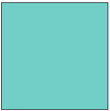
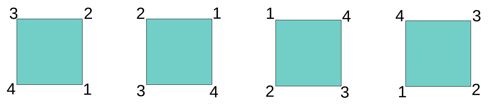
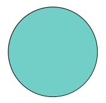

```{r setup, include=FALSE}
knitr::opts_chunk$set(echo = TRUE, eval = FALSE, fig.width = 6, fig.height = 6)
```

This is the first in a series of posts on group-equivariant convolutional neural networks (GCNNs). Today, we keep it short, high-level, and conceptual; examples and implementations will follow. In looking at GCNNs, we are resuming a topic we first [wrote about](https://blogs.rstudio.com/ai/posts/2021-08-26-geometric-deep-learning/) in 2021: [Geometric Deep Learning](https://geometricdeeplearning.com/), a principled, math-driven approach to network design that, since then, has only risen in scope and impact.

## From alchemy to science: Geometric Deep Learning in two minutes

In a nutshell, Geometric Deep Learning is all about deriving network structure from two things: the domain, and the task. The posts will go into a lot of detail, but let me give a quick preview here:

-   By domain, I'm referring to the underlying physical space, and the way it is represented in the input data. For example, images are usually coded as a two-dimensional grid, with values indicating pixel intensities.[^1]
-   The task is what we're training the network to do: classification, say, or segmentation. Tasks may be different at different stages in the architecture. At each stage, the task in question will have its word to say about how layer design should look.

[^1]: That's when the image has a single channel. Otherwise, there are a number of grids, each mapped to a separate channel.

For instance, take MNIST. The dataset consists of images of ten digits, 0 to 10, all gray-scale. The task -- unsurprisingly -- is to assign each image the digit represented.

First, consider the domain. A $7$ is a $7$ wherever it appears on the grid. We thus need an operation that is *translation-equivariant*: It flexibly adapts to shifts (translations) in its input. More concretely, in our context, *equivariant* operations are able to detect some object's properties even if that object has been moved, vertically and/or horizontally, to another location. *Convolution*, ubiquitous not just in deep learning, is just such a shift-equivariant operation.

Let me call special attention to the fact that, in equivariance, the essential thing is that "flexible adaptation." Translation-equivariant operations *do* care about an object's new position; they record a feature not abstractly, but at the object's new position. To see why this is important, consider the network as a whole. When we compose convolutions, we build a hierarchy of feature detectors. That hierarchy should be functional no matter where in the image. In addition, it has to be consistent: Location information needs to be preserved between layers.

Terminology-wise, thus, it is important to distinguish equivariance from *invariance*. An invariant operation, in our context, would still be able to spot a feature wherever it occurs; however, it would happily forget where that feature happened to be. Clearly, then, to build up a hierarchy of features, translation-*invariance* is not enough.

What we've done right now is derive a requirement from the domain, the input grid. What about the task? If, finally, all we're supposed to do is name the digit, now suddenly location does not matter anymore. In other words, once the hierarchy exists, invariance *is* enough. In neural networks, *pooling* is an operation that forgets about (spatial) detail. It only cares about the mean, say, or the maximum value itself. This is what makes it suited to "summing up" information about a region, or a complete image, if at the end we only care about returning a class label.

In a nutshell, we were able to formulate a design wishlist based on (1) what we're given and (2) what we're tasked with.

After this high-level sketch of Geometric Deep Learning, we zoom in on this series of posts' designated topic: *group-equivariant* convolutional neural networks.

The why of "equivariant" should not, by now, pose too much of a riddle. What about that "group" prefix, though?

## The "group" in group-equivariance

As you may have guessed from the introduction, talking of "principled" and "math-driven", this *really* is about groups in the "math sense." Depending on your background, the last time you heard about groups was in school, and with not even a hint at why they matter. I'm certainly not qualified to summarize the whole richness of what they're good for, but I hope that by the end of this post, their importance in deep learning will make intuitive sense.

### Groups from symmetries

Here is a square.

```{r, echo=FALSE, eval=TRUE, fig.alt = "A square in its default position, aligned horizontally to a virtual (invisible) x-axis."}

```

Now close your eyes.

Now look again. Did something happen to the square?

```{r, echo=FALSE, eval=TRUE, fig.alt = "A square in its default position, aligned horizontally to a virtual (invisible) x-axis."}

```

You can't tell. Maybe it was rotated; maybe it was not. On the other hand, what if the vertices were numbered?

```{r, echo=FALSE, eval=TRUE, fig.alt = "A square in its default position, with vertices numbered from 1 to 4, starting in the lower right corner and counting ant-clockwise."}
knitr::include_graphics("images/square2.png")
```

Now you'd know.

Without the numbering, could I have rotated the square in any way I wanted? Evidently not. This would not go through unnoticed:

```{r, echo=FALSE, eval=TRUE, fig.alt = "A square, rotated anti-clockwise by a few degrees."}
knitr::include_graphics("images/square3.png")
```

There are exactly four ways I could have rotated the square without raising suspicion. Those ways can be referred to in different ways; one simple way is by degree of rotation: 90, 180, or 270 degrees. Why not more? Any further addition of 90 degrees would result in a configuration we've already seen.

```{r, echo=FALSE, eval=TRUE, fig.alt = "Four squares, with numbered vertices each. The first has vertex 1 on the lower right, the second one rotation up, on the upper right, and so on."}

```

The above picture shows three squares, but I've listed three possible rotations. What about the situation on the left, the one I've taken as an initial state? It could be reached by rotating 360 degrees (or twice that, or thrice, or ...) But the way this is handled, in math, is by treating it as some sort of "null rotation", analogously to how $0$ acts in addition, $1$ in multiplication, or the identity matrix in linear algebra.

Altogether, we thus have four *actions* that could be performed on the square (an un-numbered square!) that would leave it as-is, or *invariant*. These are called the *symmetries* of the square. A symmetry, in math/physics, is a quantity that remains the same no matter what happens as time evolves. And this is where groups come in. *Groups* -- concretely, their *elements* -- effectuate actions like rotation.

Before I spell out how, let me give another example. Take this sphere.

```{r, echo=FALSE, eval=TRUE, fig.alt = "A sphere, colored uniformly."}

```

How many symmetries does a sphere have? Infinitely many. This implies that whatever group is chosen to act on the square, it won't be much good to represent the symmetries of the sphere.

### Viewing groups through the *action* lens

Following these examples, let me generalize. Here is typical definition. [^2]

[^2]: From [Wolfram Alpha](https://mathworld.wolfram.com/Group.html) (beginning of article).

> A group $G$ is a finite or infinite set of elements together with a binary operation (called the group operation) that together satisfy the four fundamental properties of closure, associativity, the identity property, and the inverse property. The operation with respect to which a group is defined is often called the "group operation," and a set is said to be a group "under" this operation. Elements $A$, $B$, $C$, ... with binary operation between $A$ and $B$ denoted $AB$ form a group if
>
> 1.  Closure: If $A$ and $B$ are two elements in $G$, then the product $AB$ is also in $G$.
>
> 2.  Associativity: The defined multiplication is associative, i.e., for all $A$,$B$,$C$ in $G$, $(AB)C=A(BC)$.
>
> 3.  Identity: There is an identity element $I$ (a.k.a. $1$, $E$, or $e$) such that $IA=AI=A$ for every element $A$ in $G$.
>
> 4.  Inverse: There must be an inverse (a.k.a. reciprocal) of each element. Therefore, for each element $A$ of $G$, the set contains an element $B=A^{-1}$ such that $AA^{-1}=A^{-1}A=I$.

In action-speak, group elements specify allowable actions; or more precisely, ones that are distinguishable from each other. Two actions can be composed; that's the "binary operation". The requirements now make intuitive sense:

1.  A combination of two actions -- two rotations, say -- is still an action of the same type (a rotation).
2.  If we have three such actions, it doesn't matter how we group them. (Their order of application has to remain the same, though.)
3.  One possible action is always the "null action". (Just like in life.) As to "doing nothing", it doesn't make a difference if that happens before or after a "something"; that "something" is always the final result.
4.  Every action needs to have an "undo button". In the squares example, if I rotate by 180 degrees, and then, by 180 degrees again, I am back in the original state. It is if I had done *nothing*.

Resuming a more "birds-eye view", what we've seen right now is the definition of a group by how its elements act on each other. But if groups are to matter "in the real world", they need to act on something outside (neural network components, for example). How this works is the topic of the following posts, but I'll briefly outline the intuition here.

## Outlook: Group-equivariant CNN

Above, we noted that, in image classification, a *translation*-invariant operation (like convolution) is needed: A $1$ is a $1$ whether moved horizontally, vertically, both ways, or not at all. What about rotations, though? Standing on its head, a digit is still what it is. Conventional convolution does not support this type of action.

We can add to our architectural wishlist by specifying a symmetry group. What group? If we wanted to detect squares aligned to the axes, a suitable group would be $C_4$, the cyclic group of order four. (Above, we saw that we needed four elements, and that we could *cycle* through the group.) If, on the other hand, we don't care about alignment, we'd want *any* position to count. In principle, we should end up in the same situation as we did with the sphere. However, images live on discrete grids; there won't be an unlimited number of rotations in practice.

With more realistic applications, we need to think more carefully. Take digits. When *is* a number "the same"? For one, it depends on the context. Were it about a hand-written address on an envelope, would we accept a $7$ as such had it been rotated by 90 degrees? Maybe. (Although we might wonder what would make someone change ball-pen position for just a single digit.) What about a $7$ standing on its head? On top of similar psychological considerations, we should be seriously unsure about the intended message, and, at least, down-weight the data point were it part of our training set.

Importantly, it also depends on the digit itself. A $6$, upside-down, is a $9$.

Zooming in on neural networks, there is room for yet more complexity. We know that CNNs build up a hierarchy of features, starting from simple ones, like edges and corners. Even if, for later layers, we may not want rotation equivariance, we would still like to have it in the initial set of layers. (The output layer -- we've hinted at that already -- is to be considered separately in any case, since its requirements result from the specifics of what we're tasked with.)

That's it for today. Hopefully, I've managed to illuminate a bit of *why* we would want to have group-equivariant neural networks. The question remains: How do we get them? This is what the subsequent posts in the series will be about.

Till then, and thanks for reading!

Photo by <a href="https://unsplash.com/@oinua?utm_source=unsplash&utm_medium=referral&utm_content=creditCopyText">Ihor OINUA</a> on <a href="https://unsplash.com/photos/1kKXKmcEtiA?utm_source=unsplash&utm_medium=referral&utm_content=creditCopyText">Unsplash</a>

